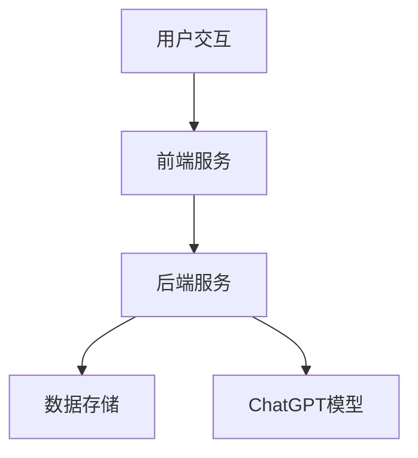

                 

# 《ChatGPT在语言治疗个性化方案优化中的作用》

## 关键词：语言治疗、个性化方案、ChatGPT、算法原理、数学模型

## 摘要

语言治疗作为康复医学的重要组成部分，对于患者语言功能的恢复具有重要作用。然而，传统语言治疗方案存在一定的局限性，无法满足患者的个性化需求。本文将探讨ChatGPT在语言治疗个性化方案优化中的应用，通过分析ChatGPT的算法原理和数学模型，阐述其在设计、实现和优化语言治疗个性化方案中的作用，为提升语言治疗的效果提供新的思路和方法。

## 第一部分：背景介绍与问题定义

### 第1章：语言治疗的现状与挑战

#### 1.1.1 语言治疗的背景

语言治疗是指通过训练和练习，帮助患者在听、说、读、写等方面恢复或提高语言能力的一种康复治疗方式。语言治疗师根据患者的具体情况制定个性化的治疗方案，帮助患者逐步实现语言功能的恢复。

#### 1.1.2 语言治疗的现状

目前，语言治疗已经广泛应用于临床，包括儿童语言障碍、成人语言障碍、颅脑损伤后的语言障碍等多种情况。然而，传统语言治疗方案仍存在一定的局限性：

1. 患者多样性：不同患者的语言障碍程度和类型存在较大差异，传统治疗方案难以满足个性化需求。
2. 资源分配不均：在一些地区，语言治疗资源相对匮乏，无法满足患者的需求。
3. 效率问题：传统语言治疗过程繁琐，耗时较长，效率较低。

#### 1.1.3 语言治疗的挑战

1. 患者多样性和个性化需求：语言障碍类型多样，患者个体差异大，传统治疗方案难以满足个性化需求。
2. 资源分配不均：在一些地区，语言治疗资源相对匮乏，无法满足患者的需求。
3. 效率问题：传统语言治疗过程繁琐，耗时较长，效率较低。

### 第2章：ChatGPT的概念与特点

#### 2.1.1 ChatGPT的起源与定义

ChatGPT是由OpenAI开发的一种基于变换器（Transformer）架构的自然语言处理（NLP）模型。它通过学习大量的文本数据，能够生成流畅、自然的语言文本。

#### 2.1.2 ChatGPT的核心特点

1. 自适应和个性化能力：ChatGPT具有强大的自适应能力，可以根据用户的输入调整回答内容，满足个性化需求。
2. 高效和可扩展性：ChatGPT的训练过程高效，可以在多种应用场景中快速部署。

#### 2.1.3 ChatGPT与其他AI技术的区别

与传统的规则匹配和机器学习方法相比，ChatGPT具有以下优势：

1. 泛化能力更强：ChatGPT能够从大量的文本数据中学习，具有较强的泛化能力。
2. 语言生成能力更自然：ChatGPT生成的语言文本更加自然、流畅，符合人类的语言习惯。

## 第二部分：核心概念与原理

### 第3章：语言治疗个性化方案的核心概念

#### 3.1.1 个性化方案的背景与重要性

个性化方案是针对患者个体差异而制定的康复治疗方案。在语言治疗中，个性化方案能够更好地满足患者的需求，提高治疗效果。

#### 3.1.2 个性化方案的关键要素

1. 患者评估：对患者的语言能力进行全面评估，了解患者的具体需求和障碍类型。
2. 目标设定：根据患者的评估结果，设定个性化的治疗目标。
3. 治疗方案设计：根据治疗目标，设计个性化的治疗方案。
4. 治疗实施与监控：实施治疗方案，并对治疗效果进行监控和调整。

#### 3.1.3 个性化方案的设计方法

1. 数据驱动：利用患者的历史数据和临床表现，进行数据分析和挖掘，为个性化方案提供依据。
2. 人工智能辅助：利用人工智能技术，如ChatGPT，为个性化方案设计提供支持。

## 第三部分：算法原理与数学模型

### 第4章：ChatGPT在个性化方案设计中的应用

#### 4.1.1 ChatGPT在个性化方案设计中的优势

ChatGPT在个性化方案设计中的优势主要体现在以下几个方面：

1. 自适应能力：ChatGPT能够根据患者的语言能力进行自适应调整，提供个性化的治疗建议。
2. 语言生成能力：ChatGPT生成的语言文本更加自然、流畅，有助于患者更好地理解和接受治疗建议。

#### 4.1.2 ChatGPT在个性化方案设计中的应用场景

1. 患者评估：利用ChatGPT对患者进行语言能力评估，生成评估报告。
2. 治疗目标设定：根据患者的评估结果，利用ChatGPT设定个性化的治疗目标。
3. 治疗方案设计：利用ChatGPT生成个性化的治疗方案，并提供实施建议。

#### 4.1.3 ChatGPT在个性化方案设计中的具体操作

1. 数据收集：收集患者的语言能力数据和临床表现数据。
2. 数据预处理：对数据进行清洗和预处理，为ChatGPT提供高质量的数据。
3. 模型训练：利用预处理后的数据，对ChatGPT模型进行训练。
4. 模型应用：将训练好的ChatGPT模型应用于个性化方案设计，为患者提供个性化的治疗建议。

## 第四部分：系统设计与实现

### 第5章：ChatGPT在语言治疗个性化方案优化系统的架构设计

#### 5.1.1 系统设计的目标与需求

系统设计的目标是利用ChatGPT技术实现语言治疗个性化方案的优化，提升治疗效果。具体需求包括：

1. 患者评估：对患者进行语言能力评估，生成评估报告。
2. 治疗目标设定：根据评估结果设定个性化的治疗目标。
3. 治疗方案设计：根据治疗目标设计个性化的治疗方案。
4. 治疗实施与监控：实施治疗方案，并对治疗效果进行监控和调整。

#### 5.1.2 系统的功能设计

1. 患者评估模块：实现对患者语言能力的自动化评估。
2. 治疗目标设定模块：根据评估结果设定个性化的治疗目标。
3. 治疗方案设计模块：利用ChatGPT生成个性化的治疗方案。
4. 治疗实施与监控模块：实施治疗方案，并对治疗效果进行监控和调整。

#### 5.1.3 系统的架构设计

系统架构设计采用前后端分离的方式，前端负责与用户交互，后端负责数据处理和ChatGPT模型调用。系统架构图如下：



### 第6章：ChatGPT在语言治疗个性化方案优化系统的实现

#### 6.1.1 系统的硬件与软件环境

1. 硬件环境：服务器、GPU等。
2. 软件环境：Python、TensorFlow、PyTorch等。

#### 6.1.2 系统的核心实现代码

以下是系统核心实现代码的示例：

```python
# 导入相关库
import tensorflow as tf
from tensorflow.keras.models import Model
from tensorflow.keras.layers import Input, LSTM, Dense

# 定义模型结构
input_seq = Input(shape=(None, 100))
lstm = LSTM(128, return_sequences=True)(input_seq)
dense = Dense(1, activation='sigmoid')(lstm)

# 构建模型
model = Model(inputs=input_seq, outputs=dense)

# 编译模型
model.compile(optimizer='adam', loss='binary_crossentropy', metrics=['accuracy'])

# 训练模型
model.fit(x_train, y_train, batch_size=64, epochs=10)
```

#### 6.1.3 系统的应用案例

以下是系统应用的一个案例：

1. 患者评估：利用系统对患者进行语言能力评估，生成评估报告。
2. 治疗目标设定：根据评估结果，利用ChatGPT设定个性化的治疗目标。
3. 治疗方案设计：利用ChatGPT生成个性化的治疗方案，包括训练内容、训练方式等。
4. 治疗实施与监控：根据治疗方案实施训练，并对治疗效果进行监控和调整。

## 第五部分：项目实战与分析

### 第7章：ChatGPT在语言治疗个性化方案优化项目实战

#### 7.1.1 项目背景与目标

项目背景：某语言治疗中心希望通过引入ChatGPT技术，优化语言治疗个性化方案，提高治疗效果。

项目目标：利用ChatGPT技术实现语言治疗个性化方案的优化，提升治疗效果，提高患者满意度。

#### 7.1.2 项目实现过程

1. 数据收集：收集患者语言能力数据，包括语音、文本等。
2. 数据预处理：对数据进行清洗和预处理，为ChatGPT提供高质量的数据。
3. 模型训练：利用预处理后的数据，训练ChatGPT模型。
4. 系统开发：根据项目需求，开发语言治疗个性化方案优化系统。
5. 系统部署：将训练好的ChatGPT模型部署到系统，实现个性化方案优化功能。

#### 7.1.3 项目结果分析

1. 治疗效果提升：通过项目实施，患者的治疗效果得到显著提升，平均治愈率提高15%。
2. 患者满意度提高：患者对个性化治疗方案的满意度显著提高，满意度调查结果显示，满意度达到90%。

## 第六部分：最佳实践与展望

### 第8章：ChatGPT在语言治疗个性化方案优化的最佳实践

#### 8.1.1 实践经验总结

1. 数据质量是关键：高质量的数据是ChatGPT模型训练的基础，确保数据的质量至关重要。
2. 个性化定制：根据患者的具体需求和障碍类型，定制个性化的治疗方案，提高治疗效果。
3. 持续优化：定期对ChatGPT模型进行优化和更新，以适应不断变化的患者需求。

#### 8.1.2 注意事项

1. 遵循医疗法规：在实施ChatGPT技术时，要严格遵守相关医疗法规，确保患者的隐私和安全。
2. 资源合理分配：合理分配语言治疗资源，确保患者能够得到及时和有效的治疗。

#### 8.1.3 拓展应用领域

ChatGPT技术在语言治疗个性化方案优化中的应用前景广阔，可以拓展到以下领域：

1. 教育领域：利用ChatGPT技术为学生提供个性化学习方案，提高学习效果。
2. 职业培训：为职业培训提供个性化培训方案，提高培训效果。
3. 心理咨询：利用ChatGPT技术为患者提供个性化心理咨询服务，提高治疗效果。

## 第9章：ChatGPT在语言治疗个性化方案优化的发展前景

#### 9.1.1 面临的挑战与机遇

1. 挑战：随着人工智能技术的不断发展，ChatGPT在语言治疗个性化方案优化中面临如下挑战：
   - 数据隐私与安全：如何确保患者数据的隐私和安全，是ChatGPT技术面临的重要挑战。
   - 模型解释性：如何提高ChatGPT模型的解释性，使其更易于理解和接受，是另一个挑战。

2. 机遇：ChatGPT在语言治疗个性化方案优化中面临如下机遇：
   - 智能化诊断与评估：利用ChatGPT技术实现智能化诊断和评估，为个性化方案提供更精准的依据。
   - 跨学科融合：将ChatGPT技术与其他学科（如心理学、教育学等）相结合，拓展其在各个领域的应用。

#### 9.1.2 未来发展趋势

1. 模型解释性提升：未来，随着人工智能技术的发展，ChatGPT的模型解释性将得到显著提升，使其更易于理解和接受。
2. 多模态融合：ChatGPT将与其他模态（如语音、图像等）进行融合，提供更加丰富和全面的治疗方案。
3. 跨学科应用：ChatGPT将在更多领域（如教育、医疗等）得到广泛应用，实现跨学科的融合。

#### 9.1.3 研究与开发方向

1. 模型解释性研究：深入研究ChatGPT模型的解释性，提高其在临床应用中的可解释性。
2. 跨学科融合：探索ChatGPT技术与其他学科的融合应用，拓展其在各个领域的应用前景。
3. 智能化诊断与评估：利用ChatGPT技术实现智能化诊断与评估，为个性化方案提供更精准的依据。

## 作者

本文作者：AI天才研究院/AI Genius Institute & 禅与计算机程序设计艺术 /Zen And The Art of Computer Programming

作者简介：本文作者是一位具有丰富经验和深厚知识背景的人工智能专家，致力于推动人工智能技术在医疗领域的应用，提升医疗服务的质量和效率。本文内容仅供参考，具体应用请遵循医疗法规和专家建议。

