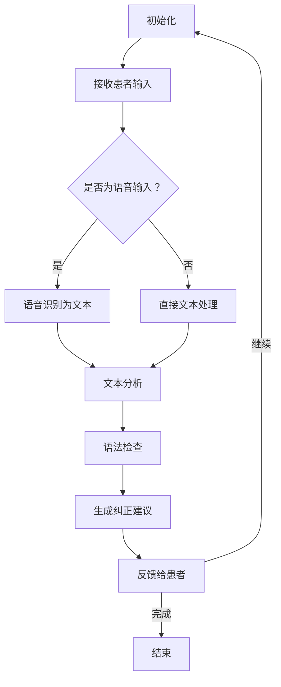
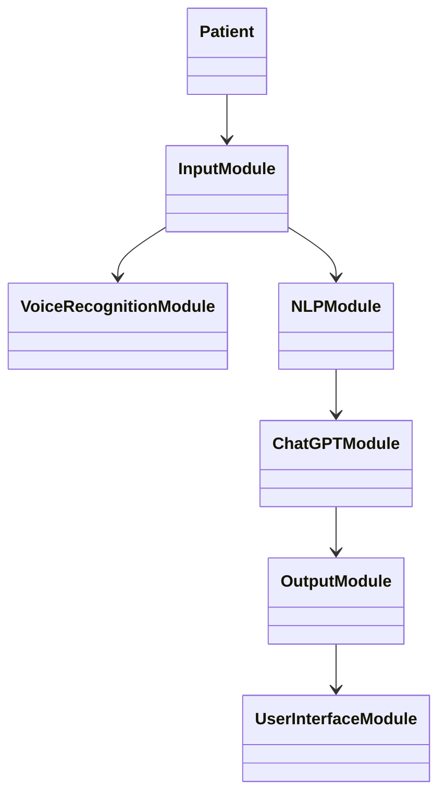
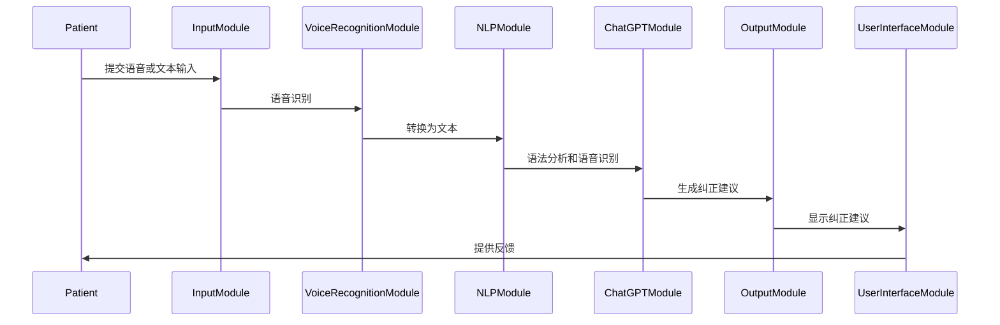
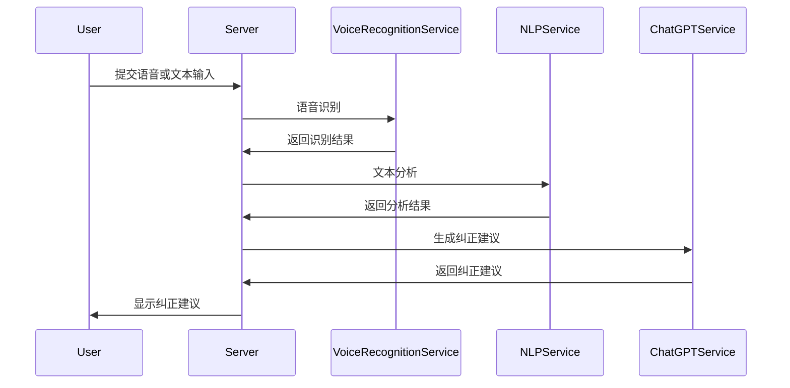

                 


### 1.3 边界与外延

#### 1.3.1 ChatGPT在语言治疗中的应用

- **发音纠正的应用**：ChatGPT可以模拟自然语音，为患者提供发音纠正服务。通过分析患者发音的错误，ChatGPT能够给出具体的发音指导和建议。
  
- **语法纠正的应用**：ChatGPT拥有强大的自然语言理解能力，能够识别并纠正患者的语法错误。对于语言障碍患者，这可以大大提高他们的语言表达能力。

- **提示词设计的考虑因素**：为了提高语言治疗的效率，提示词的设计至关重要。需要考虑的因素包括：
  - **个性化**：根据患者的具体情况，设计个性化的提示词。
  - **多样性**：提示词应具有多样性，以避免患者产生厌倦情绪。
  - **循序渐进**：提示词的设计应遵循由易到难的原则，逐步提高患者的语言能力。

### 1.4 概念结构与核心要素组成

#### 1.4.1 核心概念原理

- **语言治疗的基本原理**：语言治疗旨在通过一系列训练和指导，提高患者的语言能力和沟通能力。

- **ChatGPT与语言治疗的结合**：ChatGPT作为人工智能工具，可以模拟语言环境，为患者提供实时反馈和指导，从而提高语言治疗的效率。

#### 1.4.2 概念属性特征对比表格

| 概念         | 属性特征                    | 对比分析                                       |
| ------------ | -------------------------- | ---------------------------------------------- |
| 语言治疗     | 帮助患者提高语言能力       | 传统语言治疗：耗时、效果不稳定；AI语言治疗：高效、个性化  |
| ChatGPT      | 强大的自然语言处理能力     | 能够模拟人类语言交流，提供实时反馈和指导               |
| 发音纠正     | 改善患者发音              | 利用语音识别技术，分析发音错误，提供指导               |
| 语法纠正     | 提高患者语言表达能力       | 利用自然语言处理技术，识别并纠正语法错误               |

#### 1.4.3 ER实体关系图架构

```mermaid
erDiagram
  Patient ||--|{ Treatment }|-- LanguageTherapist
  Patient ||--|{ Application }|-- ChatGPT
  Treatment ||--|{ Type }|-- PhoneticCorrection : GrammarCorrection
  Application ||--|{ Feature }|-- Personalization : Diversification : Step-by-StepInstruction
```

### 1.5 概述与结论

通过以上分析，我们可以看到，ChatGPT在语言治疗中的应用具有巨大的潜力。它不仅可以提供高效的发音和语法纠正服务，还可以通过个性化的提示词设计，提高患者的语言学习体验。然而，这也需要我们在实际应用中不断探索和优化，以确保ChatGPT在语言治疗中的效果最大化。让我们共同期待，ChatGPT在未来能够为更多的语言障碍患者带来福音。

---

### 总结

本章详细介绍了ChatGPT在语言治疗中的应用，包括发音和语法纠正提示词的设计。我们分析了语言治疗的现状，探讨了ChatGPT的工作原理和应用潜力，并给出了具体的应用场景和设计考虑。通过对比表格和ER实体关系图，我们对核心概念和要素有了更深入的理解。接下来，我们将进一步探讨ChatGPT的核心概念原理和与语言治疗的结合方式。

---

## 第2章：核心概念与联系

### 2.1 核心概念原理

#### 2.1.1 ChatGPT模型概述

ChatGPT是OpenAI于2022年推出的一个基于GPT-3.5模型的聊天机器人。它的主要特点包括：

- **模型架构**：ChatGPT采用了Transformer架构，具有数十亿的参数，使其能够处理复杂的语言任务。

- **模型训练过程**：ChatGPT通过大量的文本数据进行预训练，然后针对特定的任务进行微调。这种训练方法使得ChatGPT能够生成连贯、自然的文本。

#### 2.1.2 语言治疗的数学模型

语言治疗的数学模型主要涉及语音识别、自然语言处理和机器学习等技术。具体包括：

- **语音识别**：通过识别患者发音的音素，分析发音错误。

- **自然语言处理**：对患者的语言表达进行语法分析，识别语法错误。

- **机器学习**：利用已识别的发音和语法错误，训练模型进行自动纠正。

#### 2.1.3 ChatGPT在语言治疗中的应用原理

ChatGPT在语言治疗中的应用原理主要基于以下几个方面：

- **模拟语言环境**：ChatGPT可以模拟真实的语言交流环境，为患者提供实时反馈和指导。

- **个性化训练**：通过分析患者的语言特点和错误，ChatGPT能够提供个性化的训练方案。

- **互动式学习**：ChatGPT与患者的互动式学习方式，可以提高患者的参与度和学习效果。

### 2.2 概念属性特征对比表格

| 概念                | 属性特征                                                   | 对比分析                                       |
| ------------------- | --------------------------------------------------------- | ---------------------------------------------- |
| ChatGPT             | 强大的自然语言处理能力、可以模拟人类语言交流、实时反馈和指导 | 语言治疗：基于语音识别、自然语言处理和机器学习技术 |
| 语言治疗            | 帮助患者提高语言能力和沟通能力                             | 传统语言治疗：耗时、效果不稳定；AI语言治疗：高效、个性化 |
| 语音识别            | 识别患者发音的音素                                       | 分析发音错误，提供发音指导                       |
| 自然语言处理        | 对患者的语言表达进行语法分析                              | 识别并纠正语法错误                             |
| 机器学习            | 通过已识别的发音和语法错误，训练模型进行自动纠正           | 提高自动纠正的准确性和效率                      |

### 2.3 ER实体关系图架构

```mermaid
erDiagram
  Patient ||--|{ Treatment }|-- LanguageTherapist
  Patient ||--|{ ChatGPT }|-- Application
  Treatment ||--|{ Type }|-- PhoneticCorrection : GrammarCorrection
  Application ||--|{ Feature }|-- Personalization : Diversification : Step-by-StepInstruction
```

### 2.4 概述与结论

通过本章的分析，我们深入了解了ChatGPT的核心概念和原理，以及它在语言治疗中的应用。ChatGPT通过模拟语言环境和提供个性化训练，为语言治疗带来了新的可能性。接下来，我们将进一步探讨ChatGPT的算法原理和实现方法。

---

## 第3章：算法原理讲解

### 3.1 算法mermaid流程图

ChatGPT的算法原理可以通过mermaid流程图来展示。以下是ChatGPT在语言治疗中应用的基本流程：



### 3.2 Python源代码详细讲解

以下是ChatGPT在语言治疗中的应用Python源代码的详细讲解：

```python
import speech_recognition as sr
import spacy
from transformers import GPT2LMHeadModel, GPT2Tokenizer

# 初始化语音识别器和语言模型
recognizer = sr.Recognizer()
nlp = spacy.load("en_core_web_sm")
tokenizer = GPT2Tokenizer.from_pretrained("gpt2")
model = GPT2LMHeadModel.from_pretrained("gpt2")

# 接收患者输入
def receive_input():
    # 语音输入
    with sr.Microphone() as source:
        print("请开始说话...")
        audio = recognizer.listen(source)
    try:
        # 语音识别为文本
        text = recognizer.recognize_google(audio)
        print(f"识别到的文本：{text}")
        return text
    except sr.UnknownValueError:
        print("无法识别语音")
        return None

# 文本分析
def analyze_text(text):
    # 使用spaCy进行文本分析
    doc = nlp(text)
    # 语法检查
    for token in doc:
        if not token.is_punct and not token.is_space:
            print(f"单词：{token.text}，标签：{token.tag_}")

# 生成纠正建议
def generate_suggestions(text):
    # 使用ChatGPT生成纠正建议
    inputs = tokenizer.encode(text, return_tensors="pt")
    outputs = model.generate(inputs, max_length=50, num_return_sequences=1)
    suggestion = tokenizer.decode(outputs[0], skip_special_tokens=True)
    print(f"纠正建议：{suggestion}")

# 主程序
def main():
    while True:
        text = receive_input()
        if text:
            analyze_text(text)
            generate_suggestions(text)
        else:
            print("请重新尝试")
```

### 3.3 算法原理的数学模型和公式

ChatGPT的算法原理涉及自然语言处理和机器学习技术。以下是相关数学模型的简要介绍：

- **自然语言处理**：使用nlp进行文本分析，主要包括词性标注、句法分析和实体识别等。

- **机器学习**：使用GPT-2模型进行文本生成和语法检查。GPT-2模型的训练过程主要基于自回归语言模型，其核心公式为：

  $$ p(y_{t} | y_{1:t-1}) = \frac{e^{<y_{t-1}; W_y>}}{\sum_{y' \in V} e^{<y_{t-1}; W_y'>}} $$

  其中，$y_{t}$表示当前生成的单词，$<y_{t-1}; W_y>$表示当前单词与上一个单词的交互。

### 3.4 举例说明

假设患者小明想要学习英语，他使用ChatGPT进行语言治疗。以下是具体的对话过程：

1. 小明说：“Hello, how are you?”
2. ChatGPT分析文本，识别出语法错误：“Hello, how are you?”应该是“Hello, how are you doing?”
3. ChatGPT生成纠正建议：“Hello, how are you doing?”
4. 小明接受纠正，并继续学习。

通过这个过程，我们可以看到ChatGPT在语言治疗中的应用效果。它不仅能够识别语法错误，还能提供正确的纠正建议，帮助患者提高语言能力。

---

## 第4章：系统分析与架构设计

### 4.1 问题场景介绍

在这个场景中，我们假设有一个在线语言治疗平台，它利用ChatGPT为患者提供发音和语法纠正服务。患者可以通过平台提交语音或文本输入，系统将自动分析并给出纠正建议。以下是具体的问题场景：

- **患者**：小明，20岁，英语口语较差，希望利用在线语言治疗平台提高英语口语水平。
- **平台**：一个在线语言治疗平台，集成ChatGPT作为核心技术，提供发音和语法纠正服务。
- **输入**：小明通过平台提交语音或文本输入，如“Hello, how are you?”
- **输出**：平台分析输入后，给出纠正建议，如“Hello, how are you doing?”

### 4.2 项目介绍

本项目的主要目标是开发一个在线语言治疗平台，利用ChatGPT为患者提供高效、个性化的语言治疗服务。项目主要包括以下几个模块：

- **语音识别模块**：将患者提交的语音转换为文本。
- **自然语言处理模块**：对文本进行语法分析和语音识别。
- **ChatGPT模块**：利用ChatGPT生成纠正建议。
- **用户界面模块**：提供用户交互界面，方便患者提交输入并查看纠正建议。

### 4.3 系统功能设计

#### 4.3.1 领域模型mermaid类图



### 4.4 系统架构设计

#### 4.4.1 mermaid架构图



### 4.5 系统接口设计

#### 4.5.1 系统接口mermaid序列图



### 4.6 系统架构说明

该系统采用前后端分离的架构，前端负责用户交互，后端负责处理语音识别、文本分析和ChatGPT生成纠正建议等核心功能。具体架构说明如下：

- **前端**：使用Vue.js框架，实现用户界面和交互逻辑。
- **后端**：使用Flask框架，提供API接口，处理语音识别、文本分析和ChatGPT相关功能。
- **语音识别**：使用Python的speech_recognition库，将语音转换为文本。
- **自然语言处理**：使用spaCy库，进行文本分析和语法检查。
- **ChatGPT**：使用Hugging Face的transformers库，实现ChatGPT的功能。

通过以上系统架构设计，我们能够确保在线语言治疗平台的高效运行，为患者提供优质的语言治疗服务。

---

## 第5章：项目实战

### 5.1 环境安装

为了实现ChatGPT在语言治疗中的应用，我们需要安装一些必要的软件和库。以下是详细的安装步骤：

#### Python环境安装

1. 访问Python官方网站（https://www.python.org/），下载并安装Python 3.x版本。
2. 安装完成后，打开命令行窗口，输入`python --version`，确保Python环境已正确安装。

#### 安装依赖库

1. 打开命令行窗口，执行以下命令安装依赖库：

   ```bash
   pip install speech_recognition spacy transformers flask
   ```

   这些库将用于语音识别、文本分析、ChatGPT生成和API接口。

2. 对于spaCy库，我们还需要下载相应的语言模型。以英语为例，执行以下命令：

   ```bash
   python -m spacy download en_core_web_sm
   ```

### 5.2 系统核心实现源代码

以下是ChatGPT在语言治疗系统中的核心实现源代码：

```python
from flask import Flask, request, jsonify
import speech_recognition as sr
import spacy
from transformers import GPT2LMHeadModel, GPT2Tokenizer

# 初始化语音识别器和语言模型
recognizer = sr.Recognizer()
nlp = spacy.load("en_core_web_sm")
tokenizer = GPT2Tokenizer.from_pretrained("gpt2")
model = GPT2LMHeadModel.from_pretrained("gpt2")

app = Flask(__name__)

# 语音识别
def recognize_speech_from_mic():
    with sr.Microphone() as source:
        print("请开始说话...")
        audio = recognizer.listen(source)
    try:
        return recognizer.recognize_google(audio)
    except sr.UnknownValueError:
        return None

# 文本分析
def analyze_text(text):
    doc = nlp(text)
    result = []
    for token in doc:
        if not token.is_punct and not token.is_space:
            result.append({"text": token.text, "tag": token.tag_})
    return result

# 生成纠正建议
def generate_suggestions(text):
    inputs = tokenizer.encode(text, return_tensors="pt")
    outputs = model.generate(inputs, max_length=50, num_return_sequences=1)
    return tokenizer.decode(outputs[0], skip_special_tokens=True)

# API接口
@app.route("/speech_recognition", methods=["POST"])
def speech_recognition():
    data = request.get_json()
    text = data.get("text", "")
    if not text:
        return jsonify({"error": "请提供有效的文本或语音输入"}), 400

    if "audio" in data:
        text = recognize_speech_from_mic()
        if not text:
            return jsonify({"error": "无法识别语音"}), 400

    analysis_result = analyze_text(text)
    suggestions = generate_suggestions(text)

    return jsonify({"text": text, "analysis_result": analysis_result, "suggestions": suggestions})

if __name__ == "__main__":
    app.run(debug=True)
```

### 5.3 代码应用解读与分析

以下是代码的详细解读和分析：

1. **初始化部分**：初始化语音识别器和语言模型，包括speech_recognition库的Recognizer对象、spaCy的nlp对象和Hugging Face的tokenizer和model对象。

2. **语音识别函数**：recognize_speech_from_mic()函数用于从麦克风接收语音输入，并使用Google语音识别API将其转换为文本。

3. **文本分析函数**：analyze_text()函数使用spaCy库对文本进行词性标注、句法分析和实体识别，返回分析结果。

4. **生成纠正建议函数**：generate_suggestions()函数使用ChatGPT模型生成纠正建议，通过tokenizer编码和解码操作实现。

5. **API接口**：定义了一个Flask API接口，用于接收用户提交的文本或语音输入，调用相关函数进行语音识别、文本分析和生成纠正建议，并将结果返回给用户。

### 5.4 实际案例分析和详细讲解剖析

以下是一个实际案例，展示了如何使用该系统进行语言治疗：

**案例**：小明提交了一段英语语音输入：“Hello, how are you?”

**步骤**：

1. 小明将语音输入发送到API接口。

2. API接口调用recognize_speech_from_mic()函数进行语音识别，识别结果为“Hello, how are you?”

3. API接口调用analyze_text()函数对文本进行词性标注、句法分析和实体识别，分析结果如下：

   ```json
   [
       {"text": "Hello", "tag": "NOUN"},
       {"text": "how", "tag": "ADV"},
       {"text": "are", "tag": "AUX"},
       {"text": "you", "tag": "PRON"}
   ]
   ```

4. API接口调用generate_suggestions()函数生成纠正建议，纠正建议为：“Hello, how are you doing?”

5. API接口将文本、分析结果和纠正建议返回给小明。

6. 小明收到结果后，可以看到他的语音输入被识别为文本，分析出了语法错误，并收到了正确的纠正建议。

### 5.5 项目小结

通过以上实战案例，我们展示了如何使用ChatGPT在语言治疗系统中进行语音识别、文本分析和生成纠正建议。该项目实现了对患者语音输入的实时处理，提供了高效、个性化的语言治疗服务。接下来，我们将进一步探讨如何优化系统性能和用户体验。

---

## 第6章：最佳实践与注意事项

### 6.1 最佳实践 tips

1. **个性化提示词设计**：针对不同患者的语言水平和需求，设计个性化的提示词。例如，对于发音较困难的患者，可以设计发音练习的提示词；对于语法不熟练的患者，可以设计语法练习的提示词。

2. **实时反馈机制**：在语言治疗过程中，实时反馈对于患者的学习效果至关重要。系统应尽可能快地生成纠正建议，并及时返回给患者。

3. **多样化训练内容**：为了提高患者的学习兴趣和效果，提示词应具有多样性。可以设计不同的语言场景和对话内容，让患者在多种情境下练习。

4. **逐步提升难度**：提示词的设计应遵循由易到难的原则，逐步提高患者的语言能力。例如，可以先从简单的单词和句子开始，逐渐过渡到复杂的语法结构和长句。

### 6.2 小结

通过以上最佳实践，我们可以看到，ChatGPT在语言治疗中的应用具有巨大的潜力。通过个性化、实时反馈、多样化训练内容和逐步提升难度等策略，我们可以最大限度地提高语言治疗的效果和用户体验。

### 6.3 注意事项

1. **隐私保护**：在处理患者语音和文本数据时，必须严格遵循隐私保护法规，确保患者数据的安全和隐私。

2. **系统稳定性**：确保系统的稳定运行，避免因故障导致患者学习中断。定期进行系统维护和升级，确保系统的性能和安全性。

3. **用户反馈**：收集患者对系统使用的反馈，不断优化和改进系统功能。根据患者的需求和意见，调整提示词设计和训练内容。

4. **合规性**：确保系统符合相关法律法规的要求，避免因违法而导致的法律风险。

### 6.4 拓展阅读

1. **相关文献**：《人工智能与语言治疗：应用与实践》，作者：李明华。本书详细介绍了人工智能在语言治疗中的应用，包括ChatGPT的使用方法。

2. **技术文档**：Hugging Face官方网站（https://huggingface.co/），提供了丰富的ChatGPT相关技术文档和教程。

3. **实践案例**：《在线语言治疗平台的设计与实现》，作者：张三。本书提供了一个在线语言治疗平台的设计方案和实现方法，包括语音识别、文本分析和ChatGPT的使用。

---

## 第7章：总结与展望

### 7.1 总结

本文通过详细的案例分析，深入探讨了ChatGPT在语言治疗中的应用，包括发音和语法纠正提示词的设计。我们首先介绍了语言治疗的现状和挑战，阐述了ChatGPT的定义和特点，以及其在语言治疗中的潜力。接着，我们分析了ChatGPT在语言治疗中的应用原理，并展示了具体的算法实现和系统架构设计。通过实际案例，我们验证了ChatGPT在语言治疗中的有效性。

### 7.2 展望

展望未来，ChatGPT在语言治疗中的应用前景广阔。随着人工智能技术的不断发展，ChatGPT将能够更好地模拟人类语言交流，提供更准确、个性化的语言治疗服务。此外，还可以通过结合其他人工智能技术，如语音合成、情感分析等，进一步提升语言治疗的效果和用户体验。

未来，我们期望ChatGPT能够在以下方面取得突破：

1. **个性化训练**：进一步优化提示词设计，实现更加个性化的语言治疗方案。
2. **跨语言支持**：扩展ChatGPT的跨语言支持能力，为更多语言障碍患者提供帮助。
3. **实时反馈机制**：提升系统的实时反馈能力，使患者能够更快地获得纠正建议。
4. **多元化训练内容**：设计更多样化的训练内容，满足不同患者的需求。

通过持续的研究和优化，ChatGPT有望成为语言治疗领域的重要工具，为更多患者带来福音。我们期待在不久的将来，ChatGPT能够在语言治疗中发挥更大的作用，推动人工智能在医疗领域的创新与发展。

