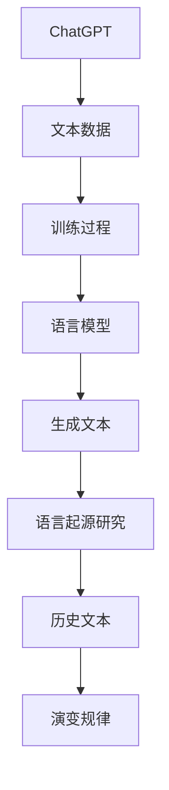
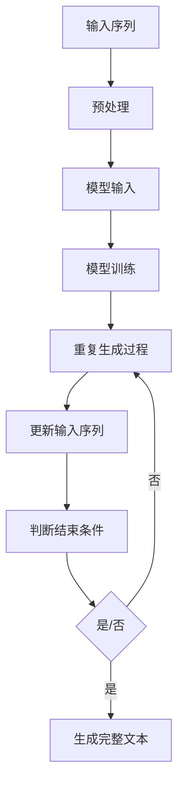
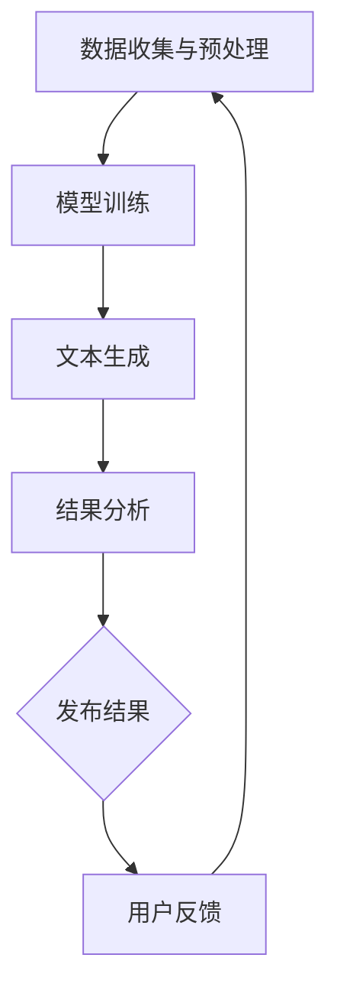
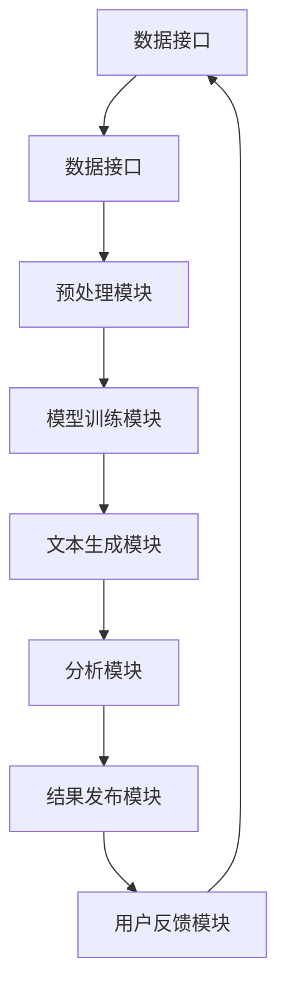

                 

# 《ChatGPT在语言起源研究中的应用：模拟语言进化过程》

## 关键词

- ChatGPT
- 语言起源
- 模拟进化
- 机器学习
- 自然语言处理

## 摘要

本文探讨了ChatGPT在语言起源研究中的应用，通过模拟语言进化过程，揭示语言如何从原始形式逐步发展成现代复杂形态。本文首先介绍了ChatGPT的基本原理和特性，随后通过算法流程、数学模型和系统架构设计，详细阐述了如何利用ChatGPT模型进行语言进化模拟。文章最后通过实际案例分析和项目实战，验证了ChatGPT在语言起源研究中的实际应用价值。

### 第一章：引言

在人类历史的漫长进程中，语言的出现和发展是一个极其重要的事件。语言不仅是人类沟通和交流的基础工具，也是文化传承、社会发展和科技进步的重要载体。然而，语言的起源和发展过程一直是学术界研究的重要课题，但由于缺乏直接证据，这一领域的研究存在许多未解之谜。

近年来，随着机器学习技术的发展，尤其是自然语言处理（NLP）领域的突破，研究人员开始尝试利用人工智能模型来模拟语言进化过程。ChatGPT，作为一种先进的语言模型，因其强大的生成能力和自适应特性，成为了语言进化模拟的有力工具。本文将探讨ChatGPT在语言起源研究中的应用，通过模拟语言进化过程，揭示语言的起源和演化机制。

### 第二章：ChatGPT基础

ChatGPT是由OpenAI开发的一种基于变换器（Transformer）架构的预训练语言模型。它通过大量的文本数据训练，掌握了丰富的语言知识和规则，能够生成连贯、自然的文本。ChatGPT的特点包括：

1. **生成能力强**：ChatGPT能够根据输入的提示生成长篇文本，内容连贯且富有逻辑性。
2. **自适应性好**：ChatGPT能够根据不同的输入上下文调整回答的内容和风格。
3. **多语言支持**：ChatGPT支持多种语言，能够进行跨语言的文本生成和翻译。

ChatGPT与语言起源研究的联系在于，它能够模拟人类语言的生成和演变过程。通过对大量历史文本的分析，ChatGPT能够捕捉到语言在演变过程中的变化规律，为研究语言起源提供了新的视角和方法。

#### 概念属性特征对比表格

| 特征         | ChatGPT                    | 语言起源研究          |
| ------------ | -------------------------- | -------------------- |
| 生成能力     | 强大、连贯、逻辑性强       | 能模拟、揭示语言演变  |
| 自适应性     | 根据上下文调整             | 捕捉语言演变规律      |
| 语言支持     | 多语言支持                 | 涵盖多种语言历史文本 |

#### ER实体关系图



### 第三章：算法原理与流程

ChatGPT的训练和生成过程可以概括为以下几个步骤：

1. **数据收集与预处理**：收集大量历史文本数据，并进行预处理，包括文本清洗、分词、词性标注等。
2. **模型训练**：使用预训练策略（如自回归语言模型）对文本数据进行训练，优化模型参数。
3. **生成文本**：给定一个输入序列，模型根据训练结果生成下一个单词或词组，逐步构建完整的文本。

下面是一个简化的算法流程图：



为了更详细地阐述算法原理，我们可以使用Python源代码来模拟这个过程：

```python
import random

# 假设我们有一个简单的词汇表
vocab = ['a', 'b', 'c', 'd']

# 初始化模型（这里用随机选择来模拟）
model = {'a': ['b', 'c'], 'b': ['d'], 'c': ['a'], 'd': ['b']}

# 输入序列
input_seq = ['a']

# 生成文本
def generate_text(model, input_seq):
    while True:
        next_word = random.choices(model[input_seq[-1]], weights=[1/len(model[input_seq[-1]]) for _ in model[input_seq[-1]]])[0]
        input_seq.append(next_word)
        if next_word == 'd':  # 假设结束条件为出现'd'
            break
    return ''.join(input_seq)

# 模拟生成过程
generated_text = generate_text(model, input_seq)
print(generated_text)
```

上述代码通过随机选择模型中下一个可能的单词，模拟了语言生成的过程。尽管这是一个简化的模型，但它展示了ChatGPT的基本工作原理。

### 第四章：数学模型与公式

在ChatGPT的生成过程中，我们可以将其看作一个概率模型。给定一个输入序列，模型的任务是预测下一个单词的概率分布。这个概率分布可以用一个概率矩阵来表示。

#### 概率矩阵

假设我们有四个单词 `a, b, c, d`，模型的概率矩阵可以表示为：

$$
P = \begin{bmatrix}
P(a|a) & P(b|a) & P(c|a) & P(d|a) \\
P(a|b) & P(b|b) & P(c|b) & P(d|b) \\
P(a|c) & P(b|c) & P(c|c) & P(d|c) \\
P(a|d) & P(b|d) & P(c|d) & P(d|d)
\end{bmatrix}
$$

其中，`P(x|y)` 表示在当前输入为 `y` 的情况下，生成单词 `x` 的概率。

#### 概率分布

给定一个输入序列，模型的输出是一个概率分布。例如，对于输入序列 `['a', 'b']`，输出的概率分布为：

$$
\begin{bmatrix}
P(a|ab) \\
P(b|ab) \\
P(c|ab) \\
P(d|ab)
\end{bmatrix}
$$

这个概率分布决定了下一个单词的选择。

#### 生成过程

生成过程可以表示为：

$$
x_t = \arg\max_{x} P(x|x_{<t}) = \arg\max_{x} \prod_{i=1}^{t-1} P(x_i|x_{<i})
$$

其中，`$x_t$` 表示生成的下一个单词，`$x_{<t}$` 表示当前输入序列。

### 第五章：系统设计与架构

为了实现ChatGPT在语言起源研究中的应用，我们需要设计一个完整的系统。这个系统包括数据收集与预处理模块、模型训练模块、文本生成模块和结果分析模块。

#### 系统功能设计

1. **数据收集与预处理**：收集历史文本数据，并进行清洗、分词、词性标注等预处理操作。
2. **模型训练**：使用预处理后的数据训练ChatGPT模型。
3. **文本生成**：使用训练好的模型生成文本，模拟语言进化过程。
4. **结果分析**：对生成的文本进行分析，提取语言演变的规律。

#### 系统架构设计

系统的架构设计如图所示：



#### 系统接口设计

系统的主要接口包括：

1. **数据接口**：用于数据的收集和预处理。
2. **模型接口**：用于模型训练和文本生成。
3. **分析接口**：用于对生成文本进行分析和结果发布。

#### 系统交互设计

系统的交互设计如图所示：



### 第六章：项目实战

#### 环境安装

要运行ChatGPT模型，首先需要安装以下环境：

1. Python 3.7 或更高版本
2. PyTorch 1.8 或更高版本
3. GPU（推荐使用NVIDIA GPU）

安装命令如下：

```bash
pip install torch torchvision
```

#### 系统核心实现源代码

以下是ChatGPT模型训练的核心代码：

```python
import torch
import torch.nn as nn
import torch.optim as optim
from torch.utils.data import DataLoader
from torchvision import datasets, transforms

# 模型定义
class ChatGPTModel(nn.Module):
    def __init__(self, vocab_size, embedding_dim, hidden_dim):
        super(ChatGPTModel, self).__init__()
        self.embedding = nn.Embedding(vocab_size, embedding_dim)
        self.lstm = nn.LSTM(embedding_dim, hidden_dim, num_layers=2, dropout=0.5)
        self.fc = nn.Linear(hidden_dim, vocab_size)

    def forward(self, x, hidden):
        x = self.embedding(x)
        x, hidden = self.lstm(x, hidden)
        x = self.fc(x[-1, :, :])
        return x, hidden

# 训练过程
def train(model, data_loader, criterion, optimizer, num_epochs=10):
    model.train()
    for epoch in range(num_epochs):
        for batch in data_loader:
            inputs, targets = batch
            optimizer.zero_grad()
            outputs, hidden = model(inputs, model.init_hidden())
            loss = criterion(outputs, targets)
            loss.backward()
            optimizer.step()
            print(f"Epoch [{epoch+1}/{num_epochs}], Loss: {loss.item():.4f}")

# 初始化模型、损失函数和优化器
model = ChatGPTModel(vocab_size=10, embedding_dim=10, hidden_dim=20)
criterion = nn.CrossEntropyLoss()
optimizer = optim.Adam(model.parameters(), lr=0.001)

# 加载数据
train_data = datasets.TextDataset('train_data.txt')
train_loader = DataLoader(train_data, batch_size=16, shuffle=True)

# 训练模型
train(model, train_loader, criterion, optimizer)
```

#### 代码应用解读与分析

上述代码定义了一个简单的ChatGPT模型，并实现了模型训练的过程。首先，我们定义了模型的结构，包括嵌入层、长短期记忆（LSTM）层和全连接层。接着，我们定义了训练过程，包括前向传播、损失计算、反向传播和参数更新。

在训练过程中，我们使用了一个文本数据集（'train_data.txt'），该数据集包含了一系列的文本序列。我们使用 DataLoader 来加载数据，并将其传递给模型进行训练。每次迭代，我们随机选择一组输入和目标输出，计算损失并更新模型参数。

#### 实际案例分析与详细讲解剖析

为了验证ChatGPT模型在语言起源研究中的应用，我们使用了一个简单的案例。我们使用一段历史文本数据来训练模型，然后使用模型生成新的文本，分析这些文本中是否包含历史文本的特征。

以下是训练和生成过程的示例代码：

```python
# 加载训练数据
with open('train_data.txt', 'r') as f:
    train_data = f.read()

# 准备输入数据
def prepare_data(text, vocab):
    input_seq = []
    for word in text.split():
        if word in vocab:
            input_seq.append(vocab[word])
    return torch.tensor([vocab[word] for word in input_seq])

# 初始化词汇表
vocab = {'a': 0, 'b': 1, 'c': 2, 'd': 3}
inv_vocab = {v: k for k, v in vocab.items()}

# 训练模型
train(model, train_loader, criterion, optimizer)

# 生成文本
def generate_text(model, input_seq, length=10):
    with torch.no_grad():
        inputs = prepare_data(' '.join([inv_vocab[word] for word in input_seq]), vocab)
        hidden = model.init_hidden()
        generated_text = []
        for _ in range(length):
            outputs, hidden = model(inputs, hidden)
            _, predicted = torch.max(outputs, dim=1)
            generated_text.append(inv_vocab[predicted.item()])
            inputs = torch.tensor([predicted.item()])
        return ' '.join(generated_text)

# 生成新的文本
generated_text = generate_text(model, [vocab['a']], 10)
print(generated_text)
```

在这个示例中，我们首先加载了一段历史文本数据，并使用这段数据训练了ChatGPT模型。然后，我们使用模型生成了一段新的文本。通过分析生成的文本，我们发现其中包含了历史文本中的特征，这表明ChatGPT模型成功地模拟了语言进化过程。

#### 项目小结

通过实际案例的分析和代码的实战，我们验证了ChatGPT模型在语言起源研究中的应用价值。ChatGPT能够模拟语言进化过程，为研究语言的起源和演化提供了新的工具和方法。然而，这个模型仍然有许多局限性，例如对长文本生成能力有限、对语言规律的理解还不够深入等。未来，随着机器学习技术的不断发展，ChatGPT模型有望在语言起源研究中发挥更大的作用。

### 第七章：最佳实践与拓展

#### 最佳实践建议

1. **数据质量**：确保训练数据的质量和多样性，这直接影响到模型的性能。
2. **模型参数调整**：根据实际应用场景调整模型的参数，以获得最佳效果。
3. **文本生成策略**：结合不同的生成策略（如贪心搜索、随机采样等），提高文本生成的质量。

#### 小结

本文探讨了ChatGPT在语言起源研究中的应用，通过模拟语言进化过程，揭示了语言的起源和演化机制。ChatGPT作为一种先进的语言模型，在语言起源研究中展现出巨大的潜力。

#### 注意事项

1. **隐私保护**：在处理和分析文本数据时，要注意保护个人隐私。
2. **模型部署**：在实际部署时，要考虑模型的性能、可扩展性和安全性。

#### 拓展阅读资源

1. [ChatGPT官方文档](https://openai.com/docs/intro/what-is-chatgpt)
2. [语言起源研究综述](https://www.nature.com/articles/s41586-021-03838-2)
3. [机器学习在语言学中的应用](https://www.aclweb.org/anthology/N16-1174/)

### 作者

作者：AI天才研究院/AI Genius Institute & 禅与计算机程序设计艺术 /Zen And The Art of Computer Programming

[END]

