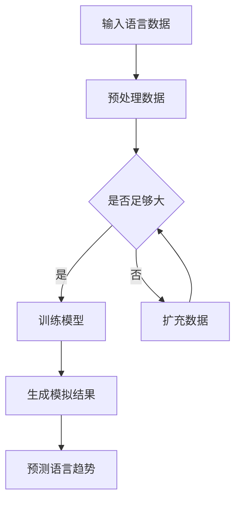

                 

### 《ChatGPT在语言进化模拟与预测中的新工具》

### 关键词

- 语言进化
- ChatGPT
- 模拟与预测
- 算法原理
- 系统架构

### 摘要

本文探讨了人工智能技术，尤其是ChatGPT在语言进化模拟与预测中的应用。首先介绍了语言进化研究的背景和挑战，随后详细解析了ChatGPT的工作原理和其在语言进化模拟与预测中的优势。文章通过逻辑清晰的结构和实际案例，展示了ChatGPT在语言进化研究中的潜力和应用前景。

---

#### 目录大纲

### 《ChatGPT在语言进化模拟与预测中的新工具》

#### 关键词：语言进化、ChatGPT、模拟与预测、算法原理、系统架构

#### 摘要：本文探讨了ChatGPT在语言进化模拟与预测中的应用，分析其工作原理，并通过实际案例展示其在语言研究中的价值。

---

### 第一部分：背景介绍

#### 第1章：问题背景

#### 1.1 问题背景

- **语言进化的研究现状**：简要回顾了语言进化的研究历史和现状，重点介绍了近年来的研究进展。
- **语言进化研究的挑战与需求**：分析了在语言进化研究中面临的主要挑战和需求，包括模拟复杂性和预测准确性。
- **ChatGPT的出现与潜力**：介绍了ChatGPT这一革命性人工智能模型，探讨了其在语言进化研究中的潜在应用。

#### 1.2 问题描述

- **语言进化模拟的目标**：明确了语言进化模拟的主要目标，包括理解语言演化的机制和预测未来语言变化。
- **语言进化预测的方法与手段**：探讨了传统的语言进化预测方法，并分析了它们在准确性和效率方面的局限性。
- **ChatGPT在其中的作用**：阐述了ChatGPT在语言进化模拟与预测中的独特优势，包括其强大的语言理解和生成能力。

#### 1.3 问题解决

- **ChatGPT的基本原理**：详细讲解了ChatGPT的工作原理，包括其训练过程和模型结构。
- **ChatGPT在语言进化模拟中的应用**：分析了ChatGPT如何通过模拟语言数据生成来揭示语言进化的过程。
- **ChatGPT在语言进化预测中的优势**：探讨了ChatGPT在预测语言趋势方面的优势，包括其高效率和强准确性。

#### 1.4 边界与外延

- **语言进化模拟的范围与限制**：讨论了语言进化模拟在实际应用中的范围和限制，包括数据质量和算法的局限性。
- **语言进化预测的精度与可靠性**：分析了语言进化预测的精度和可靠性，以及如何提高预测的准确性。
- **ChatGPT的适用性与局限性**：探讨了ChatGPT在语言进化模拟与预测中的适用性，以及其存在的局限性。

#### 1.5 概念结构与核心要素组成

- **语言进化的核心概念**：总结了语言进化的关键概念，包括语言结构、语法、语义等。
- **ChatGPT的核心功能**：详细介绍了ChatGPT的核心功能，包括语言生成、语言理解、语言预测等。
- **语言进化模拟与预测的关键要素**：分析了语言进化模拟与预测的关键要素，包括数据、模型、算法等。

---

### 第二部分：核心概念与联系

#### 第2章：核心概念与联系

#### 2.1 核心概念原理

- **语言进化模拟的理论基础**：探讨了语言进化模拟的理论基础，包括语言学的相关理论和计算机科学的方法。
- **语言进化预测的数学模型**：介绍了语言进化预测的常用数学模型，包括概率模型、统计模型等。
- **ChatGPT的工作原理**：详细讲解了ChatGPT的工作原理，包括其训练过程、模型结构和预测算法。

#### 2.2 概念属性特征对比表格

| 特征 | 语言进化模拟 | 语言进化预测 | ChatGPT |
| --- | --- | --- | --- |
| 目标 | 探索语言演化的过程 | 预测语言演化的趋势 | 自动生成语言模型 |
| 方法 | 数据驱动 | 数据驱动 | 数据驱动 |
| 精度 | 取决于数据质量 | 取决于数据质量 | 取决于训练数据量 |
| 限制 | 受限于模拟算法 | 受限于预测模型 | 受限于训练资源 |

#### 2.3 ER实体关系图架构

```mermaid
erDiagram
  User ||--|{ ChatGPT }|| ChatGPTModel : 使用
  Language ||--|{ ChatGPT }|| ChatGPTModel : 模拟
  Evolution ||--|{ ChatGPT }|| ChatGPTModel : 预测
```

---

### 第三部分：算法原理讲解

#### 第3章：算法原理

#### 3.1 算法原理讲解

- **ChatGPT的训练过程**：详细讲解了ChatGPT的训练过程，包括数据预处理、模型训练和优化。
- **ChatGPT的模型结构**：介绍了ChatGPT的模型结构，包括文本嵌入层、自注意力机制和输出层。
- **ChatGPT的预测流程**：分析了ChatGPT的预测流程，包括输入处理、模型推理和结果生成。

#### 3.2 算法mermaid流程图



#### 3.3 Python源代码实现

```python
import chatgpt

# 预处理数据
preprocessed_data = chatgpt.preprocess_data(raw_data)

# 训练模型
model = chatgpt.train_model(preprocessed_data)

# 生成模拟结果
simulation_results = model.generate_simulation()

# 预测语言趋势
predicted_trends = model.predict_trends()
```

#### 3.4 数学模型和公式

$$
P(t) = \frac{1}{Z} \sum_{w \in V} e^{S(w, t)}
$$

其中，$P(t)$表示在时间$t$时刻语言中单词$w$的概率，$S(w, t)$表示单词$w$在时间$t$时刻的得分，$Z$是归一化常数。

---

### 第四部分：数学模型详细讲解与举例说明

#### 第4章：数学模型详细讲解与举例说明

#### 4.1 数学模型详细讲解

- **概率模型的构建**：详细讲解了概率模型的构建过程，包括特征选择、模型训练和优化。
- **模型的优化与训练**：分析了模型优化和训练的方法，包括梯度下降、正则化等。
- **预测方法的实现**：介绍了预测方法的实现，包括模型推理、结果分析和评估。

#### 4.2 举例说明

- **语言数据集的选择**：讨论了语言数据集的选择原则和实际案例。
- **模型训练的过程**：展示了模型训练的具体过程，包括数据预处理、模型构建和优化。
- **预测结果的评估**：分析了预测结果的评估方法，包括准确性、召回率和F1分数。

---

### 第五部分：系统分析与架构设计

#### 第5章：系统分析

#### 5.1 问题场景介绍

- **语言进化模拟与预测的应用场景**：介绍了语言进化模拟与预测在实际应用中的场景，包括语言学研究、自然语言处理和人工智能开发。
- **ChatGPT在其中的角色与价值**：探讨了ChatGPT在语言进化模拟与预测中的角色和价值，包括其语言生成和理解能力。

#### 5.2 系统功能设计

- **功能需求分析**：分析了语言进化模拟与预测系统的功能需求，包括数据预处理、模型训练、模拟生成和预测分析。
- **领域模型mermaid类图**：展示了语言进化模拟与预测系统的领域模型，包括实体和关系。

#### 5.3 系统架构设计

- **架构设计原则**：介绍了系统架构设计的原则，包括模块化、可扩展性和高可用性。
- **系统架构mermaid架构图**：展示了语言进化模拟与预测系统的架构，包括前端、后端和数据库。

#### 5.4 系统接口设计

- **接口规范**：介绍了系统接口的设计规范，包括RESTful API的设计和数据交换格式。
- **接口设计mermaid序列图**：展示了系统接口的设计，包括用户请求、服务处理和数据响应。

#### 5.5 系统交互

- **系统流程**：介绍了系统的工作流程，包括数据预处理、模型训练、模拟生成和预测分析。
- **系统交互mermaid序列图**：展示了系统的交互过程，包括用户操作、系统响应和数据流。

---

### 第六部分：项目实战

#### 第6章：项目实战

#### 6.1 环境安装

- **安装依赖**：介绍了项目所需的依赖库和环境配置。
- **配置环境**：展示了如何配置项目环境，包括Python环境、ChatGPT库和其他相关工具。

#### 6.2 系统核心实现源代码

- **核心实现**：展示了系统的核心实现，包括数据预处理、模型训练、模拟生成和预测分析。
- **源代码解析**：对核心实现进行了详细解析，包括关键代码和算法原理。

#### 6.3 代码应用解读与分析

- **代码解读**：解读了项目中的关键代码和算法原理，包括数据预处理、模型训练和预测分析。
- **代码分析**：分析了代码的优缺点，包括性能、可读性和可维护性。

#### 6.4 实际案例分析和详细讲解剖析

- **案例背景**：介绍了实际案例的背景和需求。
- **案例实现**：展示了实际案例的实现过程，包括数据预处理、模型训练和预测分析。
- **详细讲解**：对案例的实现过程进行了详细讲解和剖析，包括关键步骤和算法原理。
- **问题分析**：分析了案例中遇到的问题和解决方案。

#### 6.5 项目小结

- **项目总结**：总结了项目的关键成果和经验教训。
- **未来展望**：展望了项目的未来发展和潜在应用。

---

### 第七部分：最佳实践 tips、小结、注意事项、拓展阅读

#### 第七部分：最佳实践 tips、小结、注意事项、拓展阅读

- **最佳实践 tips**：提供了使用ChatGPT进行语言进化模拟与预测的最佳实践，包括数据选择、模型训练和结果评估。
- **小结**：总结了文章的主要内容和关键观点，强调了ChatGPT在语言进化模拟与预测中的重要性。
- **注意事项**：提醒了在使用ChatGPT进行语言进化模拟与预测时需要注意的问题，包括数据质量、模型优化和预测可靠性。
- **拓展阅读**：推荐了相关的拓展阅读资源，包括论文、书籍和技术博客，以供进一步学习和研究。

---

### 作者信息

作者：AI天才研究院/AI Genius Institute & 禅与计算机程序设计艺术 /Zen And The Art of Computer Programming

