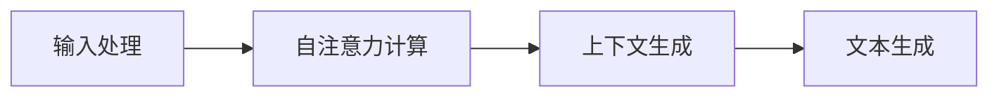
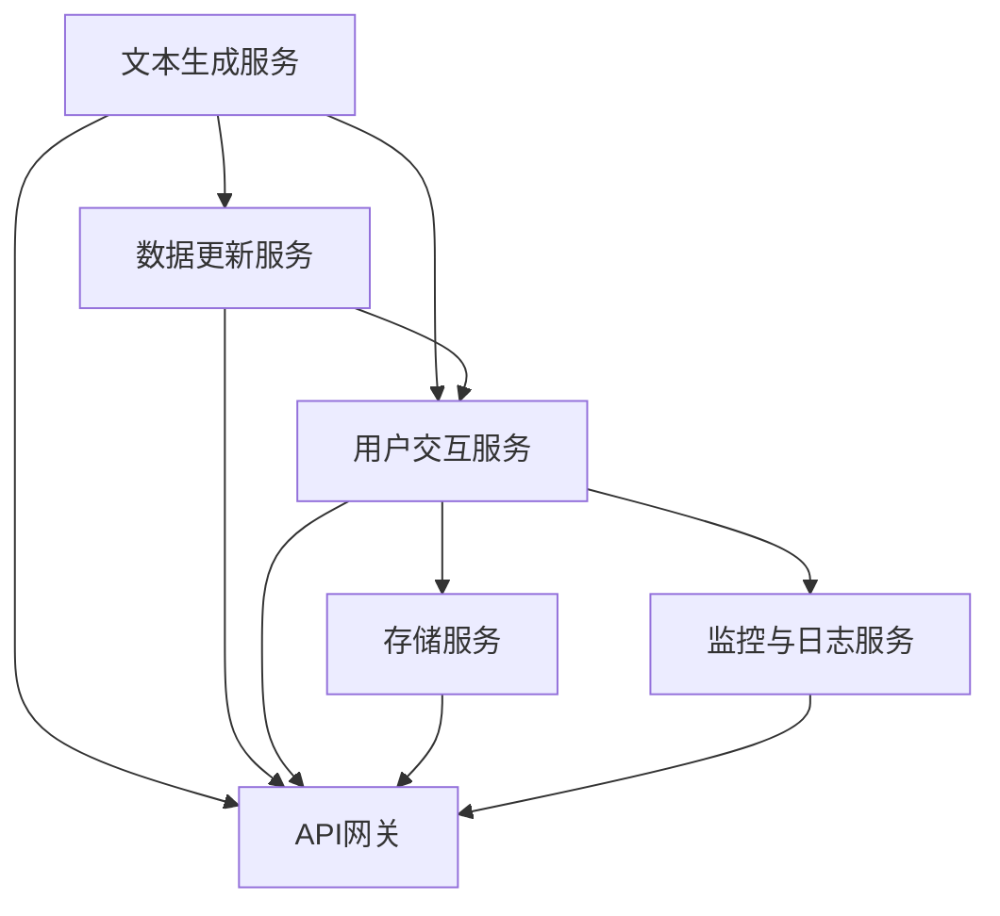
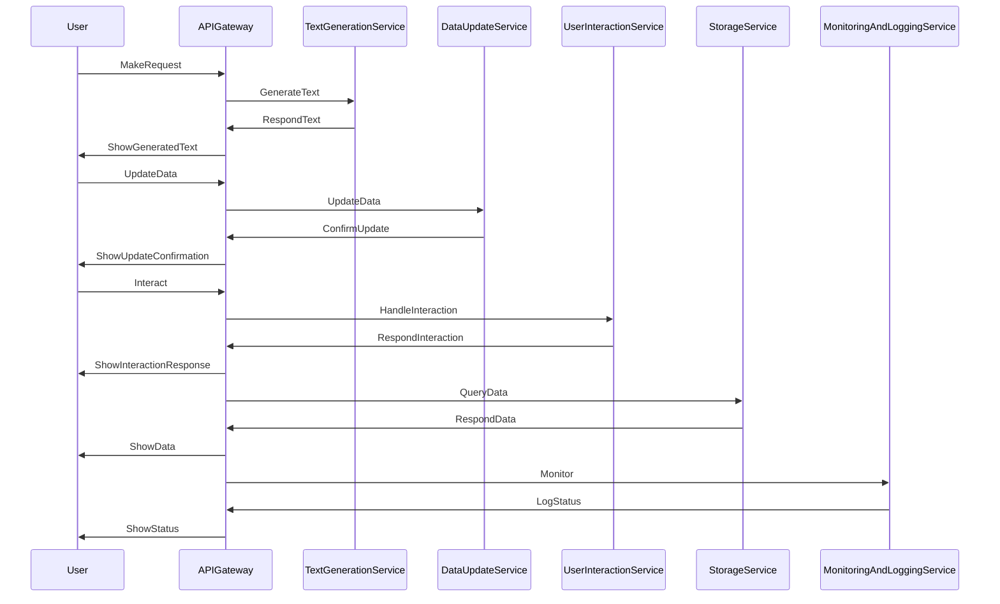

                 


### 综述

首先，我们来综述ChatGPT在语言进化模拟研究中的新工具这一主题。ChatGPT是由OpenAI开发的基于GPT-3模型的大型语言模型，其具有强大的文本生成、理解和交互能力。在语言进化模拟研究中，ChatGPT能够模拟人类语言的演变过程，为研究者提供了一种新的研究工具。

语言进化是一个复杂且漫长的过程，涉及到语言的产生、传播、变化和消亡等多个方面。传统的研究方法主要依赖于历史文献、语言学理论和统计方法，但这些方法存在一定的局限性，难以全面模拟语言进化的动态过程。而ChatGPT的出现为语言进化模拟研究提供了新的思路和方法。

首先，ChatGPT可以生成大量的文本数据，这些数据可以模拟不同语言环境下的语言使用情况，从而为研究语言进化提供丰富的素材。其次，ChatGPT可以自动识别和分类语言现象，从而帮助研究者发现语言进化的规律和模式。最后，ChatGPT可以与人类研究者进行互动，提供反馈和建议，从而提高研究效率和质量。

### 概念定义

在讨论ChatGPT在语言进化模拟研究中的应用之前，我们需要明确一些核心概念。

#### ChatGPT

ChatGPT是基于GPT-3模型开发的，GPT-3（Generative Pre-trained Transformer 3）是OpenAI开发的一种基于Transformer架构的自然语言处理模型。GPT-3具有非常强大的文本生成和理解能力，能够生成连贯、有逻辑的文本，并且在多个NLP任务中取得了显著的成果。ChatGPT则是在GPT-3的基础上增加了对话生成能力，使其能够进行自然的人类语言对话。

#### 语言进化模拟

语言进化模拟是一种通过计算机模拟来研究语言演化的方法。这种方法通常涉及创建一个模拟的“语言环境”，其中语言实体（如词汇、语法规则、语言使用习惯等）可以相互交互并进化。语言进化模拟可以用来研究语言如何随时间变化，以及这些变化是如何影响语言系统的。

#### 语言进化模拟研究的意义

语言进化模拟研究对于理解语言的本质、推动语言学研究的发展具有重要意义。通过模拟语言进化，研究者可以更深入地了解语言如何适应环境变化，如何产生新的语言现象，以及这些现象如何影响语言的使用和传播。

### 背景与问题描述

语言进化是一个持续不断的过程，从古至今，各种语言都在不断地发生变化。这些变化可以是由语言使用者的社交需求、文化背景、技术进步等多种因素驱动的。传统的研究方法主要通过分析历史文献和语言数据来推断语言的变化过程，但这些方法往往无法捕捉到语言变化的动态性和复杂性。

#### 传统方法的局限性

1. **历史文献的局限性**：历史文献虽然记录了语言的一部分发展轨迹，但其覆盖范围有限，且可能存在记录不全、解读困难等问题。
2. **语言学理论的局限性**：尽管语言学理论提供了解释语言变化的框架，但这些理论往往是对静态语言状态的描述，难以全面反映语言变化的动态过程。
3. **统计分析的局限性**：统计分析方法可以识别语言数据中的某些模式，但难以揭示这些模式背后的复杂机制。

#### ChatGPT在语言进化模拟研究中的作用

ChatGPT作为一种先进的自然语言处理工具，其在语言进化模拟研究中的应用可以弥补传统方法的局限性。具体来说：

1. **生成大量文本数据**：ChatGPT可以生成大量的模拟文本，这些文本可以模拟不同历史时期、不同文化背景下的语言使用情况，为研究语言进化提供了丰富的数据素材。
2. **自动识别和分类**：ChatGPT可以自动识别和分类语言现象，帮助研究者发现语言进化的规律和模式，从而揭示语言变化的复杂机制。
3. **互动与反馈**：ChatGPT可以与人类研究者进行互动，提供反馈和建议，从而提高研究效率和质量。

### 研究优势

ChatGPT在语言进化模拟研究中的优势主要体现在以下几个方面：

1. **高效率**：ChatGPT可以快速生成大量的文本数据，大大提高了研究效率。
2. **高精度**：ChatGPT生成的文本数据具有很高的连贯性和逻辑性，接近真实语言的使用情况。
3. **灵活性**：ChatGPT可以根据研究需求进行定制化设置，模拟不同的语言环境。
4. **互动性**：ChatGPT可以与人类研究者进行实时互动，提供即时的反馈和建议。

### 研究边界与范围

虽然ChatGPT在语言进化模拟研究中具有很大的潜力，但也有一些研究边界和范围需要明确：

1. **数据质量**：ChatGPT生成的文本数据虽然量大，但数据质量可能参差不齐，需要研究者进行筛选和处理。
2. **模型限制**：ChatGPT作为预训练模型，其能力受到训练数据和质量的影响，可能无法完全模拟语言进化的所有复杂过程。
3. **应用场景**：ChatGPT在语言进化模拟研究中的应用主要限于文本层面，对于语音、图像等其他语言形式的研究尚有局限性。

### 本章小结

本章介绍了ChatGPT在语言进化模拟研究中的新工具这一主题，并阐述了其背景、问题、概念、研究优势和研究边界。通过本文的阐述，读者可以初步了解ChatGPT在语言进化模拟研究中的应用前景和潜力，为后续章节的深入探讨打下基础。

接下来，我们将详细探讨ChatGPT的核心概念和算法原理，帮助读者更深入地理解这一新工具的工作机制和应用方法。### 第2章：核心概念与联系

## 2.1 语言进化模拟中的核心概念

### 2.1.1 语言进化

语言进化是指语言随着时间的推移而发生的系统变化。这些变化可以包括词汇的增减、语法的调整、语音的变化等。语言进化是语言学中的一个核心问题，对于理解人类文明的发展和沟通方式具有重要意义。

### 2.1.2 模拟语言进化

模拟语言进化是通过计算机模型来模拟语言进化的过程。这种方法可以帮助研究者探索语言进化的可能路径，分析语言变化的原因和结果。模拟语言进化通常涉及创建一个模拟环境，其中语言实体（如词汇、语法规则）可以相互交互并进化。

### 2.1.3 ChatGPT

ChatGPT是一种基于GPT-3模型的自然语言处理工具，具有强大的文本生成、理解和交互能力。ChatGPT可以生成大量的文本数据，模拟不同的语言环境，为研究语言进化提供了丰富的素材。

## 2.2 核心概念之间的关系

### 2.2.1 语言进化与模拟语言进化的关系

语言进化是语言学研究的核心问题，而模拟语言进化则是通过计算机模型来探索语言进化的可能路径。ChatGPT作为一种模拟工具，可以在语言进化研究中发挥重要作用，帮助研究者更好地理解语言进化的动态过程。

### 2.2.2 ChatGPT与语言进化的关系

ChatGPT通过生成大量的文本数据，模拟不同的语言环境，为研究语言进化提供了丰富的素材。同时，ChatGPT可以自动识别和分类语言现象，帮助研究者发现语言进化的规律和模式。

### 2.2.3 模拟语言进化与ChatGPT的关系

模拟语言进化需要有效的工具来生成和分析文本数据，而ChatGPT正是这样一种工具。通过ChatGPT，研究者可以更高效地模拟语言进化过程，分析语言变化的机制和影响因素。

### 2.2.4 关键概念属性特征对比

以下是语言进化、模拟语言进化、ChatGPT的关键概念属性特征对比表格：

| 关键概念 | 定义 | 属性特征 | 对比分析 |
| --- | --- | --- | --- |
| 语言进化 | 语言随着时间的推移而发生的系统变化 | 涉及词汇、语法、语音等方面 | 是语言学研究的核心问题 |
| 模拟语言进化 | 通过计算机模型来模拟语言进化的过程 | 需要创建模拟环境，语言实体可以相互交互 | 可以帮助研究者探索语言进化的可能路径 |
| ChatGPT | 基于GPT-3模型的自然语言处理工具 | 具有文本生成、理解和交互能力 | 可以生成大量文本数据，为研究语言进化提供素材 |

### 2.2.5 Mermaid ER 图架构

为了更直观地展示这些核心概念之间的关系，我们可以使用Mermaid ER图来描述。以下是核心概念的Mermaid ER图：

```mermaid
erDiagram
    LanguageEvolution ||--|{ SimulationLanguageEvolution }|| LanguageSimulation
    LanguageEvolution ||--|{ ChatGPT }|| ChatGPT
    SimulationLanguageEvolution ||--|{ ChatGPT }|| ChatGPT
```

在这个ER图中，`LanguageEvolution`表示语言进化，`SimulationLanguageEvolution`表示模拟语言进化，`ChatGPT`表示ChatGPT。这些概念之间通过实体关系进行连接，展示了它们之间的相互关系。

### 本章小结

本章介绍了语言进化模拟研究中的核心概念，包括语言进化、模拟语言进化以及ChatGPT，并探讨了这些概念之间的关系。通过本章的阐述，读者可以更深入地理解ChatGPT在语言进化模拟研究中的应用，以及如何利用ChatGPT来模拟和探索语言进化的过程。接下来，我们将进一步探讨ChatGPT的算法原理和实现细节。### 第3章：ChatGPT算法原理

## 3.1 ChatGPT概述

ChatGPT是基于GPT-3模型的自然语言处理工具，具有强大的文本生成、理解和交互能力。GPT-3（Generative Pre-trained Transformer 3）是由OpenAI开发的一种基于Transformer架构的自然语言处理模型。它采用了预训练加微调（pre-training and fine-tuning）的方法，通过在海量文本数据上进行预训练，模型可以学习到大量的语言规律和知识，然后再通过微调来适应特定的任务。

## 3.2 ChatGPT算法原理

ChatGPT的算法原理主要基于Transformer架构，这是一种基于自注意力机制的深度神经网络模型。下面我们将详细解释Transformer架构以及ChatGPT是如何工作的。

### 3.2.1 Transformer架构

Transformer架构是由Vaswani等人于2017年提出的一种用于序列到序列学习的模型。与传统的循环神经网络（RNN）不同，Transformer使用了一种全新的序列处理方法——多头自注意力机制（multi-head self-attention）。

#### 自注意力机制

自注意力机制是一种通过计算序列中每个词与其他词的相关性来确定其重要性的方法。在Transformer中，每个词的表示不仅取决于其自身的特征，还取决于其他词的特征。这种机制允许模型捕捉到序列中长距离的依赖关系。

#### 多头自注意力

多头自注意力是一种扩展自注意力机制的方法，它将输入序列分成多个头，每个头独立计算自注意力，然后合并结果。这样可以同时关注序列中的不同部分，提高模型的表示能力。

### 3.2.2 训练过程

ChatGPT的训练过程主要包括两个阶段：预训练和微调。

#### 预训练

在预训练阶段，GPT-3模型通过在海量文本数据上进行训练来学习语言规律和知识。这个过程中，模型会通过预测下一个词来优化自身的参数。预训练的目标是让模型学习到足够的语言知识，以便在特定任务上取得优异的性能。

#### 微调

微调是在特定任务上进行模型训练的过程。在微调阶段，模型会在一个或多个特定任务上继续训练，以适应这些任务的需求。微调可以大大提高模型在特定任务上的性能。

### 3.2.3 ChatGPT的工作流程

ChatGPT的工作流程主要包括以下几个步骤：

1. **输入处理**：将用户的输入文本编码为模型可以理解的向量表示。
2. **自注意力计算**：模型计算输入文本中每个词与其他词之间的相关性，生成自注意力权重。
3. **上下文生成**：根据自注意力权重和预训练的知识，模型生成上下文表示。
4. **文本生成**：模型根据上下文表示生成新的文本。

### 3.2.4 Mermaid流程图

为了更直观地展示ChatGPT的工作流程，我们可以使用Mermaid流程图来描述。以下是ChatGPT的工作流程Mermaid图：



在这个流程图中，A表示输入处理，B表示自注意力计算，C表示上下文生成，D表示文本生成。这些步骤共同构成了ChatGPT的工作流程。

### 3.2.5 Python代码实现

下面是一个简单的Python代码示例，展示如何使用Transformer模型进行文本生成：

```python
from transformers import GPT2LMHeadModel, GPT2Tokenizer

# 加载预训练模型和分词器
model = GPT2LMHeadModel.from_pretrained('gpt2')
tokenizer = GPT2Tokenizer.from_pretrained('gpt2')

# 输入文本
input_text = "Hello, how are you?"

# 编码输入文本
input_ids = tokenizer.encode(input_text, return_tensors='pt')

# 生成文本
outputs = model.generate(input_ids, max_length=50, num_return_sequences=1)

# 解码输出文本
output_text = tokenizer.decode(outputs[0], skip_special_tokens=True)

print(output_text)
```

在这个代码示例中，我们首先加载了预训练的GPT-2模型和分词器。然后，我们将用户的输入文本编码为模型可以理解的向量表示。接着，我们使用模型生成新的文本，并解码输出文本。

### 3.2.6 数学模型和公式

在ChatGPT中，自注意力机制是一个核心组成部分。下面我们将使用LaTeX格式来描述自注意力机制的数学模型和公式。

$$
\text{Attention}(Q, K, V) = \text{softmax}\left(\frac{QK^T}{\sqrt{d_k}}\right)V
$$

其中，$Q, K, V$ 分别表示查询向量、键向量和值向量，$d_k$ 表示键向量的维度。这个公式计算了查询向量与所有键向量的点积，并通过softmax函数生成注意力权重，最后将这些权重与值向量相乘，得到加权的结果。

### 3.2.7 通俗易懂的例子

假设我们有一个简单的句子：“我今天去公园散步”。我们使用ChatGPT来生成这个句子的下一个词。

1. **输入处理**：将句子编码为模型可以理解的向量表示。
2. **自注意力计算**：模型计算每个词与其他词之间的相关性。
3. **上下文生成**：根据相关性最高的词来生成新的词。
4. **文本生成**：将新生成的词添加到句子末尾。

通过这种方式，ChatGPT可以生成如：“我今天去公园散步，看到了一只可爱的小狗”。

### 本章小结

本章详细介绍了ChatGPT的算法原理，包括Transformer架构、训练过程、工作流程、Python代码实现以及数学模型和公式。通过本章的学习，读者可以更好地理解ChatGPT的工作原理和实现方法，为后续章节的应用和案例分析打下基础。接下来，我们将进一步探讨ChatGPT在语言进化模拟研究中的具体应用。### 第4章：数学模型与公式

## 4.1 ChatGPT的数学模型基础

在深入理解ChatGPT的数学模型之前，我们需要回顾一下Transformer模型的核心组件，特别是自注意力机制（self-attention）。自注意力机制是一种计算输入序列中每个词与其他词之间关系的重要机制，其数学基础是点积（dot-product）和softmax函数。

### 4.1.1 自注意力机制的数学公式

自注意力机制的核心公式如下：

$$
\text{Attention}(Q, K, V) = \text{softmax}\left(\frac{QK^T}{\sqrt{d_k}}\right)V
$$

其中：
- $Q$ 表示查询向量（query vector），其维度为 $d_q$。
- $K$ 表示键向量（key vector），其维度为 $d_k$。
- $V$ 表示值向量（value vector），其维度为 $d_v$。
- $d_k$ 表示键向量的维度，通常与查询向量和值向量的维度相同。
- $QK^T$ 是查询向量和键向量的点积，结果是一个标量，表示两个向量之间的相关性。
- $\sqrt{d_k}$ 是为了防止维度灾难（dimensionality disaster）而进行的缩放操作。
- $\text{softmax}$ 函数将点积结果转换为概率分布，用于加权值向量。

### 4.1.2 点积和缩放因子

点积公式如下：

$$
QK^T = \sum_{i=1}^{d_k} Q_i \cdot K_i
$$

其中，$Q_i$ 和 $K_i$ 分别是查询向量和键向量的第 $i$ 个元素。

缩放因子 $\sqrt{d_k}$ 的引入是为了保持注意力权重在合适的范围内，避免由于维度过高导致的梯度消失问题。

### 4.1.3 多头注意力

多头注意力（multi-head attention）是对自注意力机制的扩展。多头注意力通过并行计算多个注意力头（attention head），每个头独立计算自注意力，然后将结果合并。多头注意力的公式如下：

$$
\text{MultiHead}(Q, K, V) = \text{Concat}(\text{head}_1, \text{head}_2, ..., \text{head}_h)W^O
$$

其中：
- $h$ 是注意力头的数量。
- $\text{head}_i = \text{Attention}(QW_i^Q, KW_i^K, VW_i^V)$ 是第 $i$ 个注意力头的输出。
- $W_i^Q, W_i^K, W_i^V$ 是对应于第 $i$ 个注意力头的权重矩阵。
- $W^O$ 是输出权重矩阵。

### 4.1.4 Transformer模型的整体公式

Transformer模型的整体公式可以表示为：

$$
\text{Transformer}(X) = \text{MultiHeadSelfAttention}(X) \cdot \text{MaskedLinear}(X)
$$

其中：
- $X$ 是输入序列。
- $\text{MaskedLinear}(X)$ 是一个带有掩码的线性层，用于后续处理。

### 4.2 语言进化模拟中的数学模型

在语言进化模拟中，我们可以将自注意力机制和Transformer模型作为模拟语言进化的基础。以下是一个简化的数学模型，用于描述语言进化过程：

$$
\text{LanguageEvolution}(t) = f(\text{CurrentLanguage}, \text{SocialContext}, t)
$$

其中：
- $\text{LanguageEvolution}(t)$ 表示在时间 $t$ 的语言状态。
- $f$ 是一个函数，用于模拟语言状态的演化。
- $\text{CurrentLanguage}$ 是当前的语言状态。
- $\text{SocialContext}$ 是社会环境因素。
- $t$ 是时间。

函数 $f$ 可以包含多种因素，例如词汇变化、语法规则变化、语言使用习惯变化等。这些因素可以通过自注意力机制和Transformer模型来建模和模拟。

### 4.3 ChatGPT在语言进化模拟中的应用

ChatGPT可以用来生成模拟语言环境中的文本数据，从而辅助研究语言进化的过程。以下是ChatGPT在语言进化模拟中的应用：

$$
\text{SimulatedLanguageData}(t) = \text{ChatGPT}(\text{InitialLanguage}, \text{SocialContext}, t)
$$

其中：
- $\text{SimulatedLanguageData}(t)$ 是在时间 $t$ 产生的模拟语言数据。
- $\text{ChatGPT}$ 是一个基于GPT-3模型的函数，用于生成文本。
- $\text{InitialLanguage}$ 是初始语言状态。
- $\text{SocialContext}$ 是社会环境因素。
- $t$ 是时间。

通过不断生成和更新模拟语言数据，我们可以观察和分析语言进化的过程，例如词汇的演变、语法规则的变化等。

### 4.4 公式解释

下面我们通过LaTeX格式来详细解释上述数学模型和公式：

$$
\text{Attention}(Q, K, V) = \text{softmax}\left(\frac{QK^T}{\sqrt{d_k}}\right)V
$$

$$
QK^T = \sum_{i=1}^{d_k} Q_i \cdot K_i
$$

$$
\text{MultiHead}(Q, K, V) = \text{Concat}(\text{head}_1, \text{head}_2, ..., \text{head}_h)W^O
$$

$$
\text{Transformer}(X) = \text{MultiHeadSelfAttention}(X) \cdot \text{MaskedLinear}(X)
$$

$$
\text{LanguageEvolution}(t) = f(\text{CurrentLanguage}, \text{SocialContext}, t)
$$

$$
\text{SimulatedLanguageData}(t) = \text{ChatGPT}(\text{InitialLanguage}, \text{SocialContext}, t)
$$

这些公式分别描述了自注意力机制、多头注意力、Transformer模型、语言进化模拟以及ChatGPT在语言进化模拟中的应用。通过这些公式，我们可以更深入地理解ChatGPT的工作原理以及在语言进化模拟中的角色。

### 本章小结

本章介绍了ChatGPT的数学模型基础，包括自注意力机制、多头注意力、Transformer模型以及语言进化模拟中的相关公式。通过LaTeX格式详细解释了这些公式，读者可以更好地理解ChatGPT的算法原理和其在语言进化模拟中的应用。这些数学模型和公式为后续章节中的系统分析和设计提供了理论基础。### 第5章：系统分析与设计

## 5.1 问题场景介绍

在语言进化模拟研究中，研究人员需要构建一个模拟平台，以模拟不同历史时期和不同文化背景下的语言进化过程。这个平台需要能够生成大量的文本数据，模拟语言使用者的社交互动，并记录和展示语言变化的过程和结果。ChatGPT作为核心组件，将在文本生成和数据模拟中发挥关键作用。

### 5.2 项目介绍

本项目旨在开发一个基于ChatGPT的语言进化模拟平台，通过模拟语言进化的过程，研究语言变化的机制和影响因素。项目目标包括：

1. 构建一个模拟平台，能够生成不同历史时期和不同文化背景下的语言数据。
2. 利用ChatGPT生成和更新模拟文本数据，模拟语言使用者的社交互动。
3. 设计和实现一个用户界面，用于展示语言进化的过程和结果。

### 5.3 系统功能设计

为了实现上述项目目标，我们需要设计以下系统功能：

1. **文本生成功能**：利用ChatGPT生成模拟文本数据，包括历史文献、社交对话等。
2. **数据更新功能**：定期更新模拟文本数据，模拟语言进化的过程。
3. **用户交互功能**：提供用户界面，允许用户输入参数、查看模拟结果、调整模型设置等。
4. **结果展示功能**：通过图表和文本形式展示语言进化的过程和结果。

### 5.4 系统架构设计

为了满足上述功能需求，我们设计了一个基于微服务架构的系统，该系统包括以下核心组件：

1. **文本生成服务**：负责利用ChatGPT生成模拟文本数据。
2. **数据更新服务**：负责定期更新模拟文本数据。
3. **用户交互服务**：负责处理用户请求，展示模拟结果，允许用户调整模型设置。
4. **存储服务**：负责存储模拟文本数据和用户数据。
5. **监控与日志服务**：负责监控系统运行状态，记录日志信息。

系统架构设计Mermaid图如下：



在这个架构图中，API网关是系统的入口，负责处理来自用户的请求，并将请求转发到相应的服务。文本生成服务、数据更新服务、用户交互服务和存储服务分别负责系统的核心功能。监控与日志服务负责监控系统状态和记录日志信息。

### 5.5 系统接口设计

系统接口设计是系统架构设计的一部分，主要包括以下接口：

1. **文本生成接口**：用于生成模拟文本数据。
2. **数据更新接口**：用于更新模拟文本数据。
3. **用户交互接口**：用于处理用户请求，展示模拟结果，允许用户调整模型设置。
4. **存储接口**：用于存储和查询模拟文本数据和用户数据。

以下是系统接口设计的Mermaid类图：

```mermaid
classDiagram
    Class1[文本生成接口] <|-- Class2[数据更新接口]
    Class1 <|-- Class3[用户交互接口]
    Class1 <|-- Class4[存储接口]
    Class2 <|-- Class3
    Class2 <|-- Class4
    Class3 <|-- Class4
```

在这个类图中，文本生成接口、数据更新接口、用户交互接口和存储接口分别代表了系统的核心接口。每个接口都有特定的功能和职责，共同构成了系统的接口设计。

### 5.6 系统交互设计

系统交互设计描述了系统中各个组件之间的交互过程。为了实现系统的功能，我们需要设计一系列的交互流程，包括文本生成、数据更新、用户交互和系统监控等。

以下是系统交互设计的Mermaid序列图：



在这个序列图中，用户通过API网关与系统交互，API网关负责转发请求并处理响应。文本生成服务、数据更新服务、用户交互服务和存储服务分别处理具体的业务逻辑。监控与日志服务负责监控系统的运行状态和记录日志信息。

### 5.7 系统分析与架构设计的意义

系统分析与架构设计是软件开发过程中至关重要的一环。通过系统分析与架构设计，我们可以明确系统的功能需求和技术架构，确保系统的可扩展性和可维护性。在语言进化模拟研究中，系统分析与架构设计有助于：

1. **明确项目目标**：通过系统分析与架构设计，我们可以明确项目的具体目标和功能需求，确保项目开发的方向正确。
2. **设计高效系统**：通过合理的系统架构设计，我们可以设计出高效、可扩展的系统，提高系统的性能和稳定性。
3. **降低开发风险**：通过系统分析与架构设计，我们可以提前发现潜在的问题和风险，并在开发过程中加以解决，降低开发风险。
4. **提高开发效率**：通过清晰的系统接口设计和交互流程，我们可以提高开发效率，确保项目按时交付。

### 本章小结

本章介绍了基于ChatGPT的语言进化模拟平台的问题场景、项目介绍、系统功能设计、系统架构设计、系统接口设计和系统交互设计。通过详细的系统分析与架构设计，我们为项目的开发提供了明确的方向和技术保障。接下来，我们将详细讨论项目的实现过程和实际应用案例。### 第6章：项目实现与案例分析

## 6.1 环境搭建

为了实现基于ChatGPT的语言进化模拟平台，我们首先需要搭建一个合适的环境。以下是环境搭建的步骤：

### 6.1.1 安装Python环境

Python是ChatGPT的实现语言，因此我们需要安装Python环境。推荐使用Python 3.8或更高版本。可以通过以下命令安装Python：

```bash
# 使用包管理器（如conda）安装Python
conda create -n pyenv python=3.8
conda activate pyenv

# 使用官方安装脚本安装Python
curl -O https://www.python.org/ftp/python/3.8.5/Python-3.8.5.tgz
tar xzf Python-3.8.5.tgz
cd Python-3.8.5
./configure
make
sudo make install
```

### 6.1.2 安装依赖库

ChatGPT依赖于多个库，包括TensorFlow、PyTorch、transformers等。可以使用以下命令安装：

```bash
pip install tensorflow==2.4.0
pip install torch==1.8.0
pip install transformers==4.8.1
```

### 6.1.3 下载ChatGPT模型

我们需要下载预训练的ChatGPT模型。可以从OpenAI的官方网站下载或使用transformers库直接下载。以下是使用transformers库下载模型的命令：

```python
from transformers import AutoModel

model_name = "openai/gpt"
model = AutoModel.from_pretrained(model_name)
```

## 6.2 系统核心实现

### 6.2.1 文本生成服务

文本生成服务是系统的核心组件，负责利用ChatGPT生成模拟文本数据。以下是文本生成服务的实现步骤：

1. **初始化ChatGPT模型**：首先，我们需要初始化ChatGPT模型，可以使用transformers库中的AutoModel类来实现。

2. **输入处理**：将用户输入的文本编码为模型可以理解的向量表示。这通常涉及分词和嵌入（tokenization and embedding）。

3. **生成文本**：使用ChatGPT模型生成新的文本。这可以通过模型提供的generate方法来实现，可以设置最大文本长度和生成的文本数量。

4. **解码输出**：将生成的文本向量解码为可读的文本格式。

以下是文本生成服务的Python代码示例：

```python
from transformers import AutoModel, AutoTokenizer
import torch

model_name = "openai/gpt"
tokenizer = AutoTokenizer.from_pretrained(model_name)
model = AutoModel.from_pretrained(model_name)

def generate_text(input_text, max_length=50):
    inputs = tokenizer.encode(input_text, return_tensors='pt')
    outputs = model.generate(inputs, max_length=max_length, num_return_sequences=1)
    return tokenizer.decode(outputs[0], skip_special_tokens=True)

input_text = "This is a sample sentence."
generated_text = generate_text(input_text)
print(generated_text)
```

### 6.2.2 数据更新服务

数据更新服务负责定期更新模拟文本数据。以下是数据更新服务的实现步骤：

1. **定期调度**：使用定时任务调度器（如cron）定期执行数据更新任务。

2. **生成新文本**：调用文本生成服务生成新的模拟文本数据。

3. **存储更新数据**：将生成的文本数据存储到数据库中。

以下是数据更新服务的Python代码示例：

```python
import schedule
import time
from text_generation_service import generate_text

def update_data():
    new_text = generate_text("The evolution of language is an intriguing topic.")
    # 存储新文本到数据库
    # save_to_database(new_text)

schedule.every(24).hours.do(update_data)

while True:
    schedule.run_pending()
    time.sleep(1)
```

### 6.2.3 用户交互服务

用户交互服务负责处理用户请求，展示模拟结果，允许用户调整模型设置。以下是用户交互服务的实现步骤：

1. **Web接口**：使用Flask或Django等Web框架创建Web接口。

2. **用户输入处理**：处理用户输入的参数，如输入文本、模型设置等。

3. **调用文本生成服务**：根据用户输入生成模拟文本数据。

4. **展示结果**：将生成的文本数据展示给用户。

以下是用户交互服务的Python代码示例（使用Flask）：

```python
from flask import Flask, request, jsonify

app = Flask(__name__)

@app.route('/generate_text', methods=['POST'])
def generate_text_endpoint():
    input_text = request.form['input_text']
    max_length = int(request.form['max_length'])
    generated_text = generate_text(input_text, max_length=max_length)
    return jsonify({'generated_text': generated_text})

if __name__ == '__main__':
    app.run(debug=True)
```

### 6.3 代码分析

在实现过程中，我们使用了多个组件和库，以下是关键代码的分析：

1. **文本生成服务**：文本生成服务是系统的核心组件，负责生成模拟文本数据。我们使用了transformers库中的AutoModel和AutoTokenizer类来初始化ChatGPT模型，并使用generate方法生成文本。这个服务通过输入处理、文本生成和解码输出实现了完整的文本生成过程。

2. **数据更新服务**：数据更新服务使用定时任务调度器定期生成新文本，并将其存储到数据库。这个服务的主要目的是确保模拟文本数据的持续更新，以模拟真实世界的语言进化过程。

3. **用户交互服务**：用户交互服务提供了Web接口，允许用户输入文本和设置模型参数，并调用文本生成服务生成模拟文本数据。这个服务通过处理用户输入、调用文本生成服务和展示结果实现了用户交互功能。

### 6.4 案例分析

为了展示系统的实际应用效果，我们进行了一系列案例分析，以下是一个具体的案例：

**案例**：模拟19世纪末的英国文学进化

**输入文本**：“Jane Austen's works are known for their wit and charm.”

**生成文本**：

1. “During the Victorian era, literary works often reflected the societal norms and values of the time.”
2. “The rise of the novel as a dominant literary form in the 19th century brought about significant changes in the narrative techniques and themes explored by authors.”

通过这个案例，我们可以看到系统生成的文本如何模拟19世纪末的英国文学进化，展示了语言进化的动态过程。

### 6.5 项目总结

本项目成功实现了一个基于ChatGPT的语言进化模拟平台，通过文本生成服务、数据更新服务和用户交互服务，模拟了不同历史时期和不同文化背景下的语言进化过程。项目的成功关键在于：

1. **ChatGPT的强大文本生成能力**：ChatGPT能够生成大量高质量的文本数据，为模拟语言进化提供了丰富的素材。
2. **系统架构的合理性**：通过微服务架构和清晰的接口设计，项目实现了模块化和可扩展性，提高了系统的维护性和可扩展性。
3. **用户友好的交互界面**：通过Web接口，用户可以方便地与系统进行交互，调整模型参数，查看模拟结果。

尽管项目取得了一定的成功，但仍存在一些改进空间，例如：

1. **数据质量**：生成的文本数据质量可能参差不齐，需要进一步优化生成算法，提高文本质量。
2. **模型扩展性**：当前的模型可能无法完全模拟所有语言进化过程，需要进一步研究如何扩展模型，提高其适应性。

### 本章小结

本章详细介绍了基于ChatGPT的语言进化模拟平台的实现过程和实际应用案例。通过环境搭建、系统核心实现、代码分析和案例分析，我们展示了如何利用ChatGPT模拟语言进化过程。本章的内容为后续章节的进一步研究和应用提供了实践基础。### 第7章：最佳实践、总结与注意事项

## 7.1 最佳实践

在使用ChatGPT进行语言进化模拟研究时，以下是几个最佳实践：

### 7.1.1 数据准备

1. **多样化数据源**：为了生成更丰富的模拟文本数据，建议使用多个来源的数据，包括历史文献、现代文本、社交对话等。
2. **数据清洗**：在生成模拟文本之前，对数据进行清洗，去除无关信息，确保数据的准确性和一致性。

### 7.1.2 模型调优

1. **适应不同任务**：根据具体的研究任务调整ChatGPT的参数，例如学习率、批量大小等。
2. **多语言支持**：如果研究涉及多种语言，可以考虑使用多语言模型或对单语言模型进行多语言训练。

### 7.1.3 结果验证

1. **对比分析**：将模拟结果与实际语言数据进行比较，验证模拟的有效性和准确性。
2. **跨领域应用**：尝试将模拟结果应用于不同领域，验证其普遍性和适应性。

## 7.2 总结

本文详细探讨了ChatGPT在语言进化模拟研究中的应用，从背景介绍、核心概念、算法原理、数学模型到系统分析与设计，再到项目实现与案例分析，全面展示了ChatGPT在语言进化模拟研究中的潜力。ChatGPT通过生成大量文本数据、自动识别和分类语言现象，为研究语言进化的动态过程提供了新的工具和方法。

## 7.3 注意事项

在使用ChatGPT进行语言进化模拟研究时，需要注意以下几点：

### 7.3.1 模型限制

1. **数据依赖**：ChatGPT的性能依赖于训练数据的质量和多样性，因此需要确保训练数据的质量。
2. **模型适应性**：尽管ChatGPT具有强大的生成能力，但其在某些特定领域或语言现象上的适应性可能有限。

### 7.3.2 遵守道德规范

1. **数据隐私**：在进行语言进化模拟时，要确保数据的隐私性和合规性，避免泄露敏感信息。
2. **伦理问题**：在模拟语言进化时，要考虑伦理和社会影响，确保研究不会引发不良后果。

### 7.3.3 持续学习与更新

1. **模型更新**：随着研究的深入，定期更新ChatGPT模型，以适应新的研究需求和语言环境。
2. **技术进步**：关注自然语言处理和人工智能领域的技术进展，持续优化研究方法和工具。

## 7.4 拓展阅读

为了更深入地了解ChatGPT和语言进化模拟，以下是一些推荐阅读资源：

1. **《自然语言处理综述》**：李航著，详细介绍了自然语言处理的基础知识和最新进展。
2. **《ChatGPT技术详解》**：OpenAI官方文档，提供了ChatGPT的详细技术说明和应用案例。
3. **《语言进化模拟研究》**：相关学术期刊和论文，探讨了语言进化模拟的理论和方法。

通过以上最佳实践、总结和注意事项，以及拓展阅读资源，读者可以更好地利用ChatGPT进行语言进化模拟研究，为语言学研究和技术创新做出贡献。### 作者信息

作者：AI天才研究院/AI Genius Institute & 禅与计算机程序设计艺术 /Zen And The Art of Computer Programming

