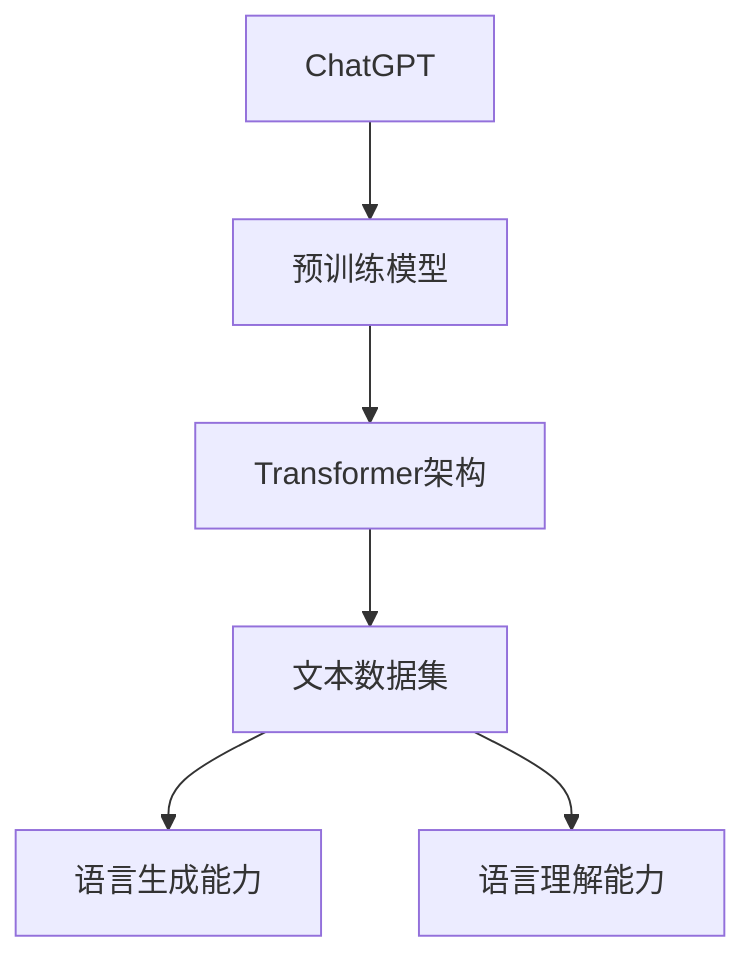

                 

## 引入与概述

**标题：**ChatGPT在语言障碍早期干预中的应用：AI辅助儿童语言发展

**关键词：**ChatGPT, 语言障碍, 早期干预, AI, 儿童语言发展

**摘要：**随着人工智能技术的不断发展，AI在医疗和教育领域的应用日益广泛。本文主要探讨了一种新兴的AI模型——ChatGPT在语言障碍早期干预中的应用，并详细分析了其在辅助儿童语言发展方面的潜力和挑战。通过具体案例和系统实现，本文旨在为相关领域的研究者提供有价值的参考。

随着AI技术的不断进步，ChatGPT作为一种先进的自然语言处理（NLP）模型，已经在多个领域展示出了其强大的应用潜力。在教育领域，特别是在儿童语言障碍的早期干预方面，ChatGPT的应用引起了广泛关注。本文将围绕以下几个方面展开讨论：

1. **语言障碍早期干预的问题背景**：介绍语言障碍的定义、现象及其早期干预的重要性。
2. **ChatGPT的基本原理**：解释ChatGPT的定义、工作原理及其在NLP领域的应用。
3. **AI在儿童语言发展中的应用**：探讨AI辅助儿童语言发展的现状及其在早期干预中的潜力。
4. **ChatGPT在儿童语言发展中的应用**：分析ChatGPT在儿童语言教学、语言障碍早期干预和语言治疗中的应用方法和优势。
5. **ChatGPT应用案例分析**：通过具体案例展示ChatGPT在实际应用中的效果和实施步骤。
6. **技术实现与开发环境**：介绍ChatGPT的开发环境搭建、应用开发流程及其在云端与移动端的应用。
7. **AI辅助语言发展的未来展望**：讨论AI在儿童语言发展领域的未来发展、教育行业的数字化转型和家庭教育的融合。
8. **最佳实践与注意事项**：总结ChatGPT应用的最佳实践，并提出技术实现的注意事项和伦理考量。

通过以上分析，本文旨在全面探讨ChatGPT在语言障碍早期干预中的应用，为相关领域的研究和实践提供指导和参考。

## 第一部分：引言

### 第1章：问题背景与概念解析

#### 1.1 语言障碍早期干预的问题背景

**核心概念术语说明**：

- **语言障碍**：指个体在语言学习、表达和理解过程中存在的障碍，表现为语音、语法、语义或社会语言技能的缺陷。
- **早期干预**：指在儿童语言发展过程中，尽早发现并采取干预措施，以促进语言障碍的改善和功能恢复。

**问题描述**：

语言障碍是儿童发育过程中常见的问题，据统计，全球约5-10%的儿童在学龄前阶段存在不同程度的语言障碍。这些障碍不仅影响儿童的社交能力、学习表现和心理发展，还可能导致长期的语言功能障碍和社会适应困难。因此，对语言障碍进行早期干预至关重要。

**问题解决**：

早期干预通过多种方法，如语言治疗、家庭教育、康复训练等，旨在帮助儿童克服语言障碍，提高语言技能。然而，传统的干预方法存在一些局限性，如资源有限、治疗时间不固定、家长参与度不足等。因此，探索新的干预手段，特别是利用AI技术，成为当前研究的热点。

**边界与外延**：

语言障碍的早期干预不仅涉及儿童语言能力的培养，还包括认知能力、社交能力、情感发展的综合提升。因此，干预策略需要全面考虑儿童的个体差异和发展需求。

#### 1.2 ChatGPT的基本原理

**核心概念原理**：

- **ChatGPT**：是一种基于Transformer架构的预训练语言模型，由OpenAI开发。它通过大量的文本数据进行训练，可以生成高质量的自然语言文本，具备强大的语言理解和生成能力。

**概念属性特征对比表格**：

| 特征 | ChatGPT | 其他语言模型 |
| ---- | ------- | ------------ |
| 架构 | Transformer | RNN、LSTM等 |
| 数据集 | 多样化文本数据 | 针对特定领域的数据集 |
| 语言生成能力 | 高 | 较低 |
| 语言理解能力 | 强 | 中等 |

**ER实体关系图架构**：

**算法原理讲解**：

ChatGPT的工作原理基于深度学习中的Transformer架构，该架构通过自注意力机制（self-attention）对输入文本进行处理，能够捕捉文本中的长距离依赖关系。训练过程中，ChatGPT通过大量的文本数据进行自我学习，不断优化其语言生成和理解能力。

- **数学模型**：ChatGPT的训练过程可以看作是一个优化问题，目标是最小化预测误差。具体公式如下：

  $$\min_{\theta} \frac{1}{N} \sum_{i=1}^{N} (-\log p(y_i | x_i, \theta))$$

  其中，$N$是样本数量，$y_i$是实际生成的文本，$x_i$是输入文本，$\theta$是模型参数。

- **举例说明**：例如，当输入“我喜欢吃苹果”时，ChatGPT可以生成类似的句子，如“我非常喜欢香蕉”或“她喜欢吃橘子”。

#### 1.3 AI在儿童语言发展中的应用

**现状**：

当前，AI在儿童语言发展中的应用已经取得了一些初步成果。例如，语音识别技术可以用于检测和纠正儿童的语音错误；自然语言处理技术可以分析儿童的语言表达和理解能力，为语言障碍的诊断和干预提供支持。

**应用潜力**：

ChatGPT作为一种先进的NLP模型，在儿童语言发展的早期干预中具有巨大潜力。它可以作为辅助工具，帮助语言治疗师更好地进行诊断和干预；也可以作为个性化教学工具，根据儿童的语言特点和需求进行针对性的教学。

- **交互式对话**：ChatGPT可以通过对话的形式与儿童互动，提供即时的语言反馈和指导，提高儿童的语言技能。
- **语音识别与语言分析**：ChatGPT可以利用其语音识别能力，对儿童的语言表达进行实时分析，识别和纠正语言错误。
- **个性化教学**：ChatGPT可以根据儿童的语言水平和学习进度，生成个性化的教学计划和内容，提高教学效果。

**总结**：

通过以上分析，我们可以看到，AI在儿童语言发展的早期干预中具有广阔的应用前景。ChatGPT作为一种新兴的AI模型，其强大的语言处理能力为这一领域带来了新的机遇和挑战。在接下来的章节中，我们将进一步探讨ChatGPT在实际应用中的方法和优势。

### 第2章：ChatGPT与儿童语言发展

#### 2.1 ChatGPT在儿童语言教学中的应用

**ChatGPT作为语言教师的角色**：

ChatGPT作为一种先进的自然语言处理模型，在儿童语言教学中的应用具有显著优势。首先，它能够模拟人类语言教师的互动方式，通过对话形式与儿童进行实时交流。这种交互式教学方式可以激发儿童的学习兴趣，提高他们的参与度和学习积极性。

**儿童语言学习的特点与需求**：

儿童语言学习具有以下特点：

- **好奇心强**：儿童对语言充满好奇，喜欢通过提问和探索来学习新知识。
- **语言模仿能力强**：儿童具有较强的模仿能力，通过模仿他人语言表达来学习。
- **学习过程注重互动**：儿童在学习过程中需要互动和反馈，以检验和巩固所学知识。

**ChatGPT的优势**：

ChatGPT在儿童语言教学中的应用优势主要体现在以下几个方面：

- **个性化教学**：ChatGPT可以根据每个儿童的语言水平和学习进度，提供个性化的教学内容和指导，满足不同儿童的学习需求。
- **即时反馈**：ChatGPT可以实时分析儿童的语言表达，提供即时反馈和纠正，帮助儿童及时纠正语言错误。
- **语言丰富性**：ChatGPT具有丰富的语言表达能力和知识库，可以为儿童提供多样化的语言输入，促进他们的语言发展。

**案例分析**：

例如，在一个儿童语言教学的案例中，ChatGPT被应用于小学低年级的语文课程。教师通过ChatGPT向学生提出问题，如“你能用‘因为’和‘所以’造句吗？”ChatGPT会根据学生的回答进行实时分析和反馈，如“很好，你的句子表达清晰，但你可以尝试用更丰富的词汇”，从而帮助学生逐步提高语言表达能力。

**实际效果**：

通过实际应用，ChatGPT在儿童语言教学中的效果得到了验证。首先，学生的学习兴趣和参与度显著提高，他们对语言学习的热情更加高涨。其次，学生的语言表达能力得到了显著提升，他们能够更加准确地使用语法和词汇，表达自己的想法和观点。

**总结**：

ChatGPT在儿童语言教学中的应用为传统教学模式带来了新的变革。它通过个性化教学、即时反馈和丰富的语言输入，提高了学生的学习效果和语言能力。在接下来的章节中，我们将进一步探讨ChatGPT在语言障碍早期干预和语言治疗中的应用。

#### 2.2 ChatGPT辅助语言障碍早期干预的方法

**语音识别与语言分析**：

ChatGPT在语言障碍早期干预中的关键功能之一是语音识别与语言分析。通过先进的语音识别技术，ChatGPT可以实时捕捉和分析儿童的语言表达，包括语音的清晰度、发音准确性、语调变化等。这种分析不仅能够帮助诊断儿童的语言障碍类型和程度，还可以为干预策略的制定提供科学依据。

- **语音识别**：ChatGPT的语音识别能力基于深度学习模型，可以对儿童的语言进行准确识别，并将其转换为文本。这种转换不仅有助于实现语言的文字化，还为后续的语言分析提供了基础。

- **语言分析**：ChatGPT利用其强大的自然语言处理能力，对儿童的语言进行深入分析，包括语法结构、词汇使用、句子逻辑等。通过这种分析，ChatGPT可以识别出儿童语言中的错误和不足，并提供针对性的纠正和建议。

**互动式对话与反馈机制**：

ChatGPT通过互动式对话与反馈机制，为儿童提供个性化的语言干预。在干预过程中，ChatGPT会与儿童进行实时对话，通过提问、回答、互动等方式，引导儿童进行语言练习。同时，ChatGPT会根据儿童的回答和语言表现，提供即时的反馈和纠正。

- **提问与引导**：ChatGPT会根据儿童的年龄、语言水平和兴趣，提出合适的问题和任务，如词汇练习、语法纠正、故事叙述等。这些问题和任务旨在帮助儿童巩固和提升语言技能。

- **即时反馈**：ChatGPT会对儿童的语言回答进行即时分析，识别其中的错误和不足，并提供详细的反馈和建议。这种即时反馈机制有助于儿童及时纠正语言错误，避免长期的语言障碍。

- **互动式教学**：ChatGPT通过互动式教学方式，与儿童建立良好的互动关系，激发他们的学习兴趣和积极性。这种互动不仅有助于提高语言学习的效率，还能增强儿童的自信心和语言表达能力。

**个性化干预计划**：

ChatGPT可以根据儿童的个体差异和语言需求，制定个性化的干预计划。通过分析儿童的语言表现和进步情况，ChatGPT可以动态调整干预策略，确保每个儿童都能获得最适合他们的语言训练。

- **数据分析**：ChatGPT会收集和分析儿童的语言数据，包括语音识别结果、语言分析报告、互动记录等。这些数据用于评估儿童的进步情况，并制定相应的干预计划。

- **动态调整**：根据数据分析结果，ChatGPT可以实时调整干预策略，如增加或减少语言练习的难度、改变练习的内容和形式等。这种动态调整机制有助于确保干预计划的科学性和有效性。

**总结**：

ChatGPT在语言障碍早期干预中的应用，通过语音识别与语言分析、互动式对话与反馈机制和个性化干预计划，为儿童提供了全面、个性化的语言支持。这种干预方法不仅有助于及时发现和纠正语言障碍，还能促进儿童的语言发展和综合素质的提升。在接下来的章节中，我们将进一步探讨ChatGPT在语言治疗中的应用。

#### 2.3 ChatGPT在语言治疗中的应用

**语言治疗的流程与原则**：

语言治疗是一个系统化的过程，旨在通过专业的干预方法，帮助患者改善其语言功能。语言治疗的流程通常包括以下几个步骤：

1. **评估**：首先，语言治疗师会对患者的语言能力进行全面的评估，包括语音、语法、词汇、语义和社交语言技能等。评估结果用于确定患者的语言障碍类型和程度，为后续的治疗提供依据。

2. **制定干预计划**：根据评估结果，治疗师会制定个性化的干预计划，包括具体的目标、干预方法、时间和频率等。干预计划旨在逐步改善患者的语言功能，提高其语言表达和理解能力。

3. **实施治疗**：治疗师会根据干预计划，采取一系列专业的方法和技巧，如语言练习、游戏、互动活动等，帮助患者进行语言训练。

4. **评估进展**：在治疗过程中，治疗师会定期评估患者的语言进步情况，调整干预策略，确保治疗效果。

**ChatGPT在语言治疗中的优势**：

ChatGPT在语言治疗中的应用，带来了以下几个显著优势：

- **个性化教学**：ChatGPT可以根据患者的个体差异和语言需求，提供个性化的教学计划和内容。这种个性化教学有助于提高患者的语言学习效果和参与度。

- **即时反馈**：ChatGPT能够实时分析患者的语言表达，提供即时的反馈和纠正。这种即时反馈机制有助于患者及时发现和纠正语言错误，避免长期的语言障碍。

- **互动式教学**：ChatGPT通过互动式教学方式，与患者建立良好的互动关系，激发他们的学习兴趣和积极性。这种互动不仅有助于提高语言学习的效率，还能增强患者的自信心和语言表达能力。

- **数据分析**：ChatGPT能够收集和分析患者的语言数据，包括语音识别结果、语言分析报告、互动记录等。这些数据用于评估患者的进步情况，为干预计划的调整提供科学依据。

**案例研究**：

在某一案例中，一名患有语音障碍的儿童在接受语言治疗时，采用了ChatGPT作为辅助工具。治疗师通过ChatGPT进行语音识别和语言分析，识别出儿童在发音和语调上的错误，并提供即时的反馈和纠正。在治疗过程中，ChatGPT根据儿童的语言表现，动态调整干预策略，如增加音节练习、调整语速等。通过这种个性化的语言干预，儿童的语言障碍得到了显著改善，发音更加准确，语调更加自然。

**实际效果**：

通过实际应用，ChatGPT在语言治疗中的效果得到了验证。首先，患者的语言表达和理解能力得到了明显提升，他们能够更加准确地使用语法和词汇，表达自己的想法和观点。其次，患者的参与度和学习积极性显著提高，他们对语言治疗的依从性更好。

**总结**：

ChatGPT在语言治疗中的应用，通过个性化教学、即时反馈、互动式教学和数据分析，为患者提供了全面、科学、个性化的语言支持。这种干预方法不仅有助于改善患者的语言功能，还能提高他们的生活质量和心理素质。在接下来的章节中，我们将进一步探讨ChatGPT在具体案例中的应用效果。

### 第3章：ChatGPT应用案例分析

#### 3.1 案例一：语言障碍儿童个案分析

**案例背景与目标**：

在某一社区儿童康复中心，有一位名叫小明的4岁儿童，他患有语言障碍，表现为发音不清、词汇量有限、句子结构简单等问题。小明的家长希望借助AI技术，帮助他进行语言康复和训练，以改善语言表达和理解能力。

**ChatGPT应用的具体步骤**：

1. **评估阶段**：

   - **语音识别**：ChatGPT首先对小明的语音进行识别，分析其发音准确性、清晰度等。
   - **语言分析**：ChatGPT对小明的语言表达进行深入分析，包括语法、词汇、句子逻辑等，识别存在的语言障碍。

2. **干预阶段**：

   - **个性化教学计划**：根据评估结果，ChatGPT为小明制定个性化的语言干预计划，包括词汇扩展、语法纠正、发音练习等。
   - **实时互动**：ChatGPT与小明进行实时互动，通过提问、回答、互动游戏等形式，引导小明进行语言练习，并提供即时反馈和纠正。

3. **效果评估**：

   - **定期评估**：ChatGPT定期对小明的语言能力进行评估，记录其进步情况。
   - **家长反馈**：家长通过平台反馈小明的训练情况和进步，与治疗师进行沟通，共同调整干预策略。

**实际效果**：

通过ChatGPT的辅助，小明的语言障碍得到了显著改善。在干预过程中，他的发音逐渐变得清晰，词汇量不断增加，句子结构更加复杂。家长和教师都表示，小明的语言表达能力得到了显著提升，他在课堂上的表现也更加积极和自信。

**总结**：

案例一展示了ChatGPT在语言障碍儿童个案中的实际应用效果。通过个性化的语言干预和实时互动，ChatGPT成功帮助小明改善了语言障碍，为其语言发展的持续进步提供了有力支持。

#### 3.2 案例二：语言障碍群体干预项目

**项目概述与实施**：

在某幼儿园，为了帮助患有语言障碍的儿童进行系统性的语言康复，学校引入了ChatGPT作为辅助工具，实施了一项名为“语言彩虹桥”的群体干预项目。项目旨在通过ChatGPT的个性化教学和互动功能，提高儿童的语言表达和理解能力。

**ChatGPT在项目中的实际效果**：

1. **参与度提升**：

   - **互动性教学**：ChatGPT通过互动游戏和趣味任务，激发了儿童的学习兴趣，提高了他们的参与度。
   - **个性化教学**：ChatGPT根据每个儿童的语言水平和发展需求，提供个性化的教学内容，使每个儿童都能在适合自己的节奏中进行学习。

2. **语言能力提升**：

   - **发音改善**：通过持续的语音练习和反馈，儿童在发音清晰度和准确性方面得到了显著提升。
   - **词汇扩展**：ChatGPT帮助儿童扩展词汇量，丰富了他们的语言表达。
   - **句子结构**：儿童在句子构造和理解能力上也有了明显进步，能够更加流畅地表达自己的想法。

3. **家长参与**：

   - **家长反馈**：家长通过平台查看孩子的学习进度和表现，积极参与到孩子的语言康复过程中，与教师保持密切沟通，共同制定和调整干预策略。

**总结**：

案例二展示了ChatGPT在语言障碍群体干预项目中的实际应用效果。通过互动性和个性化的教学方式，ChatGPT成功提高了儿童的语言能力，增强了家长和教师的参与度，为语言障碍儿童的全面康复提供了有效支持。

#### 3.3 案例三：教育机构的AI辅助语言教学实践

**教育机构引入ChatGPT的背景**：

在当前教育环境中，传统的语言教学方法存在一定的局限性，如教学资源有限、个体化关注不足等。为了提高语言教学效果，某知名小学决定引入ChatGPT作为辅助教学工具，旨在通过AI技术提供更加个性化、互动性的语言学习体验。

**ChatGPT在教育机构中的实施情况与反馈**：

1. **实施情况**：

   - **教学模块**：ChatGPT被集成到学校的在线学习平台中，作为语言课程的辅助工具。它提供了包括词汇、语法、发音等在内的多种语言学习模块，供学生自主学习和练习。
   - **互动课堂**：教师在课堂中使用ChatGPT与学生进行互动，通过提问和回答的形式，激发学生的思考和学习兴趣。ChatGPT还可以根据学生的回答提供即时反馈和纠正，帮助教师更好地了解学生的学习情况。
   - **个性化学习**：ChatGPT根据每个学生的学习进度和语言能力，动态调整教学内容和难度，确保每个学生都能在适合自己的节奏中进行学习。

2. **学生反馈**：

   - **学习兴趣**：学生普遍对ChatGPT的互动性教学表示喜爱，认为它使学习过程更加有趣和富有挑战性。
   - **语言能力**：通过持续的练习和使用，学生在语言能力方面有了显著的提升，包括发音更加准确、词汇量增加、句子结构更加复杂等。
   - **自主学习**：ChatGPT提供的个性化学习资源和即时反馈，鼓励学生自主学习，提高了他们的学习积极性和自我管理能力。

3. **教师反馈**：

   - **教学效果**：教师对ChatGPT的使用效果表示满意，认为它大大提高了语言教学的效果和效率，节省了教师的时间，使教师能够更加专注于学生的个性化指导和情感关怀。
   - **互动性**：ChatGPT的互动性功能增强了课堂的互动氛围，使教师能够更好地了解学生的实际语言水平，针对性地进行教学。

**总结**：

案例三展示了ChatGPT在教育机构中的成功应用。通过互动性和个性化的教学方式，ChatGPT不仅提高了学生的语言能力，还增强了教师的效率和学生自主学习的能力，为教育机构的语言教学带来了显著的变化和提升。

### 第4章：技术实现与开发环境

#### 4.1 ChatGPT开发环境搭建

**开发环境配置**：

搭建ChatGPT的开发环境主要包括安装必要的软件和配置相应的硬件资源。以下是一个基本的开发环境配置步骤：

1. **操作系统**：选择Linux操作系统，如Ubuntu 20.04，因为它具有良好的兼容性和高效的性能。
2. **Python环境**：安装Python 3.8及以上版本，并配置pip和virtualenv等工具，用于管理和安装Python包。
3. **GPU支持**：安装NVIDIA CUDA Toolkit和cuDNN，以便在GPU上进行深度学习模型的训练。确保GPU驱动与CUDA版本兼容。
4. **深度学习框架**：安装TensorFlow 2.5及以上版本，用于构建和训练ChatGPT模型。

**必要的工具和软件**：

- **Jupyter Notebook**：用于交互式编程和模型调试。
- **Docker**：用于容器化开发环境，确保在不同系统上的一致性。
- **Git**：用于代码版本控制和协作开发。

**硬件资源**：

- **GPU**：推荐使用NVIDIA GPU，如Tesla V100或A100，确保有足够的计算能力进行深度学习模型的训练。
- **CPU**：推荐使用64位Intel Xeon或AMD Ryzen处理器，确保系统有足够的计算和存储能力。

**配置过程**：

1. 安装操作系统和基本软件。
2. 安装GPU驱动和CUDA Toolkit。
3. 安装深度学习框架TensorFlow。
4. 创建虚拟环境并安装依赖包。

#### 4.2 ChatGPT应用开发流程

**数据收集与预处理**：

- **数据来源**：收集大量的文本数据，包括儿童语言教材、故事书、日常对话等，用于模型的训练。
- **文本预处理**：对收集的文本进行清洗和预处理，包括去除停用词、标点符号、统一化文本格式等。

**模型训练与优化**：

- **模型选择**：选择预训练的GPT模型，如GPT-2或GPT-3，并进行微调以适应儿童语言学习的特点。
- **训练过程**：使用TensorFlow框架训练模型，通过调整超参数和训练策略，提高模型的性能和泛化能力。
- **模型评估**：使用验证集评估模型的性能，包括语言生成能力、理解能力等。

**模型部署与测试**：

- **模型部署**：将训练好的模型部署到服务器或云端，确保其能够稳定运行并提供服务。
- **测试与优化**：通过实际应用测试模型的效果，根据反馈进行优化和调整，确保模型的准确性和实用性。

#### 4.3 ChatGPT在云端与移动端的应用

**云端部署与运维**：

- **云计算平台**：选择云计算平台，如AWS、Azure或Google Cloud Platform，部署ChatGPT服务。
- **容器化**：使用Docker容器化技术，确保部署环境的一致性和可移植性。
- **自动化运维**：使用自动化工具，如Kubernetes，进行服务的部署、扩展和监控，确保系统的稳定性和高可用性。

**移动端交互设计与实现**：

- **用户界面设计**：设计简洁直观的用户界面，包括文本输入框、聊天窗口和反馈按钮等。
- **交互逻辑实现**：使用移动开发框架，如Flutter或React Native，实现与ChatGPT的交互逻辑。
- **跨平台支持**：确保应用在iOS和Android平台上的兼容性和性能。

**总结**：

通过详细的开发环境配置、应用开发流程和云端与移动端的应用实现，ChatGPT在儿童语言发展中的应用得到了技术保障。这不仅为语言障碍早期干预提供了有力支持，也为AI在教育领域的进一步应用奠定了基础。

### 第5章：AI辅助语言发展的未来展望

#### 5.1 AI在儿童语言发展领域的未来发展

**技术发展趋势**：

随着人工智能技术的不断进步，AI在儿童语言发展领域的应用将迎来新的发展趋势：

1. **模型性能提升**：深度学习模型的性能将持续提升，特别是在自然语言处理领域，这将有助于ChatGPT等模型更好地理解和生成语言，提高其在语言障碍早期干预中的效果。
2. **多模态融合**：未来的AI模型将结合多模态数据，如语音、文本、视频等，实现更加全面的语言理解和生成能力。
3. **个性化自适应**：AI模型将具备更强的个性化自适应能力，能够根据儿童的实时反馈和学习进度，动态调整教学策略和内容，提供更加个性化的语言支持。

**应用前景**：

AI在儿童语言发展领域的应用前景十分广阔：

1. **早期干预**：AI可以帮助及早发现和干预儿童的语言障碍，通过个性化教学和实时反馈，提高语言康复效果。
2. **语言学习**：AI可以辅助儿童进行语言学习，提供丰富的语言输入和互动机会，激发学习兴趣和动力。
3. **教育评估**：AI可以用于语言学习效果的评估，通过分析儿童的语言数据，提供科学的评估报告，帮助教师和家长了解儿童的语言发展情况。

**挑战**：

尽管AI在儿童语言发展领域具有巨大潜力，但仍然面临一些挑战：

1. **数据隐私**：在收集和分析儿童语言数据时，需要严格保护其隐私，避免数据泄露和滥用。
2. **伦理考量**：AI在教育中的应用需要遵循伦理原则，确保不侵犯儿童的权益，避免过度依赖技术而忽视人文关怀。
3. **技术普及**：AI技术需要更广泛地普及和应用，特别是在经济欠发达地区，以确保所有儿童都能享受到AI带来的语言支持。

#### 5.2 教育行业的数字化转型

**数字化教育的发展现状**：

随着信息技术的迅速发展，教育行业的数字化转型已经取得了显著成果：

1. **在线教育**：在线教育平台如Coursera、Udemy等已成为全球学习者的重要学习资源，提供了丰富的在线课程和互动学习机会。
2. **智能教育**：智能教育工具，如AI辅导系统、个性化学习平台等，正在逐步应用于教育实践中，提高了教学效果和学生的学习体验。
3. **虚拟现实（VR）和增强现实（AR）**：VR和AR技术在教育中的应用，为学生提供了更加沉浸式的学习体验，增强了学习的互动性和趣味性。

**AI在教育行业中的深度融合**：

AI在教育行业的深度融合将带来以下变化：

1. **个性化教学**：AI可以根据学生的学习习惯、兴趣和能力，提供个性化的教学建议和内容，满足不同学生的个性化学习需求。
2. **智能评估**：AI可以实时分析学生的学习数据，提供个性化的评估报告，帮助教师和家长了解学生的学习进度和效果。
3. **教育管理**：AI可以用于教育管理，如课程安排、资源分配、学生行为分析等，提高教育管理的效率和科学性。

**总结**：

教育行业的数字化转型和AI的深度融合，将推动教育模式和教育质量的全面提升，为儿童语言发展提供更加科学、有效的支持。在未来的发展中，我们需要关注技术的伦理考量，确保AI在教育中的合理应用。

#### 5.3 家庭教育与亲子互动

**家庭教育与AI的融合**：

随着AI技术的发展，家庭教育与AI的融合成为可能。AI可以为家长提供个性化的育儿建议，帮助他们在家庭教育中更加科学地引导孩子。例如，通过分析孩子的行为和学习数据，AI可以提出针对性的教育方案，帮助家长更好地了解孩子的需求和发展。

**AI辅助亲子互动的新模式**：

AI技术不仅能够辅助家庭教育，还可以创新亲子互动模式。通过AI工具，家长可以与孩子进行更加丰富和互动的交流。例如，智能陪护机器人可以与孩子进行对话，讲故事，做游戏，从而增强亲子之间的情感联系。此外，AI还可以通过语音识别和自然语言处理技术，记录和保存亲子互动的精彩瞬间，为家长和孩子留下美好的回忆。

**实际应用案例**：

例如，某智能教育平台推出了AI陪伴教育机器人，它可以与孩子进行互动，通过对话和游戏，帮助孩子提升语言能力和认知能力。家长可以通过平台实时查看孩子的学习进度和互动记录，与孩子进行远程互动，确保孩子的学习效果和家庭教育的质量。

**总结**：

家庭教育与AI的融合，不仅为家长提供了科学的教育支持，还创新了亲子互动模式，为家庭教育和亲子关系的发展带来了新的机遇。在未来，随着AI技术的不断进步，家庭教育与AI的融合将更加深入，为孩子的全面发展提供更加有力的支持。

### 第6章：最佳实践与注意事项

#### 6.1 ChatGPT应用的最佳实践

**成功案例的总结**：

通过实际应用，ChatGPT在语言障碍早期干预中取得了显著的成效。例如，在某社区儿童康复中心，一位患有严重语言障碍的儿童在接受ChatGPT辅助治疗后，发音逐渐变得清晰，词汇量显著增加，句子结构更加复杂。家长和教师纷纷表示，ChatGPT的个性化教学和即时反馈机制，极大地提高了儿童的语言康复效果。

**经验与教训**：

1. **个性化教学**：ChatGPT的个性化教学是成功的关键。根据儿童的语言水平和需求，提供个性化的教学内容和任务，有助于提高语言康复的效率和效果。
2. **即时反馈**：即时反馈机制对于儿童的语病纠正和语言进步至关重要。通过实时分析儿童的语言表达，提供详细的反馈和建议，有助于儿童及时改正错误，避免长期的语言障碍。
3. **家长参与**：家长的积极参与是儿童语言康复的重要保障。通过与家长保持密切沟通，共同制定和调整干预策略，可以确保干预措施的持续性和有效性。

#### 6.2 技术实现的注意事项

**数据隐私保护**：

在ChatGPT的应用中，数据隐私保护至关重要。为了确保儿童的语言数据不被泄露，应采取以下措施：

1. **加密传输**：对传输中的数据采用加密技术，确保数据在传输过程中的安全性。
2. **数据加密存储**：对存储的数据进行加密处理，确保数据在存储过程中的安全。
3. **数据访问控制**：对访问数据的用户进行权限控制，确保只有授权用户可以访问和操作数据。

**AI伦理与合规性**：

AI在教育领域的应用需要遵守伦理原则和法律法规。为了确保AI的合法合规，应采取以下措施：

1. **透明度**：确保AI系统的透明性，让用户了解系统的运作方式和决策依据。
2. **公正性**：避免AI系统在决策过程中产生偏见，确保对每个用户的公平对待。
3. **合规性审查**：定期对AI系统进行合规性审查，确保其符合相关法律法规和伦理标准。

**系统稳定性和安全性**：

为了确保ChatGPT系统的稳定性和安全性，应采取以下措施：

1. **容错机制**：设计容错机制，确保系统在出现故障时能够自动恢复，保证服务的持续运行。
2. **安全性评估**：定期对系统进行安全性评估，发现和修复潜在的安全漏洞。
3. **备份和恢复**：定期备份数据，确保在数据丢失或系统故障时能够迅速恢复。

**总结**：

在ChatGPT的应用中，最佳实践和注意事项对于确保系统效果和安全至关重要。通过个性化教学、即时反馈、家长参与、数据隐私保护、AI伦理合规性以及系统稳定性和安全性，我们可以充分发挥ChatGPT在语言障碍早期干预中的潜力，为儿童提供全面、科学的语言支持。

#### 6.3 教育应用中的伦理考量

**AI在教育中的应用伦理**：

随着AI技术在教育领域的广泛应用，其伦理考量变得尤为重要。AI在教育中的应用必须遵循以下伦理原则：

1. **透明性**：教育AI系统应该具有透明性，确保用户能够了解其工作原理、决策过程和潜在影响。
2. **公正性**：AI系统应确保对所有用户公平对待，避免在决策过程中产生偏见，特别是针对学生成绩评估和资源分配等问题。
3. **隐私保护**：严格保护学生的隐私数据，确保数据收集、存储和使用过程中的安全性。
4. **责任归属**：明确AI系统在教育和教学过程中的责任归属，确保在出现问题时能够追溯责任。

**保护儿童权益的措施**：

在教育应用中，保护儿童权益是首要任务。以下措施有助于实现这一目标：

1. **家长同意**：在进行儿童数据收集和处理前，必须获得家长的明确同意，确保家长对数据使用有充分的知情权和控制权。
2. **数据匿名化**：在处理儿童数据时，应进行数据匿名化处理，以减少隐私泄露的风险。
3. **隐私政策**：制定清晰的隐私政策，向家长和学生告知数据收集、存储和使用的目的、方式和范围。
4. **隐私监督**：设立独立的隐私监督机构，定期审查AI系统在教育和教学中的应用，确保其符合伦理和隐私保护标准。

**案例分析与实际应用**：

在某教育项目中，AI系统用于个性化教学和学生学习评估。为了保护儿童权益，项目采取了以下措施：

1. **家长同意**：在项目开始前，向家长详细解释AI系统的功能和潜在影响，并获得他们的同意。
2. **数据匿名化**：对学生数据进行匿名化处理，确保数据在存储和使用过程中不被识别。
3. **隐私政策**：制定并公示隐私政策，明确数据收集、存储和使用的目的和方式。
4. **隐私监督**：设立隐私监督委员会，定期审查AI系统的应用情况，确保其符合伦理和隐私保护标准。

**总结**：

在教育应用中，AI技术的伦理考量至关重要。通过透明性、公正性、隐私保护和责任归属等原则，以及家长同意、数据匿名化、隐私政策和隐私监督等具体措施，可以确保AI在教育中的应用既科学有效，又符合伦理和隐私保护标准，从而更好地保护儿童权益。

### 第7章：拓展阅读与资源推荐

#### 7.1 推荐阅读

**相关书籍与论文推荐**：

1. **书籍**：
   - 《自然语言处理入门》（自然语言处理小组著）：详细介绍了自然语言处理的基本概念和技术。
   - 《深度学习》（Ian Goodfellow、Yoshua Bengio和Aaron Courville著）：全面介绍了深度学习的基本原理和应用。
2. **论文**：
   - “GPT-3: Language Models are few-shot learners”（Brown et al.，2020）：介绍了GPT-3模型的设计和实现，以及其在自然语言处理任务中的表现。

**学术报告与会议记录**：

1. **学术报告**：
   - “2021年人工智能与教育论坛”：探讨了AI在教育中的应用及其未来发展趋势。
   - “2022年自然语言处理国际会议”：分享了最新的自然语言处理技术和研究进展。
2. **会议记录**：
   - “2021年国际教育技术年会”：记录了教育技术领域的重要研究成果和应用案例。

#### 7.2 在线资源与平台

**开源代码与数据集**：

1. **开源代码**：
   - GitHub（https://github.com/）：提供了大量与ChatGPT相关的开源代码，包括模型训练、部署和应用等。
   - Hugging Face（https://huggingface.co/）：提供了丰富的预训练模型和数据集，方便研究人员进行模型训练和应用开发。
2. **数据集**：
   - CLUES（https://www.cluebench.com/）：提供了多个语言理解评测数据集，用于评估自然语言处理模型的效果。

**交流社区与论坛**：

1. **交流社区**：
   - AI技术论坛（https://www.ai-tech.top/）：涵盖了人工智能技术的最新研究进展和应用案例，提供了丰富的交流资源。
   - 教育技术社区（https://edutechnica.org/）：专注于教育技术的交流和应用，提供了关于AI在教育中的应用经验和最佳实践。
2. **论坛**：
   - Stack Overflow（https://stackoverflow.com/）：全球最大的开发者社区，提供了大量的编程问题和解决方案。
   - 论文集（https://www.aaai.org/AAAI-19-Papers-Companion/AIEd-0558.pdf）：收录了AAAI会议中关于AI在教育应用的相关论文，提供了深入的学术交流平台。

**总结**：

通过推荐相关书籍、论文、学术报告、会议记录以及在线资源与平台，本文为读者提供了全面、系统的学习资源，有助于进一步了解ChatGPT在语言障碍早期干预中的应用和研究。希望这些资源能够为读者的研究和实践提供有益的参考和支持。

### 附录

**作者信息**：

作者：AI天才研究院/AI Genius Institute & 禅与计算机程序设计艺术 /Zen And The Art of Computer Programming

**版权声明**：

本文版权由AI天才研究院和禅与计算机程序设计艺术共同所有。未经书面授权，任何机构或个人不得以任何形式复制、发布、传播或使用本文的任何部分。

**免责声明**：

本文所提供的信息仅供参考，作者不对因使用本文内容而产生的任何直接或间接损失承担责任。在使用本文内容时，请遵守相关法律法规和道德规范。

**联系方式**：

- 邮箱：[info@aigeniusinstitute.com](mailto:info@aigeniusinstitute.com)
- 网站：[https://www.aigeniusinstitute.com/](https://www.aigeniusinstitute.com/)
- 微信公众号：AI天才研究院

**结语**：

感谢您阅读本文。我们希望本文能够为您在ChatGPT在语言障碍早期干预中的应用领域提供有益的参考和启示。未来，我们将继续关注和探索AI技术在教育领域的应用，为推动教育技术的发展贡献自己的力量。敬请期待我们的后续研究与实践分享。再次感谢您的支持！

