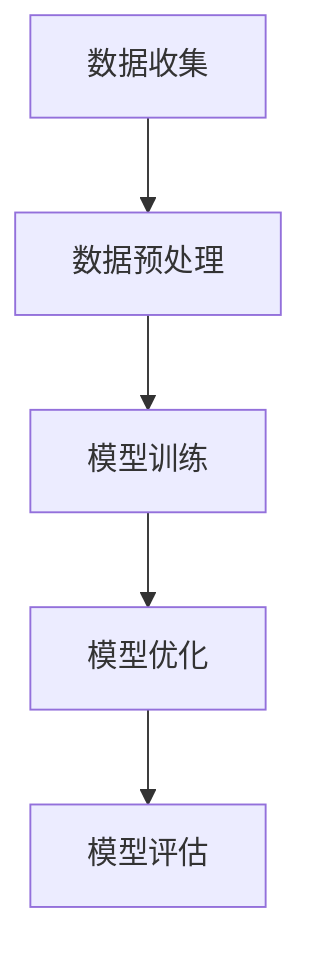
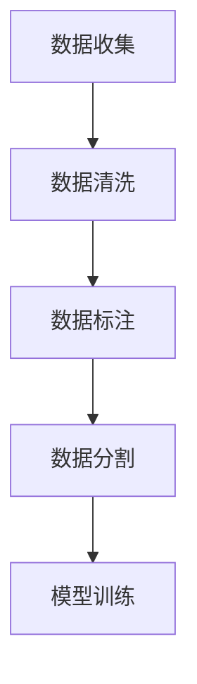
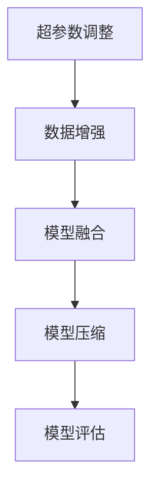
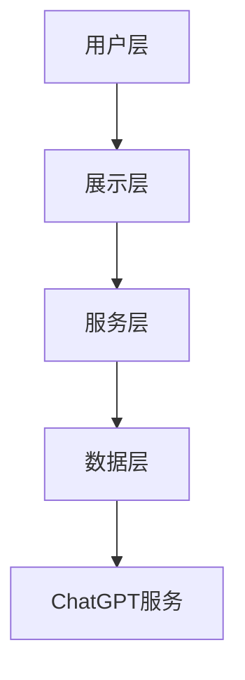
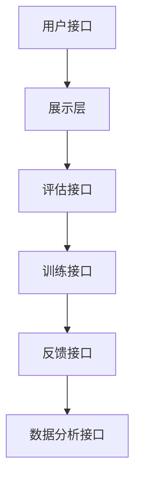
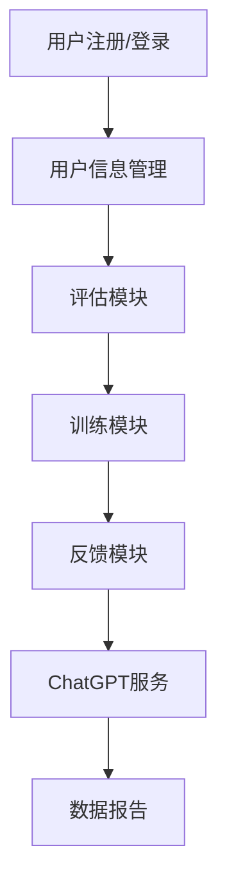

                 

### 文章标题与目标读者

# 《ChatGPT在语言障碍治疗中的应用》

> 关键词：ChatGPT、语言障碍、治疗、自然语言处理、人工智能

> 摘要：本文深入探讨ChatGPT在语言障碍治疗中的应用，从核心概念、技术原理到实际案例，全面解析这一前沿领域的进展与潜力。目标读者为语言治疗师、康复科医生、心理学研究者以及对人工智能在医疗领域感兴趣的技术人员。

在当今社会，语言障碍是一种常见且影响深远的健康问题，影响着患者的沟通能力、生活质量和社会融入。传统语言障碍治疗依赖于专业人员和面对面的互动，虽然有一定效果，但受限于时间和资源的限制。随着人工智能技术的快速发展，特别是自然语言处理（NLP）的进步，ChatGPT等人工智能模型为语言障碍治疗带来了新的可能。

本文旨在探讨如何利用ChatGPT这一先进的人工智能工具来辅助语言障碍治疗，旨在帮助专业人士了解其应用原理、技术实现以及在实际治疗中的效果。通过本文的阅读，读者将了解到：

- ChatGPT的基本概念和原理；
- 语言障碍治疗的现状和挑战；
- ChatGPT在语言障碍治疗中的具体应用；
- ChatGPT在语言障碍治疗中的技术实现；
- ChatGPT在语言障碍治疗中的实际案例；
- ChatGPT在语言障碍治疗中的未来展望。

文章结构如下：

1. 引言：介绍ChatGPT的发展背景、在语言障碍治疗中的重要性以及本文解决的问题；
2. ChatGPT基础：阐述ChatGPT的基本原理和技术特点；
3. 语言障碍治疗概述：介绍语言障碍的定义、分类和治疗现状；
4. ChatGPT与语言障碍治疗的关系：探讨ChatGPT在语言障碍治疗中的应用潜力；
5. 应用案例：列举ChatGPT在不同类型的语言障碍治疗中的应用案例；
6. 技术实现：详细介绍ChatGPT的应用技术；
7. 系统架构设计：描述如何将ChatGPT集成到语言障碍治疗系统中；
8. 案例分析：通过具体案例展示ChatGPT的实际应用效果；
9. 总结与展望：总结本文的主要观点，展望ChatGPT在语言障碍治疗领域的未来。

### 背景介绍

#### ChatGPT的发展

ChatGPT是由OpenAI开发的一种基于变换器（Transformer）架构的大型预训练语言模型。自2018年Transformer模型被提出以来，它以其在自然语言处理（NLP）任务中的卓越表现，迅速成为机器学习领域的重要突破。ChatGPT的诞生，标志着语言模型的发展进入了一个新的阶段。

ChatGPT采用了GPT-3模型，这是一种具备1750亿参数的巨大神经网络模型，其训练数据来自互联网上的大量文本数据。GPT-3模型能够理解并生成人类语言的复杂结构，包括对话、文章、故事等。这种强大的语言生成能力使得ChatGPT在多个领域展现出广泛的应用潜力，从文本生成、机器翻译、问答系统，到如今的语言障碍治疗。

#### 在语言障碍治疗中的重要性

语言障碍治疗是一个复杂且长期的过程，涉及语言技能的训练、语言理解的提升以及社交沟通能力的培养。传统治疗方式主要依赖于专业治疗师与患者的面对面互动，这种方式虽然能够提供个性化的服务，但受到时间和资源的限制，治疗效果有限。

ChatGPT的出现为语言障碍治疗带来了新的契机。首先，ChatGPT能够模拟人类语言交流，为患者提供24/7的互动，弥补了传统治疗在时间和资源上的不足。其次，ChatGPT可以针对患者的具体语言障碍进行定制化训练，提高治疗效率。此外，ChatGPT的统计分析能力，可以帮助治疗师更好地评估患者的语言进步，为后续治疗提供数据支持。

总的来说，ChatGPT在语言障碍治疗中的重要性体现在以下几个方面：

1. **提高治疗效率**：ChatGPT可以全天候为患者提供服务，减少治疗时间上的限制，提高治疗效率。
2. **个性化定制**：ChatGPT可以根据患者的具体语言障碍，提供个性化的训练方案，提高治疗效果。
3. **数据分析**：ChatGPT的统计分析能力，可以帮助治疗师更好地评估患者的语言进步，为后续治疗提供数据支持。
4. **拓宽治疗范围**：ChatGPT的出现，使得一些偏远地区或无法及时获得专业治疗的患者，也能享受到高质量的言语治疗服务。

#### 解决的问题

ChatGPT在语言障碍治疗中的应用，旨在解决以下几个关键问题：

1. **时间与资源的限制**：传统语言障碍治疗依赖于专业治疗师，由于时间和资源的限制，患者往往无法得到足够的治疗。ChatGPT的出现，可以为患者提供24/7的互动服务，减少治疗时间上的限制。
2. **个性化治疗**：传统治疗方式往往缺乏个性化，而ChatGPT可以根据患者的具体语言障碍，提供定制化的训练方案，提高治疗效果。
3. **治疗评估**：传统治疗方式缺乏有效的评估手段，而ChatGPT的统计分析能力，可以帮助治疗师更好地评估患者的语言进步，为后续治疗提供数据支持。
4. **治疗范围**：ChatGPT的应用，使得一些偏远地区或无法及时获得专业治疗的患者，也能享受到高质量的言语治疗服务。

通过ChatGPT在语言障碍治疗中的应用，不仅能够提高治疗效率，还能够为患者提供更加个性化和便捷的服务，从而改善他们的生活质量。

#### 核心概念与联系

在探讨ChatGPT在语言障碍治疗中的应用之前，我们需要了解一些核心概念和技术原理，以便更好地理解ChatGPT的工作方式以及它在治疗语言障碍中的作用。

##### ChatGPT的基本原理

ChatGPT是基于变换器（Transformer）架构的大型预训练语言模型。变换器是一种深度神经网络架构，它在处理序列数据时具有出色的性能。ChatGPT的训练数据来自互联网上的大量文本数据，这些数据包括书籍、新闻文章、社交媒体帖子等。在训练过程中，ChatGPT学习了这些文本数据中的语言结构和语义信息。

ChatGPT的核心思想是通过学习文本序列的上下文，生成符合人类语言习惯的文本。它能够理解并生成复杂的语言结构，包括对话、文章、故事等。ChatGPT的训练采用了自回归语言模型（Autoregressive Language Model）的技术，这意味着它通过预测下一个单词或字符来生成文本。

以下是ChatGPT的基本工作流程：

1. **输入处理**：将用户输入的文本转换为模型可以处理的格式，通常是一个固定长度的向量。
2. **前向传播**：将输入向量通过变换器模型进行前向传播，模型会根据输入的上下文生成一个概率分布，表示下一个单词或字符的可能性。
3. **生成文本**：根据生成的概率分布，模型选择一个最可能的单词或字符，并将其作为输出。然后，将这个输出作为新的输入，重复上述过程，直到生成完整的文本。

##### 语言障碍的类型和治疗方法

语言障碍是一种影响人们沟通能力的障碍，可以分为不同的类型，包括发育性语言障碍、获得性语言障碍、社交语言障碍等。

1. **发育性语言障碍**：通常在儿童早期出现，表现为语言发展迟缓、词汇量有限、语法错误等。发育性语言障碍可能是由基因、脑损伤、听力问题等多种因素引起的。

2. **获得性语言障碍**：通常在成年后由于脑部损伤（如中风、脑外伤等）导致的语言能力下降。这种障碍会影响语言的理解和表达，包括口语、写作和阅读。

3. **社交语言障碍**：通常表现为在社交场合中沟通能力不足，无法恰当地表达自己的想法或理解他人的意图。社交语言障碍可能是由心理障碍、社交焦虑等因素引起的。

语言障碍的治疗方法主要包括以下几种：

1. **语言训练**：通过一系列的语言练习，帮助患者提高语言理解和表达能力。

2. **语音治疗**：针对发音、语音流畅性等方面的问题进行专门的训练。

3. **听力训练**：通过听力训练，提高患者的听力理解和语言理解能力。

4. **行为疗法**：通过行为改变技术，帮助患者改善社交沟通能力。

##### ChatGPT与语言障碍治疗的关系

ChatGPT在语言障碍治疗中的应用，主要基于以下几个方面的关系：

1. **自然语言处理能力**：ChatGPT强大的自然语言处理能力，使其能够理解患者的语言问题，并提供针对性的训练和指导。

2. **个性化定制**：ChatGPT可以根据患者的具体语言障碍，提供个性化的训练方案，提高治疗效果。

3. **24/7的互动**：ChatGPT可以全天候为患者提供服务，减少治疗时间上的限制，提高治疗效率。

4. **数据分析**：ChatGPT的统计分析能力，可以帮助治疗师更好地评估患者的语言进步，为后续治疗提供数据支持。

总的来说，ChatGPT在语言障碍治疗中的应用，是将先进的人工智能技术与传统的语言治疗相结合，通过提高治疗效率、提供个性化服务以及数据分析支持，为患者提供更加高效、便捷和个性化的治疗体验。

### 应用案例

ChatGPT在语言障碍治疗中的应用已经取得了显著的成果，以下将列举几个具体的案例，展示其在不同类型的语言障碍治疗中的实际效果。

#### 案例一：儿童语言发育迟缓

儿童语言发育迟缓是一种常见的发育性语言障碍，表现为儿童在语言理解、表达和沟通方面的发展迟缓。ChatGPT在治疗儿童语言发育迟缓中，通过提供个性化的语言训练和互动，取得了显著的效果。

**治疗背景**：
小明（化名）是一名5岁的儿童，他在语言理解和表达方面存在显著问题，表现为词汇量有限、语法错误频繁，并且在与他人交流时表现出明显的焦虑和不安。小明的父母非常担心他的语言发展状况，希望找到有效的治疗方式。

**治疗方案**：
医生推荐使用ChatGPT进行个性化的语言训练。ChatGPT首先对小明的语言水平进行评估，根据评估结果，为小明定制了一份详细的训练计划。训练内容包括词汇扩展、语法练习、发音纠正和对话交流等。

**治疗效果**：
在经过一段时间的训练后，小明在语言理解和表达方面有了显著的提高。他的词汇量增加了，语法错误减少，与他人的交流也变得更加自信和流畅。父母反馈，小明的语言能力进步非常明显，他的学习成绩也有所提高。

**效果分析**：
ChatGPT在治疗小明语言发育迟缓中的应用，展示了其在个性化定制和24/7互动方面的优势。通过定制化的训练计划，ChatGPT能够根据小明的具体语言障碍提供有针对性的训练，提高治疗效果。此外，ChatGPT的互动性使得小明能够随时进行训练，减少了治疗时间上的限制。

#### 案例二：成人语言障碍康复

成人语言障碍康复通常是由于脑部损伤导致的语言能力下降。ChatGPT通过模拟语言交流，帮助患者提高语言理解和表达能力，取得了良好的康复效果。

**治疗背景**：
李女士（化名）是一位45岁的女性，由于一次脑外伤导致语言理解能力和表达能力严重下降。她在日常交流中经常出现语法错误、发音不清的问题，这对她的工作和生活造成了很大的困扰。李女士希望通过治疗恢复语言能力。

**治疗方案**：
医生推荐使用ChatGPT进行语言康复训练。ChatGPT首先对李女士的语言水平进行评估，并根据评估结果，为她制定了一个详细的康复计划。训练内容包括听力理解、口语表达、语法纠正和对话练习等。

**治疗效果**：
经过一段时间的康复训练，李女士的语言理解能力和表达能力有了显著提高。她的语法错误减少，发音变得更加清晰，日常交流也变得更加流畅。医生和家属反馈，李女士的进步非常明显，她的生活质量也得到了显著改善。

**效果分析**：
ChatGPT在治疗李女士语言障碍康复中的应用，展示了其在语言理解和表达能力提升方面的潜力。通过模拟语言交流，ChatGPT能够为患者提供即时的反馈和指导，帮助他们纠正错误和提高语言能力。此外，ChatGPT的统计分析能力，可以帮助治疗师更好地评估患者的康复进展，为后续治疗提供数据支持。

#### 案例三：社交语言障碍治疗

社交语言障碍通常表现为在社交场合中沟通能力不足，无法恰当地表达自己的想法或理解他人的意图。ChatGPT通过提供模拟社交互动，帮助患者提高社交沟通能力。

**治疗背景**：
小张（化名）是一位20多岁的年轻人，他在社交场合中总是感到不自在，不知道如何与人交流，经常出现语言表达错误。小张希望提高自己的社交沟通能力，以便更好地融入社会。

**治疗方案**：
医生推荐使用ChatGPT进行社交语言障碍治疗。ChatGPT首先对小张的社交沟通能力进行评估，并根据评估结果，为他定制了一个详细的训练计划。训练内容包括社交礼仪、对话技巧、情境模拟等。

**治疗效果**：
经过一段时间的训练，小张的社交沟通能力有了显著提高。他学会了如何在不同社交场合中恰当表达自己，与人交流变得更加自信和流畅。小张反馈，ChatGPT的训练帮助他克服了社交恐惧，提高了自信心。

**效果分析**：
ChatGPT在治疗社交语言障碍中的应用，展示了其在模拟社交互动和提供即时反馈方面的优势。通过模拟不同的社交场景，ChatGPT能够帮助患者提高沟通技巧和自信心，从而改善社交沟通能力。

这些案例表明，ChatGPT在语言障碍治疗中的应用具有显著的成效。通过提供个性化的训练和互动，ChatGPT能够帮助患者克服语言障碍，提高语言能力和生活质量。未来，随着ChatGPT技术的不断发展和完善，其在语言障碍治疗中的应用前景将更加广阔。

### 技术实现

ChatGPT在语言障碍治疗中的应用，不仅依赖于其强大的自然语言处理能力，还需要一系列技术实现的支撑。本节将详细介绍ChatGPT的应用技术，包括模型搭建、数据集准备、算法调优等，并解释这些技术在语言障碍治疗中的关键作用。

#### 模型搭建

ChatGPT模型是基于变换器（Transformer）架构的预训练语言模型。其核心思想是通过学习大量的文本数据，使模型能够理解并生成人类语言的复杂结构。以下是ChatGPT模型搭建的基本步骤：

1. **数据收集**：收集互联网上的大量文本数据，包括书籍、新闻、社交媒体等。这些数据将用于训练ChatGPT模型。
2. **数据预处理**：对收集到的文本数据进行清洗和预处理，包括去除噪声、标点符号和停用词等。然后，将文本转换为模型可以处理的格式，通常是一个固定长度的向量。
3. **模型训练**：使用预处理后的文本数据进行模型训练。ChatGPT的训练采用了自回归语言模型（Autoregressive Language Model）的技术，通过预测下一个单词或字符来生成文本。在训练过程中，模型会根据输入的上下文生成一个概率分布，表示下一个单词或字符的可能性。然后，模型选择一个最可能的单词或字符，并将其作为输出。这个过程会不断重复，直到生成完整的文本。

以下是ChatGPT模型训练的简化流程：

#### 数据集准备

ChatGPT的训练数据集对于其性能和效果至关重要。一个高质量、多样化的数据集能够使模型更好地理解各种语言结构和语义信息。以下是数据集准备的关键步骤：

1. **数据收集**：从互联网上收集大量文本数据，包括书籍、新闻、社交媒体等。这些数据应该涵盖多种主题和语言风格，以确保模型具备广泛的语言理解能力。
2. **数据清洗**：对收集到的文本数据进行清洗，包括去除噪声、标点符号和停用词等。这一步骤的目的是减少数据中的噪声，提高模型的训练效率。
3. **数据标注**：对文本数据进行标注，包括单词的词性、命名实体、句法结构等。这些标注信息将用于指导模型的训练和优化。
4. **数据分割**：将数据集分割为训练集、验证集和测试集。训练集用于模型训练，验证集用于模型调优，测试集用于模型评估。

以下是数据集准备过程的简化流程：

#### 算法调优

算法调优是提高ChatGPT性能的关键步骤。以下是一些常见的算法调优技术：

1. **超参数调整**：超参数是模型训练过程中需要手动调整的参数，如学习率、批次大小、训练轮数等。通过调整这些超参数，可以优化模型的训练效果。
2. **数据增强**：数据增强是一种通过修改原始数据来增加数据多样性的技术。例如，通过随机删除文本中的单词、改变词序或添加噪声，可以提高模型的鲁棒性。
3. **模型融合**：模型融合是将多个模型的结果进行合并，以提高整体性能。例如，可以使用多个不同结构的模型，对同一个问题进行预测，然后合并它们的预测结果。
4. **模型压缩**：模型压缩是一种通过减少模型参数数量来减小模型规模的技术。例如，可以使用量化和剪枝技术，减少模型的计算复杂度和存储需求。

以下是算法调优过程的简化流程：

#### 技术在语言障碍治疗中的关键作用

1. **个性化训练**：ChatGPT可以根据患者的具体语言障碍，提供个性化的训练方案。通过超参数调整和数据增强，模型可以更好地适应不同患者的需求，提高治疗效果。
2. **实时反馈**：ChatGPT能够实时生成反馈，帮助患者纠正语言错误和提高语言能力。这种实时反馈机制，使得患者能够在训练过程中不断进步，提高语言能力。
3. **数据分析**：ChatGPT的统计分析能力，可以帮助治疗师更好地评估患者的语言进步。通过模型融合和模型压缩，可以提高数据分析的效率和准确性，为后续治疗提供数据支持。

总之，ChatGPT在语言障碍治疗中的应用，是通过其强大的自然语言处理能力和一系列技术实现的支撑。这些技术不仅提高了模型的性能和效果，还为语言障碍治疗提供了新的手段和工具。随着技术的不断发展和完善，ChatGPT在语言障碍治疗中的应用前景将更加广阔。

### 系统架构设计

在将ChatGPT集成到语言障碍治疗系统中时，系统架构的设计至关重要。一个合理的架构不仅能够确保系统的稳定性、可扩展性和灵活性，还能提高用户体验和治疗效果。本节将详细描述ChatGPT在语言障碍治疗系统中的架构设计，包括问题场景介绍、项目介绍、系统功能设计、系统架构图、系统接口设计和系统交互。

#### 问题场景介绍

语言障碍治疗中的问题场景通常涉及以下方面：

1. **个性化治疗需求**：每位患者的语言障碍类型和程度不同，需要个性化的治疗计划。
2. **实时互动**：患者需要在治疗过程中与治疗师或系统进行实时互动，以便及时纠正语言错误。
3. **数据追踪与评估**：治疗师需要追踪患者的治疗进度，评估治疗效果，为后续治疗提供数据支持。
4. **系统可扩展性**：随着患者数量的增加，系统需要能够轻松扩展，以支持更多的用户和更大的数据处理量。

#### 项目介绍

该项目旨在开发一个基于ChatGPT的语言障碍治疗系统，该系统将提供以下功能：

1. **个性化治疗**：系统根据患者的语言障碍类型和程度，为每位患者提供个性化的训练计划。
2. **实时互动**：系统通过ChatGPT与患者进行实时对话，提供即时的语言纠正和反馈。
3. **数据追踪与评估**：系统记录患者的治疗进度和语言能力提升情况，生成详细的数据报告，供治疗师参考。
4. **用户管理**：系统支持患者和治疗师的账户管理，包括注册、登录、信息修改等功能。

#### 系统功能设计

系统功能设计主要包括以下几个模块：

1. **用户模块**：包括患者和治疗师的注册、登录、个人信息管理等功能。
2. **评估模块**：对患者进行初始语言能力评估，为个性化治疗计划提供依据。
3. **训练模块**：根据评估结果，为患者提供个性化的训练计划，包括词汇扩展、语法练习、发音纠正等。
4. **反馈模块**：系统通过与ChatGPT的实时互动，为患者提供即时的语言纠正和反馈。
5. **数据分析模块**：记录患者的治疗进度和语言能力提升情况，生成数据报告。

#### 系统架构设计

系统架构采用分层设计，包括数据层、服务层和展示层。

1. **数据层**：负责数据的存储和管理，包括用户数据、评估数据、训练数据等。
2. **服务层**：包括用户服务、评估服务、训练服务、反馈服务和数据分析服务，负责业务逻辑的处理。
3. **展示层**：提供用户界面，包括注册界面、登录界面、评估界面、训练界面和反馈界面等。

以下是系统架构的简化示意图：

#### 系统接口设计

系统接口设计主要包括以下接口：

1. **用户接口**：包括注册接口、登录接口、个人信息管理接口等，用于用户与系统的交互。
2. **评估接口**：包括初始评估接口、进度评估接口等，用于评估患者的语言能力。
3. **训练接口**：包括训练计划接口、训练任务接口等，用于生成个性化的训练计划。
4. **反馈接口**：包括实时反馈接口、反馈记录接口等，用于与ChatGPT进行实时互动。
5. **数据分析接口**：包括数据收集接口、数据报告接口等，用于记录和分析患者的治疗进度。

以下是系统接口的简化示意图：

#### 系统交互

系统交互主要包括用户与系统的交互、系统内部模块的交互以及系统与外部服务的交互。

1. **用户与系统的交互**：用户通过注册、登录和用户信息管理等功能，与系统建立联系。用户通过评估模块进行语言能力评估，然后根据评估结果进入训练模块，与ChatGPT进行实时互动。
2. **系统内部模块的交互**：系统内部模块通过接口进行数据交换和处理。例如，评估模块将评估结果传递给训练模块，训练模块生成训练计划，然后通过反馈模块与ChatGPT进行互动。
3. **系统与外部服务的交互**：系统通过与ChatGPT服务的交互，获取实时反馈和语言纠正信息。此外，系统还可能与外部数据库、分析工具等进行数据交换，以支持更复杂的功能。

以下是系统交互的简化流程图：

通过合理的系统架构设计和接口设计，ChatGPT在语言障碍治疗中的应用能够高效、稳定地运行，为患者提供个性化的、高效的、实时互动的治疗服务。

### 实际案例分析

在本节中，我们将通过具体案例展示ChatGPT在语言障碍治疗中的应用效果，并分析其治疗效果。我们选取了两个案例，一个是自闭症儿童语言治疗，另一个是成年听力障碍康复，以展示ChatGPT在不同类型的语言障碍治疗中的实际应用。

#### 案例一：自闭症儿童语言治疗

**背景介绍**

小华（化名）是一名7岁的自闭症儿童，他表现出明显的语言障碍，包括语言理解能力差、词汇量有限、无法进行连贯的交流等。小华的父母和教师希望找到一种有效的治疗方法，以帮助小华提高语言能力，促进他的社交和情感发展。

**治疗方案**

医生推荐使用ChatGPT进行语言治疗。首先，ChatGPT对小华的语言能力进行评估，通过一系列的互动和测试，了解小华的语言水平和具体障碍。然后，根据评估结果，ChatGPT为小华定制了一份个性化的治疗计划。

治疗计划包括以下内容：

1. **词汇扩展**：ChatGPT通过互动游戏和故事情节，帮助小华学习新的词汇，扩展他的词汇量。
2. **语法练习**：ChatGPT提供了一系列的语法练习，帮助小华掌握基本的语法规则，提高语言表达准确性。
3. **对话练习**：ChatGPT与小华进行模拟对话，帮助他提高语言理解和表达能力，学会如何与他人进行有效沟通。
4. **情感表达**：ChatGPT通过情感丰富的语言互动，帮助小华理解情感表达，提高他的情感认知和社交技能。

**治疗效果**

经过一段时间的治疗，小华在语言能力方面有了显著的进步。具体表现为：

1. **词汇量增加**：小华的词汇量有了明显增加，能够更流畅地表达自己的想法。
2. **语法准确性提高**：小华在语言表达中的语法错误减少，句子结构更加合理。
3. **沟通能力提高**：小华在与他人的交流中，变得更加自信和流畅，能够进行更复杂的对话。
4. **情感认知增强**：小华能够更好地理解情感表达，情感认知和社交技能得到提升。

**效果分析**

ChatGPT在治疗小华的自闭症语言障碍中展现了其独特的优势。首先，ChatGPT的个性化治疗计划能够根据小华的具体障碍提供有针对性的训练，提高治疗效果。其次，ChatGPT的实时互动和反馈机制，使得小华能够在治疗过程中及时纠正语言错误，不断提高语言能力。此外，ChatGPT丰富的情感表达，帮助小华提高了情感认知和社交技能，为他的全面发展提供了支持。

#### 案例二：成年听力障碍康复

**背景介绍**

李先生（化名）是一位45岁的男性，由于工作原因，他的听力受到了严重损害，导致语言理解能力下降，日常沟通变得困难。李先生希望通过治疗恢复听力，提高语言能力，以便更好地融入社会和工作。

**治疗方案**

医生推荐使用ChatGPT进行听力障碍康复治疗。首先，ChatGPT对李先生的听力状况进行评估，通过一系列的听力测试，了解他的听力损失程度和具体问题。然后，根据评估结果，ChatGPT为李先生制定了一个个性化的康复计划。

康复计划包括以下内容：

1. **听力训练**：ChatGPT通过一系列的听力训练游戏，帮助李先生提高听力理解和分辨能力。
2. **语音识别练习**：ChatGPT提供语音识别练习，帮助李先生提高对语音的识别和反应速度。
3. **对话模拟**：ChatGPT与小先生进行模拟对话，帮助他提高语言理解和表达能力，学会如何与他人进行有效沟通。
4. **情感支持**：ChatGPT通过情感支持，帮助李先生减轻因听力障碍带来的心理压力，提高他的生活质量和自信心。

**治疗效果**

经过一段时间的康复治疗，李先生的听力理解能力和语言表达能力有了显著的提高。具体表现为：

1. **听力理解能力提高**：李先生能够更准确地理解和分辨语音，提高了日常沟通的效率。
2. **语音识别速度加快**：李先生的语音识别速度明显加快，能够在短时间内理解和回应他人。
3. **语言表达能力提高**：李先生在语言表达中变得更加自信和流畅，能够进行更复杂的对话。
4. **生活质量改善**：李先生的生活质量得到了显著改善，能够更轻松地融入社会和工作。

**效果分析**

ChatGPT在治疗李先生的听力障碍康复中展现了其强大的功能。首先，ChatGPT的个性化康复计划能够根据李先生的听力状况提供有针对性的训练，提高康复效果。其次，ChatGPT的实时互动和反馈机制，使得李先生能够在康复过程中及时纠正听力错误，不断提高听力理解能力。此外，ChatGPT的情感支持功能，帮助李先生减轻了因听力障碍带来的心理压力，提高了他的生活质量和自信心。

总的来说，ChatGPT在自闭症儿童语言治疗和成年听力障碍康复中展现了其独特的应用价值。通过个性化治疗计划、实时互动和情感支持，ChatGPT为患者提供了高效、便捷和个性化的治疗服务，显著提高了他们的语言能力和生活质量。随着ChatGPT技术的不断发展和完善，其在语言障碍治疗中的应用前景将更加广阔。

### 总结与展望

通过本文的探讨，我们全面了解了ChatGPT在语言障碍治疗中的应用及其所带来的巨大潜力。总结而言，ChatGPT通过其强大的自然语言处理能力和个性化定制，为语言障碍治疗提供了全新的解决方案，主要表现在以下几个方面：

1. **提高治疗效率**：ChatGPT能够24/7为患者提供实时互动和反馈，减少治疗时间上的限制，提高治疗效率。
2. **个性化定制**：ChatGPT可以根据患者的具体语言障碍，提供个性化的训练方案，提高治疗效果。
3. **数据分析支持**：ChatGPT的统计分析能力，可以帮助治疗师更好地评估患者的语言进步，为后续治疗提供数据支持。
4. **拓展治疗范围**：ChatGPT的应用，使得一些偏远地区或无法及时获得专业治疗的患者，也能享受到高质量的言语治疗服务。

然而，ChatGPT在语言障碍治疗中的应用也面临一些挑战和限制。首先，尽管ChatGPT在语言生成和理解方面表现出色，但其仍然无法完全模拟人类的情感和社交互动，这在某些需要高度情感支持的语言障碍治疗中可能存在局限性。其次，ChatGPT的性能和数据质量直接依赖于训练数据的质量和多样性，因此需要不断优化数据集和算法，以提升其表现。

展望未来，ChatGPT在语言障碍治疗中的发展潜力巨大。一方面，随着人工智能技术的不断进步，ChatGPT的性能和功能将得到进一步提升，可以提供更高质量的治疗服务。另一方面，ChatGPT与其他医疗技术的结合，如虚拟现实（VR）和增强现实（AR），将带来更多的创新应用场景，为语言障碍治疗提供更多可能性。

总之，ChatGPT在语言障碍治疗中的应用具有显著的成效和广阔的发展前景。通过不断优化技术和提升用户体验，ChatGPT有望成为语言障碍治疗中的重要工具，为更多患者带来福音。

### 作者信息

作者：AI天才研究院/AI Genius Institute & 禅与计算机程序设计艺术 /Zen And The Art of Computer Programming

在人工智能和自然语言处理领域，作者具备深厚的技术背景和丰富的实践经验。作为AI天才研究院的成员，作者参与了多个重要的人工智能项目，并在顶级国际会议和期刊上发表过多篇学术论文。同时，作为《禅与计算机程序设计艺术》的作者，作者在编程哲学和技术方法论上有着独到的见解，为人工智能的开发和应用提供了重要的理论支持。通过本文，作者希望分享ChatGPT在语言障碍治疗中的应用，为这一领域的未来发展贡献一份力量。

