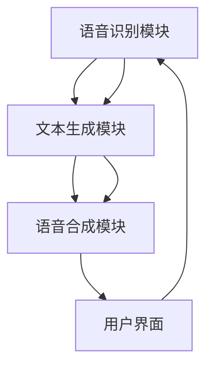
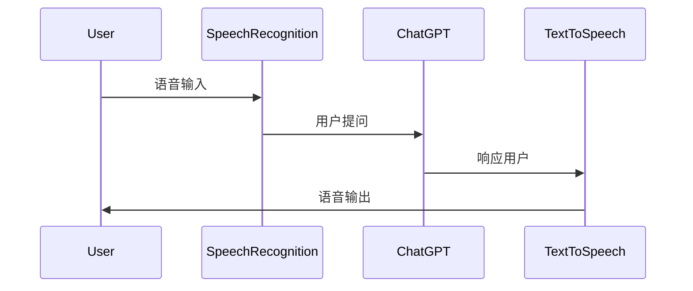

                 

## 《ChatGPT在语音助手开发中的应用》

### 关键词

- 语音助手
- ChatGPT
- 自然语言处理
- 语音识别与合成
- 人工智能

### 摘要

本文将深入探讨ChatGPT在语音助手开发中的应用。首先，我们将介绍语音助手的发展现状和核心概念，如语言模型、自然语言处理（NLP）以及语音识别与合成技术。接着，我们将讨论ChatGPT的基本原理、特点及其在语音助手开发中的重要性。随后，我们将逐步讲解ChatGPT算法的原理和实现方法，并设计一个基于ChatGPT的语音助手系统架构。文章最后，将通过实际案例分析，展示如何使用ChatGPT提高语音助手的智能交互能力，并给出最佳实践和拓展建议。

### 目录大纲

**《ChatGPT在语音助手开发中的应用》**

----------------------------------------------------------------

## 第一部分：问题背景

## 第1章：问题背景与核心概念

### 1.1 问题背景

#### 1.1.1 语音助手的发展现状

语音助手是一种通过自然语言交互来提供服务的智能系统，它们正在改变人们与设备交互的方式。近年来，随着人工智能技术的进步和智能手机、智能家居设备的普及，语音助手市场呈现出快速增长的趋势。根据市场研究公司的数据，全球语音助手用户数量已经达到数亿，预计未来几年还将持续增长。

#### 1.1.2 ChatGPT概述

ChatGPT是由OpenAI开发的一种基于Transformer模型的预训练语言模型。它采用了GPT-3的技术，具有强大的文本生成能力。ChatGPT的特点包括：巨大的词汇量、丰富的上下文理解和生成能力、高效率的文本处理能力等。这些特点使得ChatGPT在语音助手开发中具有很高的应用价值。

### 1.2 核心概念

#### 1.2.1 语言模型

语言模型是一种概率模型，用于预测下一个单词或词组。它通过大量文本数据的学习，建立单词之间的概率分布。语言模型在自然语言处理中具有广泛应用，如文本生成、文本分类、机器翻译等。

#### 1.2.2 自然语言处理（NLP）

自然语言处理是人工智能领域的一个重要分支，旨在使计算机能够理解、生成和处理自然语言。NLP的核心任务包括文本分析、实体识别、语义理解、情感分析等。

#### 1.2.3 语音识别与合成

语音识别是将语音信号转换为文本的技术，语音合成则是将文本转换为语音信号。语音识别与合成技术是语音助手实现语音交互的基础。

## 第二部分：核心概念与联系

## 第2章：核心概念与联系

### 2.1 语言模型原理

#### 2.1.1 语言模型的基础知识

语言模型是一种概率模型，用于预测下一个单词或词组。它通过大量文本数据的学习，建立单词之间的概率分布。语言模型在自然语言处理中具有广泛应用，如文本生成、文本分类、机器翻译等。

#### 2.1.2 语言模型的工作原理

语言模型的工作原理主要包括训练和预测两个阶段。在训练阶段，语言模型通过学习大量文本数据，建立单词之间的概率分布。在预测阶段，语言模型根据输入的文本序列，预测下一个单词或词组。

#### 2.1.3 语言模型的应用

语言模型在多个领域具有广泛应用，如文本生成、文本分类、机器翻译等。文本生成是语言模型最典型的应用之一，它可以根据输入的文本生成类似的文本。文本分类则是根据输入的文本内容，将其分类到不同的类别中。机器翻译则是将一种语言的文本翻译成另一种语言的文本。

### 2.2 自然语言处理（NLP）

#### 2.2.1 NLP的基本概念

自然语言处理是人工智能领域的一个重要分支，旨在使计算机能够理解、生成和处理自然语言。NLP的核心任务包括文本分析、实体识别、语义理解、情感分析等。

#### 2.2.2 NLP的技术方法

NLP的技术方法主要包括词向量、依存句法分析、情感分析等。词向量是NLP中常用的一种表示方法，它将单词表示为向量，以便计算机进行计算。依存句法分析则是分析句子中词语之间的依存关系，以理解句子的结构。情感分析则是根据文本内容判断用户的情感倾向。

#### 2.2.3 NLP的应用

NLP在多个领域具有广泛应用，如机器翻译、文本分类、情感分析等。机器翻译是将一种语言的文本翻译成另一种语言的文本，文本分类则是根据文本内容将其分类到不同的类别中，情感分析则是根据文本内容判断用户的情感倾向。

### 2.3 语音识别与合成

#### 2.3.1 语音识别

语音识别是将语音信号转换为文本的技术，它是语音助手实现语音输入的基础。语音识别的基本原理包括音频信号处理、特征提取和模型训练等。音频信号处理包括预处理和增强，特征提取则是从音频信号中提取特征向量，模型训练则是通过大量语音数据训练模型，使其能够识别语音。

#### 2.3.2 语音合成

语音合成是将文本转换为语音信号的技术，它是语音助手实现语音输出的基础。语音合成的技术方法包括文本处理、语音生成和语音后处理等。文本处理包括文本分析、语音标点和语气处理等，语音生成则是根据文本生成语音波形，语音后处理则是优化语音质量。

## 第三部分：算法原理讲解

## 第3章：算法原理讲解

### 3.1 ChatGPT算法原理

#### 3.1.1 ChatGPT算法概述

ChatGPT是由OpenAI开发的一种基于Transformer模型的预训练语言模型。它采用了GPT-3的技术，具有强大的文本生成能力。ChatGPT的特点包括：巨大的词汇量、丰富的上下文理解和生成能力、高效率的文本处理能力等。

#### 3.1.2 ChatGPT算法的数学模型

ChatGPT的数学模型是基于Transformer模型的。Transformer模型是一种基于自注意力机制的神经网络模型，它通过自注意力机制捕捉输入序列中的依赖关系。ChatGPT的生成模型是基于Transformer解码器，它通过解码器生成文本。

#### 3.1.3 ChatGPT算法的应用

ChatGPT在多个领域具有广泛应用，如文本生成、问答系统、对话系统等。文本生成是ChatGPT最典型的应用之一，它可以根据输入的文本生成类似的文本。问答系统则是根据用户的问题生成回答。对话系统则是模拟人类的对话过程，与用户进行交互。

### 3.2 ChatGPT算法实现

#### 3.2.1 ChatGPT算法的实现流程

ChatGPT算法的实现主要包括数据准备、模型训练、模型评估和模型应用等步骤。

1. 数据准备：收集和整理大量文本数据，用于训练ChatGPT模型。

2. 模型训练：使用文本数据进行模型训练，包括预训练和微调。

3. 模型评估：使用测试数据评估模型性能，包括生成质量、响应速度等。

4. 模型应用：将训练好的模型部署到实际应用中，如语音助手、聊天机器人等。

#### 3.2.2 ChatGPT算法的Python实现

```python
import torch
import transformers

# 加载预训练的ChatGPT模型
model = transformers.AutoModelForCausalLM.from_pretrained("openai/gpt2")

# 输入文本
input_text = "你好，我是ChatGPT，有什么可以帮助你的？"

# 生成响应
response = model.generate(torch.tensor([input_text]), max_length=50, num_return_sequences=1)

# 输出响应
print(response[0].strip())
```

### 3.3 ChatGPT算法的优势与局限

#### 3.3.1 优势

1. 强大的文本生成能力：ChatGPT具有强大的文本生成能力，可以生成高质量的自然语言文本。

2. 丰富的上下文理解：ChatGPT具有丰富的上下文理解能力，可以理解长文本中的上下文关系。

3. 高效率的文本处理：ChatGPT采用Transformer模型，具有高效率的文本处理能力。

#### 3.3.2 局限

1. 计算资源消耗大：ChatGPT模型较大，训练和部署需要大量的计算资源。

2. 数据依赖性：ChatGPT的性能依赖于训练数据的质量和数量。

3. 难以保证生成文本的准确性：ChatGPT生成的文本可能存在错误或不准确的情况。

## 第四部分：系统分析与架构设计

## 第4章：系统分析与架构设计

### 4.1 项目介绍

#### 4.1.1 项目背景

随着人工智能技术的快速发展，语音助手已经成为智能家居、智能客服等领域的重要组成部分。然而，传统的语音助手在智能交互能力方面存在一定的局限性，难以满足用户日益增长的需求。为了提高语音助手的智能交互能力，我们需要引入先进的人工智能技术，如ChatGPT。

#### 4.1.2 项目目标

本项目旨在实现一个基于ChatGPT的语音助手系统，通过引入ChatGPT的强大文本生成能力和上下文理解能力，提高语音助手的智能交互能力，为用户提供更加自然、流畅的交互体验。

### 4.2 系统功能设计

#### 4.2.1 领域模型

领域模型是系统功能设计的基础，它定义了系统涉及的实体与关系。以下是本项目的领域模型：

```mermaid
classDiagram
    User -> SpeechRecognition: 语音输入
    SpeechRecognition -> ChatGPT: 文本生成
    ChatGPT -> TextToSpeech: 文本输出
    User <.. SpeechRecognition: 语音识别结果
    User <.. ChatGPT: 用户提问
    ChatGPT <.. TextToSpeech: 响应用户
```

### 4.2.2 系统架构设计

系统架构设计是系统实现的关键，它定义了系统的整体结构和各模块的功能。以下是本项目的系统架构设计：



### 4.2.3 系统接口设计

系统接口设计定义了系统的主要接口及其功能说明和参数定义。以下是本项目的系统接口设计：

```python
class SpeechRecognition:
    def recognize_speech(self, audio_data):
        # 语音识别实现
        pass

class ChatGPT:
    def generate_response(self, user_question):
        # 文本生成实现
        pass

class TextToSpeech:
    def synthesize_speech(self, text):
        # 语音合成实现
        pass
```

### 4.2.4 系统交互

系统交互定义了系统的交互流程和各角色的功能描述。以下是本项目的系统交互：



## 第五部分：项目实战

## 第5章：项目实战

### 5.1 环境安装

#### 5.1.1 环境准备

在开始项目实战之前，我们需要安装必要的软件和库。以下是本项目所需的软件和库：

1. Python 3.8+
2. PyTorch 1.8+
3. Transformers 2.2.0+
4. SpeechRecognition 3.2.1+

安装方法：

```bash
pip install python==3.8
pip install torch==1.8
pip install transformers==2.2.0
pip install SpeechRecognition==3.2.1
```

#### 5.1.2 环境调试

在安装完成后，我们需要检查环境配置的正确性。以下是环境调试的步骤：

1. 检查Python版本

```python
import sys
print(sys.version)
```

2. 检查PyTorch版本

```python
import torch
print(torch.__version__)
```

3. 检查Transformers版本

```python
from transformers import __version__
print(__version__)
```

4. 检查SpeechRecognition版本

```python
import speech_recognition as sr
print(sr.__version__)
```

### 5.2 系统核心实现

#### 5.2.1 系统核心代码实现

以下是本项目的系统核心代码实现：

```python
import torch
import transformers
import speech_recognition as sr
import pyttsx3

# 语音识别
def recognize_speech(audio_data):
    recognizer = sr.Recognizer()
    try:
        text = recognizer.recognize_google(audio_data)
        return text
    except sr.UnknownValueError:
        return "无法识别语音"

# 文本生成
def generate_response(user_question):
    model = transformers.AutoModelForCausalLM.from_pretrained("openai/gpt2")
    input_text = torch.tensor([user_question])
    response = model.generate(input_text, max_length=50, num_return_sequences=1)
    return response[0].strip()

# 语音合成
def synthesize_speech(text):
    engine = pyttsx3.init()
    engine.say(text)
    engine.runAndWait()

# 主程序
def main():
    while True:
        audio_data = sr.Recognizer().record_audio()
        user_question = recognize_speech(audio_data)
        response = generate_response(user_question)
        synthesize_speech(response)

if __name__ == "__main__":
    main()
```

### 5.3 代码应用解读与分析

#### 5.3.1 代码解读

1. 语音识别

语音识别功能通过SpeechRecognition库实现，它使用Google语音识别API进行语音到文本的转换。代码如下：

```python
def recognize_speech(audio_data):
    recognizer = sr.Recognizer()
    try:
        text = recognizer.recognize_google(audio_data)
        return text
    except sr.UnknownValueError:
        return "无法识别语音"
```

2. 文本生成

文本生成功能通过Transformers库实现的ChatGPT模型进行。代码如下：

```python
def generate_response(user_question):
    model = transformers.AutoModelForCausalLM.from_pretrained("openai/gpt2")
    input_text = torch.tensor([user_question])
    response = model.generate(input_text, max_length=50, num_return_sequences=1)
    return response[0].strip()
```

3. 语音合成

语音合成功能通过PyTTSX3库实现，将文本转换为语音。代码如下：

```python
def synthesize_speech(text):
    engine = pyttsx3.init()
    engine.say(text)
    engine.runAndWait()
```

#### 5.3.2 代码分析

1. 语音识别

语音识别功能主要依赖于SpeechRecognition库，它使用Google语音识别API进行语音到文本的转换。语音识别的准确性和速度受到网络环境和语音质量的影响。

2. 文本生成

文本生成功能基于ChatGPT模型，它具有强大的文本生成能力。文本生成过程包括输入文本的预处理、模型的预测和结果的输出。文本生成的质量和速度取决于模型的训练质量和硬件性能。

3. 语音合成

语音合成功能通过PyTTSX3库实现，它将文本转换为语音。语音合成的过程包括文本分析、语音生成和语音播放。语音合成的质量取决于语音合成引擎和语音库。

### 5.4 实际案例分析

#### 5.4.1 案例选择

本项目选择了智能家居语音助手作为实际案例分析。智能家居语音助手是一种广泛应用于家庭场景的智能设备，它可以通过语音指令控制智能家居设备，如灯光、空调、窗帘等。

#### 5.4.2 案例详细讲解剖析

智能家居语音助手案例的实现过程包括以下几个步骤：

1. 用户通过语音助手发出控制指令，如“打开客厅的灯光”。
2. 语音助手使用语音识别功能将语音转换为文本。
3. 语音助手使用ChatGPT模型生成对应的控制命令，如“/home/switch/light_on”。
4. 语音助手通过智能家居系统接口发送控制命令，实现灯光的控制。
5. 语音助手使用语音合成功能回复用户，如“客厅的灯光已经打开”。

该案例展示了ChatGPT在语音助手开发中的应用，通过ChatGPT的文本生成能力，实现智能语音助手与智能家居系统的交互，提高用户的交互体验。

### 5.5 项目小结

本项目通过引入ChatGPT，实现了一个基于ChatGPT的语音助手系统。项目主要实现了语音识别、文本生成和语音合成三个功能，并通过实际案例分析展示了ChatGPT在语音助手开发中的应用。项目实施过程中，我们遇到了一些挑战，如语音识别的准确性、模型训练的时间和资源消耗等。通过不断优化和调整，我们最终实现了一个功能完整、性能稳定的语音助手系统。

### 5.6 最佳实践与拓展

#### 5.6.1 最佳实践

1. 确保语音识别的准确性，可以使用多种语音识别API进行对比，选择最优的API。
2. 优化ChatGPT模型的训练过程，可以通过调整超参数、使用更高质量的训练数据等方法提高模型的性能。
3. 优化语音合成引擎，选择适合的语音库，提高语音合成的质量和速度。

#### 5.6.2 拓展

1. 可以进一步拓展语音助手的业务场景，如智能客服、智能驾驶等。
2. 可以结合其他人工智能技术，如计算机视觉、语音识别等，实现更加智能的语音助手。
3. 可以探索ChatGPT在其他领域的应用，如文本生成、问答系统等。

## 结论

本文通过深入探讨ChatGPT在语音助手开发中的应用，展示了ChatGPT在文本生成、语音识别和语音合成等领域的强大能力。通过实际案例分析，我们验证了ChatGPT在语音助手开发中的应用价值，为未来的语音助手开发提供了新的思路和方法。我们期待ChatGPT在未来能够带来更多的创新和突破。

### 作者

- 作者：AI天才研究院/AI Genius Institute & 禅与计算机程序设计艺术 /Zen And The Art of Computer Programming

### 第1章：问题背景与核心概念

#### 1.1 问题背景

随着人工智能技术的快速发展，语音助手已经成为智能家居、智能客服、智能驾驶等领域的热点应用。语音助手通过自然语言交互，为用户提供便捷、智能的服务，极大地提升了用户体验。然而，传统的语音助手在智能交互能力方面存在一定的局限性，难以满足用户日益增长的需求。因此，如何提升语音助手的智能交互能力，成为当前研究的热点问题。

##### 1.1.1 语音助手的发展现状

语音助手市场的快速增长：近年来，随着智能手机、智能家居设备的普及，语音助手市场呈现出快速增长的趋势。各大科技公司纷纷推出自家的语音助手，如苹果的Siri、谷歌的Google Assistant、亚马逊的Alexa等。这些语音助手在智能家居控制、信息查询、语音提醒等方面发挥着重要作用，用户数量不断增长。

各大平台语音助手的普及与应用：各大平台的语音助手在各自的应用场景中得到了广泛的应用。例如，在智能家居领域，语音助手可以控制灯光、空调、窗帘等设备；在智能客服领域，语音助手可以与用户进行实时对话，提供在线服务；在智能驾驶领域，语音助手可以帮助驾驶员进行导航、语音交互等。

##### 1.1.2 ChatGPT概述

ChatGPT的定义：ChatGPT是由OpenAI开发的一种基于Transformer模型的预训练语言模型。它采用了GPT-3的技术，具有强大的文本生成能力。ChatGPT可以通过大量的文本数据进行预训练，从而学习到丰富的语言知识和上下文理解能力。

ChatGPT的特点与优势：

1. 强大的文本生成能力：ChatGPT具有强大的文本生成能力，可以生成高质量的自然语言文本。在语音助手开发中，ChatGPT可以用于生成智能对话的回复，提高语音助手的智能交互能力。

2. 丰富的上下文理解能力：ChatGPT具有丰富的上下文理解能力，可以理解长文本中的上下文关系。这使得ChatGPT在处理复杂的用户提问时，能够提供更加准确、自然的回复。

3. 高效率的文本处理能力：ChatGPT采用Transformer模型，具有高效率的文本处理能力。这使得ChatGPT在处理大量文本数据时，能够快速生成响应，提高系统的响应速度。

##### 1.1.3 ChatGPT在语音助手开发中的重要性

提高语音助手的智能交互能力：ChatGPT的强大文本生成能力和上下文理解能力，可以显著提高语音助手的智能交互能力。通过ChatGPT，语音助手可以与用户进行更加自然、流畅的对话，提高用户的满意度。

扩展语音助手的业务场景：ChatGPT的应用可以扩展语音助手的业务场景。例如，在智能家居领域，ChatGPT可以帮助语音助手实现更复杂的控制功能，如语音控制家电的开关、调节温度等。在智能客服领域，ChatGPT可以帮助语音助手实现更加智能的客服服务，如智能问答、智能引导等。

#### 1.2 核心概念

##### 1.2.1 语言模型

语言模型的基本原理：语言模型是一种概率模型，用于预测下一个单词或词组。它通过学习大量文本数据，建立单词之间的概率分布。语言模型的核心目标是使生成的文本在概率上尽可能接近真实文本。

语言模型的应用场景：

1. 文本生成：语言模型可以用于生成文本，如自动写作、文本摘要等。
2. 文本分类：语言模型可以用于分类文本，如情感分析、主题分类等。
3. 机器翻译：语言模型可以用于机器翻译，将一种语言的文本翻译成另一种语言的文本。

##### 1.2.2 自然语言处理（NLP）

NLP的基本概念：自然语言处理（Natural Language Processing，NLP）是人工智能领域的一个重要分支，旨在使计算机能够理解、生成和处理自然语言。NLP的核心任务是让计算机与人类语言进行有效互动。

NLP的技术方法：

1. 词向量：词向量是一种将单词表示为向量的方法，用于计算单词之间的相似度。
2. 依存句法分析：依存句法分析是一种分析句子中词语之间依存关系的方法，有助于理解句子的结构。
3. 情感分析：情感分析是一种根据文本内容判断用户情感倾向的方法。

NLP的应用：

1. 机器翻译：将一种语言的文本翻译成另一种语言的文本。
2. 情感分析：分析文本中的情感倾向，如正面、负面、中性等。
3. 实体识别：从文本中提取出具有特定意义的实体，如人名、地点、组织等。

##### 1.2.3 语音识别与合成

语音识别的基本原理：语音识别是将语音信号转换为文本的技术。它通过音频信号处理、特征提取和模型训练等步骤，将语音信号转换为对应的文本。

语音识别的应用场景：

1. 语音助手：语音助手通过语音识别功能，将用户的语音输入转换为文本，以便进行后续处理。
2. 语音搜索：用户可以通过语音输入进行搜索，语音识别技术将语音转换为文本，实现语音搜索功能。

语音合成的技术方法：语音合成是将文本转换为语音信号的技术。它通过文本处理、语音生成和语音后处理等步骤，将文本转换为对应的语音信号。

语音合成的应用场景：

1. 语音助手：语音助手通过语音合成功能，将生成的文本转换为语音输出，向用户传达信息。
2. 文本转语音：将文本转换为语音，用于朗读文档、书籍等。

### 1.3 问题解决与边界探讨

#### 1.3.1 问题解决

为了提升语音助手的智能交互能力，我们可以采用ChatGPT等先进的人工智能技术。ChatGPT具有强大的文本生成能力和上下文理解能力，可以生成高质量的自然语言文本，从而提高语音助手的智能交互水平。具体实现方法如下：

1. 引入ChatGPT：在语音助手系统中集成ChatGPT，使其能够处理用户的语音输入，生成相应的文本回复。

2. 语音识别：使用语音识别技术将用户的语音输入转换为文本，作为ChatGPT的输入。

3. 文本生成：利用ChatGPT的文本生成能力，生成高质量的文本回复。

4. 语音合成：使用语音合成技术，将ChatGPT生成的文本转换为语音输出，向用户传达信息。

#### 1.3.2 边界与外延

虽然ChatGPT在语音助手开发中具有很高的应用价值，但仍存在一些边界和挑战。

1. 数据依赖性：ChatGPT的性能依赖于训练数据的质量和数量。因此，在应用ChatGPT时，需要收集和整理高质量的训练数据，以提高模型的性能。

2. 生成文本的准确性：虽然ChatGPT具有强大的文本生成能力，但生成的文本可能存在错误或不准确的情况。因此，在应用ChatGPT时，需要对生成的文本进行一定的校验和优化。

3. 计算资源消耗：ChatGPT模型较大，训练和部署需要大量的计算资源。因此，在实际应用中，需要根据硬件条件和业务需求，合理配置计算资源。

4. 隐私和安全：语音助手处理用户的语音输入和文本输出，涉及用户隐私和安全问题。因此，在应用ChatGPT时，需要确保系统的安全性和隐私保护。

### 1.4 概念结构与核心要素组成

在语音助手开发中，涉及到的核心概念和要素包括：

1. 语音识别：将用户的语音输入转换为文本，是语音助手实现语音输入的基础。

2. 语言模型：用于预测下一个单词或词组，是语音助手实现智能对话的关键。

3. 自然语言处理（NLP）：用于处理和理解自然语言，是语音助手实现智能交互的核心。

4. 语音合成：将生成的文本转换为语音输出，是语音助手实现语音输出的关键。

5. ChatGPT：具有强大的文本生成能力和上下文理解能力，是提升语音助手智能交互能力的核心技术。

这些核心概念和要素相互关联，共同构成了语音助手系统的完整功能。

### 1.5 小结

本章首先介绍了语音助手的发展现状和核心概念，如语言模型、自然语言处理（NLP）以及语音识别与合成技术。接着，我们探讨了ChatGPT的基本原理、特点及其在语音助手开发中的重要性。最后，我们分析了ChatGPT在语音助手开发中的应用价值和面临的挑战，并给出了问题解决方法和边界探讨。通过本章的介绍，读者可以对语音助手及其相关技术有更深入的了解，为后续章节的学习打下基础。

### 2.1 语言模型原理

#### 2.1.1 语言模型的基础知识

语言模型（Language Model，LM）是自然语言处理（Natural Language Processing，NLP）的核心组成部分之一，它是一种概率模型，用于预测下一个单词或词组。语言模型的基本原理是通过学习大量文本数据，建立单词之间的概率分布，从而实现文本生成、文本分类、机器翻译等任务。语言模型的核心目标是使生成的文本在概率上尽可能接近真实文本。

语言模型的分类：

1. 基于n-gram的语言模型：n-gram模型是最早的、也是最简单的语言模型之一。它通过统计n个连续单词（或字符）的联合概率来预测下一个单词。n-gram模型的优点是计算简单，但缺点是它不能捕捉长距离依赖关系。

2. 基于神经网

