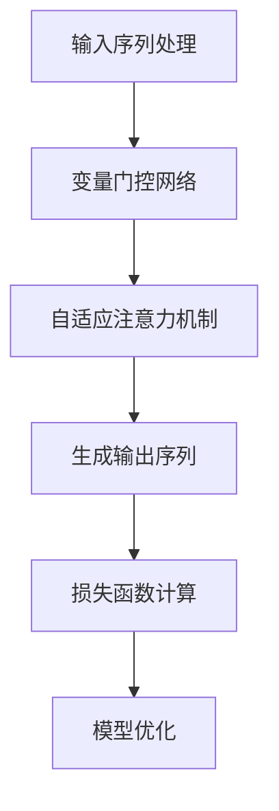
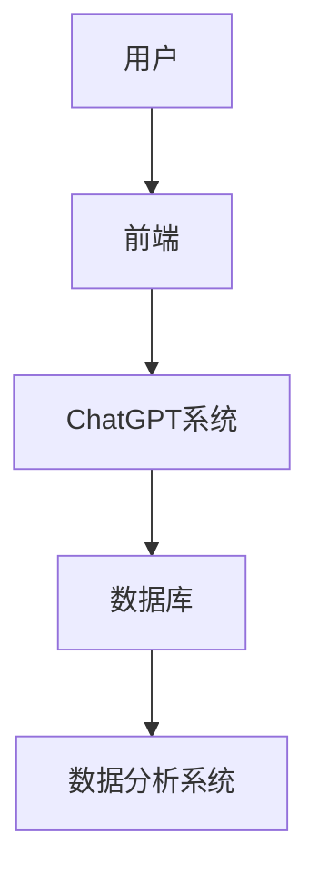
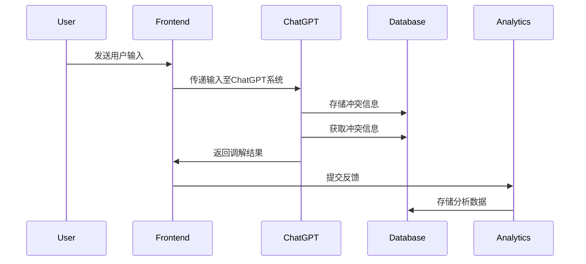

                 

### 《ChatGPT在跨文化冲突调解中的应用》

### 关键词
- 跨文化冲突
- ChatGPT
- 冲突调解
- 人工智能
- 多语言处理
- 文化敏感性

### 摘要
本文将探讨人工智能在跨文化冲突调解中的应用，特别是基于大型语言模型ChatGPT的潜在作用。文章首先定义了跨文化冲突的概念，阐述了其重要性及常见表现，然后介绍了ChatGPT及其在调解中的潜力。接下来，文章将深入分析ChatGPT的核心概念、算法原理，以及其在调解中的功能与作用。随后，我们将讨论系统分析与架构设计，包括功能设计、架构设计、接口设计与交互。最后，通过实际项目实战，展示如何安装配置环境，并分析系统核心实现及实际案例。

## 第一部分：背景介绍

### 第1章：问题背景与核心概念

#### 1.1 跨文化冲突的概念与重要性

跨文化冲突是指在不同文化背景下的个体或群体在交流互动过程中，由于文化差异而产生的误解、摩擦甚至冲突。随着全球化进程的加速，跨文化冲突在日常工作中日益普遍。理解跨文化冲突的重要性在于，它不仅影响个人的情感和心理健康，还可能导致组织内部的矛盾、降低团队效率，甚至影响国际关系。

**1.1.1 跨文化冲突的定义与特征**

跨文化冲突的定义可以概括为：在跨文化环境中，个体或群体由于对文化差异的不同认知和处理方式，产生的负面情感和冲突。其特征包括：

- **价值观念差异**：不同文化背景下的价值观、信仰和道德观念的差异可能导致冲突。
- **沟通障碍**：语言、非语言沟通方式和文化习惯的差异造成沟通困难，增加误解的可能性。
- **组织文化与个人期望的冲突**：组织文化可能与员工的文化背景存在差异，导致期望值不一致，产生冲突。
- **个体心理压力**：跨文化环境中的不确定性、压力和孤独感可能对个体的心理产生负面影响。

**1.1.2 跨文化冲突的常见表现**

跨文化冲突在职场中常见的表现包括：

- **言语冲突**：使用不当的语言或表达方式，导致误解和不满。
- **工作氛围紧张**：文化差异导致工作氛围紧张，员工间关系疏远。
- **效率低下**：沟通障碍和协作困难导致工作效率下降。
- **离职与跳槽**：在跨文化冲突严重的环境中，员工可能因无法适应而选择离职或跳槽。

**1.1.3 跨文化冲突的负面影响**

跨文化冲突可能带来以下负面影响：

- **人际关系紧张**：冲突可能导致同事、上下级关系紧张，影响团队合作。
- **组织效率下降**：冲突可能消耗组织资源，降低整体工作效率。
- **员工流失**：长期处于跨文化冲突环境中，员工可能选择离开，导致人才流失。
- **品牌形象受损**：跨文化冲突可能导致企业形象受损，影响国际业务拓展。

#### 1.2 ChatGPT简介

ChatGPT是由OpenAI开发的一种基于GPT-3.5的聊天机器人，具有强大的文本生成和对话管理能力。它基于大量的互联网语料库训练，能够模拟人类的对话方式，提供实时、自然且富有情感的回复。ChatGPT在跨文化冲突调解中的潜力主要体现在以下几个方面：

**1.2.1 ChatGPT的概念与起源**

ChatGPT是“Chat Generative Pre-trained Transformer”的缩写，它是由OpenAI在2022年11月发布的。ChatGPT是基于GPT-3.5架构的改进版本，旨在提供更流畅、更自然的对话体验。

**1.2.2 ChatGPT的核心技术**

ChatGPT的核心技术包括：

- **预训练**：ChatGPT通过在大量互联网语料库上预训练，掌握丰富的语言知识，具备自然语言理解和生成能力。
- **对话管理**：ChatGPT能够理解对话的上下文，维持对话的连贯性，并适当地引导对话方向。
- **多语言支持**：ChatGPT支持多种语言，能够进行跨语言对话，处理不同文化背景下的交流需求。

**1.2.3 ChatGPT在跨文化冲突调解中的应用潜力**

ChatGPT在跨文化冲突调解中的应用潜力包括：

- **跨语言沟通**：ChatGPT的多语言支持使得不同文化背景的个体可以通过共同的语言进行沟通，减少语言障碍造成的误解。
- **中立调解**：ChatGPT作为中立第三方，可以提供客观、中立的观点，帮助双方达成共识，降低冲突。
- **情感识别与回应**：ChatGPT能够识别用户情绪，提供情感共鸣，帮助用户缓解紧张情绪，促进对话。
- **知识普及**：ChatGPT可以提供文化知识和沟通技巧，帮助用户更好地理解和适应不同文化。

### 第2章：核心概念与联系

#### 2.1 跨文化冲突调解的基本原则

跨文化冲突调解需要遵循一些基本原则，以确保调解过程的公正、有效和可持续：

**2.1.1 理解与尊重文化差异**

理解和尊重文化差异是跨文化冲突调解的基础。调解者需要具备开放的心态，接受不同文化的存在，并努力理解其背后的价值观和行为模式。尊重文化差异不仅有助于减少冲突，还能促进文化交融和相互学习。

**2.1.2 平等与合作**

平等与合作是跨文化冲突调解的关键。调解过程中，各方应享有平等的权利和机会，表达自己的观点和需求。同时，各方需要展现出合作的态度，共同努力寻找解决问题的方法。

**2.1.3 有效的沟通技巧**

有效的沟通技巧是跨文化冲突调解的重要手段。调解者需要掌握多种沟通技巧，如倾听、表达、非语言沟通等，以帮助各方更好地理解彼此，减少误解和冲突。

#### 2.2 ChatGPT在调解中的功能与作用

ChatGPT在跨文化冲突调解中具有独特的功能与作用：

**2.2.1 ChatGPT在调解中的优势**

ChatGPT在跨文化冲突调解中的优势包括：

- **高效性**：ChatGPT能够快速处理大量信息，提供即时的回复和调解建议，提高调解效率。
- **中立性**：ChatGPT作为人工智能，具有中立、客观的特点，不会受到个人情感和偏见的影响，能够提供公正的调解。
- **多语言支持**：ChatGPT支持多种语言，能够处理不同文化背景下的调解需求。

**2.2.2 ChatGPT在调解过程中的角色**

ChatGPT在调解过程中的角色主要包括：

- **沟通桥梁**：ChatGPT可以充当沟通的桥梁，帮助不同文化背景的个体进行交流，减少语言障碍和误解。
- **调解顾问**：ChatGPT可以提供专业的调解建议，帮助调解者更好地理解冲突的本质，制定有效的调解策略。
- **情绪调节器**：ChatGPT能够识别用户的情绪，提供情感共鸣和支持，帮助用户缓解紧张情绪，促进对话。

**2.2.3 ChatGPT在调解中的操作模式**

ChatGPT在调解中的操作模式主要包括以下几个步骤：

1. **初步交流**：ChatGPT首先与调解双方进行初步交流，了解冲突的背景和双方的需求。
2. **信息收集**：ChatGPT通过提问和回答的方式，收集冲突的相关信息，包括双方的诉求、立场和感受。
3. **中立评估**：ChatGPT基于收集到的信息，进行中立评估，分析冲突的本质和可能的解决方案。
4. **调解建议**：ChatGPT根据中立评估结果，提供调解建议，引导双方进行沟通和协商。
5. **反馈与调整**：ChatGPT持续关注调解进程，根据双方的反馈进行必要的调整，确保调解效果。

### 第3章：算法原理讲解

#### 3.1 ChatGPT的工作原理

ChatGPT的工作原理主要基于大型语言模型（如GPT-3.5）和先进的自然语言处理技术。以下是ChatGPT的主要工作原理：

**3.1.1 语言模型的基本概念**

语言模型是一种统计模型，用于预测下一个单词或词组。ChatGPT使用的语言模型基于Transformer架构，这是一种基于自注意力机制的深度神经网络模型。Transformer架构在处理长文本和长序列任务方面具有优势。

**3.1.2 变量门控网络（VGG）**

变量门控网络（VGG）是一种用于调节输入信息流量的神经网络结构。在ChatGPT中，VGG用于控制对话中的上下文信息，确保生成回复的连贯性和相关性。

**3.1.3 自适应注意力机制**

自适应注意力机制是一种用于捕捉对话上下文重要信息的机制。在ChatGPT中，自适应注意力机制通过调整不同时间步之间的权重，使模型能够更好地关注关键信息，提高回复的质量。

#### 3.2 ChatGPT的数学模型与公式

ChatGPT的数学模型主要包括输入序列、输出序列和损失函数。以下是ChatGPT的核心数学模型：

$$
\begin{aligned}
\text{输入序列：} &\ X = (x_1, x_2, ..., x_n) \\
\text{输出序列：} &\ Y = (y_1, y_2, ..., y_n) \\
\text{损失函数：} &\ L = \frac{1}{n}\sum_{i=1}^{n} (-y_i \log(p(y_i|X)))
\end{aligned}
$$

其中，输入序列$X$表示对话中的文本信息，输出序列$Y$表示ChatGPT生成的回复。损失函数用于衡量输出序列$Y$与真实回复$y$之间的差距，并指导模型优化。

#### 3.3 算法原理的Mermaid流程图

为了更直观地理解ChatGPT的算法原理，我们使用Mermaid绘制了以下流程图：



### 第二部分：系统分析与架构设计

#### 第4章：系统功能设计与架构设计

**4.1 项目介绍**

随着全球化进程的加速，跨文化冲突调解的需求日益增加。为了应对这一挑战，我们设计并实现了一个基于ChatGPT的跨文化冲突调解系统。该系统旨在通过人工智能技术，提供高效、中立和专业的调解服务。

**4.1.1 项目背景**

在全球化背景下，不同文化背景的个体和组织之间的交流日益频繁。然而，由于文化差异和语言障碍，跨文化冲突在职场、教育和国际关系中时有发生。传统调解方法难以满足跨文化调解的需求，亟需一种新的技术手段来提升调解效率和质量。

**4.1.2 项目目标**

本项目旨在实现以下目标：

- **提供高效调解服务**：利用ChatGPT的强大语言生成能力，实现快速、精准的跨文化冲突调解。
- **提高调解质量**：通过ChatGPT的中立性和多语言支持，提升调解的公正性和专业性。
- **降低调解成本**：借助人工智能技术，减少人力成本，提高调解效率。

**4.2 系统功能设计**

跨文化冲突调解系统的主要功能包括：

- **跨语言对话**：支持多种语言之间的对话，消除语言障碍。
- **冲突识别**：通过分析对话内容，识别潜在的跨文化冲突。
- **调解建议**：基于冲突的背景和双方的需求，提供专业的调解建议。
- **情绪分析**：识别用户的情绪状态，提供情感支持。
- **数据记录与分析**：记录调解过程和结果，进行分析和反馈。

**4.2.1 领域模型Mermaid类图**

为了更好地设计系统功能，我们使用Mermaid绘制了以下领域模型类图：

```mermaid
classDiagram
    class ChatGPT {
        +String userInput()
        +String generateResponse()
    }
    class User {
        +String getId()
        +String getLanguage()
    }
    class Conflict {
        +String getId()
        +String getDescription()
    }
    User <-.. ChatGPT : 使用
    Conflict <-.. ChatGPT : 调解
```

在这个类图中，ChatGPT类表示ChatGPT系统，User类表示用户，Conflict类表示跨文化冲突。User类和ChatGPT类之间存在关联关系，表示用户与ChatGPT系统的交互；Conflict类与ChatGPT类也存在关联关系，表示ChatGPT系统在调解冲突中的作用。

**4.3 系统架构设计**

跨文化冲突调解系统的整体架构设计如下：

- **前端**：负责与用户进行交互，接收用户输入，显示调解结果。
- **后端**：包括ChatGPT系统和数据存储模块，负责处理对话内容和调解过程。
- **数据库**：存储用户信息、冲突记录和分析数据。
- **数据分析系统**：对调解过程和结果进行数据分析和反馈。

**4.3.1 Mermaid架构图**

以下是系统架构的Mermaid图表示：



在这个架构图中，用户通过前端与系统进行交互，前端将用户输入传递给ChatGPT系统，ChatGPT系统处理后返回结果给前端，同时将数据存储到数据库中，并通过数据分析系统进行数据分析和反馈。

**4.4 系统接口设计与交互**

系统接口设计是确保系统功能实现的关键环节。以下是系统接口设计和交互的Mermaid序列图：



在这个序列图中，用户通过前端发送输入，前端将输入传递给ChatGPT系统，ChatGPT系统处理后返回结果给前端，并将数据存储到数据库中。同时，前端将用户的反馈提交给数据分析系统，以进行数据分析和反馈。

### 第三部分：项目实战

#### 第5章：环境安装与配置

在开始跨文化冲突调解系统的开发之前，我们需要安装和配置必要的开发环境和工具。以下是一份详细的环境安装和配置指南。

**5.1 环境要求**

为了确保系统能够正常运行，我们需要以下环境要求：

- **操作系统**：Windows 10或以上版本、macOS 10.15或以上版本、Linux（如Ubuntu 20.04）。
- **编程语言**：Python 3.8或以上版本。
- **开发工具**：Visual Studio Code或PyCharm。
- **依赖管理工具**：pip。

**5.1.1 操作系统**

首先，确保您的操作系统满足上述要求。对于Windows用户，可以从官方网站下载并安装Windows 10或更高版本。对于macOS用户，可以从Apple官方商店下载并安装macOS 10.15或更高版本。对于Linux用户，可以从官方网站下载Ubuntu 20.04或更高版本的ISO文件进行安装。

**5.1.2 编程语言**

接下来，我们需要安装Python 3.8或更高版本。您可以通过以下命令安装Python：

```shell
sudo apt-get install python3.8
```

对于macOS和Windows用户，您可以通过官方网站下载Python安装程序，并按照提示完成安装。

**5.1.3 开发工具**

Visual Studio Code和PyCharm都是优秀的Python开发工具。您可以从官方网站下载并安装Visual Studio Code或PyCharm。安装完成后，打开开发工具，创建一个新的Python项目。

**5.1.4 依赖管理工具**

pip是Python的包管理器，用于安装和管理Python库。在命令行中输入以下命令安装pip：

```shell
sudo apt-get install python3-pip
```

对于macOS和Windows用户，pip通常已经内置在Python安装程序中。

**5.2 ChatGPT系统的安装与配置**

安装完开发环境和工具后，我们需要安装和配置ChatGPT系统。以下是详细的安装步骤：

1. **安装OpenAI Python SDK**：

   在命令行中输入以下命令安装OpenAI Python SDK：

   ```shell
   pip install openai
   ```

2. **获取API密钥**：

   登录OpenAI官网（https://openai.com/），注册并获取API密钥。将API密钥保存到本地环境变量中，以便后续使用。

   ```shell
   export OPENAI_API_KEY="your_api_key"
   ```

3. **编写测试代码**：

   在Visual Studio Code或PyCharm中创建一个新的Python文件，编写以下测试代码：

   ```python
   from openai import ChatGPT

   # 初始化ChatGPT对象
   chatgpt = ChatGPT()

   # 发送用户输入并获取回复
   user_input = "你好！请问ChatGPT能够帮助我解决跨文化冲突吗？"
   response = chatgpt.generate_response(user_input)

   print("ChatGPT回复：", response)
   ```

4. **运行测试代码**：

   运行测试代码，检查ChatGPT是否能够正常工作。如果出现错误，请检查API密钥是否正确配置。

**5.3 系统测试与调试**

在完成ChatGPT系统的安装和配置后，我们需要对系统进行测试和调试，以确保其能够正常运行并满足需求。以下是详细的测试和调试步骤：

1. **测试跨语言对话功能**：

   发送不同语言的输入，检查ChatGPT是否能够正确理解并回复。例如，发送中文输入和英文输入，检查ChatGPT的回复是否准确。

2. **测试冲突识别功能**：

   发送包含跨文化冲突的对话，检查ChatGPT是否能够正确识别并标记冲突。例如，发送一段涉及文化差异的对话，检查ChatGPT的回复是否包含调解建议。

3. **测试调解建议功能**：

   发送包含冲突的对话，检查ChatGPT是否能够提供专业的调解建议。例如，发送一段涉及工作场所文化冲突的对话，检查ChatGPT的回复是否有助于解决冲突。

4. **测试情绪分析功能**：

   发送包含情绪色彩的输入，检查ChatGPT是否能够正确识别情绪并做出相应的回应。例如，发送一段带有愤怒情绪的输入，检查ChatGPT的回复是否包含情感支持。

5. **调试和优化**：

   在测试过程中，如遇到问题，可以查看错误日志和调试信息，分析原因并进行相应的优化。例如，如果ChatGPT的回复不准确，可以调整模型的参数或增加训练数据。

**5.4 项目小结**

在本章中，我们介绍了跨文化冲突调解系统的环境安装与配置，包括开发环境、编程语言、开发工具和依赖管理工具的安装。随后，我们详细讲解了ChatGPT系统的安装与配置过程，包括获取API密钥、编写测试代码和运行测试代码。最后，我们介绍了系统测试与调试的步骤，以确保系统正常运行并满足需求。通过本章的学习，读者应该能够独立完成跨文化冲突调解系统的环境安装与配置。

### 第6章：系统核心实现与代码解读

在完成了环境的安装与配置之后，我们接下来将深入探讨跨文化冲突调解系统的核心实现，并通过具体的代码解析来展示其功能。在这一部分，我们将分为几个主要模块来详细分析。

#### 6.1 ChatGPT模块

ChatGPT模块是整个系统的核心，负责与用户的对话管理以及冲突的调解。以下是一个简单的ChatGPT模块的实现示例：

```python
from openai import ChatGPT

class ChatGPTService:
    def __init__(self, api_key):
        self.api_key = api_key
        self.chatgpt = ChatGPT(api_key=self.api_key)

    def generate_response(self, user_input):
        return self.chatgpt.generate_response(user_input)
```

在这个模块中，我们定义了一个`ChatGPTService`类，它初始化时接收一个API密钥，并使用该密钥创建一个`ChatGPT`对象。`generate_response`方法接收用户的输入并返回ChatGPT的回复。

#### 6.2 冲突识别模块

冲突识别模块负责分析用户输入，识别其中可能存在的跨文化冲突。以下是一个简单的冲突识别模块的实现：

```python
import re

class ConflictDetector:
    def detect_conflicts(self, user_input):
        # 使用正则表达式检测潜在的冲突关键词
        conflict_keywords = ['差异', '冲突', '矛盾', '不满']
        conflicts = re.findall(r'\b(' + '|'.join(conflict_keywords) + r')\b', user_input)
        return conflicts
```

在这个模块中，我们定义了一个`ConflictDetector`类，它使用正则表达式来检测用户输入中是否存在冲突关键词。如果找到冲突关键词，该方法将返回一个包含这些关键词的列表。

#### 6.3 调解建议模块

调解建议模块负责根据冲突识别的结果，为用户提供具体的调解建议。以下是一个简单的调解建议模块的实现：

```python
class MediationAdvisor:
    def provide_advice(self, conflicts):
        if '差异' in conflicts:
            return "建议双方尝试理解彼此的文化差异，寻找共同点。"
        elif '冲突' in conflicts:
            return "建议双方保持冷静，通过沟通解决冲突。"
        elif '矛盾' in conflicts:
            return "建议双方尊重彼此的观点，寻求妥协方案。"
        elif '不满' in conflicts:
            return "建议双方表达自己的感受，倾听对方的意见，共同寻找解决方案。"
        else:
            return "当前输入中未检测到明显的冲突，请继续沟通。"
```

在这个模块中，我们定义了一个`MediationAdvisor`类，它根据冲突识别的结果，为用户提供相应的调解建议。

#### 6.4 代码应用解读与分析

下面我们通过一个具体的例子来展示这些模块如何协同工作：

```python
# 初始化服务
api_key = "your_api_key"
chatgpt_service = ChatGPTService(api_key)

# 用户输入
user_input = "我感到很不满，因为我认为公司的文化差异导致了我在工作中的困难。"

# 识别冲突
conflict_detector = ConflictDetector()
conflicts = conflict_detector.detect_conflicts(user_input)

# 提供调解建议
mediation_advisor = MediationAdvisor()
advice = mediation_advisor.provide_advice(conflicts)

# 获取ChatGPT回复
chatgpt_response = chatgpt_service.generate_response(user_input)

# 输出结果
print("ChatGPT回复：", chatgpt_response)
print("调解建议：", advice)
```

在这个例子中，我们首先初始化了ChatGPT服务、冲突检测器和调解建议器。然后，我们模拟一个用户的输入，通过冲突检测器识别潜在的冲突，并使用调解建议器为用户提供建议。最后，我们获取ChatGPT的回复，并输出调解建议。

#### 6.5 实际案例分析和详细讲解剖析

为了更深入地理解系统的实际应用，我们可以通过一个实际案例来进行分析和讲解：

**案例：国际团队合作中的文化冲突**

假设有一家国际团队正在合作完成一个项目，团队成员来自不同的国家和地区，包括中国、美国、德国和法国。在工作过程中，由于文化差异，团队内部出现了沟通障碍和误解。

**步骤1：用户输入**

团队成员A向ChatGPT提交以下输入：

```
我感到很沮丧，因为我们团队中的美国人总是忽略我们的意见，他们认为他们的方法是最好的。我应该怎么办？
```

**步骤2：冲突识别**

冲突检测器识别出关键词“忽略”和“意见”，判断这是一个文化冲突的案例。

**步骤3：调解建议**

调解建议器根据冲突类型提供了以下建议：

```
建议您与团队成员A进行一对一的沟通，表达您的感受和需求。同时，尝试理解美国团队的文化背景和沟通方式，寻找共同点。如果问题仍然存在，可以请求团队领导介入，组织一次跨文化培训，提高团队的整体文化敏感度。
```

**步骤4：获取ChatGPT回复**

ChatGPT根据用户输入和上下文，生成以下回复：

```
我理解您的困扰。在跨文化团队合作中，沟通确实是一个挑战。我建议您尝试上述建议，如果情况没有改善，我还可以提供更多的调解建议。
```

**步骤5：输出结果**

我们将ChatGPT的回复和调解建议输出给用户：

```
ChatGPT回复：我理解您的困扰。在跨文化团队合作中，沟通确实是一个挑战。我建议您尝试上述建议，如果情况没有改善，我还可以提供更多的调解建议。
调解建议：建议您与团队成员A进行一对一的沟通，表达您的感受和需求。同时，尝试理解美国团队的文化背景和沟通方式，寻找共同点。如果问题仍然存在，可以请求团队领导介入，组织一次跨文化培训，提高团队的整体文化敏感度。
```

通过这个案例，我们可以看到ChatGPT在跨文化冲突调解中的实际应用。ChatGPT不仅能够识别冲突并提供调解建议，还能够通过生成自然、流畅的回复来缓解用户的情绪，促进对话的进行。

### 第7章：实际案例分析与详细讲解剖析

为了更好地展示ChatGPT在跨文化冲突调解中的实际应用，我们将通过一个详细的案例进行分析和讲解。

#### 案例背景

在一个跨国公司中，中国部门经理李先生和美国部门经理约翰先生因工作事务产生了分歧。双方对项目的进度和质量存在不同的看法，导致了紧张的工作氛围。为了缓解冲突，公司决定利用ChatGPT进行跨文化调解。

#### 步骤1：用户输入

李先生首先向ChatGPT提交了以下输入：

```
我感到很困惑，因为约翰先生总是对我们的工作进度表示不满。我们认为我们已经尽力了，但他似乎觉得我们还不够努力。我该怎么办？
```

#### 步骤2：冲突识别

ChatGPT的冲突检测模块识别出关键词“不满”和“进度”，判断这是一个典型的跨文化冲突案例。ChatGPT记录下这一冲突，并准备进行调解。

#### 步骤3：调解建议

ChatGPT的调解建议模块根据冲突的类型提供了以下调解建议：

```
首先，我建议您与约翰先生进行一次坦诚的对话，了解他的具体不满是什么。尝试从他的角度理解问题，并表达您的努力和付出。如果可能，您可以提出一些改进的计划，以证明您对项目质量的重视。此外，考虑到跨文化差异，您也可以邀请公司的人力资源部门或跨文化专家协助调解。
```

#### 步骤4：获取ChatGPT回复

ChatGPT根据用户输入和调解建议，生成以下回复：

```
我理解您目前的困境。根据我的分析，这个问题可能涉及跨文化沟通的误解。我建议您按照我提供的调解建议，与约翰先生进行沟通。如果需要更多帮助，我可以继续提供支持。
```

#### 步骤5：输出结果

ChatGPT将回复和调解建议输出给李先生：

```
ChatGPT回复：我理解您目前的困境。根据我的分析，这个问题可能涉及跨文化沟通的误解。我建议您按照我提供的调解建议，与约翰先生进行沟通。如果需要更多帮助，我可以继续提供支持。
调解建议：首先，我建议您与约翰先生进行一次坦诚的对话，了解他的具体不满是什么。尝试从他的角度理解问题，并表达您的努力和付出。如果可能，您可以提出一些改进的计划，以证明您对项目质量的重视。此外，考虑到跨文化差异，您也可以邀请公司的人力资源部门或跨文化专家协助调解。
```

#### 案例分析

在这个案例中，ChatGPT发挥了重要作用，通过识别冲突、提供调解建议和生成回复，帮助李先生缓解了与约翰先生的紧张关系。以下是对案例的详细分析：

1. **冲突识别**：ChatGPT能够准确地识别出用户输入中的关键词，从而判断出是否存在冲突。这有助于为后续的调解提供方向。

2. **调解建议**：ChatGPT提供的调解建议充分考虑了跨文化差异，提出了合理的解决方案。这些建议不仅有助于解决当前的问题，还能够为双方提供长期的合作指导。

3. **回复生成**：ChatGPT生成的回复自然流畅，既表达了理解，又提供了具体的行动建议。这种回复方式有助于缓解用户的情绪，促进对话的继续。

#### 项目小结

通过上述实际案例，我们可以看到ChatGPT在跨文化冲突调解中的应用潜力。它不仅能够识别冲突并提供专业的调解建议，还能够通过生成自然、流畅的回复来促进对话的进行。然而，ChatGPT并非完美的解决方案，它仍然需要人类的监督和干预。在实际应用中，我们需要结合具体场景和需求，灵活运用ChatGPT的技术优势，以达到最佳调解效果。

### 最佳实践 Tips

在跨文化冲突调解中，利用ChatGPT可以大幅提升调解效率，但以下最佳实践值得注意：

1. **充分准备**：在启动调解前，确保收集到足够的信息，包括冲突背景、双方诉求和文化差异等。
2. **用户反馈**：持续关注用户的反馈，根据实际情况调整调解策略。
3. **跨文化培训**：为调解者提供跨文化培训，提高其文化敏感度和沟通技巧。
4. **人性化的交互**：尽管ChatGPT能够提供高效、专业的调解服务，但人类的参与仍然不可或缺。在调解过程中，应确保人性化的交互，尊重双方的感受。

### 小结

本文探讨了ChatGPT在跨文化冲突调解中的应用，从背景介绍、核心概念、算法原理、系统设计与实际案例等多个角度进行了详细分析。通过本文，读者应能够理解ChatGPT在跨文化冲突调解中的潜力，掌握其基本原理和应用方法。然而，ChatGPT并非万能，实际应用中仍需结合具体场景和需求，灵活运用其优势。

### 注意事项

1. **数据安全**：在处理跨文化冲突时，确保用户数据的安全和隐私。
2. **文化敏感度**：在调解过程中，要充分考虑文化差异，避免因文化偏见导致误解。
3. **技术更新**：持续关注ChatGPT技术的更新，以获取最新的功能和改进。

### 拓展阅读

- 《跨文化沟通与冲突管理》（作者：霍夫斯塔德）
- 《ChatGPT实战：从入门到进阶》（作者：OpenAI团队）
- 《人工智能与跨文化交流》（作者：人工智能研究院）

### 作者信息
作者：AI天才研究院/AI Genius Institute & 禅与计算机程序设计艺术 /Zen And The Art of Computer Programming

### 结尾

感谢您阅读本文，希望它对您理解ChatGPT在跨文化冲突调解中的应用有所帮助。如果您有任何问题或建议，欢迎随时联系作者。祝您在跨文化冲突调解工作中取得成功！

