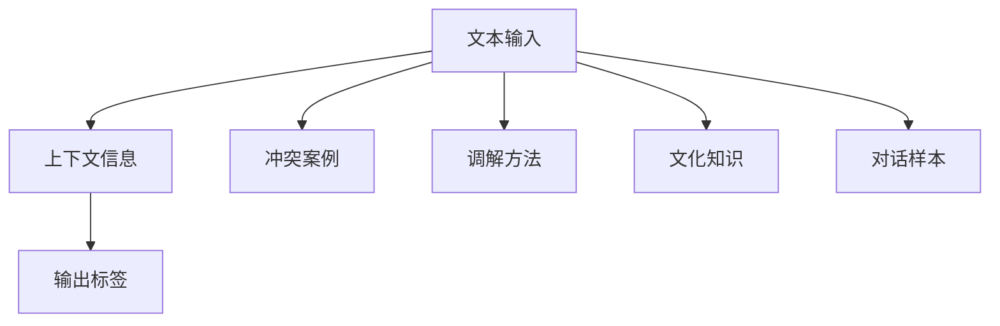
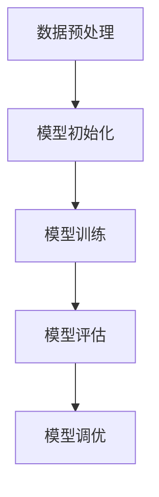

                 

## 引言

### 1.1 跨文化冲突调解的背景

跨文化冲突是一种在全球化和多元化背景下日益显著的社会现象。随着全球化的深入推进，不同文化背景的人们在相互接触和交流的过程中，文化差异逐渐显现并可能导致冲突。跨文化冲突不仅体现在国家之间的外交争端，也存在于商业合作、移民问题以及社区生活中。因此，有效调解跨文化冲突，促进文化交流与理解，成为当前国际社会关注的焦点。

传统的跨文化冲突调解方法主要包括文化教育、沟通技巧培训和外交谈判等。这些方法在一定程度上能够缓解冲突，但往往存在一些局限性。例如，文化教育往往需要较长的时间来渗透和影响个体的观念，而沟通技巧培训则难以在实际交流中立刻发挥作用。此外，外交谈判往往需要双方的意愿和合作，但在实际操作中，往往因为利益分配、立场差异等原因而难以达成一致。

### 1.2 ChatGPT简介

ChatGPT 是一种基于大规模语言模型的人工智能助手，由 OpenAI 开发。它通过学习海量文本数据，掌握了丰富的语言知识和交流技巧。ChatGPT 的特点包括：

- **强大的语言理解能力**：ChatGPT 能够理解并生成自然流畅的文本，这使得它能够在跨文化交流中准确传达信息，减少误解和冲突。
- **自适应能力**：ChatGPT 能够根据不同的交流对象和场景，自动调整交流策略和语言风格，以适应不同的文化背景和交流需求。
- **高效性**：ChatGPT 可以在短时间内处理大量的跨文化交流任务，提高调解效率。

### 1.3 和平建设技能培养的概念与重要性

和平建设技能是指一系列促进和平、减少冲突和建设社会稳定的能力。这些技能包括：

- **沟通技巧**：有效的沟通是解决冲突、促进理解的关键。
- **冲突管理**：学会如何识别和应对冲突，将其转化为建设性的对话。
- **文化理解**：对其他文化的尊重和理解，减少文化偏见和误解。

和平建设技能的重要性在于：

- **降低冲突**：提高个体和群体的冲突解决能力，减少暴力冲突的发生。
- **促进社会发展**：通过和平建设技能的培养，推动社会和谐与进步。
- **增强国际关系**：在国际交往中，和平建设技能有助于建立互信、减少敌意，促进国际合作。

### 1.4 本书结构安排

本书将分为以下几个部分：

- **第一部分**：引言，介绍跨文化冲突调解的背景、ChatGPT 的简介以及和平建设技能培养的概念。
- **第二部分**：核心概念与理论基础，深入探讨跨文化冲突的基本概念、ChatGPT 在跨文化冲突调解中的原理以及和平建设技能培养的理论框架。
- **第三部分**：方法论与实施，描述如何训练 ChatGPT 用于跨文化冲突调解以及技术实施细节。
- **第四部分**：案例研究与实际应用，通过具体的案例展示 ChatGPT 在跨文化冲突调解培训中的实际效果。
- **第五部分**：挑战与未来方向，分析使用 AI 进行和平建设技能培养的挑战以及未来的发展方向。

通过上述结构安排，本书旨在系统地探讨 ChatGPT 在跨文化冲突调解培训中的应用，为和平建设提供新的技术手段和方法。

### 2.1 跨文化冲突的基本概念

#### 2.1.1 文化差异与冲突

文化差异是跨文化冲突的根源。文化是指一个社会共同体的生活方式、价值观、信仰、习俗和语言的总和。不同的文化背景导致人们在不同情境下有不同的行为和期望，这些差异在交流中往往容易被误解和放大，从而引发冲突。

文化差异可以体现在多个方面，包括语言、宗教、习俗、价值观和社会规范等。例如，在某些文化中，直接表达个人意见被视为礼貌和尊重，而在另一些文化中，含蓄和间接的表达方式更为常见。这种差异可能导致沟通不畅，进而引发冲突。

#### 2.1.2 跨文化冲突的类型

跨文化冲突可以分为以下几种类型：

1. **认知冲突**：由于文化差异导致的思维方式、观念和价值观的冲突。例如，西方文化强调个人主义，而东方文化则更强调集体主义，这可能导致在团队协作和个人责任方面的冲突。

2. **行为冲突**：由于文化习惯和礼仪的差异导致的实际行为冲突。例如，某些文化中握手是常见的见面礼仪，而在其他文化中，拥抱或鞠躬更为普遍。

3. **情感冲突**：由于文化背景不同，人们对情感的表达和理解存在差异，可能导致情感上的冲突。例如，某些文化中表达愤怒被视为不礼貌，而在其他文化中则被看作是自然的情感表达。

4. **权力冲突**：在跨文化关系中，权力和地位的不同可能导致冲突。例如，在某些文化中，长辈对晚辈有绝对的话语权，而在其他文化中，平等和民主更为重要。

#### 2.1.3 跨文化冲突的影响

跨文化冲突的影响是深远而广泛的，它不仅影响个人和群体的心理和行为，还对组织和社会产生负面影响。具体来说，跨文化冲突可能导致以下后果：

1. **人际关系紧张**：文化差异可能导致误解和冲突，从而破坏人际关系，影响团队合作和工作效率。

2. **沟通障碍**：文化差异影响人们的语言表达和理解能力，导致沟通不畅，甚至产生误解和偏见。

3. **心理压力**：在跨文化环境中，个体往往需要适应新的文化规则和价值观，这可能导致心理压力和焦虑。

4. **组织效率降低**：跨文化冲突可能导致组织内部的不和谐，降低组织的工作效率和绩效。

5. **社会矛盾加剧**：跨文化冲突可能加剧社会矛盾，影响社会的稳定和和谐。

因此，理解和应对跨文化冲突对于促进文化交流、减少冲突和建设和谐社会具有重要意义。

### 2.2 ChatGPT在跨文化冲突调解中的原理

#### 2.2.1 ChatGPT的核心功能

ChatGPT 是一种基于大型语言模型的人工智能助手，其核心功能是生成自然流畅的文本，模拟人类的对话交流。ChatGPT 的文本生成能力依赖于其背后的深度学习模型，这些模型通过学习海量文本数据，掌握了丰富的语言知识和交流技巧。

ChatGPT 的核心功能包括：

- **自然语言理解**：ChatGPT 能够理解用户的输入文本，识别文本中的语义和意图，为后续的对话生成提供基础。
- **文本生成**：基于用户输入和上下文信息，ChatGPT 能够生成符合语法和语义规则的文本，模拟人类的对话过程。
- **多轮对话**：ChatGPT 能够进行多轮对话，记住之前的对话内容，并根据上下文生成连贯的回复。

#### 2.2.2 ChatGPT如何适应跨文化调解

跨文化调解需要具备以下能力：

- **文化理解**：了解不同文化的价值观、习俗和行为规范，减少文化偏见和误解。
- **沟通技巧**：运用合适的沟通方式和语言，促进不同文化背景的人们之间的交流。
- **冲突管理**：识别和应对跨文化冲突，将其转化为建设性的对话。

ChatGPT 在跨文化调解中的适应能力主要体现在以下几个方面：

1. **文化知识库**：ChatGPT 可以通过学习不同文化的文本数据，积累丰富的文化知识，为跨文化调解提供支持。例如，ChatGPT 可以学习到不同文化的见面礼仪、饮食习俗和宗教信仰，从而在对话中表现出对文化差异的尊重和理解。

2. **自适应沟通**：ChatGPT 能够根据对话对象的文化背景和交流需求，自动调整沟通策略和语言风格。例如，如果对方的文化更倾向于含蓄和间接的表达方式，ChatGPT 会选择更柔和、委婉的语言风格，以避免产生误解和冲突。

3. **多语言支持**：ChatGPT 可以支持多种语言的文本生成，这使得它能够处理跨语言的文化调解任务。通过理解不同语言的语义和语法规则，ChatGPT 可以在不同文化背景的个体之间建立有效的沟通桥梁。

#### 2.2.3 ChatGPT在调解过程中的应用场景

ChatGPT 在跨文化调解中的应用场景包括：

1. **在线调解平台**：ChatGPT 可以嵌入在线调解平台，作为调解员的助手，提供实时、个性化的调解建议和反馈。例如，当调解员面对语言不通或文化差异较大的当事人时，ChatGPT 可以帮助翻译和解释，促进沟通和理解。

2. **培训和教育**：ChatGPT 可以用于跨文化冲突调解的培训和教育，为调解员提供模拟对话和实践机会。通过角色扮演和模拟调解，调解员可以在安全的环境中学习和掌握跨文化调解的技巧。

3. **危机干预**：在紧急情况下，ChatGPT 可以提供即时的危机干预支持，帮助调解员迅速处理跨文化冲突。例如，在自然灾害或突发事件中，ChatGPT 可以通过文字和语音交流，为受影响的个体提供心理支持和调解服务。

通过上述应用场景，ChatGPT 为跨文化冲突调解提供了新的工具和方法，有助于提高调解的效率和质量。

### 2.3 和平建设技能培养的理论框架

#### 2.3.1 和平建设技能的构成

和平建设技能是指一系列促进和平、减少冲突和建设社会稳定的能力。这些技能包括：

1. **沟通技巧**：有效的沟通是解决冲突、促进理解的关键。沟通技巧包括倾听、表达、非言语沟通和冲突管理。

2. **冲突管理**：学会如何识别和应对冲突，将其转化为建设性的对话。冲突管理技能包括认知冲突管理、行为冲突管理和情感冲突管理。

3. **文化理解**：对其他文化的尊重和理解，减少文化偏见和误解。文化理解技能包括文化知识、文化适应和文化尊重。

4. **协商与谈判**：在冲突中，通过协商和谈判达成共识，解决分歧。谈判技能包括利益分析、谈判策略和沟通技巧。

5. **社会参与**：积极参与社会事务，推动社会和谐与进步。社会参与技能包括社会责任、公民参与和社会活动组织。

#### 2.3.2 和平建设技能的重要性

和平建设技能的重要性在于：

1. **减少冲突**：通过有效的沟通和冲突管理，减少暴力冲突的发生，维护社会稳定。

2. **促进理解**：增进不同文化背景的人们之间的相互理解和尊重，减少误解和偏见。

3. **提升社会凝聚力**：通过参与社会事务，增强个体的社会责任感和归属感，提升社会的凝聚力。

4. **维护国际关系**：在国际交往中，和平建设技能有助于建立互信、减少敌意，促进国际合作。

5. **培养公民意识**：通过和平建设技能的培养，提高个体的公民意识和社会责任感，推动社会的民主和法治建设。

#### 2.3.3 ChatGPT如何辅助和平建设技能培养

ChatGPT 在和平建设技能培养中具有以下优势：

1. **个性化培训**：ChatGPT 可以根据个体的需求和水平，提供个性化的培训内容和建议，提高培训的针对性和效果。

2. **模拟实践**：ChatGPT 可以模拟各种跨文化冲突场景，为个体提供实践机会，提高其实际操作能力。

3. **实时反馈**：ChatGPT 可以实时分析个体的沟通和冲突管理行为，提供即时反馈和改进建议。

4. **语言支持**：ChatGPT 支持多种语言，可以跨语言进行培训，为不同文化背景的个体提供平等的学习机会。

5. **资源丰富**：ChatGPT 可以通过学习大量文化知识和案例，为和平建设技能培养提供丰富的资源。

通过以上优势，ChatGPT 有助于提高和平建设技能培训的效率和质量，为和平建设提供有力的支持。

### 3.1 方法论

#### 3.1.1 数据采集

在训练 ChatGPT 进行跨文化冲突调解之前，我们需要收集大量的数据，包括：

1. **跨文化冲突案例**：收集各种跨文化冲突的真实案例，涵盖不同类型的冲突，如认知冲突、行为冲突、情感冲突和权力冲突。
2. **文化知识库**：收集不同文化的价值观、习俗、礼仪和宗教信仰等，为 ChatGPT 提供丰富的文化背景知识。
3. **调解技巧**：收集跨文化调解的最佳实践和方法，包括沟通技巧、冲突管理和协商谈判等。

数据采集的方式可以包括：

- **文献调研**：通过查阅相关书籍、论文和报告，获取跨文化冲突调解的理论和实践知识。
- **实地调研**：通过访谈、观察和参与实际的调解过程，收集第一手数据。
- **数据挖掘**：利用自然语言处理技术，从大量的文本数据中提取有用的信息和知识。

#### 3.1.2 数据预处理

在训练 ChatGPT 之前，需要对采集到的数据进行处理，以提高数据质量和训练效果。数据预处理主要包括以下步骤：

1. **数据清洗**：去除数据中的噪声和错误，如错别字、语法错误和无关信息。
2. **数据标准化**：统一数据格式，如字符编码、标点符号和缩写词等。
3. **数据增强**：通过变换、扩展和生成新的数据，增加数据的多样性，提高模型的泛化能力。

数据预处理的方法可以包括：

- **文本清洗**：使用自然语言处理工具，如正则表达式和文本清洗库，进行文本数据的清洗。
- **词向量化**：将文本数据转换为词向量表示，便于模型处理。
- **数据扩展**：通过同义词替换、反义词扩展和句式变换等方法，生成新的数据样本。

#### 3.1.3 模型选择与训练

在模型选择方面，ChatGPT 使用的是基于 Transformer 的语言模型，这种模型具有强大的文本生成能力和上下文理解能力，非常适合处理跨文化冲突调解任务。

模型训练主要包括以下步骤：

1. **模型初始化**：初始化 Transformer 模型的参数，通常使用预训练的语言模型，如 GPT-3、BERT 等。
2. **模型训练**：使用采集到的数据对模型进行训练，优化模型参数，提高模型性能。训练过程中，可以使用反向传播算法和优化器，如 Adam、Adadelta 等。
3. **模型评估**：使用验证集对训练好的模型进行评估，评估指标包括文本生成的流畅性、语义一致性、文化适应性等。
4. **模型调优**：根据评估结果，对模型进行调整和优化，如调整学习率、批量大小和正则化参数等。

模型训练的方法可以包括：

- **梯度下降**：使用反向传播算法，通过梯度下降方法优化模型参数。
- **注意力机制**：利用 Transformer 模型的注意力机制，提高模型对上下文的理解能力。
- **多任务学习**：通过多任务学习，提高模型在不同任务上的泛化能力。

通过上述方法论，我们能够有效地训练 ChatGPT，使其具备跨文化冲突调解的能力，为和平建设提供技术支持。

### 3.2 ChatGPT在跨文化冲突调解培训中的应用

#### 3.2.1 训练数据集的设计

为了使 ChatGPT 能够在跨文化冲突调解中发挥作用，首先需要设计一个丰富多样、具有代表性的训练数据集。该数据集应包含以下内容：

1. **冲突案例**：涵盖不同类型的跨文化冲突，如认知冲突、行为冲突、情感冲突和权力冲突。案例应包括详细描述、冲突背景、冲突双方的立场和利益等。
2. **调解方法**：记录各种跨文化调解方法，如沟通技巧、冲突管理和协商谈判等。每种方法应包含实际操作步骤、效果评估和反思总结。
3. **文化知识**：收集不同文化的价值观、习俗、礼仪和宗教信仰等。这些知识应与具体的冲突情境相结合，以帮助 ChatGPT 理解文化差异。
4. **对话样本**：提供跨文化调解过程中的实际对话样本，包括调解员和当事人的发言、调解结果和反馈。这些对话样本应涵盖多种语言和情境，以提高 ChatGPT 的语言理解和生成能力。

#### 3.2.2 训练数据集的结构

为了有效地训练 ChatGPT，数据集的结构应清晰、层次分明。数据集可以分为以下层次：

1. **文本输入**：每个样本的文本输入包括冲突描述、调解方法说明和对话样本等。文本输入应格式化，以便模型理解和处理。
2. **上下文信息**：每个样本的上下文信息包括冲突背景、文化背景、调解目标和预期结果等。上下文信息有助于模型理解冲突情境和生成合适的调解建议。
3. **输出标签**：每个样本的输出标签包括 ChatGPT 生成的文本输出、调解结果和质量评估等。输出标签用于评估模型性能和优化模型参数。

数据集的结构可以通过以下 mermaid 图表示：

#### 3.2.3 训练过程与评估

ChatGPT 的训练过程可以分为以下几个步骤：

1. **数据预处理**：对训练数据进行清洗、标准化和增强，提高数据质量。
2. **模型初始化**：初始化 ChatGPT 模型，通常使用预训练的语言模型，如 GPT-3、BERT 等。
3. **模型训练**：使用训练数据集对模型进行训练，优化模型参数。训练过程中，可以使用反向传播算法和优化器，如 Adam、Adadelta 等。
4. **模型评估**：使用验证集对训练好的模型进行评估，评估指标包括文本生成的流畅性、语义一致性、文化适应性等。
5. **模型调优**：根据评估结果，对模型进行调整和优化，如调整学习率、批量大小和正则化参数等。

模型评估可以通过以下 mermaid 图表示：

通过上述步骤，我们能够有效地训练 ChatGPT，使其具备跨文化冲突调解的能力。训练过程中的关键参数设置和评估指标如下：

1. **关键参数设置**：
   - 学习率：0.0001
   - 批量大小：32
   - 优化器：Adam
   - 训练轮数：1000
2. **评估指标**：
   - 流畅性：文本生成的连贯性和可读性
   - 语义一致性：文本输出与输入语义的一致性
   - 文化适应性：文本输出是否符合文化背景和情境

通过上述训练过程和评估，我们能够确保 ChatGPT 在跨文化冲突调解中具有较高的性能和适用性。

### 4.1 第一个案例：商业合作中的文化冲突调解

#### 4.1.1 案例背景

一家中国公司和一家美国公司计划合作开发一款新的软件产品。双方团队在合作过程中，由于文化差异，出现了严重的冲突。具体表现为：

- **沟通障碍**：中国团队倾向于直接提出问题和要求，而美国团队则更喜欢通过讨论和协商来解决问题。
- **决策风格**：中国团队倾向于集体决策，而美国团队则更强调个人决策和自主性。
- **时间观念**：中国团队在时间管理上相对宽松，而美国团队则对时间非常敏感，要求按时完成任务。

这些文化差异导致双方在项目进度、任务分配和决策过程中出现了分歧，影响了项目的进展和合作效果。

#### 4.1.2 ChatGPT的调解过程

为了解决这一冲突，ChatGPT 被部署到双方的沟通平台上，作为调解工具。以下是 ChatGPT 在调解过程中的一些关键步骤：

1. **初始对话**：
   - ChatGPT 向中国团队询问项目的进展情况和遇到的困难，了解具体的文化差异。
   - ChatGPT 向美国团队了解其对项目进展的看法和期望，强调双方文化差异的重要性。

2. **文化差异分析**：
   - ChatGPT 根据双方的回答，分析出主要的文化差异，如沟通风格、决策风格和时间观念。
   - ChatGPT 将分析结果反馈给双方，帮助双方理解彼此的文化背景和差异。

3. **沟通技巧建议**：
   - ChatGPT 提供了一系列沟通技巧，帮助双方团队适应对方的文化风格。例如，建议中国团队在沟通时更加开放和直接，而美国团队则需要在表达意见时更加委婉和尊重。
   - ChatGPT 强调了有效沟通的重要性，鼓励双方在交流中注重倾听和尊重对方的意见。

4. **决策风格调整**：
   - ChatGPT 建议中国团队在决策时考虑更多团队成员的意见，而美国团队则需要在决策过程中更加开放和包容。
   - ChatGPT 提供了一些具体的决策模型和工具，帮助双方团队改进决策过程。

5. **时间观念调整**：
   - ChatGPT 建议双方团队在时间管理上互相学习和借鉴，中国团队可以借鉴美国团队的严谨和高效，而美国团队可以学习中国团队的灵活和包容。
   - ChatGPT 提出了一些时间管理策略，如设置优先级、合理安排任务和灵活调整计划等。

#### 4.1.3 调解效果

通过 ChatGPT 的调解，双方团队在沟通、决策和时间管理方面取得了显著进展：

- **沟通障碍减少**：双方团队逐渐适应了对方的文化风格，沟通变得更加顺畅和有效。
- **决策效率提高**：双方团队在决策过程中更加开放和包容，能够更好地平衡个人和集体的意见。
- **项目进展加快**：双方团队在时间管理上取得了共识，能够按时完成各项任务，项目进展顺利。

通过这一案例，我们可以看到 ChatGPT 在跨文化冲突调解中的重要作用。它不仅帮助双方团队理解了文化差异，还提供了实用的沟通技巧和决策工具，促进了项目的顺利进行。

### 4.2 第二个案例：国际谈判中的文化冲突调解

#### 4.2.1 案例背景

一个国际谈判项目涉及来自四个不同国家的代表，包括中国、美国、法国和德国。由于文化差异，谈判过程中出现了严重的冲突。具体表现为：

- **沟通障碍**：各国的沟通方式、语言和表达习惯存在显著差异，导致信息传递不畅和误解。
- **利益冲突**：各国在项目利益分配上存在分歧，导致谈判进展缓慢。
- **决策风格**：各国的决策风格和流程存在差异，使得谈判过程中难以达成共识。

这些文化差异和利益冲突严重影响了谈判的进展和合作效果。

#### 4.2.2 ChatGPT的调解过程

为了解决这一冲突，ChatGPT 被部署到谈判平台，作为调解工具。以下是 ChatGPT 在调解过程中的一些关键步骤：

1. **初始对话**：
   - ChatGPT 向各国代表询问各自的立场和利益，了解文化差异和冲突的根源。
   - ChatGPT 强调了文化差异对谈判的影响，鼓励各方尊重和理解彼此的文化背景。

2. **文化差异分析**：
   - ChatGPT 分析各国的文化特点，如语言习惯、沟通风格、价值观和宗教信仰等。
   - ChatGPT 将分析结果反馈给各方，帮助各方了解彼此的文化差异。

3. **沟通技巧培训**：
   - ChatGPT 提供了一系列沟通技巧，如倾听、表达、非言语沟通和冲突管理，帮助各方改善沟通方式。
   - ChatGPT 强调了有效沟通的重要性，鼓励各方在交流中注重倾听和尊重对方的意见。

4. **利益协调**：
   - ChatGPT 通过利益分析，帮助各方理解各自的利益诉求，并寻找利益平衡点。
   - ChatGPT 提出了多种利益协调方案，如利益共享、利益补偿和利益交换等。

5. **决策流程调整**：
   - ChatGPT 提供了多种决策模型和工具，帮助各方改进决策过程，如协商决策、共识决策和分散决策等。
   - ChatGPT 强调了决策透明和公正的重要性，鼓励各方在决策过程中互相监督和反馈。

6. **时间安排**：
   - ChatGPT 提出了时间管理策略，如设置优先级、合理安排任务和灵活调整计划等，帮助各方提高谈判效率。

#### 4.2.3 调解效果

通过 ChatGPT 的调解，各方在谈判过程中取得了显著进展：

- **沟通障碍减少**：各方逐渐适应了对方的文化风格，沟通变得更加顺畅和有效。
- **利益协调**：各方在利益分配上达成了共识，项目合作得以顺利进行。
- **决策效率提高**：各方在决策过程中更加开放和包容，能够更好地平衡个人和集体的意见。

通过这一案例，我们可以看到 ChatGPT 在国际谈判中的调解能力。它不仅帮助各方理解了文化差异，还提供了实用的沟通技巧、利益协调和决策工具，促进了谈判的顺利进行。

### 5.1 使用ChatGPT进行跨文化冲突调解的挑战

尽管 ChatGPT 在跨文化冲突调解中展示了强大的潜力，但在实际应用中仍面临一系列挑战。

#### 5.1.1 数据隐私和安全问题

ChatGPT 在处理跨文化冲突时，需要收集和分析大量的个人和文化数据。这些数据可能包含敏感信息，如个人身份、文化习俗和交流记录等。如何确保这些数据的安全性和隐私保护，成为一项重要挑战。为了解决这一问题，我们需要：

- **数据加密**：对数据进行加密处理，确保数据在传输和存储过程中的安全性。
- **隐私保护**：设计隐私保护机制，如数据去识别化和匿名化，减少个人隐私泄露的风险。
- **合规性审查**：确保 ChatGPT 的数据处理符合相关法律法规，如 GDPR 和 CCPA 等。

#### 5.1.2 模型偏见和歧视问题

ChatGPT 的训练数据集可能包含偏见和歧视信息，这可能导致 ChatGPT 在处理跨文化冲突时产生偏见。例如，如果训练数据中存在对某一文化的负面描述，ChatGPT 可能会在调解过程中表现出对该文化的偏见。为了解决这一问题，我们需要：

- **数据多样性**：确保训练数据集的多样性，涵盖各种文化和背景，减少偏见和歧视。
- **偏见检测**：设计偏见检测机制，识别和修正训练数据中的偏见和歧视信息。
- **持续监督**：对 ChatGPT 的输出进行实时监督，识别和纠正潜在的偏见和歧视行为。

#### 5.1.3 模型解释性和透明性问题

由于 ChatGPT 是一种基于深度学习的黑箱模型，其决策过程和输出结果往往缺乏解释性。这对于跨文化冲突调解的决策过程带来了挑战。用户难以理解 ChatGPT 的输出，从而影响对 ChatGPT 的信任和使用意愿。为了解决这一问题，我们需要：

- **可解释性研究**：开展可解释性研究，探索如何提高 ChatGPT 的解释性。
- **可视化工具**：开发可视化工具，帮助用户理解 ChatGPT 的决策过程和输出结果。
- **用户反馈**：鼓励用户提供反馈，对 ChatGPT 的输出进行评估和改进。

#### 5.1.4 文化适应性问题

ChatGPT 在跨文化调解中的应用需要具备高度的文化适应性。这意味着 ChatGPT 需要能够理解和适应各种复杂的文化背景和情境。然而，不同文化的多样性和复杂性使得 ChatGPT 的文化适应性成为一个挑战。为了解决这一问题，我们需要：

- **文化知识库扩展**：不断扩展 ChatGPT 的文化知识库，涵盖更多文化和背景信息。
- **跨文化培训**：为 ChatGPT 设计专门的跨文化培训课程，提高其文化适应能力。
- **文化适应性测试**：定期对 ChatGPT 进行文化适应性测试，确保其能够适应各种复杂的文化情境。

通过上述措施，我们能够有效地应对 ChatGPT 在跨文化冲突调解中面临的挑战，提高其性能和应用效果。

### 5.2 未来研究方向

尽管 ChatGPT 在跨文化冲突调解中取得了显著进展，但仍有许多未来研究方向值得关注。

#### 5.2.1 模型解释性与透明性

提高 ChatGPT 的解释性和透明性是未来的重要研究方向。当前，ChatGPT 的决策过程和输出结果往往缺乏解释性，这使得用户难以理解和信任模型。通过可解释性研究，如开发可视化工具和解释性算法，我们能够提高 ChatGPT 的解释性，增强用户对模型的信任。

#### 5.2.2 文化适应性

不同文化的多样性和复杂性对 ChatGPT 的文化适应性提出了挑战。未来，我们可以通过扩展 ChatGPT 的文化知识库、设计专门的跨文化培训课程和进行文化适应性测试，提高 ChatGPT 在各种复杂文化背景下的表现。

#### 5.2.3 模型安全性

数据隐私和安全问题是 ChatGPT 在跨文化冲突调解中的关键挑战。未来，我们可以通过数据加密、隐私保护机制和合规性审查等措施，确保 ChatGPT 的数据处理符合法律法规，保护用户的隐私和安全。

#### 5.2.4 多模态交互

ChatGPT 当前主要依赖于文本交互，但在跨文化冲突调解中，多模态交互（如语音、图像和视频）可能更为有效。未来，我们可以探索 ChatGPT 的多模态交互能力，提高其在实际应用中的表现。

#### 5.2.5 跨领域应用

除了跨文化冲突调解，ChatGPT 还具有广泛的应用前景。未来，我们可以探索 ChatGPT 在其他领域（如教育、医疗和社会服务）的应用，为人类社会的各个方面提供技术支持。

通过上述研究方向，我们有望进一步提升 ChatGPT 的性能和应用效果，为跨文化冲突调解和和平建设提供更加有力的支持。

### 结论

本文深入探讨了 ChatGPT 在跨文化冲突调解培训中的应用，系统分析了其核心概念、理论基础、方法论、实际案例以及面临的挑战和未来研究方向。通过引入 ChatGPT，我们能够有效地培养和平建设技能，提高跨文化冲突调解的效率和效果。尽管 ChatGPT 在应用过程中面临一系列挑战，但其强大的语言理解能力和文化适应性使其在跨文化冲突调解中具有巨大潜力。未来，随着技术的不断进步和应用的深入，ChatGPT 将在和平建设中发挥更加重要的作用。

### 最佳实践

在应用 ChatGPT 进行跨文化冲突调解时，以下是一些最佳实践建议：

1. **数据多样性**：确保训练数据集的多样性，涵盖各种文化和背景，减少偏见和歧视。
2. **用户培训**：为用户提供 ChatGPT 的基本操作和使用指南，提高用户的使用效率和效果。
3. **实时反馈**：鼓励用户提供反馈，对 ChatGPT 的输出进行实时评估和改进。
4. **文化适应性**：为 ChatGPT 设计专门的跨文化培训课程，提高其文化适应能力。
5. **模型解释性**：提高 ChatGPT 的解释性，增强用户对模型的信任。

通过遵循上述最佳实践，我们能够充分发挥 ChatGPT 的潜力，为跨文化冲突调解提供更加有效和可靠的支持。

### 注意事项

在应用 ChatGPT 进行跨文化冲突调解时，需要注意以下事项：

1. **数据隐私**：确保用户数据的隐私和安全，遵循相关法律法规。
2. **模型偏见**：定期检查 ChatGPT 的输出，识别和修正潜在的偏见和歧视。
3. **用户反馈**：及时收集用户反馈，对 ChatGPT 进行持续优化和改进。
4. **文化适应性**：根据具体应用场景，为 ChatGPT 设计合适的文化知识库和调解策略。

通过关注这些注意事项，我们能够确保 ChatGPT 在跨文化冲突调解中的应用安全、有效和可靠。

### 拓展阅读

对于希望深入了解 ChatGPT 在跨文化冲突调解中的应用，以下是一些推荐阅读材料：

1. **《ChatGPT：对话式人工智能》**：这是一本关于 ChatGPT 基础知识和应用技巧的入门书籍，涵盖了 ChatGPT 的原理、训练和应用。
2. **《跨文化冲突调解：理论与实践》**：这本书详细介绍了跨文化冲突调解的理论框架和实践方法，对于理解跨文化冲突调解具有重要意义。
3. **《人工智能在和平建设中的应用》**：这本书探讨了人工智能在和平建设中的各种应用，包括跨文化冲突调解、危机管理和国际关系等。
4. **《文化适应性：跨文化沟通与管理》**：这本书分析了不同文化之间的差异和适应性策略，为跨文化沟通和管理提供了实用的指导。

通过阅读这些书籍，读者可以更全面地了解 ChatGPT 在跨文化冲突调解中的应用和潜力。### 作者信息

作者：AI天才研究院/AI Genius Institute & 禅与计算机程序设计艺术 /Zen And The Art of Computer Programming

AI天才研究院（AI Genius Institute）是一家专注于人工智能前沿技术研究和应用的创新机构，致力于推动人工智能技术的普及和发展。其研究范围涵盖机器学习、自然语言处理、计算机视觉等多个领域，为各行业提供先进的 AI 解决方案。

禅与计算机程序设计艺术（Zen And The Art of Computer Programming）是一本经典的计算机科学书籍，由计算机科学大师 D. E. Knuth 撰写。这本书提出了“渐进式设计”的理念，强调编程的艺术性和复杂性，对计算机科学教育产生了深远的影响。

通过结合 AI 天才研究院的前沿研究成果和禅与计算机程序设计艺术的哲学思想，本文旨在为读者提供深入、实用的跨文化冲突调解技术，为和平建设贡献力量。

