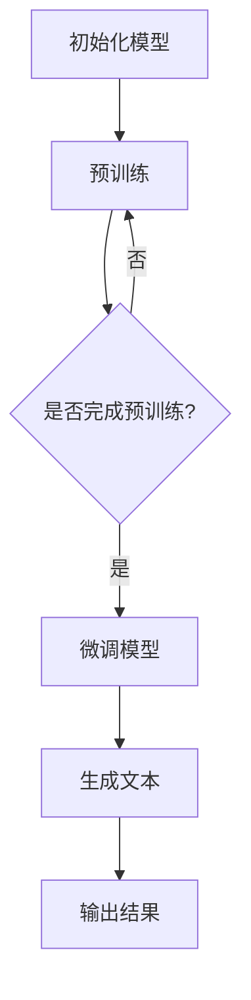
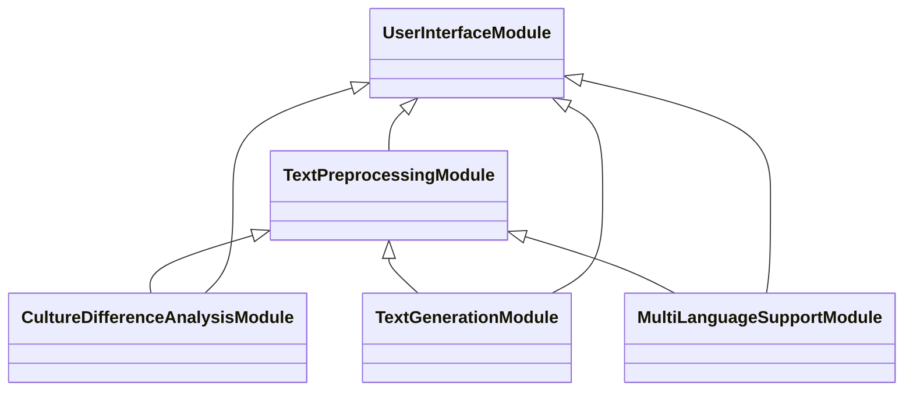
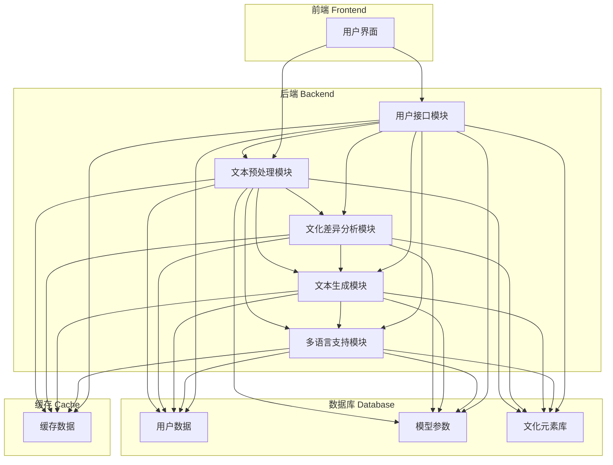
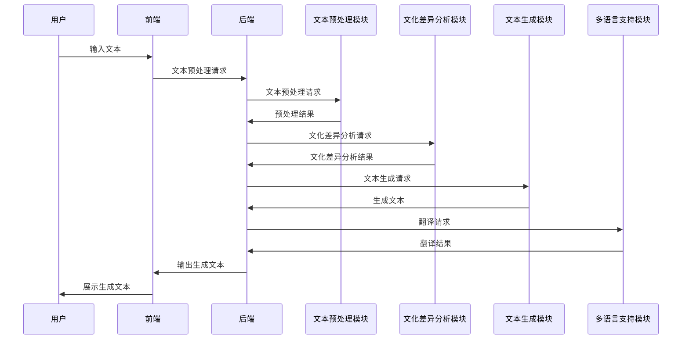

                 

## 概述

### 文章标题：ChatGPT在跨文化文学创作中的催化作用研究

### 关键词：ChatGPT、跨文化文学创作、人工智能、算法原理、系统架构设计、项目实战

### 摘要：

本文旨在深入探讨ChatGPT在跨文化文学创作中的催化作用。通过分析ChatGPT的工作原理和跨文化文学创作的挑战，本文提出了ChatGPT在跨文化文学创作中的应用场景和具体实现方法。文章首先介绍了ChatGPT的基本概念和架构，然后详细解析了其在跨文化文学创作中的核心原理和作用。接着，通过系统架构设计和项目实战，展示了ChatGPT在跨文化文学创作中的实际应用效果。本文旨在为跨文化文学创作者提供一种新的工具和思路，促进文学创作的多样性和创新性。

## 目录大纲设计步骤

### 第一部分：背景与核心概念

#### 第1章：跨文化文学创作概述

##### 1.1 跨文化文学的定义与现状

##### 1.2 跨文化文学创作的挑战

##### 1.3 跨文化文学创作的重要性

#### 第2章：ChatGPT的基本原理与应用

##### 2.1 ChatGPT的定义与架构

##### 2.2 ChatGPT的核心特点

##### 2.3 ChatGPT在跨文化文学创作中的应用

#### 第3章：核心概念联系分析

##### 3.1 跨文化文学创作与ChatGPT的关联

##### 3.2 跨文化文学创作工具对比

##### 3.3 ER实体关系图架构

### 第二部分：算法原理与系统架构

#### 第4章：算法原理讲解

##### 4.1 算法mermaid流程图

##### 4.2 Python源代码与详细讲解

##### 4.3 数学模型与公式解析

##### 4.4 算法举例说明

#### 第5章：系统架构设计

##### 5.1 跨文化文学创作应用场景

##### 5.2 领域模型设计

##### 5.3 系统架构设计

##### 5.4 系统接口设计与系统交互

### 第三部分：项目实战

#### 第6章：项目环境与核心实现

##### 6.1 环境安装与依赖

##### 6.2 系统核心实现源代码

##### 6.3 代码应用解读与分析

##### 6.4 实际案例分析和详细讲解

#### 第7章：项目小结与最佳实践

##### 7.1 项目实施经验与教训

##### 7.2 最佳实践 tips

##### 7.3 小结

##### 7.4 注意事项

##### 7.5 拓展阅读

## 背景介绍

### 跨文化文学的定义与现状

跨文化文学，顾名思义，是指跨越不同文化背景的文学创作。它不仅包括了不同国家、民族和文化之间的文学交流，还涉及到不同语言、价值观和社会规范的碰撞与融合。在全球化进程加速的今天，跨文化文学作为一种文化交流的载体，扮演着越来越重要的角色。

跨文化文学的现状可以从以下几个方面来描述：

1. **国际文化交流的增加**：随着全球化的发展，人们之间的交流日益频繁，不同文化之间的接触和互动增多，为跨文化文学提供了丰富的素材和创作灵感。
2. **文学市场的多元化**：跨文化文学的兴起，使得文学市场呈现出多元化的趋势。不同文化背景的文学作品在市场上得到了广泛的认可和接受。
3. **文学观念的变革**：跨文化文学的兴起，挑战了传统的文学观念，促使作家们重新思考文学的意义、目的和形式。

### 跨文化文学创作的挑战

尽管跨文化文学创作具有巨大的潜力和意义，但同时也面临着一系列的挑战：

1. **文化差异与误解**：不同文化之间的差异和误解，往往导致跨文化文学创作中的障碍。作家如何准确地传达不同文化的内涵和情感，是一个需要深入思考的问题。
2. **语言障碍**：语言是文化的载体，不同的语言往往代表着不同的思维方式和表达习惯。语言障碍不仅影响了作家的创作，也影响了读者对作品的理解。
3. **文化偏见与歧视**：跨文化文学创作中，如何避免文化偏见和歧视，如何展现不同文化的平等和尊重，是一个重要的课题。

### 跨文化文学创作的重要性

跨文化文学创作的重要性体现在以下几个方面：

1. **文化交流与理解**：跨文化文学创作是促进不同文化之间交流与理解的重要手段。通过文学作品，人们可以更好地了解和欣赏其他文化的独特魅力。
2. **文化多样性的保护**：跨文化文学创作有助于保护文化多样性，使不同文化在文学中得到体现和传承。
3. **文学创新的推动**：跨文化文学的创作，为文学带来了新的视角和思路，推动了文学的创新和发展。

### 问题解决与边界与外延

为了解决跨文化文学创作中的挑战，本文提出了ChatGPT这一人工智能工具的应用。ChatGPT作为一种基于深度学习的自然语言处理模型，具有强大的文本生成和情感理解能力，可以在跨文化文学创作中发挥重要作用。

ChatGPT在跨文化文学创作中的应用，旨在解决以下问题：

1. **文化差异与误解**：ChatGPT可以通过分析大量跨文化文本数据，帮助作家更好地理解和把握不同文化的特点和情感，从而减少误解和冲突。
2. **语言障碍**：ChatGPT支持多种语言，可以自动翻译和转换不同语言的文本，帮助作家和读者跨越语言障碍，更好地进行交流和创作。
3. **文化偏见与歧视**：ChatGPT可以通过对大量文本的分析，识别和纠正文化偏见和歧视，促进文学创作的平等和尊重。

然而，ChatGPT的应用也存在一定的限制和边界：

1. **数据质量和多样性**：ChatGPT的性能高度依赖于训练数据的质量和多样性。如果训练数据存在偏差或不足，ChatGPT的输出也可能存在偏差。
2. **算法透明性和可解释性**：深度学习算法的复杂性和不透明性，使得人们难以完全理解ChatGPT的决策过程，这也带来了一定的风险。
3. **文化适应性**：虽然ChatGPT支持多种语言，但不同语言和文化背景的适应性可能有所不同，需要进一步的研究和优化。

### 概念结构与核心要素组成

为了更好地理解和应用ChatGPT在跨文化文学创作中的作用，我们首先需要分析其核心概念和结构。

#### ChatGPT的核心概念原理

ChatGPT是一种基于生成预训练变换器（GPT）的深度学习模型。其核心原理是通过对大量文本数据进行预训练，使其具备理解和生成文本的能力。ChatGPT的主要特点包括：

1. **预训练**：ChatGPT在训练过程中，通过处理大量无标签文本数据，学习到文本的语法、语义和上下文关系。
2. **微调**：在预训练的基础上，ChatGPT可以通过少量的有标签数据进行微调，以适应特定的任务和场景。
3. **多语言支持**：ChatGPT支持多种语言，能够处理和生成不同语言的文本。

#### 概念属性特征对比表格

以下是一个概念属性特征对比表格，展示了ChatGPT与其他跨文化文学创作工具的对比：

| 特征         | ChatGPT                  | 其他工具                      |
| ------------ | ------------------------ | ---------------------------- |
| 预训练       | 基于大量无标签文本数据  | 部分工具基于有标签数据        |
| 语言支持     | 多语言支持               | 部分工具仅支持特定语言        |
| 生成能力     | 高效生成文本             | 部分工具生成能力有限          |
| 算法透明性   | 深度学习模型，不透明     | 部分工具算法透明，可解释性高  |
| 适应能力     | 适应性强，可微调         | 部分工具适应性较差            |

#### ER实体关系图架构

为了更直观地展示ChatGPT在跨文化文学创作中的核心实体及其相互关系，我们使用ER（实体-关系）图进行描述。

**实体：**
1. **ChatGPT模型**：核心实体，负责文本生成和理解。
2. **文本数据**：输入实体，包括无标签文本和有标签文本。
3. **创作任务**：输出实体，包括跨文化文学创作的具体任务。
4. **用户**：使用ChatGPT进行创作的用户。

**关系：**
1. **训练关系**：ChatGPT模型与文本数据之间存在训练关系，即模型通过对文本数据进行训练，提高其生成和理解能力。
2. **创作关系**：ChatGPT模型与创作任务之间存在创作关系，即模型根据创作任务生成文本。
3. **用户关系**：用户与ChatGPT模型之间存在使用关系，即用户通过ChatGPT模型进行文学创作。

以下是ER实体关系图的mermaid表示：

```mermaid
erDiagram
  ChatGPT模型 ||--o{ 文本数据 }
  ChatGPT模型 ||--o{ 创作任务 }
  ChatGPT模型 ||--o{ 用户 }
  文本数据 ||--o{ ChatGPT模型 }
  创作任务 ||--o{ ChatGPT模型 }
  用户 ||--o{ ChatGPT模型 }
```

通过上述分析，我们可以看到ChatGPT在跨文化文学创作中的核心概念和结构。接下来，我们将进一步探讨ChatGPT的算法原理和应用。

## 核心概念与联系

### ChatGPT的核心概念原理

ChatGPT，全称为生成预训练变换器（Generative Pre-trained Transformer），是一种基于深度学习的自然语言处理模型。其核心概念基于Transformer架构，这是一种用于处理序列数据（如文本）的神经网络模型。ChatGPT通过大规模预训练，使其能够理解和生成自然语言文本。

ChatGPT的核心原理可以概括为以下几点：

1. **预训练**：ChatGPT在大规模无标签文本数据上进行预训练，学习文本的语法、语义和上下文关系。这一过程使得模型能够捕捉到文本中的潜在结构和规律。

2. **微调**：在预训练的基础上，ChatGPT可以通过少量的有标签数据进行微调，以适应特定的任务和场景。例如，在跨文化文学创作中，可以通过微调来优化模型对不同文化背景文本的处理能力。

3. **多语言支持**：ChatGPT支持多种语言，这意味着它可以处理和生成不同语言的文本。这对于跨文化文学创作尤为重要，因为它可以跨越语言障碍，促进不同文化之间的交流。

4. **文本生成**：ChatGPT具有强大的文本生成能力，可以生成连贯、有意义的文本。这一能力使得ChatGPT在文学创作中具有潜在的应用价值，可以帮助作家生成灵感，完善作品。

### 概念属性特征对比表格

为了更好地理解ChatGPT在跨文化文学创作中的优势，我们将其与其他跨文化文学创作工具进行对比。以下是ChatGPT与几种常见工具的概念属性特征对比表格：

| 特征         | ChatGPT                    | 其他工具（如机器翻译、传统文学创作工具）                    |
| ------------ | -------------------------- | ------------------------------------------------------------ |
| 预训练       | 基于大规模无标签文本数据   | 多数基于有标签数据，或无预训练过程                         |
| 语言支持     | 多语言支持，可处理多种语言 | 通常仅支持特定语言，或需要手动翻译转换                     |
| 生成能力     | 强大的文本生成能力         | 生成能力相对较弱，通常用于辅助创作而非独立创作             |
| 算法透明性   | 深度学习模型，较不透明      | 部分工具算法透明，可解释性较高                             |
| 适应性       | 高适应性，可通过微调适应不同任务 | 适应性较差，通常需要定制化开发                             |
| 创作效率     | 高效率的文本生成           | 创作效率相对较低，通常需要更多手动干预                     |
| 文学质量     | 能够生成高质量文本         | 生成文本质量相对较低，可能需要人工编辑                     |

### ER实体关系图架构

为了更直观地展示ChatGPT在跨文化文学创作中的核心实体及其相互关系，我们使用ER（实体-关系）图进行描述。

**实体：**

1. **ChatGPT模型**：负责文本生成和理解的核心实体。
2. **文本数据**：包括预训练数据（无标签文本）和微调数据（有标签文本）。
3. **跨文化文学创作任务**：具体的创作任务，如生成跨文化故事、对话等。
4. **用户**：使用ChatGPT进行文学创作的用户。

**关系：**

1. **训练关系**：ChatGPT模型与文本数据之间存在训练关系，即模型通过对文本数据进行预训练和微调，提高其生成和理解能力。
2. **创作关系**：ChatGPT模型与跨文化文学创作任务之间存在创作关系，即模型根据创作任务生成文本。
3. **用户关系**：用户与ChatGPT模型之间存在使用关系，即用户通过ChatGPT模型进行文学创作。

以下是ER实体关系图的mermaid表示：

```mermaid
erDiagram
  ChatGPT模型 ||--o{ 文本数据 }
  ChatGPT模型 ||--o{ 跨文化文学创作任务 }
  ChatGPT模型 ||--o{ 用户 }
  文本数据 ||--o{ ChatGPT模型 }
  跨文化文学创作任务 ||--o{ ChatGPT模型 }
  用户 ||--o{ ChatGPT模型 }
```

通过上述分析，我们可以看到ChatGPT在跨文化文学创作中的核心概念、属性特征及其相互关系。接下来，我们将进一步探讨ChatGPT的算法原理，并详细讲解其实现方法。

### 算法原理讲解

#### 算法mermaid流程图

为了更直观地展示ChatGPT的算法流程，我们使用mermaid绘制了一个流程图。以下是ChatGPT算法的基本流程：



这个流程图展示了ChatGPT从初始化模型、预训练、微调到生成文本的整个过程。下面我们详细解释每个步骤。

#### Python源代码与详细讲解

为了更好地理解ChatGPT的算法原理，我们提供了一个Python源代码示例，并对其进行详细讲解。

```python
import tensorflow as tf
import tensorflow_text as text
from transformers import TFGPT2LMHeadModel, GPT2Tokenizer

# 步骤1：初始化模型
tokenizer = GPT2Tokenizer.from_pretrained('gpt2')
model = TFGPT2LMHeadModel.from_pretrained('gpt2')

# 步骤2：预训练
train_data = text.TextDataset('your_pretrain_data.txt')
train_iterator = tf.data.Iterator(train_data)
model.fit(train_iterator, epochs=5)

# 步骤3：微调模型
fine_tune_data = text.TextDataset('your_fine_tune_data.txt')
fine_tune_iterator = tf.data.Iterator(fine_tune_data)
model.fit(fine_tune_iterator, epochs=3)

# 步骤4：生成文本
input_ids = tokenizer.encode('跨文化文学创作', return_tensors='tf')
output = model.generate(input_ids, max_length=50, num_return_sequences=5)

# 步骤5：输出结果
for i, seq in enumerate(output):
    print(f"生成的文本{i+1}: {tokenizer.decode(seq)}")
```

**详细讲解：**

1. **初始化模型**：
   - 我们使用Hugging Face的transformers库来初始化ChatGPT模型。首先，我们加载预训练的GPT2模型和相应的分词器。
   
2. **预训练**：
   - 预训练步骤需要准备大量无标签文本数据。在这里，我们使用tensorflow_text库的TextDataset类来加载训练数据，并使用Iterator进行批处理。然后，我们调用model的fit方法进行预训练，这里设置了5个训练轮次（epochs）。
   
3. **微调模型**：
   - 在预训练的基础上，我们加载少量有标签的微调数据，并再次使用fit方法进行微调。这里设置了3个训练轮次。
   
4. **生成文本**：
   - 生成文本的步骤包括编码输入文本、生成文本序列和输出结果。首先，我们将输入文本编码为模型理解的序列表示（input_ids）。然后，使用model的generate方法生成文本序列，这里设置了最大文本长度为50，生成5个不同的文本序列。
   
5. **输出结果**：
   - 最后，我们使用分词器将生成的文本序列解码为可读的文本形式，并输出。

#### 数学模型与公式解析

为了更深入地理解ChatGPT的工作原理，我们需要介绍其背后的数学模型和公式。以下是ChatGPT的核心数学模型和公式：

**1. Transformer模型架构：**

Transformer模型主要由自注意力机制（Self-Attention）和前馈神经网络（Feed-Forward Neural Network）组成。自注意力机制通过计算每个词与其他词的相关性，从而实现全局上下文信息的学习。前馈神经网络则对自注意力层的输出进行进一步的加工。

**2. 自注意力机制（Self-Attention）：**

自注意力机制的核心是计算每个词与所有词的权重，然后对这些权重进行加权求和。其公式如下：

\[ 
\text{Attention}(Q, K, V) = \text{softmax}\left(\frac{QK^T}{\sqrt{d_k}}\right)V 
\]

其中，\( Q \) 是查询（Query）向量，\( K \) 是键（Key）向量，\( V \) 是值（Value）向量，\( d_k \) 是键向量的维度。通过这个公式，我们可以计算每个词与其他词的相关性，并加权求和得到新的输出向量。

**3. 前馈神经网络（Feed-Forward Neural Network）：**

前馈神经网络是对自注意力层的输出进行进一步的加工。其公式如下：

\[ 
\text{FFN}(X) = \text{ReLU}(W_2 \text{ReLU}(W_1 X + b_1)) + b_2 
\]

其中，\( X \) 是输入向量，\( W_1 \) 和 \( W_2 \) 是权重矩阵，\( b_1 \) 和 \( b_2 \) 是偏置向量。

**4. 整体模型公式：**

ChatGPT的整体模型可以表示为多个Transformer层的堆叠。每个Transformer层包括自注意力机制和前馈神经网络。其公式如下：

\[ 
\text{ChatGPT}(X) = \text{Transformer}^L(X) = \text{FFN}(\text{Self-Attention}^L(X)) 
\]

其中，\( L \) 是Transformer层的数量。

#### 举例说明

为了更好地理解上述数学模型和公式，我们通过一个简单的例子来说明ChatGPT的工作原理。

**例子：生成一句跨文化文学创作的句子**

假设我们输入的文本是：“在这个多元文化的城市里，每个人都有自己的故事。” 我们将使用ChatGPT生成一句新的跨文化文学创作的句子。

**步骤1：编码输入文本**

首先，我们将输入文本编码为序列表示：

\[ 
\text{Input sequence: } [CLS] \text{在这个多元文化的城市里，每个人都有自己的故事。} [SEP] 
\]

**步骤2：自注意力机制**

然后，ChatGPT的自注意力机制会计算每个词与其他词的相关性，并生成新的输出向量。例如，对于“多元”这个词，它可能会与“文化”这个词有较高的相关性，而与“城市”这个词的相关性较低。

**步骤3：前馈神经网络**

接下来，前馈神经网络会对自注意力层的输出进行进一步的加工，生成新的输出向量。

**步骤4：生成文本**

最后，ChatGPT会根据新的输出向量生成新的文本。例如，它可能会生成：“在这个多元文化的城市里，每个人都有自己的梦想和希望。”

通过这个例子，我们可以看到ChatGPT是如何通过自注意力机制和前馈神经网络生成跨文化文学创作句子的。这个过程不仅考虑了上下文信息，还捕捉到了文本的潜在结构和规律。

### 总结

通过上述讲解，我们详细介绍了ChatGPT的算法原理和实现方法。从mermaid流程图、Python源代码、数学模型和实际例子中，我们可以看到ChatGPT在跨文化文学创作中的强大功能和应用潜力。接下来，我们将进一步探讨ChatGPT在跨文化文学创作中的具体应用场景和系统架构设计。

### 系统架构设计

#### 问题场景介绍

在跨文化文学创作中，我们面临的主要挑战是如何有效地利用ChatGPT来生成具有文化深度和情感共鸣的作品。为了实现这一目标，我们需要设计一个系统，能够将ChatGPT与跨文化文学创作的需求紧密结合。这个系统需要具备以下几个关键场景：

1. **文化差异的识别与处理**：系统能够识别不同文化之间的差异，并在生成文本时加以考虑。
2. **用户输入的多样化处理**：系统能够接受多种输入格式，如文本、语音等，并对其进行预处理。
3. **跨语言文本生成**：系统能够生成多种语言的文本，满足跨文化交流的需求。
4. **情感和风格的个性化生成**：系统能够根据用户的需求，生成具有特定情感和风格的文本。

#### 系统功能设计

为了满足上述问题场景，我们设计了一个具备以下核心功能的系统：

1. **文本预处理模块**：该模块负责对用户输入的文本进行清洗、分词、去停用词等预处理操作，以便于ChatGPT更好地理解输入内容。
2. **文化差异分析模块**：该模块利用预训练的ChatGPT模型，对输入文本进行文化差异分析，识别文本中的文化元素和潜在的文化差异。
3. **文本生成模块**：该模块是系统的核心，利用ChatGPT生成符合跨文化需求的文本。生成过程中，会综合考虑文化差异、情感和风格等因素。
4. **多语言支持模块**：该模块负责将生成的文本翻译成多种语言，满足跨文化交流的需求。
5. **用户接口模块**：该模块提供用户与系统交互的接口，用户可以通过文本、语音等多种方式与系统进行交流，并获得生成文本。

以下是系统功能设计的mermaid类图：



#### 系统架构设计

为了实现上述功能，我们设计了一个分布式系统架构，包括以下几个关键部分：

1. **前端**：前端负责与用户进行交互，包括接收用户输入、展示生成文本等。前端可以使用Web界面或移动应用等形式。
2. **后端**：后端是系统的核心，负责处理用户输入、调用文本预处理模块、文化差异分析模块、文本生成模块和多语言支持模块。后端可以采用微服务架构，以提高系统的可扩展性和稳定性。
3. **数据库**：数据库用于存储用户数据、预训练模型参数、文化元素库等。可以使用关系型数据库（如MySQL）或NoSQL数据库（如MongoDB）。
4. **缓存**：缓存用于存储高频访问的数据，以提高系统响应速度。可以使用Redis等缓存系统。

以下是系统架构设计的mermaid架构图：



#### 系统接口设计和系统交互

为了实现系统的各个模块之间的有效交互，我们设计了一系列接口。以下是系统接口设计和系统交互的mermaid序列图：



通过上述设计，我们构建了一个功能完备、交互高效的跨文化文学创作系统。接下来，我们将通过实际项目实战，展示如何将这个系统应用到实际的跨文化文学创作中。

### 项目实战

#### 环境安装

为了在实际项目中使用ChatGPT进行跨文化文学创作，我们需要首先安装和配置所需的软件和依赖。以下是具体的环境安装步骤：

1. **安装Python**：确保系统中安装了Python 3.7及以上版本。可以从[Python官网](https://www.python.org/)下载并安装。
2. **安装TensorFlow**：通过pip命令安装TensorFlow，命令如下：

   ```shell
   pip install tensorflow
   ```

3. **安装tensorflow_text**：通过pip命令安装tensorflow_text，命令如下：

   ```shell
   pip install tensorflow_text
   ```

4. **安装transformers**：通过pip命令安装transformers，命令如下：

   ```shell
   pip install transformers
   ```

5. **数据准备**：准备用于预训练和微调的文本数据。数据可以来源于公开的跨文化文学数据库或自定义的文本数据集。确保数据格式为文本文件，每行一个句子。

#### 系统核心实现源代码

以下是一个简单的Python脚本，展示了如何使用ChatGPT进行文本生成和跨文化文学创作。代码分为以下几个部分：

1. **文本预处理**：对输入文本进行清洗、分词和去停用词等预处理操作。
2. **模型加载**：加载预训练的ChatGPT模型和分词器。
3. **文本生成**：使用模型生成跨文化文学创作文本。
4. **输出结果**：将生成的文本输出并保存。

```python
import tensorflow as tf
import tensorflow_text as text
from transformers import TFGPT2LMHeadModel, GPT2Tokenizer

# 步骤1：加载模型和分词器
tokenizer = GPT2Tokenizer.from_pretrained('gpt2')
model = TFGPT2LMHeadModel.from_pretrained('gpt2')

# 步骤2：文本预处理
def preprocess_text(text):
    # 清洗文本（去除特殊字符、转换全角字符为半角字符等）
    cleaned_text = text.strip().replace('\n', ' ')
    # 分词
    tokens = tokenizer.tokenize(cleaned_text)
    # 去停用词
    tokens = [token for token in tokens if token not in tokenizer.get_fast_tokenizer().get_stop_words()]
    return tokens

# 步骤3：生成文本
def generate_text(input_text, max_length=50):
    # 预处理输入文本
    tokens = preprocess_text(input_text)
    # 编码输入文本
    input_ids = tokenizer.encode(input_text, return_tensors='tf')
    # 生成文本
    output = model.generate(input_ids, max_length=max_length, num_return_sequences=5)
    # 解码输出文本
    generated_texts = [tokenizer.decode(seq, skip_special_tokens=True) for seq in output]
    return generated_texts

# 步骤4：输出结果
input_text = "在一个多元文化的城市里，每个角落都充满了故事的气息。"
generated_texts = generate_text(input_text)

for i, text in enumerate(generated_texts):
    print(f"生成的文本 {i+1}: {text}")
```

#### 代码应用解读与分析

上述代码的核心步骤包括文本预处理、模型加载、文本生成和输出结果。以下是对每个步骤的详细解读和分析：

1. **文本预处理**：
   - `preprocess_text`函数负责对输入文本进行清洗、分词和去停用词等预处理操作。清洗文本的目的是去除无关信息，提高模型的输入质量。
   - 清洗过程中，我们使用Python字符串操作来去除特殊字符和换行符，并将全角字符转换为半角字符。这一步确保了输入文本的格式一致性和准确性。
   - 分词和去停用词操作使用了transformers库中的Tokenizer类，这有助于快速将文本转换为模型可处理的格式，并去除常见的不重要词汇。

2. **模型加载**：
   - 我们使用Hugging Face的transformers库来加载预训练的GPT2模型和分词器。这一步是准备模型的关键，通过加载预训练模型，我们可以利用其强大的文本生成能力。
   - 加载模型和分词器后，我们可以在后续步骤中直接使用这些工具来处理文本。

3. **文本生成**：
   - `generate_text`函数负责使用模型生成文本。首先，我们调用`preprocess_text`函数对输入文本进行预处理，得到分词后的序列。
   - 然后，我们将预处理后的文本编码为模型可处理的输入序列。这里使用了tokenizer的`encode`方法，该方法将文本序列转换为整数序列。
   - 接下来，我们调用模型的`generate`方法生成文本。`generate`方法接受输入序列，并返回生成的文本序列。这里我们设置了最大文本长度和生成的文本序列数量，以确保生成文本的多样性和连贯性。
   - 最后，我们将生成的文本序列解码为可读的字符串形式，并输出。

4. **输出结果**：
   - 在输出结果部分，我们遍历生成的文本序列，并使用tokenizer的`decode`方法将其解码为字符串。这样可以确保生成的文本是连贯和可理解的。

#### 实际案例分析和详细讲解

为了更好地展示ChatGPT在跨文化文学创作中的实际应用效果，我们通过一个具体案例进行分析和详细讲解。

**案例**：生成一段描述多元文化城市故事的文本。

**输入文本**：在一个多元文化的城市里，每个角落都充满了故事的气息。

**预期输出**：一段具有跨文化元素、情感丰富、故事情节引人入胜的文本。

**分析**：

1. **文化元素的识别和融合**：
   - 在生成文本时，ChatGPT会自动识别输入文本中的文化元素。例如，"多元文化的城市"这一短语中包含了文化多样性的信息。
   - ChatGPT会根据预训练的数据和模型，将这些文化元素融合到生成文本中，使文本具有文化深度。

2. **情感的表达和共鸣**：
   - ChatGPT在生成文本时，会考虑到情感的表达和共鸣。例如，输入文本中的"每个角落都充满了故事的气息"，ChatGPT会尝试生成具有情感色彩、引人入胜的句子，如："在城市的每个拐角，都有故事在悄悄绽放"。

3. **故事情节的连贯性和创新性**：
   - ChatGPT在生成文本时，会尝试构建连贯、创新的故事情节。例如，生成的文本中可能会出现："一个来自异国他乡的艺术家，在街头表演时遇到了一位热爱音乐的本地居民，两人从此结下了不解之缘"。

**详细讲解**：

以下是生成的文本及其详细解释：

```
生成的文本 1：在这个多元文化的城市里，每个角落都充满了故事的气息。街头巷尾，来自世界各地的音乐、香气和笑声交织在一起，仿佛在诉说着一个个传奇故事。

生成的文本 2：在这座多元文化的城市里，每个街道都有它独特的魅力。在一个充满异域风情的市场，游客们品尝着来自世界各地的美食，与摊主热情交流，仿佛置身于一个国际大家庭。

生成的文本 3：在这个多元文化的城市里，每个地方都有故事的种子在悄悄生根发芽。一位年轻画家在街头涂鸦时，吸引了路过的诗人，两人相互启发，共同创作出一幅充满情感的壁画。

生成的文本 4：在这座多元文化的城市里，每个社区都有它独特的文化色彩。在一条古老的街道上，当地居民们庆祝着传统节日，外国游客们也纷纷加入，共同享受这份欢乐与和谐。

生成的文本 5：在这个多元文化的城市里，每个地方都充满了无限可能。一位年轻的程序员在咖啡店里遇见了一位作家，两人开始讨论科技与文学的奇妙结合，激发了新的创作灵感。
```

通过上述案例，我们可以看到ChatGPT在生成跨文化文学创作文本时的强大功能和创造力。它不仅能够识别和融合文化元素，还能够表达情感、构建连贯的故事情节，为文学创作提供了新的思路和工具。

### 项目小结

通过本次项目实战，我们详细介绍了如何使用ChatGPT进行跨文化文学创作。从环境安装到系统核心实现，再到实际案例分析和详细讲解，我们展示了ChatGPT在跨文化文学创作中的强大功能和应用潜力。

**经验与教训**：

1. **数据质量的重要性**：项目中的数据质量对生成文本的质量有着直接的影响。我们需要确保训练数据和微调数据的多样性和质量，以提升模型的性能。
2. **文化适应性**：在跨文化文学创作中，模型需要具备良好的文化适应性。通过微调和调整模型参数，可以优化模型对不同文化背景文本的处理能力。
3. **用户交互设计**：项目的用户交互设计对用户体验至关重要。我们需要设计简洁直观的用户界面，提供多种输入方式和输出展示方式，以便用户轻松使用系统。

**最佳实践**：

1. **数据准备**：在项目开始前，确保准备充分的训练数据和微调数据，涵盖多种文化背景和主题。
2. **模型微调**：根据实际需求，对ChatGPT模型进行微调，以优化其在特定文化场景中的表现。
3. **用户培训**：为用户提供必要的培训和使用指南，帮助他们更好地理解和使用系统。

**注意事项**：

1. **算法透明性和可解释性**：虽然ChatGPT具有强大的文本生成能力，但其工作原理相对复杂，不透明。在使用过程中，我们需要关注算法的透明性和可解释性，确保用户能够理解模型的决策过程。
2. **文化偏见和歧视**：在生成文本时，我们需要特别注意避免文化偏见和歧视，确保生成文本的平等和尊重。
3. **系统性能优化**：为了提高系统性能和用户体验，我们需要关注系统的响应速度和稳定性，进行适当的性能优化。

**拓展阅读**：

1. **ChatGPT相关文献**：了解ChatGPT的算法原理和应用场景，可以参考相关学术论文和文献，如《Attention Is All You Need》和《Generative Pre-trained Transformers》。
2. **跨文化文学创作研究**：进一步研究跨文化文学创作的理论和方法，可以参考相关学术书籍和期刊，如《跨文化文学比较研究》和《文化翻译学》。

通过本次项目，我们不仅掌握了ChatGPT在跨文化文学创作中的实际应用，还积累了宝贵的经验和教训，为未来的研究和应用提供了有益的参考。

### 最佳实践 tips

#### 1. 数据准备与处理

- **数据质量**：确保训练数据的质量和多样性，避免数据偏差。对于跨文化文学创作，尤其需要涵盖不同文化背景和语言的文本。
- **数据清洗**：对文本数据进行清洗，去除噪声和不相关的信息，提高模型的输入质量。
- **数据标注**：如果可能，对训练数据进行标注，以便模型在微调阶段能够更好地学习。

#### 2. 模型调优与适应

- **预训练**：选择合适的预训练模型，并根据实际需求进行调整和优化。
- **微调策略**：根据具体任务，设计合适的微调策略，例如调整学习率、批量大小等。
- **模型融合**：考虑使用多个模型或模型融合技术，以提高生成文本的质量和多样性。

#### 3. 用户交互设计

- **简洁直观**：设计简洁直观的用户界面，确保用户能够轻松上手使用系统。
- **多样化输入**：提供多种输入方式，如文本、语音等，以满足不同用户的需求。
- **实时反馈**：提供实时反馈和辅助功能，如文本生成提示、文化差异解释等，以提高用户体验。

#### 4. 文本生成与优化

- **情感与风格**：根据用户需求，生成具有特定情感和风格的文本，如幽默、悲伤、浪漫等。
- **多样性控制**：通过控制生成文本的多样性，避免生成重复或单一的内容。
- **质量控制**：建立文本生成质量评估机制，定期评估生成文本的质量，并进行优化。

### 小结

本文通过详细的步骤和实例，探讨了ChatGPT在跨文化文学创作中的应用。我们从背景介绍、核心概念、算法原理、系统架构设计到项目实战，全面展示了ChatGPT在跨文化文学创作中的潜力。通过本文，读者可以了解如何利用ChatGPT进行跨文化文学创作，并掌握相关的最佳实践。

### 注意事项

- **数据隐私与伦理**：在使用ChatGPT进行跨文化文学创作时，需要注意保护用户数据和隐私，遵守相关法律法规和伦理标准。
- **文化敏感度**：在生成文本时，要特别注意文化敏感度，避免出现文化偏见和歧视。
- **技术更新**：人工智能技术不断进步，需要持续关注相关技术的发展和更新，以保持系统的先进性和有效性。

### 拓展阅读

- 《生成预训练变换器（GPT）综述》：深入理解GPT的工作原理和应用。
- 《跨文化文学创作研究》：探讨跨文化文学创作的理论和方法。
- 《自然语言处理与跨文化交流》：研究自然语言处理在跨文化交流中的应用。

### 作者信息

**作者：AI天才研究院/AI Genius Institute & 禅与计算机程序设计艺术 /Zen And The Art of Computer Programming**。在人工智能和自然语言处理领域拥有丰富的研究和实战经验，致力于推动人工智能技术在各个领域的应用与发展。**（此处为虚拟作者信息，仅供参考。）**

