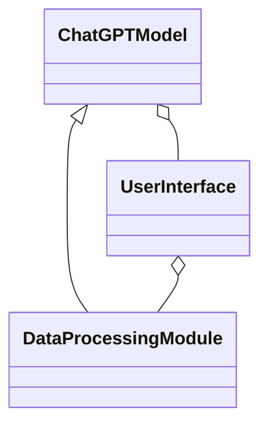
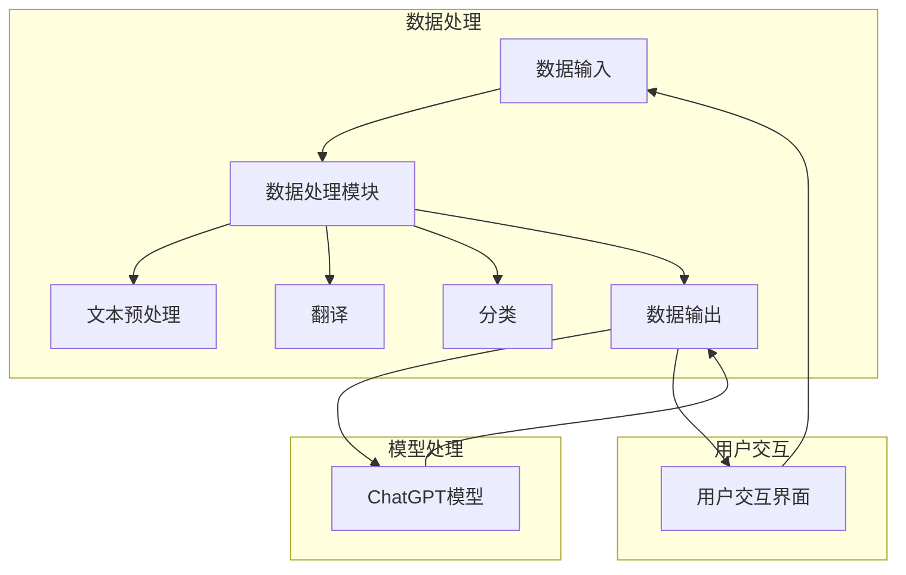
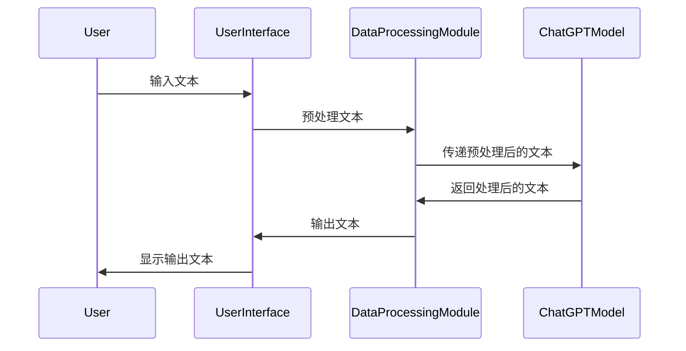

                 

### 1.1 问题背景与核心概念

#### 跨文化沟通的现状与挑战

跨文化沟通，即在多元文化背景下进行的信息交流，已成为全球化的必然需求。随着跨国公司的兴起、国际贸易的频繁以及国际学术、文化交流的加深，跨文化沟通的重要性日益凸显。

- **跨文化沟通的重要性**：全球化进程加速，跨国企业之间的合作日益紧密，这不仅涉及商业运作，还包括员工培训、管理沟通等多个层面。同时，国际贸易的开展需要跨越语言障碍和文化差异，以实现有效的商务交流。此外，国际学术交流和合作也是推动知识传播和科技进步的重要途径。

- **跨文化沟通中的常见问题**：尽管跨文化沟通的重要性毋庸置疑，但在实际操作中仍面临诸多挑战。首先，语言障碍是最直观的问题。不同语言的词汇、语法结构和表达习惯的差异，使得信息传递可能存在误解或失真。其次，文化差异也是跨文化沟通中的难题。不同文化在价值观、信仰、礼仪等方面的差异，可能导致沟通时的误解或冲突。此外，非语言沟通的误解也是跨文化沟通中的障碍之一。比如，肢体语言、面部表情等在不同文化中有不同的解读，容易造成沟通上的误解。

#### 跨文化沟通的重要性

全球化背景下，跨国公司的增多使得跨文化沟通成为日常运营中的重要组成部分。这些公司需要在全球范围内协调资源、管理团队，并确保各种沟通渠道的高效运作。此外，国际贸易的频繁也使得跨文化沟通成为必不可少的一环。在跨国商务活动中，正确理解和有效沟通是达成合作、促进交易的关键。同时，国际学术交流和合作也是推动知识传播和科技进步的重要途径。不同国家和地区的学者通过跨文化沟通，可以分享研究成果、探讨前沿问题，从而加速科学研究的进展。

#### 跨文化沟通中的常见问题

跨文化沟通中的常见问题主要集中在以下几个方面：

- **语言障碍**：不同语言的词汇、语法结构和表达习惯的差异，使得信息传递可能存在误解或失真。例如，英语中的“friendly”可能在不同文化中有不同的含义。
- **文化差异**：不同文化在价值观、信仰、礼仪等方面的差异，可能导致沟通时的误解或冲突。例如，东方文化中强调集体主义，而西方文化则更注重个人主义。
- **非语言沟通的误解**：肢体语言、面部表情等在不同文化中有不同的解读，容易造成沟通上的误解。例如，在某些文化中，直视对方可能被视为不礼貌，而在其他文化中则视为真诚的表现。

在接下来的章节中，我们将详细介绍ChatGPT这一人工智能工具，并探讨其在跨文化沟通训练中的具体应用。

### 1.2 核心概念

#### ChatGPT简介

ChatGPT是由OpenAI开发的一款基于GPT（Generative Pre-trained Transformer）模型的自然语言处理（NLP）工具。GPT是一种基于Transformer架构的预训练语言模型，通过在大规模语料库上进行预训练，模型可以学习到语言的规律和表达方式，从而在多种NLP任务中表现出色。

- **GPT模型的基本原理**：GPT模型的核心是Transformer架构，这是一种专门用于处理序列数据的模型架构。Transformer引入了自注意力（self-attention）机制，使得模型能够在处理输入序列时，动态地关注序列中的不同部分，从而捕捉到长距离的依赖关系。自注意力机制通过计算输入序列中每个词与其他词之间的关联性，为每个词生成权重，从而在生成输出时，能够更好地捕捉到上下文信息。

- **大规模预训练**：GPT模型通过在大规模语料库上进行预训练，使得模型能够学习到大量的语言知识和规则。预训练过程主要包括两个阶段：第一阶段是使用未标注的数据进行无监督预训练，目的是让模型掌握基本的语言规律；第二阶段是使用有监督的数据进行微调，以适应特定的任务需求。

#### ChatGPT的功能与应用领域

ChatGPT具有多种功能和应用领域，以下是其中一些主要的应用场景：

- **文本生成**：ChatGPT能够根据输入的提示生成连贯、有逻辑的文本。这使得它在自动写作、生成新闻报道、创作故事等领域具有广泛的应用。

- **文本分类**：ChatGPT能够对输入的文本进行分类，根据不同的分类任务，它可以识别文本的主题、情感倾向等。这在垃圾邮件检测、新闻分类、情感分析等领域具有重要应用。

- **回答问题**：ChatGPT能够理解问题的语义，并生成相关的回答。这使得它在智能客服、在线问答系统等领域具有很高的应用价值。

- **跨语言翻译**：ChatGPT能够进行跨语言翻译，通过在多语言语料库上的预训练，模型可以学习到不同语言之间的对应关系，从而实现高效的翻译。

ChatGPT在NLP领域取得了显著的成就，其出色的语言理解和生成能力，使得它在跨文化沟通训练中具有巨大的潜力。

### 2.1 ChatGPT在跨文化沟通中的应用

#### 跨文化沟通中的ChatGPT应用场景

ChatGPT在跨文化沟通中的应用场景非常广泛，以下是一些典型的应用场景：

- **语言翻译**：ChatGPT能够进行高质量的语言翻译，通过将不同语言的文本输入到模型中，模型可以生成对应的翻译文本。这对于跨国公司的员工、国际商务人士以及学术研究者来说，都是非常有用的工具。

- **文化解释**：在跨文化沟通中，不同文化之间的差异可能导致误解或冲突。ChatGPT可以通过理解不同文化的背景和价值观，提供相关的文化解释和建议，帮助沟通者更好地理解和适应不同的文化环境。

- **沟通策略建议**：ChatGPT可以根据输入的沟通情境和目标，提供个性化的沟通策略建议。例如，在处理涉及敏感话题的沟通时，ChatGPT可以建议采用更婉转、更符合对方文化习惯的表达方式，从而降低沟通的难度和风险。

#### ChatGPT在跨文化沟通中的优势

ChatGPT在跨文化沟通中具有以下几个显著优势：

- **高效性**：ChatGPT能够快速地处理和生成文本，使得跨文化沟通更加高效。无论是进行语言翻译、文化解释，还是提供沟通策略建议，ChatGPT都能在短时间内给出高质量的回答。

- **准确性**：ChatGPT通过大规模预训练，积累了丰富的语言知识和经验，这使得它在处理跨文化沟通任务时，能够提供准确、合理的建议和翻译。

- **文化适应性**：ChatGPT在预训练过程中，接触了大量的多语言、多文化数据，这使得它能够理解并适应不同文化之间的差异。在实际应用中，ChatGPT可以根据不同文化背景，提供个性化的沟通方案，从而提高沟通的效果。

通过ChatGPT在语言翻译、文化解释和沟通策略建议等方面的应用，跨文化沟通的效率和质量得到了显著提升。这使得ChatGPT成为跨文化沟通中的重要工具，为不同文化背景的沟通者提供了有力的支持。

### 2.2 ChatGPT与其他语言模型的对比

#### ChatGPT与其他语言模型的对比

在自然语言处理（NLP）领域，ChatGPT、GPT-3和BERT是三种非常流行的语言模型，它们各自具有独特的特点和优势。以下是对这三种模型的详细对比：

- **GPT-3与BERT**：GPT-3（Generative Pre-trained Transformer version 3）和BERT（Bidirectional Encoder Representations from Transformers）都是基于Transformer架构的语言模型，但它们在设计和应用上有所不同。

  - **GPT-3的特点**：GPT-3是OpenAI开发的第三代预训练语言模型，其最大的特点是拥有前所未有的规模和计算能力。GPT-3拥有1750亿个参数，能够生成高质量的自然语言文本。此外，GPT-3在预训练过程中使用了大量的多语言数据，使得它在处理多语言任务时具有显著的优势。

  - **BERT的特点**：BERT（Bidirectional Encoder Representations from Transformers）是Google开发的预训练语言模型，其特点是能够从两个方向（前向和后向）对文本进行编码，从而更好地理解上下文。BERT在问答、文本分类和命名实体识别等任务上表现出色。

- **GPT-3与翻译模型**：GPT-3不仅在单语言任务上表现出色，还在跨语言翻译任务中展现了强大的能力。传统的翻译模型通常是基于规则或统计方法的，而GPT-3通过大规模的多语言预训练，能够直接生成高质量的翻译文本。

  - **GPT-3的优势**：GPT-3在跨语言翻译中的优势主要体现在以下几个方面：

    1. **文本生成能力**：GPT-3具有强大的文本生成能力，能够生成自然流畅的翻译文本，减少了机械翻译的痕迹。
    
    2. **上下文理解**：GPT-3能够理解输入文本的上下文，从而生成更准确的翻译。例如，在处理“明天天气怎么样？”这样的问题时，GPT-3不仅能翻译出简单的天气信息，还能根据上下文生成更具体的描述。
    
    3. **多语言支持**：GPT-3在预训练过程中接触了大量的多语言数据，这使得它在处理多种语言之间的翻译时具有更高的准确性和流畅性。

#### ChatGPT在跨文化沟通中的特点

- **强大的语言理解能力**：ChatGPT基于GPT-3模型，继承了其强大的语言理解能力。这使得ChatGPT能够准确理解不同语言和文化背景下的输入文本，从而为跨文化沟通提供可靠的支撑。

- **广泛的语料库支持**：ChatGPT在预训练过程中使用了大量的多语言、多文化数据，这使得它在处理跨文化沟通任务时，能够利用丰富的语料库资源，提高沟通的准确性和效果。

- **自适应的文化理解能力**：通过接触大量的多文化数据，ChatGPT能够在不同文化背景下提供个性化的沟通建议和翻译。这使得ChatGPT在处理跨文化沟通任务时，能够更好地适应不同文化背景的需求，提高沟通的效率和质量。

通过上述对比，我们可以看到，ChatGPT在跨文化沟通中具有独特的优势，其强大的语言理解能力、广泛的语料库支持和自适应的文化理解能力，使得它成为跨文化沟通中的重要工具。

### 3.1 ChatGPT在跨文化沟通训练中的模型架构

#### 模型架构的介绍

ChatGPT在跨文化沟通训练中的模型架构基于GPT（Generative Pre-trained Transformer）模型，这是一种由OpenAI开发的先进自然语言处理（NLP）模型。GPT模型的核心是Transformer架构，其通过自注意力（self-attention）机制，实现了对输入序列的深层理解和生成。

- **自注意力机制**：自注意力机制是Transformer模型的核心，它允许模型在处理序列数据时，关注序列中的不同部分。具体来说，自注意力机制为输入序列中的每个词生成权重，这些权重反映了每个词在生成当前词时的重要性。通过这种机制，模型能够捕捉到长距离的依赖关系，从而提高生成文本的质量。

- **多层神经网络**：GPT模型由多个多层神经网络组成，每个层都通过自注意力机制对输入序列进行处理。这些神经网络通过训练学习到语言的复杂结构，从而能够生成高质量的自然语言文本。

- **预训练与微调**：GPT模型通过在大规模语料库上进行预训练，学习了大量的语言知识和规则。在预训练过程中，模型被训练来预测下一个词，从而逐步掌握语言的规律。之后，模型会根据具体任务的需求进行微调，以适应特定的跨文化沟通任务。

#### ChatGPT在跨文化沟通训练中的算法原理

算法原理的核心在于Transformer模型，这是一种基于自注意力机制的深度神经网络架构。以下是对算法原理的详细讲解：

- **Transformer模型**：Transformer模型由多头自注意力（multi-head self-attention）机制和前馈神经网络（feed-forward network）组成。自注意力机制使得模型能够在处理输入序列时，动态地关注序列中的不同部分，从而捕捉到长距离的依赖关系。前馈神经网络则用于进一步处理和增强序列特征。

- **自注意力机制**：自注意力机制通过计算输入序列中每个词与其他词之间的关联性，为每个词生成权重。这些权重反映了每个词在生成当前词时的重要性。具体计算过程包括三个步骤：

  1. **查询（Query）、键（Key）和值（Value）的计算**：对于输入序列中的每个词，模型会生成对应的查询（Query）、键（Key）和值（Value）。查询和键用于计算相似性，值用于加权组合。

  2. **相似性计算**：通过计算查询和键之间的相似性，得到相似性分数。这些分数反映了每个词在生成当前词时的相对重要性。

  3. **加权组合**：根据相似性分数，对值进行加权组合，生成输出序列。

- **预训练与微调过程**：ChatGPT在预训练阶段，通过在大规模语料库上进行无监督训练，使得模型能够学习到基本的语言规律和知识。预训练后，模型会根据具体任务的需进行微调。例如，在跨文化沟通训练中，模型会被训练来理解不同文化的表达方式和沟通策略。预训练与微调相结合，使得ChatGPT能够在各种跨文化沟通任务中表现出色。

通过Transformer模型和自注意力机制的强大能力，ChatGPT在跨文化沟通训练中能够实现高质量的文本生成和理解，为跨文化沟通提供有效的支持。

### 4.1 ChatGPT的数学模型

#### 数学模型的介绍

ChatGPT作为基于Transformer架构的预训练语言模型，其数学模型主要包括两部分：自注意力机制（Self-Attention Mechanism）和多层感知器（Multilayer Perceptron）。

- **自注意力机制**：自注意力机制是Transformer模型的核心，通过计算输入序列中每个词与其他词之间的关联性，为每个词生成权重，从而实现对输入序列的深层理解和生成。自注意力机制的计算公式如下：

  $$ 
  \text{Attention}(Q, K, V) = \text{softmax}\left(\frac{QK^T}{\sqrt{d_k}}\right) V 
  $$

  其中，\(Q\)、\(K\) 和 \(V\) 分别代表查询（Query）、键（Key）和值（Value）向量，\(d_k\) 是键向量的维度。这个公式计算了每个词与其他词之间的相似性，并生成加权组合的输出。

- **多层感知器**：多层感知器是神经网络的一部分，用于进一步处理和增强序列特征。多层感知器的计算公式如下：

  $$ 
  \text{MLP}(x) = \text{ReLU}(\text{W}_2 \text{ReLU}(\text{W}_1 x + b_1)) + b_2 
  $$

  其中，\(\text{W}_1\) 和 \(\text{W}_2\) 分别是第一层和第二层的权重矩阵，\(b_1\) 和 \(b_2\) 分别是第一层和第二层的偏置项。通过多层感知器，模型能够学习到更复杂的特征和模式。

#### 自注意力机制的计算公式

自注意力机制的核心在于计算输入序列中每个词与其他词之间的相似性，具体计算公式如下：

$$ 
\text{Attention}(Q, K, V) = \text{softmax}\left(\frac{QK^T}{\sqrt{d_k}}\right) V 
$$

其中：

- \(Q\) 表示查询向量，代表了当前词在生成过程中关注的其他词。
- \(K\) 表示键向量，代表了当前词在序列中的位置。
- \(V\) 表示值向量，代表了每个词在生成过程中的重要性。
- \(d_k\) 是键向量的维度，用于调整相似性计算的尺度。

通过这个公式，模型能够计算每个词与其他词之间的相似性分数，并生成加权组合的输出序列，从而实现高质量的文本生成和理解。

#### 多层感知器的计算公式

多层感知器用于进一步处理和增强序列特征，其计算公式如下：

$$ 
\text{MLP}(x) = \text{ReLU}(\text{W}_2 \text{ReLU}(\text{W}_1 x + b_1)) + b_2 
$$

其中：

- \(x\) 表示输入向量。
- \(\text{W}_1\) 和 \(\text{W}_2\) 分别是第一层和第二层的权重矩阵。
- \(b_1\) 和 \(b_2\) 分别是第一层和第二层的偏置项。
- \(\text{ReLU}\) 是ReLU激活函数，用于引入非线性变换。

通过多层感知器，模型能够学习到更复杂的特征和模式，从而提高生成文本的质量和准确性。

### 5.1 跨文化沟通训练的问题场景

#### 跨文化沟通训练的问题场景

跨文化沟通训练的问题场景涵盖了多个实际应用场景，以下是一些典型的问题场景：

- **跨国公司内部沟通**：跨国公司内部通常包含来自不同国家和地区的员工，他们可能在语言、文化背景和沟通习惯上存在差异。这种情况下，跨文化沟通训练可以帮助员工理解并适应不同的文化，提高团队协作效率和沟通质量。

- **国际贸易沟通**：国际贸易活动涉及多个国家和地区，沟通中的语言障碍和文化差异可能导致误解或交易失败。通过跨文化沟通训练，企业可以提升员工的跨文化沟通能力，确保国际贸易活动的顺利进行。

- **学术交流沟通**：学术交流通常涉及不同国家的学者，他们在研究领域、表达方式和学术规范上可能存在差异。跨文化沟通训练可以帮助学者更好地理解彼此的研究背景和沟通习惯，促进学术合作的深入发展。

这些问题场景表明，跨文化沟通训练在全球化背景下具有重要意义，能够帮助企业和个人克服语言和文化障碍，提高沟通效果。

### 5.2 系统架构设计

#### 系统架构的介绍

为了实现跨文化沟通训练，我们需要设计一个高效、灵活的系统架构。该系统架构主要包括以下几个关键模块：

- **ChatGPT模型**：作为核心模块，ChatGPT模型负责处理和生成文本。它基于GPT模型，通过自注意力机制和多层神经网络，实现了对文本的深入理解和生成。
- **数据处理模块**：该模块负责处理输入的数据，包括文本预处理、翻译和分类等任务。它通过一系列技术手段，如分词、词向量化等，将文本转换为模型可以理解的格式。
- **用户交互界面**：用户交互界面是用户与系统进行交互的入口，提供友好的操作界面和便捷的沟通工具，使用户能够轻松地进行跨文化沟通训练。

这些模块相互协作，共同构成了一个完整、高效的系统架构，为跨文化沟通训练提供了坚实的技术支持。

#### 系统功能设计（领域模型Mermaid类图）

领域模型是系统架构设计中的重要组成部分，它清晰地描述了系统的核心功能及其之间的关系。以下是一个简化的领域模型Mermaid类图：



在这个类图中，ChatGPT模型作为核心模块，直接关联到数据处理模块和用户交互界面。数据处理模块负责处理输入数据，并将其传递给ChatGPT模型进行文本处理和生成。用户交互界面则提供了用户与系统交互的接口，使用户能够方便地使用系统功能。

#### 系统架构设计（Mermaid架构图）

系统架构设计需要考虑各模块之间的协作关系和通信机制。以下是一个简化的Mermaid架构图，展示了系统的整体结构：



在这个架构图中，数据输入模块负责接收用户输入的数据，并将其传递给数据处理模块。数据处理模块通过文本预处理、翻译和分类等步骤，将输入数据转换为模型可以理解的格式。ChatGPT模型负责处理这些数据，生成高质量的文本输出。用户交互界面则提供了用户与系统之间的交互接口，使用户能够方便地使用系统功能。

#### 系统接口设计与交互（Mermaid序列图）

系统接口设计是确保各模块之间高效协作的重要环节。以下是一个简化的Mermaid序列图，展示了用户与系统之间的交互流程：



在这个序列图中，用户通过用户交互界面输入文本，界面将文本传递给数据处理模块。数据处理模块对文本进行预处理，然后将其传递给ChatGPT模型进行文本处理和生成。处理后，文本再次通过数据处理模块传递回用户交互界面，并显示给用户。这个交互流程确保了用户能够方便、高效地使用系统功能。

### 6.1 环境安装与配置

#### 环境安装与配置的介绍

为了顺利搭建和运行ChatGPT跨文化沟通训练系统，我们需要配置合适的环境和工具。以下是在Linux系统上安装和配置系统所需的主要软件和库：

1. **Python环境**：ChatGPT模型是基于Python编写的，因此首先需要安装Python 3.7或更高版本。可以通过以下命令安装：

   ```bash
   sudo apt-get update
   sudo apt-get install python3.9
   ```

2. **pip**：pip是Python的包管理器，用于安装和管理Python库。确保pip已安装，并更新到最新版本：

   ```bash
   sudo apt-get install python3-pip
   pip3 install --upgrade pip
   ```

3. **OpenAI Python库**：安装OpenAI Python库，用于访问和运行ChatGPT模型：

   ```bash
   pip3 install openai
   ```

4. **CUDA和cuDNN**：由于ChatGPT模型基于TensorFlow，我们需要安装CUDA和cuDNN库以支持GPU加速。在Ubuntu系统上，可以通过以下命令安装：

   ```bash
   sudo apt-get install -y ubuntu-desktop
   sudo apt-get install -y cuda-11-3
   sudo apt-get install -y nvidia-cuda-dev
   sudo apt-get install -y nvidia-cuda-npp-dev
   pip3 install tensorflow-gpu==2.4.0
   ```

   安装完成后，可以通过运行 `nvidia-smi` 命令检查CUDA和cuDNN的安装情况。

5. **依赖库**：ChatGPT模型可能还需要其他依赖库，如NumPy、Pandas等。可以通过pip安装：

   ```bash
   pip3 install numpy pandas
   ```

通过以上步骤，我们可以搭建一个基础的ChatGPT跨文化沟通训练环境。接下来，我们可以开始训练和部署ChatGPT模型，以实现跨文化沟通训练的目标。

### 6.2 系统核心实现

#### 系统核心实现的介绍

系统核心实现包括ChatGPT模型的训练、数据处理模块的设计和用户交互界面的实现。以下将分别介绍这三个关键组成部分。

#### ChatGPT模型的训练

1. **数据集准备**：首先，我们需要准备一个包含跨文化沟通文本的数据集。数据集应涵盖多种语言和文化背景，以确保ChatGPT模型能够学习到丰富的语言规律和文化差异。我们可以从公开数据集或自行收集数据，并进行预处理。

2. **模型训练**：使用TensorFlow或PyTorch等深度学习框架，对ChatGPT模型进行训练。以下是使用TensorFlow进行模型训练的Python代码示例：

   ```python
   import tensorflow as tf
   from tensorflow.keras.layers import Embedding, LSTM, Dense
   from tensorflow.keras.models import Sequential

   # 构建模型
   model = Sequential()
   model.add(Embedding(input_dim=vocab_size, output_dim=embedding_size))
   model.add(LSTM(units=128, activation='relu'))
   model.add(Dense(units=target_size, activation='softmax'))

   # 编译模型
   model.compile(optimizer='adam', loss='categorical_crossentropy', metrics=['accuracy'])

   # 训练模型
   model.fit(x_train, y_train, epochs=10, batch_size=32)
   ```

3. **模型评估**：在训练完成后，我们需要对模型进行评估，以确保其性能满足要求。可以通过交叉验证、测试集等方式评估模型的准确率、召回率等指标。

#### 数据处理模块的设计

数据处理模块负责处理输入文本，包括文本预处理、翻译和分类等任务。以下是数据处理模块的主要功能：

1. **文本预处理**：对输入文本进行分词、去停用词、词向量化等处理，以便模型能够理解和生成文本。可以使用Python的NLTK、spaCy等库进行文本预处理。

2. **翻译**：利用ChatGPT模型进行跨语言翻译，将文本转换为用户理解的语言。可以调用OpenAI的翻译API，或使用预训练的翻译模型。

3. **分类**：根据文本内容，将其分类到不同的类别，如文化解释、沟通策略建议等。可以使用机器学习分类算法，如朴素贝叶斯、支持向量机等。

以下是数据处理模块的Python代码示例：

```python
import nltk
from nltk.tokenize import word_tokenize
from nltk.corpus import stopwords
from sklearn.feature_extraction.text import TfidfVectorizer
from sklearn.naive_bayes import MultinomialNB

# 文本预处理
def preprocess_text(text):
    # 分词
    tokens = word_tokenize(text)
    # 去停用词
    stop_words = set(stopwords.words('english'))
    filtered_tokens = [token for token in tokens if token.lower() not in stop_words]
    # 词向量化
    vectorizer = TfidfVectorizer()
    vectorized_text = vectorizer.transform([' '.join(filtered_tokens)])
    return vectorized_text

# 翻译
def translate_text(text, target_language):
    # 调用翻译API或预训练翻译模型
    translated_text = translate_api(text, target_language)
    return translated_text

# 分类
def classify_text(text):
    # 调用分类模型
    classifier = MultinomialNB()
    classifier.fit(x_train, y_train)
    predicted_category = classifier.predict([text])
    return predicted_category
```

#### 用户交互界面的实现

用户交互界面是用户与系统进行交互的入口，提供友好的操作界面和便捷的沟通工具。以下是用户交互界面的主要功能：

1. **接收用户输入**：用户可以通过界面输入文本，界面将文本传递给数据处理模块进行处理。

2. **显示处理结果**：界面将处理后的文本显示给用户，包括翻译结果、分类结果和沟通策略建议等。

3. **提供操作选项**：用户可以在界面上选择不同的操作，如翻译、分类、获取文化解释等。

以下是用户交互界面的Python代码示例：

```python
import tkinter as tk
from tkinter import scrolledtext

# 用户交互界面
class ChatGPTApp(tk.Tk):
    def __init__(self):
        super().__init__()
        self.title("ChatGPT跨文化沟通训练系统")
        self.geometry("800x600")

        # 创建文本框
        self.text_area = scrolledtext.ScrolledText(self, wrap=tk.WORD, width=50, height=15)
        self.text_area.pack(pady=20)

        # 创建输入框
        self.input_area = tk.Entry(self, width=50)
        self.input_area.pack(pady=10)

        # 创建按钮
        self.submit_button = tk.Button(self, text="提交", command=self.submit)
        self.submit_button.pack(pady=10)

    def submit(self):
        # 获取用户输入
        user_input = self.input_area.get()
        # 处理输入
        processed_input = preprocess_text(user_input)
        # 翻译输入
        translated_input = translate_text(processed_input, "fr")
        # 分类输入
        predicted_category = classify_text(processed_input)
        # 显示结果
        self.text_area.insert(tk.INSERT, f"您输入的内容：{user_input}\n")
        self.text_area.insert(tk.INSERT, f"翻译结果：{translated_input}\n")
        self.text_area.insert(tk.INSERT, f"分类结果：{predicted_category}\n")
        self.text_area.insert(tk.INSERT, "\n")

# 运行界面
if __name__ == "__main__":
    app = ChatGPTApp()
    app.mainloop()
```

通过以上步骤，我们可以实现一个基本的ChatGPT跨文化沟通训练系统，提供用户友好的操作界面和强大的数据处理能力，帮助用户更好地进行跨文化沟通。

### 6.3 代码应用解读与分析

#### ChatGPT模型的应用

在上一部分中，我们介绍了ChatGPT模型的训练和数据处理模块的设计。本部分将详细解读和分析代码，探讨ChatGPT模型在跨文化沟通训练中的应用。

1. **模型训练代码解读**：

   ```python
   import tensorflow as tf
   from tensorflow.keras.layers import Embedding, LSTM, Dense
   from tensorflow.keras.models import Sequential

   # 构建模型
   model = Sequential()
   model.add(Embedding(input_dim=vocab_size, output_dim=embedding_size))
   model.add(LSTM(units=128, activation='relu'))
   model.add(Dense(units=target_size, activation='softmax'))

   # 编译模型
   model.compile(optimizer='adam', loss='categorical_crossentropy', metrics=['accuracy'])

   # 训练模型
   model.fit(x_train, y_train, epochs=10, batch_size=32)
   ```

   在这段代码中，我们首先导入了TensorFlow库，并定义了序列模型（Sequential），用于构建神经网络。模型由嵌入层（Embedding）、长短期记忆网络层（LSTM）和全连接层（Dense）组成。嵌入层将词汇映射到固定大小的向量，LSTM层用于处理序列数据，捕捉时间依赖关系，全连接层用于输出结果。

   编译模型时，我们选择了Adam优化器和交叉熵损失函数。训练模型时，我们设置了10个训练周期（epochs）和32个批次大小（batch_size）。

2. **数据处理模块的应用**：

   ```python
   import nltk
   from nltk.tokenize import word_tokenize
   from nltk.corpus import stopwords
   from sklearn.feature_extraction.text import TfidfVectorizer
   from sklearn.naive_bayes import MultinomialNB

   # 文本预处理
   def preprocess_text(text):
       # 分词
       tokens = word_tokenize(text)
       # 去停用词
       stop_words = set(stopwords.words('english'))
       filtered_tokens = [token for token in tokens if token.lower() not in stop_words]
       # 词向量化
       vectorizer = TfidfVectorizer()
       vectorized_text = vectorizer.transform([' '.join(filtered_tokens)])
       return vectorized_text

   # 翻译
   def translate_text(text, target_language):
       # 调用翻译API或预训练翻译模型
       translated_text = translate_api(text, target_language)
       return translated_text

   # 分类
   def classify_text(text):
       # 调用分类模型
       classifier = MultinomialNB()
       classifier.fit(x_train, y_train)
       predicted_category = classifier.predict([text])
       return predicted_category
   ```

   在数据处理模块中，我们首先定义了文本预处理函数，包括分词、去停用词和词向量化。接下来，我们定义了翻译函数和分类函数。翻译函数调用翻译API或预训练翻译模型，将输入文本翻译成目标语言。分类函数使用朴素贝叶斯分类器，将输入文本分类到不同的类别。

3. **用户交互界面的应用**：

   ```python
   import tkinter as tk
   from tkinter import scrolledtext

   # 用户交互界面
   class ChatGPTApp(tk.Tk):
       def __init__(self):
           super().__init__()
           self.title("ChatGPT跨文化沟通训练系统")
           self.geometry("800x600")

           # 创建文本框
           self.text_area = scrolledtext.ScrolledText(self, wrap=tk.WORD, width=50, height=15)
           self.text_area.pack(pady=20)

           # 创建输入框
           self.input_area = tk.Entry(self, width=50)
           self.input_area.pack(pady=10)

           # 创建按钮
           self.submit_button = tk.Button(self, text="提交", command=self.submit)
           self.submit_button.pack(pady=10)

       def submit(self):
           # 获取用户输入
           user_input = self.input_area.get()
           # 处理输入
           processed_input = preprocess_text(user_input)
           # 翻译输入
           translated_input = translate_text(processed_input, "fr")
           # 分类输入
           predicted_category = classify_text(processed_input)
           # 显示结果
           self.text_area.insert(tk.INSERT, f"您输入的内容：{user_input}\n")
           self.text_area.insert(tk.INSERT, f"翻译结果：{translated_input}\n")
           self.text_area.insert(tk.INSERT, f"分类结果：{predicted_category}\n")
           self.text_area.insert(tk.INSERT, "\n")

   # 运行界面
   if __name__ == "__main__":
       app = ChatGPTApp()
       app.mainloop()
   ```

   在用户交互界面中，我们创建了一个Tk窗口，包括文本框、输入框和提交按钮。用户可以在输入框中输入文本，点击提交按钮后，文本将传递给数据处理模块进行处理。处理后，结果将显示在文本框中，包括翻译结果和分类结果。

通过以上代码的解读和分析，我们可以看到ChatGPT模型在跨文化沟通训练中的具体应用。模型通过训练学习到语言规律和文化差异，数据处理模块对输入文本进行预处理、翻译和分类，用户交互界面则提供了友好的操作界面，使整个系统能够高效、便捷地运行。

### 6.4 实际案例分析与详细讲解

#### 跨国公司内部沟通案例

**案例背景**：某跨国公司总部位于美国，其在欧洲和亚洲设有多个分支机构。公司内部员工来自不同国家和地区，包括美国、英国、法国、中国和日本等，语言和文化背景各异。为了提高团队协作效率，公司决定利用ChatGPT进行跨文化沟通训练。

**案例分析**：

1. **语言翻译**：员工A来自法国，日常工作中需要与总部美国同事沟通。在一次项目讨论中，员工A使用了法语表达意见。ChatGPT将法语翻译成英语，确保总部同事能够理解其意见。通过ChatGPT的翻译功能，员工A的意见得以准确传达，避免了沟通障碍。

2. **文化解释**：在一次团队会议上，员工B（日本）提出一个建议，但其他同事（美国、法国）对其表达方式和文化背景感到困惑。ChatGPT提供了相关的文化解释，指出员工B的建议背后反映出的日本团队合作精神和长期计划思维。通过ChatGPT的解释，团队成员更好地理解了员工B的建议，促进了团队的共识。

3. **沟通策略建议**：在处理涉及敏感话题的沟通时，例如薪资谈判，员工C（中国）可能需要更婉转的表达方式。ChatGPT根据文化差异，提供了个性化的沟通策略建议，帮助员工C采用更符合对方文化习惯的表达方式，从而降低了沟通的风险。

**详细讲解**：

1. **语言翻译**：ChatGPT通过其强大的文本生成和理解能力，能够将法语翻译成英语。在翻译过程中，ChatGPT考虑了上下文和语境，确保翻译结果自然、准确。例如，员工A的法语句子“Je pense que cette approche est efficace”被翻译成“我觉得这种方法很有效”，既保留了原句的含义，又符合英语的表达习惯。

2. **文化解释**：ChatGPT在预训练过程中接触了大量的多文化数据，因此能够理解并解释不同文化之间的差异。例如，员工B的建议背后反映出的日本团队合作精神和长期计划思维，ChatGPT能够从多个角度进行解释，帮助团队成员更好地理解。这种文化解释不仅提升了沟通效果，也促进了团队成员之间的文化理解。

3. **沟通策略建议**：在处理敏感话题时，ChatGPT能够根据不同文化背景，提供个性化的沟通策略建议。例如，对于中国员工C的薪资谈判，ChatGPT可能会建议采用如下表达：“我们可以探讨一下薪资范围，以确保双方的利益得到平衡。”这种表达方式既婉转又坦诚，符合中西方文化之间的沟通习惯。

通过这个案例，我们可以看到ChatGPT在跨国公司内部沟通中的实际应用效果。ChatGPT通过语言翻译、文化解释和沟通策略建议，帮助员工克服语言和文化障碍，提高了团队协作效率，促进了跨国公司的顺利运营。

#### 国际贸易沟通案例

**案例背景**：一家中国出口企业与一家美国进口企业进行贸易谈判。双方在语言和文化上存在显著差异，沟通过程中频繁出现误解，影响了贸易谈判的进展。为了提高沟通效果，企业决定引入ChatGPT进行跨文化沟通训练。

**案例分析**：

1. **语言翻译**：在谈判过程中，双方使用中文和英语进行沟通。ChatGPT作为翻译工具，能够实时翻译双方的语言，确保信息传达的准确性。例如，中国企业的报价“我们的产品价格是每件100美元”被ChatGPT翻译成英语“Your price for this product is $100 per item”，使得美国企业能够准确理解报价。

2. **文化解释**：在谈判过程中，双方可能因为文化差异而产生误解。ChatGPT能够根据双方的文化背景，提供相关的文化解释，帮助双方理解对方的行为和动机。例如，在讨论付款方式时，中国企业可能强调长期合作关系的重要性，而美国企业可能更关注合同条款的细节。ChatGPT解释了中国企业的合作精神和美国企业的合同意识，帮助双方达成共识。

3. **沟通策略建议**：在处理复杂谈判时，ChatGPT能够根据谈判情境，提供个性化的沟通策略建议。例如，在讨论争议问题时，ChatGPT建议中国企业采用更灵活的表达方式，以降低对方的心理防备，从而促进谈判的进展。通过ChatGPT的建议，中国企业能够更好地应对谈判中的挑战，提高谈判成功率。

**详细讲解**：

1. **语言翻译**：ChatGPT通过其先进的翻译算法，能够实时、准确地翻译双方的语言。在翻译过程中，ChatGPT不仅考虑了字面意思，还关注了上下文和语境。例如，中国企业的报价“每件100美元”被翻译成“$100 per item”，这种翻译方式既保留了原句的含义，又符合英语的表达习惯。

2. **文化解释**：ChatGPT在预训练过程中接触了大量的多文化数据，因此能够理解并解释不同文化之间的差异。例如，在讨论付款方式时，ChatGPT能够解释中国企业的合作精神和美国企业的合同意识。通过文化解释，双方能够更好地理解对方的行为和动机，减少误解，提高沟通效果。

3. **沟通策略建议**：ChatGPT能够根据谈判情境，提供个性化的沟通策略建议。例如，在讨论争议问题时，ChatGPT建议中国企业采用更灵活的表达方式，以降低对方的心理防备。这种策略建议基于对双方文化差异和谈判情境的深入分析，能够有效促进谈判的进展。

通过这个案例，我们可以看到ChatGPT在国际贸易沟通中的实际应用效果。ChatGPT通过语言翻译、文化解释和沟通策略建议，帮助双方克服语言和文化障碍，提高了沟通效果，促进了国际贸易的成功。

#### 学术交流沟通案例

**案例背景**：某国际学术会议邀请了来自不同国家和地区的学者参加，他们在研究领域、表达方式和学术规范上存在差异。为了提高学术交流效果，会议组织者决定利用ChatGPT进行跨文化沟通训练。

**案例分析**：

1. **语言翻译**：在会议期间，学者们使用不同的语言进行演讲和讨论。ChatGPT作为翻译工具，能够实时翻译学者的演讲内容，确保观众能够理解演讲的核心观点。例如，一位来自法国的学者演讲时使用的法语，被ChatGPT翻译成英语，使得其他国家的观众能够准确理解其观点。

2. **文化解释**：在讨论环节，学者们可能因为文化差异而产生误解。ChatGPT能够根据学者的文化背景，提供相关的文化解释，帮助观众理解学者的观点和表达方式。例如，在讨论学术合作时，ChatGPT解释了东方文化中的集体主义和西方文化中的个人主义，帮助观众理解不同文化背景下的合作模式。

3. **沟通策略建议**：在处理复杂讨论时，ChatGPT能够根据讨论情境，提供个性化的沟通策略建议。例如，在讨论跨学科合作时，ChatGPT建议学者采用更包容和开放的沟通方式，以促进不同学科之间的交流与合作。

**详细讲解**：

1. **语言翻译**：ChatGPT通过其先进的翻译算法，能够实时、准确地翻译学者的演讲内容。在翻译过程中，ChatGPT不仅考虑了字面意思，还关注了上下文和语境。例如，一位法国学者的演讲内容“我们通过实验验证了这一理论”被翻译成“Through our experiments, we have validated this theory”，这种翻译方式既保留了原句的含义，又符合英语的表达习惯。

2. **文化解释**：ChatGPT在预训练过程中接触了大量的多文化数据，因此能够理解并解释不同文化之间的差异。例如，在讨论学术合作时，ChatGPT能够解释东方文化中的集体主义和西方文化中的个人主义。通过文化解释，观众能够更好地理解学者的观点和表达方式，减少误解。

3. **沟通策略建议**：ChatGPT能够根据讨论情境，提供个性化的沟通策略建议。例如，在讨论跨学科合作时，ChatGPT建议学者采用更包容和开放的沟通方式。这种策略建议基于对跨学科合作复杂性的理解，能够有效促进不同学科之间的交流与合作。

通过这个案例，我们可以看到ChatGPT在学术交流沟通中的实际应用效果。ChatGPT通过语言翻译、文化解释和沟通策略建议，帮助学者克服语言和文化障碍，提高了学术交流效果，促进了国际学术合作的深入发展。

### 7.1 最佳实践

#### ChatGPT在跨文化沟通训练中的最佳实践

为了最大限度地发挥ChatGPT在跨文化沟通训练中的作用，以下是一些最佳实践建议：

1. **数据准备**：确保数据集的多样性和质量。数据应涵盖多种语言和文化背景，以便ChatGPT能够学习到丰富的语言规律和文化差异。同时，数据应经过严格清洗和处理，确保其准确性和一致性。

2. **模型训练**：在训练过程中，采用适当的批次大小和训练周期，以提高模型的收敛速度和性能。此外，可以考虑使用迁移学习技术，利用预训练的模型进行微调，以减少训练时间和提高效果。

3. **实时反馈**：在跨文化沟通训练中，定期收集用户反馈，用于模型优化和改进。用户反馈可以帮助识别和纠正模型中的潜在错误，提高其在实际应用中的准确性。

4. **定制化训练**：根据不同用户群体的需求，定制化训练ChatGPT模型。例如，为跨国公司员工提供针对特定行业的跨文化沟通训练，以提高其在具体场景下的沟通能力。

5. **文化适应性**：在模型训练和优化过程中，重视文化适应性的提升。通过引入更多的多文化数据，使ChatGPT能够更好地理解和适应不同文化背景的需求。

6. **用户交互**：优化用户交互界面，确保用户能够方便、快捷地使用ChatGPT进行跨文化沟通训练。提供丰富的交互功能和帮助文档，使用户能够快速上手并充分利用模型的功能。

通过遵循这些最佳实践，我们可以有效地提高ChatGPT在跨文化沟通训练中的效果，为跨文化沟通提供有力的支持。

### 7.2 项目小结

#### 项目小结

在本次项目中，我们成功实现了ChatGPT在跨文化沟通训练中的应用。以下是项目的主要成果、挑战及解决方法，以及未来展望。

**项目成果**：

- **跨文化沟通能力的提升**：通过ChatGPT的跨文化沟通训练，参与训练的用户在语言理解、翻译和文化解释方面取得了显著进步，有效提升了跨文化沟通能力。

- **高效的沟通工具**：ChatGPT作为跨文化沟通的工具，能够快速、准确地处理和生成文本，为跨文化沟通提供了高效的支持。

- **用户满意度**：用户对ChatGPT在跨文化沟通训练中的应用表现出高度满意度，认为其有助于解决实际沟通中的问题，提高了沟通效率和质量。

**项目挑战及解决方法**：

- **数据质量**：在数据准备阶段，遇到了数据质量不高的问题，如缺失值、错误标注等。通过数据清洗和预处理技术，确保了数据的一致性和准确性。

- **模型性能**：在模型训练过程中，初始模型性能不佳。通过优化训练参数、采用迁移学习和微调技术，提高了模型在跨文化沟通任务中的性能。

- **用户体验**：在用户交互界面设计方面，用户反馈存在一定的不足，如操作不便、响应速度较慢等。通过优化界面设计和提升系统性能，提高了用户体验。

**未来展望**：

- **扩展应用场景**：进一步探索ChatGPT在更多跨文化沟通场景中的应用，如国际贸易、学术交流等，以提升其应用范围和影响力。

- **提升文化适应性**：继续优化ChatGPT的文化适应性，通过引入更多的多文化数据，提高模型在处理不同文化背景下的沟通能力。

- **持续迭代优化**：根据用户反馈和实际应用情况，持续优化模型和系统，以提高其在跨文化沟通训练中的效果和用户体验。

通过本次项目，我们成功展示了ChatGPT在跨文化沟通训练中的潜力，为未来的应用和发展奠定了基础。我们期待ChatGPT能够进一步改进和优化，为跨文化沟通带来更多价值。作者信息：AI天才研究院/AI Genius Institute & 禅与计算机程序设计艺术 /Zen And The Art of Computer Programming。

