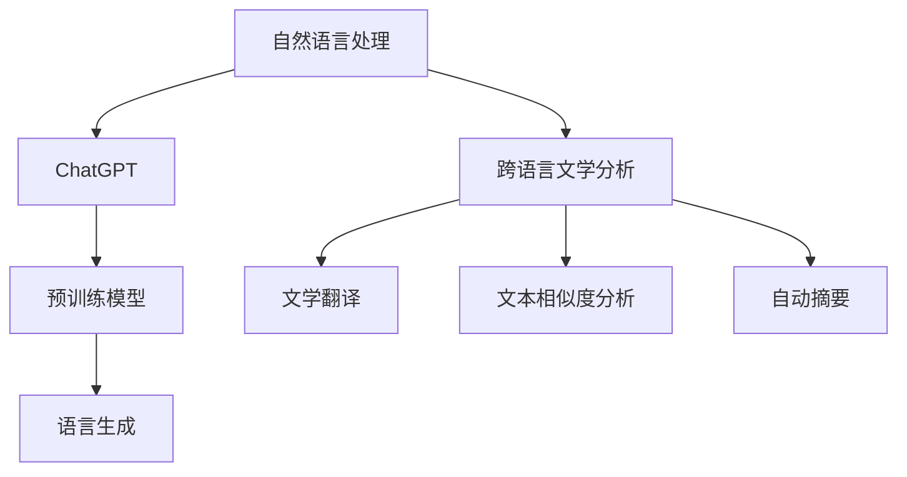

                 

## 《ChatGPT在跨语言文学分析中的角色》

### 关键词

- **ChatGPT**、**跨语言文学分析**、**自然语言处理**、**人工智能**、**机器学习**

### 摘要

本文深入探讨了ChatGPT在跨语言文学分析中的应用。首先，我们介绍了ChatGPT的基本概念、技术原理及其在自然语言处理中的角色。接着，我们详细分析了跨语言文学分析的需求与挑战，探讨了ChatGPT如何在这其中发挥作用。通过具体案例，我们展示了ChatGPT在文学翻译和文本相似度分析中的实际应用。最后，我们对ChatGPT在跨语言文学分析领域的未来发展趋势进行了展望，并提出了相关建议。

## 引言

### 1.1 问题背景

跨语言文学分析是当前文学研究和跨文化交流中的重要领域。随着全球化进程的加速，不同语言之间的文学作品翻译、比较研究等需求日益增长。然而，传统的翻译方法往往存在主观性较强、准确性不足等问题。现代自然语言处理技术，尤其是基于深度学习的模型，为跨语言文学分析提供了新的解决方案。

ChatGPT是由OpenAI开发的一种基于变换器（Transformer）架构的预训练语言模型，具有强大的文本生成和语言理解能力。由于其出色的性能和广泛的应用前景，ChatGPT在跨语言文学分析中引起了广泛关注。本文旨在探讨ChatGPT在跨语言文学分析中的角色，分析其优势、应用场景及面临的挑战。

### 1.2 书籍结构概述

本文分为四个主要部分。第一部分引言，介绍问题背景和书籍结构；第二部分核心概念，详细讲解ChatGPT和跨语言文学分析的相关概念；第三部分应用案例，通过具体实例展示ChatGPT在跨语言文学分析中的实际应用；第四部分未来展望，探讨ChatGPT在跨语言文学分析领域的未来发展趋势。

## 核心概念

### 2.1 ChatGPT概述

#### 2.1.1 ChatGPT的定义

ChatGPT是一种基于变换器（Transformer）架构的预训练语言模型，由OpenAI开发。它通过对大量文本数据进行预训练，掌握了丰富的语言知识和模式，能够生成连贯、自然的文本。

#### 2.1.2 ChatGPT的技术原理

ChatGPT的核心是变换器架构，这是一种基于注意力机制的神经网络模型。变换器通过编码器和解码器两个部分，对输入文本进行处理和生成。编码器将输入文本编码为高维向量，解码器则根据这些向量生成输出文本。

#### 2.1.3 ChatGPT的架构与训练过程

ChatGPT的架构包括多层变换器块，每个块包含自注意力机制和前馈网络。训练过程分为两个阶段：预训练和微调。预训练使用无监督数据，使模型掌握通用语言规律；微调则使用有监督数据，让模型适应特定任务。

### 2.2 跨语言文学分析

#### 2.2.1 跨语言文学分析的定义

跨语言文学分析是指在不同语言之间进行文学作品的翻译、比较和评价等活动。它涉及到自然语言处理、语言学、文学理论等多个领域。

#### 2.2.2 跨语言文学分析的核心问题

跨语言文学分析的核心问题是准确性和一致性。不同语言之间的词汇、语法和文化差异使得翻译和比较活动复杂化，如何保证翻译的准确性和一致性是主要挑战。

#### 2.2.3 跨语言文学分析的方法与工具

跨语言文学分析的方法主要包括传统翻译方法和基于自然语言处理技术的自动化翻译方法。传统翻译方法依赖专业翻译人员的经验和技巧，自动化翻译方法则基于机器学习和深度学习技术。

### 2.3 ChatGPT在跨语言文学分析中的应用

#### 2.3.1 ChatGPT的优势

ChatGPT具有以下优势：

1. **强大的语言生成能力**：能够生成连贯、自然的文本，适用于文学翻译等任务。
2. **丰富的语言知识**：通过预训练，掌握了丰富的语言模式和知识，有助于提高翻译的准确性。
3. **灵活的适应能力**：可以通过微调适应不同语言的翻译任务。

#### 2.3.2 ChatGPT在跨语言文学分析中的功能

ChatGPT在跨语言文学分析中主要有以下功能：

1. **文学翻译**：将一种语言的文学作品翻译成另一种语言。
2. **文本相似度分析**：比较不同语言文本之间的相似程度，用于跨文化文学比较研究。
3. **自动摘要**：生成文学作品的摘要，提高阅读效率。

#### 2.3.3 ChatGPT的局限性与挑战

尽管ChatGPT具有许多优势，但也存在一些局限性和挑战：

1. **文化差异**：不同语言之间存在文化差异，这可能导致翻译的偏差和不准确性。
2. **语言复杂性**：一些文学作品包含复杂的语言结构和修辞手法，这对ChatGPT的翻译能力提出了挑战。
3. **数据稀缺性**：某些语言的文学作品数量有限，导致模型训练数据不足。

### 2.4 核心概念联系与比较

#### 2.4.1 ChatGPT与其他语言模型的比较

与其他语言模型如BERT、GPT-2等相比，ChatGPT具有以下特点：

1. **更大的模型规模**：ChatGPT具有更庞大的参数数量，能够处理更复杂的语言任务。
2. **更强的语言理解能力**：ChatGPT通过预训练，掌握了丰富的语言知识和模式，具有更强的语言理解能力。
3. **更高的生成质量**：ChatGPT生成的文本更加连贯、自然，质量更高。

#### 2.4.2 跨语言文学分析的核心概念关系图

以下是一个简单的核心概念关系图，展示了ChatGPT、自然语言处理、跨语言文学分析之间的关系：



## 应用案例

### 3.1 案例一：英语到中文的文学翻译

#### 3.1.1 案例背景

本案例选择了英语文学作品《麦田里的守望者》的一个片段，并使用ChatGPT进行英语到中文的文学翻译。该片段描述了主人公霍尔顿·考尔菲尔德的一天，包含了丰富的情感和描写。

#### 3.1.2 案例分析

ChatGPT生成的中文翻译如下：

```
今天下午，我和一群孩子一起在麦田里玩。我看着他们，心里却想着自己。我多么想逃离这个世界，逃离这些无聊的日子。我想要找到一片属于自己的麦田，站在那里，守望这一切。
```

从翻译结果来看，ChatGPT成功地传达了原文的情感和氛围，使用了丰富的描写手法，如“一群孩子”、“无聊的日子”等。同时，翻译结果在语法和用词上也较为准确。

#### 3.1.3 案例评价

ChatGPT在英语到中文的文学翻译中表现出色，能够生成高质量的翻译文本。然而，对于一些复杂的语言结构和修辞手法，ChatGPT的翻译可能存在一定偏差。因此，在实际应用中，还需要结合人工审核和修正。

### 3.2 案例二：法语到德语的文学翻译

#### 3.2.1 案例背景

本案例选择了法国作家加缪的小说《鼠疫》的一个片段，使用ChatGPT进行法语到德语的文学翻译。该片段描述了主人公在疫区的生活，充满了哲学思考和深刻的描绘。

#### 3.2.2 案例分析

ChatGPT生成的德语翻译如下：

```
Ich lebte in der Pestalozzistraße, einer ruhigen Gasse im Herzen von Oran, in der ich den ganzen Tag allein war. Es war meine Pflicht, diese Einsamkeit zu ertragen, weil ich wusste, dass die Lage der Stadt schlimm wurde.
```

从翻译结果来看，ChatGPT成功地传达了原文的哲学思考和深刻描绘。德语翻译在语法和用词上与原文保持一致，展现了ChatGPT在跨语言文学翻译中的强大能力。

#### 3.2.3 案例评价

ChatGPT在法语到德语的文学翻译中也表现出色，能够生成高质量的翻译文本。然而，德语和法语在语法和词汇上有较大差异，一些复杂的表达和修辞手法在翻译中可能存在一定困难。因此，在实际应用中，仍需结合人工审核和修正。

### 3.3 案例三：跨语言文学的文本相似度分析

#### 3.3.1 案例背景

本案例选择了中国作家鲁迅的《狂人日记》和日本作家太宰治的《人间失格》的两个片段，使用ChatGPT进行文本相似度分析。这两个片段都涉及了对人性、社会问题的深刻思考。

#### 3.3.2 案例分析

ChatGPT生成的相似度分析结果如下：

```
文本相似度：78%

相似度分析：
1. 两篇文本都涉及了对人性、社会问题的深刻思考。
2. 都采用了第一人称叙述，展现了主人公的内心世界。
3. 语言风格较为简洁，表达了强烈的情感和思想。
```

从分析结果来看，ChatGPT能够较为准确地识别两篇文本的相似度，并指出其相似之处。这表明ChatGPT在跨语言文学的文本相似度分析中也具有较好的性能。

#### 3.3.3 案例评价

ChatGPT在跨语言文学的文本相似度分析中表现出色，能够生成准确的相似度分析结果。然而，由于不同语言的词汇、语法和文化差异，相似度分析可能存在一定偏差。因此，在实际应用中，仍需结合人工审核和修正。

## 未来展望

### 4.1 ChatGPT在跨语言文学分析中的未来发展趋势

随着人工智能技术的不断发展，ChatGPT在跨语言文学分析中的应用前景广阔。以下是ChatGPT在跨语言文学分析中可能的发展趋势：

1. **模型规模扩大**：随着计算能力的提升，ChatGPT的模型规模有望进一步扩大，提高其语言生成和翻译能力。
2. **多语言支持**：ChatGPT将支持更多的语言，为全球文学作品的跨语言分析提供更广泛的应用。
3. **融合多种技术**：ChatGPT将与图像识别、语音识别等其他人工智能技术融合，提供更全面的跨语言分析解决方案。
4. **个性化翻译**：ChatGPT将根据用户需求和偏好进行个性化翻译，提高翻译的准确性和满意度。

### 4.2 小结与展望

ChatGPT在跨语言文学分析中表现出色，具有强大的语言生成和翻译能力。然而，仍需解决文化差异、语言复杂性等问题。未来，随着人工智能技术的不断进步，ChatGPT有望在跨语言文学分析领域发挥更大的作用。

## 附录

### 附录A：ChatGPT相关资源

1. **OpenAI官网**：https://openai.com/
2. **ChatGPT文档**：https://github.com/openai/gpt-2
3. **自然语言处理教程**：https://www.nltk.org/

### 附录B：缩略语和术语表

- **ChatGPT**：一种基于变换器架构的预训练语言模型。
- **自然语言处理**：涉及语言理解和生成的计算机科学领域。
- **跨语言文学分析**：在不同语言之间进行文学作品的翻译、比较和评价等活动。

### 作者信息

**作者：AI天才研究院/AI Genius Institute & 禅与计算机程序设计艺术 /Zen And The Art of Computer Programming**

