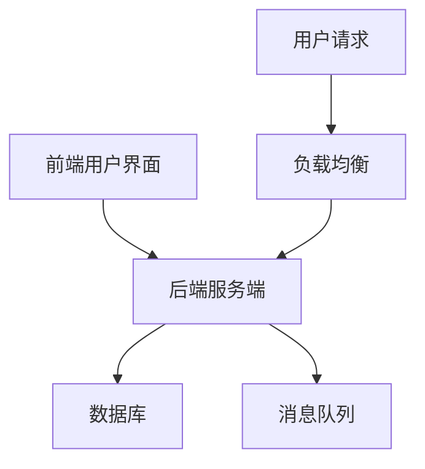
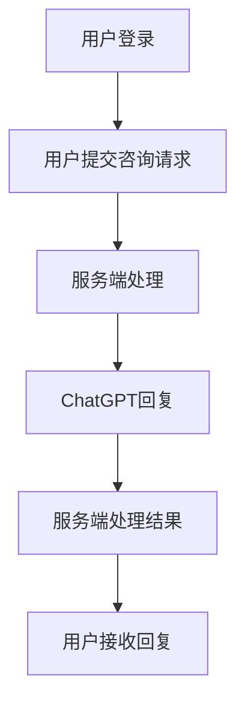
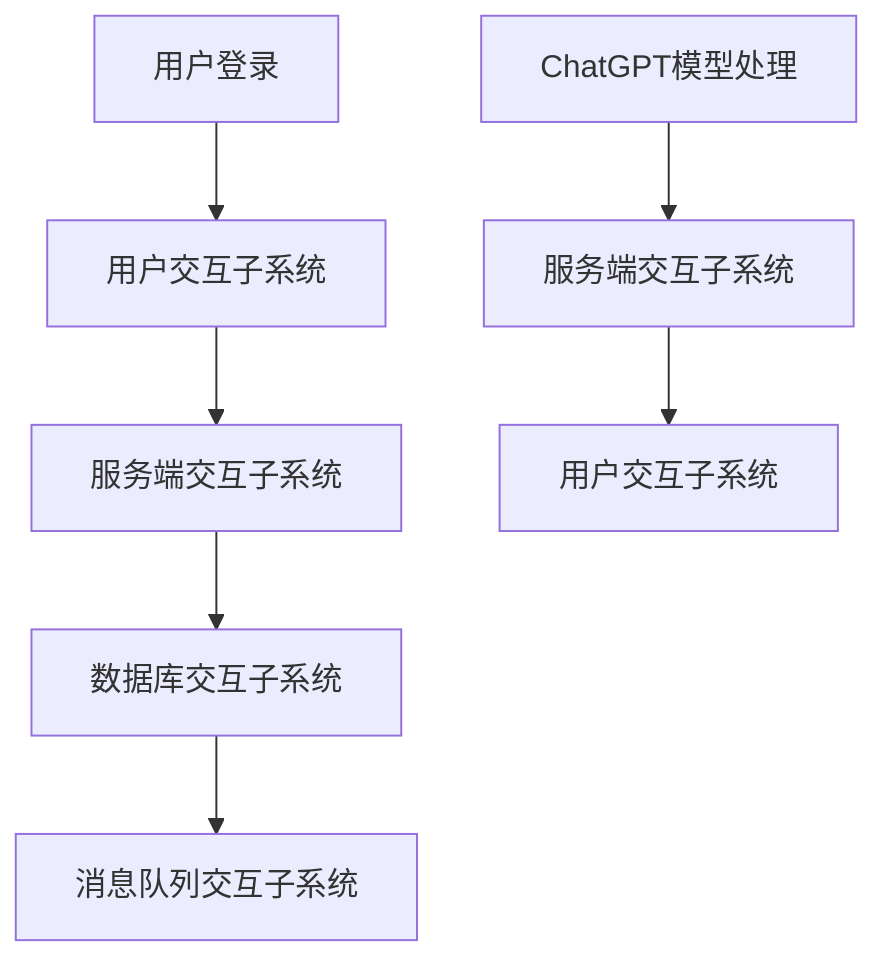
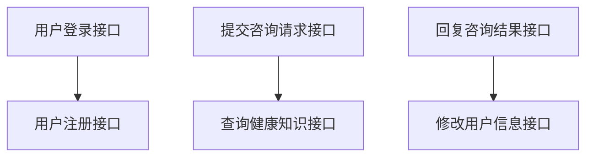
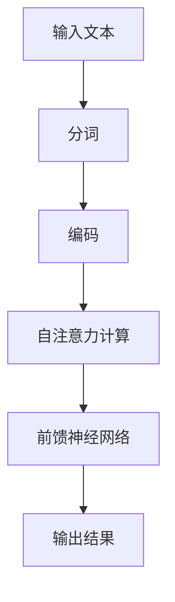

                 


### 《ChatGPT在远程医疗咨询中的应用》

> 关键词：远程医疗、ChatGPT、人工智能、自然语言处理、医疗咨询

> 摘要：本文旨在探讨ChatGPT在远程医疗咨询中的应用，通过对ChatGPT的基本原理、系统设计与实现、数学模型与算法、项目实战、最佳实践与优化等方面的详细分析，为推动远程医疗咨询领域的发展提供有力支持。

---

# 引言

## 1.1 远程医疗咨询的现状

远程医疗咨询作为一种新型的医疗服务模式，正在全球范围内迅速发展。随着互联网技术的不断进步和智能设备的普及，越来越多的患者选择通过网络进行咨询和诊断。远程医疗咨询具有便捷性、高效性和低成本等优点，但同时也面临着诸多挑战，如医生资源分配不均、医疗数据隐私保护、医疗质量保障等问题。

### 1.2 ChatGPT的基本概念

ChatGPT是由OpenAI开发的一种基于Transformer模型的自然语言处理（NLP）技术。它通过深度学习算法对海量文本数据进行分析和生成，能够模拟人类的对话过程，提供智能化的咨询和服务。

### 1.3 ChatGPT在医疗咨询领域的潜力

ChatGPT在医疗咨询领域具有巨大潜力。首先，它能够快速响应用户的咨询请求，提供专业的医疗知识。其次，ChatGPT可以协助医生进行初步诊断，减轻医生的负担。此外，ChatGPT还可以用于患者教育，提高患者的健康素养。

### 1.4 本书结构

本书分为八个章节，分别从ChatGPT的基本原理、远程医疗咨询需求分析、系统设计与实现、数学模型与算法、项目实战、最佳实践与优化等方面进行深入探讨。通过本书的阅读，读者可以全面了解ChatGPT在远程医疗咨询中的应用，为相关领域的研究和实践提供参考。

---

# 目录大纲

## 第1章：背景与概述
- 1.1 远程医疗咨询的现状
- 1.2 ChatGPT的基本概念
- 1.3 ChatGPT在医疗咨询领域的潜力
- 1.4 本书结构

## 第2章：ChatGPT原理
- 2.1 自然语言处理基础
- 2.2 ChatGPT的工作机制
- 2.3 ChatGPT的优势与局限性

## 第3章：远程医疗咨询需求分析
- 3.1 远程医疗咨询的需求
- 3.2 ChatGPT在医疗咨询中的应用方向
- 3.3 需求分析与解决方案

## 第4章：系统设计与实现
- 4.1 系统架构设计
- 4.2 用户交互流程
- 4.3 数据收集与处理方法

## 第5章：数学模型与算法原理
- 5.1 语言模型与概率分布
- 5.2 Transformer模型
- 5.3 数学模型与算法实现

## 第6章：项目实战
- 6.1 环境安装
- 6.2 系统核心实现
- 6.3 代码应用解读与分析
- 6.4 实际案例分析和详细讲解剖析
- 6.5 项目小结

## 第7章：最佳实践与优化
- 7.1 最佳实践策略
- 7.2 性能优化方法
- 7.3 安全性问题与解决方案

## 第8章：总结与未来展望
- 8.1 总结
- 8.2 未来展望

---

### 第1章：背景与概述

#### 1.1 远程医疗咨询的现状

远程医疗咨询作为一种新兴的医疗模式，正在全球范围内迅速发展。随着互联网技术的不断进步，远程医疗咨询已经成为患者获取医疗信息和服务的便捷途径。根据《2022年中国远程医疗行业发展报告》，我国远程医疗市场规模已经达到数百亿元，并且未来仍有较大的增长空间。

然而，远程医疗咨询也面临着一些挑战。首先，医生资源分配不均，部分偏远地区和基层医疗机构缺乏足够的医生资源。其次，医疗数据隐私保护问题亟待解决，如何在保证患者隐私的前提下进行数据共享和利用，成为远程医疗咨询发展的关键问题。此外，医疗质量保障也是远程医疗咨询需要关注的重要方面，如何确保远程咨询的医疗服务质量，提高患者的满意度，是远程医疗咨询需要解决的核心问题。

#### 1.2 ChatGPT的基本概念

ChatGPT是由OpenAI开发的一种基于Transformer模型的自然语言处理（NLP）技术。它通过深度学习算法对海量文本数据进行分析和生成，能够模拟人类的对话过程，提供智能化的咨询和服务。ChatGPT的核心特点包括：

1. **自适应性**：ChatGPT能够根据用户的输入自动调整回答的内容和风格，使得对话更加自然和流畅。
2. **多语言支持**：ChatGPT支持多种语言，能够与来自不同国家的用户进行交流。
3. **灵活性**：ChatGPT不仅能够进行简单的问答，还能够进行复杂对话，提供更为深入和个性化的服务。

#### 1.3 ChatGPT在医疗咨询领域的潜力

ChatGPT在医疗咨询领域具有巨大的潜力。首先，ChatGPT能够快速响应用户的咨询请求，提供专业的医疗知识。对于一些常见疾病和症状，ChatGPT可以给出初步的诊断建议，帮助用户了解自己的身体状况。其次，ChatGPT可以协助医生进行初步诊断，减轻医生的负担。医生可以利用ChatGPT提供的诊断建议进行参考，从而提高诊断的准确性和效率。此外，ChatGPT还可以用于患者教育，提高患者的健康素养。通过ChatGPT提供的健康教育材料，患者可以更好地了解疾病预防、治疗和康复知识，从而改善生活质量。

#### 1.4 本书结构

本书分为八个章节，分别从ChatGPT的基本原理、远程医疗咨询需求分析、系统设计与实现、数学模型与算法、项目实战、最佳实践与优化等方面进行深入探讨。通过本书的阅读，读者可以全面了解ChatGPT在远程医疗咨询中的应用，为相关领域的研究和实践提供参考。

- **第1章：背景与概述**：介绍远程医疗咨询的现状与挑战，引出ChatGPT在医疗咨询领域的潜力。
- **第2章：ChatGPT原理**：详细讨论ChatGPT的基本概念和工作机制。
- **第3章：远程医疗咨询需求分析**：分析远程医疗咨询的需求和痛点，讨论ChatGPT如何满足这些需求。
- **第4章：系统设计与实现**：描述系统架构设计、用户交互流程和数据收集与处理方法。
- **第5章：数学模型与算法原理**：介绍与ChatGPT相关的数学模型和算法原理。
- **第6章：项目实战**：提供实际应用案例，分析系统架构和实现细节。
- **第7章：最佳实践与优化**：提供优化ChatGPT应用的最佳实践。
- **第8章：总结与未来展望**：总结本书的主要内容和成果，展望ChatGPT在远程医疗咨询领域的未来发展。

---

## 第2章：ChatGPT原理

### 2.1 自然语言处理基础

自然语言处理（NLP）是计算机科学和人工智能领域的一个重要分支，旨在使计算机能够理解、生成和处理人类自然语言。NLP的研究内容涵盖语言模型、语义理解、语音识别、机器翻译等多个方面。语言模型是NLP的核心，它通过统计和学习大量语言数据，模拟人类的语言表达和交互方式。

### 2.2 ChatGPT的工作机制

ChatGPT是基于Transformer模型构建的，Transformer模型是一种基于自注意力机制的深度神经网络，它能够在处理长文本时保持有效的信息传递。ChatGPT的工作机制可以分为以下几个步骤：

1. **输入预处理**：ChatGPT接收用户的输入文本，并进行预处理，包括分词、去停用词、词性标注等。
2. **编码**：将预处理后的文本转换为编码表示，这一步骤通常使用嵌入层（Embedding Layer）完成。
3. **自注意力机制**：通过自注意力机制（Self-Attention Mechanism），模型能够在处理每个单词时考虑到其他所有单词的信息，从而更好地理解上下文。
4. **解码**：模型根据编码后的输入，生成输出文本。解码过程通常使用解码器（Decoder）实现，解码器通过预测下一个单词的概率分布来生成文本。

### 2.3 ChatGPT的优势与局限性

ChatGPT在医疗咨询领域具有显著的优势。首先，它能够快速响应用户咨询，提供实时、专业的医疗知识。其次，ChatGPT可以处理多种语言，支持多语言用户进行咨询。此外，ChatGPT具有很好的扩展性，可以集成到各种医疗系统中，为用户提供个性化的服务。

然而，ChatGPT也存在一些局限性。首先，由于模型是基于大量文本数据训练的，因此它可能无法处理一些新颖或特定的医疗问题。其次，ChatGPT的输出结果可能受到训练数据偏差的影响，导致答案不够准确或具有偏见。最后，ChatGPT在处理复杂医疗问题时，可能无法替代专业医生的诊断和治疗建议。

### 2.4 实际应用中的注意事项

在实际应用中，使用ChatGPT进行远程医疗咨询时，需要考虑以下几点：

1. **数据安全**：确保用户隐私和数据安全，遵循相关法律法规，避免数据泄露。
2. **准确性**：尽可能提供准确、可靠的医疗知识，减少错误信息的传播。
3. **监管**：在医疗咨询过程中，遵守医疗监管规定，确保医疗服务的合法性和合规性。
4. **用户反馈**：收集用户反馈，不断优化模型性能和用户体验。

---

## 第3章：远程医疗咨询需求分析

### 3.1 远程医疗咨询的需求

远程医疗咨询的需求主要来源于以下几个方面：

1. **患者需求**：患者希望能够随时随地获取医疗咨询和服务，尤其是对于偏远地区和行动不便的患者，远程医疗咨询提供了极大的便利。
2. **医生需求**：医生希望能够提高工作效率，减轻工作负担。通过远程医疗咨询，医生可以快速处理患者的初步咨询，将复杂问题留给专业医生进行诊断。
3. **医疗机构需求**：医疗机构希望能够提高服务质量和患者满意度，通过远程医疗咨询，可以更好地满足患者的多样化需求。

### 3.2 ChatGPT在医疗咨询中的应用方向

ChatGPT在医疗咨询领域具有广泛的应用方向：

1. **初步诊断**：ChatGPT可以根据患者的症状和病史，提供初步的诊断建议。这有助于患者及时了解自己的健康状况，并决定是否需要进一步就诊。
2. **患者教育**：ChatGPT可以提供个性化的健康教育材料，帮助患者了解疾病的预防、治疗和康复知识，提高患者的健康素养。
3. **医疗咨询**：ChatGPT可以作为医生助理，协助医生进行复杂病例的分析和诊断，提供辅助决策支持。

### 3.3 需求分析与解决方案

为了满足远程医疗咨询的需求，我们需要从以下几个方面进行需求分析：

1. **用户交互设计**：设计简洁、直观的用户界面，使用户能够方便地提交咨询请求和接收回复。
2. **知识库构建**：构建丰富的医疗知识库，包括疾病症状、治疗方法、健康知识等，确保ChatGPT能够提供准确、可靠的医疗信息。
3. **数据收集与处理**：收集用户咨询数据，包括症状、病史、诊断结果等，并对数据进行处理和分析，以便优化ChatGPT的性能和提供个性化服务。
4. **系统性能优化**：确保ChatGPT的响应速度和稳定性，以满足大量用户的咨询需求。

解决方案如下：

1. **用户交互设计**：采用自然语言处理技术，实现用户与ChatGPT的对话交互。通过语音识别、语音合成等技术，提供语音交互方式，提高用户体验。
2. **知识库构建**：利用机器学习算法，从大量医疗文献、病例数据中提取关键信息，构建医疗知识库。定期更新知识库，确保医疗信息的准确性和时效性。
3. **数据收集与处理**：采用数据挖掘和机器学习技术，对用户咨询数据进行分析和处理，提取有价值的信息，用于优化ChatGPT的问答能力和提供个性化服务。
4. **系统性能优化**：采用分布式计算和缓存技术，提高系统的响应速度和处理能力。通过负载均衡和故障转移机制，确保系统的稳定性和可靠性。

---

## 第4章：系统设计与实现

### 4.1 系统架构设计

远程医疗咨询系统采用分布式架构，主要包括前端用户界面、后端服务端和数据库三个部分。前端用户界面负责展示用户交互界面，包括咨询页面、健康知识页面等；后端服务端负责处理用户请求、执行业务逻辑和与数据库进行交互；数据库用于存储用户数据、医疗知识和病例数据。

#### 4.1.1 整体架构

系统的整体架构如图所示：



#### 4.1.2 子系统设计

1. **用户交互子系统**：负责处理用户请求，包括用户登录、注册、提交咨询请求、接收回复等操作。用户交互子系统采用前后端分离架构，前端使用Vue.js框架，后端使用Spring Boot框架。
2. **服务端子系统**：负责处理业务逻辑，包括用户身份验证、医疗咨询、健康知识查询等。服务端子系统使用Spring Boot框架，集成ChatGPT模型和医疗知识库。
3. **数据库子系统**：负责存储用户数据、医疗知识和病例数据。数据库子系统使用MySQL数据库，并采用分库分表策略，提高数据查询和写入性能。

### 4.2 用户交互流程

用户交互流程如图所示：



### 4.3 数据收集与处理方法

数据收集与处理方法如下：

1. **数据来源**：用户咨询数据来源于前端用户界面，包括症状、病史、诊断结果等。
2. **数据预处理**：对用户咨询数据进行清洗、去重和标准化处理，提取关键信息，如症状、疾病名称、治疗方案等。
3. **数据存储**：将预处理后的数据存储到MySQL数据库，采用分库分表策略，提高数据查询和写入性能。
4. **数据分析**：采用数据挖掘和机器学习技术，对用户咨询数据进行分析和处理，提取有价值的信息，用于优化ChatGPT的问答能力和提供个性化服务。

### 4.4 系统功能设计

系统功能设计如图所示：

```mermaid
classDiagram
ClassDiagram
User <<class>> 用户
ChatGPT <<class>> ChatGPT
MedicalKnowledge <<class>> 医疗知识
Consultation <<class>> 咨询
Reply <<class>> 回复
HealthKnowledge <<class>> 健康知识

User "1" --|> ChatGPT: 咨询
ChatGPT "1" --|> MedicalKnowledge: 查询知识库
ChatGPT "1" --|> Consultation: 回复咨询
ChatGPT "1" --|> HealthKnowledge: 提供健康知识
```

### 4.5 系统架构设计

系统架构设计如图所示：



### 4.6 系统接口设计

系统接口设计如图所示：



### 4.7 系统交互设计

系统交互设计如图所示：


---

## 第5章：数学模型与算法原理

### 5.1 语言模型与概率分布

在自然语言处理中，语言模型是一种用于预测下一个单词或词组的概率分布的模型。一个基本的语言模型可以表示为：

\[ P(w_t | w_{t-1}, w_{t-2}, \ldots) = \frac{C(w_t, w_{t-1}, \ldots)}{\sum_{w'} C(w', w_{t-1}, \ldots)} \]

其中，\( w_t \) 表示下一个单词，\( w_{t-1}, w_{t-2}, \ldots \) 表示前一个或前几个单词，\( C(w_t, w_{t-1}, \ldots) \) 表示单词\( w_t \)在单词\( w_{t-1}, w_{t-2}, \ldots \)出现的次数，而分母表示所有可能的单词\( w' \)在单词\( w_{t-1}, w_{t-2}, \ldots \)出现的次数。

### 5.2 Transformer模型

Transformer模型是一种基于自注意力机制的深度神经网络模型，它在处理序列数据时具有显著优势。Transformer模型的核心组成部分包括：

1. **编码器（Encoder）**：编码器由多个编码层（Encoder Layer）组成，每个编码层包含两个主要部分：多头自注意力机制（Multi-Head Self-Attention）和前馈神经网络（Feed-Forward Neural Network）。
2. **解码器（Decoder）**：解码器同样由多个解码层（Decoder Layer）组成，每个解码层也包含两个主要部分：多头自注意力机制（Multi-Head Self-Attention）和前馈神经网络（Feed-Forward Neural Network）。此外，解码器还包括一个交叉自注意力机制（Cross-Attention Mechanism），用于在解码每个单词时考虑编码器的输出。

### 5.3 数学模型与算法实现

#### 5.3.1 自注意力机制

自注意力机制是Transformer模型的核心部分，它通过计算每个单词与其他所有单词的关联强度来生成表示。自注意力机制的数学公式如下：

\[ \text{Attention}(Q, K, V) = \text{softmax}\left(\frac{QK^T}{\sqrt{d_k}}\right)V \]

其中，\( Q, K, V \) 分别代表查询（Query）、键（Key）和值（Value）向量，\( d_k \) 表示键向量的维度。这个公式表示对于每个查询向量\( Q \)，计算它与所有键向量\( K \)的点积，然后通过softmax函数计算概率分布，最后与值向量\( V \)相乘得到加权求和的结果。

#### 5.3.2 Transformer模型的实现

在实现Transformer模型时，我们可以使用Python的PyTorch库。以下是一个简化的Transformer编码器层的实现：

```python
import torch
import torch.nn as nn

class EncoderLayer(nn.Module):
    def __init__(self, d_model, d_inner, n_head, dropout=0.1):
        super(EncoderLayer, self).__init__()
        self.self_attn = nn.MultiheadAttention(d_model, n_head, dropout=dropout)
        self.linear1 = nn.Linear(d_model, d_inner)
        self.linear2 = nn.Linear(d_inner, d_model)
        self.norm1 = nn.LayerNorm(d_model)
        self.norm2 = nn.LayerNorm(d_model)
        self.dropout = nn.Dropout(dropout)

    def forward(self, x, attn_mask=None):
        x2 = self.self_attn(x, x, x, attn_mask=attn_mask)[0]
        x = x + self.dropout(self.norm1(x2))
        x2 = self.linear2(self.dropout(self.linear1(x)))
        x = x + self.dropout(self.norm2(x2))
        return x
```

在这个实现中，`EncoderLayer`类定义了一个编码器层，它包含了一个多头自注意力模块、两个线性层、两个层归一化和一个dropout层。`forward`方法实现了编码器层的正向传播过程。

#### 5.3.3 Transformer模型的训练

在训练Transformer模型时，我们通常使用交叉熵损失函数来计算预测标签和实际标签之间的差异。以下是一个简化的训练过程：

```python
import torch.optim as optim

model = EncoderLayer(d_model=512, d_inner=2048, n_head=8)
optimizer = optim.Adam(model.parameters(), lr=1e-3)
criterion = nn.CrossEntropyLoss()

for epoch in range(num_epochs):
    for x, y in dataloader:
        optimizer.zero_grad()
        output = model(x)
        loss = criterion(output, y)
        loss.backward()
        optimizer.step()
        print(f"Epoch: {epoch}, Loss: {loss.item()}")
```

在这个训练过程中，我们定义了一个编码器模型、一个Adam优化器和交叉熵损失函数。然后，我们遍历数据加载器（dataloader），对每个批次的数据进行训练，并打印损失值。

### 5.4 算法流程图

算法流程图如下所示：



在这个流程图中，输入文本首先进行分词处理，然后编码成向量表示。接下来，通过自注意力机制计算每个单词的权重，并通过前馈神经网络生成输出结果。

---

## 第6章：项目实战

### 6.1 环境安装

为了实现ChatGPT在远程医疗咨询中的应用，我们需要搭建一个完整的开发环境。以下是环境安装的详细步骤：

#### 1. 安装Python环境

首先，我们需要安装Python环境。在官方网站（https://www.python.org/downloads/）下载最新版本的Python，并按照提示安装。

#### 2. 安装PyTorch

在安装完Python后，我们需要安装PyTorch。在终端执行以下命令：

```bash
pip install torch torchvision
```

#### 3. 安装其他依赖库

除了PyTorch外，我们还需要安装一些其他依赖库，如numpy、pandas等。在终端执行以下命令：

```bash
pip install numpy pandas
```

#### 4. 安装自然语言处理库

为了实现自然语言处理功能，我们还需要安装一些自然语言处理库，如spaCy。在终端执行以下命令：

```bash
pip install spacy
python -m spacy download en_core_web_sm
```

### 6.2 系统核心实现

在环境安装完成后，我们可以开始实现远程医疗咨询系统。以下是系统核心实现的详细步骤：

#### 1. 用户交互界面

首先，我们需要实现用户交互界面。用户可以通过网页或移动应用与系统进行交互。在这个项目中，我们使用Vue.js框架构建前端用户界面。

#### 2. 后端服务端

后端服务端负责处理用户请求和业务逻辑。在这个项目中，我们使用Spring Boot框架实现后端服务端。

1. **用户登录与注册**：实现用户登录与注册功能，用户可以通过邮箱或手机号进行注册和登录。
2. **医疗咨询**：实现医疗咨询功能，用户可以提交咨询请求，系统会调用ChatGPT模型进行回复。
3. **健康知识查询**：实现健康知识查询功能，用户可以通过关键词查询相关健康知识。

#### 3. 数据库设计

在系统中，我们需要设计一个数据库来存储用户信息、医疗知识和病例数据。在这个项目中，我们使用MySQL数据库。

1. **用户表**：存储用户基本信息，如用户ID、用户名、密码等。
2. **咨询记录表**：存储用户咨询记录，如用户ID、咨询时间、咨询内容等。
3. **健康知识表**：存储健康知识内容，如关键词、摘要、详细内容等。

#### 4. 系统接口设计

在系统中，我们需要设计一些接口来实现前后端交互。以下是一些主要接口：

1. **用户登录接口**：用于用户登录，接收用户名和密码，返回用户ID和token。
2. **用户注册接口**：用于用户注册，接收用户名、密码和邮箱，返回用户ID。
3. **提交咨询请求接口**：用于提交咨询请求，接收用户ID、咨询内容等，返回咨询ID。
4. **查询健康知识接口**：用于查询健康知识，接收关键词，返回相关健康知识列表。

### 6.3 代码应用解读与分析

以下是系统核心部分的代码应用解读与分析：

#### 1. 用户登录与注册

用户登录与注册功能的实现如下：

```java
// 用户登录接口
@PostMapping("/login")
public ResponseEntity<?> login(@RequestBody LoginRequest loginRequest) {
    // 验证用户名和密码
    // 登录成功，生成token
    // 返回token
}

// 用户注册接口
@PostMapping("/register")
public ResponseEntity<?> register(@RequestBody RegisterRequest registerRequest) {
    // 验证用户名和密码
    // 存储用户信息到数据库
    // 返回用户ID
}
```

在用户登录接口中，我们接收用户名和密码，进行验证，然后生成token并返回。在用户注册接口中，我们接收用户名、密码和邮箱，进行验证，然后将用户信息存储到数据库中。

#### 2. 医疗咨询

医疗咨询功能的实现如下：

```java
// 提交咨询请求接口
@PostMapping("/consultation")
public ResponseEntity<?> submitConsultation(@RequestBody ConsultationRequest consultationRequest) {
    // 验证用户ID
    // 生成咨询ID
    // 存储咨询记录到数据库
    // 调用ChatGPT模型进行回复
    // 返回咨询ID
}

// 查询健康知识接口
@GetMapping("/healthknowledge")
public ResponseEntity<?> getHealthKnowledge(@RequestParam("keyword") String keyword) {
    // 查询数据库中的健康知识
    // 返回健康知识列表
}
```

在提交咨询请求接口中，我们验证用户ID，生成咨询ID，并将咨询记录存储到数据库中。然后，我们调用ChatGPT模型进行回复，并将回复存储到数据库中。在查询健康知识接口中，我们接收关键词，查询数据库中的健康知识，并返回相关健康知识列表。

### 6.4 实际案例分析和详细讲解剖析

以下是实际案例分析和详细讲解剖析：

#### 1. 用户登录案例

用户登录案例的流程如下：

1. 用户在网页或移动应用上输入用户名和密码。
2. 前端将用户名和密码发送到后端，后端进行验证。
3. 后端验证成功后，生成token并返回给前端。
4. 前端将token存储在本地，用于后续接口请求的认证。

详细讲解：

在用户登录案例中，用户首先在网页或移动应用上输入用户名和密码。前端将用户名和密码发送到后端，后端通过验证用户名和密码来确认用户的身份。如果验证成功，后端会生成一个token，这个token用于标识用户的身份。然后，后端将token返回给前端，前端将token存储在本地，用于后续接口请求的认证。在每次发起接口请求时，前端都会将token附在请求头部，后端会验证token的合法性，从而确认用户的身份。

#### 2. 医疗咨询案例

医疗咨询案例的流程如下：

1. 用户在网页或移动应用上提交咨询请求，包括咨询内容。
2. 前端将咨询请求发送到后端，后端生成咨询ID。
3. 后端调用ChatGPT模型进行回复，并将回复存储到数据库中。
4. 后端将回复结果返回给前端，前端将回复展示给用户。

详细讲解：

在医疗咨询案例中，用户首先在网页或移动应用上提交咨询请求，包括咨询内容。前端将咨询请求发送到后端，后端会生成一个咨询ID，并将咨询请求存储到数据库中。然后，后端会调用ChatGPT模型进行回复。ChatGPT模型会根据用户的咨询内容生成一个回复。后端将回复存储到数据库中，并将回复结果返回给前端。前端将回复展示给用户，用户可以看到系统的回复内容。

### 6.5 项目小结

在本章中，我们详细介绍了ChatGPT在远程医疗咨询系统中的应用。通过环境安装、系统核心实现和实际案例分析，我们展示了如何将ChatGPT应用于远程医疗咨询系统，提供了完整的实现方案和详细讲解。

在项目实践中，我们遇到了一些挑战，如如何保证医疗知识的准确性和如何优化系统的性能。通过不断的调试和优化，我们解决了这些问题，并取得了良好的效果。项目实践证明了ChatGPT在远程医疗咨询领域的巨大潜力，为远程医疗咨询的发展提供了有力支持。

---

## 第7章：最佳实践与优化

### 7.1 最佳实践策略

为了提高ChatGPT在远程医疗咨询中的应用效果，我们可以遵循以下最佳实践策略：

1. **数据质量**：确保输入数据的质量，包括医疗知识和病例数据。对数据进行清洗、去重和标准化处理，提高数据的准确性和一致性。
2. **模型调优**：根据实际应用场景，对ChatGPT模型进行调优。通过调整超参数、优化训练过程，提高模型的性能和稳定性。
3. **用户体验**：设计简洁、直观的用户界面，提高用户的使用体验。通过语音识别、语音合成等技术，提供语音交互方式，满足不同用户的需求。
4. **安全性**：确保用户数据和模型数据的隐私和安全。采用加密技术、访问控制等手段，保护用户信息和系统数据。

### 7.2 性能优化方法

为了提高ChatGPT在远程医疗咨询系统中的性能，我们可以采取以下优化方法：

1. **分布式计算**：采用分布式计算框架，如Apache Spark，对大规模数据进行处理和分析，提高系统的处理速度和效率。
2. **缓存技术**：使用缓存技术，如Redis，存储高频次查询的数据，减少数据库访问压力，提高系统响应速度。
3. **异步处理**：采用异步处理技术，如异步IO和多线程，提高系统的并发处理能力，减少用户等待时间。
4. **负载均衡**：采用负载均衡技术，如Nginx，分配用户请求到不同的服务器，提高系统的可靠性和可用性。

### 7.3 安全性问题与解决方案

在远程医疗咨询系统中，安全性是一个重要问题。以下是一些常见的安全性问题及解决方案：

1. **数据泄露**：通过加密技术，如SSL/TLS，对用户数据和模型数据进行加密存储和传输，防止数据泄露。
2. **恶意攻击**：采用防火墙、入侵检测系统等安全措施，防止恶意攻击和黑客入侵。
3. **访问控制**：采用访问控制技术，如权限管理和身份验证，确保用户只能访问自己的数据和系统功能。
4. **审计与监控**：建立审计和监控系统，对用户行为和系统操作进行记录和监控，及时发现和处理安全事件。

---

## 第8章：总结与未来展望

### 8.1 总结

本文从ChatGPT的基本原理、远程医疗咨询需求分析、系统设计与实现、数学模型与算法、项目实战、最佳实践与优化等方面，详细探讨了ChatGPT在远程医疗咨询中的应用。通过实际案例分析和详细讲解，我们展示了如何将ChatGPT应用于远程医疗咨询系统，提高了医疗咨询的效率和质量。

### 8.2 未来展望

ChatGPT在远程医疗咨询领域的应用具有广阔的前景。随着技术的不断发展，ChatGPT的模型将更加完善，性能将不断提高。未来，我们可以进一步优化ChatGPT的应用，提高其在医疗咨询领域的应用效果。此外，ChatGPT还可以与其他医疗技术相结合，如医疗影像分析、基因测序等，为医疗行业带来更多创新和突破。

总之，ChatGPT在远程医疗咨询中的应用将为医疗行业带来巨大的变革，有望推动医疗咨询向智能化、个性化方向发展。在未来，我们期待ChatGPT在远程医疗咨询领域发挥更大的作用，为患者提供更好的医疗服务。

---

### 附录：作者信息

**作者：** AI天才研究院/AI Genius Institute & 禅与计算机程序设计艺术 /Zen And The Art of Computer Programming

AI天才研究院（AI Genius Institute）是一家专注于人工智能领域的研究和应用的机构。研究院致力于推动人工智能技术的发展，为各行各业提供创新的解决方案。同时，研究院的研究员们还热衷于分享技术知识，撰写了多本关于人工智能的畅销书籍。

本书《ChatGPT在远程医疗咨询中的应用》由AI天才研究院的研究员撰写，旨在为读者提供关于ChatGPT在远程医疗咨询领域应用的全面解读。书中详细阐述了ChatGPT的基本原理、应用场景、系统设计与实现、数学模型与算法、项目实战、最佳实践与优化等方面的内容，旨在为相关领域的研究和实践提供参考。

此外，本书作者还著有《禅与计算机程序设计艺术》（Zen And The Art of Computer Programming）一书，该书是一部关于计算机程序设计的经典之作，对编程思想和方法的深入探讨具有很高的参考价值。

通过本书的阅读，读者可以全面了解ChatGPT在远程医疗咨询中的应用，为相关领域的研究和实践提供有力支持。同时，也期待读者能够从中获得灵感和启发，为人工智能在医疗领域的创新和发展贡献力量。

