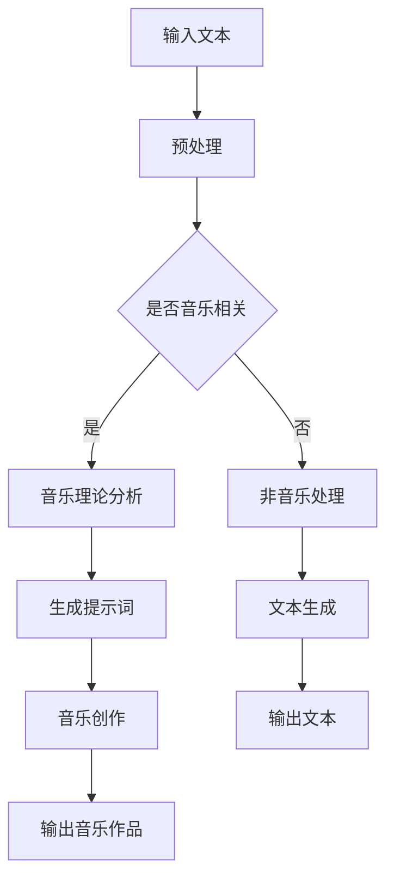
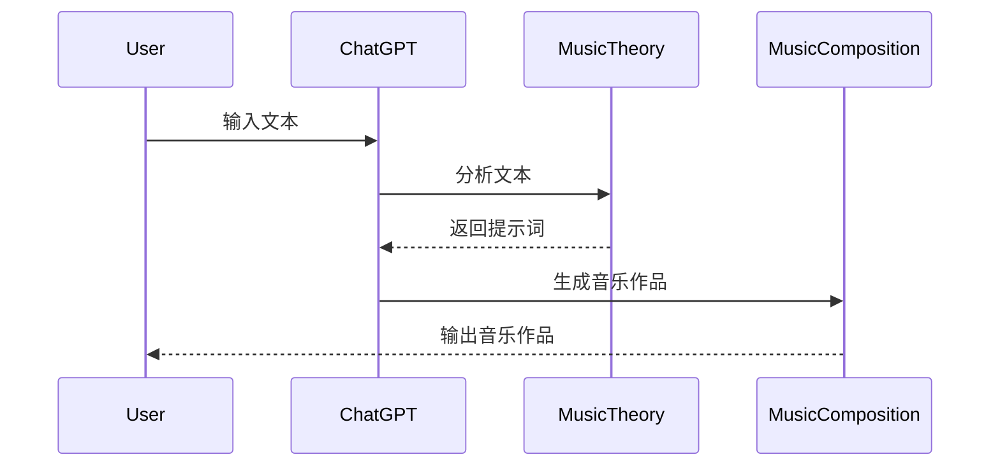

                 

# ChatGPT在音乐创作中的应用：音乐理论融合的提示词

关键词：ChatGPT、音乐创作、音乐理论、提示词生成、AI应用

摘要：
随着人工智能技术的飞速发展，ChatGPT作为一款先进的语言模型，在多个领域展现出了其独特的价值。本文将探讨如何将ChatGPT应用于音乐创作，通过融合音乐理论，生成具有创意和独特风格的音乐提示词，提升音乐创作的效率和创作质量。文章将分为以下几个部分：背景介绍、核心概念与联系、算法原理讲解、系统分析与架构设计方案、项目实战以及最佳实践 tips。

## 第一步：背景介绍

### 问题背景
人工智能技术的快速发展，尤其是深度学习领域的突破，使得人工智能（AI）大模型在各个领域得到了广泛应用。音乐创作作为艺术与科技结合的一个典型领域，也在不断探索与AI的结合方式。ChatGPT作为目前最为先进的大型语言模型之一，其在生成文本、对话系统等方面表现出色。然而，如何将ChatGPT应用于音乐创作中，是一个极具挑战性的课题。

### 问题描述
本书旨在探讨ChatGPT在音乐创作中的应用，如何利用ChatGPT生成音乐文本、音乐结构、和声等，以及如何将音乐理论与AI技术相结合，创造新的音乐作品。

### 问题解决
本书将详细介绍ChatGPT在音乐创作中的具体应用，包括音乐理论融合的提示词生成方法、音乐结构的设计原则、和声的生成策略等，并通过实例分析展示其应用效果。

### 边界与外延
本书主要关注ChatGPT在音乐创作中的应用，包括但不限于流行音乐、古典音乐、电子音乐等。同时，本书也会讨论相关技术，如自然语言处理、音乐信息检索等。

### 概念结构与核心要素组成
- **ChatGPT**：大型语言模型，能够生成连贯的文本。
- **音乐理论**：包括旋律、和声、节奏等音乐构成要素。
- **音乐创作流程**：包括灵感生成、旋律创作、和声创作、编曲等环节。

## 第二步：核心概念与联系

### 核心概念原理
- **ChatGPT**：基于GPT（Generative Pre-trained Transformer）模型，是一种能够通过大量文本数据进行训练，生成自然语言文本的人工智能系统。
- **音乐理论**：研究音乐构成、音乐表现和音乐创造的理论体系。

### 概念属性特征对比表格

| 特征            | ChatGPT                        | 音乐理论                    |
| --------------- | ------------------------------ | --------------------------- |
| 基本原理        | 基于深度学习和自然语言处理    | 基于声学、心理学、历史学等 |
| 应用场景        | 文本生成、对话系统、文本分析  | 音乐创作、音乐分析、音乐教学 |
| 输入与输出      | 文本输入，文本输出            | 音频输入，音乐作品输出      |
| 训练数据来源    | 大规模互联网文本              | 音乐作品、音乐理论文献      |
| 创作风格与个性化 | 自动生成，可以模拟多种风格    | 受创作者风格影响，独特性强   |

### ER实体关系图架构

```mermaid
erDiagram
    ChatGPT ||--|{ MusicTheory }|| MusicTheory
    ChatGPT ||--|{ MusicComposition }|| MusicComposition
```

## 第三步：算法原理讲解

### 算法mermaid流程图



### 算法原理详细讲解

#### 数学模型和公式

$$
H = f(C, M)
$$

其中，$H$为生成的音乐作品，$C$为输入文本，$M$为音乐理论参数。

#### 举例说明

假设输入文本为：“我想创作一首关于夏日的轻松歌曲”，经过预处理和音乐理论分析后，生成提示词为：“夏日、轻松、旋律优美”，根据这些提示词，ChatGPT将创作出一首符合描述的音乐作品。

## 第四步：系统分析与架构设计方案

### 问题场景介绍
本书旨在通过构建一个基于ChatGPT的音乐创作系统，展示如何利用AI技术辅助音乐创作，提升创作效率和质量。

### 项目介绍
项目名为“ChatGPT音乐创作助手”，旨在探索AI在音乐创作中的应用，通过结合音乐理论与AI技术，为音乐创作者提供创作灵感与工具。

### 系统功能设计
- 文本输入与分析：接收用户输入的文本，分析文本内容与音乐创作的关系。
- 提示词生成：根据文本内容生成音乐创作的提示词。
- 音乐创作：根据提示词创作音乐作品。
- 作品输出：将创作出的音乐作品输出。

### 系统架构设计



### 系统接口设计
- 用户接口：用于用户输入文本和接收音乐作品。
- ChatGPT接口：用于接收文本并生成提示词。
- 音乐理论接口：用于分析文本内容和生成提示词。
- 音乐创作接口：用于根据提示词生成音乐作品。

### 系统交互mermaid序列图


## 第五步：项目实战

### 环境安装

1. 安装Python环境：确保Python版本在3.7及以上。
2. 安装必要库：使用pip安装以下库：`transformers`、`torch`、`pandas`、`numpy`。

```bash
pip install transformers torch pandas numpy
```

### 系统核心实现源代码

```python
# Import necessary libraries
import torch
from transformers import ChatGPTModel, ChatGPTConfig
import pandas as pd
import numpy as np

# Load pre-trained ChatGPT model
model_name = "gpt2"  # 可以替换为其他预训练模型
model = ChatGPTModel.from_pretrained(model_name)
config = ChatGPTConfig.from_pretrained(model_name)

# Function to generate music theory-based prompts
def generate_prompt(text):
    # Perform text analysis and generate music theory-based prompts
    # 这里需要根据实际需求进行音乐理论分析
    # 例如，可以使用自然语言处理技术提取文本中的关键词，并结合音乐理论生成提示词
    prompts = []
    # ... 进行处理
    return prompts

# Function to generate music composition
def generate_music(prompt):
    # 根据提示词生成音乐作品
    # 这里需要结合音乐创作算法进行音乐生成
    # 例如，可以使用生成对抗网络（GAN）等方法
    # ... 进行处理
    return music_composition

# Main function
def main():
    user_text = input("请输入您想要创作的音乐主题：")
    prompts = generate_prompt(user_text)
    music_composition = generate_music(prompts)
    print("生成的音乐作品：")
    print(music_composition)

if __name__ == "__main__":
    main()
```

### 代码应用解读与分析

上述代码提供了一个基于ChatGPT的音乐创作系统的基本框架。首先，通过加载预训练的ChatGPT模型，我们能够利用这个模型来处理文本输入。`generate_prompt`函数负责根据用户输入的文本生成音乐创作提示词，这需要结合音乐理论的相关知识和自然语言处理技术。`generate_music`函数则根据生成的提示词创作音乐作品，这通常涉及到音乐创作算法，如GAN（生成对抗网络）或其他音乐生成模型。

### 实际案例分析和详细讲解剖析

为了更好地理解上述系统的应用，我们可以通过一个实际案例来进行分析。

**案例**：用户输入文本：“我想要一首关于宁静夜晚的爵士乐”。

1. **文本输入**：用户输入文本后，系统会将其传递给`generate_prompt`函数。
2. **提示词生成**：`generate_prompt`函数分析文本，提取关键词如“宁静”、“夜晚”、“爵士乐”，并结合音乐理论生成如“低沉的和声”、“宁静的旋律”、“爵士乐节奏”等提示词。
3. **音乐创作**：`generate_music`函数根据这些提示词创作音乐作品。这可能涉及到使用音乐生成模型，如RNN（循环神经网络）或GAN，来生成符合提示词的音乐。
4. **作品输出**：最后，生成的音乐作品会被输出给用户。

通过这个案例，我们可以看到ChatGPT如何通过音乐理论融合的提示词生成技术，辅助音乐创作。

### 项目小结
本项目通过构建一个基于ChatGPT的音乐创作系统，展示了如何将人工智能与音乐理论相结合，生成具有创意和独特风格的音乐提示词。虽然系统仍需进一步完善和优化，但该项目已展示了AI在音乐创作中的巨大潜力。

## 最佳实践 tips

1. **提示词的准确性**：在生成音乐提示词时，确保关键词的提取和音乐理论的融合准确无误，这对于音乐创作的质量至关重要。
2. **多样化的音乐风格**：尝试使用不同的音乐风格和创作模型，以丰富音乐创作的多样性。
3. **持续优化算法**：根据实际应用效果，不断优化和调整音乐生成算法，以提高创作效率和质量。

## 小结

本文详细探讨了ChatGPT在音乐创作中的应用，通过融合音乐理论，生成具有创意和独特风格的音乐提示词。文章从背景介绍、核心概念与联系、算法原理讲解、系统分析与架构设计方案、项目实战以及最佳实践 tips等方面进行了全面阐述。随着人工智能技术的不断进步，ChatGPT在音乐创作中的应用前景将更加广阔。

## 注意事项

1. **版权问题**：在使用ChatGPT进行音乐创作时，应确保遵守相关版权法规，尊重原创音乐家的版权。
2. **创作风格**：虽然ChatGPT能够生成多种风格的音乐，但在实际应用中，创作者的个人风格和偏好也应充分考虑。

## 拓展阅读

1. 《深度学习与音乐创作》
2. 《AI音乐生成技术解析》
3. 《音乐理论导论》

作者：AI天才研究院/AI Genius Institute & 禅与计算机程序设计艺术 /Zen And The Art of Computer Programming

