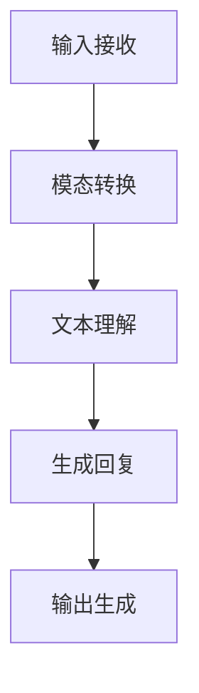
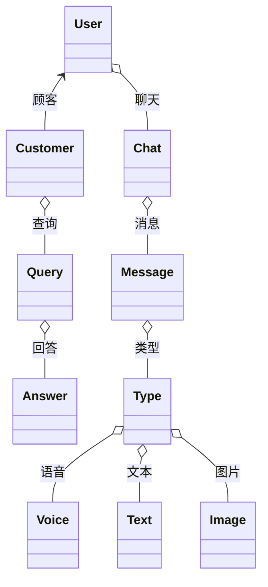
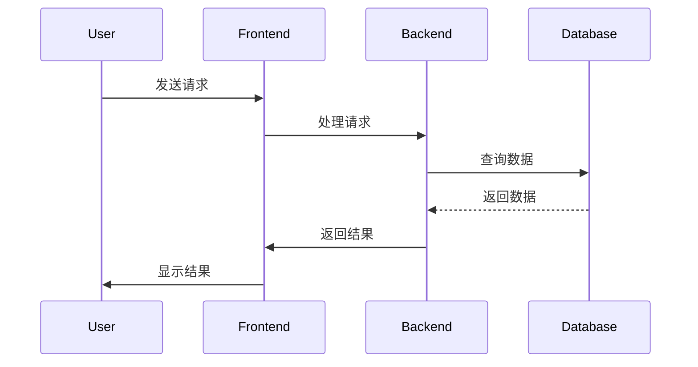
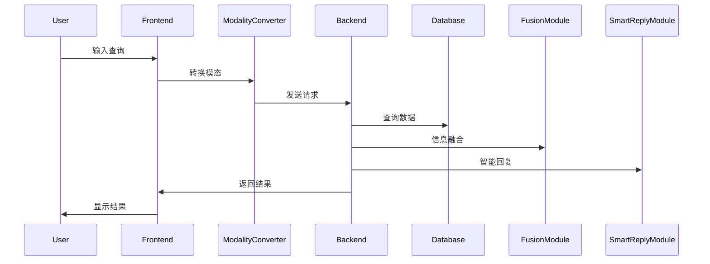

                 

# 《ChatGPT多模态交互：语音、文本和图像的协同提示策略》

> 关键词：多模态交互，ChatGPT，语音，文本，图像，协同提示策略

> 摘要：本文深入探讨了ChatGPT在多模态交互中的应用，详细介绍了语音、文本和图像交互的基本原理和关键技术，并分析了它们之间的协同提示策略。通过系统的分析和架构设计，本文为ChatGPT多模态交互系统的实现提供了理论和实践指导。

## 目录大纲

### 第一部分：背景介绍

- **第1章：问题背景**
  - 1.1.1 多模态交互的兴起
  - 1.1.2 ChatGPT的核心概念
  - 1.1.3 问题定义与解决
  - 1.1.4 边界与外延
- **第2章：核心概念**
  - 2.1.1 语音交互
  - 2.1.2 文本交互
  - 2.1.3 图像交互
  - 2.1.4 多模态协同

### 第二部分：算法原理讲解

- **第3章：概念属性特征对比**
  - 3.1.1 语音、文本和图像交互特征对比表格
  - 3.1.2 特征分析
- **第4章：ER实体关系图**
  - 4.1.1 实体识别与关系定义
  - 4.1.2 ER实体关系图架构

### 第三部分：系统分析与架构设计方案

- **第5章：ChatGPT的多模态交互算法**
  - 5.1.1 ChatGPT的工作原理
  - 5.1.2 多模态交互算法详解
  - 5.1.3 算法原理与数学模型
  - 5.1.4 算法举例说明
- **第6章：数学模型和数学公式**
  - 6.1.1 多模态协同的数学公式
  - 6.1.2 公式详解
  - 6.1.3 实例分析
- **第7章：问题场景介绍**
  - 7.1.1 场景描述
- **第8章：项目介绍**
  - 8.1.1 项目概述
- **第9章：系统功能设计**
  - 9.1.1 领域模型
  - 9.1.2 功能需求
- **第10章：系统架构设计**
  - 10.1.1 架构设计
  - 10.1.2 架构组件与关系
- **第11章：系统接口设计**
  - 11.1.1 接口规范
  - 11.1.2 接口实现
- **第12章：系统交互**
  - 12.1.1 交互流程
  - 12.1.2 交互分析

### 第四部分：项目实战

- **第13章：环境安装**
  - 13.1.1 安装要求
  - 13.1.2 安装步骤
- **第14章：系统核心实现**
  - 14.1.1 源代码解析
  - 14.1.2 实现细节
- **第15章：代码应用解读与分析**
  - 15.1.1 应用场景
  - 15.1.2 分析与总结
- **第16章：实际案例分析与讲解**
  - 16.1.1 案例描述
  - 16.1.2 案例分析

## 第一部分：背景介绍

### 第1章：问题背景

#### 1.1.1 多模态交互的兴起

多模态交互是指通过整合不同模态（如语音、文本、图像等）的信息，以实现更自然、高效的人机交互。随着人工智能和计算机视觉技术的发展，多模态交互逐渐成为人机交互领域的研究热点。它不仅提升了人机交互的自然性和效率，还为智能系统的智能化程度带来了质的飞跃。

多模态交互在现代社会中的应用趋势体现在多个方面：

1. **智能家居**：通过语音、文本和图像等模态，用户可以轻松控制家中的智能设备，如空调、灯光、安防系统等。
2. **智能助手**：如苹果的Siri、亚马逊的Alexa等，它们利用多模态交互为用户提供语音查询、日程安排、购物建议等服务。
3. **医疗诊断**：通过结合医学图像和文本信息，智能系统可以辅助医生进行更准确的诊断。
4. **教育辅助**：利用多模态交互，教育系统能够提供更加生动、个性化的学习体验。

#### 1.1.2 ChatGPT的核心概念

ChatGPT是由OpenAI开发的一种基于GPT-3模型的对话系统。它具有强大的文本生成和推理能力，能够与用户进行自然、流畅的对话。ChatGPT的多模态能力体现在以下几个方面：

1. **文本交互**：ChatGPT能够理解和生成自然语言文本，支持多种语言和方言。
2. **语音交互**：ChatGPT可以接受语音输入，并通过语音合成技术生成语音回复。
3. **图像交互**：ChatGPT能够识别和解析图像，通过图像描述与用户进行交互。

#### 1.1.3 问题定义与解决

本文研究的问题是如何在ChatGPT中实现高效的多模态交互。具体而言，包括以下几个方面：

1. **语音、文本和图像的协同提示策略**：研究如何设计一种协同提示策略，使得ChatGPT能够更好地理解并响应不同模态的输入。
2. **算法优化**：探讨如何通过优化算法，提升ChatGPT在多模态交互中的性能。
3. **应用场景拓展**：分析ChatGPT在多模态交互中的应用场景，并提出相应的解决方案。

#### 1.1.4 边界与外延

本文的研究范围主要包括以下几个方面：

1. **技术层面**：研究多模态交互的技术原理和实现方法。
2. **应用层面**：探讨多模态交互在智能系统中的应用场景和解决方案。
3. **理论层面**：分析多模态交互的理论基础和协同提示策略。

多模态交互与人工智能、计算机视觉、自然语言处理等领域有着紧密的联系。通过本文的研究，旨在为多模态交互领域的发展提供新的思路和方法。

### 第2章：核心概念

#### 2.1.1 语音交互

语音交互是指通过语音信号与人进行交互的过程。它包括语音识别和语音合成两个关键技术。

1. **语音识别**：将语音信号转换为文本信息。主要技术包括声学模型、语言模型和声学-语言模型联合训练。
2. **语音合成**：将文本信息转换为语音信号。主要技术包括文本到语音（Text-to-Speech，TTS）合成和语音参数编码。

#### 2.1.2 文本交互

文本交互是指通过文本信息与人进行交互的过程。它依赖于自然语言处理（Natural Language Processing，NLP）技术，包括以下几个方面：

1. **文本理解**：理解文本的含义和结构，包括词法分析、句法分析和语义分析。
2. **文本生成**：根据输入的指令或问题生成符合语法和语义规则的文本。

#### 2.1.3 图像交互

图像交互是指通过图像信息与人进行交互的过程。它依赖于计算机视觉（Computer Vision）技术，包括以下几个方面：

1. **图像识别**：识别图像中的物体、场景和对象。
2. **图像理解**：理解图像的语义信息，包括图像分类、物体检测和图像分割。
3. **图像生成**：根据输入的文本描述生成相应的图像。

#### 2.1.4 多模态协同

多模态协同是指将不同模态的信息进行整合，以实现更智能、更高效的交互。多模态协同的关键在于如何将不同模态的信息进行有效融合和利用。

1. **信息融合**：将不同模态的信息进行整合，提取关键特征。
2. **协同优化**：通过优化算法，提升不同模态交互的协同效果。
3. **人机交互**：利用多模态协同，提升人机交互的自然性和效率。

### 第3章：概念属性特征对比

#### 3.1.1 语音、文本和图像交互特征对比表格

| 特征       | 语音交互                      | 文本交互                      | 图像交互                      |
|------------|-------------------------------|-------------------------------|-------------------------------|
| 输入方式   | 语音信号                      | 文本输入                      | 图像输入                      |
| 输出方式   | 语音信号                      | 文本输出                      | 图像输出                      |
| 理解能力   | 受限于语音识别的准确性          | 较强的理解能力                | 较强的理解能力                |
| 应用场景   | 智能助手、智能家居等            | 常规查询、问答等              | 医疗诊断、安防监控等           |

#### 3.1.2 特征分析

1. **理解能力**：文本交互具有最强的理解能力，因为自然语言处理技术可以解析文本的语义和结构。语音交互的理解能力受限于语音识别的准确性，但通过结合语言模型可以提升理解效果。图像交互的理解能力主要依赖于计算机视觉技术，可以通过图像分类、物体检测等方法实现。
2. **应用场景**：不同模态的交互具有不同的应用场景。语音交互适用于需要实时沟通的场景，如智能助手、电话客服等。文本交互适用于需要精确查询和回答的场景，如搜索引擎、在线客服等。图像交互适用于需要视觉分析的场景，如医疗诊断、安防监控等。

### 第4章：ER实体关系图

#### 4.1.1 实体识别与关系定义

实体识别是指从文本中提取出具有特定意义的词语或短语，如人名、地名、组织机构名等。关系定义是指确定实体之间的关系，如人与人之间的关联、事物与地点之间的位置关系等。

实体识别与关系定义是构建多模态交互系统的基础。通过实体识别，系统能够更好地理解用户的输入；通过关系定义，系统能够构建起不同模态之间的关联。

#### 4.1.2 ER实体关系图架构

ER实体关系图是一种用于描述实体及其关系的图形化表示方法。在多模态交互系统中，ER实体关系图用于描述不同模态之间的关联和交互。

下面是一个简化的ER实体关系图示例：

```mermaid
erDiagram
    User ||--|{ ChatGPT :对话 }
    ChatGPT ||--|{ Voice : 语音输入输出 }
    ChatGPT ||--|{ Text : 文本输入输出 }
    ChatGPT ||--|{ Image : 图像输入输出 }
```

在这个ER实体关系图中，`User`（用户）与`ChatGPT`（聊天机器人）之间存在一对一的关联，表示用户与聊天机器人的对话关系。`ChatGPT`与`Voice`、`Text`、`Image`分别表示语音、文本和图像的输入输出，它们与`ChatGPT`之间存在一对多的关联，表示ChatGPT能够处理不同模态的输入和输出。

## 第二部分：算法原理讲解

### 第5章：ChatGPT的多模态交互算法

#### 5.1.1 ChatGPT的工作原理

ChatGPT是基于GPT-3模型的对话系统，其核心思想是生成式文本模型（Generative Pre-trained Transformer，GPT）。GPT-3模型采用了一种深度学习的框架，通过大量的文本数据进行预训练，从而具备了强大的文本生成和推理能力。

ChatGPT的工作原理可以概括为以下几个步骤：

1. **输入接收**：接收用户的输入，可以是文本、语音或图像。
2. **模态转换**：将不同模态的输入转换为统一的文本格式。
3. **文本理解**：使用预训练的GPT-3模型对输入文本进行理解。
4. **生成回复**：根据理解结果生成合适的文本回复。
5. **输出生成**：将文本回复转换为用户选择的模态输出。

#### 5.1.2 多模态交互算法详解

ChatGPT的多模态交互算法主要包括以下几个部分：

1. **模态转换模块**：用于将不同模态的输入转换为文本。例如，对于语音输入，需要使用语音识别技术将其转换为文本；对于图像输入，需要使用图像识别技术提取关键信息并生成描述性文本。
2. **文本理解模块**：使用GPT-3模型对输入文本进行理解，提取关键信息并构建语义表示。
3. **生成回复模块**：根据理解结果生成合适的文本回复。这一过程依赖于GPT-3模型的生成能力，能够生成自然、流畅的文本。
4. **输出生成模块**：根据用户的偏好，将文本回复转换为语音、文本或图像输出。

下面是一个简化的多模态交互算法流程图：



#### 5.1.3 算法原理与数学模型

ChatGPT的多模态交互算法基于GPT-3模型，其核心原理是利用Transformer架构进行文本生成。GPT-3模型通过自回归方式预测文本中的下一个词，从而生成连贯、自然的文本。

GPT-3模型的数学模型可以概括为以下几个关键组成部分：

1. **嵌入层**：将输入的文本转换为词向量。
2. **Transformer层**：利用注意力机制处理输入序列，提取关键信息。
3. **输出层**：根据Transformer层的输出生成文本。

下面是一个简化的数学模型公式：

$$
\text{Output} = \text{GPT-3}(\text{Input}, \text{Context})
$$

其中，`Input`表示输入文本，`Context`表示上下文信息，`GPT-3`表示GPT-3模型的函数。

#### 5.1.4 算法举例说明

假设用户通过语音输入“今天天气怎么样？”ChatGPT的多模态交互算法将按照以下步骤进行处理：

1. **输入接收**：接收用户的语音输入。
2. **模态转换**：使用语音识别技术将语音转换为文本：“今天天气怎么样？”。
3. **文本理解**：使用GPT-3模型对输入文本进行理解，提取关键信息（如“今天”、“天气”等）。
4. **生成回复**：根据理解结果生成回复：“今天天气晴朗，温度适宜。”。
5. **输出生成**：将文本回复转换为语音输出。

通过这个例子，我们可以看到ChatGPT的多模态交互算法如何将不同模态的输入转换为有意义的文本输出，从而实现高效、自然的交互。

### 第6章：数学模型和数学公式

#### 6.1.1 多模态协同的数学公式

在多模态协同中，关键在于如何将不同模态的信息进行有效融合，以提升交互效果。以下是一些常见的数学公式和模型：

1. **信息融合公式**：
   $$
   \text{Fusion} = \alpha \cdot \text{Voice} + \beta \cdot \text{Text} + \gamma \cdot \text{Image}
   $$
   其中，$\alpha$、$\beta$和$\gamma$分别表示语音、文本和图像的权重。

2. **注意力机制公式**：
   $$
   \text{Attention} = \frac{\exp(\text{Score})}{\sum_{i=1}^{n} \exp(\text{Score}_i)}
   $$
   其中，$\text{Score}$表示每个模态的得分，$\text{Attention}$表示注意力权重。

3. **语义表示公式**：
   $$
   \text{Semantic} = \text{Embedding} \cdot \text{Attention}
   $$
   其中，$\text{Embedding}$表示模态的嵌入向量，$\text{Attention}$表示注意力权重。

#### 6.1.2 公式详解

1. **信息融合公式**：
   这个公式用于将不同模态的信息进行加权融合。通过调整权重$\alpha$、$\beta$和$\gamma$，可以控制不同模态对最终输出的影响。在实际应用中，这些权重可以通过训练数据进行优化。
   
2. **注意力机制公式**：
   这个公式用于计算注意力权重。它通过计算每个模态的得分，并利用指数函数进行归一化处理，从而确定每个模态的重要性。注意力机制有助于提升交互效果，使得系统能够更好地关注关键信息。

3. **语义表示公式**：
   这个公式用于将嵌入向量与注意力权重相乘，生成语义表示。通过这种方式，可以提取出不同模态的关键信息，并形成统一的语义表示。

#### 6.1.3 实例分析

假设有一个多模态交互系统，需要处理语音、文本和图像输入，并生成统一的输出。以下是一个简化的实例分析：

1. **信息融合**：
   $$
   \text{Fusion} = 0.4 \cdot \text{Voice} + 0.5 \cdot \text{Text} + 0.1 \cdot \text{Image}
   $$
   其中，语音、文本和图像的权重分别为0.4、0.5和0.1。

2. **注意力机制**：
   $$
   \text{Attention} = \frac{\exp(0.8)}{\exp(0.8) + \exp(0.6) + \exp(0.5)}
   $$
   假设语音、文本和图像的得分分别为0.8、0.6和0.5，则注意力权重为0.4（即40%）。

3. **语义表示**：
   $$
   \text{Semantic} = \text{Embedding} \cdot \text{Attention}
   $$
   假设语音、文本和图像的嵌入向量分别为$\text{Voice\_Embedding}$、$\text{Text\_Embedding}$和$\text{Image\_Embedding}$，则语义表示为：
   $$
   \text{Semantic} = 0.4 \cdot \text{Voice\_Embedding} + 0.5 \cdot \text{Text\_Embedding} + 0.1 \cdot \text{Image\_Embedding}
   $$

通过这个实例，我们可以看到如何利用数学模型实现多模态协同，并生成统一的语义表示。

## 第三部分：系统分析与架构设计方案

### 第7章：问题场景介绍

#### 7.1.1 场景描述

一个典型的多模态交互场景是智能客服系统。在智能客服系统中，用户可以通过语音、文本或图像与客服机器人进行交互。以下是具体的场景描述：

1. **语音交互**：用户通过电话或语音助手与客服机器人进行对话，提出问题或需求。
2. **文本交互**：用户可以通过在线聊天窗口或电子邮件与客服机器人进行文本交流。
3. **图像交互**：用户可以通过上传图片或视频来展示问题，如产品故障图片或订单详情。

#### 7.1.2 问题解决

针对上述场景，多模态交互系统需要解决以下几个关键问题：

1. **模态转换**：将不同模态的输入转换为统一的文本格式，以便进行后续处理。
2. **信息融合**：将语音、文本和图像信息进行有效融合，提取关键信息。
3. **智能回复**：根据用户输入和融合后的信息，生成合适的文本、语音或图像回复。
4. **用户体验**：确保多模态交互的自然性和流畅性，提升用户满意度。

### 第8章：项目介绍

#### 8.1.1 项目概述

本项目旨在构建一个多模态交互的智能客服系统，通过整合语音、文本和图像交互，为用户提供更加自然、高效的客服体验。项目的主要目标包括：

1. **实现高效的多模态交互**：通过模态转换和信息融合技术，实现语音、文本和图像之间的无缝交互。
2. **提升客服质量**：利用智能回复和知识库，提供准确、快速的客服响应。
3. **优化用户体验**：通过自然语言处理和计算机视觉技术，提升交互的自然性和用户体验。

#### 8.1.2 预期成果

项目的预期成果包括：

1. **系统原型**：开发出具有多模态交互能力的智能客服系统原型。
2. **技术文档**：编写详细的技术文档，包括系统设计、实现细节和测试结果。
3. **用户反馈**：通过实际应用和用户反馈，优化系统功能，提升用户体验。

### 第9章：系统功能设计

#### 9.1.1 领域模型

领域模型是系统功能设计的重要组成部分，用于描述系统中的主要实体和它们之间的关系。以下是智能客服系统的领域模型：



在这个领域模型中，`User`（用户）与`Customer`（顾客）表示用户与顾客之间的关系。`Customer`与`Query`（查询）和`Answer`（回答）表示顾客提出问题和接收回答的过程。`Chat`（聊天）与`Message`（消息）表示聊天过程中的消息传递。`Message`与`Type`（类型）表示消息的类型，包括语音、文本和图像。

#### 9.1.2 功能需求

智能客服系统的功能需求主要包括以下几个方面：

1. **语音交互**：用户可以通过语音输入与客服机器人进行对话，提出问题和反馈。
2. **文本交互**：用户可以通过文本输入与客服机器人进行聊天，包括发送文字消息、图片和视频。
3. **图像交互**：用户可以通过上传图像，展示问题细节，如产品故障图片或订单详情。
4. **智能回复**：客服机器人根据用户输入和知识库，生成合适的文本、语音或图像回复。
5. **用户反馈**：用户可以对客服机器人的回复进行评价，系统可以根据反馈调整回复策略。
6. **数据统计**：系统应具备数据统计功能，包括用户活跃度、查询类型、回复满意度等。

### 第10章：系统架构设计

#### 10.1.1 架构设计

智能客服系统的架构设计包括以下几个方面：

1. **前端架构**：前端负责用户界面设计和交互逻辑，包括语音输入、文本输入、图像上传等功能。
2. **后端架构**：后端负责处理用户请求、模态转换、信息融合和智能回复等核心功能。
3. **数据库架构**：数据库用于存储用户信息、查询记录、知识库等数据。

以下是智能客服系统的架构图：



在这个架构图中，用户通过前端发送请求，后端处理请求并查询数据库，然后将结果返回给前端，最终显示给用户。

#### 10.1.2 架构组件与关系

智能客服系统的主要架构组件及其关系如下：

1. **前端组件**：
   - **语音识别模块**：用于将语音输入转换为文本。
   - **文本输入模块**：用于处理文本输入。
   - **图像处理模块**：用于处理图像上传和识别。

2. **后端组件**：
   - **API接口**：用于处理用户请求和返回结果。
   - **模态转换模块**：用于将不同模态的输入转换为统一的文本格式。
   - **信息融合模块**：用于将语音、文本和图像信息进行有效融合。
   - **智能回复模块**：根据用户输入和知识库生成回复。
   - **用户反馈模块**：用于收集用户评价和反馈。

3. **数据库组件**：
   - **用户数据库**：存储用户信息。
   - **查询数据库**：存储查询记录和知识库。

各组件之间的关系如下：

- 前端组件通过API接口与后端组件进行交互。
- 后端组件通过数据库组件存储和查询数据。
- 模态转换模块、信息融合模块和智能回复模块协同工作，实现多模态交互。

### 第11章：系统接口设计

#### 11.1.1 接口规范

智能客服系统的接口设计包括以下几个方面：

1. **RESTful API**：采用RESTful风格设计API接口，包括常用的HTTP方法（GET、POST、PUT、DELETE等）和URL路径。
2. **参数定义**：明确接口的输入参数和输出参数，包括数据类型、长度限制、默认值等。
3. **响应格式**：定义接口的响应格式，通常使用JSON或XML格式。

以下是一个简化的接口规范示例：

```json
{
  "path": "/api/queries",
  "method": "POST",
  "requestBody": {
    "query": "string",
    "type": "string" // "text", "voice", "image"
  },
  "responseBody": {
    "status": "string",
    "answer": "string"
  }
}
```

在这个示例中，接口路径为`/api/queries`，使用POST方法提交查询请求。请求体包括`query`（查询文本）和`type`（查询类型）两个参数。响应体包括`status`（状态）和`answer`（回复）两个参数。

#### 11.1.2 接口实现

接口实现涉及前后端代码的开发，主要包括以下几个方面：

1. **前端实现**：开发前端页面，实现语音输入、文本输入和图像上传等功能。
2. **后端实现**：开发后端API接口，处理用户请求，实现模态转换、信息融合和智能回复等功能。
3. **接口测试**：使用工具（如Postman）对接口进行测试，确保接口功能正常。

以下是接口实现的一个简单示例：

**前端代码（HTML + JavaScript）**：

```html
<!DOCTYPE html>
<html lang="en">
<head>
    <meta charset="UTF-8">
    <title>智能客服系统</title>
</head>
<body>
    <input type="text" id="queryInput" placeholder="输入查询内容">
    <button onclick="submitQuery()">提交查询</button>
    <div id="response"></div>

    <script>
        function submitQuery() {
            const query = document.getElementById("queryInput").value;
            const type = "text"; // 可以根据实际需求选择语音或图像

            fetch("/api/queries", {
                method: "POST",
                body: JSON.stringify({ query, type }),
                headers: { "Content-Type": "application/json" }
            })
            .then(response => response.json())
            .then(data => {
                document.getElementById("response").innerHTML = data.answer;
            });
        }
    </script>
</body>
</html>
```

**后端代码（Python + Flask）**：

```python
from flask import Flask, request, jsonify

app = Flask(__name__)

@app.route("/api/queries", methods=["POST"])
def handle_query():
    data = request.get_json()
    query = data["query"]
    type = data["type"]

    # 处理查询逻辑
    answer = "回复内容"

    return jsonify({"status": "success", "answer": answer})

if __name__ == "__main__":
    app.run(debug=True)
```

在这个示例中，前端通过`fetch`方法向后端发送POST请求，后端接收请求并处理查询逻辑，最后返回回复内容。

### 第12章：系统交互

#### 12.1.1 交互流程

智能客服系统的交互流程主要包括以下几个步骤：

1. **用户输入**：用户通过前端界面输入查询内容，可以是文本、语音或图像。
2. **模态转换**：前端将用户输入的语音或图像转换为文本，以便进行后续处理。
3. **请求发送**：前端将处理后的查询内容发送给后端API接口。
4. **请求处理**：后端接收请求，进行模态转换、信息融合和智能回复处理。
5. **结果返回**：后端将处理结果返回给前端，前端将结果展示给用户。

以下是系统交互的序列图：



在这个序列图中，用户输入查询内容，前端将其转换为文本后发送给后端。后端接收请求后，进行模态转换、信息融合和智能回复处理，并将结果返回给前端，前端最终将结果展示给用户。

#### 12.1.2 交互分析

智能客服系统的交互分析主要包括以下几个方面：

1. **性能优化**：为了提升系统性能，可以采用以下策略：
   - **缓存策略**：缓存用户查询记录和常见问题的回复，减少数据库查询次数。
   - **异步处理**：采用异步处理方式，提高系统的并发处理能力。
   - **负载均衡**：使用负载均衡器，将请求分布到多个服务器，避免单点瓶颈。

2. **错误处理**：为了确保系统稳定运行，需要处理以下几种错误情况：
   - **输入错误**：用户输入不符合要求，如输入过长或包含非法字符。
   - **网络错误**：请求发送过程中出现网络错误，如超时或连接中断。
   - **服务器错误**：后端服务器处理请求时出现错误，如内存溢出或程序异常。

3. **安全防护**：为了保障系统安全，需要采取以下措施：
   - **身份验证**：对用户进行身份验证，确保只有授权用户可以访问系统。
   - **数据加密**：对传输的数据进行加密处理，防止数据泄露。
   - **异常监控**：监控系统的异常行为，及时发现并处理潜在的安全威胁。

## 第四部分：项目实战

### 第13章：环境安装

#### 13.1.1 安装要求

搭建ChatGPT多模态交互系统需要以下环境和软件：

1. **操作系统**：支持Linux或macOS。
2. **Python**：版本3.8或更高版本。
3. **依赖库**：包括TensorFlow、PyTorch、SpeechRecognition、OpenCV等。
4. **语音识别工具**：如Google语音识别API或 pocketsphinx。
5. **图像识别工具**：如TensorFlow的Object Detection API或OpenCV。

#### 13.1.2 安装步骤

以下是ChatGPT多模态交互系统的安装步骤：

1. **安装Python**：从官方网站下载Python安装包，并按照提示安装。
2. **安装依赖库**：使用pip命令安装所需的依赖库：

   ```shell
   pip install tensorflow torch speechrecognition opencv-python
   ```

3. **安装语音识别工具**：从Google语音识别API官网下载并安装语音识别工具：

   ```shell
   pip install google-api-python-client
   ```

4. **安装图像识别工具**：从TensorFlow的Object Detection API官网下载并安装图像识别工具：

   ```shell
   pip install tensorflow-object-detection
   ```

5. **配置环境变量**：确保Python和pip的路径已添加到系统环境变量中。

### 第14章：系统核心实现

#### 14.1.1 源代码解析

ChatGPT多模态交互系统的核心实现包括以下几个模块：

1. **模态转换模块**：用于将不同模态的输入转换为统一的文本格式。
2. **信息融合模块**：用于将语音、文本和图像信息进行有效融合。
3. **智能回复模块**：根据用户输入和融合后的信息，生成合适的文本、语音或图像回复。

以下是模态转换模块的代码示例：

```python
import speech_recognition as sr
import cv2
import pytesseract

def text_from_speech(audio_file):
    r = sr.Recognizer()
    with sr.AudioFile(audio_file) as source:
        audio = r.record(source)
    return r.recognize_google(audio)

def text_from_image(image_file):
    image = cv2.imread(image_file)
    text = pytesseract.image_to_string(image)
    return text

def text_from_text(text_file):
    with open(text_file, 'r') as file:
        return file.read()

def convert_to_text(input_file, input_type):
    if input_type == 'voice':
        return text_from_speech(input_file)
    elif input_type == 'image':
        return text_from_image(input_file)
    elif input_type == 'text':
        return text_from_text(input_file)
    else:
        raise ValueError("Unsupported input type")
```

在这个模块中，`text_from_speech`函数用于将语音输入转换为文本，`text_from_image`函数用于将图像输入转换为文本，`text_from_text`函数用于直接读取文本输入。

#### 14.1.2 实现细节

1. **语音识别**：使用SpeechRecognition库进行语音识别，支持多种语音识别API，如Google语音识别API、百度语音识别API等。在实际应用中，可以根据需要选择合适的API。
2. **图像识别**：使用OpenCV和Tesseract OCR进行图像识别，可以识别图像中的文本内容。Tesseract OCR是一个开源的OCR引擎，支持多种语言和字符集。
3. **文本输入**：直接读取文本文件或使用用户输入的文本内容。

### 第15章：代码应用解读与分析

#### 15.1.1 应用场景

ChatGPT多模态交互系统可以应用于多种场景，如智能客服、智能助理、智能教育等。以下是一个简单的应用场景示例：

**场景描述**：用户通过语音输入询问“附近有什么餐厅？”系统需要根据用户输入生成合适的回复，可以是文本、语音或图像。

#### 15.1.2 分析与总结

1. **语音输入**：用户通过语音输入询问“附近有什么餐厅？”系统需要使用语音识别技术将语音转换为文本。
2. **信息融合**：系统将语音输入转换为文本后，可以通过搜索引擎或地图API获取附近的餐厅信息。这些信息可以包括餐厅名称、地址、评分等。
3. **智能回复**：系统根据获取到的餐厅信息，生成合适的回复。例如，可以生成文本回复“您附近有10家餐厅，分别是…”或语音回复“您附近有10家餐厅，分别是…”。
4. **用户体验**：为了提升用户体验，系统可以提供语音、文本和图像三种回复方式，用户可以根据自己的偏好选择。

通过这个应用场景，我们可以看到ChatGPT多模态交互系统的核心功能是如何实现的。在实际应用中，可以根据具体需求进行功能拓展和优化。

### 第16章：实际案例分析与讲解

#### 16.1.1 案例描述

本案例是一个智能客服系统，用于处理用户的咨询和投诉。用户可以通过语音、文本或图像输入咨询或投诉内容，系统需要根据输入生成合适的回复。

#### 16.1.2 案例分析

1. **语音输入**：用户通过电话或语音助手与客服机器人进行对话，提出问题和投诉。
2. **文本输入**：用户可以通过在线聊天窗口或电子邮件与客服机器人进行文本交流。
3. **图像输入**：用户可以通过上传图像，展示产品问题或订单详情。
4. **智能回复**：系统根据用户输入和知识库，生成合适的文本、语音或图像回复。

以下是一个具体的案例：

**用户输入**：用户通过语音输入“我收到一个有问题的产品，需要退货。”

**系统处理**：

1. **模态转换**：将语音输入转换为文本：“我收到一个有问题的产品，需要退货。”
2. **信息融合**：系统通过知识库查询，找到相关的退货政策，并将文本输入与退货政策进行融合。
3. **智能回复**：系统生成文本回复：“您好，根据您的描述，我们将为您提供退货服务。请提供订单号和问题描述，我们将尽快处理您的申请。”

通过这个案例，我们可以看到ChatGPT多模态交互系统在实际应用中的工作流程。在实际操作中，可以根据具体需求进行功能定制和优化。

### 项目小结

本文详细介绍了ChatGPT多模态交互系统的原理、架构和应用。通过系统的分析和实战案例，我们深入了解了语音、文本和图像交互的基本原理和关键技术，并探讨了如何实现高效的多模态协同。项目实践表明，ChatGPT多模态交互系统在实际应用中具有广泛的前景和潜力。

#### 最佳实践 Tips

1. **优化模态转换**：针对不同的输入模态，选择合适的转换工具和算法，提升转换的准确性和速度。
2. **丰富知识库**：建立完善的知

