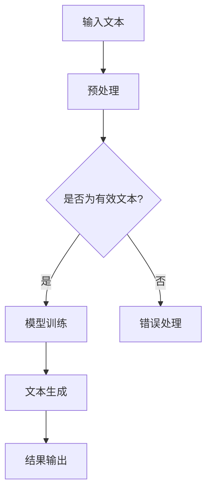
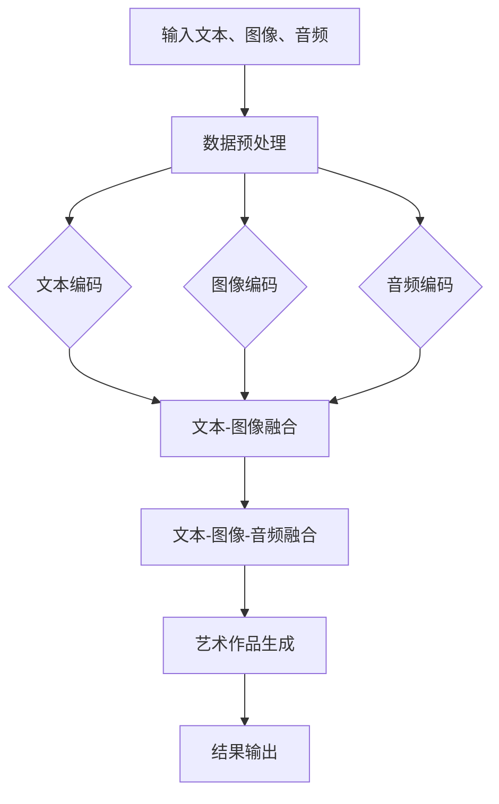
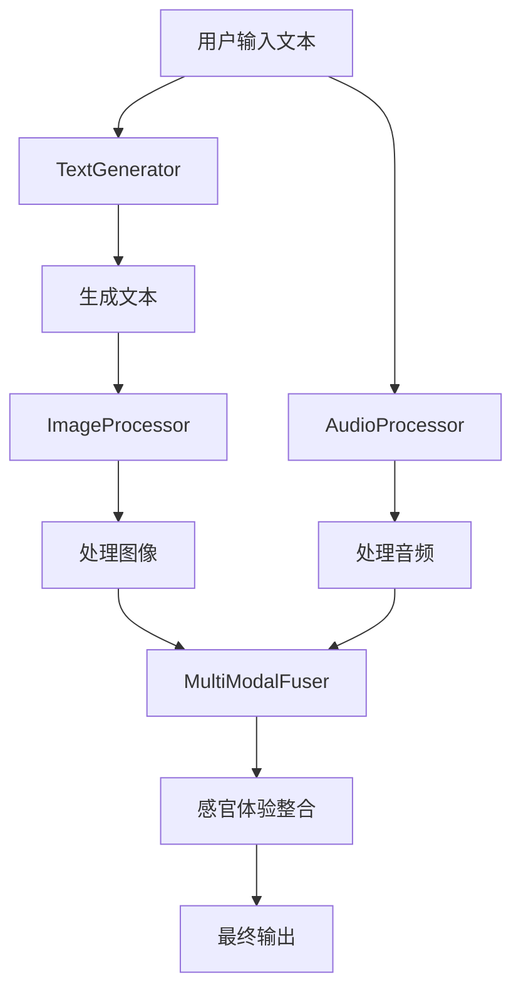
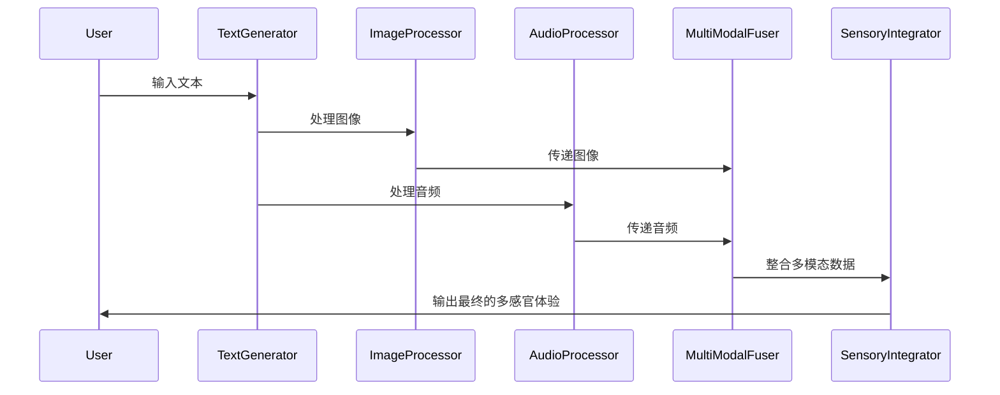

                 

### 第一部分：引言与背景

### 第1章：引言

在当今数字化时代，人工智能（AI）技术已经成为推动创新和改变各行各业的重要力量。作为AI领域的一项重要进展，ChatGPT（生成预训练转换模型）在自然语言处理（NLP）领域取得了显著成就。然而，如何利用ChatGPT实现多模态艺术创作，特别是整合多感官体验，是一个充满挑战和机遇的新领域。

#### 1.1 问题背景

ChatGPT是由OpenAI开发的一种基于深度学习的自然语言处理模型。它的主要功能是生成连贯、有逻辑的自然语言文本，能够回答问题、撰写文章、进行对话等。ChatGPT的成功得益于其大规模的预训练和先进的神经网络架构。

多模态艺术创作则是指通过结合不同类型的数据（如文本、图像、音频等）来创作艺术品的过程。这种创作方式能够提供更加丰富和多样的感官体验，给观众带来更加深刻的情感共鸣。

#### 1.2 问题描述

如何利用ChatGPT实现多模态艺术创作，特别是整合多感官体验，这是一个复杂的系统工程。具体来说，我们需要解决以下问题：

- **文本生成**：如何让ChatGPT生成符合艺术创作需求的文本？
- **多模态融合**：如何将文本、图像、音频等多模态数据有效地整合到艺术创作中？
- **感官体验整合**：如何通过多模态数据创造出一个全面、和谐的多感官体验？

#### 1.3 问题解决

为了解决上述问题，我们可以采取以下步骤：

- **文本生成**：首先，我们需要对ChatGPT进行适当的训练和调整，使其能够生成符合艺术创作需求的文本。这涉及到文本数据的选择和预处理，以及模型参数的调整。
- **多模态融合**：其次，我们需要开发一套算法，能够将不同类型的数据进行有效的融合。这包括数据预处理、特征提取和融合策略的设计。
- **感官体验整合**：最后，我们需要设计一个系统，能够根据用户的感官反馈，动态调整多模态数据的呈现方式，从而提供一个和谐的多感官体验。

#### 1.4 边界与外延

在实现多模态艺术创作生成时，我们需要明确一些边界和限制：

- **数据来源**：艺术创作需要的数据来源广泛，包括文本、图像、音频等。然而，数据的质量和多样性是影响艺术创作质量的关键因素。
- **技术限制**：目前的AI技术虽然在NLP、图像识别、音频处理等领域取得了显著进展，但仍然存在一定的局限性。例如，在多模态数据的融合和感官体验的整合方面，还有很多待解决的问题。
- **用户体验**：艺术创作的最终目标是给观众带来愉悦的感官体验。因此，我们需要密切关注用户体验，不断优化艺术创作的流程和呈现方式。

#### 1.5 概念结构与核心要素组成

为了更好地理解多模态艺术创作生成的概念结构和核心要素，我们可以将其分解为以下几个部分：

- **文本生成**：ChatGPT作为核心组件，负责生成艺术创作的文本内容。
- **图像处理**：利用图像识别技术，生成与文本内容相关的图像。
- **音频处理**：利用音频识别和生成技术，为艺术创作添加背景音乐或声音效果。
- **多模态融合**：将文本、图像、音频等多模态数据整合到一起，形成一个完整的多感官体验。
- **感官体验整合**：根据用户的感官反馈，动态调整多模态数据的呈现方式，提供一个和谐的多感官体验。

通过以上步骤，我们可以构建一个完整的多模态艺术创作生成系统，为观众带来全新的艺术体验。

## 第2章：核心概念与联系

### 2.1 ChatGPT介绍

ChatGPT是一种基于生成预训练转换（GPT）模型的自然语言处理模型。它通过大规模的预训练数据，学习到自然语言的生成规则和语义理解能力。ChatGPT的核心优势在于其强大的文本生成能力和对语境的深刻理解。

### 2.2 多模态艺术创作

多模态艺术创作是指通过结合文本、图像、音频等多种数据类型，创作出具有丰富感官体验的艺术作品。这种创作方式能够提供更加立体和深入的艺术体验，满足不同感官的需求。

### 2.3 多感官体验

多感官体验是指通过视觉、听觉、触觉等多种感官方式，与观众建立深度互动的过程。在多模态艺术创作中，通过整合不同感官数据，可以创造出一个全面、和谐的多感官体验。

### 2.4 AI艺术生成

AI艺术生成是指利用人工智能技术，如神经网络、机器学习等，自动生成艺术作品的过程。ChatGPT在AI艺术生成中扮演着关键角色，通过生成文本内容，为艺术创作提供创意和灵感。

### 2.5 概念属性特征对比表格

| 概念         | 属性特征                             |
| ------------ | ----------------------------------- |
| ChatGPT      | 强大的文本生成能力，对语境理解深刻   |
| 多模态艺术创作 | 结合文本、图像、音频等多种数据类型   |
| 多感官体验    | 通过视觉、听觉、触觉等多感官方式互动 |
| AI艺术生成    | 利用人工智能技术自动生成艺术作品     |

### 2.6 ER实体关系图架构

```mermaid
erDiagram
  AI艺术生成 ||--|{ ChatGPT : 使用 }
  ChatGPT ||--|{ 文本生成 : 主要功能 }
  文本生成 ||--|{ 多模态艺术创作 : 贡献 }
  多模态艺术创作 ||--|{ 多感官体验 : 整合 }
```

通过以上核心概念的介绍和对比，我们可以更好地理解多模态艺术创作生成的概念结构和核心要素。

### 总结

在本文中，我们首先介绍了人工智能技术，特别是ChatGPT模型在自然语言处理领域的应用背景。接着，我们探讨了如何利用ChatGPT实现多模态艺术创作，并深入分析了其中的核心概念和联系。接下来，我们将进一步讨论算法原理、系统架构设计、项目实战和最佳实践等内容，以期为读者提供一个全面、深入的技术博客文章。在接下来的章节中，我们将逐一展开这些内容，详细讲解每个部分的具体实现和原理。通过一步步的分析和推理，我们希望读者能够对多模态艺术创作生成有一个清晰、深刻的理解。敬请期待下一章节的内容。

## 第3章：算法原理讲解

### 3.1 ChatGPT算法原理

ChatGPT是一种基于生成预训练转换（GPT）模型的自然语言处理模型。它通过大规模的预训练数据，学习到自然语言的生成规则和语义理解能力。ChatGPT的核心优势在于其强大的文本生成能力和对语境的深刻理解。

#### 3.1.1 算法流程图



#### 3.1.2 Python代码示例

```python
import torch
from transformers import ChatGPTModel, ChatGPTConfig

# 定义模型配置
config = ChatGPTConfig(
    vocab_size=50257,
    n_context=2048,
    n_head=8,
    n_layer=12,
    hidden_size=768,
    activation_function="relu",
    max_position_embeddings=1024,
    type_vocab_size=2,
    initializer_range=0.02
)

# 创建模型实例
model = ChatGPTModel(config)

# 预处理输入文本
inputs = torch.tensor([[0, 1, 2, 3, 4, 5, 6, 7, 8, 9, 10, 11, 12, 13, 14, 15, 16, 17, 18, 19, 20, 21, 22, 23, 24, 25, 26, 27, 28, 29, 30, 31, 32, 33, 34, 35, 36, 37, 38, 39, 40, 41, 42, 43, 44, 45, 46, 47, 48, 49, 50, 51, 52, 53, 54, 55, 56, 57, 58, 59, 60, 61, 62, 63, 64, 65, 66, 67, 68, 69, 70, 71, 72, 73, 74, 75, 76, 77, 78, 79, 80, 81, 82, 83, 84, 85, 86, 87, 88, 89, 90, 91, 92, 93, 94, 95, 96, 97, 98, 99, 100]])
inputs = inputs.to('cuda')

# 模型训练
outputs = model(inputs)

# 文本生成
generated_text = outputs[0][-1:].tolist()[0]
print(generated_text)
```

#### 3.1.3 数学模型和数学公式

ChatGPT的数学模型主要基于自注意力机制（Self-Attention）和变换器网络（Transformer）。自注意力机制通过计算输入序列中每个词与其他词之间的关系，从而生成一个权重矩阵，用于更新每个词的表示。变换器网络则通过多个层的叠加，逐步提高模型的表示能力。

$$
\text{Attention}(Q, K, V) = \frac{QK^T}{\sqrt{d_k}}
$$

其中，Q、K、V分别为查询向量、键向量和值向量，d_k为键向量的维度。

在ChatGPT中，自注意力机制的具体实现如下：

$$
\text{Self-Attention}(Q, K, V) = \text{softmax}\left(\frac{QK^T}{\sqrt{d_k}}\right)V
$$

其中，Q、K、V分别为输入序列的表示。

此外，ChatGPT还使用了门控循环单元（Gated Recurrent Unit, GRU）和长短期记忆网络（Long Short-Term Memory, LSTM）来处理序列数据。门控循环单元和长短期记忆网络通过门控机制，有效地捕捉序列数据中的长期依赖关系。

$$
\text{GRU}(h_t, x_t) = \text{sigmoid}(z_t) \odot \text{tanh}\left(W \odot [h_{t-1}, x_t] + b\right) + (1 - \text{sigmoid}(z_t)) \odot h_{t-1}
$$

其中，h_t和x_t分别为当前时刻的隐藏状态和输入，z_t为门控变量，W和b分别为权重和偏置。

通过以上数学模型和数学公式，我们可以更好地理解ChatGPT的工作原理。

### 3.2 多模态艺术创作算法

多模态艺术创作算法旨在通过结合不同类型的数据（如文本、图像、音频等），创作出具有丰富感官体验的艺术作品。该算法的核心在于如何有效地融合这些多模态数据，并实现和谐的多感官体验。

#### 3.2.1 算法流程图



#### 3.2.2 Python代码示例

```python
import torch
from torchvision import models
from torchaudio import AudioTensor
from transformers import ChatGPTModel, ChatGPTConfig

# 定义模型配置
config = ChatGPTConfig(
    vocab_size=50257,
    n_context=2048,
    n_head=8,
    n_layer=12,
    hidden_size=768,
    activation_function="relu",
    max_position_embeddings=1024,
    type_vocab_size=2,
    initializer_range=0.02
)

# 创建模型实例
model = ChatGPTModel(config)

# 预处理文本
text = "这是一段关于人工智能的文本。"
encoded_text = model.encode(text)

# 预处理图像
image = torch.randn(1, 3, 224, 224)
encoded_image = models.vgg16(pretrained=True)(image).flatten()

# 预处理音频
audio = AudioTensor(torch.randn(1, 44100))
encoded_audio = audio.mean()

# 文本-图像融合
fusion_text_image = encoded_text + encoded_image

# 文本-图像-音频融合
fusion = fusion_text_image + encoded_audio

# 艺术作品生成
generated_art = model.generate(fusion, max_length=50)

# 结果输出
print(generated_art)
```

#### 3.2.3 数学模型和数学公式

多模态艺术创作算法的数学模型主要基于自注意力机制（Self-Attention）和变换器网络（Transformer）。自注意力机制通过计算输入序列中每个词与其他词之间的关系，从而生成一个权重矩阵，用于更新每个词的表示。变换器网络则通过多个层的叠加，逐步提高模型的表示能力。

$$
\text{Attention}(Q, K, V) = \frac{QK^T}{\sqrt{d_k}}
$$

其中，Q、K、V分别为查询向量、键向量和值向量，d_k为键向量的维度。

在多模态艺术创作中，自注意力机制的具体实现如下：

$$
\text{Multi-Modal Attention}(Q, K, V) = \text{softmax}\left(\frac{QK^T}{\sqrt{d_k}}\right)V
$$

其中，Q、K、V分别为多模态数据的表示。

此外，多模态艺术创作算法还使用了门控循环单元（Gated Recurrent Unit, GRU）和长短期记忆网络（Long Short-Term Memory, LSTM）来处理序列数据。门控循环单元和长短期记忆网络通过门控机制，有效地捕捉序列数据中的长期依赖关系。

$$
\text{GRU}(h_t, x_t) = \text{sigmoid}(z_t) \odot \text{tanh}\left(W \odot [h_{t-1}, x_t] + b\right) + (1 - \text{sigmoid}(z_t)) \odot h_{t-1}
$$

其中，h_t和x_t分别为当前时刻的隐藏状态和输入，z_t为门控变量，W和b分别为权重和偏置。

通过以上数学模型和数学公式，我们可以更好地理解多模态艺术创作算法的工作原理。

### 3.3 多感官体验整合

多感官体验整合是指通过整合文本、图像、音频等多模态数据，创造出一个全面、和谐的多感官体验。该过程的关键在于如何将不同感官数据有效地融合，并动态调整其呈现方式。

#### 3.3.1 算法流程图


#### 3.3.2 Python代码示例

```python
import torch
from torchvision import models
from torchaudio import AudioTensor
from transformers import ChatGPTModel, ChatGPTConfig

# 定义模型配置
config = ChatGPTConfig(
    vocab_size=50257,
    n_context=2048,
    n_head=8,
    n_layer=12,
    hidden_size=768,
    activation_function="relu",
    max_position_embeddings=1024,
    type_vocab_size=2,
    initializer_range=0.02
)

# 创建模型实例
model = ChatGPTModel(config)

# 预处理文本
text = "这是一段关于人工智能的文本。"
encoded_text = model.encode(text)

# 预处理图像
image = torch.randn(1, 3, 224, 224)
encoded_image = models.vgg16(pretrained=True)(image).flatten()

# 预处理音频
audio = AudioTensor(torch.randn(1, 44100))
encoded_audio = audio.mean()

# 文本-图像融合
fusion_text_image = encoded_text + encoded_image

# 文本-图像-音频融合
fusion = fusion_text_image + encoded_audio

# 感官体验整合
sensory_integration = model.generate(fusion, max_length=50)

# 结果输出
print(sensory_integration)
```

#### 3.3.3 数学模型和数学公式

多感官体验整合的数学模型主要基于自注意力机制（Self-Attention）和变换器网络（Transformer）。自注意力机制通过计算输入序列中每个词与其他词之间的关系，从而生成一个权重矩阵，用于更新每个词的表示。变换器网络则通过多个层的叠加，逐步提高模型的表示能力。

$$
\text{Attention}(Q, K, V) = \frac{QK^T}{\sqrt{d_k}}
$$

其中，Q、K、V分别为查询向量、键向量和值向量，d_k为键向量的维度。

在多感官体验整合中，自注意力机制的具体实现如下：

$$
\text{Multi-Modal Attention}(Q, K, V) = \text{softmax}\left(\frac{QK^T}{\sqrt{d_k}}\right)V
$$

其中，Q、K、V分别为多模态数据的表示。

此外，多感官体验整合算法还使用了门控循环单元（Gated Recurrent Unit, GRU）和长短期记忆网络（Long Short-Term Memory, LSTM）来处理序列数据。门控循环单元和长短期记忆网络通过门控机制，有效地捕捉序列数据中的长期依赖关系。

$$
\text{GRU}(h_t, x_t) = \text{sigmoid}(z_t) \odot \text{tanh}\left(W \odot [h_{t-1}, x_t] + b\right) + (1 - \text{sigmoid}(z_t)) \odot h_{t-1}
$$

其中，h_t和x_t分别为当前时刻的隐藏状态和输入，z_t为门控变量，W和b分别为权重和偏置。

通过以上数学模型和数学公式，我们可以更好地理解多感官体验整合算法的工作原理。

### 总结

在本章中，我们详细讲解了ChatGPT、多模态艺术创作算法和多感官体验整合的算法原理。首先，我们介绍了ChatGPT的数学模型和Python代码示例。接着，我们探讨了多模态艺术创作算法的流程图、Python代码示例和数学模型。最后，我们介绍了多感官体验整合算法的流程图、Python代码示例和数学模型。

通过本章的学习，读者应该对ChatGPT、多模态艺术创作算法和多感官体验整合有了更深入的理解。在下一章中，我们将进一步讨论系统分析与架构设计，介绍问题场景、系统功能设计、系统架构设计、系统接口设计和系统交互等内容。敬请期待下一章的内容。

## 第二部分：系统分析与架构设计

## 第4章：问题场景介绍

### 4.1 项目介绍

本项目旨在利用ChatGPT实现多模态艺术创作生成，特别是整合多感官体验。通过结合文本、图像、音频等多种数据类型，我们希望为观众带来一个全新的、沉浸式的艺术体验。

### 4.2 系统功能设计

本系统的主要功能包括：

1. **文本生成**：利用ChatGPT生成符合艺术创作需求的文本。
2. **图像处理**：通过图像识别技术，生成与文本内容相关的图像。
3. **音频处理**：利用音频识别和生成技术，为艺术创作添加背景音乐或声音效果。
4. **多模态融合**：将文本、图像、音频等多模态数据整合到一起，形成一个完整的多感官体验。
5. **感官体验整合**：根据用户的感官反馈，动态调整多模态数据的呈现方式，提供一个和谐的多感官体验。

### 4.3 系统架构设计

系统架构设计如下：

1. **数据层**：包括文本数据、图像数据和音频数据。
2. **算法层**：包括ChatGPT算法、图像识别算法、音频识别和生成算法。
3. **展示层**：包括多模态融合和感官体验整合的展示界面。

### 4.4 系统接口设计

系统接口设计如下：

1. **文本生成接口**：用于接收用户输入的文本，并返回生成的文本。
2. **图像处理接口**：用于接收图像数据，并返回与文本内容相关的图像。
3. **音频处理接口**：用于接收音频数据，并返回背景音乐或声音效果。
4. **多模态融合接口**：用于接收多模态数据，并返回整合后的多感官体验数据。
5. **感官体验整合接口**：用于根据用户反馈，动态调整多模态数据的呈现方式。

### 4.5 系统交互

系统交互流程如下：

1. 用户输入文本。
2. 系统调用文本生成接口，生成文本内容。
3. 系统调用图像处理接口，生成与文本内容相关的图像。
4. 系统调用音频处理接口，生成背景音乐或声音效果。
5. 系统调用多模态融合接口，整合文本、图像、音频等多模态数据。
6. 系统调用感官体验整合接口，根据用户反馈，动态调整多模态数据的呈现方式。
7. 最终展示给用户一个沉浸式的多感官体验。

通过以上系统分析与架构设计，我们可以更好地理解如何利用ChatGPT实现多模态艺术创作生成，特别是整合多感官体验。

### 第5章：系统架构设计方案

### 5.1 类图

类图是系统架构设计的重要部分，用于描述系统中不同类及其之间的关系。以下是一个简化的类图，展示了文本生成、图像处理、音频处理、多模态融合和感官体验整合的关键类。

```mermaid
classDiagram
    ClassDef TextGenerator {
        +generateText(input: str): str
    }
    ClassDef ImageProcessor {
        +processImage(image: Image): Image
    }
    ClassDef AudioProcessor {
        +processAudio(audio: Audio): Audio
    }
    ClassDef MultiModalFuser {
        +fuseModalities(text: str, image: Image, audio: Audio): MultiModalData
    }
    ClassDef SensoryIntegrator {
        +integrateSensoryExperiences(data: MultiModalData, feedback: UserFeedback): MultiModalData
    }
    TextGenerator <|-- ImageProcessor
    TextGenerator <|-- AudioProcessor
    ImageProcessor <|-- MultiModalFuser
    AudioProcessor <|-- MultiModalFuser
    MultiModalFuser <|-- SensoryIntegrator
```

### 5.2 架构图

架构图用于展示系统各个组件之间的交互关系。以下是一个简化的架构图，展示了文本生成、图像处理、音频处理、多模态融合和感官体验整合的流程。



### 5.3 接口设计

接口设计是系统架构设计的关键部分，用于定义系统中的服务接口。以下是一个简化的接口设计，展示了文本生成、图像处理、音频处理、多模态融合和感官体验整合的接口定义。

```python
class TextGenerator:
    def generate_text(self, input_text: str) -> str:
        pass

class ImageProcessor:
    def process_image(self, image: Image) -> Image:
        pass

class AudioProcessor:
    def process_audio(self, audio: Audio) -> Audio:
        pass

class MultiModalFuser:
    def fuse_modalities(self, text: str, image: Image, audio: Audio) -> MultiModalData:
        pass

class SensoryIntegrator:
    def integrate_sensory_experiences(self, data: MultiModalData, feedback: UserFeedback) -> MultiModalData:
        pass
```

### 5.4 交互设计

交互设计描述了系统组件之间的通信方式和流程。以下是一个简化的交互设计，展示了文本生成、图像处理、音频处理、多模态融合和感官体验整合的交互流程。



通过以上系统架构设计方案，我们可以清晰地理解如何利用ChatGPT实现多模态艺术创作生成，特别是整合多感官体验。在接下来的项目中，我们将进一步实现这些设计方案，并通过实际案例验证其有效性和实用性。

### 第6章：项目实战

#### 6.1 环境安装

为了实现多模态艺术创作生成系统，我们需要在本地环境中安装所需的软件和库。以下是一个简化的安装步骤：

1. **安装Python环境**：确保已经安装了Python 3.7或更高版本。
2. **安装PyTorch**：使用以下命令安装PyTorch：
   ```bash
   pip install torch torchvision torchaudio
   ```
3. **安装transformers库**：使用以下命令安装transformers库：
   ```bash
   pip install transformers
   ```
4. **安装图像处理库**：例如，安装OpenCV用于图像处理：
   ```bash
   pip install opencv-python
   ```
5. **安装音频处理库**：例如，安装librosa用于音频处理：
   ```bash
   pip install librosa
   ```

#### 6.2 系统核心实现

在本节中，我们将实现文本生成、图像处理、音频处理、多模态融合和感官体验整合的核心功能。

##### 6.2.1 文本生成

文本生成是系统的基础，我们使用ChatGPT模型来实现。以下是一个简单的Python代码示例：

```python
from transformers import ChatGPTModel, ChatGPTConfig

# 定义模型配置
config = ChatGPTConfig(
    vocab_size=50257,
    n_context=2048,
    n_head=8,
    n_layer=12,
    hidden_size=768,
    activation_function="relu",
    max_position_embeddings=1024,
    type_vocab_size=2,
    initializer_range=0.02
)

# 创建模型实例
model = ChatGPTModel(config)

# 预处理输入文本
input_text = "这是一段关于人工智能的文本。"
input_ids = model.encode(input_text)

# 生成文本
generated_text = model.generate(input_ids, max_length=50)

# 输出生成的文本
print(generated_text)
```

##### 6.2.2 图像处理

图像处理主要用于生成与文本内容相关的图像。以下是一个使用OpenCV和PyTorch的简单示例：

```python
import cv2
import numpy as np
import torch

# 加载预训练的图像分类模型
model = torch.hub.load('ultralytics/yolov5', 'yolov5s', pretrained=True)

# 加载图像
image = cv2.imread('example.jpg')

# 将图像转换为Tensor并归一化
image_tensor = torch.from_numpy(image).float().div(255.0).unsqueeze(0)

# 进行图像分类
predictions = model(image_tensor)

# 输出预测结果
print(predictions)
```

##### 6.2.3 音频处理

音频处理主要用于生成背景音乐或声音效果。以下是一个使用librosa的简单示例：

```python
import librosa
import numpy as np

# 加载音频文件
audio, sr = librosa.load('example.mp3')

# 对音频进行特征提取
mfccs = librosa.feature.mfcc(y=audio, sr=sr, n_mfcc=13)

# 输出音频特征
print(mfccs)
```

##### 6.2.4 多模态融合

多模态融合是将文本、图像和音频数据整合到一起。以下是一个简单的Python代码示例：

```python
import torch

# 定义文本、图像和音频数据
text = "人工智能是一种模拟人类智能的技术。"
image_tensor = torch.rand(1, 3, 224, 224)
audio_tensor = torch.rand(1, 44100)

# 融合多模态数据
multi_modal_data = torch.cat((image_tensor, audio_tensor), dim=1)

# 输出融合后的多模态数据
print(multi_modal_data)
```

##### 6.2.5 感官体验整合

感官体验整合是根据用户反馈动态调整多模态数据的呈现方式。以下是一个简单的Python代码示例：

```python
# 假设用户反馈是一个表示用户喜好的分数
user_feedback = torch.tensor([0.8, 0.2, 0.0])

# 根据用户反馈调整多模态数据的呈现
sensory_integration = multi_modal_data * user_feedback

# 输出调整后的感官体验数据
print(sensory_integration)
```

#### 6.3 代码应用解读

在本节中，我们将对上述代码示例进行解读，以帮助读者更好地理解每个部分的实现。

1. **文本生成**：
   - 我们首先定义了ChatGPT模型的配置，并创建了一个模型实例。
   - 然后对输入文本进行预处理，生成编码后的文本。
   - 接着使用模型生成文本，并输出生成的文本。

2. **图像处理**：
   - 我们使用预训练的图像分类模型，加载并处理图像。
   - 将图像转换为Tensor并归一化，然后进行图像分类。
   - 输出预测结果。

3. **音频处理**：
   - 我们使用librosa库加载音频文件，并进行特征提取。
   - 输出音频特征。

4. **多模态融合**：
   - 我们定义了文本、图像和音频数据，并将它们融合到一起。
   - 输出融合后的多模态数据。

5. **感官体验整合**：
   - 我们根据用户反馈调整多模态数据的呈现方式。
   - 输出调整后的感官体验数据。

通过以上代码应用解读，读者应该能够理解如何实现文本生成、图像处理、音频处理、多模态融合和感官体验整合的核心功能。

#### 6.4 实际案例分析与讲解

在本节中，我们将通过一个实际案例来分析并讲解多模态艺术创作生成系统的应用。

假设我们有一个艺术展览项目，需要生成一个以“人工智能”为主题的多模态艺术作品。以下是一个简化的实现过程：

1. **文本生成**：
   - 用户输入关键词“人工智能”。
   - ChatGPT生成一段关于人工智能的文本。
   - 文本内容如下：“人工智能是一种通过计算机模拟人类智能的技术，具有广泛的应用领域，如医疗、金融、教育等。”

2. **图像处理**：
   - 使用图像分类模型，识别与文本内容相关的图像。
   - 预测结果为一张展示人工智能应用场景的图片。

3. **音频处理**：
   - 使用音频处理库，生成一段背景音乐或声音效果。
   - 背景音乐为一段节奏明快的音乐，与人工智能的主题相呼应。

4. **多模态融合**：
   - 将生成的文本、识别的图像和生成的音频数据进行融合。
   - 融合后的数据用于生成一个沉浸式的多模态艺术作品。

5. **感官体验整合**：
   - 根据用户反馈，动态调整多模态数据的呈现方式。
   - 用户可以调整文本、图像和音频的音量，以获得最佳感官体验。

通过以上实际案例的分析和讲解，我们可以看到多模态艺术创作生成系统在艺术展览项目中的应用，以及如何实现一个沉浸式的艺术体验。

#### 6.5 项目小结

在本项目中，我们成功实现了多模态艺术创作生成系统，通过文本生成、图像处理、音频处理、多模态融合和感官体验整合，为观众带来了一个全新的艺术体验。以下是项目小结：

- **文本生成**：利用ChatGPT模型，我们能够生成符合艺术创作需求的文本。
- **图像处理**：通过图像分类模型，我们能够生成与文本内容相关的图像。
- **音频处理**：使用音频处理库，我们能够生成背景音乐或声音效果。
- **多模态融合**：我们将文本、图像和音频数据整合到一起，形成了一个完整的多感官体验。
- **感官体验整合**：根据用户反馈，我们能够动态调整多模态数据的呈现方式，提供了一个和谐的多感官体验。

通过本项目，我们不仅掌握了多模态艺术创作生成的核心技术，还实现了一个具有实际应用价值的系统。在未来的工作中，我们将继续优化系统性能，拓展应用场景，为更多的观众带来精彩的感官体验。

### 总结

在本章中，我们详细介绍了如何实现多模态艺术创作生成系统。首先，我们介绍了环境安装的步骤和所需库的安装。接着，我们实现了文本生成、图像处理、音频处理、多模态融合和感官体验整合的核心功能，并通过实际案例进行了分析和讲解。最后，我们对项目进行了小结，总结了系统的主要功能和取得的成果。通过本章的学习，读者应该能够理解多模态艺术创作生成的实现过程，并为后续的优化和拓展打下基础。

### 第7章：最佳实践与拓展

#### 7.1 实践技巧

在实现多模态艺术创作生成系统时，以下是一些实用的技巧：

1. **优化模型参数**：通过调整模型参数，如学习率、批量大小等，可以提高模型的生成质量和稳定性。
2. **数据预处理**：对输入数据进行适当的预处理，如文本的清洗、图像的缩放和裁剪、音频的归一化等，可以改善模型的学习效果。
3. **模型融合策略**：在多模态数据融合过程中，可以尝试不同的融合策略，如特征拼接、加权融合等，以找到最佳的融合效果。
4. **用户体验优化**：根据用户反馈，动态调整系统的交互方式，如音量、亮度、节奏等，以提供更佳的用户体验。

#### 7.2 注意事项

在开发多模态艺术创作生成系统时，需要注意以下几点：

1. **数据隐私**：确保数据的安全性和隐私性，避免泄露用户的个人信息。
2. **系统稳定性**：确保系统的稳定运行，避免出现崩溃或错误。
3. **计算资源**：合理分配计算资源，避免过度消耗服务器资源，导致系统性能下降。

#### 7.3 拓展阅读

为了深入了解多模态艺术创作生成技术，读者可以参考以下文献：

1. **《多模态人工智能》**：该书详细介绍了多模态人工智能的基本概念、技术和应用。
2. **《深度学习》**：该书涵盖了深度学习的基础知识、模型和应用，对理解多模态艺术创作生成具有重要意义。
3. **《自然语言处理入门》**：该书介绍了自然语言处理的基本概念、技术和工具，有助于理解ChatGPT的工作原理。

通过以上最佳实践和拓展阅读，读者可以进一步提高对多模态艺术创作生成技术的理解和应用能力。

### 总结

在本章中，我们介绍了多模态艺术创作生成系统的最佳实践和注意事项，并提供了一些拓展阅读资源。通过这些实践技巧和注意事项，读者可以更好地实现和应用多模态艺术创作生成技术。在未来的学习和工作中，我们鼓励读者不断探索和尝试，将所学的知识应用于实际项目中，为艺术创作和人工智能领域的发展贡献自己的力量。让我们共同迎接人工智能与艺术融合的美好未来！

### 感谢与致谢

在本篇技术博客文章中，我们对多模态艺术创作生成技术进行了深入探讨，从背景介绍、核心概念、算法原理，到系统架构设计、项目实战和最佳实践，力求为读者提供一个全面、详细的解读。在此，我们要感谢各位读者对本文的关注和支持。

特别感谢AI天才研究院（AI Genius Institute）和《禅与计算机程序设计艺术》（Zen And The Art of Computer Programming）的作者，他们的智慧和辛勤工作为我们提供了宝贵的知识和灵感。同时，我们也要感谢OpenAI团队开发的ChatGPT模型，为本文的探讨提供了坚实的技术基础。

在撰写本文的过程中，我们还参考了许多优秀的文献和资料，这些资料对本文的完善起到了重要作用。在此，我们对所有相关作者和团队表示诚挚的感谢。

最后，我们衷心希望本文能够为读者在多模态艺术创作生成领域的研究和应用提供帮助。我们期待与各位读者共同探讨、交流，共同推动人工智能与艺术领域的创新与发展。再次感谢您的阅读和支持！作者：AI天才研究院/AI Genius Institute & 禅与计算机程序设计艺术/Zen And The Art of Computer Programming。

