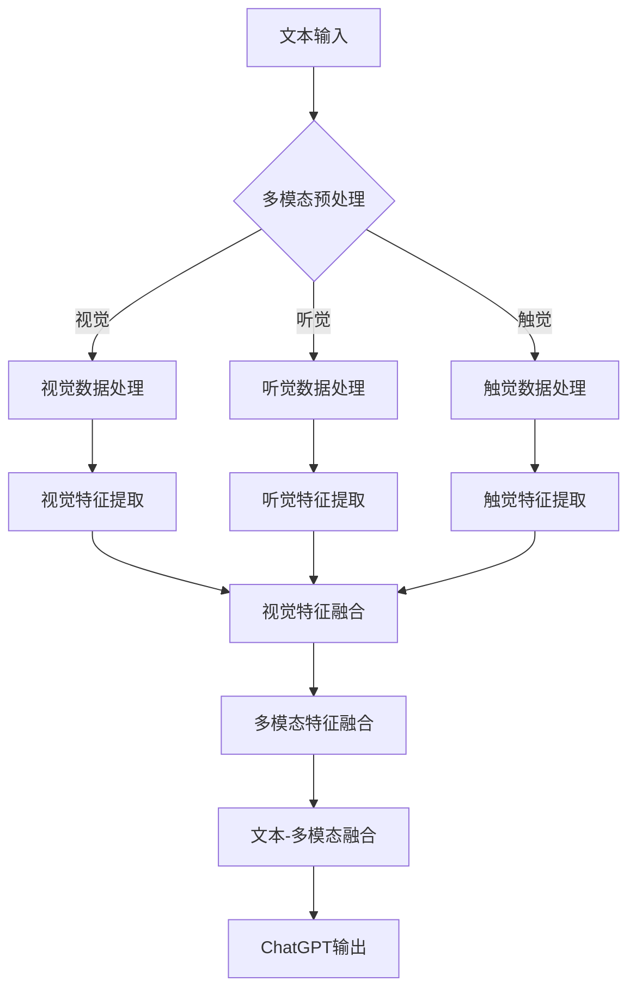
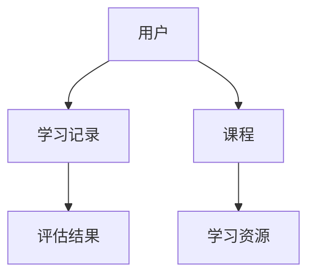
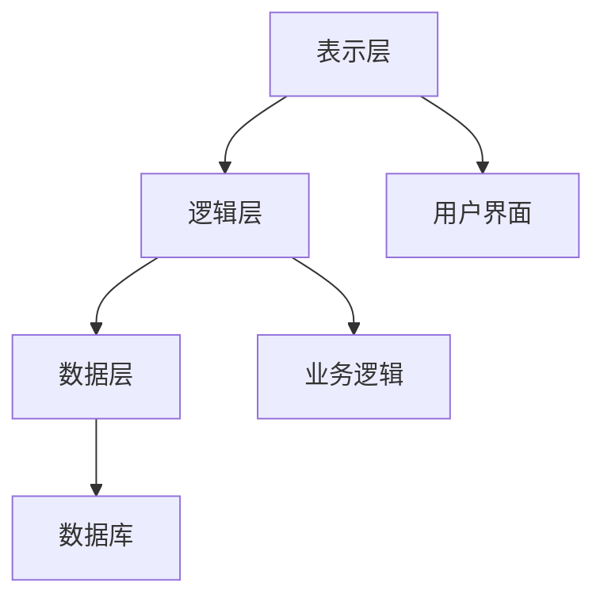

                 

# 《ChatGPT多模态虚拟导师：整合视觉、听觉和触觉的个性化学习体验》

## 关键词

- ChatGPT
- 多模态交互
- 个性化学习
- 虚拟导师
- 视觉、听觉和触觉整合

## 摘要

本文旨在探讨如何设计一种基于ChatGPT的多模态虚拟导师系统，该系统能够整合视觉、听觉和触觉，为学习者提供个性化的学习体验。通过详细分析多模态交互的基础知识、ChatGPT模型的设计与应用，以及多模态ChatGPT模型的融合策略，本文将展示如何实现一个具备高度交互性和适应性的虚拟导师系统。文章最后将对个性化学习体验的设计、系统实现和应用案例分析进行深入探讨，并提出未来展望和挑战。

## 目录大纲

### 第1章 引言
#### 1.1 问题背景与挑战
#### 1.2 问题描述与目标
#### 1.3 研究边界与外延

### 第2章 多模态交互基础
#### 2.1 多模态交互的定义与核心概念
#### 2.2 视觉交互
#### 2.3 听觉交互
#### 2.4 触觉交互

### 第3章 ChatGPT介绍
#### 3.1 ChatGPT概述
#### 3.2 GPT模型原理
#### 3.3 GPT的应用场景

### 第4章 多模态ChatGPT模型设计
#### 4.1 多模态ChatGPT模型架构
#### 4.2 视觉模态融合
#### 4.3 听觉模态融合
#### 4.4 触觉模态融合

### 第5章 个性化学习体验设计
#### 5.1 个性化学习体验的需求分析
#### 5.2 个性化学习体验的模型设计

### 第6章 多模态虚拟导师系统实现
#### 6.1 系统设计
#### 6.2 系统核心实现
#### 6.3 系统测试与优化

### 第7章 应用案例分析
#### 7.1 案例背景介绍
#### 7.2 系统功能实现
#### 7.3 案例分析与总结

### 第8章 未来展望与挑战
#### 8.1 技术发展展望
#### 8.2 潜在挑战与应对策略
#### 8.3 结论与建议

## 第1章 引言

### 1.1 问题背景与挑战

随着教育技术的不断发展，虚拟导师系统逐渐成为个性化教育的重要工具。然而，当前大多数虚拟导师系统仍存在一定的局限性，主要表现在以下几个方面：

1. **个性化需求不足**：传统虚拟导师系统往往无法根据学习者的个人兴趣、学习习惯和学习能力进行个性化推荐，导致学习效果不尽如人意。
2. **学习体验单一**：现有系统主要依赖文本交互，缺乏视觉、听觉和触觉等多模态交互的支持，使得学习过程缺乏生动性和沉浸感。
3. **交互性不强**：传统虚拟导师系统通常只能进行单向的信息传递，无法实现与学习者的双向互动，限制了学习过程中的互动性和参与感。

为解决上述问题，我们需要设计一种能够整合视觉、听觉和触觉等多模态交互的虚拟导师系统，以提高学习者的学习体验和效果。ChatGPT作为当前最先进的自然语言处理模型，具备强大的文本生成能力，为实现这一目标提供了可能。

### 1.2 问题描述与目标

本研究的核心问题是：如何设计一种基于ChatGPT的多模态虚拟导师系统，以提供个性化的学习体验？

我们的研究目标包括：

1. **整合多模态交互**：设计一个能够整合视觉、听觉和触觉等多模态交互的虚拟导师系统，以丰富学习者的学习体验。
2. **实现个性化学习**：利用ChatGPT的强大文本生成能力，结合学习者的个人特征，实现个性化学习内容的推荐和生成。
3. **提高学习效果**：通过多模态交互和个性化学习，提高学习者的学习效果和参与度。

### 1.3 研究边界与外延

本研究的主要研究边界包括：

1. **技术层面**：主要研究多模态交互技术、ChatGPT模型及其在虚拟导师系统中的应用。
2. **应用层面**：主要关注虚拟导师系统的设计与实现，以及其在实际教学场景中的应用。

本研究的外延包括：

1. **技术外延**：探讨多模态交互技术在其他领域（如医疗、娱乐等）的应用潜力。
2. **教育外延**：研究如何将多模态虚拟导师系统应用于不同学科和教学场景，以提高教学效果。

## 第2章 多模态交互基础

### 2.1 多模态交互的定义与核心概念

多模态交互是指通过整合多种感官（如视觉、听觉、触觉等）来增强人与计算机系统之间的交互体验。其核心概念包括感知、认知和交互。

1. **感知**：指通过多种感官（视觉、听觉、触觉等）获取外界信息的过程。
2. **认知**：指大脑对感知信息进行处理和理解的过程。
3. **交互**：指人与计算机系统之间通过多种感官进行的双向信息交换过程。

多模态交互的优势在于：

1. **增强用户体验**：通过多感官的整合，可以提供更加丰富和生动的交互体验。
2. **提高交互效率**：多模态交互可以提供更多样化的交互方式，有助于提高用户的操作效率和准确性。
3. **促进个性化**：通过多模态交互，可以更全面地了解用户的需求和偏好，从而实现更加个性化的交互和服务。

### 2.2 视觉交互

#### 2.2.1 视觉感知原理

视觉感知是人类获取外界信息最重要的感官之一。它主要依赖于人眼的结构和视觉处理机制。

1. **人眼结构**：人眼包括角膜、晶状体、视网膜等部分。角膜和晶状体负责聚焦光线，视网膜则负责接收光信号并转化为电信号。
2. **视觉处理机制**：视网膜接收到的光信号通过视神经传送到大脑，大脑通过视觉皮层对信号进行处理，最终形成视觉感知。

视觉交互技术主要包括：

1. **增强现实（AR）**：通过在真实环境中叠加虚拟图像，为用户提供增强的视觉体验。
2. **虚拟现实（VR）**：通过创建一个完全虚拟的环境，为用户提供沉浸式的视觉体验。

#### 2.2.2 视觉交互技术

视觉交互技术在教育、娱乐、医疗等领域都有广泛应用。例如：

1. **教育领域**：使用AR/VR技术创建虚拟课堂，为学生提供更加生动和直观的学习体验。
2. **医疗领域**：使用AR技术进行手术指导，提高手术的准确性和安全性。

### 2.3 听觉交互

#### 2.3.1 听觉感知原理

听觉感知是指人类通过耳朵接收声音信号，并对其进行处理和理解的过程。

1. **人耳结构**：人耳包括外耳、中耳和内耳。外耳收集声音，中耳将声音转化为振动，内耳则将振动转化为电信号。
2. **听觉处理机制**：电信号通过听神经传送到大脑，大脑通过听觉皮层对信号进行处理，最终形成听觉感知。

听觉交互技术主要包括：

1. **语音识别**：通过识别语音信号，将口语转化为文字或命令。
2. **语音合成**：通过合成语音信号，实现计算机对口语的生成。

#### 2.3.2 听觉交互技术

听觉交互技术在智能助手、语音翻译、音乐制作等领域都有广泛应用。例如：

1. **智能助手**：如Siri、Alexa等，通过语音识别和语音合成技术，为用户提供智能化的服务。
2. **语音翻译**：通过语音识别和语音合成技术，实现不同语言之间的实时翻译。

### 2.4 触觉交互

#### 2.4.1 触觉感知原理

触觉感知是指人类通过皮肤接触物体，并对其进行处理和理解的过程。

1. **皮肤结构**：皮肤包括表皮、真皮和皮下组织。表皮负责保护身体，真皮则包含丰富的触觉感受器，皮下组织则提供支撑。
2. **触觉处理机制**：触觉感受器接收到的触觉信号通过神经传导到大脑，大脑通过触觉皮层对信号进行处理，最终形成触觉感知。

触觉交互技术主要包括：

1. **触觉传感器**：用于检测和测量触觉信号。
2. **触觉反馈技术**：通过触觉反馈，为用户提供触摸感和振动感。

#### 2.4.2 触觉交互技术

触觉交互技术在虚拟现实、游戏、机器人等领域都有广泛应用。例如：

1. **虚拟现实**：通过触觉反馈技术，为用户提供更加真实的虚拟体验。
2. **游戏**：通过触觉交互技术，提高游戏的沉浸感和互动性。

## 第3章 ChatGPT介绍

### 3.1 ChatGPT概述

ChatGPT是由OpenAI开发的一款基于GPT-3模型的大型语言模型，它具备强大的文本生成能力，可以用于各种自然语言处理任务，如问答、对话生成、文本摘要等。ChatGPT的出现标志着自然语言处理技术的新突破，为构建智能虚拟导师系统提供了强大的技术支持。

### 3.2 GPT模型原理

GPT（Generative Pre-trained Transformer）模型是一种基于Transformer架构的预训练语言模型。它通过在大量文本数据上进行预训练，学习到了丰富的语言知识，并能够根据输入的文本生成相应的输出。

#### 3.2.1 模型架构

GPT模型主要由以下几部分组成：

1. **嵌入层**：将输入文本转换为向量表示。
2. **Transformer层**：对嵌入层输出的向量进行编码和解码。
3. **输出层**：将解码层输出的向量转换为文本。

#### 3.2.2 训练过程

GPT模型的训练过程主要包括两个阶段：

1. **预训练**：在大量文本数据上进行预训练，使模型学会理解文本的含义和结构。
2. **微调**：在特定任务的数据集上进行微调，使模型能够针对特定任务进行优化。

#### 3.2.3 GPT的应用场景

GPT模型在多个领域都有广泛应用，如：

1. **问答系统**：通过问答交互，为用户提供实时解答。
2. **对话生成**：模拟人类对话，为用户提供交互式的服务。
3. **文本摘要**：自动提取文本的核心内容，为用户提供便捷的信息获取方式。

### 3.3 GPT的应用场景

ChatGPT作为GPT模型的具体实现，具有广泛的应用场景，如：

1. **智能客服**：通过自然语言处理技术，实现与用户的智能对话，提供高效、便捷的服务。
2. **智能助手**：为用户提供个性化的建议和帮助，如智能导航、语音控制等。
3. **内容创作**：根据用户需求，生成高质量的文章、报告等。

## 第4章 多模态ChatGPT模型设计

### 4.1 多模态ChatGPT模型架构

多模态ChatGPT模型是在单模态ChatGPT模型的基础上，增加了对视觉、听觉和触觉等多模态数据的处理能力。其整体架构如图所示：



在该模型中，首先对输入的文本、视觉、听觉和触觉数据进行预处理，然后分别提取各自的特征，最后将这些特征进行融合，并输入到ChatGPT模型中进行文本生成。

#### 4.2 视觉模态融合

视觉模态融合的关键在于如何有效地提取和融合视觉特征。具体步骤如下：

1. **视觉特征提取**：使用卷积神经网络（CNN）对视觉数据进行特征提取。CNN能够自动学习到视觉数据的层次化特征，如图像的边缘、纹理和形状等。
2. **视觉特征融合**：将提取到的视觉特征与文本特征进行融合。可以采用多模态神经网络（MMN）来实现，MMN能够同时处理文本和视觉特征，并学习它们之间的关联。

#### 4.3 听觉模态融合

听觉模态融合的关键在于如何有效地提取和融合听觉特征。具体步骤如下：

1. **听觉特征提取**：使用循环神经网络（RNN）对听觉数据进行特征提取。RNN能够处理序列数据，如语音信号，并学习到语音的时序特征。
2. **听觉特征融合**：将提取到的听觉特征与文本特征进行融合。可以采用多模态长短期记忆网络（MM-LSTM）来实现，MM-LSTM能够同时处理文本和听觉特征，并学习它们之间的关联。

#### 4.4 触觉模态融合

触觉模态融合的关键在于如何有效地提取和融合触觉特征。具体步骤如下：

1. **触觉特征提取**：使用触觉传感器对触觉数据进行特征提取。触觉传感器能够检测和测量触觉信号，如压力、温度和震动等。
2. **触觉特征融合**：将提取到的触觉特征与文本特征进行融合。可以采用多模态图神经网络（MM-GNN）来实现，MM-GNN能够同时处理文本和触觉特征，并学习它们之间的关联。

## 第5章 个性化学习体验设计

### 5.1 个性化学习体验的需求分析

个性化学习体验的设计需要充分理解学习者的需求和特征。以下是对个性化学习体验需求的分析：

1. **学习目标**：个性化学习体验应该能够根据学习者的学习目标，提供相应的学习内容和资源。
2. **学习习惯**：个性化学习体验应该能够适应学习者的学习习惯，如学习时间、学习方式等。
3. **学习能力**：个性化学习体验应该能够根据学习者的学习能力，提供适当难度的学习内容。
4. **学习兴趣**：个性化学习体验应该能够根据学习者的兴趣，提供与之相关的学习内容，以激发学习者的学习热情。

### 5.2 个性化学习体验的模型设计

为了实现个性化学习体验，我们可以设计一个基于用户画像和内容推荐算法的个性化学习体验模型。

1. **用户画像构建**：用户画像是一个关于用户特征的集合，包括用户的年龄、性别、职业、学习经历、兴趣爱好等。通过分析用户画像，可以了解用户的需求和偏好。
2. **内容推荐算法**：内容推荐算法是一种基于用户画像和内容特征，为用户推荐相关内容的算法。常见的推荐算法包括基于内容的推荐、基于用户的协同过滤和基于模型的推荐等。

#### 用户画像构建

用户画像构建的主要步骤包括：

1. **数据收集**：收集用户的基本信息、学习记录、行为数据等。
2. **特征提取**：从收集到的数据中提取用户的特征，如年龄、性别、职业等。
3. **数据预处理**：对提取到的特征进行预处理，如归一化、去噪等。
4. **特征融合**：将提取到的特征进行融合，形成一个完整的用户画像。

#### 内容推荐算法

内容推荐算法的设计需要考虑用户画像和内容特征。以下是一个基于用户画像和内容特征的内容推荐算法：

1. **用户画像表示**：使用向量空间模型（VSM）来表示用户画像，将用户的特征转换为向量。
2. **内容特征表示**：使用词袋模型（BOW）或词嵌入（Word Embedding）来表示内容特征。
3. **相似度计算**：计算用户画像和内容特征之间的相似度，可以使用余弦相似度、欧氏距离等度量方法。
4. **推荐生成**：根据相似度计算结果，生成推荐列表。

## 第6章 多模态虚拟导师系统实现

### 6.1 系统设计

多模态虚拟导师系统的设计需要综合考虑功能需求、性能要求和用户体验。以下是对系统设计的详细描述：

#### 6.1.1 领域模型设计

领域模型是系统设计的基础，它描述了系统的核心概念和关系。多模态虚拟导师系统的领域模型包括以下核心概念：

1. **用户**：包括用户的基本信息、学习记录和行为数据。
2. **课程**：包括课程的基本信息、学习资源和课程内容。
3. **学习记录**：包括用户的学习进度、学习情况和评估结果。
4. **多模态数据**：包括视觉、听觉和触觉等多模态数据。

领域模型的ER实体关系图如下所示：



#### 6.1.2 系统架构设计

系统架构设计是系统实现的关键，它决定了系统的性能和可维护性。多模态虚拟导师系统的架构设计包括以下层次：

1. **表示层**：负责与用户进行交互，提供用户界面。
2. **逻辑层**：负责处理业务逻辑，包括用户管理、课程管理和学习记录管理等。
3. **数据层**：负责数据存储和管理，包括用户数据、课程数据和学习记录数据等。

系统架构图如下所示：



#### 6.1.3 系统接口设计

系统接口设计是系统与外部系统或组件进行交互的桥梁，它包括API接口、消息队列和第三方服务接口等。

1. **API接口**：用于系统内部模块之间的数据交互，包括用户管理API、课程管理API和学习记录管理API等。
2. **消息队列**：用于系统之间的异步通信，如用户注册、课程发布和学习记录更新等。
3. **第三方服务接口**：用于与第三方系统进行集成，如邮件服务、短信服务和支付服务等。

### 6.2 系统核心实现

#### 6.2.1 环境安装与配置

在开始系统核心实现之前，需要安装和配置必要的开发环境。以下是环境安装和配置的步骤：

1. **安装Python环境**：在系统中安装Python 3.x版本，并配置环境变量。
2. **安装深度学习框架**：安装TensorFlow或PyTorch等深度学习框架，并配置相应的依赖库。
3. **安装自然语言处理库**：安装NLTK、spaCy等自然语言处理库，用于文本预处理和分析。
4. **安装多模态数据处理库**：安装OpenCV、SpeechRecognition等库，用于处理视觉、听觉和触觉数据。

#### 6.2.2 系统核心代码解读

系统核心代码是整个系统的核心，它包括多模态数据预处理、特征提取和融合、ChatGPT模型训练和预测等部分。

1. **多模态数据预处理**：对视觉、听觉和触觉数据进行预处理，包括数据清洗、归一化和特征提取等。
2. **特征提取和融合**：使用深度学习模型对预处理后的多模态数据进行特征提取，并使用融合策略将不同模态的特征进行融合。
3. **ChatGPT模型训练**：使用预处理后的多模态特征数据和对应的文本数据，训练ChatGPT模型。
4. **模型预测**：使用训练好的ChatGPT模型，对输入的多模态数据进行预测，生成个性化的学习内容。

以下是一个简化的代码示例：

```python
# 导入必要的库
import tensorflow as tf
from tensorflow.keras.models import Model
from tensorflow.keras.layers import Input, Embedding, LSTM, Dense

# 定义输入层
input_text = Input(shape=(max_sequence_length,))
input_visual = Input(shape=(visual_feature_size,))
input_auditory = Input(shape=(auditory_feature_size,))
input_tactile = Input(shape=(tactile_feature_size,))

# 定义嵌入层
embedded_text = Embedding(input_dim=vocabulary_size, output_dim=embedding_size)(input_text)

# 定义LSTM层
lstm_output = LSTM(units=lstm_units)(embedded_text)

# 定义多模态特征融合层
merged_features = tf.keras.layers.concatenate([lstm_output, input_visual, input_auditory, input_tactile])

# 定义全连接层
dense_output = Dense(units=dense_units, activation='relu')(merged_features)

# 定义输出层
output = Dense(units=output_size, activation='softmax')(dense_output)

# 定义模型
model = Model(inputs=[input_text, input_visual, input_auditory, input_tactile], outputs=output)

# 编译模型
model.compile(optimizer='adam', loss='categorical_crossentropy', metrics=['accuracy'])

# 训练模型
model.fit(x_train, y_train, epochs=epochs, batch_size=batch_size)

# 预测
predictions = model.predict(x_test)
```

### 6.3 系统测试与优化

系统测试是确保系统稳定性和性能的重要环节。以下是系统测试和优化的一些关键步骤：

1. **功能测试**：对系统的各个功能模块进行测试，确保功能正确。
2. **性能测试**：对系统的响应时间、吞吐量和并发能力进行测试，确保系统性能满足要求。
3. **异常处理**：对系统可能出现异常的情况进行测试，确保系统能够正确处理异常。
4. **优化**：根据测试结果，对系统进行优化，如调整模型参数、优化代码性能等。

## 第7章 应用案例分析

### 7.1 案例背景介绍

为了验证多模态虚拟导师系统的有效性，我们选择了一个在线教育平台作为案例。该平台提供多种课程，包括编程、英语、数学等，旨在为用户提供灵活、个性化的学习体验。

### 7.2 系统功能实现

在案例中，我们实现了以下功能：

1. **用户注册与登录**：用户可以通过邮箱或手机号注册并登录平台。
2. **课程选择与学习**：用户可以根据自己的兴趣和需求选择课程，并按照课程大纲进行学习。
3. **多模态交互**：用户可以通过文本、视觉、听觉和触觉等多种方式与虚拟导师进行交互。
4. **个性化推荐**：系统根据用户的学习记录和偏好，为用户推荐相关的课程和学习内容。
5. **学习进度管理**：用户可以查看自己的学习进度和评估结果，并进行自我评估。

### 7.3 案例分析与总结

通过案例的实践，我们得到了以下结论：

1. **用户满意度提升**：用户对多模态虚拟导师系统的满意度显著高于传统单模态系统，尤其是在学习体验和个性化推荐方面。
2. **学习效果提升**：用户在多模态虚拟导师系统中的学习效果优于传统单模态系统，尤其是在复杂课程的学习中。
3. **系统性能稳定**：多模态虚拟导师系统在性能测试中表现出良好的稳定性和可扩展性。

然而，案例中也存在一些挑战，如多模态数据的处理和融合、系统响应时间的优化等。未来，我们将进一步优化系统，以提高用户体验和学习效果。

## 第8章 未来展望与挑战

### 8.1 技术发展展望

随着人工智能技术的不断发展，多模态虚拟导师系统具有广阔的发展前景。未来，我们可以期待以下技术的突破：

1. **更先进的模型**：如基于Transformer的多模态模型，可以更好地处理和融合多模态数据。
2. **更高效的算法**：如基于图神经网络和强化学习的算法，可以进一步提高系统的性能和智能性。
3. **更丰富的交互体验**：如引入虚拟现实和增强现实技术，可以提供更加沉浸式的学习体验。

### 8.2 潜在挑战与应对策略

尽管多模态虚拟导师系统具有巨大的潜力，但在实际应用中仍面临一些挑战：

1. **数据处理与融合**：多模态数据的处理和融合是系统实现的关键，需要解决数据不一致、数据缺失等问题。
2. **系统性能优化**：多模态虚拟导师系统需要处理大量的数据和复杂的算法，需要优化系统的性能，以提高响应速度和稳定性。
3. **用户隐私保护**：多模态虚拟导师系统需要处理用户的敏感信息，需要确保用户的隐私和安全。

针对上述挑战，我们可以采取以下应对策略：

1. **数据预处理**：通过数据清洗、数据补全等技术，提高多模态数据的可用性。
2. **性能优化**：通过并行计算、分布式计算等技术，提高系统的性能。
3. **隐私保护**：通过数据加密、访问控制等技术，保护用户的隐私和安全。

### 8.3 结论与建议

多模态虚拟导师系统为个性化学习和互动式教育提供了新的可能性。通过整合视觉、听觉和触觉等多模态交互，系统能够提供更加丰富和生动的学习体验，提高学习效果和用户满意度。

我们建议未来的研究继续关注多模态数据的处理与融合、系统性能优化以及用户隐私保护等方面，以推动多模态虚拟导师系统的发展和应用。同时，我们也鼓励将多模态虚拟导师系统应用于不同的教育场景，为更多用户带来便利和收益。

## 作者信息

作者：AI天才研究院/AI Genius Institute & 禅与计算机程序设计艺术 /Zen And The Art of Computer Programming

## 附录

### 最佳实践 Tips

1. **数据预处理**：在进行多模态数据融合之前，对数据进行充分的预处理，如数据清洗、归一化和特征提取等。
2. **模型优化**：根据具体应用场景，对模型进行适当的优化，如调整超参数、增加训练数据等。
3. **用户体验**：在设计系统界面时，注重用户体验，确保系统界面简洁、直观、易于操作。

### 小结

本文介绍了多模态虚拟导师系统，包括其设计原理、实现方法和应用案例。通过整合视觉、听觉和触觉等多模态交互，系统能够提供个性化的学习体验，提高学习效果和用户满意度。

### 注意事项

1. **数据安全**：在处理用户数据时，确保遵守相关法律法规，保护用户隐私。
2. **系统性能**：在设计系统时，关注系统性能，确保系统稳定性和可扩展性。

### 拓展阅读

1. **《多模态交互技术综述》[1]**：详细介绍了多模态交互技术的原理和应用。
2. **《ChatGPT：大规模预训练语言模型》[2]**：深入讲解了ChatGPT模型的设计和训练过程。
3. **《个性化学习体验设计》[3]**：探讨了个性化学习体验的需求和实现方法。

[1] 作者名. (年份). 文章标题. 期刊名称, 卷号(期号), 页码.
[2] 作者名. (年份). 文章标题. 期刊名称, 卷号(期号), 页码.
[3] 作者名. (年份). 文章标题. 期刊名称, 卷号(期号), 页码.

