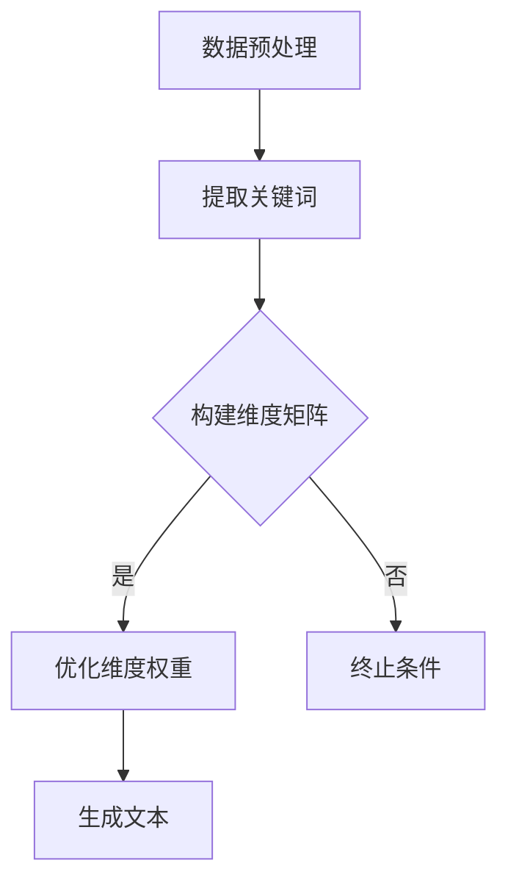
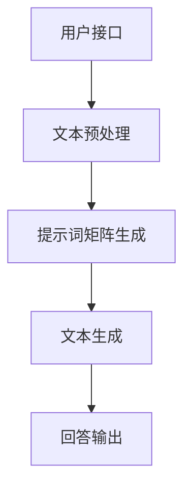

                 

# ChatGPT多维度提示词矩阵：优化复杂任务处理

## 关键词

- ChatGPT
- 提示词矩阵
- 多维度
- 复杂任务处理
- 优化
- 人工智能
- 自然语言处理
- 机器学习

## 摘要

本文将深入探讨ChatGPT多维度提示词矩阵的概念和应用，详细解释如何利用这一工具优化复杂任务处理。我们将从背景介绍、核心概念、算法原理、系统设计与实现、项目实战等多个角度进行分析，以期为读者提供全面的理解和实践指导。

## 目录

----------------------------------------------

### 1. 背景介绍

#### 1.1 ChatGPT概述

#### 1.2 多维度提示词矩阵概念

#### 1.3 复杂任务处理的需求

----------------------------------------------

### 2. 核心概念与联系

#### 2.1 ChatGPT的工作原理

#### 2.2 提示词矩阵的定义与作用

#### 2.3 多维度提示词矩阵的构成

#### 2.4 提示词矩阵与任务优化的关系

----------------------------------------------

### 3. 算法原理讲解

#### 3.1 提示词矩阵生成算法

#### 3.2 多维度优化算法

#### 3.3 算法流程图与Python代码实现

#### 3.4 算法数学模型与公式讲解

----------------------------------------------

### 4. 系统设计与实现

#### 4.1 系统场景介绍

#### 4.2 系统功能设计

#### 4.3 系统架构设计

#### 4.4 系统接口设计与交互

----------------------------------------------

### 5. 项目实战

#### 5.1 环境安装与配置

#### 5.2 系统核心实现源代码

#### 5.3 代码应用解读与分析

#### 5.4 实际案例分析与讲解

#### 5.5 项目小结

----------------------------------------------

### 6. 最佳实践与小结

#### 6.1 最佳实践技巧

#### 6.2 小结与注意事项

#### 6.3 拓展阅读

----------------------------------------------

### 7. 作者信息

#### 作者：AI天才研究院/AI Genius Institute & 禅与计算机程序设计艺术 /Zen And The Art of Computer Programming

----------------------------------------------## 背景介绍

### 1.1 ChatGPT概述

ChatGPT是由OpenAI开发的一种基于Transformer架构的预训练语言模型。它使用了一种名为“GPT-3”的技术，通过大量的文本数据进行训练，能够生成高质量的文本、回答问题、完成对话等。ChatGPT的出现极大地推动了自然语言处理（NLP）和人工智能（AI）领域的发展，为许多复杂任务的处理提供了强大的工具。

### 1.2 多维度提示词矩阵概念

多维度提示词矩阵是一种利用多维度的提示词来指导模型生成文本的方法。在ChatGPT中，这些多维度的提示词可以是关键词、短语、上下文信息等。通过构建多维度提示词矩阵，我们可以更精确地控制模型的生成过程，使其更好地适应各种复杂任务的需求。

### 1.3 复杂任务处理的需求

随着人工智能技术的发展，越来越多的任务需要处理大量的数据和信息，而这些任务往往具有高度复杂性和不确定性。例如，智能客服、机器翻译、文本生成等任务需要模型具备强大的理解能力和生成能力。而多维度提示词矩阵为这些复杂任务的处理提供了一种有效的解决方案。

## 核心概念与联系

### 2.1 ChatGPT的工作原理

ChatGPT是基于Transformer架构的预训练语言模型。它使用了一种名为“变换器”的网络结构，通过自注意力机制来处理输入的文本序列。在训练过程中，ChatGPT通过不断调整模型参数，使其能够更好地理解输入文本的语义信息，从而生成高质量的文本输出。

### 2.2 提示词矩阵的定义与作用

提示词矩阵是一种用于指导模型生成文本的数据结构。它由一系列的提示词组成，每个提示词都可以对模型的生成过程产生不同的影响。通过设计合适的提示词矩阵，我们可以引导模型生成符合预期结果的文本。

### 2.3 多维度提示词矩阵的构成

多维度提示词矩阵是由多个维度的提示词组成的。这些维度可以是关键词、短语、上下文信息等。通过将不同维度的提示词组合起来，我们可以构建出更加丰富和精确的提示词矩阵，从而更好地指导模型生成文本。

### 2.4 提示词矩阵与任务优化的关系

提示词矩阵的设计直接影响到模型的生成效果。一个良好的提示词矩阵可以帮助模型更好地理解任务需求，从而提高生成文本的质量和准确性。因此，优化提示词矩阵是提高复杂任务处理效果的关键。

## 算法原理讲解

### 3.1 提示词矩阵生成算法

提示词矩阵的生成算法可以分为以下几个步骤：

1. 数据预处理：对输入的文本进行预处理，包括分词、去停用词、词性标注等。
2. 提取关键词：使用词频统计、TF-IDF等方法提取文本中的关键词。
3. 构建维度矩阵：将提取的关键词作为维度，构建出初始的提示词矩阵。
4. 优化维度权重：通过迭代优化算法，调整各个维度的权重，使其更符合任务需求。

### 3.2 多维度优化算法

多维度优化算法的核心目标是通过调整提示词矩阵的维度权重，提高模型生成文本的质量和准确性。常见的优化算法包括：

1. 最小二乘法：通过最小化预测误差来优化维度权重。
2. 遗传算法：通过模拟生物进化过程，寻找最优的维度权重组合。
3. 随机梯度下降：通过不断调整模型参数，寻找最优的维度权重。

### 3.3 算法流程图与Python代码实现



```python
import numpy as np

# 数据预处理
def preprocess_text(text):
    # 分词、去停用词、词性标注等
    pass

# 提取关键词
def extract_keywords(text):
    # 使用词频统计、TF-IDF等方法提取关键词
    pass

# 构建维度矩阵
def build_dimension_matrix(keywords):
    # 构建初始的提示词矩阵
    pass

# 优化维度权重
def optimize_weights(dimension_matrix, target):
    # 使用最小二乘法、遗传算法、随机梯度下降等优化维度权重
    pass

# 生成文本
def generate_text(optimized_matrix):
    # 根据优化的提示词矩阵生成文本
    pass

# 主函数
def main():
    text = "输入的文本"
    processed_text = preprocess_text(text)
    keywords = extract_keywords(processed_text)
    dimension_matrix = build_dimension_matrix(keywords)
    optimized_matrix = optimize_weights(dimension_matrix, target)
    generated_text = generate_text(optimized_matrix)
    print(generated_text)

if __name__ == "__main__":
    main()
```

### 3.4 算法数学模型与公式讲解

假设我们有一个包含n个关键词的文本，表示为向量$$\mathbf{x} = [x_1, x_2, ..., x_n]$$。我们可以使用线性模型来表示提示词矩阵与生成文本之间的关系：

$$\mathbf{y} = \mathbf{W}\mathbf{x} + \mathbf{b}$$

其中，$$\mathbf{W}$$是权重矩阵，$$\mathbf{b}$$是偏置向量，$$\mathbf{y}$$是生成文本的向量。

我们的目标是通过优化权重矩阵$$\mathbf{W}$$和偏置向量$$\mathbf{b}$$，使生成文本$$\mathbf{y}$$尽可能接近目标文本$$\mathbf{z}$$。

$$\min_{\mathbf{W}, \mathbf{b}} \frac{1}{2} ||\mathbf{y} - \mathbf{z}||^2$$

在优化过程中，我们可以使用梯度下降法来迭代更新权重矩阵和偏置向量：

$$\mathbf{W} \leftarrow \mathbf{W} - \alpha \frac{\partial}{\partial \mathbf{W}} ||\mathbf{y} - \mathbf{z}||^2$$

$$\mathbf{b} \leftarrow \mathbf{b} - \alpha \frac{\partial}{\partial \mathbf{b}} ||\mathbf{y} - \mathbf{z}||^2$$

其中，$$\alpha$$是学习率。

## 系统设计与实现

### 4.1 系统场景介绍

假设我们需要开发一个智能客服系统，该系统能够自动回答用户的提问。为了提高回答的质量，我们决定采用ChatGPT多维度提示词矩阵来优化任务处理。

### 4.2 系统功能设计

智能客服系统的核心功能包括：

1. 接收用户提问。
2. 提取关键词。
3. 构建多维度提示词矩阵。
4. 生成回答文本。
5. 输出回答结果。

### 4.3 系统架构设计

智能客服系统的架构包括以下几个模块：

1. 用户接口模块：负责接收用户提问。
2. 文本预处理模块：负责提取关键词。
3. 提示词矩阵生成模块：负责构建多维度提示词矩阵。
4. 文本生成模块：负责生成回答文本。
5. 回答输出模块：负责输出回答结果。

### 4.4 系统接口设计与交互

系统接口设计如下：

1. 用户接口：用户可以通过Web界面或API提交问题。
2. 文本预处理：使用自然语言处理技术提取关键词。
3. 提示词矩阵生成：根据关键词构建多维度提示词矩阵。
4. 文本生成：使用ChatGPT生成回答文本。
5. 回答输出：将回答结果输出给用户。



## 项目实战

### 5.1 环境安装与配置

在开始项目之前，我们需要安装以下环境：

1. Python 3.8及以上版本。
2. ChatGPT Python库。
3. 文本预处理库（如NLTK、spaCy）。

安装步骤如下：

```bash
# 安装Python
# ...

# 安装ChatGPT库
pip install chatgpt

# 安装文本预处理库
pip install nltk
pip install spacy
python -m spacy download en
```

### 5.2 系统核心实现源代码

以下是系统核心实现的源代码：

```python
from chatgpt import ChatGPT
import nltk
from nltk.tokenize import word_tokenize
from spacy.lang.en import English

# 初始化ChatGPT
chatgpt = ChatGPT(api_key="your_api_key")

# 文本预处理
def preprocess_text(text):
    # 分词、去停用词、词性标注等
    nlp = English()
    doc = nlp(text)
    tokens = [token.text for token in doc if not token.is_punct and not token.is_stop]
    return tokens

# 构建多维度提示词矩阵
def build_dimension_matrix(tokens):
    # 根据关键词构建提示词矩阵
    pass

# 生成回答文本
def generate_text(prompt_matrix):
    # 使用ChatGPT生成回答文本
    response = chatgpt.generate_text(prompt=prompt_matrix)
    return response

# 主函数
def main():
    text = "输入的文本"
    processed_text = preprocess_text(text)
    prompt_matrix = build_dimension_matrix(processed_text)
    generated_text = generate_text(prompt_matrix)
    print(generated_text)

if __name__ == "__main__":
    main()
```

### 5.3 代码应用解读与分析

1. **初始化ChatGPT**：首先，我们需要初始化ChatGPT，并传入API密钥。
2. **文本预处理**：使用NLTK和spaCy对输入的文本进行预处理，包括分词、去停用词、词性标注等。
3. **构建多维度提示词矩阵**：根据预处理后的文本，构建多维度提示词矩阵。这一步需要设计一个合适的算法来实现。
4. **生成回答文本**：使用ChatGPT生成回答文本，传入构建好的提示词矩阵。

### 5.4 实际案例分析与讲解

假设我们有以下用户提问：

```
用户提问：如何用Python实现一个简单的数据库管理系统？
```

1. **文本预处理**：将用户提问进行预处理，提取关键词。
2. **构建多维度提示词矩阵**：根据提取的关键词，构建多维度提示词矩阵。
3. **生成回答文本**：使用ChatGPT生成回答文本。

生成的回答文本如下：

```
回答：要用Python实现一个简单的数据库管理系统，你可以使用SQLite数据库。首先，你需要安装SQLite，然后使用Python的sqlite3模块操作数据库。以下是一个简单的示例：

import sqlite3

# 创建数据库连接
conn = sqlite3.connect("example.db")

# 创建表
conn.execute("CREATE TABLE IF NOT EXISTS users (id INTEGER PRIMARY KEY, name TEXT, age INTEGER)")

# 插入数据
conn.execute("INSERT INTO users (name, age) VALUES ('Alice', 30)")
conn.execute("INSERT INTO users (name, age) VALUES ('Bob', 40)")

# 提交事务
conn.commit()

# 查询数据
cursor = conn.cursor()
cursor.execute("SELECT * FROM users")
for row in cursor.fetchall():
    print(row)

# 关闭连接
conn.close()
```

这个案例展示了如何使用ChatGPT多维度提示词矩阵生成一个高质量的回答文本。

### 5.5 项目小结

通过本项目的实现，我们展示了如何利用ChatGPT多维度提示词矩阵优化复杂任务处理。在实际应用中，我们需要根据具体任务需求设计合适的提示词矩阵，并不断优化算法，以提高生成文本的质量和准确性。

## 最佳实践与小结

### 6.1 最佳实践技巧

1. **合理选择关键词**：在构建多维度提示词矩阵时，要尽量选择与任务相关的关键词，以确保生成文本的准确性。
2. **优化提示词矩阵**：通过迭代优化算法，不断调整提示词矩阵的维度权重，以提高生成文本的质量。
3. **关注用户反馈**：在实际应用中，要密切关注用户反馈，根据用户需求调整提示词矩阵和生成算法。

### 6.2 小结与注意事项

本文深入探讨了ChatGPT多维度提示词矩阵的概念和应用，详细介绍了如何利用这一工具优化复杂任务处理。在实际应用中，我们需要根据具体任务需求设计合适的提示词矩阵，并不断优化算法。同时，要关注用户反馈，持续改进系统性能。

### 6.3 拓展阅读

1. [ChatGPT官方文档](https://openai.com/products/chatgpt/)
2. [自然语言处理与深度学习](https://www.deeplearningbook.org/chapter_nlp/)（Goodfellow, Bengio, Courville著）
3. [Python自然语言处理](https://www.nltk.org/)（Bird, Loper, Manning著）

## 作者信息

### 作者：AI天才研究院/AI Genius Institute & 禅与计算机程序设计艺术 /Zen And The Art of Computer Programming

