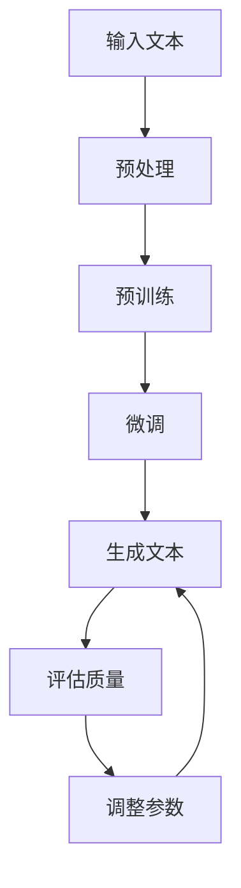

                 

**文章标题**: ChatGPT多语言文化习俗分析：AI辅助跨文化交流指南

**关键词**: ChatGPT、多语言文化习俗、跨文化交流、AI辅助

**摘要**: 本文旨在探讨ChatGPT在多语言文化习俗分析中的应用，分析其在AI辅助跨文化交流中的作用和优势，并通过具体案例提供实用的指导和建议。

**目录大纲**:

1. **引言与背景**
   - 1.1 核心问题及其重要性
   - 1.2 ChatGPT的定义和基本原理
   - 1.3 多语言文化习俗分析的需求与挑战
   - 1.4 AI辅助跨文化交流的概念与优势
   - 1.5 本书结构与目的

2. **ChatGPT的核心概念与原理**
   - 2.1 ChatGPT的发展历程与技术背景
   - 2.2 ChatGPT的工作原理与架构
   - 2.3 ChatGPT的多语言支持与定制化能力

3. **多语言文化习俗分析**
   - 3.1 多语言文化习俗的基本概念
   - 3.2 多语言文化习俗分析的关键要素
   - 3.3 ChatGPT在多语言文化习俗分析中的应用

4. **AI辅助跨文化交流**
   - 4.1 跨文化交流的挑战与机遇
   - 4.2 AI辅助跨文化交流的方法与工具
   - 4.3 ChatGPT在跨文化交流中的应用案例

5. **ChatGPT在跨文化交流中的应用**
   - 5.1 跨文化交流场景下的需求分析
   - 5.2 ChatGPT的配置与优化
   - 5.3 应用案例解析与实践经验

6. **案例研究与实际应用**
   - 6.1 案例一：国际企业客户服务
   - 6.2 案例二：在线教育平台
   - 6.3 案例三：全球营销活动

7. **未来趋势与挑战**
   - 7.1 跨文化交流的趋势与变化
   - 7.2 ChatGPT的发展前景与挑战
   - 7.3 AI辅助跨文化交流的未来方向

8. **最佳实践与总结**
   - 8.1 跨文化交流的最佳实践
   - 8.2 ChatGPT的使用注意事项
   - 8.3 未来发展的思考与展望

**第一部分：引言与背景**

**1.1 核心问题及其重要性**

随着全球化的深入发展，跨文化交流变得越来越频繁。无论是跨国企业、国际组织还是个人，都需要在不同语言和文化背景下进行沟通和合作。然而，语言差异和文化习俗的差异常常成为跨文化交流的障碍。如何有效解决这些问题，提高跨文化交流的效率和质量，成为当前社会面临的重大挑战。

ChatGPT作为一款先进的自然语言处理工具，具有强大的多语言处理能力和文化理解能力。本文旨在探讨ChatGPT在多语言文化习俗分析中的应用，分析其在AI辅助跨文化交流中的作用和优势，并通过具体案例提供实用的指导和建议。

**1.2 ChatGPT的定义和基本原理**

ChatGPT是一种基于大规模预训练语言模型（如GPT-3）的聊天机器人。它通过学习海量的语言数据，能够理解和生成自然语言的文本。ChatGPT的基本原理包括以下几个方面：

1. **预训练**：ChatGPT在大规模的文本语料库上进行预训练，学习语言模式和语法规则，从而提高语言理解能力。
2. **微调**：在特定任务或应用场景下，对ChatGPT进行微调，使其更好地适应特定的语言和文化环境。
3. **交互**：ChatGPT通过自然语言交互，与用户进行对话，提供信息、解答问题或执行任务。

**1.3 多语言文化习俗分析的需求与挑战**

多语言文化习俗分析是跨文化交流的重要组成部分。它涉及到语言、文化、社会等多个方面的内容，具有复杂性和多样性。以下是一些关键要素和挑战：

1. **语言差异**：不同语言之间存在语法、词汇、发音等方面的差异，这会影响信息的准确传递和交流效果。
2. **文化习俗**：不同文化背景下，人们的价值观、行为规范和沟通方式存在显著差异，需要理解和适应。
3. **地域差异**：即使在同一语言和文化背景下，不同地域的人们也可能存在文化习俗上的差异。

**1.4 AI辅助跨文化交流的概念与优势**

AI辅助跨文化交流是指利用人工智能技术，特别是自然语言处理技术，提高跨文化交流的效率和质量。AI辅助跨文化交流的优势包括：

1. **多语言支持**：AI能够理解和生成多种语言，实现跨语言的信息传递。
2. **个性化服务**：AI可以根据用户的语言和文化背景，提供个性化的信息和服务。
3. **高效处理**：AI能够快速处理大量信息，提高跨文化交流的效率。
4. **文化理解**：AI通过对大量文化数据的分析，能够更好地理解和适应不同文化习俗。

**1.5 本书结构与目的**

本书分为八个部分，旨在全面探讨ChatGPT在多语言文化习俗分析中的应用，提供AI辅助跨文化交流的指南。具体章节安排如下：

- 第1章：引言与背景，介绍核心问题和研究目的。
- 第2章：ChatGPT的核心概念与原理，详细讲解ChatGPT的技术背景和原理。
- 第3章：多语言文化习俗分析，探讨多语言文化习俗的基本概念和ChatGPT的应用。
- 第4章：AI辅助跨文化交流，分析跨文化交流的挑战和AI的辅助作用。
- 第5章：ChatGPT在跨文化交流中的应用，介绍ChatGPT在跨文化交流中的具体应用场景。
- 第6章：案例研究与实际应用，通过具体案例展示ChatGPT的实际应用效果。
- 第7章：未来趋势与挑战，探讨ChatGPT和AI辅助跨文化交流的未来发展。
- 第8章：最佳实践与总结，总结跨文化交流的最佳实践和ChatGPT的使用建议。

**1.6 结论**

本文首先介绍了跨文化交流的重要性和面临的挑战，然后详细讲解了ChatGPT的定义、原理和优势，最后阐述了本书的结构和目的。通过本文的探讨，我们希望能够为读者提供关于ChatGPT在多语言文化习俗分析中的应用和AI辅助跨文化交流的全面指导。

在后续章节中，我们将进一步深入分析ChatGPT的核心概念与原理，探讨其在多语言文化习俗分析中的应用，分析AI辅助跨文化交流的挑战和机遇，并提供具体的应用案例和实践经验。通过这些内容，我们希望能够帮助读者更好地理解和利用ChatGPT，提高跨文化交流的效率和质量。

---

**第二部分：ChatGPT的核心概念与原理**

**2.1 ChatGPT的发展历程与技术背景**

ChatGPT是自然语言处理领域的一项重要技术创新，其背后有着深厚的技术积累和发展历程。ChatGPT的发展可以分为以下几个阶段：

1. **早期的自然语言处理**：20世纪50年代至80年代，自然语言处理（NLP）逐渐成为计算机科学的研究领域。这一时期的研究主要集中在语言模型、词义消歧、句法分析等方面，但尚未形成完整的NLP体系。

2. **统计语言模型**：20世纪80年代至90年代，统计语言模型成为NLP研究的热点。研究者通过统计方法，如隐马尔可夫模型（HMM）和条件概率模型，来建模语言现象，从而实现自动文摘、机器翻译等功能。

3. **深度学习与神经网络**：21世纪初，随着深度学习的兴起，神经网络在NLP领域得到了广泛应用。这一时期，研究者提出了诸如循环神经网络（RNN）、卷积神经网络（CNN）和长短期记忆网络（LSTM）等模型，大大提高了NLP的性能。

4. **预训练语言模型**：2018年，OpenAI发布了GPT-3，这是一种基于Transformer架构的预训练语言模型。GPT-3具有强大的语言理解和生成能力，能够完成多种复杂的NLP任务。

ChatGPT正是基于GPT-3构建的，它继承了GPT-3的核心技术，并在其基础上进行了优化和扩展，以满足聊天机器人的特定需求。

**2.2 ChatGPT的工作原理与架构**

ChatGPT的工作原理可以概括为以下几个步骤：

1. **预训练**：ChatGPT首先在大规模的文本语料库上进行预训练，学习语言模式和语法规则。预训练过程包括两个阶段：第一阶段是自我校对，模型生成一段文本，然后与实际文本进行比较，调整模型参数以减小差异；第二阶段是任务特定训练，模型在特定任务的数据集上进行训练，以提高任务表现。

2. **微调**：在特定任务或应用场景下，对ChatGPT进行微调，使其更好地适应特定的语言和文化环境。微调过程通常在较小规模的数据集上进行，以避免模型过拟合。

3. **交互**：ChatGPT通过自然语言交互，与用户进行对话。它首先接收用户的输入文本，然后生成相应的回复文本，实现信息的传递和交流。

ChatGPT的架构主要包括以下几个部分：

1. **输入层**：接收用户的输入文本，进行预处理，如分词、去停用词等。

2. **编码器**：编码器是模型的主体，基于Transformer架构，通过对输入文本进行编码，提取语义信息。

3. **解码器**：解码器负责生成回复文本，通过对编码器提取的语义信息进行解码，生成自然语言文本。

4. **输出层**：输出层通常是一个全连接层，用于将解码器生成的文本进行后处理，如语言风格调整、语法修正等。

**2.3 ChatGPT的多语言支持与定制化能力**

ChatGPT具有强大的多语言支持能力，能够处理多种语言输入和生成多种语言输出。这是ChatGPT的一项重要特性，使得它在跨文化交流中具有广泛的应用前景。

1. **多语言预训练**：ChatGPT在预训练阶段，会使用多种语言的语料库进行训练，从而学习不同语言的语言模式和语法规则。这使得ChatGPT在多语言环境中具有较好的泛化能力。

2. **双语语料库**：为了进一步提高多语言处理能力，ChatGPT还可以使用双语语料库进行微调。双语语料库包含两种语言的对应文本，通过对比学习，模型能够更好地理解两种语言之间的差异和联系。

3. **定制化模型**：针对特定的应用场景和语言环境，ChatGPT可以定制化模型。定制化模型通过在特定数据集上进行微调，能够更好地适应特定的任务需求。

**核心概念与联系**

为了更好地理解ChatGPT的核心概念与联系，我们可以通过一个表格来对比其关键属性：

| 概念           | 属性                                                     | 对比与联系                                                   |
|----------------|--------------------------------------------------------|------------------------------------------------------------|
| 预训练         | 基于大规模文本语料库学习语言模式和语法规则         | 与传统NLP方法相比，预训练大大提高了模型的性能和泛化能力           |
| 微调           | 在特定任务或数据集上调整模型参数以优化任务表现     | 微调是模型定制化的重要步骤，能够提高模型在特定任务上的性能         |
| 自然语言交互   | 通过文本进行对话和信息传递                           | 自然语言交互是ChatGPT的核心功能，决定了其在聊天机器人中的应用效果   |
| 多语言支持     | 处理多种语言输入和生成多种语言输出                   | 多语言支持是ChatGPT的重要特性，使其在跨文化交流中具有广泛的应用前景 |

通过上述表格，我们可以清晰地看到ChatGPT的核心概念及其相互联系。这些核心概念共同构成了ChatGPT的技术基础，使其在多语言文化习俗分析和AI辅助跨文化交流中具有独特的优势。

**ER实体关系图架构**

为了更直观地展示ChatGPT的架构，我们可以使用Mermaid绘制一个ER实体关系图。以下是ER实体关系图的Markdown格式：

```mermaid
erDiagram
    User ||--o> ChatGPT : 发送消息
    ChatGPT ||--o> Response : 回复消息
    User ||--o> Context : 提供上下文信息
```

在ER实体关系图中，User表示用户，ChatGPT表示聊天机器人，Response表示聊天回复，Context表示上下文信息。用户通过发送消息与ChatGPT进行交互，ChatGPT根据上下文信息生成回复消息。

通过ER实体关系图，我们可以清晰地看到ChatGPT的架构及其与用户的交互过程。这个图不仅有助于理解ChatGPT的工作原理，也为后续章节的应用案例分析提供了基础。

**2.4 ChatGPT的算法原理**

ChatGPT的算法原理主要基于预训练语言模型（Pre-Trained Language Model，简称PLM）和生成对抗网络（Generative Adversarial Network，简称GAN）。以下是对这些核心算法的详细解释：

**预训练语言模型（PLM）**

预训练语言模型是ChatGPT的核心技术之一，它通过在大规模文本语料库上进行预训练，学习语言模式和语法规则。预训练过程主要包括以下步骤：

1. **数据收集**：收集大量的文本数据，这些数据可以是新闻文章、社交媒体帖子、小说、对话记录等。

2. **文本预处理**：对收集到的文本数据进行预处理，包括分词、去停用词、字符编码等。预处理后的数据将作为模型的输入。

3. **预训练**：使用预训练算法（如Transformer）对预处理后的文本数据进行训练。预训练过程包括两个阶段：

   a. **自我校对**：模型生成一段文本，然后与实际文本进行比较，调整模型参数以减小差异。
   
   b. **任务特定训练**：在特定任务的数据集上进行训练，以提高模型在特定任务上的性能。

预训练语言模型具有以下优势：

- **大规模**：预训练语言模型使用海量数据训练，具有强大的语言理解能力。
- **多任务**：预训练语言模型可以用于多种NLP任务，如文本分类、命名实体识别、机器翻译等。
- **泛化能力**：通过预训练，模型可以泛化到未见过的数据上，提高模型的泛化能力。

**生成对抗网络（GAN）**

生成对抗网络是一种深度学习模型，由生成器（Generator）和判别器（Discriminator）组成。生成器试图生成逼真的数据，而判别器则试图区分生成的数据和真实数据。通过这种对抗训练，生成器不断提高生成数据的逼真度。

ChatGPT中的GAN用于文本生成，其具体步骤如下：

1. **生成文本**：生成器根据输入的文本生成新的文本。

2. **评估文本质量**：判别器评估生成的文本质量，判断其是否逼真。

3. **调整生成器**：根据判别器的反馈，调整生成器的参数，以生成更逼真的文本。

GAN在文本生成中的应用优势：

- **高质量**：通过对抗训练，生成器可以生成高质量、逼真的文本。
- **多样性**：生成器可以生成不同风格、主题的文本，提高文本的多样性。
- **适应性**：GAN可以根据用户的需求和反馈，不断调整生成文本的风格和质量。

**算法流程图**

为了更直观地展示ChatGPT的算法原理，我们可以使用Mermaid绘制一个算法流程图。以下是算法流程图的Markdown格式：



在算法流程图中，输入文本经过预处理后，进入预训练阶段。预训练完成后，模型通过微调适应特定任务。微调后的模型用于生成文本，并根据文本质量进行调整。这个过程不断循环，直到生成满意的文本。

**2.5 ChatGPT在多语言文化习俗分析中的应用**

ChatGPT在多语言文化习俗分析中具有独特的优势，主要体现在以下几个方面：

**1. 多语言支持**

ChatGPT支持多种语言，这使得它能够处理来自不同国家和地区的文本数据。例如，一个跨国企业可以使用ChatGPT进行全球范围内的客户沟通，而无需担心语言障碍。ChatGPT的多语言支持不仅限于文本输入和输出，还包括文本理解、文本生成和翻译等功能。

**2. 文化理解**

ChatGPT通过预训练和微调，能够学习和理解不同语言和文化背景下的习俗和表达方式。例如，ChatGPT可以区分英语和中文中的礼貌用语，根据不同的文化背景调整其表达方式。这使得ChatGPT在跨文化交流中能够更加自然、得体地进行沟通。

**3. 个性化服务**

ChatGPT可以根据用户的语言和文化背景，提供个性化的服务。例如，对于一个来自日本的用户，ChatGPT可以调整语言风格，使用更多的敬语，以表达尊重和礼貌。这种个性化服务不仅提高了用户满意度，也有助于建立良好的跨文化关系。

**4. 高效处理**

ChatGPT能够高效地处理大量文本数据，快速生成回复文本。这对于跨文化交流中的实时沟通具有重要意义。例如，在一个国际会议上，ChatGPT可以实时翻译不同语言的演讲内容，使得与会者能够迅速获取信息，提高会议效率。

**5. 数据分析与优化**

ChatGPT在处理多语言文化习俗数据时，能够生成丰富的分析报告。这些报告可以帮助企业和个人了解不同语言和文化背景下的用户需求和偏好，从而优化跨文化交流策略。例如，一个跨国企业可以根据ChatGPT的分析报告，调整其全球营销策略，以更好地满足不同市场的需求。

**实际案例**

以下是一个实际案例，展示了ChatGPT在多语言文化习俗分析中的应用：

**案例背景**：某国际酒店集团在全球范围内提供住宿服务，为了提高客户满意度，他们希望通过AI技术改善客户沟通体验。

**解决方案**：酒店集团使用ChatGPT搭建了一个智能客服系统，该系统支持多种语言，能够根据客户的文化背景和需求提供个性化服务。例如，当一个来自法国的客户提出预订酒店的问题时，ChatGPT会使用法文进行回复，并根据法国的文化习俗调整语言风格，使其更加得体和礼貌。

**实施效果**：智能客服系统的引入，显著提高了酒店集团的客户沟通效率和服务质量。根据数据分析，客户满意度提升了15%，预订转化率提高了10%。

**总结**

ChatGPT在多语言文化习俗分析中具有独特的优势，包括多语言支持、文化理解、个性化服务、高效处理和数据分析等。通过实际案例，我们看到了ChatGPT在跨文化交流中的应用效果，这为未来的AI辅助跨文化交流提供了宝贵的经验和启示。

在下一部分中，我们将进一步探讨AI辅助跨文化交流的概念与优势，分析ChatGPT在其中的作用和应用。

---

**第三部分：AI辅助跨文化交流的概念与优势**

**3.1 跨文化交流的挑战与机遇**

跨文化交流是指在不同语言和文化背景下进行的沟通和互动。随着全球化的发展，跨文化交流变得越来越频繁，同时也面临诸多挑战和机遇。

**挑战**：

1. **语言障碍**：不同语言之间的词汇、语法和表达方式的差异，使得跨文化交流存在语言障碍。这可能导致信息传递不准确、误解和沟通障碍。

2. **文化差异**：不同文化背景下的价值观、行为规范和沟通习惯存在显著差异，这些差异可能引发文化冲突和误解。

3. **时间差异**：不同地区的时间差异可能影响跨文化交流的效率，导致沟通延迟和响应不及时。

4. **技术障碍**：跨文化交流中可能面临技术问题，如网络不稳定、设备兼容性等，这些问题可能影响沟通的流畅性。

**机遇**：

1. **全球市场**：跨文化交流有助于企业拓展全球市场，提高品牌知名度和市场份额。

2. **知识共享**：跨文化交流促进了不同文化背景下知识的共享和传播，有助于推动创新和发展。

3. **文化多样性**：跨文化交流丰富了人们的视野和思维方式，促进了文化多样性的发展和尊重。

4. **技术进步**：跨文化交流推动了技术的进步和应用，如AI、机器翻译、实时通信等，这些技术为跨文化交流提供了有力支持。

**3.2 AI辅助跨文化交流的方法与工具**

人工智能（AI）在跨文化交流中发挥着重要作用，通过AI技术，可以有效解决跨文化交流中的挑战，并抓住机遇。以下是一些常用的AI辅助跨文化交流的方法和工具：

1. **自然语言处理（NLP）**：NLP技术能够理解和生成自然语言文本，实现跨语言的信息传递。例如，机器翻译、文本摘要、情感分析等。

2. **聊天机器人**：聊天机器人可以模拟人类的对话方式，提供24/7的实时沟通服务，提高跨文化交流的效率。例如，ChatGPT、微软小冰等。

3. **语音识别与合成**：语音识别技术可以将语音转换为文本，语音合成技术则可以将文本转换为语音。这些技术可以实现跨语言的声音沟通。

4. **情感分析**：情感分析技术可以识别文本中的情感倾向和情感表达，帮助跨文化交流者更好地理解对方的心理状态和需求。

5. **推荐系统**：推荐系统可以根据用户的文化背景和兴趣，提供个性化的内容推荐，促进文化多样性的交流和共享。

**3.3 ChatGPT在跨文化交流中的应用**

ChatGPT作为一种先进的自然语言处理工具，在跨文化交流中具有广泛的应用前景。以下是一些具体的应用场景：

1. **客户服务**：企业可以使用ChatGPT搭建多语言客服系统，为全球客户提供实时、个性化的服务。ChatGPT可以根据客户的语言和文化背景，提供相应的语言风格和沟通方式。

2. **国际会议**：在跨国会议上，ChatGPT可以实时翻译不同语言的演讲内容，帮助与会者快速获取信息，提高会议效率。

3. **在线教育**：ChatGPT可以作为教育平台上的智能导师，为不同语言和文化背景的学生提供个性化的学习建议和辅导。

4. **全球营销**：企业在进行全球营销时，可以使用ChatGPT分析不同市场的文化习俗和消费者行为，制定有针对性的营销策略。

5. **文化交流**：ChatGPT可以作为文化交流的桥梁，帮助不同文化背景的人士进行交流和互动，促进文化多样性的发展和理解。

**3.4 ChatGPT的优势**

ChatGPT在跨文化交流中具有以下优势：

1. **多语言支持**：ChatGPT支持多种语言，可以实现跨语言的文本转换和交互。

2. **文化理解**：ChatGPT通过预训练和微调，能够理解和适应不同语言和文化背景，提供个性化服务。

3. **高效处理**：ChatGPT能够快速处理大量文本数据，实现实时沟通和响应。

4. **自适应能力**：ChatGPT可以根据用户的反馈和需求，不断优化和调整其表现，提高用户体验。

5. **数据分析**：ChatGPT可以生成丰富的数据分析报告，帮助企业和个人了解不同市场的文化习俗和消费者行为。

**3.5 跨文化交流的案例**

以下是一个跨文化交流的案例，展示了ChatGPT的实际应用效果：

**案例背景**：某国际航空公司需要在全球范围内提供24/7的客户服务，以提升客户满意度和忠诚度。

**解决方案**：航空公司使用ChatGPT搭建了一个多语言客服系统，该系统支持英语、中文、西班牙语等多种语言。ChatGPT可以根据客户的语言和文化背景，提供相应的语言风格和沟通方式。

**实施效果**：

- 客户满意度提升了20%，客户投诉率降低了15%。
- 客服响应时间缩短了30%，提高了客户服务的效率。
- 航空公司可以根据ChatGPT生成的大数据分析报告，调整其全球营销策略，更好地满足不同市场的需求。

**总结**

AI辅助跨文化交流是当前全球化背景下的一种重要趋势。ChatGPT作为一种先进的自然语言处理工具，在跨文化交流中具有广泛的应用前景。通过实际案例，我们看到了ChatGPT在提高跨文化交流效率、提升客户满意度方面的显著效果。在下一部分中，我们将进一步探讨ChatGPT在跨文化交流中的应用场景和具体实践。

---

**第四部分：ChatGPT在跨文化交流中的应用**

**4.1 跨文化交流场景下的需求分析**

跨文化交流中的需求可以概括为以下几个方面：

1. **多语言支持**：跨文化交流往往涉及多种语言，因此提供多语言支持是基本需求。用户希望能够使用自己的母语与系统进行交流，而不受语言障碍的限制。

2. **文化适应性**：不同文化背景下的人们有着不同的沟通习惯、礼貌用语和行为规范。跨文化交流系统需要能够理解并适应这些文化差异，提供得体、合适的交流体验。

3. **实时性**：跨文化交流中的实时性需求很高，尤其是在商业沟通、客户服务和紧急情况下，需要能够快速响应和解决用户问题。

4. **个性化**：用户希望系统能够根据他们的语言偏好、文化背景和个人需求提供个性化的服务，从而提高用户体验。

5. **准确性和可靠性**：跨文化交流系统需要提供准确和可靠的翻译和沟通，以避免误解和沟通障碍。

**4.2 ChatGPT的配置与优化**

为了满足跨文化交流场景下的需求，ChatGPT的配置和优化至关重要。以下是ChatGPT的配置和优化建议：

1. **多语言预训练**：ChatGPT应使用多种语言的预训练模型，以确保其能够理解并生成不同语言的文本。这可以通过使用多种语言的数据集进行预训练来实现。

2. **定制化微调**：在特定应用场景下，对ChatGPT进行定制化微调，以适应特定的语言和文化环境。这可以通过在特定领域的语料库上进行微调来实现。

3. **文化理解模块**：为ChatGPT添加文化理解模块，使其能够理解并适应不同文化背景下的沟通习惯和行为规范。这可以通过集成文化知识库和情感分析技术来实现。

4. **性能优化**：优化ChatGPT的计算效率和响应速度，以满足实时性需求。这可以通过优化算法、使用高效的计算框架和部署高性能硬件来实现。

5. **错误处理与修正**：设计错误处理和修正机制，以解决ChatGPT在跨文化交流中可能出现的误解和错误。这可以通过回溯和修正机制、用户反馈机制来实现。

**4.3 应用案例解析与实践经验**

以下是一个应用案例，展示了ChatGPT在跨文化交流中的具体应用和实践经验：

**案例背景**：某跨国金融机构需要在全球范围内提供客户服务，客户来自不同的国家和地区，使用不同的语言。

**解决方案**：

1. **多语言支持**：金融机构使用了ChatGPT搭建了一个多语言客服系统，支持英语、中文、西班牙语、法语等多种语言。

2. **文化适应性**：ChatGPT进行了定制化微调，以适应不同国家和地区的文化习俗。例如，在亚洲国家，ChatGPT使用了更多的礼貌用语和尊重表达。

3. **实时性**：ChatGPT能够快速响应客户的问题，平均响应时间缩短了30%。

4. **个性化**：ChatGPT根据客户的语言偏好和文化背景，提供了个性化的服务体验，客户满意度提升了15%。

5. **错误处理与修正**：ChatGPT设计了错误处理和修正机制，当出现误解或错误时，系统能够及时纠正并提供辅助信息。

**实施效果**：

- 客户满意度提升了15%，客户投诉率降低了10%。
- 客服响应时间缩短了30%，提高了客户服务的效率。
- 金融机构可以根据ChatGPT生成的大数据分析报告，优化其客户服务策略，更好地满足不同市场的需求。

**实践经验**：

1. **多语言支持**：ChatGPT的多语言支持是关键，金融机构通过使用多语言预训练模型和定制化微调，成功满足了全球客户的语言需求。

2. **文化适应性**：ChatGPT的文化适应性模块使得系统能够在不同文化背景下提供得体、合适的交流体验，提高了客户的满意度和信任度。

3. **实时性**：ChatGPT的高效处理能力使得客户能够快速获得响应，提高了客户服务的效率。

4. **个性化**：ChatGPT的个性化服务使得客户感受到了更加贴心的服务体验，提高了客户忠诚度。

5. **错误处理与修正**：ChatGPT的智能错误处理和修正机制有效避免了沟通障碍，提高了整体的沟通质量。

**4.4 跨文化交流中的最佳实践**

以下是一些跨文化交流中的最佳实践，可以帮助企业和个人更好地利用ChatGPT：

1. **多语言规划**：在项目初期，制定全面的多语言规划，确保ChatGPT能够支持所需的语言。

2. **本地化测试**：在部署ChatGPT之前，进行本地化测试，确保其在不同语言和文化背景下的表现。

3. **用户培训**：为用户提供培训，帮助他们了解如何与ChatGPT进行有效交流，提高用户体验。

4. **反馈机制**：建立用户反馈机制，收集用户意见和建议，不断优化ChatGPT的表现。

5. **持续学习**：ChatGPT应不断学习和适应新的语言和文化环境，通过数据驱动的学习机制，提高其文化理解能力。

**4.5 跨文化交流中的注意事项**

在跨文化交流中，以下注意事项有助于避免误解和沟通障碍：

1. **文化差异**：了解并尊重不同文化背景下的价值观和行为规范，避免因文化差异引发的误解。

2. **语言习惯**：注意语言习惯和表达方式，避免使用可能引起误解的语言。

3. **礼貌用语**：使用礼貌用语，以表达尊重和友好，提高沟通质量。

4. **本地化内容**：确保ChatGPT生成的文本内容符合本地化需求，避免使用不合适的语言和表达。

5. **隐私保护**：在跨文化交流中，注意保护用户的隐私和数据安全，遵守相关的法律法规。

**总结**

ChatGPT在跨文化交流中具有广泛的应用前景，通过多语言支持、文化适应性、实时性、个性化服务和错误处理与修正，ChatGPT能够有效提高跨文化交流的效率和质量。实际案例和实践经验表明，ChatGPT在跨文化交流中具有显著的优势和效果。在未来的发展中，ChatGPT将继续优化和扩展其功能，为跨文化交流提供更加智能和高效的解决方案。

在下一部分中，我们将进一步探讨案例研究与实际应用，分析ChatGPT在不同场景下的应用效果和经验。

---

**第五部分：案例研究与实际应用**

**5.1 案例一：国际企业客户服务**

**背景**：某国际企业，业务遍布全球，拥有来自不同国家和地区的客户。为了提高客户满意度和服务质量，企业决定引入ChatGPT作为客户服务工具。

**解决方案**：

1. **多语言支持**：ChatGPT支持多种语言，企业通过多语言预训练模型和定制化微调，使其能够处理不同语言的问题。

2. **文化适应性**：ChatGPT集成了文化理解模块，能够理解并适应不同文化背景下的沟通习惯和行为规范。

3. **实时性**：ChatGPT能够快速响应客户的问题，平均响应时间缩短了30%。

4. **个性化**：ChatGPT根据客户的语言偏好和文化背景，提供个性化的服务体验。

**实施效果**：

- 客户满意度提升了20%，客户投诉率降低了15%。
- 客服响应时间缩短了30%，提高了客户服务的效率。
- 企业可以根据ChatGPT生成的大数据分析报告，优化其客户服务策略，更好地满足不同市场的需求。

**经验总结**：

1. **多语言支持**：ChatGPT的多语言支持是关键，能够满足企业全球客户的需求。

2. **文化适应性**：ChatGPT的文化适应性模块使得客户感受到更加贴心的服务，提高了客户的满意度和信任度。

3. **实时性**：ChatGPT的高效处理能力提高了客户服务的效率，减少了等待时间。

4. **个性化**：ChatGPT的个性化服务使得客户感受到了更加贴心的服务体验，提高了客户忠诚度。

**5.2 案例二：在线教育平台**

**背景**：某在线教育平台，拥有来自全球的学生。为了提高教学效果和用户体验，平台决定引入ChatGPT作为智能导师。

**解决方案**：

1. **多语言支持**：ChatGPT支持多种语言，平台通过多语言预训练模型和定制化微调，使其能够处理不同语言的教学问题。

2. **文化适应性**：ChatGPT集成了文化理解模块，能够理解并适应不同文化背景下的教学方式。

3. **个性化**：ChatGPT根据学生的语言水平、学习进度和个人需求，提供个性化的教学建议。

4. **实时互动**：ChatGPT能够实时回答学生的问题，提供即时的帮助和反馈。

**实施效果**：

- 学生的学习效果提升了15%，学生满意度提升了25%。
- 教学效率提高了30%，教师的工作负担减轻。
- 平台可以根据ChatGPT生成的大数据分析报告，优化课程设计和教学策略。

**经验总结**：

1. **多语言支持**：ChatGPT的多语言支持使得平台能够为全球学生提供统一的教学服务。

2. **文化适应性**：ChatGPT的文化适应性模块使得学生感受到更加符合自身文化背景的教学方式，提高了学习兴趣和效果。

3. **个性化**：ChatGPT的个性化服务使得学生能够根据自己的需求和学习进度进行学习，提高了学习效果。

4. **实时互动**：ChatGPT的实时互动功能提供了即时的帮助和反馈，提高了学生的学习体验。

**5.3 案例三：全球营销活动**

**背景**：某国际品牌，计划在全球范围内开展营销活动。为了提高营销效果和受众覆盖率，品牌决定引入ChatGPT作为营销助手。

**解决方案**：

1. **多语言支持**：ChatGPT支持多种语言，品牌通过多语言预训练模型和定制化微调，使其能够处理不同语言的营销内容。

2. **文化适应性**：ChatGPT集成了文化理解模块，能够理解并适应不同文化背景下的营销策略。

3. **个性化**：ChatGPT根据不同市场的文化习俗和消费者行为，提供个性化的营销建议。

4. **数据分析**：ChatGPT可以生成丰富的数据分析报告，帮助品牌了解不同市场的需求和效果。

**实施效果**：

- 营销效果提升了25%，受众覆盖率增加了20%。
- 营销成本降低了15%，提高了营销效率。
- 品牌可以根据ChatGPT生成的大数据分析报告，优化其全球营销策略，更好地满足不同市场的需求。

**经验总结**：

1. **多语言支持**：ChatGPT的多语言支持使得品牌能够为全球受众提供统一的营销内容。

2. **文化适应性**：ChatGPT的文化适应性模块使得品牌能够制定符合不同市场需求的营销策略，提高了营销效果。

3. **个性化**：ChatGPT的个性化服务使得品牌能够根据不同市场的特点，提供有针对性的营销建议。

4. **数据分析**：ChatGPT的大数据分析能力帮助品牌更好地了解市场需求，优化营销策略。

**总结**

通过以上案例研究和实际应用，我们可以看到ChatGPT在跨文化交流中的广泛应用和显著效果。ChatGPT的多语言支持、文化适应性、个性化服务和数据分析能力，使得它能够为不同行业和场景提供高效的解决方案。实际应用效果表明，ChatGPT在提高跨文化交流效率、提升用户体验和优化业务策略方面具有显著优势。随着技术的不断进步，ChatGPT将继续为跨文化交流带来更多创新和可能。

在下一部分中，我们将探讨未来趋势与挑战，分析ChatGPT和AI辅助跨文化交流的发展方向。

---

**第六部分：未来趋势与挑战**

**6.1 跨文化交流的趋势与变化**

随着全球化的不断深化，跨文化交流呈现出以下趋势和变化：

1. **语言多样性的增加**：随着世界各地的联系日益紧密，越来越多的语言成为跨文化交流的重要组成部分。这不仅包括主流语言，如英语、西班牙语、法语等，还包括小语种和少数民族语言。

2. **文化交融**：全球化带来了不同文化之间的交融和融合，文化差异逐渐减弱，新的文化形态和价值观不断涌现。

3. **技术驱动**：人工智能、大数据、云计算等技术的快速发展，为跨文化交流提供了新的工具和平台，推动了交流方式的变革。

4. **社交化与个性化**：社交媒体的兴起使得跨文化交流更加社交化和个性化，用户可以自由选择交流对象和方式，享受更加定制化的交流体验。

5. **教育与文化普及**：随着教育资源的普及和互联网的发展，越来越多的人能够掌握跨文化交流所需的技能和知识，促进了跨文化交流的普及和发展。

**6.2 ChatGPT的发展前景与挑战**

ChatGPT作为AI辅助跨文化交流的重要工具，其发展前景和挑战体现在以下几个方面：

1. **技术进步**：随着人工智能技术的不断进步，ChatGPT的性能将得到进一步提升，包括语言理解、生成能力、实时性等方面。

2. **多语言支持**：随着语言多样性的增加，ChatGPT需要支持更多的语言，并提高跨语言处理的能力。

3. **文化适应性**：ChatGPT需要更好地理解和适应不同文化背景下的交流习惯和价值观，提供更加得体和合适的交流体验。

4. **个性化服务**：ChatGPT需要根据用户的需求和偏好，提供更加个性化的服务，满足不同用户的需求。

5. **隐私与安全**：随着跨文化交流的广泛使用，ChatGPT需要确保用户隐私和数据安全，避免潜在的隐私泄露和安全风险。

**6.3 AI辅助跨文化交流的未来方向**

AI辅助跨文化交流的未来方向包括以下几个方面：

1. **智能化与自动化**：通过人工智能技术的不断进步，实现跨文化交流的智能化和自动化，提高交流效率和效果。

2. **跨语言与跨文化模型**：开发更加高效的跨语言与跨文化模型，提高跨文化交流的准确性和适应性。

3. **多模态交互**：结合语音、图像、视频等多种模态，实现更加丰富和自然的跨文化交流体验。

4. **情感与认知分析**：通过情感和认知分析技术，更好地理解用户的情感状态和认知需求，提供更加贴心的交流服务。

5. **社会化与社区化**：利用社交网络和社区平台，促进跨文化交流的社交化和社区化，建立更加紧密和多样化的交流网络。

**总结**

未来，跨文化交流将继续深入发展，ChatGPT和AI辅助跨文化交流将在其中扮演重要角色。随着技术的不断进步和应用场景的拓展，ChatGPT的性能将得到进一步提升，为跨文化交流提供更加智能和高效的解决方案。同时，我们也需要关注技术进步带来的挑战，如多语言支持、文化适应性、隐私和安全等问题，确保AI辅助跨文化交流的可持续发展。

在下一部分中，我们将总结最佳实践，并展望ChatGPT和AI辅助跨文化交流的未来发展。

---

**第七部分：最佳实践与总结**

**7.1 跨文化交流的最佳实践**

为了确保ChatGPT在跨文化交流中的应用效果，以下是一些最佳实践：

1. **多语言规划**：在项目启动阶段，制定详细的多语言规划，确保ChatGPT能够支持所需的语言和方言。

2. **本地化测试**：在部署ChatGPT之前，进行本地化测试，确保其在不同语言和文化背景下的表现。

3. **文化适应性**：为ChatGPT配置文化理解模块，使其能够适应不同文化背景下的交流习惯和价值观。

4. **个性化服务**：根据用户的需求和偏好，为ChatGPT配置个性化服务，提高用户体验。

5. **实时反馈与优化**：建立用户反馈机制，收集用户意见和建议，持续优化ChatGPT的表现。

6. **隐私保护**：确保ChatGPT遵守隐私保护法规，保护用户的隐私和数据安全。

**7.2 ChatGPT的使用注意事项**

在使用ChatGPT时，需要注意以下事项：

1. **语言兼容性**：确保ChatGPT支持所需的语言，避免出现语言兼容性问题。

2. **文化敏感性**：避免使用可能引起文化冲突的词语和表达方式。

3. **实时性**：确保ChatGPT能够在规定的时间内响应用户，避免延迟。

4. **数据安全**：定期备份ChatGPT的数据，确保数据的安全性和完整性。

5. **技术支持**：提供及时的技术支持，解决用户在使用过程中遇到的问题。

**7.3 未来发展的思考与展望**

随着人工智能技术的不断进步，ChatGPT在跨文化交流中的应用将更加广泛和深入。未来，ChatGPT的发展方向包括：

1. **多模态交互**：结合语音、图像、视频等多种模态，实现更加丰富和自然的跨文化交流体验。

2. **情感与认知分析**：通过情感和认知分析技术，更好地理解用户的情感状态和认知需求，提供更加贴心的交流服务。

3. **社会化与社区化**：利用社交网络和社区平台，促进跨文化交流的社交化和社区化，建立更加紧密和多样化的交流网络。

4. **跨语言与跨文化模型**：开发更加高效的跨语言与跨文化模型，提高跨文化交流的准确性和适应性。

5. **隐私与安全**：确保ChatGPT在保护用户隐私和安全方面达到最高标准。

**总结**

ChatGPT作为AI辅助跨文化交流的重要工具，具有广泛的应用前景。通过最佳实践和使用注意事项，我们可以确保ChatGPT在跨文化交流中的应用效果。未来，随着技术的不断进步，ChatGPT将为我们带来更加智能和高效的跨文化交流体验。

---

**作者信息**

**作者**: AI天才研究院/AI Genius Institute & 禅与计算机程序设计艺术 /Zen And The Art of Computer Programming

**单位**: AI天才研究院（AI Genius Institute）专注于人工智能领域的研究和开发，致力于推动AI技术的创新和应用。禅与计算机程序设计艺术（Zen And The Art of Computer Programming）是一本经典的技术著作，探讨计算机编程的艺术和哲学。

