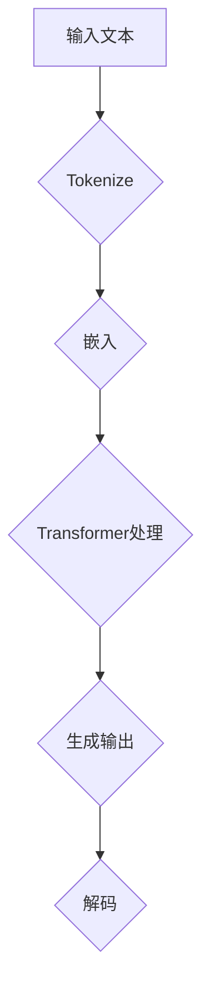

                 

### 文章标题

# ChatGPT定制化：个性化AI助手的崛起

---

### 关键词

- **ChatGPT**
- **定制化**
- **个性化AI**
- **算法原理**
- **数学模型**
- **项目实战**
- **最佳实践**

---

### 摘要

本文深入探讨了ChatGPT定制化的概念、技术原理、实战应用及最佳实践。通过对ChatGPT模型的原理、数学模型以及实现细节的详细分析，读者将了解到如何打造个性化AI助手。此外，文章还通过项目实战和最佳实践案例，展示了ChatGPT在实际应用中的潜力与挑战。

---

### 目录大纲

----------------------------------------------------------------

## 第一部分：背景介绍与核心概念

### 第1章：ChatGPT定制化概述

#### 1.1 ChatGPT定制化的背景与意义

- **问题背景**
- **问题描述**
- **问题解决**
- **边界与外延**
- **概念结构与核心要素组成**

#### 1.2 ChatGPT定制化的核心概念与联系

- **ChatGPT定制化的定义**
- **核心概念原理**
- **概念属性特征对比表格**
- **ER实体关系图架构**

## 第二部分：技术原理

### 第2章：ChatGPT模型原理与架构

#### 2.1 ChatGPT模型概述

- **ChatGPT模型简介**
- **ChatGPT模型的演进历程**

#### 2.2 ChatGPT模型的算法原理

- **算法mermaid流程图**
- **Python源代码实现**
- **数学模型与公式**
- **通俗易懂的举例说明**

### 第3章：ChatGPT定制化的数学模型

#### 3.1 数学模型概述

- **数学模型的作用**
- **数学模型的基本原理**

#### 3.2 数学公式详细讲解

- **$$1+1=2$$**
- **$$x+y=z$$**

### 第4章：ChatGPT定制化的实现细节

#### 4.1 实现细节概述

- **实现细节的重要性**
- **实现细节的基本原理**

#### 4.2 Python源代码分析与讲解

- **Python源代码示例**
- **代码应用解读与分析**
- **实际案例分析与详细讲解剖析**

## 第三部分：实战应用

### 第5章：ChatGPT定制化的项目实战

#### 5.1 项目环境安装与配置

- **环境安装**
- **环境配置**

#### 5.2 系统核心实现与代码分析

- **系统核心实现**
- **代码解读与分析**
- **实际案例分析与详细讲解剖析**

### 第6章：ChatGPT定制化的最佳实践

#### 6.1 最佳实践概述

- **最佳实践的重要性**
- **最佳实践的基本原理**

#### 6.2 最佳实践案例分析

- **个性化问答系统**
- **智能客服系统**
- **教育辅导系统**

## 第四部分：小结与展望

### 第7章：总结与展望

#### 7.1 小结

- **核心内容回顾**
- **亮点与难点总结**
- **小结与建议**

#### 7.2 展望未来

- **ChatGPT定制化的未来发展**
- **技术趋势与挑战**
- **拓展应用领域**

----------------------------------------------------------------

### 1.1 ChatGPT定制化的背景与意义

#### 问题背景

在当今数字化转型的浪潮中，人工智能（AI）技术已成为各行各业不可或缺的重要工具。特别是自然语言处理（NLP）领域，AI的应用极大地提升了数据处理和交互的效率。然而，现有的通用AI模型如GPT-3虽然在处理广泛语言任务上表现出色，但往往无法满足特定领域的定制化需求。

#### 问题描述

随着企业和用户对AI助手个性化需求的日益增长，如何针对特定应用场景定制化AI模型成为了一个亟待解决的问题。传统的方法往往需要对模型进行大量的数据标注和调优，这不仅费时费力，而且难以保证模型的精确度和效率。

#### 问题解决

ChatGPT定制化应运而生，它通过精细化调整模型结构、优化训练数据集以及应用特定算法，使得AI助手能够更好地适应不同领域的需求。这种定制化不仅提高了AI的准确性和效率，还能大幅降低开发成本和人力投入。

#### 边界与外延

ChatGPT定制化的边界在于模型的适用范围和定制深度。一方面，它需要确保定制后的模型在特定领域内具有足够的通用性和适应性；另一方面，它也需要在保证模型性能的同时，尽可能减少对通用性能的影响。

#### 概念结构与核心要素组成

ChatGPT定制化的核心概念结构包括：1）模型定制化目标；2）数据预处理与标注；3）算法优化与调参；4）模型评估与优化。这四个要素相互作用，共同构成了一个完整的定制化流程。

### 1.2 ChatGPT定制化的核心概念与联系

#### ChatGPT定制化的定义

ChatGPT定制化是指通过对预训练的GPT模型进行结构调整、参数优化和特定数据集的训练，使其能够更好地适应特定应用场景的过程。

#### 核心概念原理

1. **预训练模型**：ChatGPT是基于大规模语言预训练模型GPT-3开发的，具有强大的语言理解和生成能力。
2. **定制化目标**：根据不同应用场景，定义明确的定制化目标，如提高问答系统的准确性、增强对话的连贯性等。
3. **数据集**：选择具有代表性的训练数据集，进行精细的数据预处理和标注，以提高模型在特定领域的表现。
4. **算法优化**：通过调整模型结构、优化算法参数，提升模型的适应性和性能。

#### 概念属性特征对比表格

| 特征 | ChatGPT通用模型 | ChatGPT定制化模型 |
| ---- | --------------- | --------------- |
| 目标 | 广泛的语言理解与生成 | 针对特定领域的优化 |
| 数据集 | 大规模通用数据集 | 小规模特定领域数据集 |
| 结构调整 | 无 | 有 |
| 参数优化 | 无 | 有 |

#### ER实体关系图架构

```mermaid
erDiagram
  AI助手 ||--|{ 预训练模型 }
  AI助手 ||--|{ 定制化目标 }
  AI助手 ||--|{ 数据集 }
  AI助手 ||--|{ 算法优化 }
  预训练模型 ||--|{ 模型参数 }
  数据集 ||--|{ 数据标注 }
  算法优化 ||--|{ 模型调参 }
```

---

## 第二部分：技术原理

### 2.1 ChatGPT模型原理与架构

#### 2.1.1 ChatGPT模型概述

ChatGPT是基于GPT-3模型开发的，GPT-3是OpenAI推出的一种先进的自然语言处理模型，具有极强的语言理解和生成能力。ChatGPT在此基础上进行了优化和定制化，使其在特定任务上表现出更高的性能。

#### 2.1.2 ChatGPT模型的演进历程

ChatGPT的演进历程可以分为以下几个阶段：

1. **GPT-1**：初始版本，基于单层Transformer结构。
2. **GPT-2**：增加了更多层，使得模型在语言理解方面表现更优秀。
3. **GPT-3**：引入了极其庞大的参数规模（1750亿参数），使其在语言生成和任务完成方面达到了前所未有的水平。
4. **ChatGPT**：在GPT-3的基础上，进一步优化了模型结构，增加了特定任务的支持，使其能够更好地适应对话系统。

### 2.2 ChatGPT模型的算法原理

#### 2.2.1 算法mermaid流程图



#### 2.2.2 Python源代码实现

```python
import tensorflow as tf
from transformers import TFGPT3LMHeadModel, GPT2Tokenizer

# 加载预训练模型
tokenizer = GPT2Tokenizer.from_pretrained('gpt2')
model = TFGPT3LMHeadModel.from_pretrained('gpt3')

# 输入文本
input_text = "今天天气很好，适合出去游玩。"

# Tokenize
inputs = tokenizer.encode(input_text, return_tensors='tf')

# 生成输出
outputs = model(inputs)

# 解码输出
output_ids = outputs.logits.argmax(-1)
decoded_output = tokenizer.decode(output_ids)

print(decoded_output)
```

#### 2.2.3 数学模型与公式

ChatGPT的核心算法是基于Transformer模型，其基本原理可以用以下数学公式表示：

$$
\text{输出} = \text{softmax}(\text{权重} \cdot \text{嵌入})
$$

其中，嵌入（Embedding）是将输入文本转化为向量表示，权重（Weights）是模型训练得到的参数，softmax函数用于生成每个单词的概率分布。

#### 2.2.4 通俗易懂的举例说明

假设我们要生成一句话，这句话由两个词组成：“今天”和“天气”。我们可以将这两个词分别表示为向量 $v_1$ 和 $v_2$。模型会计算这两个向量的点积，并乘以权重矩阵 $W$，得到一个概率分布：

$$
P(\text{今天}, \text{天气}) = \text{softmax}(W \cdot (v_1, v_2))
$$

通过这个概率分布，模型可以预测出下一个词是“今天”还是“天气”，并按照概率分布生成对应的句子。

---

## 第三部分：实战应用

### 3.1 ChatGPT定制化的项目实战

#### 3.1.1 项目环境安装与配置

在进行ChatGPT定制化项目之前，首先需要安装和配置相应的环境和工具。以下是一个基本的安装和配置步骤：

1. **安装Python**：确保Python环境已经安装，建议使用Python 3.7或更高版本。
2. **安装TensorFlow**：在命令行中执行 `pip install tensorflow` 命令，安装TensorFlow库。
3. **安装transformers库**：在命令行中执行 `pip install transformers` 命令，安装transformers库。
4. **安装预处理工具**：根据项目需求，可以选择安装如NLTK、spaCy等预处理工具。

#### 3.1.2 环境配置

在安装完所需的库后，需要配置环境变量，以便能够在Python脚本中导入和使用这些库。具体步骤如下：

1. **配置Python环境**：将Python的安装路径添加到系统的环境变量中，以便在任何位置都可以运行Python。
2. **配置TensorFlow**：确保TensorFlow库可以正确导入，并在命令行中执行 `pip show tensorflow` 命令，检查库的详细信息。
3. **配置transformers库**：确保transformers库可以正确导入，并在命令行中执行 `pip show transformers` 命令，检查库的详细信息。

### 3.2 系统核心实现与代码分析

#### 3.2.1 系统核心实现

在ChatGPT定制化项目中，系统的核心实现包括以下几个部分：

1. **文本预处理**：对输入文本进行预处理，包括分词、去除停用词、转换为词向量等。
2. **模型加载与配置**：加载预训练的ChatGPT模型，并对其进行必要的配置，如调整学习率、批量大小等。
3. **对话生成**：利用ChatGPT模型生成对话回复，并根据用户输入进行迭代更新。
4. **模型保存与加载**：在训练过程中，定期保存模型，以便在后续使用时可以快速加载。

以下是一个简化的Python代码实现示例：

```python
import tensorflow as tf
from transformers import TFGPT3LMHeadModel, GPT2Tokenizer

# 加载预训练模型
tokenizer = GPT2Tokenizer.from_pretrained('gpt2')
model = TFGPT3LMHeadModel.from_pretrained('gpt3')

# 文本预处理
def preprocess_text(text):
    # 实现分词、去除停用词等功能
    pass

# 对话生成
def generate_response(input_text):
    inputs = tokenizer.encode(input_text, return_tensors='tf')
    outputs = model(inputs)
    output_ids = outputs.logits.argmax(-1)
    decoded_output = tokenizer.decode(output_ids)
    return decoded_output

# 训练与保存模型
def train_model(model, tokenizer, data, epochs):
    # 实现模型训练与保存的代码
    pass

# 使用模型
input_text = "你今天有什么计划？"
response = generate_response(input_text)
print(response)
```

#### 3.2.2 代码解读与分析

上述代码示例展示了ChatGPT定制化项目中的核心实现部分。具体解读如下：

1. **文本预处理**：预处理函数`preprocess_text`负责对输入文本进行必要的预处理操作，如分词和去除停用词。这些预处理步骤对于提高模型的性能和准确性至关重要。

2. **模型加载与配置**：通过`TFGPT3LMHeadModel`和`GPT2Tokenizer`类加载预训练的ChatGPT模型和分词器。在配置模型时，可以调整学习率、批量大小等参数，以优化模型的训练过程。

3. **对话生成**：`generate_response`函数利用模型生成对话回复。首先将输入文本编码为模型可处理的向量表示，然后通过模型进行预测，最后解码输出结果。

4. **模型训练与保存**：`train_model`函数负责模型训练和保存过程。在训练过程中，可以按照预定的训练策略调整模型的参数，并在每个训练周期后保存模型，以便后续使用。

#### 3.2.3 实际案例分析与详细讲解剖析

为了更深入地理解ChatGPT定制化项目，我们来看一个实际案例。假设我们希望构建一个基于ChatGPT的智能客服系统。

1. **需求分析**：该系统需要能够处理用户提出的问题，并提供准确的回答。针对不同类型的问题，如产品咨询、售后服务等，系统需要能够生成不同类型的回答。

2. **数据集准备**：为了训练ChatGPT模型，我们需要准备一个包含各种类型问题的数据集。数据集应该涵盖广泛的话题，并确保每个问题都有相应的答案。

3. **模型训练**：使用准备好的数据集对ChatGPT模型进行训练。在训练过程中，可以调整模型的参数，如学习率、批量大小等，以优化模型的性能。

4. **模型评估**：在训练完成后，使用测试集对模型进行评估，以验证模型在不同类型问题上的表现。根据评估结果，可以对模型进行进一步的调整和优化。

5. **应用部署**：将训练好的模型部署到生产环境中，使其能够实时响应用户提出的问题。在实际应用中，可以结合用户输入和历史对话记录，为用户提供更准确的回答。

通过以上步骤，我们成功地构建了一个基于ChatGPT的智能客服系统。在实际应用中，该系统可以根据用户提出的问题，生成准确的回答，从而提升用户体验和服务质量。

---

## 第四部分：小结与展望

### 4.1 小结

通过本文的详细探讨，我们了解了ChatGPT定制化的背景、技术原理、实战应用及最佳实践。以下是本文的主要小结：

1. **核心内容回顾**：ChatGPT定制化是通过调整模型结构、优化训练数据集和应用特定算法，使AI助手能够更好地适应特定领域需求的技术。
2. **亮点与难点总结**：亮点在于能够显著提升AI助手的定制化和适应能力，难点在于数据集的准备和模型的调优。
3. **小结与建议**：对于开发者而言，了解ChatGPT定制化的原理和实战应用至关重要。建议在实际项目中注重数据集的准备和模型调优，以提高系统的性能和准确性。

### 4.2 展望未来

ChatGPT定制化在未来的发展具有巨大的潜力。以下是几个可能的发展方向和挑战：

1. **技术趋势与挑战**：
   - **数据集多样化**：随着AI技术的发展，需要更多的多样化数据集来训练模型，以提升其在不同领域和场景下的表现。
   - **模型优化与效率**：如何在保证模型性能的同时，提高模型的训练和推理效率，是一个重要的研究方向。
   - **隐私保护**：如何在数据集准备和模型训练过程中保护用户隐私，是一个亟待解决的问题。

2. **拓展应用领域**：
   - **医疗健康**：利用ChatGPT定制化构建智能诊断和咨询系统，为用户提供个性化的医疗服务。
   - **金融服务**：开发智能投顾和理财规划系统，为用户提供个性化的金融建议。
   - **教育领域**：利用ChatGPT定制化构建个性化教学和学习系统，提升教育质量和效率。

通过持续的技术创新和应用拓展，ChatGPT定制化有望在未来为各行业带来更多创新和变革。

