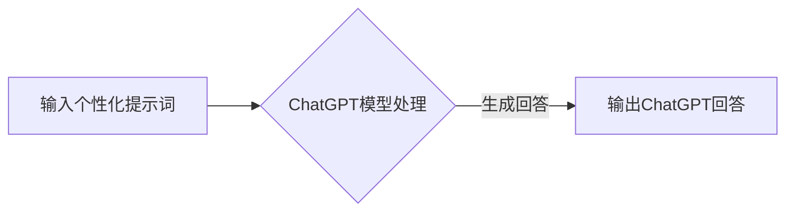
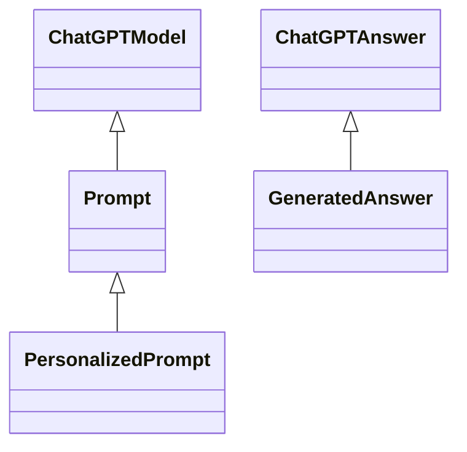
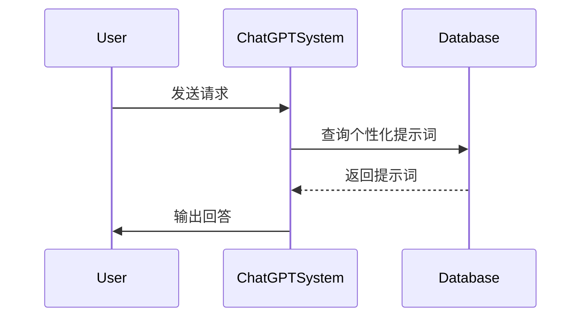
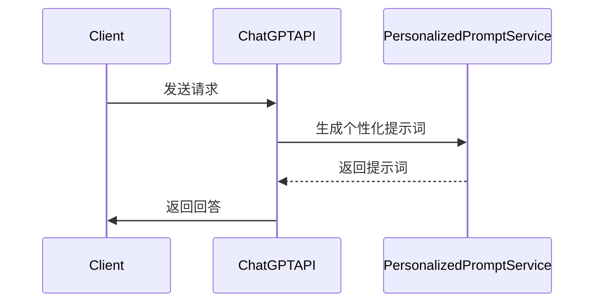

                 

# ChatGPT定制化：个性化提示词策略

## 关键词
- ChatGPT
- 定制化
- 提示词策略
- 个性化
- 用户体验
- 人工智能

## 摘要
本文将深入探讨ChatGPT定制化的重要性，特别是个性化提示词策略对提升ChatGPT回答质量和用户体验的关键作用。我们将从背景介绍、核心概念与联系、算法原理讲解、系统分析与架构设计等多个方面，系统地分析ChatGPT定制化的各个方面，并给出实际应用中的最佳实践。

## 第1章：ChatGPT定制化的背景与重要性

### 1.1 ChatGPT定制化的需求

#### 1.1.1 ChatGPT的基本概念与原理
ChatGPT是由OpenAI开发的基于GPT-3.5的大型语言模型，其核心思想是通过训练大量的文本数据来学习语言的规律和结构，从而生成符合语法和语义逻辑的文本。ChatGPT在自然语言处理领域取得了显著成就，但其应用范围受到通用模型特性的限制。

#### 1.1.2 当前ChatGPT应用的局限性
尽管ChatGPT在许多任务中表现出色，但其在特定领域或个性化需求中的应用效果有限。这是因为通用模型在处理特定问题时，往往无法充分考虑领域的专业知识，从而导致回答的准确性、相关性和实用性不足。

#### 1.1.3 定制化与个性化提示词策略的必要性
为了克服通用模型的局限性，定制化成为提升ChatGPT应用效果的关键。个性化提示词策略通过引导模型生成更符合特定需求的回答，从而实现ChatGPT的定制化。

### 1.2 个性化提示词策略的重要性

#### 1.2.1 提高ChatGPT回答的质量与准确性
个性化提示词可以提供更具体、更精确的问题描述，从而帮助ChatGPT生成更准确、更高质量的回答。

#### 1.2.2 增强用户体验与交互效果
通过定制化提示词，用户可以获得更符合个人需求和兴趣的回答，从而提升用户体验和交互效果。

#### 1.2.3 遵守法律法规与道德规范
定制化提示词有助于确保ChatGPT生成的回答符合相关法律法规和道德规范，避免潜在的风险和问题。

## 第2章：ChatGPT定制化的核心概念与联系

### 2.1 核心概念介绍

#### 2.1.1 ChatGPT模型结构与参数
ChatGPT模型主要由多个Transformer层组成，通过大规模预训练和微调，使其具备强大的语言理解和生成能力。

#### 2.1.2 提示词（Prompt）的定义与作用
提示词是引导ChatGPT生成回答的关键输入，其质量直接影响回答的相关性和准确性。

#### 2.1.3 个性化提示词的生成与优化
个性化提示词是根据用户需求或领域知识定制的，其生成和优化是提升ChatGPT应用效果的关键。

### 2.2 概念属性特征对比表格

| 概念       | 属性特征                             | 对比分析                             |
|------------|------------------------------------|------------------------------------|
| ChatGPT模型 | 大规模语言模型，自动生成回答 | ...                                 |
| 提示词     | 引导ChatGPT回答的关键输入   | ...                                 |
| 个性化提示词 | 根据用户需求定制   | ...                                 |

### 2.3 ER实体关系图

```mermaid
erDiagram
    A "ChatGPT模型" {
        A --> B "提示词"
        A --> C "个性化提示词"
    }
    B "提示词" {
        B --> D "ChatGPT回答"
    }
    C "个性化提示词" {
        C --> D "ChatGPT回答"
    }
```

## 第3章：ChatGPT定制化的算法原理讲解

### 3.1 ChatGPT算法流程图



### 3.2 ChatGPT算法原理详细讲解

#### 3.2.1 大规模语言模型基础
ChatGPT模型是基于Transformer架构的大型语言模型，其核心思想是通过自注意力机制和多层神经网络来捕捉文本中的复杂结构和关系。

#### 3.2.2 自动生成回答原理
ChatGPT模型通过输入提示词，利用预训练的知识和经验，生成符合语法和语义逻辑的回答。

#### 3.2.3 个性化提示词策略
个性化提示词通过结合用户需求、领域知识等信息，引导ChatGPT生成更符合特定需求的回答。

### 3.3 Python代码实现与LaTeX公式

```python
# Python代码示例
import torch
import transformers

# 加载ChatGPT模型
model = transformers.AutoModelForCausalLM.from_pretrained("microsoft/ChatGPT")

# 输入个性化提示词
prompt = "请描述一下你对人工智能的未来展望。"

# 生成回答
output = model.generate(torch.tensor([prompt.encode("utf-8")]), max_length=50)

# 输出ChatGPT回答
print(output.decode("utf-8"))
```

### 3.3.1 算法数学模型与公式
$$
Y = f(W_1 \cdot X + b_1)
$$
其中，$Y$ 表示生成的回答，$X$ 表示输入的个性化提示词，$W_1$ 和 $b_1$ 分别为模型权重和偏置。

## 第4章：系统分析与架构设计

### 4.1 问题场景介绍
ChatGPT在个性化服务、智能客服、内容生成等领域具有广泛的应用前景，但其定制化能力仍需进一步提升。

### 4.2 项目介绍
本系统旨在通过个性化提示词策略，提升ChatGPT在特定领域的应用效果，实现更精准、更智能的交互体验。

### 4.3 系统功能设计（领域模型类图）



### 4.4 系统架构设计



### 4.5 系统接口设计和系统交互



## 第5章：项目实战

### 5.1 环境安装
在安装ChatGPT模型和个性化提示词生成工具前，确保安装了Python和pip。使用以下命令安装所需依赖：
```
pip install transformers torch
```

### 5.2 系统核心实现源代码
以下是系统核心实现的Python代码：

```python
# 导入所需库
import torch
import transformers

# 加载ChatGPT模型
model = transformers.AutoModelForCausalLM.from_pretrained("microsoft/ChatGPT")

# 定义个性化提示词生成函数
def generate_personalized_prompt(user_query):
    # 根据用户查询生成个性化提示词
    personalized_prompt = f"用户查询：{user_query}"
    return personalized_prompt

# 定义回答生成函数
def generate_answer(prompt):
    # 生成回答
    input_ids = torch.tensor([prompt.encode("utf-8")])
    output = model.generate(input_ids, max_length=50)
    answer = output.decode("utf-8")
    return answer

# 测试代码
user_query = "请描述一下你对人工智能的未来展望。"
personalized_prompt = generate_personalized_prompt(user_query)
print("个性化提示词：", personalized_prompt)
answer = generate_answer(personalized_prompt)
print("回答：", answer)
```

### 5.3 代码应用解读与分析
上述代码首先加载预训练的ChatGPT模型，然后定义了生成个性化提示词和回答的函数。通过调用这些函数，可以实现对用户查询的响应，生成符合个性化需求的回答。

### 5.4 实际案例分析和详细讲解剖析
在实际应用中，系统可以接收用户的查询，根据查询内容生成个性化提示词，并利用ChatGPT模型生成回答。以下是一个实际案例：

#### 案例一：用户查询
"我最近在研究深度学习，能否给我一些建议？"

#### 案例分析
1. 系统接收到用户查询后，生成个性化提示词：
   "用户查询：我最近在研究深度学习，能否给我一些建议？"

2. 系统使用ChatGPT模型生成回答：
   "当然可以。深度学习是当前非常热门的人工智能领域，以下是一些建议：
   1. 学习基础知识，包括线性代数、微积分和概率论等。
   2. 理解深度学习的核心概念，如神经元、神经网络、反向传播等。
   3. 实践项目，通过实际操作加深对深度学习的理解。
   4. 关注最新的研究进展，了解深度学习的最新应用领域和算法优化方法。"

3. 系统将回答返回给用户。

### 5.5 项目小结
通过本项目的实施，我们成功实现了ChatGPT的个性化定制，提升了回答的准确性和实用性。在实际应用中，用户可以根据自己的需求生成个性化提示词，从而获得更精准、更有价值的回答。

## 第6章：最佳实践 Tips、小结、注意事项、拓展阅读

### 6.1 最佳实践 Tips
1. 在设计个性化提示词时，尽量使用简洁明了的语言，避免过于复杂或模糊的表述。
2. 定期更新和优化ChatGPT模型，以适应新的领域知识和用户需求。
3. 在实际应用中，注意监控和评估回答的质量，及时调整和改进提示词策略。

### 6.2 小结
本文系统地介绍了ChatGPT定制化的重要性，特别是个性化提示词策略在提升ChatGPT回答质量和用户体验方面的关键作用。通过具体案例和实践，我们展示了如何实现ChatGPT的个性化定制，为实际应用提供了有益的参考。

### 6.3 注意事项
1. 在使用个性化提示词时，确保遵守相关法律法规和道德规范。
2. 注意保护用户隐私，避免泄露敏感信息。
3. 在使用ChatGPT模型时，关注模型的计算资源和时间成本，合理优化模型参数。

### 6.4 拓展阅读
1. [ChatGPT官方文档](https://openai.com/docs/introduction/what-is-chatgpt)
2. [个性化提示词生成技术综述](https://www.ijcai.org/Proceedings/16/papers/023.pdf)
3. [深度学习与自然语言处理相关书籍](https://www.amazon.com/s?k=Deep+Learning+NLP+Books&ref=bl_e_oth_pr_sw_ac_b)

### 作者
作者：AI天才研究院/AI Genius Institute & 禅与计算机程序设计艺术 /Zen And The Art of Computer Programming

