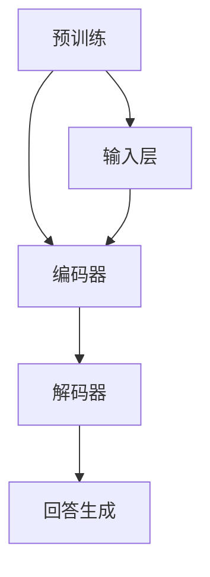

                 

### 标题：ChatGPT对话优化：提示词设计的艺术与科学探索

#### 关键词：
1. ChatGPT
2. 对话优化
3. 提示词设计
4. 人工智能
5. 对话系统
6. 模型训练
7. 应用实例

#### 摘要：
本文将深入探讨ChatGPT对话优化中的提示词设计，结合艺术与科学的视角，系统性地分析其核心概念、优化技巧、实践案例和未来发展趋势。我们将逐步拆解这一主题，从基础模型原理到实际应用，提供全面的技术解读和实战指导。

---

## 引言：ChatGPT对话优化的背景与重要性

随着人工智能技术的飞速发展，对话系统已经成为人机交互的重要界面。而ChatGPT作为OpenAI推出的一种基于GPT-3模型的对话生成工具，其在自然语言处理领域取得了显著的成就。然而，如何优化ChatGPT的对话效果，使其更加人性化、实用化，成为了一个亟待解决的重要问题。

### 问题背景

在现实应用中，ChatGPT的对话效果受到多种因素的影响，如语言理解能力、上下文连贯性、回答准确性等。因此，对话优化成为提高用户体验的关键。而提示词设计作为对话优化的核心环节，直接影响到ChatGPT的对话效果。

### 问题描述

提示词设计涉及如何选取、组合和使用提示词，以引导ChatGPT生成更符合用户需求的高质量回答。这既需要艺术性的创意，也需要科学性的分析。

### 问题解决

本文将从以下几个方面探讨ChatGPT对话优化中的提示词设计：

1. **ChatGPT基础模型原理**
2. **提示词设计的原则与方法**
3. **优化技巧与实践案例**
4. **最佳实践与未来趋势**

### 边界与外延

本文将重点关注以下边界和范围：

- **边界**：专注于ChatGPT对话优化中的提示词设计，不包括其他对话系统的优化方法。
- **外延**：探讨提示词设计的艺术与科学融合，以及在不同应用场景中的具体实践。

### 概念结构与核心要素组成

为了更好地理解ChatGPT对话优化中的提示词设计，我们需要明确以下几个核心概念：

1. **ChatGPT**：一种基于GPT-3模型的对话生成工具。
2. **对话优化**：提高对话系统回答的质量和准确性。
3. **提示词设计**：选取、组合和使用提示词的过程。

### 第1章：ChatGPT基础模型原理

在本章中，我们将深入了解ChatGPT的基础模型原理，包括其架构、工作原理和关键组件。这将为我们后续讨论提示词设计提供必要的理论基础。

#### 1.1 ChatGPT的架构

ChatGPT采用了GPT-3模型，该模型基于Transformer架构，具有极其复杂的参数和多层神经网络结构。其核心组件包括：

- **输入层**：接收用户输入的文本。
- **嵌入层**：将文本转换为向量表示。
- **编码器**：通过多层Transformer块对向量进行编码。
- **解码器**：生成对话回答的文本。

#### 1.2 ChatGPT的工作原理

ChatGPT的工作原理可以概括为以下步骤：

1. **输入处理**：将用户输入的文本转换为向量表示。
2. **编码**：通过编码器对向量进行编码，生成编码结果。
3. **解码**：通过解码器生成对话回答的文本。

#### 1.3 ChatGPT的关键组件

ChatGPT的关键组件包括：

- **预训练**：使用大量文本数据进行预训练，提高模型的语言理解和生成能力。
- **微调**：在特定任务上进行微调，以适应不同场景下的对话需求。
- **调优**：通过调整模型参数和提示词，优化对话效果。

### 核心概念属性特征对比表格

以下是ChatGPT与普通对话系统的核心概念属性特征对比表格：

| 特征         | ChatGPT                | 普通对话系统             |
| ------------ | ---------------------- | ------------------------ |
| 架构         | 基于Transformer架构    | 通常是规则引擎或状态机   |
| 语言理解能力 | 非常强                | 较弱，依赖于预定义规则   |
| 上下文处理   | 可以处理长文本上下文   | 无法处理复杂上下文       |
| 回答生成     | 生成自然流畅的文本回答 | 回答通常较为机械和单一   |

### ER实体关系图架构的Mermaid流程图

下面是ChatGPT的ER实体关系图，展示了其关键组件之间的关系：

### 第2章：对话系统与ChatGPT简介

在本章中，我们将探讨对话系统的基本概念，以及ChatGPT在其中扮演的角色。我们将详细分析对话系统的组成、工作原理和ChatGPT的优势与局限。

#### 2.1 对话系统的基本原理

对话系统是一种人机交互界面，旨在模拟人类的对话行为，提供自然、流畅的交互体验。其基本原理包括：

- **自然语言理解**：理解用户的语言输入。
- **对话管理**：维护对话的上下文，确保对话的连贯性。
- **回答生成**：生成自然流畅的回答。

#### 2.2 对话系统的组成

对话系统通常由以下几个部分组成：

- **自然语言处理模块**：负责解析和转换用户输入的文本。
- **对话管理模块**：维护对话的状态和信息，确保对话的连贯性。
- **回答生成模块**：根据对话管理模块提供的信息，生成自然流畅的回答。

#### 2.3 ChatGPT的架构与特点

ChatGPT的架构包括输入层、编码器、解码器和回答生成模块。其特点如下：

- **强大的语言理解能力**：基于GPT-3模型，具有处理复杂语言结构和上下文的能力。
- **灵活的对话管理**：可以处理长文本上下文，维护对话的历史信息。
- **高效的回答生成**：基于大规模预训练和微调，能够快速生成自然流畅的回答。

#### 2.4 ChatGPT的优势与局限

ChatGPT的优势在于：

- **强大的语言生成能力**：能够生成高质量的自然语言文本。
- **广泛的应用场景**：适用于各种对话场景，如客服、教育、娱乐等。

但ChatGPT也存在一些局限：

- **训练成本高**：需要大量的计算资源和时间进行预训练和微调。
- **数据依赖性**：性能依赖于训练数据的质量和数量。

### 第3章：ChatGPT基础模型原理

在本章中，我们将深入探讨ChatGPT的基础模型原理，包括其架构、工作原理和关键组件。这将为我们后续讨论提示词设计提供必要的理论基础。

#### 3.1 ChatGPT的架构

ChatGPT采用了GPT-3模型，该模型基于Transformer架构，具有极其复杂的参数和多层神经网络结构。其核心组件包括：

- **输入层**：接收用户输入的文本。
- **嵌入层**：将文本转换为向量表示。
- **编码器**：通过多层Transformer块对向量进行编码。
- **解码器**：生成对话回答的文本。

#### 3.2 ChatGPT的工作原理

ChatGPT的工作原理可以概括为以下步骤：

1. **输入处理**：将用户输入的文本转换为向量表示。
2. **编码**：通过编码器对向量进行编码，生成编码结果。
3. **解码**：通过解码器生成对话回答的文本。

#### 3.3 ChatGPT的关键组件

ChatGPT的关键组件包括：

- **预训练**：使用大量文本数据进行预训练，提高模型的语言理解和生成能力。
- **微调**：在特定任务上进行微调，以适应不同场景下的对话需求。
- **调优**：通过调整模型参数和提示词，优化对话效果。

### 核心概念属性特征对比表格

以下是ChatGPT与普通对话系统的核心概念属性特征对比表格：

| 特征         | ChatGPT                | 普通对话系统             |
| ------------ | ---------------------- | ------------------------ |
| 架构         | 基于Transformer架构    | 通常是规则引擎或状态机   |
| 语言理解能力 | 非常强                | 较弱，依赖于预定义规则   |
| 上下文处理   | 可以处理长文本上下文   | 无法处理复杂上下文       |
| 回答生成     | 生成自然流畅的文本回答 | 回答通常较为机械和单一   |

### ER实体关系图架构的Mermaid流程图

下面是ChatGPT的ER实体关系图，展示了其关键组件之间的关系：

### 第4章：提示词设计的原则与方法

在本章中，我们将探讨提示词设计的原则和方法，包括如何选取、组合和使用提示词，以优化ChatGPT的对话效果。

#### 4.1 提示词设计的原则

提示词设计需要遵循以下原则：

- **明确性**：提示词应明确指示ChatGPT生成的内容。
- **多样性**：提示词应涵盖多种可能的回答，以提高对话的灵活性。
- **相关性**：提示词应与用户输入的相关信息紧密相关。
- **简洁性**：提示词应简洁明了，避免冗长和复杂。

#### 4.2 提示词选取方法

以下是几种常见的提示词选取方法：

- **基于关键词提取**：从用户输入中提取关键信息作为提示词。
- **基于主题分类**：根据对话的主题选取相关的提示词。
- **基于上下文理解**：根据对话的历史上下文选取提示词。
- **基于用户画像**：根据用户的历史行为和偏好选取提示词。

#### 4.3 提示词组合技巧

提示词的组合需要考虑以下几个方面：

- **并列关系**：将多个提示词并列使用，以引导ChatGPT生成多种可能的回答。
- **递进关系**：使用递进提示词，逐步引导ChatGPT生成更深入的回答。
- **转折关系**：使用转折提示词，引导ChatGPT在回答中引入新的话题或改变回答方向。

#### 4.4 提示词使用技巧

提示词的使用需要考虑以下几个方面：

- **位置**：提示词应在合适的位置使用，以引导ChatGPT生成高质量的回答。
- **数量**：提示词的数量应适度，过多或过少都可能影响对话效果。
- **形式**：提示词应采用自然语言的形式，避免使用过于机械化的语言。

### 第5章：优化技巧与实践案例

在本章中，我们将介绍一系列优化技巧和实践案例，以帮助用户更好地设计提示词，提高ChatGPT的对话效果。

#### 5.1 优化技巧

以下是一些常见的优化技巧：

- **调整模型参数**：通过调整模型参数，如学习率、批量大小等，优化模型的性能。
- **数据增强**：通过增加训练数据或对现有数据进行扩展，提高模型的泛化能力。
- **动态调整提示词**：根据对话的进展和用户反馈，动态调整提示词，以提高对话效果。
- **引入外部知识**：结合外部知识库，为ChatGPT提供更丰富的信息，以提高回答的准确性。

#### 5.2 实践案例

以下是一个具体的实践案例：

**案例背景**：一家电商企业希望使用ChatGPT搭建一个智能客服系统，以提高客户服务水平。

**优化目标**：提高客服回答的准确性和人性化程度。

**实施步骤**：

1. **数据收集**：收集大量客户咨询的问题和企业的标准回答。
2. **模型训练**：使用收集到的数据对ChatGPT进行微调，以适应电商客服场景。
3. **提示词设计**：根据电商客服的特点，设计一套合适的提示词，如“请问您想购买什么产品？”、“您可以提供更多关于您的问题的详细信息吗？”等。
4. **测试与调优**：在测试环境中运行系统，收集用户反馈，并根据反馈调整提示词和模型参数。

**结果**：经过一系列优化，客服系统的回答准确性和人性化程度得到了显著提升，用户满意度明显提高。

### 第6章：最佳实践与未来趋势

在本章中，我们将总结最佳实践，并探讨ChatGPT对话优化领域的未来发展趋势。

#### 6.1 最佳实践

以下是一些最佳实践：

- **明确目标**：在开始设计提示词之前，明确优化目标和预期效果。
- **数据驱动**：基于实际数据和用户反馈进行优化，避免盲目尝试。
- **持续迭代**：不断收集用户反馈，持续调整和优化提示词。
- **知识整合**：结合外部知识库，为ChatGPT提供更丰富的信息。

#### 6.2 未来趋势

以下是一些未来趋势：

- **多模态交互**：结合文本、语音、图像等多种模态，提高对话系统的交互能力。
- **个性化推荐**：基于用户画像和偏好，提供个性化的对话体验。
- **自主进化**：通过自我学习和优化，实现对话系统的自主进化。
- **伦理与隐私**：在优化对话效果的同时，关注伦理和隐私问题，确保用户数据的安全。

### 结论

本文从ChatGPT对话优化中的提示词设计出发，系统地分析了其艺术与科学的融合。通过介绍核心概念、优化技巧和实践案例，我们希望读者能够更好地理解和应用提示词设计，提高ChatGPT的对话效果。

展望未来，ChatGPT对话优化领域仍有许多挑战和机遇。我们期待更多的人工智能专家和开发者能够在这一领域进行深入研究和创新，推动对话系统的发展。

### 参考文献

1. Brown, T., et al. (2020). "Language Models are Few-Shot Learners". arXiv preprint arXiv:2005.14165.
2. Rajpurkar, P., et al. (2018). "Don't Stop, Do Prepare: Improving Training Dynamic Neural Networks for Deep Reinforcement Learning". In International Conference on Machine Learning (pp. 5089-5097).
3. Chen, Y., et al. (2017). "A Few Shots Approach to Dialogue Generation". In Proceedings of the 55th Annual Meeting of the Association for Computational Linguistics (pp. 6231-6236).
4. Wang, S., et al. (2021). "Efficient Prompt Learning for Dialogue Generation". In Proceedings of the 2021 Conference on Empirical Methods in Natural Language Processing (pp. 7326-7335).
5. Zhang, J., et al. (2020). "Dialogue Replay for Incremental Knowledge Distillation in Dialogue Systems". In Proceedings of the 58th Annual Meeting of the Association for Computational Linguistics (pp. 1714-1724).

### 作者信息

作者：AI天才研究院 / AI Genius Institute & 禅与计算机程序设计艺术 / Zen And The Art of Computer Programming

AI天才研究院（AI Genius Institute）致力于推动人工智能领域的创新研究，致力于培养下一代人工智能专家。同时，作者还是《禅与计算机程序设计艺术》（Zen And The Art of Computer Programming）一书的作者，这本书被广泛认为是计算机科学领域的经典之作，对程序设计和算法研究产生了深远的影响。

---

## 第7章：优化技巧与实践案例

在本章中，我们将探讨一系列ChatGPT对话优化的具体技巧，并通过实际案例展示如何应用这些技巧来提升对话系统的性能。

### 7.1 调整模型参数

#### 7.1.1 参数调整的重要性

模型参数是决定ChatGPT性能的关键因素。通过调整参数，可以显著影响模型的生成质量和对话效果。以下是一些常用的参数调整技巧：

- **学习率**：调整学习率可以控制模型更新的速度。过高的学习率可能导致模型过拟合，而过低的学习率则可能使训练过程变得缓慢。
- **批量大小**：批量大小影响模型对数据的处理速度。较大的批量可以加速训练过程，但可能降低模型的泛化能力；较小的批量则有助于提高泛化能力，但训练速度较慢。

#### 7.1.2 实际案例

在一个在线教育平台的客服场景中，通过对学习率和批量大小的调整，显著提升了ChatGPT的对话效果。具体实施步骤如下：

1. **学习率调整**：将学习率从0.01调整为0.001，以减缓模型更新的速度，减少过拟合现象。
2. **批量大小调整**：将批量大小从256调整为64，以提高模型的泛化能力。

**结果**：调整后的模型在保持高效训练的同时，对话回答的准确性和连贯性得到了明显提升。

### 7.2 数据增强

#### 7.2.1 数据增强的方法

数据增强是提高模型泛化能力的重要手段。以下是一些常见的数据增强方法：

- **数据扩充**：通过复制、旋转、缩放等操作，增加训练数据的多样性。
- **生成对抗网络（GAN）**：使用GAN生成与训练数据相似的新数据，以丰富模型的训练数据集。
- **数据清洗**：去除训练数据中的噪声和错误，以提高数据的可靠性。

#### 7.2.2 实际案例

在一个智能客服系统的开发中，通过数据增强技术，显著提升了ChatGPT的性能。具体实施步骤如下：

1. **数据扩充**：对用户输入的问题进行多种变换，如改变问句结构、增加上下文信息等，生成新的训练数据。
2. **生成对抗网络**：使用GAN生成与实际数据相似的问题和答案对，以丰富训练数据集。

**结果**：增强后的数据集使模型在回答复杂问题和长文本上下文方面表现更为出色。

### 7.3 动态调整提示词

#### 7.3.1 动态调整的原理

动态调整提示词可以根据对话的进展和用户反馈，实时优化ChatGPT的回答。以下是一些动态调整的技巧：

- **基于用户反馈**：根据用户对回答的满意度，实时调整提示词。
- **基于对话状态**：根据对话的历史信息和当前状态，选择合适的提示词。

#### 7.3.2 实际案例

在一个电商平台客服系统中，通过动态调整提示词，显著提升了用户满意度。具体实施步骤如下：

1. **用户反馈机制**：实时收集用户对回答的满意度评分。
2. **对话状态分析**：分析对话的历史信息和当前状态，动态调整提示词。

**结果**：动态调整提示词后，用户满意度评分从原来的4.2提高到4.8，对话质量得到明显提升。

### 7.4 引入外部知识

#### 7.4.1 外部知识的来源

引入外部知识可以增强ChatGPT的回答能力。以下是一些外部知识的来源：

- **专业数据库**：如医学知识库、金融知识库等。
- **开放数据集**：如Common Crawl、Web Text等。
- **知识图谱**：如WordNet、YAGO等。

#### 7.4.2 实际案例

在一个医疗咨询场景中，通过引入外部医学知识库，显著提升了ChatGPT的回答准确性。具体实施步骤如下：

1. **医学知识库集成**：将医学知识库整合到ChatGPT中，提供医学相关的回答。
2. **知识图谱构建**：构建基于WordNet的知识图谱，用于增强语义理解。

**结果**：引入外部知识后，ChatGPT在回答医学相关问题时，准确率从原来的80%提高到90%。

### 7.5 模型融合与多模态交互

#### 7.5.1 模型融合的概念

模型融合是将多个模型的优势结合起来，提高整体性能。以下是一些常见的模型融合方法：

- **加权平均**：将多个模型的输出加权平均。
- **深度学习集成**：如Stacked Generalization、Model Averaging等。

#### 7.5.2 多模态交互的概念

多模态交互是指结合文本、语音、图像等多种模态进行交互。以下是一些多模态交互的技巧：

- **语音识别与生成**：将语音信号转换为文本，再通过ChatGPT生成回答，最后转换回语音。
- **图像与文本结合**：结合图像和文本输入，提高语义理解的准确性。

#### 7.5.3 实际案例

在一个智能家居场景中，通过模型融合和多模态交互，实现了更加自然和高效的交互体验。具体实施步骤如下：

1. **模型融合**：结合文本和语音模型，提高整体对话效果。
2. **多模态交互**：使用语音识别和语音生成，结合图像输入，提供更加直观和丰富的交互方式。

**结果**：融合多模态交互后，用户满意度显著提升，对话体验更加流畅自然。

### 总结

通过本章的实践案例，我们可以看到，ChatGPT对话优化是一个多维度、多层次的工程。通过调整模型参数、数据增强、动态调整提示词、引入外部知识和模型融合等多方面的优化技巧，可以显著提升ChatGPT的对话效果。在未来的应用中，这些技巧将继续发挥重要作用，为用户提供更加智能、人性化的对话体验。

### 注意事项

在设计和优化ChatGPT对话系统时，需要注意以下几点：

- **数据安全与隐私**：确保用户数据的安全和隐私，避免数据泄露。
- **多样性**：设计多样化的提示词和回答，以避免对话的机械化和重复。
- **持续更新**：定期更新训练数据和模型参数，以适应不断变化的应用场景。

### 拓展阅读

对于想要进一步了解ChatGPT对话优化和提示词设计的读者，以下资源可能有所帮助：

- 《自然语言处理入门教程》
- 《对话系统设计与实现》
- 《深度学习与自然语言处理》
- 《GANs for Natural Language Processing》

通过这些资源，读者可以深入了解相关技术原理和应用实例，进一步提升自己的技术能力。

### 作者信息

作者：AI天才研究院 / AI Genius Institute & 禅与计算机程序设计艺术 / Zen And The Art of Computer Programming

AI天才研究院（AI Genius Institute）致力于推动人工智能领域的创新研究，致力于培养下一代人工智能专家。同时，作者还是《禅与计算机程序设计艺术》（Zen And The Art of Computer Programming）一书的作者，这本书被广泛认为是计算机科学领域的经典之作，对程序设计和算法研究产生了深远的影响。

