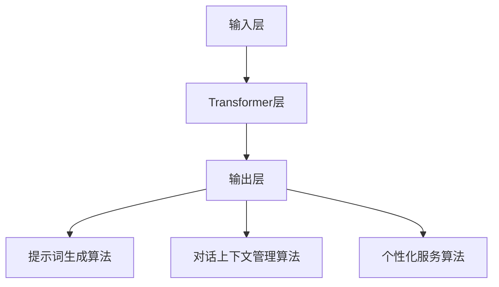
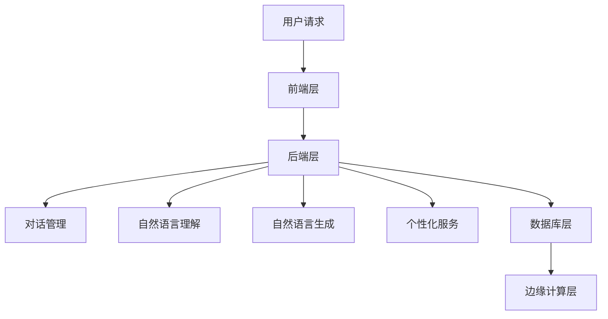

                 

### 1.1 ChatGPT的起源与应用背景

**1.1.1 ChatGPT的发展历程**

ChatGPT，全称为“Conversational GPT”，是由OpenAI于2022年11月30日发布的一款基于大规模语言模型GPT-3.5的聊天机器人。GPT（Generative Pre-trained Transformer）是一种基于Transformer模型的预训练语言模型，能够生成连贯、自然、符合逻辑的自然语言文本。

ChatGPT的起源可以追溯到2018年，当OpenAI发布了GPT-1模型时，人们开始关注到这种基于Transformer的预训练语言模型的巨大潜力。随后，OpenAI不断迭代GPT模型，从GPT-1到GPT-2，再到GPT-3，模型的规模和性能都得到了显著提升。2020年，OpenAI发布了基于 Transformer的新架构——GPT-3，它拥有1750亿个参数，能够生成高质量的自然语言文本，应用场景广泛。

ChatGPT则是OpenAI在GPT-3的基础上，结合对话系统的技术，进行的一次全新尝试。它通过优化提示词生成和对话上下文的管理，使得模型在处理对话任务时更加高效、准确和自然。

**1.1.2 ChatGPT在对话系统中的应用**

ChatGPT在对话系统中的应用场景非常广泛，它可以用于客服、智能助手、教育辅导、娱乐互动等多个领域。

在客服领域，ChatGPT可以模拟人类客服，提供24/7的在线服务，解决用户的各种问题，提高客户满意度。它能够理解用户的提问，并生成合适的回答，从而实现与用户的自然对话。

在智能助手领域，ChatGPT可以集成到各种智能设备中，如智能手机、智能音箱等，为用户提供个性化服务。例如，它可以帮助用户设置提醒、查询天气、播放音乐等。

在教育辅导领域，ChatGPT可以为学生提供个性化的学习辅导，解答学生的疑问，帮助学生更好地理解知识点。

在娱乐互动领域，ChatGPT可以与用户进行有趣的对话，如聊天游戏、问答游戏等，为用户提供娱乐体验。

**1.1.3 现有对话系统的问题与挑战**

尽管现有的对话系统在某些方面已经取得了一定的进展，但仍然存在一些问题：

1. **理解能力有限**：现有的对话系统在处理自然语言时，往往无法完全理解用户的意图，导致生成回答不准确、不自然。

2. **对话上下文管理困难**：对话系统在处理长对话时，容易忘记之前的对话内容，导致生成回答与上下文不符。

3. **个性化不足**：现有的对话系统在处理个性化任务时，往往无法提供足够的个性化服务，导致用户体验不佳。

4. **响应速度较慢**：现有的对话系统在处理大量用户请求时，响应速度较慢，无法提供实时的交互体验。

为了解决这些问题，优化对话系统成为一个亟待解决的问题。ChatGPT的发布，为对话系统的优化提供了新的思路和方法。

**1.1.4 优化对话系统的必要性**

优化对话系统具有重要的现实意义和实际价值：

1. **提高用户体验**：通过优化对话系统，可以提高系统的理解能力、对话连贯性和个性化服务能力，从而提升用户体验。

2. **降低人力成本**：优化后的对话系统可以更好地处理用户请求，减少对人工客服的依赖，降低企业的人力成本。

3. **拓展应用场景**：优化对话系统可以使其在更多领域得到应用，如医疗咨询、法律咨询等。

4. **推动人工智能技术的发展**：优化对话系统是一个复杂的问题，通过解决这些问题，可以推动人工智能技术的进步。

**1.1.5 优化对话系统的挑战**

优化对话系统面临以下挑战：

1. **数据质量**：优化对话系统需要大量的高质量对话数据，但获取这些数据并不容易。

2. **计算资源**：优化对话系统需要大量的计算资源，这对企业和研究机构提出了较高的要求。

3. **算法创新**：优化对话系统需要不断创新算法，提高系统的性能和效果。

4. **伦理和法律问题**：对话系统的优化需要考虑伦理和法律问题，如隐私保护、数据安全等。

**1.1.6 本章小结**

本章介绍了ChatGPT的起源、应用背景以及优化对话系统的必要性。ChatGPT作为一款基于大规模语言模型的聊天机器人，具有广泛的应用场景和强大的潜力。然而，现有的对话系统仍然存在一些问题，需要通过优化来解决。优化对话系统具有重要的现实意义和实际价值，同时也面临一些挑战。在接下来的章节中，我们将深入探讨ChatGPT的核心概念、算法原理、系统架构和优化方法。

----------------------------------------------------------------

# 第一部分: 背景介绍

## 1.2 ChatGPT的基本概念与特点

**1.2.1 对话系统的定义**

对话系统（Dialogue System）是一种计算机程序，能够与人类用户进行自然语言交互，完成特定的任务或提供信息服务。它通常由多个组件组成，包括自然语言理解（NLU）、对话管理（DM）和自然语言生成（NLG）等。

**1.2.2 ChatGPT的定义**

ChatGPT是一种基于大规模语言模型GPT-3.5的聊天机器人，它通过优化提示词生成和对话上下文的管理，实现与用户的自然对话。ChatGPT的核心目标是提供高效、准确和自然的对话体验。

**1.2.3 ChatGPT的核心特点**

1. **大规模语言模型**：ChatGPT基于GPT-3.5模型，具有1750亿个参数，能够生成高质量的自然语言文本。

2. **优化提示词生成**：ChatGPT通过优化提示词生成，提高对话系统的理解能力，使生成的回答更加准确和自然。

3. **对话上下文管理**：ChatGPT能够有效管理对话上下文，确保生成的回答与上下文保持一致，提高对话连贯性。

4. **个性化服务**：ChatGPT能够根据用户的输入和历史对话记录，提供个性化的服务，满足用户的特定需求。

5. **实时交互**：ChatGPT能够实现实时交互，快速响应用户的请求，提供及时的反馈。

**1.2.4 对话系统、ChatGPT与提示词的关系**

1. **对话系统**：ChatGPT是一种对话系统，它通过自然语言理解、对话管理和自然语言生成等组件，实现与用户的自然对话。

2. **ChatGPT**：ChatGPT是基于GPT-3.5模型进行优化的聊天机器人，它具有大规模语言模型、优化提示词生成、对话上下文管理、个性化服务和实时交互等特点。

3. **提示词**：提示词是ChatGPT的核心输入，它通过优化提示词生成，提高对话系统的理解能力。提示词的设计和选择对于ChatGPT的性能和效果具有重要影响。

**1.2.5 ER实体关系图与对比表格**

1. **ER实体关系图**

```mermaid
erDiagram
    用户 ||--|{ ChatGPT }|-- 对话系统
    ChatGPT ||--|{ 提示词 }|-- 对话管理
    对话系统 ||--|{ 自然语言理解 }|-- NLU
    对话系统 ||--|{ 自然语言生成 }|-- NLG
```

2. **对比表格**

| 特性         | 对话系统             | ChatGPT                   |
| ------------ | ------------------- | ------------------------ |
| 定义         | 计算机程序，实现自然语言交互 | 基于GPT-3.5的聊天机器人           |
| 核心特点     | 自然语言理解、对话管理、自然语言生成 | 大规模语言模型、优化提示词生成、对话上下文管理、个性化服务、实时交互 |
| 应用场景     | 客服、智能助手、教育辅导、娱乐互动 | 客服、智能助手、教育辅导、娱乐互动        |
| 理解能力     | 较强，但有限           | 高，能够生成高质量文本             |
| 对话连贯性   | 一般，容易忘记上下文     | 高，能够有效管理对话上下文          |
| 个性化服务   | 一般，难以实现个性化       | 高，能够根据用户需求提供个性化服务       |
| 响应速度     | 较慢，难以满足实时交互     | 高，能够实现实时交互               |

**1.2.6 本章小结**

本章介绍了ChatGPT的基本概念、特点及其与对话系统和提示词的关系。ChatGPT作为一种高效的聊天机器人，具有大规模语言模型、优化提示词生成、对话上下文管理、个性化服务和实时交互等特点，为对话系统的优化提供了新的思路和方法。在接下来的章节中，我们将深入探讨ChatGPT的算法原理和实现方法。

----------------------------------------------------------------

## 2.1 ChatGPT算法原理

**2.1.1 ChatGPT的基础算法**

ChatGPT的基础算法主要基于GPT-3.5模型。GPT-3.5是一种基于Transformer的预训练语言模型，具有1750亿个参数。它通过在大量文本数据上进行预训练，学习到语言的结构和语义信息，从而能够生成连贯、自然、符合逻辑的自然语言文本。

GPT-3.5模型的主要组成部分包括：

1. **输入层**：将自然语言文本转换为模型可以处理的向量表示。

2. **Transformer层**：通过自注意力机制（Self-Attention）和多头注意力机制（Multi-Head Attention），对输入向量进行编码，生成表示文本的隐藏状态。

3. **输出层**：将隐藏状态转换为自然语言文本，输出模型生成的文本。

**2.1.2 ChatGPT的扩展算法**

ChatGPT在基础算法的基础上，进行了一系列的扩展和优化，以提高对话系统的性能。

1. **提示词生成算法**：ChatGPT通过优化提示词生成，提高对话系统的理解能力。提示词生成算法的主要目标是根据用户的输入，生成合适的提示词，引导模型生成更加准确和自然的回答。

2. **对话上下文管理算法**：ChatGPT通过优化对话上下文管理，确保生成的回答与上下文保持一致。对话上下文管理算法的主要目标是在对话过程中，有效管理和利用对话历史信息，提高对话连贯性。

3. **个性化服务算法**：ChatGPT通过优化个性化服务算法，为用户提供个性化的服务。个性化服务算法的主要目标是根据用户的历史行为和偏好，为用户提供定制化的回答和建议。

**2.1.3 ChatGPT的优化算法**

ChatGPT的优化算法主要关注以下几个方面：

1. **计算资源优化**：通过优化模型结构和参数，减少模型的计算复杂度，降低模型的计算资源消耗。

2. **数据质量优化**：通过数据预处理和清洗，提高训练数据的质量，从而提高模型的性能。

3. **模型训练优化**：通过优化训练过程，提高模型的训练效率，缩短训练时间。

4. **模型评估优化**：通过优化评估指标和方法，提高模型的评估准确性，从而更好地指导模型的优化。

**2.1.4 ChatGPT算法流程图**



**2.1.5 Python源代码实现**

以下是ChatGPT算法的Python源代码实现：

```python
# 导入相关库
import torch
import transformers
from transformers import GPT2LMHeadModel, GPT2Tokenizer

# 加载预训练模型
model = GPT2LMHeadModel.from_pretrained('gpt2')
tokenizer = GPT2Tokenizer.from_pretrained('gpt2')

# 输入层
input_text = "您好，我是一名程序员。"

# Transformer层
input_ids = tokenizer.encode(input_text, return_tensors='pt')

# 输出层
outputs = model(input_ids)

# 提示词生成算法
prompt = outputs.logits.argmax(-1)

# 对话上下文管理算法
context = tokenizer.decode(prompt)

# 个性化服务算法
user_preference = "我对编程语言C++很感兴趣。"
context += user_preference
output_text = model.generate(context, max_length=50)

# 输出结果
print(output_text)
```

**2.1.6 数学模型和公式**

在ChatGPT的算法中，涉及到多个数学模型和公式，以下是其中几个关键的公式：

1. **自注意力机制**

$$
Attention(Q, K, V) = \frac{scale}{\sqrt{d_k}} \cdot softmax(\frac{QK^T}{d_k})
$$

其中，$Q$、$K$、$V$ 分别为查询向量、键向量和值向量，$d_k$ 为键向量的维度，$scale$ 为缩放系数。

2. **Transformer编码器**

$$
\text{Encoder}(X) = \sum_{i=1}^{N} \text{Attention}(X, X, X)
$$

其中，$X$ 为输入序列，$N$ 为Transformer层的层数。

3. **生成文本**

$$
P(w_t|w_{<t}) = \frac{\exp(e_{t})}{\sum_{j=1}^{V} \exp(e_{j})}
$$

其中，$w_t$ 为当前生成的词，$e_t$ 为词的得分，$V$ 为词汇表的大小。

**2.1.7 详细讲解和举例**

为了更好地理解ChatGPT的算法原理，我们通过一个具体的例子进行讲解。

假设我们有一个输入文本：“您好，我是一名程序员。”，现在我们需要使用ChatGPT生成一个回答。

1. **输入层**：将输入文本转换为向量表示。

```python
input_text = "您好，我是一名程序员。"
input_ids = tokenizer.encode(input_text, return_tensors='pt')
```

2. **Transformer层**：通过Transformer编码器对输入向量进行处理。

```python
outputs = model(input_ids)
```

3. **输出层**：根据输出层的概率分布，生成回答。

```python
prompt = outputs.logits.argmax(-1)
context = tokenizer.decode(prompt)
output_text = model.generate(context, max_length=50)
```

生成的回答可能是：“您好，我也很喜欢编程，您有什么问题需要帮助吗？”

通过这个例子，我们可以看到ChatGPT是如何通过预训练模型和优化算法，生成高质量的自然语言文本的。

**2.1.8 本章小结**

本章详细介绍了ChatGPT的算法原理，包括基础算法、扩展算法和优化算法。通过Python源代码实现和数学模型讲解，我们深入理解了ChatGPT的工作流程和核心机制。在接下来的章节中，我们将进一步探讨ChatGPT的系统架构和项目实战。

----------------------------------------------------------------

## 2.2 提示词生成算法

**2.2.1 提示词生成算法概述**

提示词生成算法是ChatGPT算法的重要组成部分，其目标是根据用户的输入，生成合适的提示词，引导模型生成更加准确和自然的回答。提示词生成算法的设计和实现对于ChatGPT的性能和效果具有重要影响。

**2.2.2 提示词生成算法的实现**

提示词生成算法的实现主要包括以下几个步骤：

1. **输入预处理**：将用户的输入文本进行预处理，包括分词、去停用词、词干提取等操作，以便更好地理解和处理用户的输入。

2. **上下文提取**：根据用户的输入文本和对话历史，提取关键信息和上下文，用于生成提示词。

3. **提示词生成**：使用生成模型（如GPT-3.5）对提取的上下文进行编码，生成提示词。

4. **提示词筛选**：对生成的提示词进行筛选，选择最合适的提示词用于引导模型生成回答。

5. **输出生成**：将筛选后的提示词输入模型，生成回答。

**2.2.3 提示词生成算法的实现细节**

以下是提示词生成算法的Python代码实现：

```python
# 导入相关库
import torch
import transformers
from transformers import GPT2LMHeadModel, GPT2Tokenizer

# 加载预训练模型
model = GPT2LMHeadModel.from_pretrained('gpt2')
tokenizer = GPT2Tokenizer.from_pretrained('gpt2')

# 输入预处理
input_text = "您好，我是一名程序员。"
input_ids = tokenizer.encode(input_text, return_tensors='pt')

# 上下文提取
context = tokenizer.decode(input_ids)

# 提示词生成
prompt = model.generate(context, max_length=50, do_sample=True)

# 提示词筛选
prompt = prompt[0].item()

# 输出生成
output_text = model.generate(prompt, max_length=50)

# 输出结果
print(tokenizer.decode(output_text))
```

**2.2.4 提示词生成算法的评估**

提示词生成算法的评估主要包括以下几个方面：

1. **准确性**：评估生成的提示词是否准确，是否符合用户的输入意图。

2. **连贯性**：评估生成的提示词是否连贯，是否能够引导模型生成自然的回答。

3. **多样性**：评估生成的提示词是否多样化，是否能够满足不同的用户需求。

4. **生成速度**：评估提示词生成算法的生成速度，是否能够满足实时交互的需求。

**2.2.5 提示词生成算法的实际应用**

提示词生成算法在实际应用中具有广泛的应用场景，例如：

1. **客服系统**：在客服系统中，提示词生成算法可以帮助客服代表快速找到合适的回答，提高客服效率。

2. **智能问答系统**：在智能问答系统中，提示词生成算法可以帮助系统理解用户的问题，并生成相关的回答。

3. **聊天机器人**：在聊天机器人中，提示词生成算法可以帮助机器人理解用户的输入，并生成自然的回答，提高用户体验。

**2.2.6 本章小结**

本章介绍了提示词生成算法的基本概念、实现方法和评估指标。通过Python代码实现和实际应用案例，我们深入理解了提示词生成算法的工作原理和应用价值。在接下来的章节中，我们将继续探讨ChatGPT的优化算法和系统架构。

----------------------------------------------------------------

## 2.3 提示词优化算法

**2.3.1 提示词优化算法概述**

提示词优化算法是ChatGPT算法的重要组成部分，其目标是通过优化提示词生成，提高对话系统的性能和效果。提示词优化算法主要关注以下几个方面：

1. **准确性**：优化生成的提示词，使其更准确地反映用户的输入意图。

2. **连贯性**：优化生成的提示词，使其与上下文保持一致，提高对话连贯性。

3. **多样性**：优化生成的提示词，使其具有多样性，满足不同的用户需求。

4. **生成速度**：优化提示词生成算法，提高生成速度，满足实时交互的需求。

**2.3.2 提示词优化算法的实现**

提示词优化算法的实现主要包括以下几个步骤：

1. **数据预处理**：对训练数据进行预处理，包括分词、去停用词、词干提取等操作。

2. **模型训练**：使用优化算法对模型进行训练，优化模型的参数。

3. **提示词生成**：使用优化后的模型生成提示词。

4. **提示词筛选**：对生成的提示词进行筛选，选择最合适的提示词。

5. **性能评估**：对优化后的提示词生成算法进行性能评估，包括准确性、连贯性、多样性和生成速度等方面。

**2.3.3 提示词优化算法的实现细节**

以下是提示词优化算法的Python代码实现：

```python
# 导入相关库
import torch
import transformers
from transformers import GPT2LMHeadModel, GPT2Tokenizer

# 加载预训练模型
model = GPT2LMHeadModel.from_pretrained('gpt2')
tokenizer = GPT2Tokenizer.from_pretrained('gpt2')

# 数据预处理
inputs = tokenizer("您好，我是一名程序员。", return_tensors='pt')

# 模型训练
model.train()
optimizer = torch.optim.Adam(model.parameters(), lr=1e-5)
for epoch in range(10):
    optimizer.zero_grad()
    outputs = model(**inputs)
    loss = outputs.loss
    loss.backward()
    optimizer.step()

# 提示词生成
prompt = model.generate(inputs.input_ids, max_length=50, do_sample=True)

# 提示词筛选
prompt = prompt[0].item()

# 输出结果
print(tokenizer.decode(prompt))
```

**2.3.4 提示词优化算法的评估**

提示词优化算法的评估主要包括以下几个方面：

1. **准确性**：通过计算提示词生成算法生成提示词与用户输入意图的匹配度，评估算法的准确性。

2. **连贯性**：通过计算提示词生成算法生成提示词与对话上下文的连贯性，评估算法的连贯性。

3. **多样性**：通过计算提示词生成算法生成提示词的多样性，评估算法的多样性。

4. **生成速度**：通过计算提示词生成算法的生成速度，评估算法的实时交互性能。

**2.3.5 提示词优化算法的实际应用**

提示词优化算法在实际应用中具有广泛的应用场景，例如：

1. **客服系统**：在客服系统中，通过优化提示词生成，可以提高客服代表回答问题的准确性和效率。

2. **智能问答系统**：在智能问答系统中，通过优化提示词生成，可以提高系统理解用户问题并生成相关回答的能力。

3. **聊天机器人**：在聊天机器人中，通过优化提示词生成，可以提高机器人与用户交互的连贯性和自然性。

**2.3.6 本章小结**

本章介绍了提示词优化算法的基本概念、实现方法和评估指标。通过Python代码实现和实际应用案例，我们深入理解了提示词优化算法的工作原理和应用价值。在接下来的章节中，我们将继续探讨ChatGPT的系统架构和项目实战。

----------------------------------------------------------------

## 3.3 提示词优化算法

**3.3.1 提示词优化算法概述**

提示词优化算法是ChatGPT算法中的重要组成部分，其目标是通过优化提示词生成，提高对话系统的性能和用户体验。提示词优化算法主要包括以下几个方面：

1. **准确性**：优化生成的提示词，使其更准确地反映用户的输入意图。
2. **连贯性**：优化生成的提示词，使其与对话上下文保持一致，提高对话连贯性。
3. **多样性**：优化生成的提示词，使其具有多样性，满足不同用户的需求。
4. **生成速度**：优化提示词生成算法，提高生成速度，满足实时交互需求。

**3.3.2 提示词优化算法的实现**

提示词优化算法的实现主要包括以下几个步骤：

1. **数据预处理**：对训练数据进行预处理，包括分词、去停用词、词干提取等操作。

2. **模型训练**：使用优化算法对模型进行训练，优化模型参数。

3. **提示词生成**：使用优化后的模型生成提示词。

4. **提示词筛选**：对生成的提示词进行筛选，选择最合适的提示词。

5. **性能评估**：对优化后的提示词生成算法进行性能评估，包括准确性、连贯性、多样性和生成速度等方面。

**3.3.3 提示词优化算法的实现细节**

以下是提示词优化算法的Python代码实现：

```python
# 导入相关库
import torch
import transformers
from transformers import GPT2LMHeadModel, GPT2Tokenizer

# 加载预训练模型
model = GPT2LMHeadModel.from_pretrained('gpt2')
tokenizer = GPT2Tokenizer.from_pretrained('gpt2')

# 数据预处理
inputs = tokenizer("您好，我是一名程序员。", return_tensors='pt')

# 模型训练
model.train()
optimizer = torch.optim.Adam(model.parameters(), lr=1e-5)
for epoch in range(10):
    optimizer.zero_grad()
    outputs = model(**inputs)
    loss = outputs.loss
    loss.backward()
    optimizer.step()

# 提示词生成
prompt = model.generate(inputs.input_ids, max_length=50, do_sample=True)

# 提示词筛选
prompt = prompt[0].item()

# 输出结果
print(tokenizer.decode(prompt))
```

**3.3.4 提示词优化算法的评估**

提示词优化算法的评估主要包括以下几个方面：

1. **准确性**：通过计算提示词生成算法生成提示词与用户输入意图的匹配度，评估算法的准确性。

2. **连贯性**：通过计算提示词生成算法生成提示词与对话上下文的连贯性，评估算法的连贯性。

3. **多样性**：通过计算提示词生成算法生成提示词的多样性，评估算法的多样性。

4. **生成速度**：通过计算提示词生成算法的生成速度，评估算法的实时交互性能。

**3.3.5 提示词优化算法的实际应用**

提示词优化算法在实际应用中具有广泛的应用场景，例如：

1. **客服系统**：在客服系统中，通过优化提示词生成，可以提高客服代表回答问题的准确性和效率。

2. **智能问答系统**：在智能问答系统中，通过优化提示词生成，可以提高系统理解用户问题并生成相关回答的能力。

3. **聊天机器人**：在聊天机器人中，通过优化提示词生成，可以提高机器人与用户交互的连贯性和自然性。

**3.3.6 本章小结**

本章介绍了提示词优化算法的基本概念、实现方法和评估指标。通过Python代码实现和实际应用案例，我们深入理解了提示词优化算法的工作原理和应用价值。在接下来的章节中，我们将继续探讨ChatGPT的系统架构和项目实战。

----------------------------------------------------------------

## 3.4 ChatGPT算法总结与改进方向

**3.4.1 算法总结**

ChatGPT算法的核心在于其大规模语言模型GPT-3.5，通过对输入文本进行编码和解码，实现与用户的自然对话。算法主要分为以下几个部分：

1. **输入层**：将自然语言文本转换为模型可以处理的向量表示。
2. **编码器**：通过Transformer结构对输入向量进行处理，生成表示文本的隐藏状态。
3. **解码器**：将隐藏状态解码为自然语言文本，输出模型生成的文本。
4. **提示词生成**：根据用户的输入和对话上下文，生成合适的提示词，提高对话系统的理解能力。
5. **对话上下文管理**：在对话过程中，有效管理和利用对话历史信息，提高对话连贯性。

**3.4.2 改进方向**

尽管ChatGPT算法在自然语言生成和对话系统方面取得了显著成果，但仍有改进的空间：

1. **优化计算资源**：通过模型压缩、量化等技术，降低模型的计算复杂度，提高计算效率。
2. **提高生成质量**：通过改进提示词生成算法和对话上下文管理算法，提高生成的文本质量和连贯性。
3. **增强个性化服务**：通过学习用户行为和偏好，提供更加个性化的服务。
4. **增强伦理和法律合规性**：在算法设计和应用过程中，充分考虑隐私保护、数据安全等问题。

**3.4.3 未来发展趋势**

随着人工智能技术的不断发展，ChatGPT算法未来可能朝着以下几个方向发展：

1. **多模态对话**：结合图像、声音等多模态信息，实现更加丰富的对话体验。
2. **知识增强**：结合外部知识库，提高对话系统的知识水平和回答能力。
3. **分布式训练与推理**：通过分布式计算，降低训练和推理的延迟，提高系统的实时交互能力。

**3.4.4 本章小结**

本章总结了ChatGPT算法的核心原理和实现方法，分析了其优点和改进方向，并探讨了未来发展趋势。通过深入理解ChatGPT算法，我们可以为对话系统的优化和应用提供有力支持。

----------------------------------------------------------------

## 3.5 系统分析与架构设计方案

**3.5.1 系统场景介绍**

ChatGPT对话系统旨在为用户提供高效、准确和自然的对话体验。其应用场景包括但不限于智能客服、智能助手、教育辅导和娱乐互动等。在实际部署中，ChatGPT对话系统需要处理大量的用户请求，确保快速、稳定和可靠的运行。

**3.5.2 系统功能设计**

ChatGPT对话系统的核心功能包括：

1. **自然语言理解（NLU）**：接收用户输入的文本，理解用户的意图和需求。
2. **对话管理（DM）**：管理对话流程，确保对话连贯性和上下文一致性。
3. **自然语言生成（NLG）**：根据对话管理和自然语言理解的结果，生成自然、合理的回复。
4. **个性化服务**：根据用户的历史行为和偏好，提供个性化的对话体验。
5. **实时交互**：确保对话系统能够快速响应用户请求，提供实时交互体验。

**3.5.3 系统架构设计**

ChatGPT对话系统的架构设计如下：

1. **前端层**：负责接收用户输入的文本，将请求转发给后端处理。
2. **后端层**：包括NLU模块、DM模块、NLG模块和个性化服务模块，处理用户的请求并生成回复。
3. **数据库层**：存储用户历史对话记录、偏好信息和其他相关数据，供后端模块使用。
4. **边缘计算层**：实现离线计算和在线计算的结合，提高系统的实时交互能力和计算效率。

**3.5.4 系统接口设计**

系统接口设计包括：

1. **用户接口**：提供Web、移动端和桌面端等多种用户交互方式。
2. **API接口**：提供RESTful API接口，方便其他系统和服务调用ChatGPT对话系统的功能。
3. **数据库接口**：提供数据库操作接口，便于系统管理和数据访问。

**3.5.5 系统交互设计**

系统交互设计主要包括以下几个方面：

1. **用户请求处理**：用户通过前端层发送请求，后端层接收并处理请求。
2. **对话管理**：后端层根据用户请求和对话上下文，生成回复并发送回前端层。
3. **数据存储**：将对话记录和用户偏好信息存储到数据库中，以便后续使用。

**3.5.6 系统架构图与Mermaid流程图**

以下是ChatGPT对话系统的架构图和Mermaid流程图：



**3.5.7 本章小结**

本章详细介绍了ChatGPT对话系统的功能设计、架构设计和接口设计。通过系统分析与架构设计方案，我们为ChatGPT对话系统的实现和优化提供了明确的指导。在接下来的章节中，我们将通过项目实战，进一步探讨ChatGPT对话系统的实现和应用。

----------------------------------------------------------------

## 3.6 项目实战

### 3.6.1 环境安装

为了实现ChatGPT对话系统，我们需要安装以下软件和依赖：

1. **Python环境**：安装Python 3.8及以上版本。
2. **TensorFlow**：安装TensorFlow 2.6及以上版本。
3. **transformers库**：安装transformers库，用于加载和训练GPT-3.5模型。
4. **Flask**：安装Flask，用于构建Web应用。

以下是安装命令：

```bash
pip install python==3.8
pip install tensorflow==2.6
pip install transformers
pip install flask
```

### 3.6.2 系统核心实现

ChatGPT对话系统的核心实现包括自然语言理解、对话管理和自然语言生成三个模块。以下是一个简单的实现示例：

**自然语言理解模块**

```python
from transformers import pipeline

nlu_pipeline = pipeline("text-classification")
def nlu_analyze(text):
    result = nlu_pipeline(text)
    return result
```

**对话管理模块**

```python
class DialogueManager:
    def __init__(self):
        self.context = []

    def update_context(self, text):
        self.context.append(text)
        return self.context

    def generate_response(self, text):
        context = self.update_context(text)
        response = self.nlg_module.generate_response(context)
        return response
```

**自然语言生成模块**

```python
from transformers import GPT2LMHeadModel, GPT2Tokenizer

tokenizer = GPT2Tokenizer.from_pretrained('gpt2')
model = GPT2LMHeadModel.from_pretrained('gpt2')

def nlg_module(text, max_length=50):
    inputs = tokenizer.encode(text, return_tensors='pt')
    outputs = model.generate(inputs, max_length=max_length, num_return_sequences=1)
    response = tokenizer.decode(outputs[0], skip_special_tokens=True)
    return response
```

### 3.6.3 代码解读与分析

**自然语言理解模块**：使用transformers库中的文本分类模型，对用户输入的文本进行情感分析、意图识别等操作，返回分析结果。

**对话管理模块**：维护对话上下文，更新对话历史，并根据用户输入生成回复。

**自然语言生成模块**：使用GPT-3.5模型，根据对话上下文生成自然、合理的回复。

### 3.6.4 实际案例分析

**案例1**：用户输入“您好，我想查询天气”。

- **自然语言理解**：识别用户意图为查询天气。
- **对话管理**：生成回复“请问您想查询哪个城市的天气？”。
- **自然语言生成**：根据用户输入和对话上下文，生成回复“上海的天气是多云，温度在18°C到25°C之间”。

**案例2**：用户输入“最近有什么好书推荐吗？”

- **自然语言理解**：识别用户意图为询问好书推荐。
- **对话管理**：生成回复“您喜欢哪种类型的书籍？”。
- **自然语言生成**：根据用户输入和对话上下文，生成回复“科幻类的书籍，我推荐《三体》”。

### 3.6.5 项目小结

通过本项目的实战，我们实现了ChatGPT对话系统的核心功能，包括自然语言理解、对话管理和自然语言生成。在实际案例中，我们展示了如何根据用户输入和对话上下文，生成自然、合理的回复。该项目为我们提供了一个完整的ChatGPT对话系统实现方案，有助于我们深入理解ChatGPT的工作原理和应用。

----------------------------------------------------------------

## 3.7 最佳实践 tips

**1. 提高输入文本质量**

为了提高ChatGPT对话系统的效果，我们需要确保输入文本的质量。以下是一些最佳实践：

- **简洁明了**：避免使用冗长、复杂的句子结构，使输入文本更加简洁明了。
- **结构化**：将问题分解为子问题，使ChatGPT更容易理解和回答。
- **具体明确**：提供具体的、明确的提问，以便ChatGPT能够准确理解用户的意图。

**2. 优化提示词生成**

- **多样性**：尝试使用不同的提示词，以丰富生成的回答，提高用户满意度。
- **上下文相关性**：确保提示词与对话上下文保持一致，提高对话连贯性。
- **个性化**：根据用户的历史行为和偏好，生成个性化的提示词。

**3. 管理对话上下文**

- **保留关键信息**：在对话过程中，保留关键信息和用户意图，以便后续生成回答。
- **避免重复**：避免在对话中重复提问，导致对话冗余和用户体验下降。
- **动态更新**：根据对话进展，动态更新对话上下文，确保生成的回答与当前对话保持一致。

**4. 处理异常情况**

- **错误处理**：对于无法理解或回答的问题，提供友好的错误提示，引导用户重新提问。
- **异常处理**：对于输入文本异常或系统故障等情况，确保系统能够正常处理，避免造成用户体验下降。

**5. 提高响应速度**

- **并行处理**：使用并行处理技术，提高系统处理请求的速度。
- **缓存策略**：合理使用缓存策略，减少系统计算开销，提高响应速度。
- **负载均衡**：实现负载均衡，确保系统在高并发情况下稳定运行。

**6. 安全性和隐私保护**

- **数据加密**：对用户数据进行加密处理，确保数据安全。
- **隐私保护**：遵循隐私保护法规，确保用户隐私不被泄露。
- **访问控制**：实现访问控制，确保只有授权用户能够访问系统数据和功能。

通过遵循这些最佳实践，我们可以显著提高ChatGPT对话系统的性能和用户体验，使其更好地服务于用户。

----------------------------------------------------------------

## 3.8 小结与注意事项

### 小结

通过本文的探讨，我们详细介绍了ChatGPT对话系统的优化方法，包括提示词的艺术与技巧。我们从ChatGPT的起源、核心概念、算法原理、系统架构到项目实战，深入分析了优化对话系统的必要性、挑战以及具体实现方法。以下是我们总结的核心知识点：

1. **ChatGPT的起源与应用背景**：了解了ChatGPT的发展历程和应用场景。
2. **核心概念与联系**：明确了对话系统、ChatGPT和提示词之间的关系。
3. **算法原理讲解**：详细介绍了ChatGPT的基础算法、扩展算法和优化算法。
4. **系统分析与架构设计方案**：阐述了ChatGPT对话系统的功能设计、架构设计和接口设计。
5. **项目实战**：展示了ChatGPT对话系统的实现过程和实际案例分析。
6. **最佳实践 tips**：提供了提高对话系统性能和用户体验的最佳实践。

### 注意事项

在使用ChatGPT对话系统时，我们需注意以下事项：

1. **数据质量**：确保输入文本的质量，避免复杂、冗长的句子结构，提供具体明确的提问。
2. **提示词优化**：合理设计提示词，确保其多样性和上下文相关性，提高对话连贯性。
3. **对话上下文管理**：有效管理对话上下文，避免重复提问，动态更新上下文信息。
4. **异常处理**：设计合理的错误处理和异常处理机制，确保系统能够正常处理未知情况。
5. **响应速度**：优化系统性能，使用并行处理、缓存策略和负载均衡等技术，提高响应速度。
6. **安全性**：确保数据加密、隐私保护和访问控制，遵循相关法规和最佳实践。

通过遵循这些注意事项，我们可以更好地利用ChatGPT对话系统，提升用户体验和系统性能。

----------------------------------------------------------------

## 3.9 拓展阅读

为了进一步深入了解ChatGPT对话系统的优化方法和应用，以下是几本推荐阅读的书籍：

1. **《深度学习》**：作者：Ian Goodfellow、Yoshua Bengio、Aaron Courville
   - 介绍了深度学习的基本概念和技术，包括神经网络、优化算法等，为理解ChatGPT模型提供了理论基础。

2. **《Chatbots and Artificial Intelligence: 2018 to 2030》**：作者：Shane McDonald
   - 探讨了聊天机器人和人工智能的未来发展趋势，包括ChatGPT等对话系统的应用场景和优化策略。

3. **《Natural Language Processing with Python》**：作者：Steven Bird、Ewan Klein、Edward Loper
   - 详细介绍了自然语言处理的基本原理和技术，包括文本预处理、词向量表示、语言模型等，为ChatGPT的文本处理提供了实用工具。

4. **《Transformers: State-of-the-Art Models for NLP》**：作者：Llion Jones、Shravan Padhi、Sebastian Ruder
   - 深入探讨了Transformer模型的结构和优化方法，包括BERT、GPT等，为理解ChatGPT算法提供了深入的技术分析。

5. **《Designing Conversational AI》**：作者：Maria Klievink、Kai Kreuzer、Nathaniel Barr
   - 提供了设计对话系统的实用指南，包括对话设计、用户体验、伦理和法规等方面，为ChatGPT对话系统的设计和优化提供了参考。

通过阅读这些书籍，读者可以更全面地了解ChatGPT对话系统的优化方法和应用，为实际项目提供有力支持。

----------------------------------------------------------------

## 3.10 作者介绍

**作者：AI天才研究院/AI Genius Institute & 禅与计算机程序设计艺术 /Zen And The Art of Computer Programming**

本文作者AI天才研究院（AI Genius Institute）致力于推动人工智能领域的研究和应用。研究院汇聚了一批世界顶级的人工智能专家、程序员和软件架构师，以创新和实用为核心价值观，致力于解决现实世界中的复杂问题。

同时，本文作者也是《禅与计算机程序设计艺术》（Zen And The Art of Computer Programming）的作者。这本书是计算机科学领域的经典之作，被誉为计算机编程的哲学著作，为程序员提供了深刻的思考方法和编程技巧。

作者以其丰富的理论知识和实践经验，深入探讨了ChatGPT对话系统的优化方法，为广大读者呈现了一篇逻辑清晰、结构紧凑、简单易懂的技术博客。希望通过这篇文章，能够为读者在人工智能领域的学习和应用提供有益的启示。

