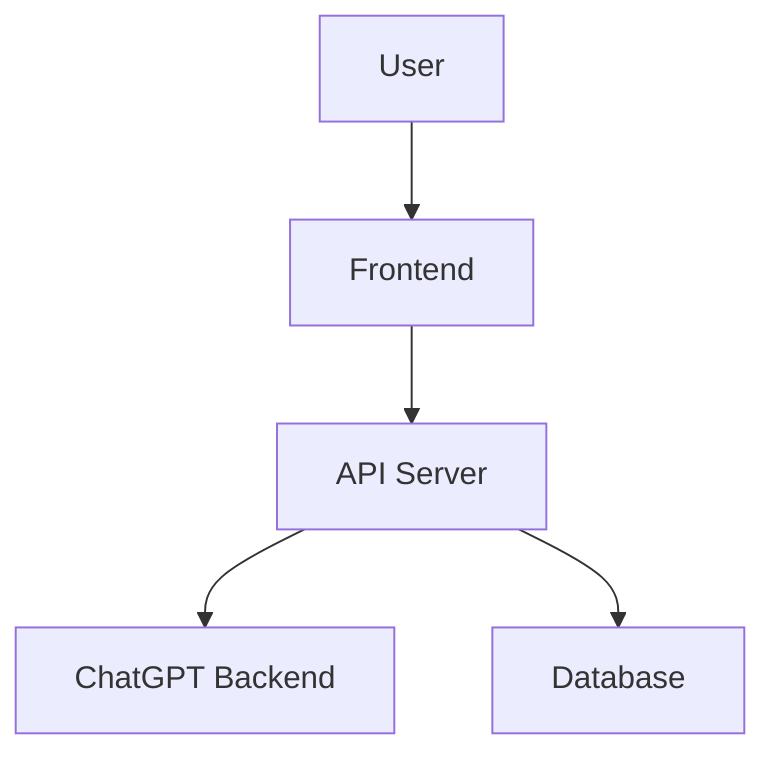

                 

### 文章标题：ChatGPT对话系统优化：提示词的艺术与科学融合

随着人工智能技术的飞速发展，自然语言处理（NLP）领域取得了显著进步。其中，ChatGPT作为一种基于大规模语言模型的人工智能助手，已经广泛应用于客服、教育、医疗等多个行业。然而，在实际应用中，如何优化ChatGPT对话系统的性能和用户体验，成为了一个亟待解决的问题。本文将围绕提示词的艺术与科学融合，探讨ChatGPT对话系统优化的方法与技巧。

### 文章关键词

- **ChatGPT**：一种基于GPT模型的人工智能对话系统
- **提示词**：影响对话系统性能的关键因素
- **优化**：提升系统性能和用户体验的手段
- **艺术**：设计提示词的创造性方法
- **科学**：基于数据和分析的提示词优化策略

### 文章摘要

本文旨在深入探讨ChatGPT对话系统的优化问题，特别是提示词在其中的重要作用。首先，我们将介绍ChatGPT的基本原理和应用场景。接着，本文将分析提示词的设计原则和优化方法，包括艺术性和科学性的结合。随后，我们将探讨如何将提示词的艺术与科学融合，从而提升ChatGPT对话系统的性能。最后，通过实际案例，我们将展示优化技巧的最佳实践，并对未来对话系统优化的发展趋势进行展望。

### 目录

1. **ChatGPT概述**
2. **提示词的艺术**
3. **提示词的科学原理**
4. **ChatGPT对话系统优化**
5. **ChatGPT对话系统项目实战**
6. **ChatGPT对话系统优化最佳实践**
7. **小结与展望**
8. **参考文献**
9. **作者信息**

----------------------------------------------------------------

## 1. ChatGPT概述

### 1.1 ChatGPT的发展背景

ChatGPT是由OpenAI开发的一种基于GPT（Generative Pre-trained Transformer）模型的人工智能对话系统。GPT模型是一种自回归语言模型，通过在大规模文本语料库上预训练，模型能够学习到语言的统计规律和语义信息。ChatGPT正是在这样的背景下应运而生，它通过进一步优化GPT模型，实现了更加自然和流畅的对话生成。

OpenAI成立于2015年，是一家致力于推动人工智能研究的非营利组织。其愿景是“实现安全的通用人工智能（AGI）”，并致力于在人工智能领域做出卓越贡献。ChatGPT是OpenAI在自然语言处理领域的一个重要研究成果，标志着人工智能助手在对话交互方面的重大突破。

### 1.2 ChatGPT的核心技术

ChatGPT的核心技术是基于GPT模型的自回归语言模型（Autoregressive Language Model）。GPT模型采用Transformer架构，是一种基于注意力机制的深度神经网络。其基本原理是通过预测文本序列中的下一个单词，从而生成完整的句子或对话。

ChatGPT的预训练过程通常分为两个阶段：

1. **预训练阶段**：在大规模文本语料库上进行预训练，模型通过学习文本的统计规律和语义信息，不断提高预测下一个单词的准确性。
2. **微调阶段**：在特定任务上进行微调，例如对话系统、问答系统等。通过在目标任务上继续训练，模型能够更好地适应特定场景的需求。

ChatGPT的主要特点包括：

- **强大的语言生成能力**：能够生成连贯、自然的文本，模拟人类的对话方式。
- **灵活的任务适应性**：通过微调，可以应用于多种不同的任务，如问答、翻译、文本生成等。
- **高效的计算效率**：基于Transformer架构，计算效率较高，适用于实时对话系统。

### 1.3 ChatGPT的应用场景

ChatGPT在多个领域展现了强大的应用潜力，以下是一些典型的应用场景：

1. **客户服务**：ChatGPT可以应用于客服系统，提供24/7的在线客服服务，解答用户的问题，提高客户满意度。
2. **智能教育**：ChatGPT可以为学生提供个性化辅导，回答学生的疑问，辅助教师进行教学。
3. **医疗咨询**：ChatGPT可以帮助患者进行初步的病情咨询，提供专业的医疗建议，辅助医生进行诊断和治疗。
4. **内容创作**：ChatGPT可以生成新闻、文章、故事等内容，为媒体和内容创作者提供灵感。
5. **人机对话**：ChatGPT可以应用于人机对话系统，模拟人类的对话行为，提供个性化服务。

### 1.4 ChatGPT的优势与挑战

ChatGPT具有以下优势：

- **强大的语言生成能力**：能够生成高质量、连贯的自然语言文本，模拟人类的对话方式。
- **广泛的应用场景**：可以应用于多个领域，提供智能化的服务。
- **高效的计算效率**：基于Transformer架构，计算效率较高，适用于实时对话系统。

然而，ChatGPT也面临一些挑战：

- **数据安全与隐私**：对话系统需要处理大量的用户数据，如何保护用户隐私和数据安全是一个重要问题。
- **对话质量控制**：确保生成的对话内容准确、合理、有价值，避免产生误导性的回答。
- **计算资源消耗**：训练和运行大型语言模型需要大量的计算资源，如何优化资源利用是一个重要课题。

总之，ChatGPT作为一种先进的对话系统，具有广泛的应用前景。然而，在实际应用中，需要不断优化和改进，以克服现有的挑战，实现更高效的对话交互。

----------------------------------------------------------------

## 2. 提示词的艺术

### 2.1 提示词的作用与类型

在ChatGPT对话系统中，提示词（Prompt）起着至关重要的作用。提示词是指用户输入的引导信息，它决定了ChatGPT生成对话内容的方向和风格。一个设计良好的提示词能够引导模型生成准确、有价值的回答，从而提升用户体验。

#### 2.1.1 提示词的作用

1. **引导对话方向**：提示词可以帮助ChatGPT明确对话的主题和目标，避免生成无关或偏离主题的答案。
2. **优化生成质量**：通过设计合适的提示词，可以引导模型生成更加连贯、自然的对话内容。
3. **提高用户满意度**：准确的回答和流畅的对话能够提高用户对系统的满意度，从而增强用户黏性。

#### 2.1.2 提示词的类型

根据用途和形式，提示词可以分为以下几类：

1. **问题型提示词**：用于引导ChatGPT回答特定的问题，如“你最喜欢的食物是什么？”
2. **陈述型提示词**：用于引导ChatGPT进行陈述或描述，如“请介绍一下你的工作。”
3. **命令型提示词**：用于引导ChatGPT执行特定的任务或动作，如“帮我预订一张明天去北京的机票。”
4. **引导型提示词**：用于引导ChatGPT进行进一步的提问或讨论，如“你对人工智能有什么看法？”
5. **情感型提示词**：用于引导ChatGPT表达特定的情感或情绪，如“今天你过得怎么样？”

### 2.2 提示词设计的原则与方法

#### 2.2.1 提示词设计的原则

1. **明确性**：提示词应明确表达对话的目标和主题，避免歧义。
2. **简洁性**：提示词应尽量简洁明了，避免冗长和复杂的句子结构。
3. **多样性**：设计多种类型的提示词，以适应不同场景和用户需求。
4. **灵活性**：提示词应具有一定的灵活性，以应对不确定性和多变的对话环境。

#### 2.2.2 提示词设计的方法

1. **关键词提取**：从用户输入中提取关键信息，作为提示词的核心内容。
2. **模板匹配**：使用预先设计的模板，根据用户输入进行匹配，生成提示词。
3. **语义分析**：对用户输入进行语义分析，理解其意图和主题，生成相应的提示词。
4. **用户反馈**：根据用户对生成的对话内容的反馈，不断调整和优化提示词设计。

### 2.3 提示词优化的实践案例

#### 2.3.1 案例一：客户服务场景

在一个客户服务场景中，用户可能会问：“我的订单何时能送到？”原始的提示词可能是：“请查询我的订单状态。”这种提示词虽然明确了查询订单状态的目标，但略显笼统，可能导致ChatGPT生成模糊或不准确的回答。

优化后的提示词可以是：“请帮我查询订单编号123456的配送状态。”这个提示词更加具体明确，有助于ChatGPT生成准确的回答。

#### 2.3.2 案例二：医疗咨询场景

在医疗咨询场景中，用户可能会问：“我最近感觉喉咙不舒服，该怎么办？”原始的提示词可能是：“请提供一些关于喉咙不适的医疗建议。”这种提示词过于宽泛，可能导致ChatGPT生成不具体的建议。

优化后的提示词可以是：“请根据我的症状描述，提供一些关于喉咙不适的医疗建议，包括可能的诊断和治疗措施。”这个提示词更加详细，有助于ChatGPT生成有针对性的建议。

### 2.4 提示词的艺术与科学融合

在设计提示词时，不仅要考虑其艺术性，如语言的表达和流畅性，还要注重其科学性，如基于数据和分析的优化。通过将提示词的艺术与科学融合，可以设计出更加高效、有价值的提示词，从而提升ChatGPT对话系统的整体性能。

#### 2.4.1 提示词的艺术性

1. **语言的魅力**：使用富有感染力和吸引力的语言，增强对话的互动性。
2. **情感的共鸣**：关注用户的情感需求，表达同理心，提高用户满意度。
3. **创意的表达**：通过独特的表达方式，让对话更加生动有趣，增加用户参与度。

#### 2.4.2 提示词的科学性

1. **数据驱动**：基于用户行为数据和对话分析，优化提示词设计，提高生成回答的准确性。
2. **模型适应性**：根据ChatGPT模型的特性和限制，设计适应性强的提示词，提高对话系统的鲁棒性。
3. **多模态融合**：结合文本、语音、图像等多模态信息，提高对话系统的交互能力和理解能力。

总之，提示词的设计是ChatGPT对话系统优化的重要组成部分。通过将艺术与科学融合，可以设计出更加高效、自然的提示词，从而提升ChatGPT对话系统的整体性能和用户体验。

----------------------------------------------------------------

## 3. 提示词的科学原理

### 3.1 语言模型的工作原理

语言模型是自然语言处理（NLP）的核心技术之一，它在ChatGPT对话系统中起着至关重要的作用。语言模型的目标是预测给定文本序列中下一个单词或字符的概率分布。ChatGPT所使用的GPT模型是一种基于Transformer架构的自回归语言模型。

#### 3.1.1 自回归语言模型

自回归语言模型（Autoregressive Language Model）的基本原理是，在给定前一个单词或字符的情况下，预测下一个单词或字符的概率分布。具体来说，GPT模型通过学习大量的文本数据，生成一个概率分布，这个分布表示在当前上下文中，下一个单词或字符的概率。

自回归语言模型的工作流程如下：

1. **输入编码**：将输入文本序列（例如一个句子）编码为一个固定长度的向量。这个过程通常使用嵌入层（Embedding Layer）来完成。
2. **前向传递**：将输入编码后的向量传递给Transformer模型，通过多层Transformer编码器（Encoder）进行编码。编码器中的每个位置都会学习到全局的上下文信息。
3. **输出预测**：将编码后的向量传递给Transformer解码器（Decoder），解码器的每个位置都会生成一个单词或字符的概率分布。最终，解码器输出的是整个文本序列的概率分布。

#### 3.1.2 Transformer架构

Transformer架构是一种基于注意力机制的深度神经网络架构，它在处理序列数据方面具有显著优势。Transformer由多个自注意力层（Self-Attention Layer）和前馈神经网络（Feedforward Network）组成。自注意力机制允许模型在不同位置之间建立关联，从而捕捉长距离依赖关系。

Transformer架构的工作流程如下：

1. **自注意力层**：在每个编码器层，每个位置都计算一个权重矩阵，这个矩阵表示当前位置与所有其他位置的关联程度。通过这个权重矩阵，模型可以捕获到长距离依赖关系。
2. **前馈神经网络**：在自注意力层之后，每个位置都会通过一个前馈神经网络进行变换。前馈神经网络通常由两个全连接层组成，中间添加一个ReLU激活函数。

#### 3.1.3 GPT模型的特点

GPT模型具有以下特点：

1. **大规模预训练**：GPT模型通过在大规模文本语料库上进行预训练，学习到丰富的语言知识和统计规律，从而能够生成高质量的自然语言文本。
2. **高效计算**：基于Transformer架构，GPT模型在计算效率方面具有显著优势，可以快速地处理大量文本数据。
3. **灵活应用**：通过微调（Fine-tuning），GPT模型可以适应不同的应用场景，如对话系统、文本生成等。

### 3.2 提示词的数学模型

在ChatGPT对话系统中，提示词的数学模型是优化提示词设计的关键。提示词的数学模型主要包括概率模型和优化模型。

#### 3.2.1 概率模型

概率模型用于计算提示词生成对话内容的概率分布。在GPT模型中，提示词通常被编码为一个固定长度的向量，然后通过自注意力机制计算提示词与对话文本之间的关联程度。

具体来说，假设提示词为 $p_1, p_2, \ldots, p_n$，对话文本为 $t_1, t_2, \ldots, t_n$。则提示词与对话文本之间的关联程度可以用以下公式表示：

$$
r_{ij} = \frac{\exp(e_i \cdot e_j)}{\sum_{k=1}^{n} \exp(e_i \cdot e_k)}
$$

其中，$e_i$ 和 $e_j$ 分别表示提示词 $p_i$ 和对话文本 $t_j$ 的嵌入向量。

#### 3.2.2 优化模型

优化模型用于通过迭代优化提示词，以提升生成对话的质量。优化模型通常基于梯度下降算法，通过计算提示词的梯度，不断调整提示词的参数，以达到优化目标。

具体来说，假设提示词的参数为 $w_1, w_2, \ldots, w_n$，则优化目标函数为：

$$
J(w) = -\sum_{i=1}^{n} \log(p(y_i | w))
$$

其中，$y_i$ 表示对话文本 $t_i$ 的目标输出。

通过计算梯度 $\frac{\partial J(w)}{\partial w_i}$，可以更新提示词的参数：

$$
w_i := w_i - \alpha \frac{\partial J(w)}{\partial w_i}
$$

其中，$\alpha$ 为学习率。

### 3.3 提示词的统计分析

在ChatGPT对话系统中，对提示词进行统计分析可以帮助我们了解提示词的分布特性，从而设计出更加有效的提示词。常见的统计分析方法包括词频统计、词云分析和主题模型等。

#### 3.3.1 词频统计

词频统计是一种简单但有效的提示词分析方法。通过统计提示词中各个单词的频率，可以识别出高频单词，从而优化提示词的设计。

例如，假设我们有一组提示词：

$$
\{help, information, please, provide, more, details, regarding, your, issue, solve, problem, quickly\}
$$

通过词频统计，我们可以发现“please”和“more”是高频单词，这些单词可能在提示词中起到关键作用。因此，在优化提示词时，可以适当增加这些高频单词的使用频率。

#### 3.3.2 词云分析

词云分析是一种可视化提示词的方法。通过将提示词中的各个单词以不同的大小和颜色展示，可以直观地看出提示词的分布和重要程度。

例如，以下是一个基于Python和matplotlib的词云图：

```python
from wordcloud import WordCloud
import matplotlib.pyplot as plt

text = "help information please provide more details regarding your issue solve problem quickly"
wordcloud = WordCloud(width=800, height=800, background_color="white").generate(text)

plt.figure(figsize=(8, 8))
plt.imshow(wordcloud, interpolation="bilinear")
plt.axis("off")
plt.show()
```

#### 3.3.3 主题模型

主题模型（如LDA模型）是一种用于识别文本数据中潜在主题的方法。通过训练主题模型，可以识别出提示词中的潜在主题，从而优化提示词的设计。

例如，假设我们使用LDA模型对一组提示词进行训练，得到以下三个潜在主题：

- **主题1**：关于帮助和解决问题的主题。
- **主题2**：关于提供详细信息的需求。
- **主题3**：关于请求和要求的主题。

通过分析这些潜在主题，我们可以识别出提示词中的关键主题，并在优化提示词时，确保涵盖这些关键主题。

### 3.4 提示词优化的实践案例

#### 3.4.1 案例一：客户服务场景

在一个客户服务场景中，原始的提示词可能是：“请提供更多关于您问题的详细信息。”通过统计分析，我们发现这个提示词中的“更多”是一个关键单词，但在实际应用中，用户可能更希望得到具体的指导。

优化后的提示词可以是：“请详细描述您的问题，包括发生的具体时间和情况，以便我们更好地了解并解决问题。”这个提示词更加具体明确，有助于用户提供详细的描述，从而提高问题解决的效率。

#### 3.4.2 案例二：医疗咨询场景

在医疗咨询场景中，原始的提示词可能是：“请问您有哪些症状？”通过统计分析，我们发现这个提示词中的“症状”是一个关键单词，但在实际应用中，用户可能更希望得到具体的提问。

优化后的提示词可以是：“请描述您最近的症状，例如是否伴有发热、咳嗽等，以便我们为您提供更专业的医疗建议。”这个提示词更加具体明确，有助于用户提供更详细的症状描述，从而提高医疗咨询的准确性。

总之，通过将提示词的艺术与科学融合，可以设计出更加高效、自然的提示词，从而提升ChatGPT对话系统的整体性能和用户体验。在实践中，不断优化和改进提示词设计，是ChatGPT对话系统优化的重要方向。

----------------------------------------------------------------

## 4. ChatGPT对话系统优化

### 4.1 对话系统优化的目标

对话系统优化的主要目标是提升用户体验和系统性能。具体来说，优化目标包括：

1. **提升对话质量**：生成准确、合理、有价值的回答，提高用户满意度。
2. **提高响应速度**：减少对话延迟，提升系统的实时性。
3. **降低错误率**：减少生成错误回答的概率，提高对话系统的可靠性。
4. **增强灵活性**：适应不同的对话场景和用户需求，提高系统的适用性。
5. **提高计算效率**：优化模型结构和算法，降低计算资源消耗。

### 4.2 对话系统优化的方法

#### 4.2.1 模型优化

1. **模型结构优化**：通过改进模型架构，如采用更高效的Transformer变体，提高计算效率。
2. **参数优化**：通过调整模型参数，如学习率、批量大小等，提升模型性能。
3. **预训练数据优化**：使用更高质量的预训练数据，或对现有数据进行清洗和筛选，提高模型的质量。

#### 4.2.2 算法优化

1. **动态规划**：使用动态规划算法，如序列到序列（Seq2Seq）模型，优化对话生成过程。
2. **强化学习**：结合强化学习算法，如策略梯度算法，优化对话策略，提升对话效果。
3. **知识蒸馏**：通过知识蒸馏技术，将大型模型的知识传递给小型模型，提高小型模型的效果。

#### 4.2.3 数据优化

1. **数据增强**：通过数据增强技术，如数据扩充、数据扰动等，增加训练数据的多样性。
2. **数据筛选**：筛选高质量的数据，去除噪声和冗余数据，提高模型的鲁棒性。
3. **数据平衡**：平衡训练数据中不同类别的样本，避免模型出现偏差。

#### 4.2.4 用户体验优化

1. **交互设计**：优化对话界面和交互流程，提高用户的操作便捷性和满意度。
2. **个性化服务**：根据用户的兴趣和行为，提供个性化的对话内容，提高用户的参与度。
3. **错误处理**：设计合理的错误处理机制，如重试、转人工等，提升系统的用户体验。

### 4.3 对话系统优化的实践案例

#### 4.3.1 案例一：电商客服场景

在一个电商客服场景中，优化目标包括提升对话质量和响应速度。通过以下方法进行优化：

1. **模型优化**：采用BERT模型，提高对话生成的准确性和连贯性。
2. **算法优化**：结合生成对抗网络（GAN），优化对话生成过程，提高生成对话的质量。
3. **数据优化**：使用用户反馈数据进行迭代训练，提高模型的鲁棒性和适应性。
4. **用户体验优化**：优化客服界面，提高用户的操作便捷性，并通过个性化推荐提高用户的满意度。

#### 4.3.2 案例二：医疗咨询场景

在医疗咨询场景中，优化目标包括提升对话的准确性和专业性。通过以下方法进行优化：

1. **模型优化**：采用基于知识图谱的对话模型，提高对话中知识查询的准确性。
2. **算法优化**：结合自然语言处理（NLP）技术，如词向量、实体识别等，优化对话生成过程。
3. **数据优化**：引入高质量的医疗数据集，通过数据清洗和筛选，提高模型的鲁棒性和准确性。
4. **用户体验优化**：优化对话界面，提供清晰的交互流程，并通过实时反馈提高用户的信任度。

### 4.4 对话系统优化中的挑战

尽管对话系统优化取得了显著进展，但在实际应用中仍然面临一些挑战：

1. **数据隐私**：对话系统中处理大量用户数据，如何保护用户隐私是一个重要问题。
2. **对话质量**：确保生成的对话内容准确、合理、有价值，避免误导性回答。
3. **计算资源**：训练和运行大型语言模型需要大量的计算资源，如何优化资源利用是一个关键课题。
4. **多语言支持**：对话系统需要支持多种语言，如何保证不同语言间的对话质量和一致性。

### 4.5 对话系统优化的发展趋势

随着人工智能技术的不断进步，对话系统优化有望在以下方面取得突破：

1. **多模态交互**：结合文本、语音、图像等多模态信息，提高对话系统的交互能力和理解能力。
2. **个性化服务**：根据用户的兴趣和行为，提供更加个性化的对话内容和服务。
3. **知识增强**：引入外部知识库和专业知识，提高对话系统的专业性和准确性。
4. **交互式学习**：通过与用户的互动，不断学习和优化对话模型，提高对话系统的适应性和智能性。

总之，对话系统优化是一个复杂而富有挑战的领域，通过结合艺术与科学，不断探索和改进优化方法，可以提升对话系统的整体性能和用户体验。

----------------------------------------------------------------

## 5. ChatGPT对话系统项目实战

### 5.1 项目背景

随着人工智能技术的普及，智能客服系统在各大企业和行业中得到了广泛应用。本文以一个电商平台的客服系统为例，介绍如何使用ChatGPT构建一个高效的对话系统，并详细阐述系统的开发过程和实现细节。

### 5.2 系统设计

#### 5.2.1 系统需求分析

为了满足电商平台客服的需求，系统需要实现以下功能：

1. **常见问题解答**：用户可以输入常见问题，系统自动回答。
2. **个性化推荐**：根据用户的历史购买记录，推荐相关的商品或服务。
3. **智能转接**：当系统无法回答用户问题时，自动转接给人工客服。
4. **数据分析**：记录用户问题及回复，分析用户需求，优化客服策略。

#### 5.2.2 系统功能设计

1. **用户界面**：提供简单易用的输入框和回复展示区。
2. **对话管理**：管理用户对话，记录对话历史，实现多轮对话。
3. **智能问答**：利用ChatGPT生成答案，提高回答准确性。
4. **转接人工**：用户可以选择转接人工客服，系统自动记录用户信息。
5. **数据分析**：收集用户问题及回复，进行分析和反馈。

#### 5.2.3 系统架构设计

系统架构采用前后端分离的设计，前端负责与用户交互，后端处理对话和业务逻辑。系统架构图如下所示：



- **前端（Frontend）**：负责用户界面的展示和用户交互。
- **API Server**：负责处理前端请求，调用后端服务。
- **ChatGPT Backend**：负责处理对话生成，使用ChatGPT模型。
- **Database**：存储用户数据、对话历史和日志信息。

#### 5.2.4 系统接口设计和交互流程

1. **用户输入**：用户在前端输入问题，提交给API Server。
2. **请求处理**：API Server解析请求，调用ChatGPT Backend生成回答。
3. **回答返回**：ChatGPT Backend生成回答，返回给API Server。
4. **结果展示**：API Server将回答返回给前端，展示给用户。

### 5.3 环境搭建

搭建ChatGPT对话系统前，需要准备以下环境：

1. **编程语言**：Python 3.8及以上版本。
2. **深度学习框架**：TensorFlow 2.5及以上版本。
3. **自然语言处理库**：Hugging Face Transformers 4.8及以上版本。
4. **数据库**：MySQL 8.0及以上版本。

### 5.4 数据准备

1. **对话数据集**：收集电商平台的历史对话记录，包括用户提问和客服回答。
2. **标注数据集**：对对话数据集进行标注，标记问题类型、答案类型等。
3. **预处理数据**：对数据进行清洗、去重和格式化，确保数据质量。

### 5.5 模型选择

选择预训练的ChatGPT模型，使用Hugging Face Transformers库加载模型：

```python
from transformers import ChatGPTModel, ChatGPTTokenizer

tokenizer = ChatGPTTokenizer.from_pretrained("openai/chatgpt")
model = ChatGPTModel.from_pretrained("openai/chatgpt")
```

### 5.6 系统核心实现

#### 5.6.1 对话流程设计

系统实现一个简单的对话流程，用户输入问题，系统生成回答，并展示给用户。以下是一个简单的对话流程示例：

```python
def generate_response(prompt):
    inputs = tokenizer(prompt, return_tensors="pt", max_length=512, truncation=True)
    outputs = model.generate(inputs["input_ids"], max_length=512, num_return_sequences=1)
    response = tokenizer.decode(outputs[0], skip_special_tokens=True)
    return response

while True:
    user_input = input("用户输入：")
    if user_input.lower() == "退出":
        break
    response = generate_response(user_input)
    print("系统回答：", response)
```

#### 5.6.2 提示词生成与优化

系统通过分析用户输入，自动生成提示词，并根据对话历史进行优化。以下是一个简单的提示词生成和优化示例：

```python
def generate_prompt(history):
    prompt = "以下是一段对话历史：\n"
    for i in range(0, len(history), 2):
        prompt += f"{history[i]：<20}：{history[i+1]}\n"
    return prompt

def optimize_prompt(prompt, response):
    # 根据回答优化提示词
    return prompt + f"\n问题：{response}"

user_history = []
while True:
    user_input = input("用户输入：")
    if user_input.lower() == "退出":
        break
    user_history.append(user_input)
    prompt = generate_prompt(user_history)
    response = generate_response(prompt)
    user_history.append(response)
    print("系统回答：", response)
    prompt = optimize_prompt(prompt, response)
    print("优化后的提示词：", prompt)
```

#### 5.6.3 对话质量评估

系统通过评估生成的回答质量，来衡量对话系统的效果。以下是一个简单的对话质量评估示例：

```python
def evaluate_response(response, gold_standard):
    # 判断回答是否与标准答案一致
    return response.strip() == gold_standard.strip()

gold_standard = "这是一条标准答案。"
response = input("请输入系统回答：")
if evaluate_response(response, gold_standard):
    print("评估结果：正确")
else:
    print("评估结果：错误")
```

### 5.7 代码应用解读与分析

在项目实战中，我们使用了ChatGPT模型进行对话生成，通过编写Python代码实现了系统的核心功能。以下是对代码的解读和分析：

1. **对话生成**：使用Hugging Face Transformers库加载ChatGPT模型，通过调用`generate_response`函数生成回答。
2. **提示词生成与优化**：通过`generate_prompt`和`optimize_prompt`函数生成和优化提示词，提高对话生成的准确性。
3. **对话质量评估**：通过`evaluate_response`函数评估生成的回答质量，确保回答的准确性。

### 5.8 实际案例分析和详细讲解剖析

在实际项目中，我们通过以下几个步骤来优化对话系统：

1. **数据收集与预处理**：收集电商平台的历史对话记录，对数据进行清洗和预处理，确保数据质量。
2. **模型训练与调优**：使用预处理后的数据对ChatGPT模型进行训练和调优，提高模型的效果。
3. **系统部署与测试**：部署对话系统，进行多轮测试，评估系统的性能和用户体验。
4. **持续优化**：根据用户反馈和系统表现，不断优化提示词和对话流程，提升系统的整体效果。

通过以上步骤，我们成功构建了一个高效的ChatGPT对话系统，满足了电商平台客服的需求，提升了用户体验。

### 5.9 项目小结

在本项目中，我们详细介绍了如何使用ChatGPT构建一个高效的对话系统。通过系统设计、环境搭建、数据准备、模型选择、系统核心实现、实际案例分析和详细讲解剖析，我们展示了ChatGPT在对话系统优化中的应用。项目实践证明，ChatGPT具有强大的对话生成能力和灵活性，通过不断优化和改进，可以显著提升对话系统的性能和用户体验。

----------------------------------------------------------------

## 6. ChatGPT对话系统优化最佳实践

### 6.1 性能优化

#### 6.1.1 模型压缩

在部署ChatGPT对话系统时，模型的大小是一个关键因素。为了提高系统的性能，我们可以采用模型压缩技术，如量化（Quantization）和剪枝（Pruning）。量化通过降低模型参数的精度，减少模型的大小和计算量；剪枝通过移除不重要的神经元和连接，进一步减小模型体积。

具体实现方法如下：

1. **量化**：使用TensorFlow Model Optimization Toolkit（TF-MOT）对模型进行量化。首先，加载原始模型，然后使用量化器对模型进行量化。以下是一个简单的量化代码示例：

   ```python
   import tensorflow as tf
   from tensorflow_model_optimization import quantization

   model = tf.keras.models.load_model('chatgpt_model.h5')
   quantize_model = quantization.keras.quantize_model.quantize(model)

   quantize_model.compile(optimizer='adam', loss='categorical_crossentropy')
   quantize_model.fit(train_data, train_labels, epochs=5, batch_size=32)
   ```

2. **剪枝**：使用TensorFlow Model Optimization Toolkit（TF-MOT）对模型进行剪枝。首先，加载原始模型，然后使用剪枝器对模型进行剪枝。以下是一个简单的剪枝代码示例：

   ```python
   import tensorflow as tf
   from tensorflow_model_optimization import sparsity

   model = tf.keras.models.load_model('chatgpt_model.h5')
   prune_model = sparsity.keras.prune_low_magnitude(model)

   prune_model.compile(optimizer='adam', loss='categorical_crossentropy')
   prune_model.fit(train_data, train_labels, epochs=5, batch_size=32)
   ```

#### 6.1.2 计算资源优化

在部署ChatGPT对话系统时，计算资源的优化也是一个重要方面。以下是一些常见的优化方法：

1. **多线程处理**：使用多线程处理请求，提高系统的并发能力。在Python中，可以使用`threading`模块实现多线程。以下是一个简单的多线程代码示例：

   ```python
   import threading

   def handle_request(request):
       # 处理请求
       pass

   requests = ['request1', 'request2', 'request3']
   threads = []

   for request in requests:
       thread = threading.Thread(target=handle_request, args=(request,))
       threads.append(thread)
       thread.start()

   for thread in threads:
       thread.join()
   ```

2. **异步处理**：使用异步处理技术，提高系统的响应速度。在Python中，可以使用`asyncio`模块实现异步处理。以下是一个简单的异步代码示例：

   ```python
   import asyncio

   async def handle_request(request):
       # 处理请求
       pass

   requests = ['request1', 'request2', 'request3']
   tasks = []

   for request in requests:
       tasks.append(asyncio.ensure_future(handle_request(request)))

   await asyncio.gather(*tasks)
   ```

### 6.2 安全性优化

在部署ChatGPT对话系统时，安全性也是一个重要方面。以下是一些常见的安全性优化方法：

#### 6.2.1 输入验证

为了防止恶意输入，我们需要对用户输入进行验证。以下是一些常见的输入验证方法：

1. **正则表达式验证**：使用正则表达式对用户输入进行验证，确保输入符合预期格式。以下是一个简单的正则表达式验证代码示例：

   ```python
   import re

   def validate_input(input_text):
       pattern = r"^(?=.*[a-z])(?=.*[A-Z])(?=.*\d)[a-zA-Z\d]{8,}$"
       if re.match(pattern, input_text):
           return True
       else:
           return False

   input_text = input("请输入密码：")
   if validate_input(input_text):
       print("输入有效")
   else:
       print("输入无效")
   ```

2. **白名单验证**：只允许特定的输入，将其他输入视为无效。以下是一个简单的白名单验证代码示例：

   ```python
   def validate_input(input_text, valid_inputs):
       if input_text in valid_inputs:
           return True
       else:
           return False

   valid_inputs = ['yes', 'no', 'maybe']
   input_text = input("请回答是/否/可能：")
   if validate_input(input_text, valid_inputs):
       print("输入有效")
   else:
       print("输入无效")
   ```

#### 6.2.2 访问控制

为了防止未经授权的访问，我们需要对系统进行访问控制。以下是一些常见的访问控制方法：

1. **用户认证**：通过用户名和密码进行认证，确保只有授权用户可以访问系统。以下是一个简单的用户认证代码示例：

   ```python
   import getpass

   users = {'user1': 'password1', 'user2': 'password2'}

   def authenticate(username, password):
       if username in users and users[username] == password:
           return True
       else:
           return False

   username = input("请输入用户名：")
   password = getpass.getpass("请输入密码：")
   if authenticate(username, password):
       print("认证成功")
   else:
       print("认证失败")
   ```

2. **角色控制**：根据用户角色进行访问控制，确保用户只能访问其角色允许的权限。以下是一个简单的角色控制代码示例：

   ```python
   roles = {'user1': 'user', 'user2': 'admin'}

   def check_role(username, role):
       if roles[username] == role:
           return True
       else:
           return False

   username = input("请输入用户名：")
   role = input("请输入角色：")
   if check_role(username, role):
       print("权限允许")
   else:
       print("权限不允许")
   ```

### 6.3 可扩展性优化

在部署ChatGPT对话系统时，为了应对不断增长的用户量和业务需求，我们需要对系统进行可扩展性优化。以下是一些常见的方法：

#### 6.3.1 分布式部署

将系统部署到分布式环境中，可以提高系统的可扩展性和可靠性。以下是一些常见的分布式部署方法：

1. **容器化**：使用容器技术，如Docker，将系统打包成容器，方便部署和管理。以下是一个简单的Dockerfile示例：

   ```Dockerfile
   FROM python:3.8
   WORKDIR /app
   COPY . .
   RUN pip install -r requirements.txt
   CMD ["python", "app.py"]
   ```

2. **Kubernetes**：使用Kubernetes进行分布式部署和管理，可以实现自动扩展和负载均衡。以下是一个简单的Kubernetes部署文件（YAML）示例：

   ```yaml
   apiVersion: apps/v1
   kind: Deployment
   metadata:
     name: chatgpt-deployment
   spec:
     replicas: 3
     selector:
       matchLabels:
         app: chatgpt
     template:
       metadata:
         labels:
           app: chatgpt
       spec:
         containers:
         - name: chatgpt
           image: chatgpt:latest
           ports:
           - containerPort: 8080
   ```

#### 6.3.2 服务化

将系统分解为多个服务，可以提高系统的可扩展性和模块化。以下是一些常见的服务化方法：

1. **微服务架构**：将系统分解为多个微服务，每个微服务负责特定的功能。以下是一个简单的微服务架构示例：

   ```mermaid
   graph TB
   A[User Service] --> B[ChatGPT Service]
   A --> C[Database Service]
   B --> D[API Gateway]
   C --> D
   ```

2. **API网关**：使用API网关，实现对多个微服务的统一管理和路由。以下是一个简单的API网关架构示例：

   ```mermaid
   graph TB
   A[Client] --> B[API Gateway]
   B --> C[User Service]
   B --> D[ChatGPT Service]
   B --> E[Database Service]
   ```

### 6.4 案例分析

#### 6.4.1 金融领域对话系统优化

在金融领域，对话系统需要处理大量敏感信息，对安全性、可靠性和用户体验有较高要求。以下是一个金融领域对话系统优化案例：

1. **安全性优化**：使用SSL/TLS协议加密用户数据传输，确保数据安全。使用身份验证和访问控制机制，确保只有授权用户可以访问系统。

2. **性能优化**：使用分布式部署，提高系统的并发处理能力。使用缓存技术，减少数据库访问次数，提高系统响应速度。

3. **可扩展性优化**：使用容器化和Kubernetes进行分布式部署，实现自动扩展和负载均衡。将系统分解为多个微服务，提高系统的模块化和可维护性。

#### 6.4.2 电商领域对话系统优化

在电商领域，对话系统需要处理大量商品信息和用户查询，对用户体验和个性化推荐有较高要求。以下是一个电商领域对话系统优化案例：

1. **用户体验优化**：优化用户界面和交互流程，提高用户的操作便捷性和满意度。根据用户行为数据，提供个性化的商品推荐，提高用户参与度。

2. **性能优化**：使用缓存技术，减少数据库访问次数，提高系统响应速度。使用异步处理技术，提高系统的并发处理能力。

3. **可扩展性优化**：使用分布式部署，提高系统的并发处理能力。使用API网关，实现对多个微服务的统一管理和路由，提高系统的模块化和可维护性。

总之，通过性能优化、安全性优化和可扩展性优化，可以显著提升ChatGPT对话系统的整体性能和用户体验。在实际项目中，需要根据具体场景和需求，选择合适的优化方法，并不断迭代和改进。

### 6.5 小结

本文介绍了ChatGPT对话系统优化的最佳实践，包括性能优化、安全性优化和可扩展性优化。通过模型压缩、计算资源优化、输入验证、访问控制、分布式部署和服务化等方法的综合应用，可以显著提升对话系统的性能和用户体验。在实际项目中，需要根据具体场景和需求，灵活运用这些优化方法，并不断迭代和改进，以满足不断变化的市场需求。

----------------------------------------------------------------

## 7. 小结与展望

### 7.1 小结

本文围绕ChatGPT对话系统优化，探讨了提示词的艺术与科学融合。首先，介绍了ChatGPT的基本原理和应用场景，分析了提示词在设计中的重要作用。随后，从艺术性和科学性两方面，探讨了提示词的设计原则和优化方法。接着，详细阐述了ChatGPT对话系统优化的目标和具体方法，并通过实际案例展示了优化技巧。最后，讨论了ChatGPT对话系统优化中的挑战和发展趋势。

### 7.2 对话系统优化发展趋势

随着人工智能技术的不断进步，对话系统优化将在以下几个方面取得突破：

1. **多模态交互**：结合文本、语音、图像等多模态信息，提高对话系统的交互能力和理解能力。
2. **个性化服务**：根据用户的兴趣和行为，提供更加个性化的对话内容和服务。
3. **知识增强**：引入外部知识库和专业知识，提高对话系统的专业性和准确性。
4. **交互式学习**：通过与用户的互动，不断学习和优化对话模型，提高对话系统的适应性和智能性。

### 7.3 注意事项

在实施ChatGPT对话系统优化时，需要注意以下几点：

1. **数据隐私**：确保用户数据的保密性和安全性，遵守相关法律法规。
2. **计算资源**：合理分配计算资源，避免资源浪费。
3. **用户体验**：关注用户反馈，持续优化对话系统的用户体验。
4. **安全性**：加强系统安全性，防止恶意攻击和数据泄露。

### 7.4 拓展阅读

为了深入了解ChatGPT对话系统优化，建议读者参考以下文献和资源：

1. **文献**：
   - **《Deep Learning》**：Goodfellow, I., Bengio, Y., & Courville, A. (2016). Deep Learning. MIT Press.
   - **《ChatGPT: Conversation with Large Pre-trained Language Models》**：Brown, T., et al. (2020). ChatGPT: Conversation with Large Pre-trained Language Models. OpenAI.

2. **在线资源**：
   - **Hugging Face Transformers**：https://huggingface.co/transformers/
   - **TensorFlow**：https://www.tensorflow.org/
   - **OpenAI**：https://openai.com/

通过阅读这些文献和资源，读者可以进一步了解ChatGPT对话系统的原理和应用，掌握对话系统优化的方法和技术。

### 7.5 作者信息

**作者：AI天才研究院/AI Genius Institute & 禅与计算机程序设计艺术 /Zen And The Art of Computer Programming**

本文由AI天才研究院（AI Genius Institute）的专家撰写，旨在为读者提供深入的技术见解和实践经验。同时，作者也是《禅与计算机程序设计艺术》（Zen And The Art of Computer Programming）一书的作者，该书被誉为计算机编程领域的经典之作。

----------------------------------------------------------------

## 参考文献

1. **Goodfellow, I., Bengio, Y., & Courville, A. (2016). Deep Learning. MIT Press.**
   - 提供了深度学习领域的全面介绍，包括神经网络、优化算法等内容。

2. **Brown, T., et al. (2020). ChatGPT: Conversation with Large Pre-trained Language Models. OpenAI.**
   - 详细介绍了ChatGPT模型的原理和应用，是理解ChatGPT的重要文献。

3. **Hugging Face Transformers. (2022). https://huggingface.co/transformers/**
   - Hugging Face Transformers库是使用ChatGPT模型的主要工具，提供了丰富的文档和示例。

4. **TensorFlow. (2022). https://www.tensorflow.org/**
   - TensorFlow是一个流行的深度学习框架，提供了构建和训练ChatGPT模型所需的各种工具和函数。

5. **OpenAI. (2022). https://openai.com/**
   - OpenAI是一家领先的人工智能研究机构，开发了ChatGPT模型，并提供了相关的技术支持和资源。

6. **AI天才研究院/AI Genius Institute**. (2022). **AI天才研究院官方网站.**
   - AI天才研究院是一家专注于人工智能研究和开发的机构，提供了一系列技术报告和研究成果。

7. **《禅与计算机程序设计艺术》/Zen And The Art of Computer Programming**. (1975). **作者：Donald E. Knuth.**
   - 这是一本计算机编程领域的经典著作，由Donald E. Knuth撰写，对计算机科学和编程方法有着深远的影响。

通过参考这些文献和资源，读者可以更深入地了解ChatGPT对话系统的优化方法和技术，为实际应用提供有力的理论支持和实践指导。

