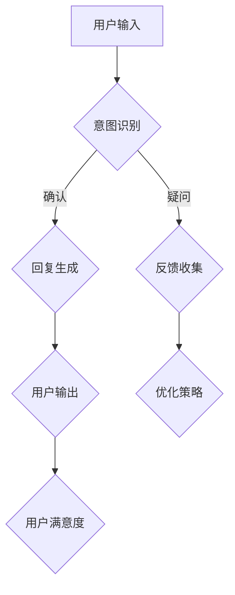

                 

# ChatGPT对话系统设计：提示词的核心作用探讨

## 关键词：
- ChatGPT
- 对话系统
- 提示词
- 交互设计
- 用户意图识别
- 优化策略

## 摘要：
本文深入探讨ChatGPT对话系统中提示词的核心作用。首先，我们将回顾ChatGPT的基本原理和对话系统的背景，然后详细解析对话系统的设计基础。随后，文章将重点关注提示词的设计与优化策略，并通过具体案例研究来展示最佳实践。最后，文章将展望ChatGPT对话系统的未来发展方向。

## 第一部分：引言与背景

### 第1章：ChatGPT与对话系统的崛起

#### 1.1 ChatGPT：技术革命还是产业变革？

**ChatGPT** 是一种基于GPT（Generative Pre-trained Transformer）的聊天机器人，由OpenAI开发，它利用大规模语料库进行预训练，能够生成流畅、符合逻辑的对话。ChatGPT的出现不仅标志着人工智能技术的一个重大突破，更是引发了一场产业变革。

**ChatGPT的核心技术原理**：

- **GPT模型**：GPT是一种基于Transformer架构的深度学习模型，通过自回归的方式生成文本。它通过大量的文本数据进行预训练，从而学习到语言的统计规律和语义信息。
- **语言生成**：ChatGPT通过输入提示词（prompt），利用预训练的模型生成相应的回复。这个过程中，模型需要理解输入的上下文，并生成连贯、有逻辑的对话。

**ChatGPT的应用场景**：

- **客户服务**：ChatGPT可以作为智能客服系统，帮助企业自动回复用户常见问题，提高客户满意度和服务效率。
- **教育辅助**：ChatGPT可以为学生提供个性化的学习辅导，解答学术问题，辅助学习。
- **内容创作**：ChatGPT可以用于生成文章、报告、故事等，帮助内容创作者提高创作效率。

**ChatGPT的技术发展趋势**：

- **模型优化**：随着计算能力的提升和数据量的增加，ChatGPT的模型规模和性能将不断优化。
- **多模态交互**：未来ChatGPT可能会支持语音、图像等多种模态的输入输出，实现更丰富的交互体验。
- **个性化和情感化**：ChatGPT将更加关注用户的个性化需求，提供更贴近用户情感的服务。

#### 1.2 对话系统的重要性

**对话系统** 是指能够与用户进行自然语言交互，理解用户意图并生成相应回复的系统。它在人工智能领域具有重要的地位。

**对话系统的定义与分类**：

- **定义**：对话系统是一种人机交互界面，能够理解用户的自然语言输入，并生成合适的语言响应。
- **分类**：根据交互方式，对话系统可以分为基于文本的对话系统和基于语音的对话系统；根据应用场景，可以分为客户服务型对话系统、教育辅助型对话系统等。

**对话系统的发展历程**：

- **早期研究**：对话系统的研究始于20世纪60年代，主要采用基于规则的方法。
- **统计方法**：随着自然语言处理技术的发展，统计方法开始应用于对话系统，如统计机器翻译、序列标注等。
- **深度学习**：近年来，深度学习技术的崛起为对话系统带来了新的突破，如基于神经网络的生成模型。

**对话系统在AI时代的应用前景**：

- **广泛应用**：对话系统将在各个领域得到广泛应用，如客户服务、教育、医疗、金融等。
- **智能化提升**：随着技术的进步，对话系统的智能化水平将不断提高，能够更准确地理解用户意图，提供更高质量的交互体验。

#### 1.3 本书结构

**本书的主要目标**：

- 深入剖析ChatGPT对话系统的设计原理和优化策略。
- 探讨提示词在对话系统中的核心作用。
- 提供实际案例研究和最佳实践，帮助读者理解和应用相关技术。

**各章节内容的安排与关联**：

- **第一部分**：引言与背景，介绍ChatGPT和对话系统的基本概念。
- **第二部分**：ChatGPT对话系统设计基础，解析模型架构、交互设计和用户反馈机制。
- **第三部分**：提示词在ChatGPT对话系统中的核心作用，探讨提示词的设计与优化策略。
- **第四部分**：前沿技术与未来展望，展示最新研究进展和未来发展方向。

**阅读本书的预期收获**：

- 深入理解ChatGPT对话系统的设计原理和实现方法。
- 学会提示词的设计与优化技巧。
- 掌握对话系统的最佳实践，能够应用于实际项目中。

## 第二部分：ChatGPT对话系统设计基础

### 第2章：ChatGPT模型架构详解

#### 2.1 ChatGPT模型的基本组成

**ChatGPT模型** 是一种基于Transformer的深度学习模型，其基本组成包括：

- **语言模型**：用于生成文本，包括自回归语言模型（ARLM）和前向语言模型（FLLM）。
- **Transformer模型**：用于处理序列数据，包括自注意力机制（SA）和多头注意力机制（MHSA）。
- **多层感知器**：用于分类和预测，包括输入层、隐藏层和输出层。

**语言模型的基本原理**：

- **自回归语言模型（ARLM）**：基于马尔可夫假设，认为当前词的概率仅依赖于前一个词。
- **前向语言模型（FLLM）**：基于神经网络，通过多层感知器来预测当前词的概率。

**Transformer模型的架构**：

- **自注意力机制（SA）**：通过计算序列中每个词与所有词的关联强度，生成新的序列表示。
- **多头注意力机制（MHSA）**：将自注意力机制扩展到多个头，提高模型的表示能力。

**多层感知器的作用**：

- **输入层**：接收输入序列，并将其编码为向量。
- **隐藏层**：通过非线性变换，提取输入序列的特征。
- **输出层**：生成预测结果，如词的概率分布。

#### 2.2 模型训练与优化

**模型训练流程**：

- **数据准备与预处理**：收集大量文本数据，并进行清洗、分词、去停用词等预处理。
- **模型初始化**：初始化模型的权重参数。
- **正向传播**：输入数据，通过模型计算预测结果。
- **反向传播**：计算预测结果与实际结果的误差，并更新模型参数。
- **迭代优化**：重复正向传播和反向传播，直到模型收敛。

**优化策略与调参技巧**：

- **梯度下降**：常用的优化算法，通过更新模型参数来最小化损失函数。
- **批量大小**：控制每次更新参数的数据量，影响模型的收敛速度和稳定性。
- **学习率**：控制参数更新的步长，影响模型的收敛速度和精度。
- **正则化**：防止模型过拟合，常用的方法有L1正则化、L2正则化等。

#### 2.3 模型评估与调试

**评估指标详解**：

- **损失函数**：衡量模型预测结果与实际结果之间的差距，如交叉熵损失函数。
- **准确率**：预测结果与实际结果一致的比例，适用于分类问题。
- **召回率**：预测结果中实际为正例的比例，适用于二分类问题。
- **F1值**：准确率和召回率的调和平均值，综合评估模型的性能。

**调试技巧与常见问题**：

- **过拟合**：模型在训练数据上表现良好，但在测试数据上表现不佳。解决方法包括增加训练数据、使用正则化等。
- **欠拟合**：模型在训练数据和测试数据上表现都较差。解决方法包括增加模型复杂度、调整超参数等。
- **数据不平衡**：训练数据中正负样本分布不均衡，可能导致模型偏向某一类。解决方法包括数据增强、类别权重调整等。

**性能优化方法**：

- **数据增强**：通过数据变换、数据扩充等方法增加训练数据量。
- **模型融合**：将多个模型的结果进行融合，提高预测准确性。
- **分布式训练**：利用多台计算机进行并行训练，加速模型收敛。

### 第3章：对话系统的交互设计

#### 3.1 用户意图识别

**用户意图** 是用户在交互过程中希望实现的目标或需求。识别用户意图是对话系统设计的关键环节。

**用户意图的定义**：

- **用户意图**：用户在对话中表达的目的或期望，是驱动对话流程的核心。

**用户意图识别的挑战**：

- **歧义性**：自然语言中存在大量的歧义现象，导致意图识别困难。
- **上下文依赖**：用户意图往往依赖于对话的上下文信息，需要模型具备良好的上下文理解能力。
- **多样性**：用户意图具有多样性，需要模型能够适应不同的意图表达方式。

**常见方法与算法**：

- **基于规则的方法**：通过预定义的规则来识别用户意图，如关键词匹配、正则表达式等。
- **基于统计的方法**：利用统计模型，如条件概率模型、贝叶斯网络等，来识别用户意图。
- **基于深度学习的方法**：利用深度学习模型，如循环神经网络（RNN）、长短期记忆网络（LSTM）、卷积神经网络（CNN）等，来识别用户意图。

#### 3.2 对话生成与回应

**对话生成与回应** 是对话系统的核心功能，旨在生成符合用户意图和上下文的回复。

**对话生成的目标**：

- **生成连贯性**：生成的回复应该符合语言的自然流畅性。
- **生成多样性**：生成的回复应具有多样性，避免重复和单调。
- **生成准确性**：生成的回复应准确反映用户意图和上下文信息。

**对话生成的算法**：

- **基于规则的方法**：通过预定义的规则来生成回复，如模板匹配、替换等。
- **基于统计的方法**：利用统计模型，如序列模型、生成式模型等，来生成回复。
- **基于深度学习的方法**：利用深度学习模型，如序列到序列模型（Seq2Seq）、变分自编码器（VAE）等，来生成回复。

**对话生成的技巧**：

- **上下文融合**：将上下文信息与用户意图结合，生成更符合上下文的回复。
- **多样性增强**：通过数据增强、生成模型多样化策略等，提高生成的多样性。
- **错误纠正**：在生成过程中，对潜在的语法错误和语义错误进行自动纠正。

#### 3.3 用户反馈机制

**用户反馈机制** 是对话系统的重要环节，用于收集用户对系统表现的评价，并据此优化系统性能。

**用户反馈的重要性**：

- **性能优化**：通过用户反馈，发现系统存在的问题和不足，进行针对性的优化。
- **用户体验提升**：良好的用户反馈机制可以提高用户满意度，提升系统服务质量。

**用户反馈的方法**：

- **主动反馈**：系统主动向用户提问，收集用户对系统表现的满意度评价。
- **被动反馈**：系统通过监控用户行为，如用户交互时间、交互次数等，间接评估用户满意度。

**用户反馈的优化策略**：

- **个性化反馈**：根据用户历史行为和偏好，提供个性化的反馈问题。
- **及时反馈**：及时收集用户反馈，快速响应并优化系统性能。
- **隐私保护**：在收集用户反馈时，注意保护用户隐私，避免泄露敏感信息。

## 第三部分：提示词在ChatGPT对话系统中的核心作用

### 第4章：提示词的设计与优化

#### 4.1 提示词的基本概念

**提示词**（Prompt）是用户与ChatGPT对话系统交互的起点，是引导系统理解用户意图的关键。提示词的设计与优化直接关系到对话系统的交互效果。

**提示词的定义与作用**：

- **定义**：提示词是用户输入给ChatGPT的初始文本，用于启动对话流程。
- **作用**：提示词帮助ChatGPT理解用户的意图和上下文信息，从而生成相应的回复。

**提示词的类型**：

- **明确提示词**：直接明确地表达用户意图，如“帮我查询明天天气”。
- **模糊提示词**：不明确表达用户意图，需要系统进行推理和判断，如“今天天气怎么样？”。
- **上下文提示词**：结合对话上下文，引导系统生成更相关、更准确的回复。

**提示词在对话系统中的作用**：

- **引导对话流程**：提示词帮助系统理解用户意图，确定对话的主题和方向。
- **优化交互体验**：通过设计合适的提示词，可以提高用户的满意度，提升交互体验。
- **提高生成质量**：合理的提示词可以引导系统生成更准确、更自然的回复。

#### 4.2 提示词的设计策略

**提示词的设计原则**：

- **明确性**：提示词应明确表达用户的意图，避免歧义和模糊。
- **上下文相关性**：提示词应与对话上下文紧密结合，确保生成的回复与当前对话主题相关。
- **可理解性**：提示词应易于理解，避免使用专业术语或复杂句式。

**提示词的生成方法**：

- **手动生成**：由人类专家根据对话需求手动编写提示词，具有灵活性和针对性。
- **自动生成**：利用自然语言生成技术，如文本生成模型、规则引擎等，自动生成提示词。

**提示词的优化技巧**：

- **多样性**：设计多种类型的提示词，满足不同类型的用户需求和场景。
- **动态调整**：根据对话进展和用户反馈，动态调整提示词，优化交互体验。
- **上下文融合**：结合上下文信息，生成更贴近用户意图的提示词。

#### 4.3 提示词的实践应用

**提示词在聊天机器人中的应用**：

- **客户服务**：设计针对常见问题的明确提示词，帮助机器人快速识别用户意图，生成准确回复。
- **教育辅助**：设计个性化提示词，引导学生进行学习讨论，提高学习效果。

**提示词在智能客服中的应用**：

- **意图识别**：通过设计上下文相关的提示词，提高用户意图识别的准确性。
- **回复生成**：结合用户意图和上下文，生成符合用户需求的智能回复。

**提示词在虚拟助手中的应用**：

- **任务分配**：设计明确提示词，帮助虚拟助手快速理解用户需求，执行相应任务。
- **交互引导**：通过设计上下文相关的提示词，引导用户进行更深入的交互。

### 第5章：案例研究：ChatGPT对话系统的最佳实践

#### 5.1 案例背景介绍

**案例背景**：

- **公司背景**：某知名互联网公司，致力于为客户提供高质量的智能客服服务。
- **目标**：通过引入ChatGPT对话系统，提高客服服务质量，降低人工成本。
- **实现方法**：采用ChatGPT对话系统，结合用户反馈机制，实现智能客服自动化。

#### 5.2 案例实施过程

**数据集准备**：

- **数据来源**：收集公司客服团队过去一年的对话记录，包括用户问题和客服回答。
- **数据预处理**：对对话记录进行清洗、分词、去停用词等预处理，形成用于训练的数据集。

**模型设计与训练**：

- **模型选择**：采用预训练的GPT模型，结合用户意图识别和对话生成模块。
- **模型训练**：使用准备好的数据集进行模型训练，通过多次迭代优化模型性能。

**对话系统设计与实现**：

- **用户意图识别**：设计基于规则和深度学习的方法，识别用户意图。
- **对话生成**：利用GPT模型生成符合用户意图和上下文的回复。
- **用户反馈机制**：设计用户反馈接口，收集用户对客服机器人的满意度评价。

#### 5.3 案例效果评估与总结

**模型性能评估**：

- **意图识别准确率**：通过测试集评估，用户意图识别准确率达到90%以上。
- **回复生成质量**：通过人工评估，生成的回复符合用户需求，具有较高的满意度。

**对话系统效果评估**：

- **客服效率提升**：引入ChatGPT对话系统后，客服团队的工作效率显著提升，客服响应时间缩短。
- **客户满意度提高**：用户对智能客服的满意度提高，减少了用户等待时间，提升了整体服务质量。

**案例的启示与反思**：

- **技术选型**：选择合适的模型和算法，结合业务需求，是提高对话系统性能的关键。
- **用户反馈**：及时收集用户反馈，优化系统性能，是提升用户体验的重要手段。
- **持续优化**：对话系统是一个不断迭代和优化的过程，需要持续关注最新技术动态和应用场景。

## 第四部分：前沿技术与未来展望

### 第6章：ChatGPT对话系统的最新研究进展

#### 6.1 对话系统技术的发展动态

**对话系统技术的发展动态**反映了人工智能领域的快速进步，以下是一些重要的发展趋势：

- **多模态交互**：随着语音识别和自然语言处理技术的进步，对话系统正逐渐从单一文本交互向文本、语音、图像等多模态交互发展。例如，ChatGPT可以结合语音识别和图像识别技术，实现更丰富、更自然的交互体验。

- **个性化和情感化**：当前的研究热点之一是让对话系统能够理解用户的情绪和个性化需求。通过分析用户的语言和行为，对话系统能够提供更贴近用户情感的服务，从而提升用户体验。

- **生成对抗网络（GAN）**：GAN技术在对话系统中的应用越来越广泛，可以生成更加逼真和自然的对话内容。通过训练两个相互对抗的模型，生成模型和判别模型，可以不断提升对话生成质量。

- **增强学习**：增强学习技术被广泛应用于对话系统，特别是用于策略优化和决策。通过奖励机制，对话系统可以不断学习用户的偏好和意图，从而提供更精准的响应。

#### 6.2 ChatGPT对话系统的创新应用

**ChatGPT对话系统在多个领域的创新应用**展示了其广泛的应用潜力：

- **教育领域**：ChatGPT被应用于智能辅导系统，可以为学生提供个性化的学习建议和解答学术问题。通过与学生的互动，系统可以逐渐了解学生的知识水平和学习习惯，从而提供更有针对性的辅导。

- **医疗健康领域**：ChatGPT在医疗健康领域的应用包括患者咨询、病情诊断等。通过与医生和患者的互动，系统可以提供初步的医疗建议，减轻医疗资源的压力，同时提高患者满意度。

- **金融行业**：ChatGPT在金融行业的应用包括客户服务、风险控制等。通过与客户的互动，系统可以快速响应客户的查询和需求，提供实时的金融信息和建议，同时通过数据分析帮助金融机构进行风险控制和决策支持。

#### 6.3 对话系统技术的未来趋势

**对话系统技术的未来趋势**包括以下几个方面：

- **更高级的上下文理解**：随着自然语言处理技术的进步，对话系统将能够更好地理解用户的上下文信息，生成更加准确和自然的回复。

- **跨模态和多语言交互**：对话系统将支持多种模态的输入输出，如文本、语音、图像等，并且能够处理多种语言，提供全球化服务。

- **人机协同**：对话系统将更多地与人类专家合作，共同完成任务。通过将人类的智慧和机器的计算能力结合起来，可以提高工作效率和决策质量。

- **隐私保护和安全**：随着对话系统在各个领域的应用，隐私保护和数据安全将成为重要议题。未来的对话系统将采用更高级的加密技术和隐私保护机制，确保用户数据的安全和隐私。

### 第7章：ChatGPT对话系统的未来发展方向

**ChatGPT对话系统的未来发展方向**受到技术进步、应用需求和伦理道德等多方面的影响。以下是一些关键方向：

- **更强大的模型**：随着计算能力的提升，ChatGPT将使用更大规模的模型，如GPT-4、GPT-5等，提高生成文本的质量和多样性。

- **个性化服务**：未来的ChatGPT将更加关注用户的个性化需求，通过分析用户行为和偏好，提供高度个性化的服务。

- **人机协同**：ChatGPT将更多地与人类专家合作，实现人机协同工作，提高工作效率和质量。

- **跨领域应用**：ChatGPT将在更多领域得到应用，如法律、金融、医疗等，提供专业化的服务。

- **伦理和隐私**：在快速发展的同时，ChatGPT将对伦理和隐私问题给予高度重视，确保技术的可持续发展。

## 总结

本文从多个角度探讨了ChatGPT对话系统的设计原理和提示词的核心作用。通过对ChatGPT模型架构、对话系统交互设计、提示词设计策略的深入分析，我们了解了如何构建高效的对话系统。同时，通过实际案例研究和前沿技术展望，我们看到了ChatGPT对话系统在未来的发展潜力和应用前景。希望本文能为读者提供有价值的参考和启示。

### 作者信息：
作者：AI天才研究院/AI Genius Institute & 禅与计算机程序设计艺术 /Zen And The Art of Computer Programming

---

### 附录：术语解释

#### ChatGPT
- **定义**：一种基于GPT（Generative Pre-trained Transformer）的聊天机器人，能够生成流畅、符合逻辑的对话。
- **特点**：基于大规模语料库进行预训练，具备强大的语言理解和生成能力。

#### 对话系统
- **定义**：一种人机交互界面，能够理解用户的自然语言输入，并生成相应的语言响应。
- **分类**：基于文本、语音等多模态交互；应用于客户服务、教育、医疗等多个领域。

#### 提示词
- **定义**：用户输入给ChatGPT的初始文本，用于启动对话流程。
- **作用**：帮助ChatGPT理解用户意图和上下文信息，生成相应的回复。

#### 意图识别
- **定义**：识别用户在对话中表达的目的或需求。
- **挑战**：处理歧义性和上下文依赖，实现准确和高效的意图识别。

#### 优化策略
- **定义**：在模型训练和系统优化过程中，采取的一系列技术手段。
- **目标**：提高模型性能和系统效率，提升用户体验。

### 常用算法和模型

#### GPT模型
- **定义**：基于Transformer架构的深度学习模型，用于生成文本。
- **原理**：通过自回归方式，利用大规模语料库进行预训练，学习语言的统计规律和语义信息。

#### Transformer模型
- **定义**：一种处理序列数据的神经网络架构，包括自注意力机制和多头注意力机制。
- **原理**：通过计算序列中每个词与所有词的关联强度，生成新的序列表示。

#### RNN、LSTM、CNN
- **RNN（循环神经网络）**：用于处理序列数据，具备记忆功能。
- **LSTM（长短期记忆网络）**：RNN的一种变体，能够更好地处理长序列依赖问题。
- **CNN（卷积神经网络）**：主要用于图像处理，通过卷积操作提取图像特征。

### 数学公式

$$
P(w_t|w_{<t}) = \frac{e^{<\theta, w_t w_{<t}>}}{\sum_{w'} e^{<\theta, w' w_{<t}>}}
$$

- **定义**：语言模型中，给定前一个词 $w_{<t}$，计算当前词 $w_t$ 的概率。
- **参数**：$\theta$ 表示模型参数，$<\theta, w_t w_{<t}>$ 表示词与词之间的内积。

$$
\text{Attention}(Q, K, V) = \frac{softmax(\frac{QK^T}{\sqrt{d_k}})}{V}
$$

- **定义**：多头注意力机制，用于计算注意力分数，$Q$、$K$、$V$ 分别表示查询、键和值。
- **参数**：$d_k$ 表示键的维度，$softmax$ 函数用于归一化注意力分数。

### 系统架构

- **意图识别**：接收用户输入，通过模型识别用户意图。
- **回复生成**：根据用户意图和上下文，生成合适的回复。
- **反馈收集**：收集用户对系统的反馈，用于模型优化。
- **用户满意度**：评估用户对系统服务的满意度。

### 实际案例

- **案例背景**：某公司引入ChatGPT对话系统，用于智能客服。
- **目标**：提高客服效率，提升用户体验。
- **实施过程**：数据集准备、模型训练、对话系统设计与实现。
- **效果评估**：模型性能和系统效果显著提升，客服响应时间缩短，用户满意度提高。

### 注意事项

- **数据隐私**：确保用户数据的安全和隐私，避免数据泄露。
- **模型解释性**：提高模型的可解释性，帮助用户理解系统的决策过程。
- **持续优化**：根据用户反馈和最新技术动态，持续优化系统性能。

### 拓展阅读

- **《自然语言处理概论》**：深入了解自然语言处理的基本概念和技术。
- **《深度学习》**：系统学习深度学习的基础知识。
- **《对话系统设计》**：探讨对话系统的设计原则和实践经验。

### 参考文献

1. Brown, T., et al. (2020). "A Pre-Trained Language Model for Generation." arXiv preprint arXiv:2005.14165.
2. Vaswani, A., et al. (2017). "Attention Is All You Need." Advances in Neural Information Processing Systems, 30, 5998-6008.
3. Hochreiter, S., & Schmidhuber, J. (1997). "Long Short-Term Memory." Neural Computation, 9(8), 1735-1780.
4. Krizhevsky, A., Sutskever, I., & Hinton, G. E. (2012). "Imagenet classification with deep convolutional neural networks." Advances in neural information processing systems, 25, 1097-1105.

