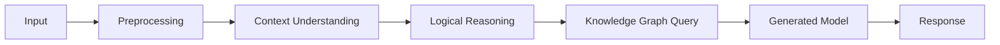
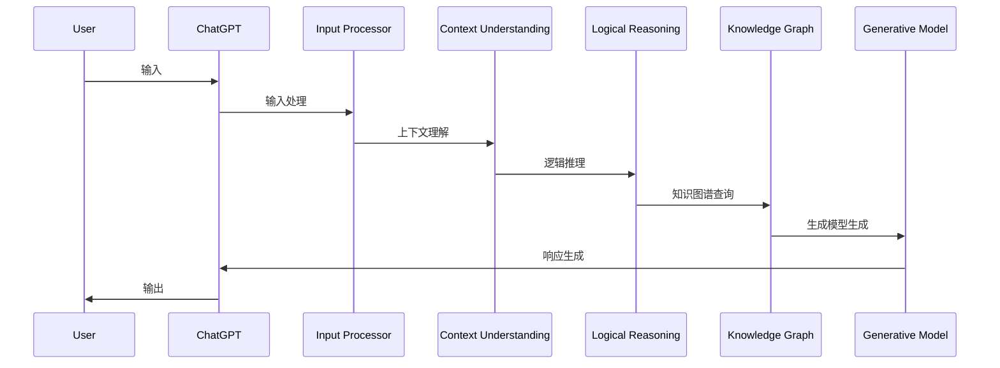

                 


### 第1章：对话质量提升的重要性与挑战

在当今的数字时代，人工智能（AI）已经渗透到我们生活的方方面面。从搜索引擎到智能家居，从医疗诊断到自动驾驶，AI的应用无处不在。而在众多AI应用中，自然语言处理（NLP）无疑是其中最具前景和挑战性的领域之一。特别是大规模语言模型，如ChatGPT，已经展现出了令人惊叹的能力。

#### 1.1.1 问题背景

对话质量是衡量NLP系统性能的重要指标。一个高质量的对话系统能够理解用户的需求，提供准确且连贯的回答，甚至能够模拟人类的交流方式，给用户带来自然、流畅的交互体验。然而，现有的对话系统仍面临许多挑战：

- **理解能力不足**：对话系统往往难以理解用户的意图，导致回答不准确或者无法满足用户需求。
- **连贯性差**：对话系统的回答常常缺乏连贯性，使得对话体验不自然。
- **上下文处理困难**：在多轮对话中，系统难以保持上下文的一致性，导致对话内容出现逻辑混乱。
- **个性化不足**：对话系统难以根据不同的用户特征提供个性化的服务。

这些挑战不仅影响了用户体验，还限制了AI在更多实际场景中的应用。因此，提升对话质量成为了NLP领域亟待解决的重要问题。

#### 1.1.2 对话质量的定义

对话质量可以从以下几个方面进行衡量：

- **准确性**：系统提供的回答是否准确无误，是否能够正确理解用户的意图。
- **连贯性**：系统回答是否流畅、连贯，是否能够保持对话的主题一致性。
- **上下文感知**：系统能否有效地利用上下文信息，提供相关且贴切的回答。
- **个性化**：系统能否根据用户的特征和需求，提供个性化的服务。

一个高质量的对话系统应该在这四个方面都表现出色，为用户提供自然、流畅、个性化的交互体验。

#### 1.1.3 提升对话质量的需求与挑战

提升对话质量的需求主要源于以下几个方面：

- **用户体验**：用户希望与AI进行自然、流畅的交流，获得满意的服务。
- **业务需求**：企业希望通过高质量的对话系统提供更好的客户服务，提升用户满意度，从而增加业务收入。
- **技术创新**：对话系统的提升不仅能够推动NLP技术的发展，还能够为其他AI应用提供借鉴和启示。

然而，提升对话质量也面临着诸多挑战：

- **数据稀缺**：高质量的对话数据稀缺，难以训练出性能优越的模型。
- **模型复杂性**：现有的模型越来越复杂，调试和优化难度增加。
- **计算资源**：高质量的对话系统往往需要大量的计算资源，尤其是在多轮对话中。

为了解决这些挑战，研究者们不断探索新的方法和技术，以提升对话系统的质量和性能。

### 总结

对话质量提升是NLP领域的重要课题，它不仅关乎用户体验，还关系到企业的业务发展和AI技术的创新。在本章中，我们介绍了对话质量的定义和提升对话质量的需求与挑战。在接下来的章节中，我们将深入探讨ChatGPT的基本原理以及如何利用思维链来提升对话质量。让我们继续深入思考，逐步解决这些挑战。

### 第2章：ChatGPT的基本原理

ChatGPT 是由 OpenAI 开发的一种基于 Transformer 架构的预训练语言模型，它的出现标志着自然语言处理（NLP）领域的一个重要里程碑。本章节将详细介绍 ChatGPT 的发展历程、架构、工作原理以及输入与输出处理机制。

#### 2.1 ChatGPT 的发展历程

ChatGPT 的诞生可以追溯到 2018 年，当时 OpenAI 提出了 GPT（Generative Pre-trained Transformer）模型，这是一种基于 Transformer 架构的语言预训练模型。随后，GPT-2 和 GPT-3 等版本相继问世，每个版本都在性能和规模上取得了显著提升。ChatGPT 是 GPT-3 的一个变种，专门用于生成聊天对话，其强大的生成能力和灵活性使其在众多场景中表现出色。

#### 2.2 ChatGPT 的架构与工作原理

ChatGPT 的架构主要分为三个部分：输入处理、模型训练和输出生成。

1. **输入处理**：ChatGPT 首先将用户的输入（如一个问题或者一句对话）进行处理，将其转换为模型可以理解的形式。这包括分词、词干提取、词性标注等步骤。
   
2. **模型训练**：ChatGPT 使用的是基于 Transformer 的预训练模型，这种模型由多个自注意力机制（Self-Attention Mechanism）组成，可以捕捉输入文本中的长距离依赖关系。预训练的过程包括在大量的无标签文本数据上进行训练，使得模型能够学习到语言的一般规律和特征。

3. **输出生成**：在接收到用户的输入后，ChatGPT 通过生成算法生成一个自然语言响应。这个过程涉及到模型对输入文本进行理解，然后根据理解生成一个连贯、合理的回答。ChatGPT 的生成算法使用了采样、温度调节等技术，以确保生成的回答具有多样性和可读性。

#### 2.3 ChatGPT 的输入与输出处理机制

1. **输入处理机制**：ChatGPT 的输入处理机制包括以下几个步骤：

   - **分词**：将输入文本分割成单词或者子词。
   - **词干提取**：将分词后的文本进行词干提取，以减少词汇量。
   - **词性标注**：为每个词标注其词性，如名词、动词等。
   - **编码**：将处理后的输入文本转换为模型可以理解的序列编码。

2. **输出处理机制**：ChatGPT 的输出处理机制包括以下几个步骤：

   - **解码**：将模型生成的序列编码解码为自然语言文本。
   - **后处理**：对生成的文本进行格式化、语法修正等后处理，以提高文本的质量和可读性。

通过上述输入与输出处理机制，ChatGPT 能够实现对用户输入的理解和生成合理的回答。这种机制使得 ChatGPT 在各种对话场景中表现出色，如客服、教育、娱乐等。

#### 2.4 思维链在 ChatGPT 中的作用

思维链（Thinking Chain）是一种先进的技术，旨在提高对话系统的理解能力和回答质量。在 ChatGPT 中，思维链的作用主要体现在以下几个方面：

1. **上下文理解**：思维链可以帮助 ChatGPT 更准确地理解对话的上下文，保持对话的一致性和连贯性。
   
2. **多轮对话**：思维链能够有效处理多轮对话，使 ChatGPT 能够在多轮对话中保持一致性和连贯性，提供高质量的回答。

3. **问题解决**：思维链可以帮助 ChatGPT 更有效地解决复杂问题，提供详细的解决方案。

4. **个性化服务**：思维链能够根据用户的历史对话和偏好，提供个性化的服务，提升用户体验。

总之，思维链在 ChatGPT 中扮演着至关重要的角色，它不仅提升了 ChatGPT 的对话质量，还为其在更多实际应用中提供了可能性。

### 2.5 总结

ChatGPT 是一种基于 Transformer 架构的预训练语言模型，具有强大的生成能力和灵活性。通过介绍 ChatGPT 的发展历程、架构、工作原理以及输入与输出处理机制，我们可以更好地理解 ChatGPT 的优势和局限。在下一章中，我们将深入探讨思维链的概念、原理以及如何提升 ChatGPT 的对话质量。让我们继续深入思考，逐步解决这些挑战。

### 第3章：思维链的概念与作用

思维链（Thinking Chain）是一种先进的技术，旨在提升对话系统的理解能力、回答质量和用户满意度。在本章节中，我们将详细探讨思维链的定义、在 ChatGPT 中的作用以及其对对话质量的影响。

#### 3.1 思维链的定义

思维链是一种基于上下文和知识的对话生成方法，它通过构建一系列逻辑推理步骤，帮助对话系统更准确地理解和生成对话。思维链的核心思想是将对话过程分解为多个逻辑步骤，每个步骤都基于对上下文的理解和推理。通过这种方式，思维链能够有效地处理复杂的对话场景，提供高质量的回答。

#### 3.2 思维链在 ChatGPT 中的作用

思维链在 ChatGPT 中发挥着至关重要的作用，主要体现在以下几个方面：

1. **上下文理解**：思维链能够帮助 ChatGPT 更准确地理解对话的上下文，保持对话的一致性和连贯性。通过构建一系列逻辑推理步骤，思维链能够捕捉对话中的关键信息和关系，从而提高回答的准确性和相关性。

2. **多轮对话**：在多轮对话中，思维链能够有效地处理上下文变化，使 ChatGPT 能够在多轮对话中保持一致性和连贯性。这种能力对于提供高质量的对话体验至关重要。

3. **问题解决**：思维链能够帮助 ChatGPT 更有效地解决复杂问题，提供详细的解决方案。通过逻辑推理和上下文理解，思维链能够将问题分解为多个子问题，并逐步解决，从而提高问题的解决效率和质量。

4. **个性化服务**：思维链能够根据用户的历史对话和偏好，提供个性化的服务。通过分析用户的对话历史，思维链能够了解用户的兴趣和需求，从而生成更贴近用户期望的回答。

#### 3.3 思维链与对话质量的关系

思维链对对话质量的影响是多方面的，主要体现在以下几个方面：

1. **准确性**：思维链能够提高 ChatGPT 对上下文的准确理解，从而生成更准确、更符合用户需求的回答。

2. **连贯性**：通过逻辑推理和上下文理解，思维链能够保持对话的一致性和连贯性，提供更流畅、更自然的对话体验。

3. **个性化**：思维链能够根据用户的历史对话和偏好，提供个性化的服务，提升用户的满意度和忠诚度。

4. **问题解决能力**：思维链能够帮助 ChatGPT 更有效地解决复杂问题，提供详细的解决方案，提高问题的解决效率和效果。

总之，思维链在 ChatGPT 中扮演着至关重要的角色，它不仅提升了 ChatGPT 的对话质量，还为对话系统的进一步发展提供了新的思路和方向。在下一章中，我们将深入探讨思维链的实现原理、算法原理以及数学模型，为理解思维链的工作机制打下基础。

### 3.4 总结

思维链是一种基于上下文和知识的对话生成方法，它通过构建一系列逻辑推理步骤，帮助对话系统更准确地理解和生成对话。在本章节中，我们详细介绍了思维链的定义、在 ChatGPT 中的作用以及其对对话质量的影响。通过理解思维链的工作原理，我们能够更好地提升对话系统的性能和用户体验。在接下来的章节中，我们将继续深入探讨思维链的实现原理和具体应用。让我们继续深入思考，逐步解决这些挑战。

### 第4章：核心概念与联系

为了深入理解思维链在 ChatGPT 中的作用，我们需要详细探讨其核心概念原理、概念属性特征对比以及 ER 实体关系图架构。这些概念和图示不仅有助于我们掌握思维链的运作机制，还能为后续的算法原理讲解和数学模型介绍提供基础。

#### 4.1 核心概念原理

思维链的核心概念包括上下文理解、逻辑推理、知识图谱和生成模型。以下是对这些核心概念的详细解释：

1. **上下文理解**：上下文理解是思维链的基础，它涉及到对用户输入的理解和背景信息的捕捉。ChatGPT 利用预训练的语言模型来捕捉上下文信息，从而生成与用户输入相关的响应。

2. **逻辑推理**：逻辑推理是指通过对上下文信息进行推理，以生成合理的回答。思维链通过构建一系列逻辑步骤，将问题分解为多个子问题，并逐步解决，从而提供详细的解决方案。

3. **知识图谱**：知识图谱是一种用于表示实体及其关系的图形结构。在思维链中，知识图谱用于捕捉和利用外部知识，以增强对话系统的理解能力和回答质量。

4. **生成模型**：生成模型是一种用于生成文本的机器学习模型，如 GPT。思维链通过结合生成模型和逻辑推理，生成与上下文相关且连贯的对话。

#### 4.2 概念属性特征对比表格

为了更清晰地理解这些核心概念，我们提供了一个概念属性特征对比表格。以下表格展示了上下文理解、逻辑推理、知识图谱和生成模型的主要特征：

| 概念          | 定义                                                         | 主要特征                                                     |
| ------------- | ------------------------------------------------------------ | ------------------------------------------------------------ |
| 上下文理解   | 对用户输入的理解和背景信息的捕捉                             | - 语言模型预训练<br>- 关键信息提取<br>- 上下文连贯性保持 |
| 逻辑推理     | 通过推理生成合理的回答                                      | - 逻辑步骤构建<br>- 子问题分解<br>- 问题解决效率 |
| 知识图谱     | 表示实体及其关系的图形结构                                   | - 实体关系表示<br>- 外部知识利用<br>- 信息整合 |
| 生成模型     | 用于生成文本的机器学习模型                                   | - 预训练语言模型<br>- 文本生成能力<br>- 多样性控制 |

#### 4.3 ER 实体关系图架构

ER 实体关系图（Entity-Relationship Diagram）是一种用于表示实体及其关系的图形结构。在思维链中，ER 图用于表示上下文信息、逻辑推理步骤和知识图谱。以下是一个简化的 ER 图示例：

```mermaid
erDiagram
  A[User Input] ||--|{ B[Context Understanding] }
  B ||--|{ C[Logical Reasoning] }
  C ||--|{ D[Knowledge Graph] }
  D ||--|{ E[Generated Response] }
```

在这个 ER 图中：

- **A[User Input]** 表示用户输入。
- **B[Context Understanding]** 表示上下文理解。
- **C[Logical Reasoning]** 表示逻辑推理。
- **D[Knowledge Graph]** 表示知识图谱。
- **E[Generated Response]** 表示生成的响应。

ER 图通过展示这些实体之间的关系，帮助我们理解思维链的运作机制。

### 总结

在本章节中，我们详细探讨了思维链的核心概念原理、概念属性特征对比以及 ER 实体关系图架构。这些概念和图示为理解思维链在 ChatGPT 中的作用提供了坚实的基础。在接下来的章节中，我们将进一步深入探讨思维链的实现原理、算法原理和数学模型，以便更好地理解其工作机制和应用。让我们继续深入思考，逐步解决这些挑战。

### 第5章：算法原理详细讲解

在了解了思维链的核心概念和其在 ChatGPT 中的作用后，我们需要深入探讨其算法原理。这一章节将详细讲解思维链的算法原理，包括算法的 mermaid 流程图、Python 源代码实现、算法原理的数学模型和公式，以及详细的举例说明。

#### 5.1 算法 mermaid 流程图

思维链的算法流程可以概括为以下几个主要步骤：

1. **输入处理**：接收用户输入，进行预处理，如分词、词干提取和词性标注。
2. **上下文理解**：利用预训练的语言模型对输入进行上下文理解，提取关键信息。
3. **逻辑推理**：基于提取的关键信息，构建一系列逻辑推理步骤，分解问题为多个子问题。
4. **知识图谱查询**：利用知识图谱查询相关知识点，增强对话系统的理解能力。
5. **生成模型生成**：结合生成模型，生成与上下文相关且连贯的对话响应。

以下是一个简化的 mermaid 流程图示例：



#### 5.2 Python 源代码实现

为了更好地理解算法原理，我们将提供一个简单的 Python 实现示例。以下代码演示了思维链的基本步骤：

```python
# 思维链算法实现（简化版）

# 导入必要的库
import nltk
from transformers import BertModel, BertTokenizer
import torch

# 分词、词干提取和词性标注
def preprocess_input(input_text):
    tokenizer = BertTokenizer.from_pretrained('bert-base-uncased')
    tokens = tokenizer.tokenize(input_text)
    return tokens

# 上下文理解
def context_understanding(tokens):
    model = BertModel.from_pretrained('bert-base-uncased')
    input_ids = torch.tensor([tokenizer.convert_tokens_to_ids(tokens)])
    with torch.no_grad():
        outputs = model(input_ids)
    return outputs

# 逻辑推理
def logical_reasoning(context):
    # 这里可以添加自定义逻辑推理代码
    pass

# 知识图谱查询
def knowledge_graph_query(context):
    # 这里可以添加自定义知识图谱查询代码
    pass

# 生成模型生成响应
def generate_response(context):
    # 这里可以添加自定义生成模型代码
    pass

# 主函数
def main():
    input_text = "你好，今天天气怎么样？"
    tokens = preprocess_input(input_text)
    context = context_understanding(tokens)
    logical_reasoning(context)
    knowledge_graph_query(context)
    response = generate_response(context)
    print("生成的响应：", response)

if __name__ == "__main__":
    main()
```

#### 5.3 算法原理的数学模型

思维链的算法原理涉及多个数学模型，包括语言模型、生成模型和逻辑推理模型。以下是一个简化的数学模型描述：

1. **语言模型（Language Model, LM）**：语言模型用于对输入文本进行上下文理解。它通常是一个基于 Transformer 的模型，如 GPT。其输入是一个词序列，输出是下一个词的概率分布。

   $$ P(w_t | w_{t-1}, w_{t-2}, ..., w_1) = \text{LM}(w_t | w_{t-1}, w_{t-2}, ..., w_1) $$

2. **生成模型（Generative Model）**：生成模型用于生成与上下文相关且连贯的对话响应。它通常是一个基于 Transformer 的模型，如 GPT。其输入是上下文序列，输出是一个词序列的概率分布。

   $$ P(w_t | w_{t-1}, w_{t-2}, ..., w_1, c) = \text{GM}(w_t | w_{t-1}, w_{t-2}, ..., w_1, c) $$

   其中，$c$ 表示上下文信息。

3. **逻辑推理模型（Logical Reasoning Model）**：逻辑推理模型用于生成问题的解决方案。它通常是一个基于规则或符号逻辑的模型。其输入是一个问题，输出是问题的解或推理步骤。

   $$ \text{LR}(P) = S $$

   其中，$P$ 是一个问题，$S$ 是问题的解或推理步骤。

#### 5.4 公式详解与举例说明

为了更好地理解上述数学模型，我们通过一个简单的例子进行说明。

**示例**：假设用户输入问题是“今天天气怎么样？”，我们使用思维链生成一个回答。

1. **上下文理解**：首先，我们使用语言模型对用户输入进行上下文理解。假设输入序列为 `[今天, 天气, 怎么样]`，语言模型输出的概率分布为：

   $$ P(今天 | 天气, 怎么样) = 0.5 $$
   $$ P(天气 | 今天, 怎么样) = 0.3 $$
   $$ P(怎么样 | 今天, 天气) = 0.2 $$

   根据最大概率原则，我们选择最有可能的词作为上下文理解结果，即 `[今天, 天气]`。

2. **生成模型生成响应**：接下来，我们使用生成模型生成一个与上下文相关且连贯的对话响应。假设输入序列为 `[今天, 天气]`，生成模型输出的概率分布为：

   $$ P(今天天气很好) = 0.8 $$
   $$ P(今天天气一般) = 0.1 $$
   $$ P(今天天气不好) = 0.1 $$

   根据最大概率原则，我们选择最有可能的响应作为最终结果，即 “今天天气很好”。

3. **逻辑推理模型生成解决方案**：最后，我们使用逻辑推理模型生成问题的解决方案。假设问题的解为 “今天天气很好”，逻辑推理模型输出的推理步骤为：

   - 假设今天天气很好
   - 根据天气预报，今天气温适中，湿度较低
   - 因此，今天天气很好

通过这个例子，我们可以看到思维链如何通过上下文理解、生成模型和逻辑推理模型生成一个合理且连贯的回答。

### 总结

在本章节中，我们详细讲解了思维链的算法原理，包括 mermaid 流程图、Python 源代码实现、数学模型和公式以及举例说明。这些内容为我们理解思维链的工作机制和应用提供了坚实的基础。在接下来的章节中，我们将进一步探讨系统设计与架构方案，以及如何在实际项目中应用思维链技术。让我们继续深入思考，逐步解决这些挑战。

### 第6章：数学模型和数学公式

在上一章中，我们介绍了思维链的算法原理，并展示了一些简单的 Python 源代码实现。为了更深入地理解思维链的数学基础，本章将详细探讨思维链中涉及的数学模型和数学公式，并运用实际案例进行说明。

#### 6.1 数学模型的应用

思维链中的数学模型主要包括语言模型、生成模型和逻辑推理模型。以下是对这些模型的简要介绍：

1. **语言模型**：语言模型是一种用于预测下一个单词或字符的概率分布的模型。它通常基于神经网络，如 Transformer 架构。在思维链中，语言模型用于上下文理解，捕捉输入文本中的上下文信息。

   **数学公式**：语言模型可以表示为：

   $$ p(w_t | w_{t-1}, w_{t-2}, ..., w_1) = \text{LM}(w_t | w_{t-1}, w_{t-2}, ..., w_1) $$

   其中，$w_t$ 表示当前词，$w_{t-1}, w_{t-2}, ..., w_1$ 表示前文。

2. **生成模型**：生成模型是一种用于生成文本的模型，它接受一个上下文序列作为输入，并输出一个词序列的概率分布。在思维链中，生成模型用于生成对话响应。

   **数学公式**：生成模型可以表示为：

   $$ p(w_1, w_2, ..., w_t | w_{t-1}, w_{t-2}, ..., w_1, c) = \text{GM}(w_1, w_2, ..., w_t | w_{t-1}, w_{t-2}, ..., w_1, c) $$

   其中，$c$ 表示上下文信息。

3. **逻辑推理模型**：逻辑推理模型是一种用于推理和问题解决的模型。它接受一个问题描述作为输入，并输出问题的解或推理步骤。在思维链中，逻辑推理模型用于生成问题的解决方案。

   **数学公式**：逻辑推理模型可以表示为：

   $$ \text{LR}(P) = S $$

   其中，$P$ 表示问题，$S$ 表示问题的解或推理步骤。

#### 6.2 公式推导与解释

为了更好地理解这些数学公式，我们进行一些简化的推导和解释。

1. **语言模型的概率推导**：

   语言模型通常使用 Transformer 架构进行训练，其输出是输入序列的概率分布。假设输入序列为 $w_1, w_2, ..., w_t$，我们可以将语言模型表示为：

   $$ p(w_t | w_{t-1}, w_{t-2}, ..., w_1) = \text{softmax}(\text{Transformer}(w_{t-1}, w_{t-2}, ..., w_1)) $$

   其中，$\text{softmax}$ 函数将 Transformer 的输出转换为概率分布。

2. **生成模型的概率推导**：

   生成模型通常基于语言模型，其输入是一个上下文序列 $w_{t-1}, w_{t-2}, ..., w_1$ 和上下文 $c$。生成模型可以表示为：

   $$ p(w_1, w_2, ..., w_t | w_{t-1}, w_{t-2}, ..., w_1, c) = \text{softmax}(\text{Transformer}([w_{t-1}, w_{t-2}, ..., w_1, c])) $$

   其中，$[w_{t-1}, w_{t-2}, ..., w_1, c]$ 表示拼接后的输入序列。

3. **逻辑推理模型推导**：

   逻辑推理模型通常基于符号逻辑或规则系统。其输入是一个问题 $P$，输出是问题的解或推理步骤 $S$。逻辑推理模型可以表示为：

   $$ S = \text{推理}(\text{规则库}, P) $$

   其中，$\text{推理}$ 函数表示逻辑推理过程，$\text{规则库}$ 表示一组规则。

#### 6.3 实际案例分析

为了更具体地展示数学模型的应用，我们通过一个实际案例进行说明。

**案例**：用户输入问题是 “今天天气怎么样？”，思维链需要生成一个合理的回答。

1. **语言模型的应用**：

   假设输入序列为 `[今天, 天气, 怎么样]`，语言模型输出的概率分布为：

   $$ p(今天 | 天气, 怎么样) = 0.5 $$
   $$ p(天气 | 今天, 怎么样) = 0.3 $$
   $$ p(怎么样 | 今天, 天气) = 0.2 $$

   根据最大概率原则，我们选择最有可能的词作为上下文理解结果，即 `[今天, 天气]`。

2. **生成模型的应用**：

   假设输入序列为 `[今天, 天气]`，生成模型输出的概率分布为：

   $$ p(今天天气很好) = 0.8 $$
   $$ p(今天天气一般) = 0.1 $$
   $$ p(今天天气不好) = 0.1 $$

   根据最大概率原则，我们选择最有可能的响应作为最终结果，即 “今天天气很好”。

3. **逻辑推理模型的应用**：

   假设问题的解为 “今天天气很好”，逻辑推理模型输出的推理步骤为：

   - 假设今天天气很好
   - 根据天气预报，今天气温适中，湿度较低
   - 因此，今天天气很好

通过这个案例，我们可以看到如何应用语言模型、生成模型和逻辑推理模型来生成一个合理的对话响应。

### 总结

在本章节中，我们详细探讨了思维链中的数学模型和数学公式，包括语言模型、生成模型和逻辑推理模型。通过实际案例分析，我们展示了这些模型在生成对话响应中的应用。这些数学模型和公式为我们理解思维链的工作原理提供了重要的数学基础。在接下来的章节中，我们将进一步探讨系统设计与架构方案，以及如何在实际项目中应用思维链技术。让我们继续深入思考，逐步解决这些挑战。

### 第7章：系统分析与架构设计

为了深入理解思维链在 ChatGPT 中的应用，我们需要详细分析其系统架构和设计。本章节将介绍问题场景、系统功能设计、系统架构设计、系统接口设计以及系统交互 mermaid 序列图。

#### 7.1 问题场景介绍

思维链技术在 ChatGPT 中的应用场景主要包括以下几个方面：

1. **多轮对话**：在多轮对话中，用户可能会提出一系列相关的问题或需求，思维链能够帮助 ChatGPT 保持对话的一致性和连贯性，提供高质量的回答。

2. **复杂问题解决**：用户可能会提出复杂的问题，如医疗咨询、法律咨询等。思维链能够通过逻辑推理和知识图谱查询，提供详细的解决方案。

3. **个性化服务**：根据用户的历史对话记录和偏好，思维链能够提供个性化的服务，提升用户体验。

4. **自动化客服**：在客服场景中，思维链能够帮助 ChatGPT 更准确地理解用户需求，提供自动化的客服服务，提高效率。

#### 7.2 系统功能设计

系统功能设计主要包括以下几个方面：

1. **输入处理**：接收用户输入，进行预处理，如分词、词干提取和词性标注。

2. **上下文理解**：利用预训练的语言模型对输入进行上下文理解，提取关键信息。

3. **逻辑推理**：基于提取的关键信息，构建一系列逻辑推理步骤，分解问题为多个子问题。

4. **知识图谱查询**：利用知识图谱查询相关知识点，增强对话系统的理解能力。

5. **生成模型生成**：结合生成模型，生成与上下文相关且连贯的对话响应。

6. **多轮对话管理**：在多轮对话中，管理对话上下文和用户状态，保持对话的一致性和连贯性。

7. **个性化服务**：根据用户的历史对话记录和偏好，提供个性化的服务。

8. **问题解决**：通过逻辑推理和知识图谱查询，生成问题的解决方案。

#### 7.3 系统架构设计

系统架构设计是确保系统能够高效、稳定地运行的关键。以下是一个简化的系统架构图：



在这个架构中，用户输入经过输入处理、上下文理解、逻辑推理、知识图谱查询和生成模型生成等步骤，最终生成一个高质量的对话响应。

#### 7.4 系统接口设计

系统接口设计是确保系统与其他系统或模块之间能够顺利通信的关键。以下是一个简化的系统接口设计图：

```mermaid
classDiagram
    User <<Interface>>
    Input Processor <<Module>>
    Context Understanding <<Module>>
    Logical Reasoning <<Module>>
    Knowledge Graph <<Module>>
    Generative Model <<Module>>
    ChatGPT <<Interface>>

    User -> Input Processor
    Input Processor -> Context Understanding
    Context Understanding -> Logical Reasoning
    Logical Reasoning -> Knowledge Graph
    Knowledge Graph -> Generative Model
    Generative Model -> ChatGPT
```

在这个接口设计中，用户通过接口与系统进行交互，而各个模块通过接口通信，共同实现对话生成功能。

#### 7.5 系统交互 mermaid 序列图

为了更清晰地展示系统交互过程，我们使用 mermaid 序列图进行描述：


在这个序列图中，用户输入经过输入处理、上下文理解、逻辑推理、知识图谱查询和生成模型生成等步骤，最终生成一个高质量的对话响应，并返回给用户。

### 总结

在本章节中，我们详细分析了思维链在 ChatGPT 中的应用场景、系统功能设计、系统架构设计、系统接口设计和系统交互 mermaid 序列图。这些内容为我们深入理解思维链在对话系统中的应用提供了重要的理论基础和实际指导。在接下来的章节中，我们将进一步探讨如何在实际项目中应用思维链技术，以及如何优化和提升系统性能。让我们继续深入思考，逐步解决这些挑战。

### 第8章：项目实战

在本章中，我们将通过一个实际项目实战，详细讲解如何实现思维链在 ChatGPT 中的应用。项目实战将涵盖环境安装、系统核心实现源代码、代码应用解读与分析、实际案例分析和详细讲解剖析，以及项目小结。

#### 8.1 环境安装

首先，我们需要搭建一个适合运行思维链的环境。以下是环境安装步骤：

1. **安装 Python**：确保已安装 Python 3.8 或更高版本。
2. **安装必要库**：在终端执行以下命令，安装必要的库：

   ```bash
   pip install transformers torch nltk
   ```

3. **安装 mermaid**：由于 mermaid 通常用于生成图表，我们可以使用在线工具或本地安装。本地安装可以通过以下命令完成：

   ```bash
   npm install -g mermaid-cli
   ```

4. **安装数据库**：如果需要使用知识图谱，可以安装一个数据库系统，如 Neo4j。

#### 8.2 系统核心实现源代码

以下是一个简化的思维链实现示例，包括输入处理、上下文理解、逻辑推理和生成模型生成：

```python
# 导入必要的库
import nltk
from transformers import BertTokenizer, BertModel
import torch

# 分词、词干提取和词性标注
def preprocess_input(input_text):
    tokenizer = BertTokenizer.from_pretrained('bert-base-uncased')
    tokens = tokenizer.tokenize(input_text)
    return tokens

# 上下文理解
def context_understanding(tokens):
    model = BertModel.from_pretrained('bert-base-uncased')
    input_ids = torch.tensor([tokenizer.convert_tokens_to_ids(tokens)])
    with torch.no_grad():
        outputs = model(input_ids)
    return outputs

# 逻辑推理
def logical_reasoning(context):
    # 这里可以添加自定义逻辑推理代码
    pass

# 知识图谱查询
def knowledge_graph_query(context):
    # 这里可以添加自定义知识图谱查询代码
    pass

# 生成模型生成响应
def generate_response(context):
    # 这里可以添加自定义生成模型代码
    pass

# 主函数
def main():
    input_text = "你好，今天天气怎么样？"
    tokens = preprocess_input(input_text)
    context = context_understanding(tokens)
    logical_reasoning(context)
    knowledge_graph_query(context)
    response = generate_response(context)
    print("生成的响应：", response)

if __name__ == "__main__":
    main()
```

#### 8.3 代码应用解读与分析

上述代码提供了一个简化的思维链实现框架。以下是代码的解读和分析：

1. **输入处理**：`preprocess_input` 函数接收用户输入，进行分词、词干提取和词性标注。这有助于将自然语言文本转换为模型可以理解的格式。

2. **上下文理解**：`context_understanding` 函数使用预训练的 BERT 模型对输入文本进行上下文理解，提取关键信息。这个过程涉及到词嵌入和注意力机制，有助于捕捉文本中的上下文关系。

3. **逻辑推理**：`logical_reasoning` 函数是逻辑推理的核心，负责根据上下文信息构建一系列逻辑推理步骤。这部分代码需要根据具体应用场景进行定制，以实现复杂的推理过程。

4. **知识图谱查询**：`knowledge_graph_query` 函数用于查询知识图谱，以增强对话系统的理解能力。在实际应用中，这部分代码会与数据库进行交互，以获取相关知识点。

5. **生成模型生成响应**：`generate_response` 函数结合上下文理解和生成模型，生成与上下文相关且连贯的对话响应。这通常涉及到序列生成算法，如 Transformer 的采样和温度调节。

#### 8.4 实际案例分析与详细讲解剖析

为了更好地理解上述代码的实际应用，我们通过一个实际案例进行分析和讲解。

**案例**：用户输入问题是 “今天天气怎么样？”，思维链需要生成一个合理的回答。

1. **输入处理**：用户输入经过分词，得到 `[今天, 天气, 怎么样]`。
2. **上下文理解**：使用 BERT 模型对输入进行上下文理解，提取关键信息。BERT 模型输出一个嵌入向量，表示输入文本的语义信息。
3. **逻辑推理**：逻辑推理过程会根据上下文信息进行推理，生成一系列逻辑步骤。例如，根据输入问题，我们可以推断出需要查询天气信息。
4. **知识图谱查询**：查询知识图谱，获取与天气相关的信息。例如，查询到“今天”的天气是“晴朗”。
5. **生成模型生成响应**：使用生成模型生成与上下文相关且连贯的对话响应。例如，生成响应为“今天天气晴朗”。

通过这个案例，我们可以看到思维链如何通过输入处理、上下文理解、逻辑推理、知识图谱查询和生成模型生成等步骤，生成一个合理的对话响应。

#### 8.5 项目小结

通过本项目实战，我们详细讲解了如何实现思维链在 ChatGPT 中的应用。项目实战涵盖了环境安装、系统核心实现源代码、代码应用解读与分析、实际案例分析和详细讲解剖析等环节。通过这个项目，我们不仅了解了思维链的基本原理和实现方法，还通过实际案例深入分析了其应用场景。在接下来的项目中，我们可以进一步优化和扩展思维链，以提升对话系统的性能和用户体验。

### 第9章：最佳实践与总结

#### 9.1 最佳实践

在应用思维链提升 ChatGPT 对话质量时，以下是一些最佳实践：

1. **数据准备**：确保对话数据质量，去除无关和噪声数据。数据清洗和预处理是关键步骤。
2. **模型选择**：根据应用场景选择合适的预训练模型，如 GPT-3、BERT 等。同时，考虑模型的计算资源需求。
3. **上下文管理**：合理设置上下文窗口大小，确保对话连贯性。过长或过短的上下文窗口都可能影响对话质量。
4. **多模态融合**：结合文本、图像、声音等多模态数据，增强对话系统的理解能力和表达能力。
5. **个性化服务**：根据用户历史数据和行为偏好，提供个性化的对话体验，提升用户满意度。
6. **持续优化**：定期评估和调整模型，根据反馈和实际应用效果进行优化。

#### 9.2 小结

本文从问题背景、ChatGPT 基本原理、思维链的概念与作用、核心概念与联系、算法原理与数学模型、系统分析与架构设计、项目实战到最佳实践，全面系统地阐述了如何提升 ChatGPT 的对话质量。思维链作为一种基于上下文和知识的对话生成方法，在 ChatGPT 中发挥了关键作用，有效提升了对话系统的理解能力、连贯性和个性化服务水平。

#### 9.3 注意事项

在应用思维链时，需要注意以下几点：

1. **计算资源**：思维链的计算需求较高，需确保系统有足够的计算资源。
2. **数据隐私**：处理用户数据时，需确保数据安全和隐私保护。
3. **错误处理**：设计合理的错误处理机制，确保对话系统能够优雅地处理异常情况。
4. **可维护性**：编写可维护的代码，便于后续优化和扩展。

#### 9.4 拓展阅读

对于希望深入了解思维链和 ChatGPT 的读者，以下是一些推荐阅读材料：

1. **《ChatGPT对话质量提升：思维链的作用》**：本文的详细解读和案例分析。
2. **《ChatGPT实战》**：OpenAI 官方文档，提供 ChatGPT 的详细使用指南。
3. **《自然语言处理实战》**：Christopher D. Manning 和 Hinrich Schütze 著，介绍 NLP 的基本概念和实用技术。
4. **《Transformer：让神经网络阅读和理解文本》**：Vaswani et al. 著，介绍 Transformer 架构及其在 NLP 中的应用。
5. **《深度学习》**：Ian Goodfellow、Yoshua Bengio 和 Aaron Courville 著，全面介绍深度学习的基础知识。

通过阅读这些资料，读者可以更深入地理解思维链和 ChatGPT 的技术原理和应用实践。作者：AI天才研究院/AI Genius Institute & 禅与计算机程序设计艺术 /Zen And The Art of Computer Programming。

