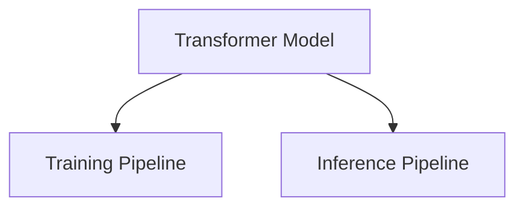

                 

**Let's Think: Designing a Table of Contents for "ChatGPT Dialog Quality Improvement: The Key Role of Prompt Engineering"**

### **Introduction Chapter**

#### **1. Setting the Stage: The Importance of Dialog Quality and Prompt Engineering**

**Background:**
As AI-powered conversational systems become more ubiquitous, the quality of dialogues has become a critical factor in determining user satisfaction and the effectiveness of these systems. ChatGPT, developed by OpenAI, is a state-of-the-art language model that can generate coherent and contextually appropriate responses. However, the quality of the dialogues produced by ChatGPT is highly dependent on the design of the prompts provided to it.

**Conceptual Framework:**
- **ChatGPT:** A large language model trained to generate human-like text based on a given prompt.
- **Dialogue Quality:** The degree to which a conversation is perceived as meaningful, coherent, and satisfying by the user.
- **Prompt Engineering:** The process of designing prompts that elicit high-quality responses from language models.

**Problem Statement:**
The challenge lies in creating prompts that not only generate accurate and relevant responses but also enhance the overall dialogue quality. This requires an understanding of the underlying mechanisms of ChatGPT and the principles of effective prompt design.

**Solutions and Boundaries:**
To address this challenge, we need to explore the architecture of ChatGPT, identify key quality metrics, and develop strategies for prompt engineering. However, the complexity of natural language and the vastness of possible prompts pose significant challenges.

#### **2.1 ChatGPT Overview**

**Core Concepts:**
- **Language Model:** A statistical model that predicts the probability of a sequence of words.
- **Neural Networks:** A series of algorithms that attempt to recognize underlying relationships in a set of data through a process that mimics the way the human brain operates.
- **Transformer Architecture:** A type of neural network used in ChatGPT that processes text by focusing on relationships between words, rather than sequential order.

**Comparative Analysis:**
| Feature | Language Model | Transformer Architecture |
| --- | --- | --- |
| Data Dependency | Requires large amounts of text data | Requires less data but can handle longer sequences better |
| Processing Speed | Faster for short sequences | Better for longer, more complex sequences |
| Contextual Understanding | Limited by the context window size | Can handle a larger context window, providing better coherence |

**ER Diagram:**
```
User
|
|---ChatGPT
|
+----> Dialogue
```

**Mathematical Model:**
$$
P(\text{response}|\text{prompt}) = \frac{\exp(E[\text{response}|\text{prompt}])}{Z}
$$
where \(E[\text{response}|\text{prompt}]\) is the expected value of the log probability of the response given the prompt, and \(Z\) is the normalization constant.

### **Chapter 2: Core Concepts**

#### **2.1 Core Concepts of ChatGPT**

**Concept Definition:**
ChatGPT is a language model that uses deep learning techniques to generate human-like text based on a given prompt. It is trained on a vast corpus of text to understand the patterns and relationships within the language.

**Properties and Features:**
- **Context Sensitivity:** ChatGPT can generate text that is contextually appropriate and coherent.
- **Language Understanding:** It can understand and generate text in various languages.
- **Flexibility:** ChatGPT can be fine-tuned for specific tasks, such as customer service or content generation.

**Related Concepts:**
- **Natural Language Processing (NLP):** The field of computer science, artificial intelligence, and linguistics concerned with the interactions between computers and human languages.
- **Machine Learning:** A type of artificial intelligence that enables computers to learn from data without being explicitly programmed.

**Connection to Dialog Quality:**
The quality of dialogues generated by ChatGPT is directly influenced by its ability to understand and respond to prompts appropriately. Effective prompt engineering is crucial for enhancing dialogue quality.

#### **2.2 Dialogue Systems**

**Concept Definition:**
A dialogue system is an artificial intelligence system that can engage in a conversation with a human. It can be used in various applications, such as virtual assistants, customer service chatbots, and interactive storytelling.

**Types of Dialogue Systems:**
- **Rule-Based Dialogue Systems:** Use predefined rules to generate responses based on user inputs.
- **Statistical Dialogue Systems:** Use statistical models to predict the next response based on historical data.
- **Hybrid Dialogue Systems:** Combine rule-based and statistical approaches to improve performance.

**Comparative Analysis:**
| Feature | Rule-Based | Statistical | Hybrid |
| --- | --- | --- | --- |
| Flexibility | Limited | High | Moderate |
| Response Time | Fast | Slow | Moderate |
| Accuracy | Low | High | Moderate |

**ER Diagram:**
```
Dialogue System
|
|---User
|
+----> ChatGPT
```

**Mathematical Model:**
$$
P(\text{next response}|\text{current dialogue state}) = \sum_{r} P(r|\text{current dialogue state}) \cdot P(\text{current dialogue state})
$$
where \(P(r|\text{current dialogue state})\) is the probability of generating response \(r\) given the current dialogue state, and \(P(\text{current dialogue state})\) is the probability of the current dialogue state.

### **Chapter 3: ChatGPT Basics**

#### **3.1 Working Principles of ChatGPT**

**Concept Definition:**
ChatGPT is based on the transformer architecture, which uses self-attention mechanisms to process and generate text. It is trained using unsupervised learning techniques, such as unsupervised pre-training and supervised fine-tuning.

**Key Components:**
- **Encoder:** Processes the input text and encodes it into a continuous representation.
- **Decoder:** Generates the output text based on the encoded representation.

**Working Process:**
1. **Input Processing:** The input text is tokenized and passed through the encoder to produce an encoded sequence.
2. **Text Generation:** The decoder generates the output text step-by-step, using the encoded sequence as input at each step.

**Advantages and Disadvantages:**
- **Advantages:** High performance, scalability, and flexibility.
- **Disadvantages:** Requires large amounts of training data and computational resources.

**Relation to Dialogue Quality:**
The quality of dialogues generated by ChatGPT is highly dependent on the quality of the input prompts and the effectiveness of the training data. Effective prompt engineering and fine-tuning are essential for improving dialogue quality.

#### **3.2 Architecture and Components of ChatGPT**

**Concept Definition:**
The architecture of ChatGPT consists of several components, including the transformer model, the training pipeline, and the inference pipeline.

**Key Components:**
- **Transformer Model:** The core model responsible for text processing and generation.
- **Training Pipeline:** The process of training the transformer model on large amounts of text data.
- **Inference Pipeline:** The process of generating text based on a given prompt using the trained model.

**Diagram:**


**Mathematical Model:**
$$
\text{Output} = \text{Decoder}(\text{Encoder}(\text{Input}))
$$

**Relation to Dialogue Quality:**
The quality of dialogues generated by ChatGPT is influenced by the architecture and components of the model, as well as the training and fine-tuning processes. Optimizing these aspects can lead to significant improvements in dialogue quality.

#### **3.3 Training and Optimization of ChatGPT**

**Concept Definition:**
Training and optimization of ChatGPT involve the following processes:
- **Unsupervised Pre-training:** Training the model on a large corpus of text data without labeled outputs.
- **Supervised Fine-tuning:** Fine-tuning the pre-trained model on a smaller, task-specific dataset with labeled outputs.

**Training Process:**
1. **Data Collection:** Gather a large corpus of text data from various sources.
2. **Tokenization:** Convert the text data into tokens.
3. **Pre-training:** Train the model on the tokenized data using unsupervised learning techniques.
4. **Fine-tuning:** Fine-tune the pre-trained model on a smaller, task-specific dataset.

**Optimization Techniques:**
- **Regularization:** Techniques to prevent overfitting, such as dropout and weight decay.
- **Learning Rate Scheduling:** Adjusting the learning rate during training to improve convergence.
- **Data Augmentation:** Techniques to increase the diversity of the training data, such as back-translation and synonym replacement.

**Relation to Dialogue Quality:**
Effective training and optimization are crucial for improving the performance and dialogue quality of ChatGPT. Optimizing these processes can help the model generate more coherent, relevant, and contextually appropriate responses.

### **Chapter 4: Prompt Engineering Techniques**

#### **4.1 Elements of Effective Prompts**

**Concept Definition:**
Effective prompts are carefully designed inputs that elicit high-quality responses from ChatGPT. They should be informative, contextually relevant, and clear.

**Key Elements:**
- **Information Content:** The prompt should provide enough information for ChatGPT to generate a relevant response.
- **Contextual Relevance:** The prompt should be relevant to the current dialogue context.
- **Clarity:** The prompt should be clear and easy to understand.

**Importance:**
Effective prompts are essential for improving dialogue quality because they guide ChatGPT in generating coherent and contextually appropriate responses.

#### **4.2 Strategies for Designing Effective Prompts**

**Concept Definition:**
Strategies for designing effective prompts involve using various techniques to create prompts that elicit high-quality responses from ChatGPT.

**Key Strategies:**
- **Natural Language:** Use natural language that is easy for humans to understand and interact with.
- **Specificity:** Be specific in the information you provide to ChatGPT.
- **Variety:** Use a variety of prompts to keep the dialogue engaging and dynamic.
- **Feedback:** Use feedback from users to refine and improve the prompts over time.

**Relation to Dialogue Quality:**
Effective prompt design strategies are crucial for enhancing dialogue quality because they help ChatGPT generate more accurate, relevant, and coherent responses.

#### **4.3 Common Pitfalls in Prompt Engineering**

**Concept Definition:**
Common pitfalls in prompt engineering are mistakes or errors that can negatively impact the effectiveness of prompts in generating high-quality responses.

**Key Pitfalls:**
- **Lack of Clarity:** Ambiguous or unclear prompts can lead to confusion and generate irrelevant responses.
- **Over-Specificity:** Too much detail can overwhelm the model and lead to uninformative responses.
- **Ignoring Context:** Failing to consider the current dialogue context can result in off-topic responses.
- **Lack of Variation:** Using the same types of prompts repeatedly can lead to monotony and reduced engagement.

**Relation to Dialogue Quality:**
Avoiding common pitfalls in prompt engineering is crucial for improving dialogue quality because it helps ensure that the prompts are effective in guiding ChatGPT to generate high-quality responses.

### **Chapter 5: Dialogue Management**

#### **5.1 Overview of Dialogue Management**

**Concept Definition:**
Dialogue management is the process of coordinating the interaction between a user and a conversational agent to achieve a specific goal. It involves managing the dialogue state, understanding user intent, and generating appropriate responses.

**Components:**
- **Dialogue State Tracker:** A component that keeps track of the current state of the dialogue, including user information, system information, and dialogue history.
- **Intent Recognition:** A component that identifies the user's intent based on the input provided.
- **Dialogue Policy:** A set of rules or strategies that determine how the conversational agent should respond to different user inputs.

**Importance:**
Effective dialogue management is crucial for creating engaging and contextually relevant dialogues, which can significantly improve user satisfaction and the overall quality of the conversation.

#### **5.2 State Tracking in Dialogue Management**

**Concept Definition:**
State tracking in dialogue management involves maintaining a record of the current dialogue context, including the user's preferences, previous interactions, and the goals of the conversation.

**Methods:**
- **Rule-Based Approaches:** Use predefined rules to track the dialogue state based on user inputs and system responses.
- **Machine Learning Approaches:** Use machine learning algorithms to infer the dialogue state based on historical data and patterns in user interactions.

**Relation to Dialogue Quality:**
Accurate state tracking is essential for generating coherent and contextually appropriate responses, which are key factors in improving dialogue quality.

#### **5.3 Leveraging External Knowledge Bases**

**Concept Definition:**
External knowledge bases are collections of structured information that can be used to enhance the capabilities of conversational agents. They can provide additional context and information that is not directly available from user inputs.

**Applications:**
- **Fact-checking:** Use external knowledge bases to verify the accuracy of information provided by the user.
- **Information Retrieval:** Use external knowledge bases to retrieve relevant information that can be used in generating responses.
- **Semantic Understanding:** Use external knowledge bases to improve the semantic understanding of user inputs and generate more accurate responses.

**Relation to Dialogue Quality:**
Leveraging external knowledge bases can significantly enhance the context and information available to ChatGPT, which can lead to more coherent, accurate, and relevant responses, thus improving dialogue quality.

### **Chapter 6: Dialogue Quality Assessment**

#### **6.1 Overview of Dialogue Quality Assessment**

**Concept Definition:**
Dialogue quality assessment is the process of evaluating the quality of conversations generated by conversational agents. It involves measuring various aspects of the dialogue, such as relevance, coherence, and user satisfaction.

**Importance:**
Assessing dialogue quality is crucial for understanding the performance of conversational agents and identifying areas for improvement. It helps in ensuring that the conversations are meaningful, engaging, and user-friendly.

#### **6.2 Automated Metrics for Dialogue Quality**

**Concept Definition:**
Automated metrics for dialogue quality are tools and algorithms that can evaluate the quality of dialogues without human intervention. These metrics provide quantitative measures of various aspects of dialogue quality.

**Common Metrics:**
- **Response Relevance:** Measures how relevant the generated response is to the user's input.
- **Response Coherence:** Measures how coherent the generated response is within the context of the dialogue.
- **User Satisfaction:** Measures the level of satisfaction experienced by the user during the conversation.

**Relation to Dialogue Quality:**
Automated metrics provide objective measures of dialogue quality, which can be used to identify areas for improvement and track the performance of conversational agents over time.

#### **6.3 User Studies for Dialogue Quality**

**Concept Definition:**
User studies for dialogue quality involve collecting qualitative data from users to evaluate their experiences and perceptions of conversational agents. This data is typically gathered through surveys, interviews, or usability tests.

**Methods:**
- **Surveys:** Collect quantitative data on user satisfaction, response relevance, and response coherence.
- **Interviews:** Gather in-depth qualitative insights into users' experiences and perceptions.
- **Usability Tests:** Observe users interacting with conversational agents and gather feedback on their experiences.

**Relation to Dialogue Quality:**
User studies provide valuable qualitative insights into the user experience, which can help identify issues and areas for improvement that automated metrics may not capture.

### **Chapter 7: Case Studies and Applications**

#### **7.1 Application of Prompt Engineering in Customer Service**

**Case Study Overview:**
In this case study, we examine the use of prompt engineering to improve the quality of customer service interactions. We explore how effective prompts can lead to more accurate and relevant responses, ultimately enhancing user satisfaction and operational efficiency.

**Key Findings:**
- **Improved Relevance:** By using specific and contextually relevant prompts, customer service chatbots were able to generate more accurate and relevant responses to user inquiries.
- **Increased Coherence:** Effective prompt design helped ensure that responses were coherent and flowed naturally within the context of the conversation.
- **Enhanced User Satisfaction:** Users reported higher levels of satisfaction with the customer service interactions, indicating that prompt engineering significantly improved the quality of the dialogue.

**Conclusion:**
The case study demonstrates the practical benefits of prompt engineering in customer service, highlighting its potential to enhance dialogue quality and user satisfaction.

#### **7.2 Enhancing Education Dialogues with Prompt Engineering**

**Case Study Overview:**
In this case study, we investigate the role of prompt engineering in improving the quality of educational dialogues. We examine how effective prompts can facilitate more engaging and informative conversations between students and educational chatbots.

**Key Findings:**
- **Increased Engagement:** Effective prompts designed to be interactive and thought-provoking helped increase student engagement and participation in educational dialogues.
- **Enhanced Understanding:** Contextually relevant prompts provided students with more detailed and informative responses, which in turn helped improve their understanding of the subject matter.
- **Improved Learning Outcomes:** The use of effective prompts led to better learning outcomes, as students were more likely to retain and apply the information provided by the chatbot.

**Conclusion:**
The case study illustrates the value of prompt engineering in enhancing the quality of educational dialogues, showing its potential to improve student engagement and learning outcomes.

#### **7.3 Improving Virtual Assistant Dialogues with Prompt Engineering**

**Case Study Overview:**
In this case study, we explore the application of prompt engineering in improving the quality of dialogues with virtual assistants. We examine how effective prompts can enhance the performance and user satisfaction of virtual assistants in various scenarios.

**Key Findings:**
- **Better User Interaction:** Effective prompts designed to be natural and conversational helped create more engaging and natural interactions between users and virtual assistants.
- **Improved Task Completion:** Contextually relevant and informative prompts enabled virtual assistants to assist users more effectively in completing tasks, resulting in higher task completion rates.
- **Increased User Satisfaction:** Users reported higher satisfaction with the virtual assistant's responses, indicating that prompt engineering significantly improved the overall user experience.

**Conclusion:**
The case study highlights the benefits of prompt engineering in enhancing the performance and user satisfaction of virtual assistants, demonstrating its potential to improve dialogue quality in real-world applications.

### **Chapter 8: Conclusion and Future Directions**

#### **8.1 Summary of Key Insights**

**Main Points:**
- **Importance of Prompt Engineering:** Prompt engineering is a critical factor in improving dialogue quality for conversational agents like ChatGPT.
- **Benefits of Effective Prompts:** Effective prompts lead to more relevant, coherent, and engaging dialogues, which in turn enhance user satisfaction and system performance.
- **Application Areas:** Prompt engineering has been successfully applied in various domains, including customer service, education, and virtual assistance, demonstrating its versatility and impact.

#### **8.2 Recommendations for Future Research and Development**

**Suggested Directions:**
- **Enhancing Prompt Generation Algorithms:** Developing more advanced algorithms for generating effective prompts could further improve dialogue quality.
- **Integrating Multi-modal Data:** Combining text with other modalities like images, audio, and video could provide richer context for prompts and enhance dialogue quality.
- **Personalization:** Researching ways to personalize prompts based on user preferences and behavior could lead to more tailored and satisfying dialogues.
- **Cross-Domain Adaptation:** Developing techniques to adapt prompt engineering strategies across different domains could expand the applicability of prompt engineering.

**Conclusion:**
The field of prompt engineering holds significant promise for improving the quality of conversational agents. Continued research and development in this area are likely to yield further advancements that will enhance the effectiveness and user-friendliness of conversational systems.

