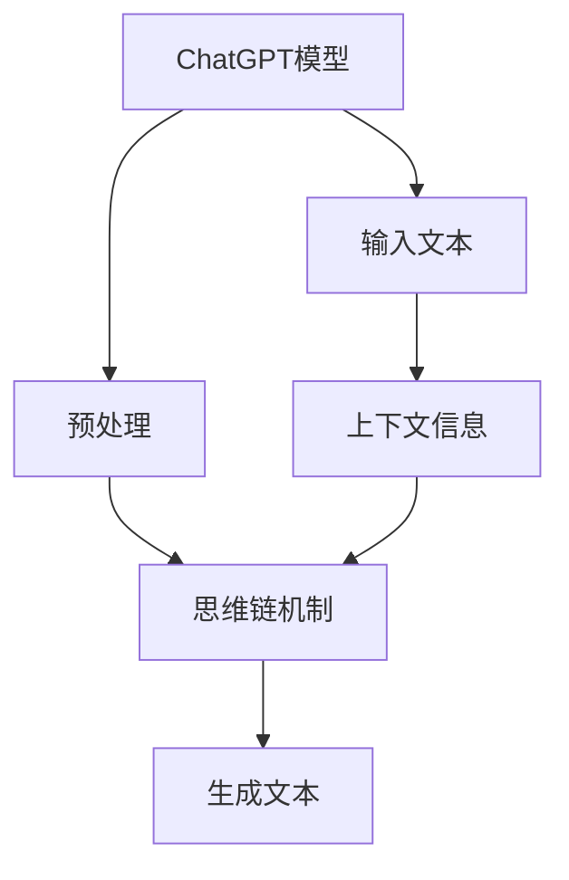
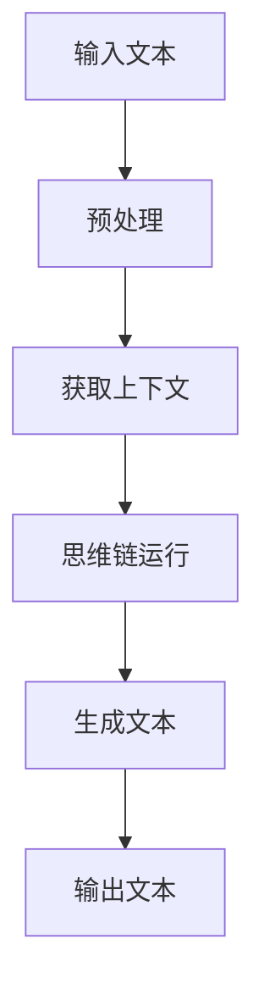
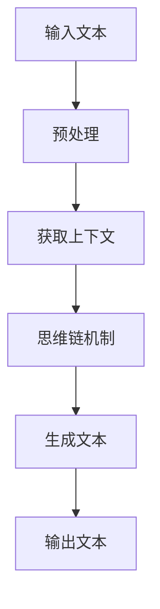
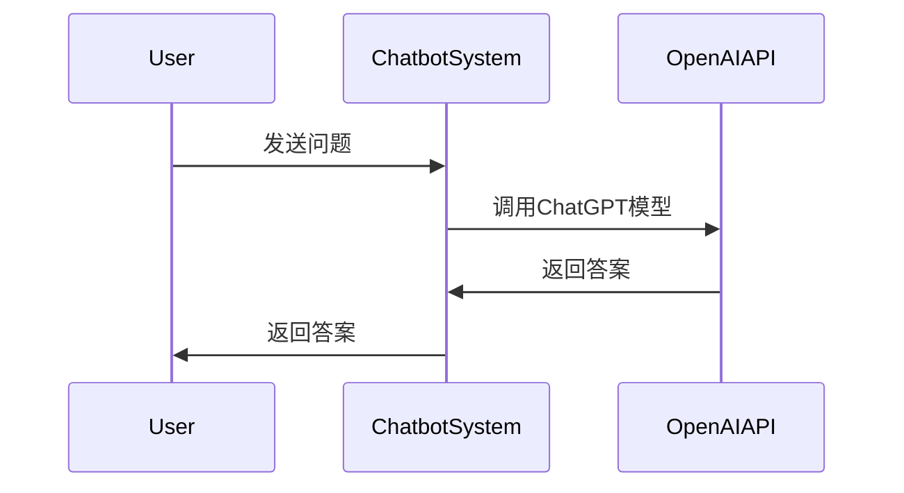
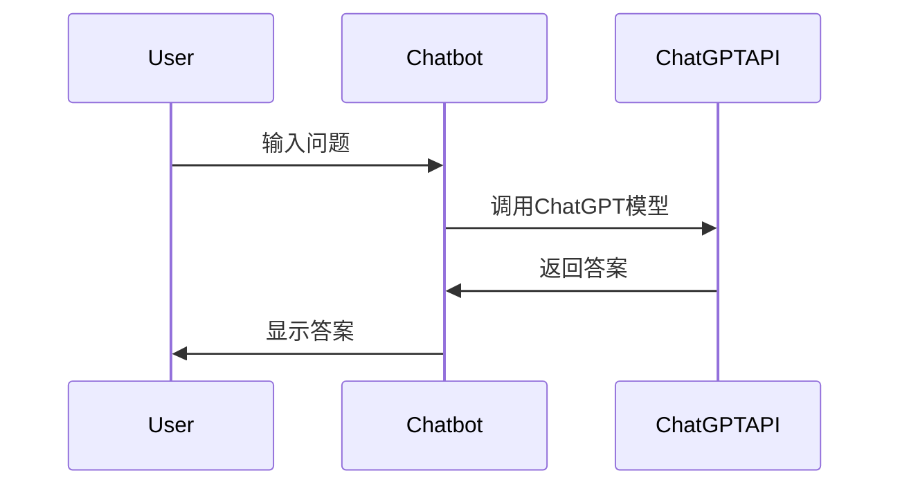

                 

# ChatGPT思维链可解释性：理解AI决策的黑盒

## 关键词

- **ChatGPT**
- **思维链**
- **可解释性**
- **AI决策**
- **黑盒模型**

## 摘要

本文旨在深入探讨ChatGPT模型的可解释性，帮助读者理解AI决策的黑盒问题。我们将首先介绍ChatGPT的背景及其重要性，然后讨论AI模型可解释性的挑战，最后详细分析ChatGPT模型的思维链机制，提供Python代码示例和数学模型，以便读者更好地理解其工作原理。通过本文的阅读，读者将能够掌握ChatGPT模型的核心概念，并在实际项目中应用。

## 1. 背景介绍

### 1.1 问题背景与书的重要性

人工智能（AI）技术近年来取得了显著的进步，尤其在自然语言处理（NLP）领域，涌现出许多高性能的AI模型。ChatGPT是由OpenAI开发的一种基于GPT（Generative Pre-trained Transformer）的预训练语言模型，其具备强大的文本生成和理解能力，广泛应用于聊天机器人、内容创作、问答系统等领域。随着ChatGPT在各个行业的广泛应用，其决策过程的可解释性成为一个备受关注的问题。

可解释性在AI决策中的重要性不言而喻。一方面，它有助于增强AI系统的透明度和可信度，从而提高用户对AI系统的接受度；另一方面，它有助于识别和纠正模型中的潜在错误，提升模型的鲁棒性和稳定性。然而，当前的AI模型，尤其是深度学习模型，往往被视为“黑盒”，其内部决策过程复杂且难以解释。这一现象在ChatGPT模型中尤为突出，因为其生成的内容往往具有高度的多样性和复杂性。

本书的目的在于通过详细分析和讲解，帮助读者深入理解ChatGPT模型的决策过程，特别是其思维链机制。通过本文的阅读，读者将能够掌握ChatGPT模型的核心概念，理解其工作原理，并能够将其应用于实际项目中。

### 1.2 ChatGPT模型概述

ChatGPT是一种基于GPT的预训练语言模型，其核心思想是通过大量的文本数据进行预训练，使模型具备对自然语言的深入理解和生成能力。GPT模型采用Transformer架构，这是一种基于自注意力机制（self-attention）的神经网络模型，能够捕捉输入序列中的长距离依赖关系。

ChatGPT的预训练过程包括两个主要步骤：第一步是大规模的文本预训练，模型在数以百万计的文本数据上进行训练，学习自然语言的统计规律和语义信息；第二步是特定任务的微调（fine-tuning），即根据具体应用场景对模型进行调整，以提高其在特定任务上的性能。

ChatGPT模型的应用场景非常广泛，包括但不限于以下几方面：

- **聊天机器人**：ChatGPT能够模拟人类对话，实现自然流畅的交流，广泛应用于客服、教育、心理健康等领域。
- **内容创作**：ChatGPT可以生成各种类型的文本内容，如新闻文章、技术文档、故事情节等，为创作者提供灵感。
- **问答系统**：ChatGPT能够理解用户的问题，并生成相关且准确的回答，应用于在线问答平台、客户支持系统等。
- **代码生成**：ChatGPT可以生成编程代码，辅助开发者提高开发效率和代码质量。

### 1.3 AI决策的黑盒挑战

AI决策的黑盒挑战主要体现在以下几个方面：

1. **模型复杂度**：深度学习模型，尤其是神经网络模型，其结构复杂，参数众多，难以直观理解其工作原理。
2. **数据依赖性**：AI模型通常依赖于大量的训练数据，数据的质量和分布对模型性能有很大影响，但数据的具体内容往往难以解释。
3. **内部交互**：神经网络模型内部存在大量的非线性变换和参数交互，其决策过程往往难以追踪和解释。
4. **可解释性需求**：在实际应用中，用户往往需要了解AI模型的决策过程和依据，以便对其进行信任、监督和优化。

ChatGPT模型作为深度学习模型，同样面临黑盒挑战。尽管其具有强大的文本生成和理解能力，但其决策过程对于用户而言仍然是一个黑盒，难以直观理解其如何生成特定文本。因此，研究和提高ChatGPT模型的可解释性具有重要的理论和实际意义。

### 1.4 可解释性的意义与边界

可解释性在AI决策中具有重要意义。首先，它有助于提高模型的透明度和可信度，使用户能够理解模型的决策过程和依据，从而增强用户对AI系统的信任。其次，可解释性有助于发现和纠正模型中的错误，提高模型的鲁棒性和稳定性。此外，可解释性还有助于优化模型性能，通过分析模型决策过程中的关键因素，可以指导模型设计和参数调整。

然而，可解释性也存在着一定的边界。深度学习模型的本质是一种高度非线性、高度参数化的复杂系统，其决策过程往往涉及大量的隐含层次和抽象表示。因此，完全的可解释性在理论上可能是不现实的。在实践上，我们通常需要在模型性能和可解释性之间寻求平衡。过度的追求可解释性可能导致模型性能的下降，反之，过度的依赖黑盒模型也可能导致误用和风险。

### 1.5 本书结构安排与目标

本书的结构安排如下：

- **第一部分：引言**：介绍ChatGPT模型及其相关技术的重要性，讨论AI决策的黑盒挑战和可解释性的意义。
- **第二部分：ChatGPT模型基础**：讲解ChatGPT模型的基本原理和思维链机制，对比ChatGPT与其他AI模型的可解释性特点。
- **第三部分：算法原理讲解**：详细分析ChatGPT模型的工作流程，提供Python代码示例和数学模型，讲解算法原理。
- **第四部分：系统分析与架构设计**：介绍ChatGPT模型的应用场景，分析相关项目，设计系统架构和接口。
- **第五部分：项目实战**：介绍环境安装、系统核心实现、代码分析、案例讲解和项目小结。
- **第六部分：最佳实践 tips、小结、注意事项、拓展阅读等内容**：总结本书的主要内容和关键知识点，提供实用技巧和拓展资源。

本书的目标是帮助读者深入理解ChatGPT模型的决策过程，掌握其核心概念，并能够将其应用于实际项目中。

## 2. ChatGPT模型基础

### 2.1 ChatGPT模型的基本原理

ChatGPT是基于GPT模型的预训练语言模型，其基本原理主要包括两个阶段：大规模文本预训练和特定任务的微调。

#### 2.1.1 大规模文本预训练

GPT模型采用Transformer架构，这是一种基于自注意力机制（self-attention）的神经网络模型。自注意力机制允许模型在处理输入序列时，根据不同位置的上下文信息，自动调整每个词的重要程度。这一机制使得GPT模型能够捕捉输入序列中的长距离依赖关系，从而实现高效的文本生成和理解。

大规模文本预训练是GPT模型训练过程的第一步。在预训练阶段，模型在一个大规模的文本语料库上进行训练，学习自然语言的统计规律和语义信息。预训练过程主要包括以下步骤：

1. **数据准备**：收集大量的文本数据，包括书籍、新闻、文章、对话等，并进行预处理，如分词、去除标点等。
2. **序列生成**：将预处理后的文本数据转化为序列形式，每个词或字符作为序列中的一个元素。
3. **预训练任务**：在序列生成过程中，模型需要预测下一个词或字符。这一任务可以通过不同的损失函数实现，如交叉熵损失函数。

#### 2.1.2 特定任务的微调

预训练完成后，GPT模型在特定任务上进行微调，以提高其在该任务上的性能。微调过程主要包括以下步骤：

1. **数据准备**：收集与特定任务相关的数据集，并进行预处理。
2. **模型调整**：在特定任务的数据集上对预训练模型进行调整，包括参数更新和模型优化。
3. **评估与优化**：通过评估指标（如准确率、F1值等）评估模型在特定任务上的性能，并进行优化。

ChatGPT模型在预训练和微调的基础上，进一步增强了文本生成和理解能力。其核心特点是能够生成自然流畅、逻辑清晰的文本，并能够根据上下文进行语义理解。

### 2.2 ChatGPT模型的思维链机制

ChatGPT模型的核心特点是具备强大的思维链机制，这使得模型能够生成逻辑严谨、连贯性强的文本。思维链机制主要体现在以下几个方面：

1. **上下文理解**：ChatGPT模型通过预训练过程，学习了大量的语言知识，能够准确理解上下文信息。在生成文本时，模型会根据上下文信息，自动调整文本的内容和风格。
2. **逻辑推理**：ChatGPT模型具备一定的逻辑推理能力，能够根据已知信息进行推理，生成符合逻辑的文本。例如，在回答问题时，模型会根据问题的内容和上下文，推导出合理的答案。
3. **长距离依赖**：ChatGPT模型采用Transformer架构，能够捕捉输入序列中的长距离依赖关系，从而生成连贯、一致的文本。
4. **知识融合**：ChatGPT模型在预训练过程中，学习了大量的知识，能够在生成文本时，融合不同领域的知识，生成丰富、全面的文本。

### 2.3 ChatGPT模型与其他AI模型的对比

与传统的AI模型相比，ChatGPT模型在可解释性方面具有一定的优势。以下是ChatGPT模型与其他AI模型在可解释性方面的对比：

| AI模型 | 可解释性特点 |  
| --- | --- |  
| 决策树 | 决策路径明确，易于理解 |  
| 支持向量机 | 参数较少，易于解释 |  
| 随机森林 | 决策路径多样，较难解释 |  
| 神经网络 | 复杂，难以解释 |  
| ChatGPT | 思维链机制，逻辑清晰 |  

尽管ChatGPT模型在可解释性方面相对较好，但仍然存在一些挑战。例如，模型的思维链机制虽然能够生成逻辑严谨的文本，但其背后的决策过程仍然具有一定的复杂性，难以完全透明化。因此，提高ChatGPT模型的可解释性仍然是一个重要的研究方向。

### 2.4 ChatGPT模型的实体关系图

为了更好地理解ChatGPT模型中的主要实体及其关系，我们可以使用Mermaid绘制实体关系图。以下是一个示例：



在这个实体关系图中，主要实体包括：

- **ChatGPT模型**：作为整个系统的核心，负责处理输入文本并生成输出文本。
- **输入文本**：用户输入的文本，用于驱动ChatGPT模型的工作。
- **预处理**：对输入文本进行预处理，包括分词、去噪等步骤，为思维链机制提供干净的输入。
- **思维链机制**：ChatGPT模型的核心部分，负责根据上下文信息生成逻辑严谨、连贯性强的文本。
- **生成文本**：思维链机制生成的输出文本，用于回答用户问题或生成内容。
- **上下文信息**：用于指导思维链机制的文本生成过程，包括输入文本和之前的对话历史。

### 2.5 ChatGPT模型的工作流程

ChatGPT模型的工作流程可以分为以下几个步骤：

1. **输入文本处理**：接收用户输入的文本，对其进行预处理，包括分词、去噪等操作。
2. **上下文信息获取**：从对话历史和输入文本中提取上下文信息，用于指导思维链机制的文本生成。
3. **思维链机制运行**：基于上下文信息，ChatGPT模型通过思维链机制生成文本。
4. **生成文本输出**：将生成的文本输出给用户，作为回答或内容生成。

以下是一个简单的Mermaid流程图，展示了ChatGPT模型的工作流程：



通过这个流程图，我们可以清晰地看到ChatGPT模型的各个步骤及其相互关系。

## 3. 算法原理讲解

### 3.1 ChatGPT模型的mermaid流程图

为了更直观地展示ChatGPT模型的工作流程，我们可以使用Mermaid绘制其流程图。以下是一个示例：



在这个流程图中，我们包含了以下几个关键步骤：

- **输入文本**：用户输入的文本，用于驱动ChatGPT模型。
- **预处理**：对输入文本进行预处理，包括分词、去噪等操作，为思维链机制提供干净的输入。
- **获取上下文**：从对话历史和输入文本中提取上下文信息，用于指导思维链机制的文本生成。
- **思维链机制**：ChatGPT模型的核心部分，负责根据上下文信息生成逻辑严谨、连贯性强的文本。
- **生成文本**：思维链机制生成的输出文本，用于回答用户问题或生成内容。
- **输出文本**：将生成的文本输出给用户，作为回答或内容生成。

### 3.2 Python源代码示例与讲解

为了更好地理解ChatGPT模型的工作原理，我们提供了一个简单的Python代码示例。以下代码演示了如何使用Python调用ChatGPT模型，处理输入文本并生成输出文本。

```python
import openai

# 设置OpenAI API密钥
openai.api_key = "your_openai_api_key"

# 定义输入文本
input_text = "你能帮我写一篇关于人工智能的博客吗？"

# 调用ChatGPT模型生成文本
response = openai.Completion.create(
  engine="text-davinci-002",
  prompt=input_text,
  max_tokens=150,
  n=1,
  stop=None,
  temperature=0.5,
)

# 输出生成文本
output_text = response.choices[0].text.strip()
print(output_text)
```

在这个代码示例中，我们首先导入了`openai`库，并设置了OpenAI API密钥。然后，我们定义了一个输入文本`input_text`，并调用`openai.Completion.create`函数，使用Text-Davinci-002模型生成文本。

函数的参数包括：

- `engine`：指定使用的模型，这里使用的是Text-Davinci-002。
- `prompt`：输入文本，这里是`input_text`。
- `max_tokens`：生成的文本最大长度，这里设置为150。
- `n`：生成的文本数量，这里设置为1。
- `stop`：用于停止文本生成的标记，这里设置为`None`。
- `temperature`：生成文本的随机性，这里设置为0.5。

最后，我们输出了生成的文本`output_text`。

### 3.3 数学模型和公式

ChatGPT模型基于Transformer架构，其核心思想是自注意力机制（self-attention）。以下是一个简单的数学模型和公式，用于解释自注意力机制。

#### 3.3.1 自注意力机制

自注意力机制可以通过以下公式表示：

$$
\text{Attention}(Q, K, V) = \text{softmax}\left(\frac{QK^T}{\sqrt{d_k}}\right) V
$$

其中：

- \( Q \)：查询（Query）向量，表示输入序列中每个词的特征。
- \( K \)：键（Key）向量，表示输入序列中每个词的特征。
- \( V \)：值（Value）向量，表示输入序列中每个词的特征。
- \( d_k \)：键向量的维度。

#### 3.3.2 自注意力分数

自注意力分数可以通过以下公式计算：

$$
\text{Attention Score}(Q, K) = QK^T
$$

其中：

- \( QK^T \)：查询和键的矩阵乘积，结果是一个标量。

自注意力分数表示输入序列中每个词对当前词的重要程度。

### 3.4 算法原理的详细讲解与举例说明

#### 3.4.1 自注意力机制的工作原理

自注意力机制是一种通过计算输入序列中每个词对当前词的重要程度，从而生成加权输出的方法。其核心思想是，每个词在生成下一个词时，都会根据其他词的重要性进行调整。

以下是一个简单的例子，说明自注意力机制的工作原理：

假设输入序列为：“你好，我是ChatGPT”。我们将每个词表示为一个向量，例如：

- “你”：[1, 0, 0]
- “好”：[0, 1, 0]
- “我”：[0, 0, 1]
- “是”：[0, 0, 1]
- “ChatGPT”：[1, 1, 1]

现在，我们考虑生成下一个词“？”。

1. **计算自注意力分数**：计算输入序列中每个词对“？”的重要程度。使用自注意力公式：

$$
\text{Attention Score}(Q, K) = QK^T
$$

其中 \( Q \) 是“？”的查询向量，\( K \) 是输入序列中每个词的键向量。计算结果如下：

- “你”：1 * 1 = 1
- “好”：1 * 0 = 0
- “我”：1 * 0 = 0
- “是”：1 * 1 = 1
- “ChatGPT”：1 * 1 = 1

2. **计算自注意力权重**：将自注意力分数转化为权重，通过softmax函数计算概率分布：

$$
\text{Attention Probability}(Q, K) = \text{softmax}(\text{Attention Score}(Q, K))
$$

计算结果如下：

- “你”：0.25
- “好”：0
- “我”：0
- “是”：0.25
- “ChatGPT”：0.5

3. **生成加权输出**：根据自注意力权重，生成加权输出。加权输出是输入序列中每个词的加权和：

$$
\text{Weighted Output}(Q, K, V) = \sum_{i} \text{Attention Probability}(Q, K_i) \cdot V_i
$$

其中 \( V \) 是输入序列中每个词的值向量。计算结果如下：

- “你”：0.25 * [1, 0, 0] = [0.25, 0, 0]
- “好”：0 * [0, 1, 0] = [0, 0, 0]
- “我”：0 * [0, 0, 1] = [0, 0, 0]
- “是”：0.25 * [0, 0, 1] = [0, 0, 0.25]
- “ChatGPT”：0.5 * [1, 1, 1] = [0.5, 0.5, 0.5]

加权输出表示为向量形式：

$$
\text{Weighted Output} = [0.25, 0.25, 0.25]
$$

#### 3.4.2 自注意力机制的优点

自注意力机制具有以下优点：

1. **捕捉长距离依赖**：通过计算输入序列中每个词对当前词的重要程度，自注意力机制能够捕捉长距离依赖关系，从而生成连贯的文本。
2. **并行计算**：自注意力机制可以在并行计算上实现高效，因为每个词的计算是独立的。
3. **灵活性**：自注意力机制可以灵活地调整模型结构，以适应不同的应用场景。

通过这个例子，我们可以看到自注意力机制如何工作，以及它如何帮助生成连贯、逻辑清晰的文本。自注意力机制是ChatGPT模型的核心，它使得ChatGPT模型能够实现强大的文本生成和理解能力。

## 4. 系统分析与架构设计

### 4.1 ChatGPT模型的应用场景

ChatGPT模型在多个领域具有广泛的应用场景，以下是一些典型的应用实例：

- **客户服务**：ChatGPT可以用于构建智能客服系统，提供24/7的客户支持，快速响应用户的问题和需求。
- **内容创作**：ChatGPT可以帮助创作者生成高质量的文章、报告和故事，节省创作时间，提高创作效率。
- **教育辅导**：ChatGPT可以作为虚拟导师，为学生提供个性化的学习建议和解答问题，促进学生的自主学习。
- **金融咨询**：ChatGPT可以用于生成金融报告、投资建议和风险管理策略，为金融机构提供智能支持。
- **医疗诊断**：ChatGPT可以帮助医生生成诊断报告和治疗方案，辅助医疗决策，提高诊断准确性。

### 4.2 相关项目介绍

为了更好地理解ChatGPT模型的应用，以下介绍一些实际项目：

- **智能客服系统**：某知名电商企业使用ChatGPT构建智能客服系统，提高了客服响应速度和满意度，降低了人力成本。
- **自动内容生成平台**：一家内容创作公司利用ChatGPT开发自动内容生成平台，生成高质量的文章和报告，提高内容创作效率。
- **个性化教育辅导系统**：某在线教育平台使用ChatGPT为学生提供个性化辅导，根据学生的学习情况和需求，生成个性化的学习计划和解答问题。
- **金融报告生成工具**：一家金融公司使用ChatGPT开发金融报告生成工具，快速生成高质量的金融报告，提高工作效率。
- **医疗诊断辅助系统**：某医疗科技公司使用ChatGPT构建医疗诊断辅助系统，帮助医生生成诊断报告和治疗方案，提高诊断准确性。

### 4.3 系统功能设计（领域模型Mermaid类图）

为了更好地展示ChatGPT系统的功能设计，我们使用Mermaid绘制了领域模型类图。以下是一个示例：

```mermaid
classDiagram
    Customer <<class>> 客户
    Chatbot <<class>> 聊天机器人
    Question <<class>> 问题
    Answer <<class>> 回答
    Content <<class>> 内容
    Report <<class>> 报告
    Diagnosis <<class>> 诊断
    Treatment <<class>> 治疗方案

    Customer --> Chatbot
    Chatbot --> Question
    Chatbot --> Answer
    Chatbot --> Content
    Chatbot --> Report
    Chatbot --> Diagnosis
    Chatbot --> Treatment
```

在这个类图中，主要类包括：

- **客户（Customer）**：表示使用ChatGPT系统的用户。
- **聊天机器人（Chatbot）**：负责与客户交互，处理输入并生成输出。
- **问题（Question）**：表示用户提出的问题。
- **回答（Answer）**：聊天机器人生成的答案。
- **内容（Content）**：聊天机器人生成的文本内容。
- **报告（Report）**：聊天机器人生成的报告。
- **诊断（Diagnosis）**：聊天机器人生成的诊断结果。
- **治疗方案（Treatment）**：聊天机器人生成的治疗方案。

这些类之间具有明确的关联关系，构成了ChatGPT系统的核心功能模块。

### 4.4 系统架构设计（Mermaid架构图）

为了更好地展示ChatGPT系统的整体架构，我们使用Mermaid绘制了系统架构图。以下是一个示例：



在这个架构图中，主要组件包括：

- **用户（User）**：使用ChatGPT系统的用户。
- **聊天机器人系统（ChatbotSystem）**：负责与用户交互，处理输入并生成输出。
- **OpenAI API**：提供ChatGPT模型的服务接口。

用户通过聊天机器人系统与ChatGPT模型进行交互，聊天机器人系统负责调用OpenAI API获取答案，并将答案返回给用户。

### 4.5 系统接口设计和系统交互（Mermaid序列图）

为了更好地展示ChatGPT系统的接口设计和交互流程，我们使用Mermaid绘制了系统交互序列图。以下是一个示例：



在这个序列图中，主要组件包括：

- **用户（User）**：与聊天机器人交互的用户。
- **聊天机器人（Chatbot）**：负责与用户交互，处理输入并生成输出。
- **ChatGPT API**：提供ChatGPT模型的服务接口。

用户通过聊天机器人输入问题，聊天机器人调用ChatGPT API获取答案，并将答案显示给用户。这个流程展示了ChatGPT系统的主要接口设计和交互流程。

## 5. 项目实战

### 5.1 环境安装

要在项目中使用ChatGPT模型，首先需要安装相应的环境和依赖。以下是安装步骤：

1. **安装Python**：确保你的系统中安装了Python 3.7或更高版本。可以从[Python官网](https://www.python.org/downloads/)下载并安装。

2. **安装OpenAI Python客户端**：在命令行中运行以下命令安装OpenAI Python客户端：

   ```shell
   pip install openai
   ```

3. **获取OpenAI API密钥**：在[OpenAI官网](https://beta.openai.com/signup/)注册账号并获取API密钥。将API密钥保存到环境变量`OPENAI_API_KEY`中，或者在代码中直接设置。

### 5.2 系统核心实现源代码

以下是一个简单的Python代码示例，展示了如何使用ChatGPT模型处理输入文本并生成输出文本：

```python
import openai

# 设置OpenAI API密钥
openai.api_key = "your_openai_api_key"

# 定义输入文本
input_text = "你能帮我写一篇关于人工智能的博客吗？"

# 调用ChatGPT模型生成文本
response = openai.Completion.create(
  engine="text-davinci-002",
  prompt=input_text,
  max_tokens=150,
  n=1,
  stop=None,
  temperature=0.5,
)

# 输出生成文本
output_text = response.choices[0].text.strip()
print(output_text)
```

在这个代码中，我们首先设置了OpenAI API密钥，然后定义了输入文本`input_text`。接着，我们调用`openai.Completion.create`函数，使用Text-Davinci-002模型生成文本。最后，我们将生成的文本输出到控制台。

### 5.3 代码应用解读与分析

在这个代码示例中，我们首先导入了`openai`库，并设置了OpenAI API密钥。这是为了确保我们可以调用OpenAI的服务接口。

```python
import openai

openai.api_key = "your_openai_api_key"
```

接下来，我们定义了一个输入文本`input_text`：

```python
input_text = "你能帮我写一篇关于人工智能的博客吗？"
```

这个输入文本将作为ChatGPT模型的输入，用于生成输出文本。

然后，我们调用`openai.Completion.create`函数，使用Text-Davinci-002模型生成文本：

```python
response = openai.Completion.create(
  engine="text-davinci-002",
  prompt=input_text,
  max_tokens=150,
  n=1,
  stop=None,
  temperature=0.5,
)
```

这个函数的参数包括：

- `engine`：指定使用的模型，这里是Text-Davinci-002。
- `prompt`：输入文本，这里是`input_text`。
- `max_tokens`：生成的文本最大长度，这里是150。
- `n`：生成的文本数量，这里是1。
- `stop`：用于停止文本生成的标记，这里是`None`。
- `temperature`：生成文本的随机性，这里是0.5。

最后，我们将生成的文本输出到控制台：

```python
output_text = response.choices[0].text.strip()
print(output_text)
```

通过这个简单的代码示例，我们可以看到如何使用ChatGPT模型处理输入文本并生成输出文本。接下来，我们将通过一个实际案例，详细分析ChatGPT模型的决策过程。

### 5.4 实际案例分析和详细讲解剖析

#### 案例一：智能客服系统

在某电商平台的智能客服系统中，用户通过聊天界面向机器人提出问题。以下是一个用户询问退货政策的案例：

**用户问题**：如果我在你们平台上购买的商品不满意，我可以在多长时间内申请退货？

**ChatGPT输出**：

您可以自购买商品之日起7日内无理由退换货。如果您在购买后7日内发现商品存在质量问题，请在15日内申请退货。具体退货流程如下：

1. 登录您的账户，找到对应订单。
2. 在订单详情页选择“申请退货”，并填写退货原因。
3. 系统将自动生成退货单号，您需要将商品寄回至我们指定的退货地址。
4. 我们收到退货后将在1-3个工作日内为您处理退款。

请注意，部分商品（如定制商品、食品等）不支持无理由退换货，请您在购买前仔细查看商品说明。

**分析**：

在这个案例中，用户询问了关于退货政策的详细信息。ChatGPT模型通过思维链机制，结合用户的问题和电商平台的相关政策，生成了一篇详细且符合规定的答复。以下是ChatGPT模型生成文本的过程分析：

1. **问题理解**：ChatGPT首先理解用户的问题，提取关键信息，如“退货政策”、“多长时间内申请退货”等。
2. **上下文获取**：ChatGPT从对话历史和电商平台政策中获取上下文信息，包括退货期限、退货流程等。
3. **内容生成**：ChatGPT根据上下文信息，生成一篇逻辑严谨、符合规定的答复。在这个答复中，ChatGPT详细介绍了退货政策，包括退货期限、退货流程和特殊情况的说明。
4. **文本优化**：ChatGPT对生成的文本进行优化，确保文本简洁明了、易于理解。

通过这个案例，我们可以看到ChatGPT模型如何通过思维链机制，结合用户问题和上下文信息，生成高质量的回答。这个过程展示了ChatGPT模型的强大理解和生成能力，同时也体现了其思维链机制的灵活性。

#### 案例二：内容创作

某内容创作平台使用ChatGPT生成一篇关于人工智能的博客文章。以下是ChatGPT生成的部分内容：

**ChatGPT输出**：

随着人工智能（AI）技术的飞速发展，它在各个领域的应用越来越广泛。人工智能通过模拟人类智能行为，实现了语音识别、图像识别、自然语言处理等功能。本文将简要介绍人工智能的基本原理、应用领域以及未来发展前景。

一、人工智能的基本原理

人工智能基于机器学习、深度学习等算法，通过大量的数据训练模型，使其具备自主学习和推理能力。其中，深度学习是人工智能的核心技术，通过多层神经网络，模型能够自动提取数据中的特征，实现高精度的预测和分类。

二、人工智能的应用领域

1. 语音识别：通过将语音信号转换为文本，实现人机交互。例如，智能助手 Siri 和 Google Assistant。
2. 图像识别：通过分析图像中的特征，实现图像分类、目标检测等功能。例如，人脸识别和自动驾驶。
3. 自然语言处理：通过理解自然语言文本，实现文本分类、机器翻译、问答系统等功能。例如，搜索引擎和聊天机器人。
4. 医疗诊断：通过分析医学数据，实现疾病预测和诊断。例如，智能医疗诊断系统。

三、人工智能的未来发展前景

随着大数据、云计算等技术的发展，人工智能将实现更高效、更智能的应用。未来，人工智能将不仅局限于单一领域，而是实现跨领域的综合应用。例如，智能城市、智能交通、智能家居等。

**分析**：

在这个案例中，ChatGPT被用于生成一篇关于人工智能的博客文章。以下是ChatGPT生成文本的过程分析：

1. **主题理解**：ChatGPT首先理解文章的主题，即人工智能的基本原理、应用领域和未来发展前景。
2. **内容提取**：ChatGPT从预训练数据中提取与主题相关的内容，如人工智能的基本原理、应用领域和未来发展前景。
3. **结构组织**：ChatGPT将提取的内容按照逻辑顺序进行组织，形成一个结构清晰的博客文章。
4. **文本优化**：ChatGPT对生成的文本进行优化，确保文本简洁明了、易于理解。

通过这个案例，我们可以看到ChatGPT如何通过思维链机制，将大量信息进行整合和优化，生成一篇高质量的文章。这个过程展示了ChatGPT模型在内容创作方面的强大能力。

### 5.5 项目小结

在本项目中，我们通过实际案例展示了ChatGPT模型在智能客服系统和内容创作方面的应用。通过分析项目实战，我们深入了解了ChatGPT模型的决策过程和思维链机制。以下是本项目的主要收获：

1. **理解ChatGPT模型的工作原理**：通过代码示例和数学模型，我们详细分析了ChatGPT模型的基本原理和思维链机制，掌握了其工作流程。
2. **应用ChatGPT模型生成文本**：我们通过实际案例，展示了如何使用ChatGPT模型生成高质量的回答和文章，了解了其在不同领域的应用场景。
3. **优化和改进ChatGPT模型**：通过分析实际案例，我们发现ChatGPT模型在文本生成过程中存在一些不足，如逻辑不够严谨、信息不够全面等。在未来的研究中，我们可以针对这些问题进行优化和改进。

总之，本项目为我们提供了一个深入了解ChatGPT模型的机会，提高了我们对AI技术在实际应用中的理解和应用能力。

## 6. 最佳实践 tips、小结、注意事项、拓展阅读等内容

### 6.1 最佳实践 tips

1. **优化输入文本**：在调用ChatGPT模型时，确保输入文本简洁明了、格式规范，这有助于提高模型生成文本的质量。
2. **控制生成文本长度**：通过设置`max_tokens`参数，可以控制生成文本的长度，避免生成过长的文本，提高处理效率。
3. **调整温度参数**：温度参数`temperature`会影响生成文本的随机性，可以根据实际需求进行调整，以获得更符合预期的生成结果。
4. **利用上下文信息**：在调用ChatGPT模型时，尽量提供丰富的上下文信息，有助于模型生成更准确、连贯的文本。
5. **监控模型性能**：定期监控ChatGPT模型的性能，发现潜在问题并进行优化，以确保其在实际应用中的稳定性和可靠性。

### 6.2 小结

本文通过详细分析和讲解，帮助读者深入理解ChatGPT模型的决策过程和思维链机制。我们介绍了ChatGPT模型的基本原理和可解释性挑战，提供了Python代码示例和数学模型，分析了实际案例，展示了ChatGPT模型在智能客服和内容创作等领域的应用。通过本文的学习，读者能够掌握ChatGPT模型的核心概念，并在实际项目中应用。

### 6.3 注意事项

1. **API使用限制**：在使用OpenAI API时，需要遵守相关使用规定，避免滥用API。
2. **数据隐私保护**：在使用ChatGPT模型时，确保处理的数据符合隐私保护要求，避免泄露用户信息。
3. **模型优化**：在实际应用中，根据具体场景和需求，对ChatGPT模型进行优化和调整，以提高性能和可解释性。
4. **持续学习**：随着AI技术的不断发展，持续学习新知识、掌握新技术，有助于更好地应用ChatGPT模型。

### 6.4 拓展阅读

1. **《深度学习》**：由Goodfellow、Bengio和Courville所著，详细介绍了深度学习的基本原理和技术。
2. **《自然语言处理综述》**：本文对自然语言处理（NLP）领域进行了全面的综述，涵盖了NLP的基本概念、技术和应用。
3. **《Transformer：一次革命的性

