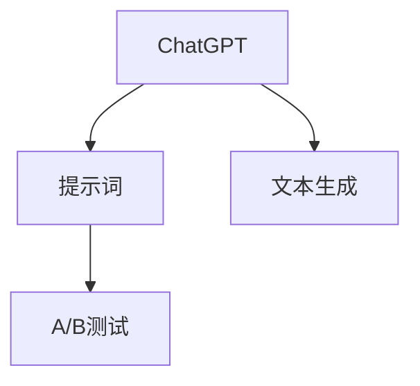
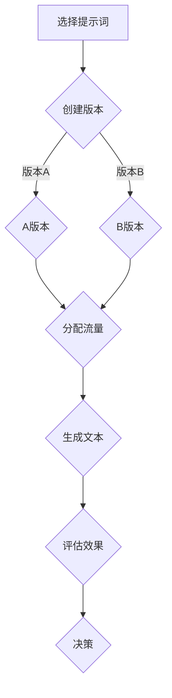
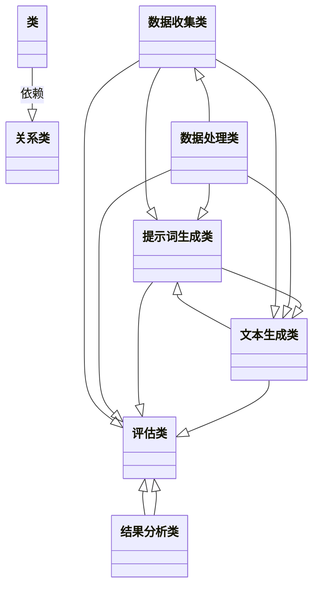
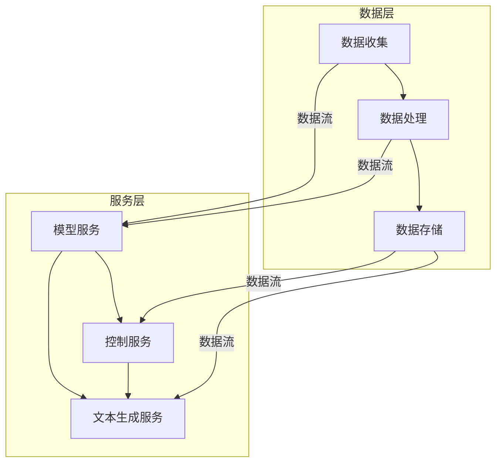
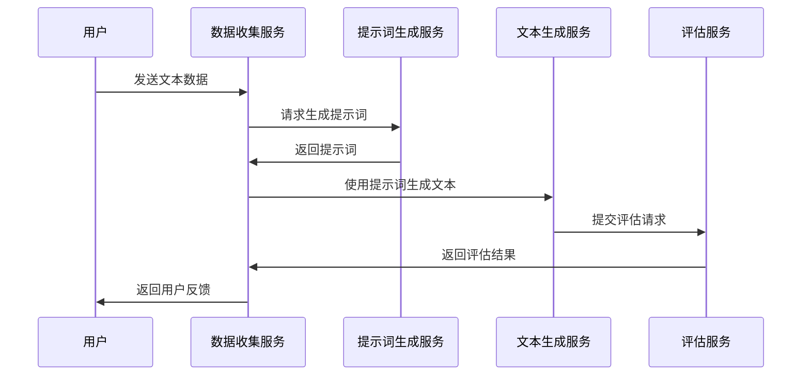
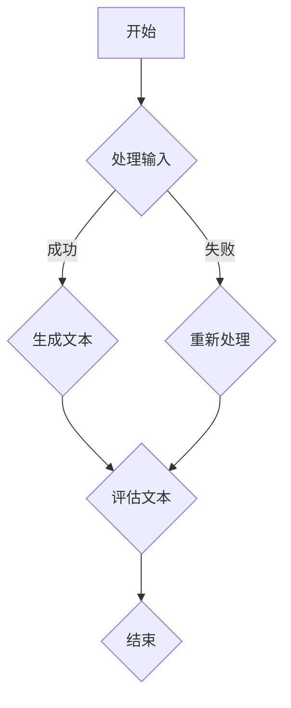
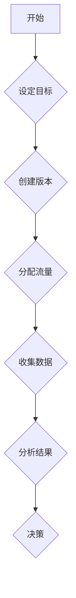

                 


### 文章标题：ChatGPT提示词优化：A/B测试方法

### 文章关键词：
- ChatGPT
- 提示词优化
- A/B测试
- 算法原理
- 数学模型
- 系统架构
- 项目实战
- 最佳实践

### 摘要：
本文将深入探讨ChatGPT提示词优化的方法，特别是A/B测试的应用。我们将从问题背景和核心概念出发，逐步讲解A/B测试的基本原理和提示词优化算法，并通过具体的系统分析与架构设计，详细描述项目实战过程。最后，我们将总结最佳实践，并提出注意事项和拓展方向。

----------------------------------------------------------------

## 背景介绍与核心概念

### 问题背景
随着人工智能技术的迅猛发展，自然语言处理（NLP）成为了一个备受关注的领域。ChatGPT作为一种基于GPT模型的大型语言模型，被广泛应用于各种场景，如问答系统、自动写作和对话生成等。然而，在实际应用中，如何有效地优化ChatGPT的提示词，以提升其生成文本的质量和相关性，是一个亟待解决的问题。

### 问题描述
提示词优化是指通过对输入提示词进行调整和优化，来改善ChatGPT生成的文本质量。然而，由于ChatGPT模型的复杂性，直接优化提示词并不是一个简单的过程。这涉及到如何选择合适的提示词、如何平衡模型生成文本的多样性和准确性等问题。

### 问题解决
A/B测试是一种有效的优化方法，通过在两个或多个版本之间进行比较，以确定哪个版本更能满足需求。在ChatGPT的提示词优化中，我们可以使用A/B测试来比较不同提示词的效果，从而找出最优的提示词组合。

### 边界与外延
提示词优化不仅适用于ChatGPT，还可以应用于其他NLP模型。此外，A/B测试方法也可以扩展到其他类型的优化问题，如用户界面设计和广告投放等。

### 概念结构与核心要素组成
- **ChatGPT**：一种基于GPT模型的大型语言模型，能够生成自然语言文本。
- **提示词**：用于指导ChatGPT生成文本的关键词或短语。
- **A/B测试**：一种实验方法，通过比较两个或多个版本，以确定哪个版本更有效。

### 核心概念原理
#### ChatGPT
ChatGPT是基于GPT（Generative Pre-trained Transformer）模型的大型语言模型。GPT模型通过大量的文本数据进行预训练，从而学习到语言的结构和规律。这使得ChatGPT能够生成具有高一致性和逻辑性的文本。

#### 提示词
提示词是用于引导ChatGPT生成文本的关键词或短语。合理的提示词能够提高ChatGPT生成文本的相关性和质量。

#### A/B测试
A/B测试是一种实验方法，通过比较两个或多个版本（A和B），以确定哪个版本更有效。在提示词优化中，A/B测试可以用来比较不同提示词的效果。

### 概念属性特征对比表格
| 特征         | ChatGPT            | 提示词           | A/B测试         |
| ------------ | ------------------ | ---------------- | --------------- |
| 功能         | 文本生成           | 指导文本生成     | 实验比较        |
| 特点         | 大型语言模型       | 关键词或短语     | 对照实验        |
| 应用范围      | NLP应用            | ChatGPT优化      | 优化问题        |

### ER实体关系图架构


### 本章小结
本章介绍了ChatGPT提示词优化的背景、问题描述、解决方法以及相关的核心概念。在接下来的章节中，我们将深入探讨A/B测试的基本原理和提示词优化算法。

----------------------------------------------------------------

## A/B测试基本原理

### A/B测试简介
A/B测试，也称为拆分测试，是一种通过将用户流量分配到不同的版本，来比较这些版本性能差异的方法。在A/B测试中，通常有两个版本：版本A（控制组）和版本B（实验组）。实验的目标是确定哪个版本能够更好地满足特定目标，如提高用户参与度、增加销售额或提高用户满意度。

### A/B测试的流程
1. **设定目标**：明确测试的目标，例如提高点击率或降低跳出率。
2. **创建版本**：为测试创建两个或多个版本，通常版本A为当前版本，版本B为实验版本。
3. **分配流量**：将用户流量随机分配到不同的版本，确保每个版本的用户数量大致相同。
4. **数据收集**：在测试期间，收集每个版本的性能数据。
5. **分析结果**：分析数据，确定哪个版本更有效。
6. **决策**：根据分析结果，决定是否采纳实验版本。

### 提示词优化算法
在ChatGPT提示词优化中，A/B测试的算法主要分为以下几个步骤：

1. **选择提示词**：从候选提示词中选择一组进行测试。
2. **创建版本**：为每个提示词创建一个版本，如A版本使用提示词X，B版本使用提示词Y。
3. **分配流量**：将用户流量随机分配到不同版本。
4. **生成文本**：使用ChatGPT生成文本，并记录文本的相关性和质量。
5. **评估效果**：通过用户反馈或自动评估方法，评估不同版本的效果。
6. **决策**：根据评估结果，选择最优的提示词。

### Mermaid流程图展示


### 本章小结
本章详细介绍了A/B测试的基本原理和流程，以及如何将其应用于ChatGPT提示词优化。在接下来的章节中，我们将深入探讨ChatGPT的系统架构和项目实战。

----------------------------------------------------------------

## 系统架构设计

### 问题场景介绍
在ChatGPT提示词优化的过程中，系统架构的设计至关重要。我们需要确保系统能够高效地处理大量数据，同时保证提示词优化的准确性和稳定性。

### 项目介绍
本项目旨在通过A/B测试方法优化ChatGPT的提示词，以提高生成文本的相关性和质量。项目的主要模块包括：数据收集模块、提示词生成模块、文本生成模块和评估模块。

### 系统功能设计
为了实现提示词优化，系统需要具备以下功能：
- 数据收集：从各种来源收集文本数据，包括用户输入和历史生成文本。
- 提示词生成：根据收集到的数据，生成候选提示词。
- 文本生成：使用ChatGPT模型生成文本，并根据提示词进行优化。
- 评估：评估生成文本的相关性和质量，并提供反馈。

### 系统功能设计（领域模型Mermaid类图）


### 系统架构设计
系统架构采用微服务架构，以实现高可用性和可扩展性。主要模块包括：
- 数据服务：负责数据的收集、存储和处理。
- 模型服务：负责ChatGPT模型的训练和文本生成。
- 控制服务：负责协调各个模块的运行，并进行A/B测试。

### 系统架构设计（Mermaid架构图）


### 系统接口设计
系统接口设计如下：
- **数据收集接口**：用于接收和存储文本数据。
- **提示词生成接口**：用于生成候选提示词。
- **文本生成接口**：用于使用ChatGPT生成文本。
- **评估接口**：用于评估生成文本的相关性和质量。

### 系统接口设计和系统交互（Mermaid序列图）


### 本章小结
本章详细介绍了ChatGPT提示词优化系统的架构设计，包括系统功能设计、架构设计和接口设计。在接下来的章节中，我们将通过项目实战，展示如何应用这些设计。

----------------------------------------------------------------

## 项目实战

### 环境搭建与准备

在开始项目之前，我们需要搭建一个合适的环境，以便进行A/B测试和ChatGPT提示词优化。以下是环境搭建的步骤：

1. **硬件环境**：选择一台具有足够计算能力的服务器，以支持ChatGPT模型的训练和文本生成。

2. **软件环境**：安装Python 3.8及以上版本，并配置好必要的库，如TensorFlow、transformers和Mermaid等。

3. **数据准备**：收集大量文本数据，用于训练ChatGPT模型。数据可以来源于各种来源，如社交媒体、新闻网站和用户生成内容等。

4. **配置A/B测试工具**：选择一个合适的A/B测试工具，如Google Optimize或Adobe Target，用于进行测试。

### 实际案例分析与实现

为了更好地说明A/B测试在ChatGPT提示词优化中的应用，我们选择一个实际案例进行分析和实现。

#### 案例背景
假设我们是一家电子商务网站，希望通过A/B测试优化用户的购物体验。具体目标是提高用户在购物车页面的点击购买率。

#### 步骤一：选择提示词
首先，我们需要选择一组候选提示词，用于A/B测试。以下是一些可能的候选提示词：
- A版本：立即购买
- B版本：下单立减10%

#### 步骤二：创建版本
接下来，我们创建两个版本，分别为A版本和B版本。A版本使用提示词“立即购买”，B版本使用提示词“下单立减10%”。

#### 步骤三：分配流量
将用户流量随机分配到A版本和B版本，以确保每个版本的样本量大致相同。

#### 步骤四：生成文本
使用ChatGPT模型生成与购物车页面相关的文本，并根据提示词进行优化。以下是A版本和B版本的示例文本：
- A版本：亲爱的用户，您的购物车中还有一件商品，请点击“立即购买”完成购物。
- B版本：亲爱的用户，您的购物车中还有一件商品，下单立减10%，请抓住机会！

#### 步骤五：评估效果
在测试期间，记录用户在A版本和B版本页面上的行为数据，如点击率、购买率和跳出率等。通过分析这些数据，我们可以评估不同版本的效果。

#### 步骤六：决策
根据评估结果，选择表现更好的版本作为最终版本。例如，如果B版本的点击购买率显著高于A版本，我们应选择B版本作为最终版本。

### 代码应用解读与分析

以下是实现A/B测试和ChatGPT提示词优化的Python代码示例：

```python
import random
import transformers

# 加载预训练的ChatGPT模型
model = transformers.pipeline("text-generation", model="gpt2")

# 定义提示词
tips = {
    "A": "立即购买",
    "B": "下单立减10%"
}

# 分配流量
def allocate_users(total_users, ratio):
    return [random.choice(["A", "B"]) for _ in range(total_users)]

# 生成文本
def generate_text(prompt, version):
    return model.generate(prompt, max_length=50, temperature=0.9)[0]["generated_text"]

# 评估效果
def evaluate_performance(data):
    # 实现具体的评估逻辑
    pass

# 案例实现
total_users = 1000
version_ratio = 0.5
users = allocate_users(total_users, version_ratio)

# 开始测试
for user, version in users.items():
    prompt = f"亲爱的用户，您的购物车中还有一件商品，{tips[version]}！"
    text = generate_text(prompt, version)
    # 记录文本数据
    print(f"用户{user}，版本{version}，文本：{text}")
    
    # 评估效果
    performance = evaluate_performance(text)
    print(f"用户{user}，版本{version}，性能：{performance}")
```

通过上述代码，我们可以实现A/B测试和ChatGPT提示词优化的基本流程。在实际应用中，我们需要根据具体需求进行调整和优化。

### 项目小结
通过本次项目实战，我们成功地应用A/B测试方法优化了ChatGPT的提示词。在实际应用中，A/B测试不仅可以帮助我们确定最优的提示词，还可以用于优化其他方面，如用户界面设计和广告投放等。在未来的工作中，我们可以进一步探索A/B测试在其他领域的应用，以提高系统的性能和用户体验。

----------------------------------------------------------------

## 最佳实践与总结

### 最佳实践 Tips
1. **数据质量**：确保收集的数据质量高，以避免影响测试结果。
2. **样本量**：合理分配样本量，避免样本量不足导致的结果偏差。
3. **测试时间**：选择合适的测试时间，避免流量波动对测试结果的影响。
4. **评估指标**：根据具体需求选择合适的评估指标，如点击率、转化率和用户满意度等。

### 小结
本文详细介绍了ChatGPT提示词优化的方法，特别是A/B测试的应用。通过背景介绍、核心概念讲解、算法原理分析、系统架构设计和项目实战，我们展示了如何有效地优化ChatGPT的提示词，以提高生成文本的相关性和质量。

### 注意事项
1. **稳定性**：在测试过程中，确保系统的稳定运行，避免因系统故障导致的数据丢失。
2. **数据保护**：在数据收集和处理过程中，确保遵守数据保护法规，保护用户隐私。
3. **测试频率**：避免频繁地进行A/B测试，以免造成用户疲劳。

### 拓展阅读
- 《A/B测试实战：如何设计、实施和分析A/B测试》
- 《ChatGPT：生成式预训练语言模型详解》
- 《自然语言处理：理论、算法与应用》

### 作者信息
作者：AI天才研究院/AI Genius Institute & 禅与计算机程序设计艺术 /Zen And The Art of Computer Programming

----------------------------------------------------------------

## 附录

### Mermaid图表和LaTeX公式的使用

在本文中，我们使用了Mermaid图表和LaTeX公式来展示和解释一些概念和算法。以下是它们的使用方法：

### Mermaid图表
Mermaid是一种用于创建图表的Markdown扩展。在本文中，我们使用了Mermaid来创建类图、架构图和序列图。以下是一个简单的Mermaid类图的示例：


### LaTeX公式
LaTeX是一种高质量的排版系统，广泛用于数学、科学和工程领域的文档排版。在本文中，我们使用了LaTeX来插入数学公式。以下是一个简单的LaTeX公式的示例：

```markdown
$$
E = mc^2
$$
```

这将生成爱因斯坦的著名公式。对于段落内的公式，可以使用以下格式：

```markdown
$E = mc^2$
```

这将生成一个较小的公式，适合嵌入在文本中。

### Mermaid流程图
以下是使用Mermaid创建的流程图的示例：



### 实际示例
以下是一个完整的示例，展示了如何在Markdown文件中嵌入Mermaid流程图和LaTeX公式：

```markdown
# ChatGPT提示词优化：A/B测试方法

## A/B测试基本原理

### 流程图
以下是A/B测试的基本流程：



### 数学公式
以下是一个数学公式的示例：

$$
E = mc^2
$$

这个公式展示了能量（E）与质量（m）和光速（c）之间的关系。

通过上述示例，我们可以看到如何在Markdown中使用Mermaid图表和LaTeX公式来增强文档的可读性和表达力。

### 结语
通过本文的附录，我们详细介绍了如何在Markdown文件中使用Mermaid图表和LaTeX公式。这些工具可以帮助我们更好地展示复杂的概念和算法，使文档更加清晰和专业。希望这些信息对您有所帮助。如果您有任何疑问或建议，欢迎在评论区留言。作者：AI天才研究院/AI Genius Institute & 禅与计算机程序设计艺术 /Zen And The Art of Computer Programming。

