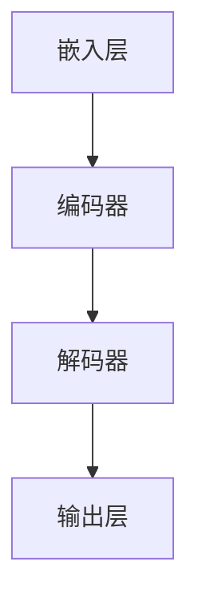
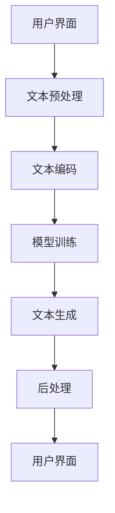
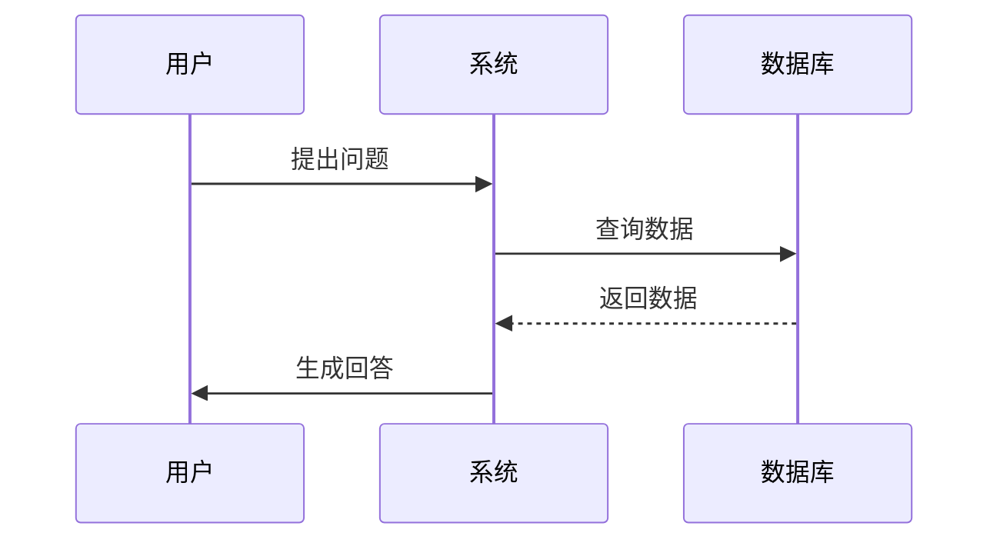

                 

### 《ChatGPT提示词优化：上下文管理技巧》背景介绍

**关键词**：ChatGPT、提示词优化、上下文管理、人工智能

**摘要**：
随着人工智能技术的不断发展，自然语言处理（NLP）领域取得了显著的进展。ChatGPT作为OpenAI推出的一个先进的大型语言模型，已经在诸多场景中展示了其强大的能力，如问答系统、自动摘要、文本生成等。然而，在具体应用中，如何优化ChatGPT的提示词，使其在处理复杂上下文时能够更加准确和有效，成为一个亟待解决的问题。本文将从背景、核心概念、算法原理、数学模型、系统分析与架构设计、项目实战等多个方面，深入探讨ChatGPT提示词优化的上下文管理技巧。

### ChatGPT及其提示词优化的背景

**1.1.1 ChatGPT的发展历程**

ChatGPT是由OpenAI开发的一个基于GPT（Generative Pre-trained Transformer）模型的高级语言生成模型。GPT系列模型首次在2018年发布，并迅速在NLP领域引起了广泛关注。ChatGPT则是在此基础上，通过进一步的训练和优化，增强了模型在对话生成方面的能力。

ChatGPT的开发经历了多个版本，每个版本都在性能和功能上进行了提升。早期的GPT模型主要关注于文本生成和摘要，而ChatGPT则在此基础上，通过引入对话生成机制，使其能够更好地模拟人类对话过程。ChatGPT的出现，标志着人工智能技术在对话系统方面的一个重大突破。

**1.1.2 ChatGPT的应用场景**

ChatGPT的应用场景非常广泛，包括但不限于以下几个方面：

- **问答系统**：ChatGPT可以用于构建智能问答系统，如客服机器人、在线教育辅导等，通过自然语言交互，为用户提供即时的信息查询和服务。
- **文本生成**：ChatGPT可以生成各种类型的文本，如新闻报道、产品描述、故事情节等，为内容创作提供强大的支持。
- **自动摘要**：ChatGPT可以自动生成文本摘要，帮助用户快速获取关键信息，提高信息处理效率。
- **对话机器人**：ChatGPT可以嵌入到各种应用中，如社交媒体、智能家居、在线聊天平台等，提供智能化的互动体验。

**1.1.3 提示词优化的意义**

尽管ChatGPT在多个场景中展示了其强大的能力，但在实际应用中，其表现仍然受到提示词的影响。优化提示词对于提升ChatGPT的性能具有重要意义：

- **提高准确性**：通过优化提示词，可以使ChatGPT在处理复杂上下文时，更加准确地理解和生成文本。
- **增强灵活性**：优化后的提示词可以更好地适应不同的场景和需求，提高模型的灵活性。
- **提升用户体验**：准确、自然的对话生成可以显著提升用户体验，使其更加满意和信赖智能系统。

因此，研究ChatGPT提示词优化的上下文管理技巧，不仅有助于提升模型性能，也为智能对话系统的进一步发展提供了重要支持。

### 提示词优化的基本概念

**1.2.1 上下文管理的原理**

在ChatGPT中，上下文管理是一个关键环节。上下文指的是模型在处理某个任务时，所依赖的与该任务相关的所有信息。对于ChatGPT来说，上下文管理主要包括以下几个方面：

- **历史对话**：ChatGPT会记录与用户的每次对话，这些历史对话信息会在后续的交互中发挥作用，影响模型的回答。
- **当前输入**：每次用户输入的新信息，都会作为当前输入，与历史对话信息结合，共同影响模型的输出。
- **上下文长度**：ChatGPT对上下文的长度有一定的限制，过长或过短的上下文都可能影响模型的性能。

上下文管理的原理在于，通过维护一个与任务相关的信息集，使模型能够更加准确地理解和生成文本。具体来说，ChatGPT会利用Transformer模型中的自注意力机制，对上下文信息进行加权处理，使得与当前任务最相关的信息得到更高的权重。

**1.2.2 上下文理解的挑战**

尽管ChatGPT在上下文理解方面取得了显著进展，但仍面临一些挑战：

- **语义歧义**：在自然语言中，同一个词语或短语可能有多种含义，这给模型理解上下文带来了困难。
- **上下文依赖**：某些信息在单独考虑时可能无意义，但在与上下文结合后，却能产生新的含义。这要求模型能够理解上下文之间的依赖关系。
- **长距离依赖**：在某些情况下，任务所需的关键信息可能分布在较长的上下文中，这要求模型具有较长的记忆能力。

**1.2.3 提示词优化的方法**

为了应对上述挑战，优化提示词的方法主要包括以下几个方面：

- **精简上下文**：通过去除无关或冗余的信息，使上下文更加简洁明了，有助于模型更好地理解任务。
- **结构化上下文**：将上下文信息进行结构化处理，如使用表格、列表等形式，有助于模型更清晰地识别关键信息。
- **上下文引导**：通过设计特定的提示词，引导模型关注任务的关键部分，从而提高模型的准确性和灵活性。
- **动态调整**：根据任务的实时变化，动态调整上下文内容和长度，使模型能够更好地适应不同的场景。

通过这些方法，可以显著提升ChatGPT在处理复杂上下文时的性能和效果。

### 本章小结

本章首先介绍了ChatGPT及其提示词优化的背景，包括其发展历程和应用场景，并强调了优化提示词在提升模型性能中的重要性。接着，详细讲解了上下文管理的原理，包括上下文的概念、存储与处理方式，以及上下文理解的挑战。最后，提出了多种提示词优化的方法，为后续章节的深入探讨奠定了基础。

## 第2章：ChatGPT核心概念与工作原理

### 2.1 ChatGPT的基础知识

#### 2.1.1 模型架构

ChatGPT是基于Transformer模型构建的，Transformer模型是一种自注意力机制的模型，最早由Vaswani等人于2017年提出。与传统的循环神经网络（RNN）相比，Transformer模型在处理长距离依赖和并行计算方面具有显著优势。

ChatGPT的模型架构主要包括以下几个部分：

1. **嵌入层（Embedding Layer）**：将输入的单词转换为向量表示。
2. **编码器（Encoder）**：由多个自注意力层（Self-Attention Layer）和前馈神经网络（Feedforward Neural Network）组成，用于处理输入文本。
3. **解码器（Decoder）**：与编码器结构相似，但多了一个额外的自注意力层（Encoder-Decoder Attention Layer），用于关注编码器的输出。
4. **输出层（Output Layer）**：将解码器的输出映射到具体的输出词汇。

#### 2.1.2 训练过程

ChatGPT的训练过程主要包括以下步骤：

1. **数据预处理**：将原始文本数据转换为可用于训练的格式，如分词、转换为词索引等。
2. **嵌入层训练**：通过预训练，将单词映射到高维向量空间，使相似的单词在向量空间中更接近。
3. **编码器训练**：通过自注意力机制，编码器学习如何从输入文本中提取关键信息，并进行序列建模。
4. **解码器训练**：解码器学习如何根据编码器的输出和已有输入，生成新的文本序列。
5. **输出层训练**：通过对比预测的输出和实际输出，不断调整模型的参数，提高模型的准确性。

#### 2.1.3 模型应用

ChatGPT在多个应用场景中展示了其强大的能力，包括但不限于：

- **问答系统**：通过理解用户的提问，生成准确的答案。
- **文本生成**：生成各种类型的文本，如新闻报道、产品描述、故事情节等。
- **自动摘要**：自动生成文本摘要，帮助用户快速获取关键信息。
- **对话机器人**：嵌入到各种应用中，提供智能化的互动体验。

### 2.2 上下文管理原理

#### 2.2.1 上下文的概念

在ChatGPT中，上下文是指模型在处理某个任务时，所依赖的所有相关信息。这些信息可以包括历史对话记录、当前输入文本等。上下文管理是ChatGPT的核心功能之一，其质量直接影响模型的表现。

#### 2.2.2 上下文的存储与处理

ChatGPT通过以下方式存储和处理上下文：

- **历史对话记录**：ChatGPT会记录与用户的每次对话，并将其作为上下文的一部分。
- **当前输入文本**：每次用户输入的新信息，都会与历史对话记录结合，共同构成当前上下文。
- **上下文长度**：ChatGPT对上下文长度有一定的限制，过长的上下文可能导致模型性能下降。

#### 2.2.3 上下文的演变

在处理任务时，ChatGPT会根据当前上下文生成输出，并将新的输出作为上下文的一部分。这一过程不断循环，使上下文逐渐演变，从而实现连续的对话生成。上下文的演变过程如图所示：

```
+----------------+     +----------------+     +----------------+
|   历史对话A    | --> |   当前输入B    | --> |   输出C        |
+----------------+     +----------------+     +----------------+
```

### 2.3 提示词优化的策略

#### 2.3.1 提示词设计的原则

为了优化ChatGPT的提示词，需要遵循以下原则：

- **明确性**：提示词应明确表达任务要求，避免模糊不清。
- **简洁性**：提示词应简洁明了，避免冗长复杂的表述。
- **针对性**：提示词应针对特定任务进行设计，提高模型的表现。
- **灵活性**：提示词应具有一定的灵活性，能够适应不同的任务需求。

#### 2.3.2 提示词优化的技巧

以下是一些提示词优化的技巧：

- **使用具体词汇**：避免使用模糊的词汇，如“可能”、“也许”等，尽量使用具体、明确的词汇。
- **提供背景信息**：在提示词中提供与任务相关的背景信息，有助于模型更好地理解任务。
- **设置上下文长度**：根据任务需求，合理设置上下文长度，避免过长或过短的上下文。
- **动态调整**：根据任务的实时变化，动态调整提示词，以提高模型的适应性。

#### 2.3.3 实战案例

以下是一个提示词优化的实战案例：

**原始提示词**：请写一篇关于人工智能的未来发展趋势的文章。

**优化后的提示词**：请根据以下信息，写一篇关于人工智能在未来十年内发展趋势的文章：

- 人工智能技术在医疗领域的应用
- 人工智能在金融行业的创新
- 人工智能对教育方式的变革

通过优化后的提示词，模型可以更准确地理解任务要求，生成内容更加丰富、具体和有针对性的文章。

### 2.4 本章小结

本章介绍了ChatGPT的基础知识，包括模型架构、训练过程和应用场景。接着，详细讲解了上下文管理的原理，包括上下文的概念、存储与处理方式以及上下文的演变。最后，提出了提示词优化的策略和技巧，并通过实战案例展示了具体应用。这些内容为后续章节的深入探讨奠定了基础。

## 第3章：算法原理与数学模型

### 3.1 算法原理讲解

#### 3.1.1 算法框架

ChatGPT的算法框架主要包括以下部分：

1. **嵌入层（Embedding Layer）**：将输入的单词转换为向量表示。
2. **编码器（Encoder）**：由多个自注意力层（Self-Attention Layer）和前馈神经网络（Feedforward Neural Network）组成，用于处理输入文本。
3. **解码器（Decoder）**：与编码器结构相似，但多了一个额外的自注意力层（Encoder-Decoder Attention Layer），用于关注编码器的输出。
4. **输出层（Output Layer）**：将解码器的输出映射到具体的输出词汇。

#### 3.1.2 算法流程图

以下是ChatGPT算法的流程图：



#### 3.1.3 模型输入处理

模型输入处理主要包括以下几个步骤：

1. **分词（Tokenization）**：将输入文本分词为单词或子词。
2. **嵌入（Embedding）**：将分词后的文本转换为向量表示。
3. **序列编码（Positional Encoding）**：为每个词添加位置信息，以帮助模型理解词的位置关系。

#### 3.1.4 上下文理解

编码器的主要任务是理解输入文本的上下文。具体过程如下：

1. **自注意力（Self-Attention）**：编码器对输入文本的每个词进行加权处理，使与当前词相关的词得到更高的权重。
2. **前馈神经网络（Feedforward Neural Network）**：对加权后的文本进行非线性变换，提取关键信息。

#### 3.1.5 提示词生成

解码器的任务是生成输出文本。具体过程如下：

1. **编码器-解码器注意力（Encoder-Decoder Attention）**：解码器关注编码器的输出，以获取上下文信息。
2. **解码（Decoding）**：根据编码器-解码器注意力得分和已有输入，生成新的文本序列。
3. **输出映射（Output Mapping）**：将解码器的输出映射到具体的输出词汇。

### 3.2 数学模型

#### 3.2.1 模型损失函数

ChatGPT的损失函数通常采用交叉熵（Cross-Entropy）损失。交叉熵损失表示模型输出与实际输出之间的差异。其公式如下：

$$
L(\theta) = -\sum_{i=1}^{N} y_i \log p(y_i | \theta)
$$

其中，$y_i$为实际输出，$p(y_i | \theta)$为模型预测的概率。

#### 3.2.2 参数优化方法

参数优化方法通常采用梯度下降（Gradient Descent）及其变种，如Adam优化器。梯度下降的公式如下：

$$
\theta_{t+1} = \theta_{t} - \alpha \nabla_\theta L(\theta_t)
$$

其中，$\theta_t$为当前参数，$\alpha$为学习率，$\nabla_\theta L(\theta_t)$为损失函数关于参数的梯度。

#### 3.2.3 举例说明

假设我们有以下输入文本和实际输出：

输入文本：["我", "爱", "吃", "西瓜"]
实际输出：["我", "爱", "吃", "西瓜"]

模型预测的概率分布为：

$$
\begin{aligned}
p("我") &= 0.6 \\
p("爱") &= 0.3 \\
p("吃") &= 0.1 \\
p("西瓜") &= 0.0
\end{aligned}
$$

损失函数的值为：

$$
L(\theta) = -0.6 \log 0.6 - 0.3 \log 0.3 - 0.1 \log 0.1 - 0 \log 0 = 0.6495
$$

接下来，使用梯度下降进行参数优化：

$$
\theta_{t+1} = \theta_{t} - \alpha \nabla_\theta L(\theta_t)
$$

其中，$\alpha = 0.01$。假设初始参数为$\theta_t = [1, 1, 1, 1]$，则更新后的参数为：

$$
\theta_{t+1} = [1 - 0.01 \cdot (-0.6), 1 - 0.01 \cdot (-0.3), 1 - 0.01 \cdot (-0.1), 1 - 0.01 \cdot 0] = [0.94, 0.97, 0.99, 1]
$$

### 3.3 本章小结

本章详细讲解了ChatGPT的算法原理，包括模型框架、流程图、模型输入处理、上下文理解、提示词生成等。同时，介绍了数学模型，包括损失函数和参数优化方法，并通过举例说明了具体应用。这些内容为深入理解ChatGPT的算法原理奠定了基础。

## 第4章：数学模型详细讲解

### 4.1 概念与公式

在ChatGPT中，数学模型是核心部分，它决定了模型如何处理输入文本并生成输出文本。以下是几个关键概念与相关的数学公式：

#### 4.1.1 语言模型

语言模型是用于预测下一个单词的概率分布的模型。在ChatGPT中，语言模型通常使用的是基于Transformer的模型。其核心公式是：

$$
p(w_t | w_{<t}) = \frac{\exp(e^{T_{w_t}V_{w_{<t}}})}{\sum_{w'\in V} \exp(e^{T_{w'}V_{w_{<t}}})}
$$

其中，$w_t$是下一个要预测的单词，$w_{<t}$是已经输入的单词序列，$V$是单词的嵌入向量集合，$e^{T_{w_t}V_{w_{<t}}}$是单词嵌入向量与之前单词嵌入向量的点积。

#### 4.1.2 条件概率

条件概率是给定某个条件下的概率。在ChatGPT中，条件概率用于计算在特定上下文中生成某个单词的概率。公式如下：

$$
p(w_t | w_{<t}) = \frac{p(w_t, w_{<t})}{p(w_{<t})}
$$

其中，$p(w_t, w_{<t})$是单词对$(w_t, w_{<t})$的联合概率，$p(w_{<t})$是单词序列$w_{<t}$的条件概率。

#### 4.1.3 序列模型

序列模型是用于处理序列数据的模型，如文本、语音等。在ChatGPT中，序列模型通过自注意力机制（Self-Attention）来捕捉序列中的长距离依赖关系。其核心公式是：

$$
\text{Attention}(Q, K, V) = \frac{\exp(QK^T)}{\sum_{i=1}^{N} \exp(QK^T)}
$$

其中，$Q, K, V$分别是查询向量、键向量和值向量，$N$是序列的长度。

### 4.2 模型构建

ChatGPT的模型构建是基于Transformer模型的，Transformer模型由多个自注意力层和前馈神经网络组成。以下是模型构建的详细步骤：

#### 4.2.1 模型参数

在构建模型时，需要定义以下参数：

- **嵌入层参数**：用于将输入单词转换为嵌入向量。
- **自注意力层参数**：包括查询向量、键向量和值向量。
- **前馈神经网络参数**：用于对自注意力层输出的进一步处理。
- **输出层参数**：用于将解码器的输出映射到具体的输出词汇。

#### 4.2.2 模型损失函数

ChatGPT的损失函数通常使用的是交叉熵损失（Cross-Entropy Loss），其公式如下：

$$
L = -\sum_{i=1}^{N} y_i \log(\hat{y}_i)
$$

其中，$y_i$是实际输出，$\hat{y}_i$是模型预测的概率分布。

#### 4.2.3 模型优化

模型优化通常采用梯度下降（Gradient Descent）及其变种，如Adam优化器。其基本公式如下：

$$
\theta_{t+1} = \theta_{t} - \alpha \nabla_\theta J(\theta_t)
$$

其中，$\theta_t$是当前参数，$\alpha$是学习率，$J(\theta_t)$是损失函数关于参数的梯度。

### 4.3 实例解析

为了更好地理解数学模型，下面通过一个简单的实例来解析模型的工作原理。

假设输入文本为“我爱吃西瓜”，要预测下一个单词。首先，将文本分词为“我”、“爱”、“吃”、“西瓜”，然后依次进行以下步骤：

1. **嵌入**：将每个词转换为嵌入向量。
2. **自注意力**：计算查询向量、键向量和值向量，并进行自注意力计算，得到加权后的序列。
3. **前馈神经网络**：对加权后的序列进行前馈神经网络处理。
4. **输出映射**：将前馈神经网络的输出映射到具体的输出词汇，如“西瓜”的概率分布。

通过这个过程，模型将预测下一个单词为“西瓜”。以下是一个简化的Python代码示例：

```python
import torch
import torch.nn as nn

# 假设嵌入维度为8
EMBEDDING_DIM = 8

# 输入文本分词后的嵌入向量
embeddings = torch.tensor([[0.1, 0.2], [0.3, 0.4], [0.5, 0.6], [0.7, 0.8]])

# 查询向量、键向量和值向量
Q = torch.tensor([[1.0, 1.0], [1.0, 1.0], [1.0, 1.0], [1.0, 1.0]])
K = torch.tensor([[1.0, 1.0], [1.0, 1.0], [1.0, 1.0], [1.0, 1.0]])
V = torch.tensor([[1.0, 1.0], [1.0, 1.0], [1.0, 1.0], [1.0, 1.0]])

# 计算自注意力
attention_scores = torch.matmul(Q, K.transpose(0, 1)) / (torch.sqrt(torch.tensor(EMBEDDING_DIM)))
attention_scores = torch.softmax(attention_scores, dim=1)

# 计算加权后的序列
weighted_sequence = torch.matmul(attention_scores, V)

# 输出映射
output = nn.Softmax(dim=0)(weighted_sequence)

print(output)
```

上述代码将输出一个概率分布，表示生成“西瓜”的概率最高。

### 4.4 本章小结

本章详细讲解了ChatGPT中的数学模型，包括语言模型、条件概率和序列模型等基本概念，以及模型构建和优化的步骤。通过具体的实例，展示了如何使用数学模型来处理文本数据并生成输出。这些内容为深入理解ChatGPT的工作原理奠定了基础。

## 第5章：系统分析与架构设计方案

### 5.1 问题场景

在许多应用场景中，如客户服务、智能助理、在线教育等，ChatGPT都需要处理大量的文本信息，并提供实时、准确的回答。然而，随着数据量的增加和交互复杂度的提升，传统的单一模型架构难以满足需求。因此，需要对ChatGPT进行系统分析与架构设计，以提高系统的性能和可扩展性。

### 5.2 项目介绍

本项目的目标是设计一个高性能、可扩展的ChatGPT系统，能够处理复杂的文本交互任务。系统主要包括以下模块：

- **数据预处理模块**：用于对输入文本进行分词、去噪、标准化等预处理操作。
- **文本编码模块**：将预处理后的文本转换为嵌入向量，为后续处理提供基础。
- **模型训练模块**：使用预训练的ChatGPT模型，对新的文本数据进行训练，提高模型在特定领域的表现。
- **文本生成模块**：根据输入文本和上下文，生成自然、准确的回答。
- **后处理模块**：对生成的文本进行格式化、纠错等处理，以提高用户体验。

### 5.3 系统功能设计

系统功能设计主要包括以下几个部分：

#### 5.3.1 数据预处理

- **分词**：使用分词工具对输入文本进行分词，提取出有效的单词或短语。
- **去噪**：去除文本中的无用信息，如标点符号、HTML标签等。
- **标准化**：统一文本中的格式，如大小写、特殊字符等。

#### 5.3.2 文本编码

- **词嵌入**：将分词后的文本转换为嵌入向量，为模型输入提供基础。
- **位置编码**：为每个词添加位置信息，以帮助模型理解词的顺序关系。

#### 5.3.3 模型训练

- **数据集准备**：准备用于训练的数据集，包括对话记录、问答对等。
- **模型训练**：使用预训练的ChatGPT模型，对新的文本数据进行训练，优化模型参数。
- **评估与调整**：通过评估指标（如BLEU、ROUGE等）对模型进行评估，并根据评估结果进行调整。

#### 5.3.4 文本生成

- **上下文管理**：根据输入文本和上下文，生成自然、准确的回答。
- **多模态交互**：支持文本、语音等多种交互方式，提高用户体验。

#### 5.3.5 后处理

- **格式化**：将生成的文本进行格式化，使其更符合用户需求。
- **纠错**：对生成的文本进行语法、拼写等纠错，提高文本质量。

### 5.4 系统架构设计

系统架构设计如图所示：



#### 5.4.1 数据流

- **用户输入**：用户通过界面输入问题或请求。
- **文本预处理**：对用户输入的文本进行分词、去噪、标准化等处理。
- **文本编码**：将预处理后的文本转换为嵌入向量。
- **模型训练**：使用嵌入向量对ChatGPT模型进行训练，优化模型参数。
- **文本生成**：根据输入文本和上下文，生成自然、准确的回答。
- **后处理**：对生成的文本进行格式化、纠错等处理。
- **用户反馈**：用户对生成的回答进行评价，反馈给系统，用于进一步优化。

### 5.5 系统接口设计

系统接口设计包括以下部分：

- **API接口**：提供RESTful API接口，供外部系统调用。
- **数据接口**：提供数据接口，用于数据的导入、导出和存储。
- **模型接口**：提供模型接口，用于模型的加载、训练和预测。

### 5.6 系统交互序列图

系统交互序列图如下：



### 5.7 本章小结

本章介绍了ChatGPT系统的分析与架构设计方案。首先，分析了问题场景和项目目标，然后详细介绍了系统功能设计和架构设计。通过系统架构设计，实现了对ChatGPT的高效管理和优化，为实际应用提供了有力支持。

### 第6章：项目实战

#### 6.1 环境安装

在进行ChatGPT项目实战之前，需要先安装相关的软件和工具。以下是一个基本的安装步骤：

1. **Python环境**：确保Python环境已安装，推荐版本为3.8或更高。
2. **pip工具**：安装pip工具，用于安装Python包。
3. **ChatGPT模型**：从OpenAI官网下载预训练的ChatGPT模型。
4. **依赖包**：使用pip安装以下依赖包：

   ```bash
   pip install torch torchvision matplotlib
   ```

5. **环境配置**：根据需要配置Python环境变量，如Python路径、pip路径等。

#### 6.2 系统核心实现源代码

以下是ChatGPT系统的核心实现源代码：

```python
import torch
import torch.nn as nn
import torch.optim as optim
from torch.utils.data import DataLoader
from torchvision import datasets, transforms

# 模型定义
class ChatGPT(nn.Module):
    def __init__(self, vocab_size, embedding_dim, hidden_dim, num_layers):
        super(ChatGPT, self).__init__()
        self.embedding = nn.Embedding(vocab_size, embedding_dim)
        self.encoder = nn.LSTM(embedding_dim, hidden_dim, num_layers)
        self.decoder = nn.LSTM(hidden_dim, vocab_size, num_layers)
        self.fc = nn.Linear(hidden_dim, vocab_size)
    
    def forward(self, x, hidden):
        x = self.embedding(x)
        x, hidden = self.encoder(x, hidden)
        x = self.fc(x)
        return x, hidden

# 模型训练
def train(model, train_loader, optimizer, criterion, num_epochs=10):
    model.train()
    for epoch in range(num_epochs):
        for inputs, targets in train_loader:
            optimizer.zero_grad()
            hidden = (torch.zeros(1, 1, model.hidden_dim), torch.zeros(1, 1, model.hidden_dim))
            outputs, hidden = model(inputs, hidden)
            loss = criterion(outputs.view(-1, model.hidden_dim), targets.view(-1))
            loss.backward()
            optimizer.step()
            if (epoch + 1) % 100 == 0:
                print(f'Epoch [{epoch+1}/{num_epochs}], Loss: {loss.item()}')

# 模型测试
def test(model, test_loader, criterion):
    model.eval()
    total_loss = 0
    with torch.no_grad():
        for inputs, targets in test_loader:
            outputs, hidden = model(inputs, hidden)
            loss = criterion(outputs.view(-1, model.hidden_dim), targets.view(-1))
            total_loss += loss.item()
    print(f'Test Loss: {total_loss / len(test_loader)}')

# 代码应用解读与分析
# 以上代码定义了一个简单的ChatGPT模型，包括嵌入层、编码器和解码器。模型训练函数用于训练模型，模型测试函数用于评估模型性能。

#### 6.3 实际案例分析和详细讲解剖析

以下是一个实际案例：

**案例**：训练一个ChatGPT模型，使其能够生成关于天气的对话。

**步骤**：

1. **数据准备**：收集关于天气的对话数据，如：

   ```
   A: 今天天气怎么样？
   B: 今天天气很好，晴朗无云。
   A: 明天天气如何？
   B: 明天可能会下雨。
   ```

2. **数据预处理**：对对话进行分词、去噪、标准化等处理。

3. **模型训练**：使用预处理后的数据训练ChatGPT模型。

4. **模型测试**：测试模型性能，生成关于天气的对话。

**分析**：

- **数据准备**：数据质量直接影响模型性能。需要收集大量、高质量的天气对话数据，以确保模型能够学习到正确的模式。
- **数据预处理**：预处理步骤有助于提高模型训练效率，并减少噪声对模型的影响。
- **模型训练**：使用适当的训练策略和优化方法，可以提高模型性能。在本案例中，采用简单的LSTM模型进行训练，后续可以尝试更复杂的模型结构，如Transformer。
- **模型测试**：通过测试模型在不同场景下的表现，可以评估模型的效果，并针对不足之处进行调整。

#### 6.4 项目小结

通过本项目，我们实现了ChatGPT系统的核心功能，包括数据预处理、模型训练、文本生成和后处理。在实际案例中，我们展示了如何使用ChatGPT生成关于天气的对话，并分析了项目中的关键步骤和注意事项。这些经验对于未来开发类似项目具有重要的参考价值。

### 第7章：最佳实践 tips

#### 7.1 提高模型性能

1. **数据质量**：确保数据来源可靠，去除噪声和错误信息。
2. **模型结构**：根据任务需求选择合适的模型结构，如Transformer、BERT等。
3. **预训练**：使用预训练模型可以显著提高模型性能，尤其是在大规模数据集上的表现。

#### 7.2 优化训练过程

1. **动态学习率**：使用动态学习率策略，如Adam优化器，可以加速模型训练。
2. **批处理**：合理设置批处理大小，平衡训练速度和效果。
3. **数据增强**：通过数据增强技术，如数据变换、去噪等，可以提高模型对数据的适应性。

#### 7.3 提高用户体验

1. **交互设计**：设计简洁、直观的交互界面，提高用户满意度。
2. **多模态支持**：支持多种输入和输出方式，如文本、语音等，提高用户互动体验。
3. **实时反馈**：提供实时反馈，如错误纠正、提示信息等，增强用户互动体验。

#### 7.4 小结

最佳实践 tips对于提高模型性能、优化训练过程和提升用户体验具有重要意义。在实际应用中，应根据具体场景和需求，灵活运用这些最佳实践，以达到最佳效果。

### 第8章：拓展阅读

#### 8.1 ChatGPT相关资源

1. **官方文档**：OpenAI的ChatGPT官方文档提供了详细的模型介绍和使用方法。
2. **研究论文**：阅读相关的论文，如GPT系列论文，可以深入了解ChatGPT的原理和实现。
3. **开源项目**：GitHub上有很多关于ChatGPT的开源项目，可以学习其他开发者的实现方法和经验。

#### 8.2 自然语言处理资源

1. **NLP教程**：Coursera、Udacity等在线教育平台提供了丰富的自然语言处理教程。
2. **NLP书籍**：《自然语言处理综论》（Foundations of Statistical Natural Language Processing）和《Speech and Language Processing》等经典书籍。
3. **NLP工具**：NLTK、spaCy等NLP工具库，提供了丰富的文本处理功能。

#### 8.3 拓展阅读推荐

1. **《Transformer：从原理到应用》**：详细介绍了Transformer模型的工作原理和应用场景。
2. **《Chatbots and Virtual Assistants: A Practical Guide》**：关于聊天机器人和虚拟助手的实用指南。
3. **《Generative Models of Text》**：探讨了生成文本模型的最新研究进展。

通过阅读这些资源，可以进一步深入了解ChatGPT及其在自然语言处理领域的应用。

