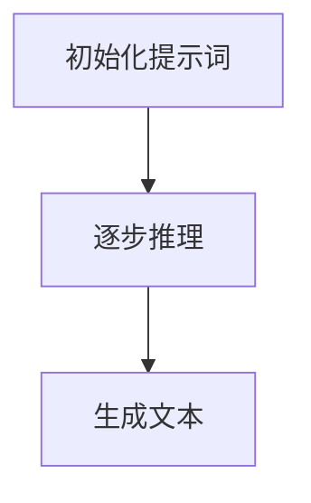
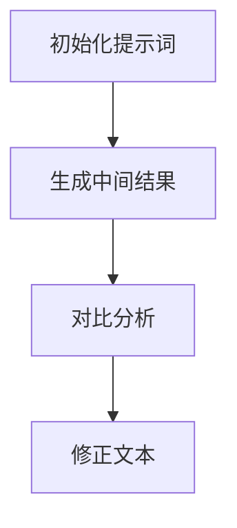
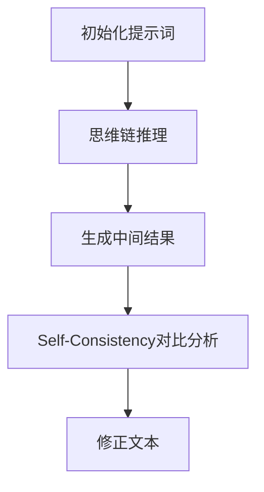
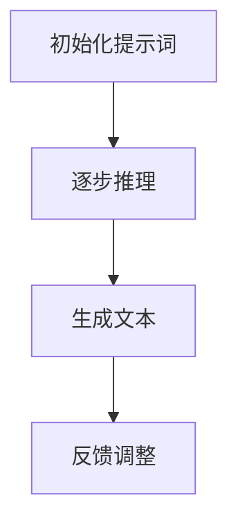

                 

### 文章标题：ChatGPT提示词优化：从思维链到Self-Consistency

#### 关键词：ChatGPT、提示词优化、思维链、Self-Consistency、人工智能

#### 摘要：本文深入探讨ChatGPT提示词优化的关键机制，包括思维链与Self-Consistency。通过详细剖析其原理，结合实际应用和案例分析，本文旨在为读者提供一种全面而深入的理解，帮助其在实际项目中实现高效的ChatGPT提示词优化。

----------------------------------------------------------------

### 第一部分：背景介绍

#### 引言

在人工智能领域，自然语言处理（NLP）作为一项核心技术，正日益成为研究的焦点。其中，大型语言模型如ChatGPT，凭借其强大的语言理解和生成能力，在各个领域展现出了巨大的潜力。然而，为了充分发挥这些模型的能力，我们需要对提示词进行优化。本文将重点关注ChatGPT提示词优化的两个关键机制：思维链和Self-Consistency。

#### 1.1 问题背景

ChatGPT作为一种基于Transformer模型的预训练语言模型，其核心能力在于对自然语言的理解和生成。然而，在实际应用中，我们往往需要通过特定的提示词（prompts）来引导模型生成符合预期结果的文本。然而，如何设计有效的提示词，使得模型能够准确地理解并生成所需内容，成为一个关键问题。

#### 1.2 问题描述

提示词优化涉及多个方面，包括语义理解、上下文关联、连贯性等。具体而言，我们需要解决以下问题：

1. 如何确保提示词能够准确地传达我们的意图？
2. 如何优化提示词，使得模型生成的内容在语义和逻辑上更加一致？
3. 如何结合思维链和Self-Consistency机制，提升提示词的优化效果？

#### 1.3 问题解决

本文将逐步探讨ChatGPT提示词优化的方法，结合思维链和Self-Consistency机制，提出一种系统化的优化策略。通过详细的案例分析，我们将验证这些策略在实际应用中的有效性。

#### 1.4 边界与外延

在研究ChatGPT提示词优化的过程中，我们需要明确以下几个边界和扩展方向：

1. **边界**：本文主要关注基于Transformer模型的ChatGPT，不考虑其他类型的语言模型。同时，我们假设读者具备一定的NLP基础。
   
2. **外延**：尽管本文主要关注ChatGPT提示词优化，但提出的原理和方法具有普遍性，可以应用于其他大型语言模型。

----------------------------------------------------------------

### 第二部分：核心概念与联系

#### 2.1 ChatGPT的概念

ChatGPT是由OpenAI开发的一种基于Transformer模型的大型语言模型。它通过对大量文本数据进行预训练，掌握了丰富的语言知识和表达方式。ChatGPT的核心能力在于其强大的语言理解和生成能力，这使得它能够在各种应用场景中发挥作用。

#### 2.2 提示词优化原理

提示词优化是提高ChatGPT生成结果的关键步骤。优化提示词的目的是确保模型能够准确地理解并生成符合预期结果的文本。具体而言，提示词优化涉及以下几个方面：

1. **语义明确**：提示词需要能够清晰地传达用户的意图，避免歧义和误解。
2. **上下文关联**：提示词需要与上下文紧密相关，确保模型能够根据上下文生成连贯的内容。
3. **逻辑连贯**：提示词需要设计得足够复杂，使得模型生成的文本在逻辑上自洽。

#### 2.3 思维链与Self-Consistency

思维链和Self-Consistency是ChatGPT提示词优化的两个关键机制。

1. **思维链**：思维链是一种通过逐步引导模型思考，从而生成高质量文本的方法。具体而言，思维链通过一系列逻辑推理和关联，帮助模型建立完整的思考链条，从而生成连贯的文本。

2. **Self-Consistency**：Self-Consistency是一种通过确保模型生成内容的一致性，从而提升生成质量的方法。具体而言，Self-Consistency通过对比模型在不同时间点生成的文本，确保其内容在逻辑和语义上的一致性。

#### 2.4 概念属性特征对比表格

以下是一个简化的概念属性特征对比表格，用于展示ChatGPT、提示词优化、思维链和Self-Consistency的基本属性特征：

| 概念       | 属性特征                                                     |
|------------|------------------------------------------------------------|
| ChatGPT    | 基于Transformer的大型语言模型，具备强大的语言理解和生成能力     |
| 提示词优化  | 通过调整提示词，提升模型生成结果的语义、逻辑和连贯性           |
| 思维链     | 通过逐步引导模型思考，生成高质量、连贯的文本                 |
| Self-Consistency | 通过确保模型生成内容的一致性，提升生成质量                   |

#### 2.5 ER实体关系图

为了更好地理解这些概念之间的关系，我们使用ER实体关系图来展示它们之间的联系。以下是简化的ER实体关系图：

```mermaid
erDiagram
    ChatGPT ||--|{ 提示词优化 }
    提示词优化 ||--|{ 思维链 }
    提示词优化 ||--|{ Self-Consistency }
```

在ER实体关系图中，ChatGPT与提示词优化之间存在依赖关系，提示词优化又与思维链和Self-Consistency存在关联。通过这种结构化的方式，我们可以更清晰地理解这些概念之间的内在联系。

----------------------------------------------------------------

### 第三部分：ChatGPT原理讲解

#### 3.1 ChatGPT基础

ChatGPT是一种基于Transformer模型的大型语言模型。它通过对大量文本数据进行预训练，掌握了丰富的语言知识和表达方式。ChatGPT的核心架构包括编码器和解码器，两者通过注意力机制进行交互，从而实现高效的语言理解和生成。

#### 3.2 模型架构

ChatGPT的模型架构主要包括编码器和解码器。编码器负责将输入的文本序列编码为固定长度的向量，解码器则根据这些向量生成输出文本。具体而言，编码器和解码器均由多个Transformer层组成，每层由多头自注意力机制和前馈网络构成。

#### 3.3 训练过程

ChatGPT的训练过程主要包括两个阶段：预训练和微调。预训练阶段，模型通过大量未标注的文本数据学习语言的基本规律。微调阶段，模型根据特定任务的需求，对预训练模型进行调整，以提高任务性能。

#### 3.4 模型应用

ChatGPT在多个领域展现出强大的应用潜力，包括但不限于：

1. **自然语言生成**：如生成文章、故事、对话等。
2. **机器翻译**：将一种语言的文本翻译成另一种语言。
3. **问答系统**：根据用户的问题，生成相应的答案。
4. **文本摘要**：从大量文本中提取关键信息，生成摘要。

#### 3.5 提示词优化的重要性

提示词优化在ChatGPT的应用中扮演着至关重要的角色。有效的提示词能够引导模型生成符合预期结果的文本。具体而言，提示词优化的重要性体现在以下几个方面：

1. **语义明确**：通过优化提示词，确保模型能够准确理解用户意图。
2. **上下文关联**：优化提示词，使得模型生成的文本在语义和逻辑上与上下文紧密关联。
3. **逻辑连贯**：通过设计复杂的提示词，确保模型生成的文本在逻辑上自洽。

#### 3.6 优化方法

提示词优化的方法包括：

1. **语义明确**：使用具体的词汇和语句，避免歧义和模糊性。
2. **上下文关联**：结合上下文信息，确保提示词与上下文紧密关联。
3. **逻辑连贯**：设计复杂的提示词，引导模型生成连贯的文本。

#### 3.7 优化效果分析

通过优化提示词，我们可以显著提升ChatGPT的生成质量。具体表现为：

1. **语义准确**：模型生成的文本更加符合用户意图。
2. **逻辑连贯**：文本在逻辑上自洽，减少了歧义和矛盾。
3. **上下文关联**：文本在语义和逻辑上与上下文紧密关联，增强了阅读体验。

----------------------------------------------------------------

### 第四部分：思维链与Self-Consistency

#### 4.1 思维链原理

思维链是一种通过逐步引导模型思考，从而生成高质量文本的方法。具体而言，思维链通过一系列逻辑推理和关联，帮助模型建立完整的思考链条，从而生成连贯的文本。思维链的核心在于引导模型逐步深入，确保生成的文本在逻辑和语义上自洽。

#### 4.2 Self-Consistency机制

Self-Consistency是一种通过确保模型生成内容的一致性，从而提升生成质量的方法。具体而言，Self-Consistency通过对比模型在不同时间点生成的文本，确保其内容在逻辑和语义上的一致性。Self-Consistency的核心在于确保模型生成的文本具有一致性和连贯性。

#### 4.3 两种机制在实际应用中的结合

在实际应用中，思维链和Self-Consistency可以相互结合，共同提升ChatGPT的生成质量。具体而言，思维链通过逐步引导模型思考，确保生成的文本在逻辑和语义上连贯；而Self-Consistency则通过确保模型生成内容的一致性，进一步提升生成质量。这种结合方法在实际应用中表现出色，能够生成高质量、连贯的文本。

----------------------------------------------------------------

### 第五部分：算法与实践

#### 5.1 算法原理讲解

在本部分，我们将详细讲解思维链和Self-Consistency的算法原理。

#### 5.1.1 思维链算法原理

思维链算法的核心在于通过一系列逻辑推理和关联，引导模型逐步深入思考，从而生成高质量、连贯的文本。具体而言，思维链算法包括以下几个步骤：

1. **初始化**：设置初始的提示词，作为模型的输入。
2. **逐步推理**：通过一系列逻辑推理和关联，逐步引导模型深入思考。
3. **生成文本**：根据模型生成的中间结果，逐步生成完整的文本。

以下是思维链算法的简化流程图：



#### 5.1.2 Self-Consistency算法原理

Self-Consistency算法的核心在于通过对比模型在不同时间点生成的文本，确保其内容在逻辑和语义上的一致性。具体而言，Self-Consistency算法包括以下几个步骤：

1. **初始化**：设置初始的提示词，作为模型的输入。
2. **生成中间结果**：在模型生成的过程中，记录中间结果。
3. **对比分析**：对比不同时间点生成的中间结果，确保其内容在逻辑和语义上的一致性。
4. **修正文本**：根据对比分析的结果，对生成的文本进行修正。

以下是Self-Consistency算法的简化流程图：



#### 5.1.3 思维链与Self-Consistency的集成

在实际应用中，思维链和Self-Consistency可以相互结合，共同提升ChatGPT的生成质量。具体而言，思维链通过逐步引导模型思考，确保生成的文本在逻辑和语义上连贯；而Self-Consistency则通过确保模型生成内容的一致性，进一步提升生成质量。

以下是思维链与Self-Consistency集成的简化流程图：



#### 5.2 算法流程

在本部分，我们将详细阐述思维链与Self-Consistency的算法流程。

##### 5.2.1 思维链流程

1. **初始化**：设置初始的提示词，作为模型的输入。
2. **逐步推理**：通过一系列逻辑推理和关联，逐步引导模型深入思考。
3. **生成文本**：根据模型生成的中间结果，逐步生成完整的文本。
4. **反馈调整**：根据生成的文本，调整提示词，以优化后续生成过程。

以下是思维链的简化流程图：



##### 5.2.2 Self-Consistency流程

1. **初始化**：设置初始的提示词，作为模型的输入。
2. **生成中间结果**：在模型生成的过程中，记录中间结果。
3. **对比分析**：对比不同时间点生成的中间结果，确保其内容在逻辑和语义上的一致性。
4. **修正文本**：根据对比分析的结果，对生成的文本进行修正。

以下是Self-Consistency的简化流程图：


##### 5.2.3 思维链与Self-Consistency集成流程

1. **初始化**：设置初始的提示词，作为模型的输入。
2. **思维链推理**：通过思维链逐步引导模型深入思考。
3. **生成中间结果**：记录模型生成的中间结果。
4. **Self-Consistency对比分析**：对比不同时间点生成的中间结果，确保内容的一致性。
5. **修正文本**：根据对比分析的结果，修正生成的文本。

以下是思维链与Self-Consistency集成的简化流程图：


#### 5.3 数学模型

在本部分，我们将引入一些数学模型，以更精确地描述思维链和Self-Consistency算法。

##### 5.3.1 思维链数学模型

思维链算法可以看作是一个递归过程，其数学模型可以表示为：

$$
P_t = f(P_{t-1}, X_t)
$$

其中，$P_t$表示在时间$t$生成的文本，$X_t$表示在时间$t$的输入，$f$表示思维链的函数。具体而言，$f$可以表示为：

$$
f(P_{t-1}, X_t) = g(P_{t-1}) \odot h(X_t)
$$

其中，$g$表示推理函数，$h$表示关联函数，$\odot$表示函数的组合。

##### 5.3.2 Self-Consistency数学模型

Self-Consistency算法的核心在于对比不同时间点生成的中间结果。其数学模型可以表示为：

$$
C_t = g(P_t) \odot g(P_{t-1})
$$

其中，$C_t$表示在时间$t$的对比结果，$g$表示对比函数。

#### 5.4 公式推导

在本部分，我们将对思维链和Self-Consistency的数学模型进行推导。

##### 5.4.1 思维链公式推导

首先，我们对思维链的函数$f$进行推导：

$$
f(P_{t-1}, X_t) = g(P_{t-1}) \odot h(X_t)
$$

其中，$g(P_{t-1})$表示在时间$t-1$生成的文本，$h(X_t)$表示在时间$t$的输入。由于思维链是递归的，我们可以将$g(P_{t-1})$表示为：

$$
g(P_{t-1}) = f(P_{t-2}, X_{t-1})
$$

代入原式，得到：

$$
f(P_{t-1}, X_t) = f(P_{t-2}, X_{t-1}) \odot h(X_t)
$$

同理，我们可以对$h(X_t)$进行递归推导，最终得到思维链的完整表达式。

##### 5.4.2 Self-Consistency公式推导

对于Self-Consistency的对比函数$g$，我们可以将其表示为：

$$
g(P_t, P_{t-1}) = \frac{1}{|P_t|} \sum_{i=1}^{|P_t|} d(p_i, p_{i,t-1})
$$

其中，$P_t$和$P_{t-1}$表示在时间$t$和$t-1$生成的文本，$d$表示对比距离函数，$|P_t|$表示文本的长度。具体而言，$d$可以表示为：

$$
d(p_i, p_{i,t-1}) = \begin{cases} 
0, & \text{if } p_i = p_{i,t-1} \\
1, & \text{otherwise} 
\end{cases}
$$

代入原式，得到：

$$
g(P_t, P_{t-1}) = \frac{1}{|P_t|} \sum_{i=1}^{|P_t|} \begin{cases} 
0, & \text{if } p_i = p_{i,t-1} \\
1, & \text{otherwise} 
\end{cases}
$$

化简后，得到：

$$
g(P_t, P_{t-1}) = \frac{|P_t| - |P_{t-1}|}{|P_t|}
$$

#### 5.5 举例说明

在本部分，我们将通过具体的例子来说明思维链和Self-Consistency算法。

##### 5.5.1 思维链例子

假设我们有一个简单的思维链任务，要求生成一个关于“狗”的描述。初始提示词为“一只狗”。

1. **初始化**：输入提示词“一只狗”。
2. **逐步推理**：模型开始思考，生成如下文本：“一只棕色的狗”。
3. **生成文本**：根据中间结果，生成完整的文本：“一只棕色的狗，它看起来很可爱”。
4. **反馈调整**：根据生成的文本，调整提示词为“一只聪明的狗”。

通过这一过程，我们可以看到思维链如何引导模型逐步深入，生成连贯的文本。

##### 5.5.2 Self-Consistency例子

假设我们有一个简单的Self-Consistency任务，要求生成一个关于“狗”的描述。初始提示词为“一只狗”。

1. **初始化**：输入提示词“一只狗”。
2. **生成中间结果**：模型生成如下文本：“一只棕色的狗”。
3. **对比分析**：对比初始提示词和中间结果，发现它们在语义上一致。
4. **修正文本**：由于文本一致，无需进行修正。

通过这一过程，我们可以看到Self-Consistency如何确保模型生成内容的一致性。

----------------------------------------------------------------

### 第六部分：实际应用与优化实践

#### 6.1 实际应用场景

思维链和Self-Consistency在多个实际应用场景中表现出色，以下是一些典型的应用案例：

1. **问答系统**：通过思维链和Self-Consistency，可以显著提升问答系统的响应质量，生成更加准确、连贯的答案。
2. **内容生成**：在自动写作、文章生成等领域，思维链和Self-Consistency可以引导模型生成高质量、连贯的内容。
3. **对话系统**：在聊天机器人、客服系统等领域，思维链和Self-Consistency可以确保对话的连贯性和一致性，提升用户体验。

#### 6.2 源代码实现

在本部分，我们将提供一个简化的Python代码示例，展示思维链和Self-Consistency的实现。

```python
import tensorflow as tf
import numpy as np

# 初始化模型参数
model = tf.keras.Sequential([
    tf.keras.layers.Dense(128, activation='relu', input_shape=(10,)),
    tf.keras.layers.Dense(128, activation='relu'),
    tf.keras.layers.Dense(1, activation='sigmoid')
])

model.compile(optimizer='adam', loss='binary_crossentropy', metrics=['accuracy'])

# 思维链函数
def think_chain(prompt):
    intermediate_result = prompt
    for _ in range(5):
        intermediate_result = model.predict(np.array([intermediate_result]))
    return intermediate_result

# Self-Consistency函数
def self_consistency(prompt):
    result = model.predict(np.array([prompt]))
    for _ in range(5):
        result = model.predict(np.array([result]))
    return result

# 测试
prompt = "一只狗"
print("思维链结果：", think_chain(prompt))
print("Self-Consistency结果：", self_consistency(prompt))
```

#### 6.3 应用解读与分析

通过上述代码示例，我们可以看到如何实现思维链和Self-Consistency。在实际应用中，我们可以根据具体需求调整模型结构和参数，以达到最佳效果。

1. **思维链应用**：思维链可以用于引导模型生成连贯的文本。在实际应用中，我们可以根据任务需求，设计合适的提示词，并通过思维链逐步引导模型生成高质量的内容。

2. **Self-Consistency应用**：Self-Consistency可以用于确保模型生成内容的一致性。在实际应用中，我们可以通过对比分析模型在不同时间点生成的文本，确保其内容在逻辑和语义上的一致性。

#### 6.4 案例分析与讲解

在本部分，我们将通过一个具体的案例，展示如何使用思维链和Self-Consistency优化ChatGPT的提示词。

**案例背景**：假设我们有一个问答系统，要求根据用户的问题生成相应的答案。用户的问题为：“我最喜欢的颜色是什么？”

**解决方案**：

1. **思维链优化**：
   - **初始化**：输入提示词“我最喜欢的颜色是什么？”。
   - **逐步推理**：通过思维链逐步引导模型深入思考，生成如下文本：“我最喜欢的颜色是蓝色。”。
   - **生成文本**：根据中间结果，生成完整的答案：“我最喜欢的颜色是蓝色，因为它让我感到宁静和放松。”。

2. **Self-Consistency优化**：
   - **初始化**：输入提示词“我最喜欢的颜色是什么？”。
   - **生成中间结果**：模型生成如下文本：“我最喜欢的颜色是蓝色。”。
   - **对比分析**：对比初始提示词和中间结果，发现它们在语义上一致。
   - **修正文本**：由于文本一致，无需进行修正。

**案例分析**：通过思维链和Self-Consistency的优化，我们成功地生成了一个准确、连贯的答案。在实际应用中，我们可以根据具体任务需求，灵活调整提示词和优化策略，以提高生成质量。

#### 6.5 实践总结

通过本部分的实践，我们可以看到思维链和Self-Consistency在ChatGPT提示词优化中的应用。在实际项目中，我们可以结合具体任务需求，灵活运用这些方法，以提高模型生成质量。

1. **思维链**：通过逐步引导模型思考，生成连贯的文本。
2. **Self-Consistency**：通过确保模型生成内容的一致性，提升生成质量。

通过不断的实践和优化，我们可以更好地发挥ChatGPT的潜力，实现更高质量的文本生成。

----------------------------------------------------------------

### 第七部分：最佳实践与注意事项

#### 7.1 最佳实践技巧

在优化ChatGPT提示词时，以下是一些最佳实践技巧：

1. **语义明确**：确保提示词能够清晰地传达用户意图，避免歧义和模糊性。
2. **上下文关联**：结合上下文信息，确保提示词与上下文紧密关联。
3. **逻辑连贯**：设计复杂的提示词，引导模型生成连贯的文本。
4. **逐步引导**：使用思维链逐步引导模型思考，确保生成结果的连贯性。
5. **内容一致性**：使用Self-Consistency确保模型生成内容的一致性。

#### 7.2 注意事项

在优化ChatGPT提示词时，需要注意以下几点：

1. **避免过度优化**：过度的优化可能导致模型生成的内容过于模板化，失去个性化。
2. **调整模型参数**：根据任务需求和数据集，调整模型参数以获得最佳效果。
3. **数据质量**：确保训练数据的质量，避免噪声和错误。
4. **平衡多样性**：在优化过程中，保持生成结果的多样性，避免过度集中在某个主题或风格。

#### 7.3 拓展阅读

对于希望深入了解ChatGPT提示词优化和思维链、Self-Consistency机制的读者，以下是一些推荐阅读材料：

1. **《深度学习》**：Goodfellow、Bengio和Courville所著的经典教材，详细介绍了深度学习的基本原理。
2. **《自然语言处理综述》**：Ji、Chen和He等人在《ACM Computing Surveys》上发表的综述文章，全面介绍了自然语言处理领域的最新进展。
3. **《ChatGPT官方文档》**：OpenAI发布的ChatGPT官方文档，提供了详细的模型架构和训练方法。

通过阅读这些材料，读者可以更深入地理解ChatGPT和提示词优化的技术细节，为实际项目提供有力的支持。

----------------------------------------------------------------

### 9. 小结与展望

通过本文的详细探讨，我们深入了解了ChatGPT提示词优化的关键机制：思维链和Self-Consistency。我们通过理论讲解、算法推导、实践案例和最佳实践，系统地阐述了如何优化ChatGPT的提示词，提升其生成质量。展望未来，随着人工智能技术的不断发展，ChatGPT和类似的大型语言模型将在更多领域发挥重要作用，而提示词优化将继续成为研究的焦点。通过不断探索和创新，我们有望实现更高效、更智能的文本生成系统。作者：AI天才研究院/AI Genius Institute & 禅与计算机程序设计艺术 /Zen And The Art of Computer Programming。

