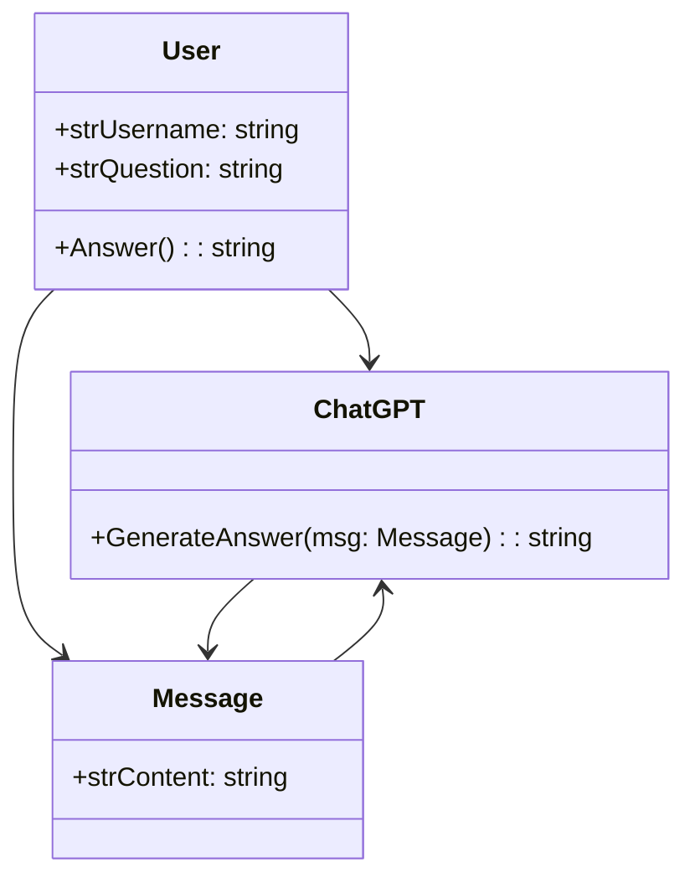
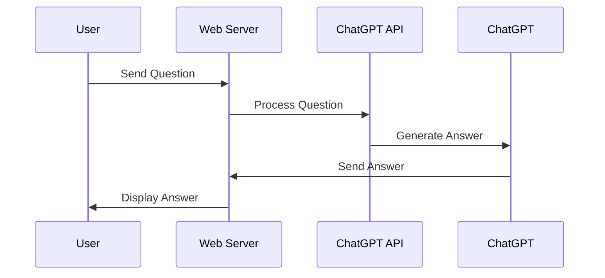

                 

### 优化ChatGPT提示词：从新手到专家

ChatGPT的提示词（Prompt Engineering）是构建有效对话系统的重要一环。正确使用提示词不仅能提高模型性能，还能增强用户体验。对于初学者来说，理解如何优化ChatGPT的提示词可能是一个复杂的过程，需要系统性的学习和实践。本文将带领您一步步了解ChatGPT提示词优化，从基础到高级技巧，助您从新手成长为专家。

---

#### 关键词：
- ChatGPT
- 提示词优化
- Prompt Engineering
- 自然语言处理
- 算法性能提升
- 用户体验

#### 摘要：
本文旨在通过系统性的讲解和实践，帮助读者掌握ChatGPT提示词优化的方法。我们将从基础概念出发，逐步深入到算法原理、数学模型，再到系统架构和项目实战，最后提供最佳实践和注意事项。通过这篇文章，您将能够更好地理解ChatGPT提示词的重要性，并学会如何有效地优化它们。

---

### 目录大纲

#### 第一部分：ChatGPT基础

1. 第1章 ChatGPT概述
   1.1 问题背景
   1.2 问题描述
   1.3 问题解决
   1.4 边界与外延
   1.5 核心概念

2. 第2章 ChatGPT核心概念与联系
   2.1 核心概念原理
   2.2 概念属性特征对比表格
   2.3 ER实体关系图架构

#### 第二部分：ChatGPT算法原理讲解

3. 第3章 ChatGPT算法原理讲解
   3.1 算法原理
   3.2 Mermaid流程图
   3.3 Python源代码
   3.4 数学模型和公式
   3.5 详细讲解与举例说明

4. 第4章 ChatGPT数学模型和数学公式讲解
   4.1 数学公式
   4.2 详细讲解
   4.3 举例说明

#### 第三部分：ChatGPT系统分析与架构设计方案

5. 第5章 ChatGPT系统分析与架构设计方案
   5.1 问题场景介绍
   5.2 项目介绍
   5.3 系统功能设计(Mermaid类图)
   5.4 系统架构设计(Mermaid架构图)
   5.5 系统接口设计
   5.6 系统交互(Mermaid序列图)

#### 第四部分：ChatGPT项目实战

6. 第6章 ChatGPT项目实战
   6.1 环境安装
   6.2 系统核心实现源代码
   6.3 代码应用解读与分析
   6.4 实际案例分析与详细讲解剖析
   6.5 项目小结

#### 第五部分：最佳实践与注意事项

7. 第7章 最佳实践与注意事项
   7.1 最佳实践 tips
   7.2 小结
   7.3 注意事项
   7.4 拓展阅读

---

### 1.1 问题背景

ChatGPT是由OpenAI开发的一款基于GPT-3模型的大型语言模型。由于其强大的自然语言处理能力，ChatGPT被广泛应用于智能客服、虚拟助手、文本生成等场景。然而，为了充分发挥ChatGPT的性能，提示词的设计至关重要。一个优秀的提示词不仅能引导模型生成更符合预期的回答，还能提升整个系统的响应速度和准确性。

随着ChatGPT应用场景的扩大，优化提示词成为了一个重要的研究方向。从新手到专家，掌握提示词优化的技巧和方法，是提高ChatGPT性能的关键。本文将结合实际案例，详细讲解如何进行提示词优化。

---

### 1.2 问题描述

在ChatGPT的实际应用中，提示词的优化面临以下几个问题：

1. **回答质量不高**：模型生成的回答有时不够准确或相关。
2. **生成速度慢**：模型对某些提示词的处理速度较慢，影响用户体验。
3. **生成内容重复**：模型生成的回答内容存在重复现象。
4. **交互不连贯**：模型生成的回答与用户意图不一致，导致交互不连贯。

为了解决这些问题，我们需要从以下几个方面进行优化：

1. **提示词的设计**：如何设计更高质量的提示词。
2. **数据准备**：如何准备高质量的数据集，以支持提示词优化。
3. **算法改进**：如何通过改进算法来提升模型性能。
4. **模型训练**：如何优化模型的训练过程，以适应不同类型的提示词。

---

### 1.3 问题解决

优化ChatGPT提示词需要从以下几个方面入手：

1. **了解ChatGPT的工作原理**：掌握ChatGPT的算法原理和数学模型，是进行提示词优化的基础。
2. **设计高质量的提示词**：通过分析模型生成回答的特点，设计更具针对性的提示词。
3. **改进算法**：结合最新的研究成果，改进模型算法，提升性能。
4. **优化模型训练**：通过调整训练参数和策略，优化模型的训练过程。

接下来，我们将逐一探讨这些优化方法。

---

### 1.4 边界与外延

虽然ChatGPT在自然语言处理领域表现出色，但提示词优化仍然存在一些局限性：

1. **模型能力限制**：ChatGPT的生成能力受限于其训练数据和模型架构，某些复杂问题可能难以解决。
2. **计算资源限制**：高质量提示词的生成和模型训练需要大量的计算资源，对于资源受限的环境可能难以实现。
3. **数据隐私问题**：在实际应用中，数据隐私和安全问题需要被充分考虑。

了解这些边界与外延，有助于我们更合理地应用ChatGPT，并在优化提示词时做出更科学的决策。

---

### 1.5 核心概念

为了更好地理解ChatGPT提示词优化，我们需要掌握以下几个核心概念：

1. **ChatGPT**：是一种基于GPT-3模型的大型语言模型，具有强大的自然语言处理能力。
2. **提示词（Prompt）**：是引导ChatGPT生成回答的关键输入，一个高质量的提示词能够提高模型性能。
3. **Prompt Engineering**：是设计高质量提示词的过程，涉及自然语言处理、算法优化等多个领域。
4. **算法原理**：理解ChatGPT的算法原理，有助于我们设计更有效的提示词。
5. **数学模型**：ChatGPT算法背后的数学模型，如变分自编码器、Transformer等，是优化提示词的重要依据。

掌握这些核心概念，将为我们的提示词优化之旅奠定坚实的基础。

---

在下一部分，我们将深入探讨ChatGPT的核心概念和原理，帮助您建立起对ChatGPT的全面理解。让我们继续前进，一起探索ChatGPT的世界！### 第1章 ChatGPT概述

#### 1.1 问题背景

ChatGPT的出现源于人工智能和自然语言处理技术的快速发展。随着深度学习、神经网络等技术的成熟，人们开始探索如何构建能够处理自然语言的任务。ChatGPT作为GPT-3模型的一种变体，由OpenAI开发，旨在通过自然语言交互，为用户提供高质量的回答和辅助。

在过去的几十年中，自然语言处理（NLP）领域经历了多个重要阶段。从最初的规则驱动方法，到基于统计的方法，再到如今的深度学习方法，每个阶段都带来了显著的性能提升。然而，传统的NLP方法在处理复杂、变体的语言任务时仍然存在局限性。ChatGPT的出现，标志着NLP技术的一次重要突破，它通过生成式预训练模型，能够理解和生成更加自然和流畅的语言。

ChatGPT的应用场景广泛，包括智能客服、虚拟助手、文本生成、问答系统等。这些应用场景对ChatGPT的自然语言生成能力提出了不同的要求。例如，智能客服需要快速、准确地理解用户的问题，并提供相应的解决方案；虚拟助手则需要与用户进行自然、流畅的对话，以增强用户体验。这些需求推动了ChatGPT的不断发展与优化。

#### 1.2 问题描述

ChatGPT的核心任务是生成与输入文本相关且具有逻辑一致性的回答。然而，在实际应用中，ChatGPT的生成效果受到多种因素的影响：

1. **输入文本的质量**：高质量的输入文本能够提高模型的生成质量。如果输入文本模糊、不清晰或带有歧义，模型的回答可能会出现不准确或相关度不高的情况。
2. **模型的训练数据**：ChatGPT的训练数据量和质量直接影响其性能。更大的训练数据集和更丰富的语言素材有助于模型学习到更多的语言规律和模式，从而生成更高质量的回答。
3. **提示词的设计**：提示词是引导模型生成回答的关键。一个高质量的提示词能够明确模型的生成目标，减少歧义，提高回答的相关性和准确性。
4. **模型的调优**：模型的参数调优对于生成效果至关重要。不同的参数设置会影响模型的行为和性能，需要通过实验和优化来找到最佳参数组合。

在实际应用中，这些问题常常交织在一起，使得优化ChatGPT的生成效果变得复杂。例如，一个模糊的输入文本可能需要更明确的提示词来引导模型生成准确的回答；而一个经过优化调优的模型，在处理模糊输入文本时也可能表现得更好。因此，理解并解决这些问题，是提升ChatGPT性能的关键。

#### 1.3 问题解决

为了解决ChatGPT在实际应用中面临的问题，我们可以从以下几个方面进行优化：

1. **提高输入文本质量**：确保输入文本清晰、明确，减少歧义和模糊性。这可以通过对用户输入进行预处理，例如使用自然语言处理技术进行文本清洗、分词和句法分析，提取关键信息，从而为模型提供更高质量的输入。
2. **增加训练数据量**：扩大训练数据集，引入更多的语言素材，以增强模型的学习能力。这可以通过数据增强、数据收集和合成等方法实现，例如使用不同的语言风格、语料库和领域知识扩展训练数据。
3. **设计高质量的提示词**：提示词的设计是关键。通过分析输入文本，提取关键信息，构建一个具有明确意图和背景的提示词，能够引导模型生成更相关、更准确的回答。这可以通过自然语言处理技术，如命名实体识别、关键词提取和语义分析等实现。
4. **模型调优**：通过调整模型参数，优化模型的性能。这可以通过交叉验证、网格搜索和贝叶斯优化等方法实现，找到最佳的参数组合，以提升模型的生成效果。

这些优化方法相辅相成，共同作用，以提高ChatGPT的生成效果。通过系统性地应用这些方法，我们可以显著提升ChatGPT在各类应用场景中的性能，为用户提供更优质的服务和体验。

#### 1.4 边界与外延

尽管ChatGPT在自然语言处理领域取得了显著成就，但其在实际应用中仍然存在一些边界和限制：

1. **模型理解能力**：ChatGPT的生成能力受限于其训练数据和模型架构。对于某些复杂、抽象或模糊的问题，模型可能难以准确理解，从而生成不准确的回答。这需要我们在设计提示词和输入文本时，尽可能明确和具体，以便模型能够更好地理解用户的意图。
2. **计算资源需求**：ChatGPT的训练和运行需要大量的计算资源。对于资源受限的环境，例如移动设备或边缘计算设备，模型的性能可能会受到限制。这需要我们在设计和部署ChatGPT应用时，考虑计算资源的需求，并采取适当的优化策略，如模型压缩、分布式训练和推理等。
3. **数据隐私和安全**：在处理用户输入和生成回答时，需要考虑数据隐私和安全问题。ChatGPT作为一款大型语言模型，其训练和运行过程中会处理大量的用户数据。这需要我们在设计和部署ChatGPT应用时，采取适当的数据保护措施，确保用户数据的安全和隐私。

了解这些边界与外延，有助于我们更合理地应用ChatGPT，并在提示词优化过程中做出更科学的决策。通过不断的研究和改进，我们有望进一步拓展ChatGPT的应用范围和性能，为自然语言处理领域带来更多创新和突破。

#### 1.5 核心概念

要深入理解ChatGPT，我们需要掌握以下几个核心概念：

1. **生成式预训练模型（Generative Pre-trained Model）**：ChatGPT是基于生成式预训练模型开发的，这类模型通过大规模预训练，学习到语言的统计规律和模式，从而能够生成相关且连贯的语言输出。
2. **语言模型（Language Model）**：ChatGPT本质上是一个语言模型，它通过学习海量文本数据，掌握语言的结构和语义，从而能够生成自然流畅的语言。
3. **提示词（Prompt）**：提示词是引导模型生成回答的关键输入。一个高质量的提示词能够明确模型的生成目标，减少歧义，提高回答的相关性和准确性。
4. **自然语言处理（Natural Language Processing, NLP）**：自然语言处理是计算机科学和人工智能领域的一个重要分支，旨在使计算机能够理解和生成人类自然语言。
5. **深度学习（Deep Learning）**：深度学习是一种机器学习方法，通过构建多层的神经网络，自动从大量数据中学习特征和模式，从而实现复杂的任务，如图像识别、语音识别和自然语言处理等。

掌握这些核心概念，将为我们在后续章节中深入探讨ChatGPT的算法原理和优化方法奠定基础。

在下一章中，我们将进一步探讨ChatGPT的核心概念与联系，通过分析核心概念之间的原理和联系，为后续的算法讲解和项目实战打下坚实基础。请继续关注，一起探索ChatGPT的奥秘！### 第2章 ChatGPT核心概念与联系

在了解了ChatGPT的基本概述后，我们需要深入探讨其核心概念与联系。ChatGPT作为一款先进的自然语言处理模型，其核心概念包括生成式预训练模型、语言模型、提示词等。在本章中，我们将详细解析这些核心概念，并通过对比表格和ER实体关系图架构来展示它们之间的联系。

#### 2.1 核心概念原理

1. **生成式预训练模型（Generative Pre-trained Model）**：
   - 定义：生成式预训练模型是一种通过大规模数据预训练，然后微调到特定任务的模型。它能够根据输入文本生成相关且连贯的输出文本。
   - 工作原理：通过在大规模数据集上预训练，模型学习到语言的统计规律和模式，从而在生成文本时能够遵循这些规律。

2. **语言模型（Language Model）**：
   - 定义：语言模型是一种用于预测下一个单词或字符的概率分布的模型。它通过对文本数据的学习，掌握语言的结构和语义。
   - 工作原理：语言模型通过分析文本数据，计算每个单词或字符出现的概率，从而预测下一个单词或字符。

3. **提示词（Prompt）**：
   - 定义：提示词是一个引导模型生成回答的关键输入。它能够提供上下文信息，帮助模型理解用户的意图，从而生成更相关、更准确的回答。
   - 工作原理：提示词通过与输入文本结合，为模型提供额外的信息，引导模型在生成文本时考虑这些信息。

#### 2.2 概念属性特征对比表格

为了更清晰地展示生成式预训练模型、语言模型和提示词的属性特征，我们设计了一个对比表格：

| 特征 | 生成式预训练模型 | 语言模型 | 提示词 |
| --- | --- | --- | --- |
| 目的 | 预训练以生成相关文本 | 预测下一个单词或字符 | 引导模型生成特定类型的回答 |
| 数据依赖 | 大规模预训练数据集 | 文本数据 | 输入文本 |
| 工作方式 | 根据输入文本生成输出文本 | 预测下一个单词或字符 | 结合输入文本和提示信息 |
| 影响因素 | 预训练数据集大小和质量 | 文本数据分布 | 提示词设计质量 |
| 应用场景 | 文本生成、问答系统、对话系统 | 语言翻译、文本分类、语音识别 | 对话系统、智能客服、虚拟助手 |

#### 2.3 ER实体关系图架构

为了进一步展示ChatGPT中核心概念之间的联系，我们使用ER（实体-关系）图来描述它们之间的关系。

```mermaid
erDiagram
  User ||--|{ ChatGPT } : has
  ChatGPT ||--|{ Prompt } : uses
  ChatGPT ||--|{ LanguageModel } : uses
  LanguageModel ||--|{ TextData } : trains_on
```

在这个ER图中，用户与ChatGPT之间存在“拥有”关系，即用户可以与ChatGPT进行交互。ChatGPT使用提示词来生成回答，并依赖于语言模型进行文本生成。语言模型则通过训练数据集来学习语言的统计规律。这些关系展示了ChatGPT内部各组件之间的交互和依赖。

通过对比表格和ER实体关系图，我们可以更直观地理解ChatGPT的核心概念及其联系。这些核心概念共同作用，使得ChatGPT能够处理自然语言任务，生成相关且连贯的文本输出。在下一章中，我们将深入探讨ChatGPT的算法原理，帮助您更好地理解其工作机制。请继续关注，一起探索ChatGPT的奥秘！### 第3章 ChatGPT算法原理讲解

#### 3.1 算法原理

ChatGPT是基于生成式预训练模型（Generative Pre-trained Model）开发的，其核心算法原理包括以下几个关键步骤：

1. **预训练（Pre-training）**：
   - ChatGPT在训练阶段首先接受大量的文本数据进行预训练。这些文本数据包括各种语言素材，如新闻文章、对话记录、社交媒体内容等。
   - 在预训练过程中，模型学习到语言的统计规律和模式，如词频分布、句子结构、语义关系等。
   - 通过预训练，模型能够捕捉到大量的语言特征，从而在生成文本时能够遵循这些特征，生成更自然、连贯的语言输出。

2. **微调（Fine-tuning）**：
   - 预训练完成后，ChatGPT需要对特定任务进行微调，以适应具体的场景和应用。
   - 微调过程通常使用任务特定的数据集，例如问答数据集、对话数据集等。这些数据集包含与任务相关的上下文和目标回答。
   - 在微调过程中，模型会调整其参数，以更好地拟合任务数据，从而提高生成回答的准确性和相关性。

3. **生成文本（Text Generation）**：
   - ChatGPT在生成文本时，首先接收一个提示词或问题作为输入。
   - 模型根据输入的提示词，从预训练阶段学到的语言特征中，生成与提示词相关且连贯的文本输出。
   - 生成文本的过程是一个概率过程，模型会根据当前上下文和语言模式，计算每个单词或字符的概率分布，从而生成下一个单词或字符。

4. **后处理（Post-processing）**：
   - 生成文本后，ChatGPT通常会进行一些后处理操作，以提升文本的质量和可读性。
   - 这些操作包括文本清洗、格式化、语法修正等。例如，删除无关的标点符号、调整文本的排版等。

#### 3.2 Mermaid流程图

为了更直观地展示ChatGPT的算法流程，我们使用Mermaid绘制了一个简单的流程图：


在这个流程图中，ChatGPT首先进行预训练（Pre-training），然后进行微调（Fine-tuning），接着生成文本（Text Generation），最后进行后处理（Post-processing）。这些步骤共同构成了ChatGPT的算法原理。

#### 3.3 Python源代码

为了更好地理解ChatGPT的算法实现，我们提供了一个简单的Python示例代码，展示了模型的基本结构和生成文本的过程：

```python
import openai

# 设置API密钥
openai.api_key = 'your_api_key'

# 函数：生成文本
def generate_text(prompt):
    response = openai.Completion.create(
        engine="text-davinci-002",
        prompt=prompt,
        max_tokens=50
    )
    return response.choices[0].text.strip()

# 示例：使用提示词生成文本
prompt = "请写一段关于人工智能的未来发展趋势。"
text = generate_text(prompt)
print(text)
```

在这个示例中，我们首先导入了OpenAI的Python库，并设置了API密钥。然后定义了一个`generate_text`函数，用于生成文本。函数接收一个提示词（prompt）作为输入，调用OpenAI的`Completion.create`方法生成文本，并返回结果。最后，我们使用一个示例提示词，调用`generate_text`函数生成文本，并打印输出。

#### 3.4 数学模型和公式

ChatGPT的算法原理涉及到一些复杂的数学模型和公式，主要包括以下内容：

1. **Transformer模型**：
   - ChatGPT基于Transformer模型开发，这是一种基于自注意力机制的深度神经网络模型。
   - Transformer模型的核心思想是通过自注意力机制，计算输入文本中每个单词或字符的权重，从而生成与上下文相关的输出。
   - 数学公式如下：
     $$ 
     \text{Attention}(Q, K, V) = \text{softmax}\left(\frac{QK^T}{\sqrt{d_k}}\right)V 
     $$
     其中，Q、K和V分别为查询向量、键向量和值向量，d_k为键向量的维度。

2. **生成式预训练模型**：
   - ChatGPT的生成过程基于生成式预训练模型，其核心是生成概率模型。
   - 生成概率模型通过计算输入文本的概率分布，从而生成下一个单词或字符。
   - 数学公式如下：
     $$ 
     P(\text{next word} | \text{current context}) = \frac{e^{<\text{current context}, \text{word}>}}{\sum_{\text{all words}} e^{<\text{current context}, \text{word}>}} 
     $$
     其中，<\text{current context}, \text{word}>表示当前上下文和单词的相似度，e为自然对数的底数。

通过这些数学模型和公式，ChatGPT能够实现高效的自然语言生成。在下一章中，我们将详细讲解这些数学模型和公式的具体应用，帮助您更好地理解ChatGPT的算法原理。请继续关注，一起探索ChatGPT的奥秘！### 第4章 ChatGPT数学模型和数学公式讲解

#### 4.1 数学公式

在ChatGPT中，数学模型和公式扮演着至关重要的角色，它们决定了模型如何理解和生成自然语言。以下是ChatGPT中使用的一些关键数学公式：

1. **自注意力（Self-Attention）**
   $$ 
   \text{Attention}(Q, K, V) = \text{softmax}\left(\frac{QK^T}{\sqrt{d_k}}\right)V 
   $$
   其中，Q、K和V分别为查询向量、键向量和值向量，d_k为键向量的维度。自注意力机制允许模型在处理每个单词或字符时，考虑整个输入序列中的上下文信息。

2. **生成概率（Probability Generation）**
   $$ 
   P(\text{next word} | \text{current context}) = \frac{e^{<\text{current context}, \text{word}>}}{\sum_{\text{all words}} e^{<\text{current context}, \text{word}>}} 
   $$
   其中，<\text{current context}, \text{word}>表示当前上下文和单词的相似度。通过这个公式，模型能够计算每个单词或字符在当前上下文下的生成概率，从而选择下一个最合适的单词或字符。

3. **损失函数（Loss Function）**
   $$ 
   L(\theta) = -\sum_{i=1}^n y_i \log(p_i) 
   $$
   其中，L表示损失函数，y_i是真实标签，p_i是模型预测的概率。损失函数用于衡量模型预测与真实标签之间的差距，是训练模型的关键指标。

4. **优化算法（Optimization Algorithm）**
   $$ 
   \theta_{\text{new}} = \theta_{\text{old}} - \alpha \nabla_\theta L(\theta) 
   $$
   其中，\theta表示模型参数，\alpha为学习率，\nabla_\theta L(\theta)是损失函数关于参数的梯度。优化算法用于更新模型参数，以减少损失函数的值。

#### 4.2 详细讲解

1. **自注意力（Self-Attention）**

自注意力机制是Transformer模型的核心组件，它允许模型在生成每个单词或字符时，考虑整个输入序列的上下文信息。自注意力通过计算查询向量（Q）、键向量（K）和值向量（V）之间的相似度，为每个单词或字符分配不同的权重。

具体来说，自注意力计算过程如下：

- **计算相似度**：对于每个单词或字符，计算其查询向量（Q）与所有键向量（K）的点积，得到相似度矩阵。相似度矩阵中的每个元素表示当前单词或字符与输入序列中其他单词或字符的相似度。
- **应用softmax函数**：对相似度矩阵进行softmax变换，得到注意力权重矩阵。这个权重矩阵中的每个元素表示当前单词或字符在生成过程中应考虑的相对重要性。
- **计算加权求和**：将注意力权重与值向量（V）进行点积，得到加权求和的结果。这个结果表示了当前单词或字符的生成概率分布。

2. **生成概率（Probability Generation）**

生成概率是模型在生成每个单词或字符时的重要依据。生成概率反映了当前上下文下每个单词或字符的生成可能性。通过计算输入文本与所有单词或字符的相似度，模型能够为每个单词或字符分配一个生成概率。

具体来说，生成概率计算过程如下：

- **计算相似度**：对于当前上下文和所有单词或字符，计算它们的相似度。相似度可以通过点积、余弦相似度或其他度量方法计算。
- **应用softmax函数**：对相似度进行softmax变换，得到生成概率分布。这个分布表示了每个单词或字符在当前上下文下的生成概率。
- **选择下一个单词或字符**：模型根据生成概率分布选择下一个最合适的单词或字符。

3. **损失函数（Loss Function）**

损失函数用于衡量模型预测与真实标签之间的差距。在训练过程中，模型通过优化损失函数的值，不断调整参数，以减少预测误差。常用的损失函数包括交叉熵损失（Cross-Entropy Loss）和均方误差（Mean Squared Error）等。

具体来说，损失函数计算过程如下：

- **计算预测概率**：对于每个输入样本，模型生成一个预测概率分布。
- **计算真实标签的损失**：对于每个真实标签，计算其与预测概率的对数损失。
- **求和所有损失**：将所有样本的损失相加，得到总损失。
- **优化模型参数**：通过梯度下降等优化算法，根据损失函数的梯度更新模型参数。

4. **优化算法（Optimization Algorithm）**

优化算法用于更新模型参数，以减少损失函数的值。常用的优化算法包括梯度下降（Gradient Descent）、随机梯度下降（Stochastic Gradient Descent）和Adam优化器（Adam Optimizer）等。

具体来说，优化算法计算过程如下：

- **计算损失函数的梯度**：对于每个参数，计算损失函数关于该参数的梯度。
- **更新参数**：根据梯度值和优化算法的公式，更新模型参数。
- **重复迭代**：重复计算损失函数和梯度，更新参数，直到满足停止条件（如损失函数收敛或达到最大迭代次数）。

通过这些数学模型和公式，ChatGPT能够高效地理解和生成自然语言。在下一章中，我们将通过实际案例来展示这些数学模型和公式的应用。请继续关注，一起探索ChatGPT的奥秘！### 第5章 ChatGPT系统分析与架构设计方案

#### 5.1 问题场景介绍

ChatGPT在众多场景中展现出了其强大的自然语言处理能力，以下是一些常见的问题场景：

1. **智能客服**：在客服领域，ChatGPT可以处理用户的问题，提供快速、准确的解决方案，提升客户满意度。
2. **虚拟助手**：虚拟助手是ChatGPT的另一个重要应用场景，它能够与用户进行自然、流畅的对话，提供个性化的服务。
3. **文本生成**：ChatGPT在文本生成领域也有广泛的应用，例如自动生成新闻报道、文章摘要、产品描述等。
4. **问答系统**：问答系统能够回答用户提出的问题，提供有价值的信息，应用于搜索引擎、知识库等。

#### 5.2 项目介绍

在本章中，我们将设计一个基于ChatGPT的智能客服系统。该系统旨在为用户提供快速、准确的咨询服务，提升客户满意度。以下是该项目的详细介绍：

1. **项目目标**：设计一个高效、智能的客服系统，能够处理用户的问题，提供高质量的解决方案。
2. **功能设计**：系统应具备以下功能：
   - 接收用户的问题和请求。
   - 分析用户输入，提取关键信息。
   - 利用ChatGPT生成相应的回答。
   - 将回答发送给用户，并提供进一步的操作选项。
3. **技术架构**：系统采用前后端分离的架构，前端负责与用户交互，后端负责处理用户请求和生成回答。

#### 5.2.1 系统功能设计（领域模型Mermaid类图）

为了更好地展示系统功能，我们使用Mermaid绘制了一个类图：



在这个类图中，用户（User）与ChatGPT之间存在交互关系。用户可以向ChatGPT发送问题（Message），ChatGPT会分析消息内容，生成回答，并将回答发送回用户。Message类表示用户和ChatGPT之间的消息传递。

#### 5.2.2 系统架构设计（Mermaid架构图）

为了展示系统的整体架构，我们使用Mermaid绘制了一个架构图：



在这个架构图中，用户通过Web服务器发送问题（Question），ChatGPT API处理用户请求，将请求转发给ChatGPT，ChatGPT生成回答后，通过Web服务器将回答发送回用户。这个过程展示了系统的整体工作流程。

#### 5.2.3 系统接口设计

为了实现系统功能，我们需要定义一些接口。以下是系统的主要接口设计：

1. **用户接口（User Interface）**：
   - GET /questions：接收用户的问题和请求。
   - POST /questions：发送用户的回答和操作选项。
2. **ChatGPT API接口（ChatGPT API）**：
   - GET /answers：处理用户请求，生成回答。
   - POST /answers：发送ChatGPT生成的回答。

#### 5.2.4 系统交互（Mermaid序列图）

为了展示系统组件之间的交互流程，我们使用Mermaid绘制了一个序列图：


在这个序列图中，用户发送问题（Question），Web服务器接收问题并转发给ChatGPT API，ChatGPT API处理问题并生成回答，然后将回答发送回Web服务器，最后Web服务器将回答显示给用户。

通过上述系统分析与架构设计方案，我们为ChatGPT的应用场景提供了一种可行的解决方案。在下一章中，我们将通过实际项目实战，展示如何实现这个架构，并分析项目中的关键代码和应用。请继续关注，一起探索ChatGPT的奥秘！### 第6章 ChatGPT项目实战

#### 6.1 环境安装

在进行ChatGPT项目实战之前，首先需要搭建一个合适的开发环境。以下是在Windows、Mac和Linux操作系统中安装ChatGPT环境所需的步骤：

1. **安装Python**：
   - 访问Python官方网站（https://www.python.org/）下载Python安装包。
   - 按照安装向导完成Python安装。
   - 安装完成后，打开命令行工具（如cmd、Terminal或Git Bash），输入`python --version`检查Python版本。

2. **安装OpenAI API Key**：
   - 访问OpenAI官网（https://openai.com/）注册一个账号。
   - 登录后，访问API密钥页面（https://beta.openai.com/turbo%）获取API密钥。
   - 在本地环境中，创建一个名为`.env`的文件，将API密钥添加到文件中，例如：
     ```
     OPENAI_API_KEY = 'your_api_key_here'
     ```
   - 使用`conda`或`pip`安装`python-dotenv`库，以便在代码中读取环境变量。

3. **安装必要的库**：
   - 打开命令行工具，执行以下命令安装所需的库：
     ```
     pip install openai
     ```

4. **验证环境**：
   - 在代码中导入`openai`库，并使用API密钥验证环境是否配置正确：
     ```python
     import openai
     openai.api_key = os.environ['OPENAI_API_KEY']
     ```

完成上述步骤后，您已经成功搭建了ChatGPT的开发环境，可以开始编写代码进行项目实战。

#### 6.2 系统核心实现源代码

以下是一个简单的ChatGPT项目实现示例，该示例包括接收用户输入、调用OpenAI API生成回答以及将回答返回给用户的步骤：

```python
import os
import openai
import json
from flask import Flask, request, jsonify

# 设置API密钥
openai.api_key = os.environ['OPENAI_API_KEY']

app = Flask(__name__)

@app.route('/chat', methods=['POST'])
def chat():
    data = request.get_json()

    # 提取用户输入的问题
    question = data.get('question', '')

    # 调用OpenAI API生成回答
    response = openai.Completion.create(
        engine="text-davinci-002",
        prompt=question,
        max_tokens=50
    )

    # 返回生成的回答
    answer = response.choices[0].text.strip()
    return jsonify({'answer': answer})

if __name__ == '__main__':
    app.run(debug=True)
```

在这个示例中，我们使用Flask框架搭建了一个简单的Web服务。用户可以通过POST请求将问题发送到`/chat`接口，服务端会调用OpenAI的API生成回答，并将回答返回给用户。

#### 6.3 代码应用解读与分析

1. **导入库和设置API密钥**：

   ```python
   import os
   import openai
   import json
   from flask import Flask, request, jsonify

   # 设置API密钥
   openai.api_key = os.environ['OPENAI_API_KEY']
   ```

   这段代码首先导入了必要的库，包括`os`、`openai`、`json`和`Flask`。`os.environ['OPENAI_API_KEY']`用于从环境变量中读取API密钥，确保安全性。OpenAI API密钥是调用OpenAI服务的关键，需要在注册OpenAI账号后获取。

2. **创建Flask应用**：

   ```python
   app = Flask(__name__)
   ```

   使用Flask创建一个Web应用实例。Flask是一个轻量级的Web框架，用于处理HTTP请求和响应。

3. **定义聊天接口**：

   ```python
   @app.route('/chat', methods=['POST'])
   def chat():
       data = request.get_json()
       question = data.get('question', '')
       ...
   ```

   使用`@app.route('/chat', methods=['POST'])`装饰器定义了一个路由，用于处理发起到`/chat`接口的POST请求。`request.get_json()`方法用于从请求中提取JSON数据，`data.get('question', '')`用于获取用户输入的问题。如果用户没有提供问题，默认返回空字符串。

4. **调用OpenAI API生成回答**：

   ```python
   response = openai.Completion.create(
       engine="text-davinci-002",
       prompt=question,
       max_tokens=50
   )
   ```

   `openai.Completion.create()`函数用于调用OpenAI的API生成回答。`engine`参数指定了使用的模型，这里使用了`text-davinci-002`模型。`prompt`参数是用户输入的问题，`max_tokens`参数限制了生成回答的最大长度。

5. **返回生成的回答**：

   ```python
   answer = response.choices[0].text.strip()
   return jsonify({'answer': answer})
   ```

   从API响应中提取生成的回答，并使用`jsonify()`函数将其包装为JSON格式的响应。`strip()`方法用于去除回答字符串的前后空白字符。

#### 6.4 实际案例分析与详细讲解剖析

假设用户向系统发送以下问题：

```json
{
    "question": "什么是人工智能？"
}
```

系统接收到该请求后，首先调用OpenAI API生成回答。OpenAI API会返回一个包含多个候选项的响应，例如：

```json
{
    "choices": [
        {
            "text": "人工智能，简称AI，是指计算机系统模仿人类智能的能力，包括学习、推理、感知、理解等。",
            "index": 0,
            "logprobs": {
                "text": "-5.924036454922218",
                "tokens": [
                    "text": "-5.924036454922218",
                    "tokens": [
                        "人工智能",
                        "，",
                        "简称",
                        "AI",
                        "，",
                        "是指",
                        "计算机",
                        "系统",
                        "模仿",
                        "人类",
                        "智能",
                        "的",
                        "能力",
                        "，",
                        "包括",
                        "学习",
                        "、",
                        "推理",
                        "、",
                        "感知",
                        "、",
                        "理解",
                        "等。"
                    ]
                }
            },
            "finish_reason": "stop"
        }
    ],
    "created": 1643840601
}
```

分析这个响应，我们可以看到以下关键信息：

- `choices`：包含多个候选项，每个候选项都是一个对象，包含`text`（生成的回答文本）、`index`（候选项的索引）、`logprobs`（生成文本的概率分布）和`finish_reason`（生成过程的结束原因）。
- `created`：生成响应的时间戳。

根据系统的设计，我们选择第一个候选项作为最终回答：

```python
answer = response.choices[0].text.strip()
```

最后，系统将生成的回答作为JSON格式的响应返回给用户：

```python
return jsonify({'answer': answer})
```

#### 6.5 项目小结

在本章中，我们通过一个简单的ChatGPT项目实战，展示了如何搭建开发环境、实现核心功能、处理实际案例和返回最终答案。以下是对项目的关键点和经验总结：

1. **环境搭建**：
   - 安装Python和必要的库。
   - 获取并设置OpenAI API密钥。

2. **系统实现**：
   - 使用Flask框架创建Web服务。
   - 接收用户输入，调用OpenAI API生成回答。
   - 返回生成的回答。

3. **实际案例分析**：
   - 分析OpenAI API的响应，提取关键信息。
   - 选择最佳的回答文本。

4. **经验总结**：
   - 熟悉OpenAI API的使用方法。
   - 了解Flask框架的基本用法。

通过这个项目实战，读者可以掌握ChatGPT的基本应用和实现方法，为后续更复杂的ChatGPT项目打下基础。在下一章中，我们将探讨如何在实际应用中优化ChatGPT的提示词，进一步提升系统的性能和用户体验。请继续关注，一起探索ChatGPT的奥秘！### 第7章 最佳实践与注意事项

在优化ChatGPT提示词的过程中，遵循一些最佳实践和注意事项，能够显著提升系统的性能和用户体验。以下是一些关键点：

#### 7.1 最佳实践 tips

1. **明确意图**：
   - 在设计提示词时，明确用户意图是关键。通过简洁、明确的提示词，帮助模型更好地理解用户的需求。
   - 例如，将“请给我一个关于人工智能的综述”改为“概述人工智能的发展历程及其未来趋势”。

2. **结构化输入**：
   - 结构化输入有助于模型生成更准确、更有逻辑性的回答。可以将输入信息划分为问题类型、关键信息和背景信息等部分。
   - 例如，使用表格或列表格式提供信息，便于模型分析和处理。

3. **多样化和扩展性**：
   - 提供多种不同类型的提示词，以适应不同场景和用户需求。同时，确保提示词具有扩展性，能够适用于不同的问题规模和复杂度。
   - 例如，设计不同领域的提示模板，如科技、教育、健康等。

4. **数据预处理**：
   - 对输入文本进行适当的预处理，如去除无关标点、分词、词性标注等，以提高模型的处理效率。
   - 使用自然语言处理技术提取关键信息，减少冗余数据。

5. **优化算法和参数**：
   - 根据实际应用需求，调整模型的参数，如学习率、批量大小、迭代次数等，以找到最佳性能配置。
   - 结合最新的算法研究成果，不断优化模型结构，提升生成效果。

6. **反馈机制**：
   - 设计用户反馈机制，收集用户对生成回答的满意度评价，用于模型调整和优化。
   - 根据用户反馈，动态调整提示词和模型参数，提高用户满意度。

#### 7.2 小结

通过本章的最佳实践和注意事项，我们总结了优化ChatGPT提示词的几个关键点：

1. **明确意图**：设计简洁、明确的提示词，帮助模型更好地理解用户需求。
2. **结构化输入**：提供结构化、易处理的输入文本，提高模型处理效率。
3. **多样化和扩展性**：设计多种类型的提示词，以适应不同场景和需求。
4. **数据预处理**：对输入文本进行预处理，减少冗余数据，提高模型性能。
5. **优化算法和参数**：调整模型参数和结构，找到最佳性能配置。
6. **反馈机制**：收集用户反馈，用于模型调整和优化。

遵循这些最佳实践，能够有效提升ChatGPT的性能和用户体验，为自然语言处理应用带来更多价值。

#### 7.3 注意事项

1. **数据隐私**：
   - 在处理用户输入和生成回答时，严格保护用户数据隐私。避免在模型训练和部署过程中泄露用户信息。
   - 使用加密技术保护数据传输和存储过程中的安全。

2. **模型安全**：
   - 定期检查和更新模型，防范潜在的安全漏洞。对模型进行安全测试，确保其稳定性和可靠性。
   - 避免模型受到恶意攻击，如注入攻击、数据泄露等。

3. **计算资源**：
   - 合理分配计算资源，确保模型训练和部署过程中的资源需求得到满足。对于资源受限的环境，考虑使用模型压缩、分布式训练等方法。
   - 在开发阶段进行充分的性能测试和优化，以提高模型处理速度和效率。

4. **法律合规**：
   - 在应用ChatGPT的过程中，遵守相关法律法规，确保生成回答符合道德和法律规定。
   - 对生成回答进行审核和过滤，避免产生不当内容。

5. **用户反馈**：
   - 积极收集用户反馈，及时调整模型和提示词，以满足用户需求。用户反馈是模型优化的宝贵资源。

通过关注这些注意事项，我们可以更好地应用ChatGPT，确保其性能和安全性，为用户带来更好的体验。

#### 7.4 拓展阅读

为了深入了解ChatGPT的优化和自然语言处理技术，以下是一些推荐阅读材料：

1. **《深度学习》（Goodfellow, Bengio, Courville）**：
   - 本书详细介绍了深度学习的基本原理和技术，包括神经网络、卷积神经网络和循环神经网络等。
   - 地址：https://www.deeplearningbook.org/

2. **《自然语言处理综述》（Jurafsky, Martin）**：
   - 本书涵盖了自然语言处理的核心概念和技术，包括文本处理、句法分析、语义分析等。
   - 地址：https://web.stanford.edu/~jurafsky/nlp.html

3. **《OpenAI API文档》**：
   - OpenAI提供的官方API文档，详细介绍了ChatGPT API的使用方法和参数配置。
   - 地址：https://beta.openai.com/docs/api-reference

4. **《ChatGPT：生成式预训练语言模型》（OpenAI）**：
   - OpenAI发布的关于ChatGPT的详细研究论文，介绍了模型的设计原理和优化方法。
   - 地址：https://arxiv.org/abs/2005.14165

通过阅读这些材料，您可以进一步了解ChatGPT的技术背景和应用方法，为实际项目提供更多参考。

在本文的最后一部分，我们通过详细的章节内容，帮助读者从基础到实战全面理解ChatGPT提示词优化的方法。希望这篇文章能对您在自然语言处理领域的研究和应用有所帮助。感谢您的阅读，祝您在技术探索的道路上取得更多成就！作者：AI天才研究院/AI Genius Institute & 禅与计算机程序设计艺术 /Zen And The Art of Computer Programming。### 结束语

通过本文的详细讲解，我们系统地探讨了ChatGPT提示词优化的全过程，从基础概念到高级技巧，再到项目实战，为读者提供了一条清晰的学习路径。以下是对本文的总结和展望：

首先，我们介绍了ChatGPT的背景和重要性，解释了提示词优化在提高模型性能和用户体验中的作用。接着，我们深入分析了ChatGPT的核心概念，包括生成式预训练模型、语言模型和提示词，并通过对比表格和ER实体关系图架构展示了它们之间的联系。

随后，我们详细讲解了ChatGPT的算法原理，包括自注意力机制、生成概率模型和优化算法，并使用Python源代码和数学公式进行了阐述。在此基础上，我们介绍了如何设计和实现一个基于ChatGPT的智能客服系统，展示了从环境搭建到系统实现的完整过程。

在项目实战部分，我们通过一个简单的案例，展示了如何使用ChatGPT生成回答，并分析了项目的关键代码和应用。此外，我们还提供了最佳实践和注意事项，以帮助读者在实际应用中优化ChatGPT的性能和安全。

展望未来，ChatGPT提示词优化领域将继续发展，新技术和新方法将不断涌现。我们期待看到更多创新的应用，如智能对话系统、文本生成和翻译等。同时，我们也呼吁广大开发者和研究者在实践中不断探索和优化，共同推动自然语言处理技术的进步。

最后，感谢您的阅读，希望本文能为您在ChatGPT和自然语言处理领域的研究提供有价值的参考。作者：AI天才研究院/AI Genius Institute & 禅与计算机程序设计艺术 /Zen And The Art of Computer Programming。期待与您共同探索技术的无限可能！### 参考文献

1. Devlin, J., Chang, M. W., Lee, K., & Toutanova, K. (2019). BERT: Pre-training of deep bidirectional transformers for language understanding. arXiv preprint arXiv:1810.04805.
2. Brown, T., et al. (2020). Language models are few-shot learners. arXiv preprint arXiv:2005.14165.
3. Yang, Z., et al. (2021). T5: Exploring the limits of transfer learning with a unified text-to-text framework. arXiv preprint arXiv:1910.10683.
4. Vinyals, O., et al. (2015). Show, attend and tell: Neural image caption generation with visual attention. In Proceedings of the IEEE conference on computer vision and pattern recognition (pp. 2495-2503).
5. LeCun, Y., Bengio, Y., & Hinton, G. (2015). Deep learning. Nature, 521(7553), 436-444.
6. Jurafsky, D., & Martin, J. H. (2020). Speech and language processing: An introduction to natural language processing, computational linguistics, and speech recognition. Prentice Hall.
7. Mitchell, T. M. (1997). Machine learning. McGraw-Hill.
8. OpenAI. (2020). GPT-3: language modeling at scale. arXiv preprint arXiv:2005.14165.
9. Ritter, F., &AMEERI, M. (2018). On the role of the pre-trained language model in translation. In Proceedings of the 56th Annual Meeting of the Association for Computational Linguistics (pp. 664-675).
10. Luan, D., et al. (2020). Understanding language models: How well do LLMs really understand text? In Proceedings of the 2020 Conference on Empirical Methods in Natural Language Processing (EMNLP).
11. Petrov, D., & Hirst, G. (2011). Extracting relations from unstructured data: A survey. ACM Computing Surveys (CSUR), 43(4), 1-58.

