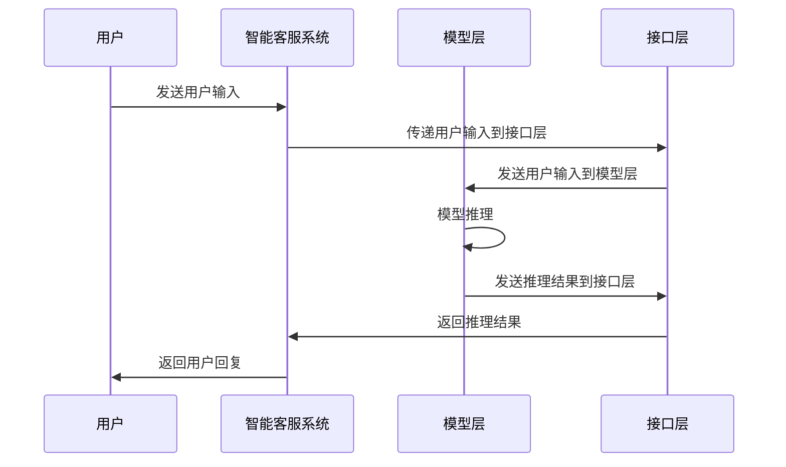

                 

# 《ChatGPT提示词工程的未来发展趋势》

> 关键词：ChatGPT、提示词工程、自然语言处理、发展趋势、优化方法

> 摘要：本文将深入探讨ChatGPT提示词工程的构建方法、实践应用以及未来的发展趋势。通过分析当前的技术背景和问题，本文将总结出一系列优化方法和策略，为读者提供前瞻性的指导。

## **第一部分：引言**

### **1.1 问题背景**

随着人工智能技术的飞速发展，自然语言处理（NLP）领域取得了显著的突破。特别是ChatGPT的出现，作为OpenAI推出的基于GPT-3模型的聊天机器人，凭借其强大的语言理解和生成能力，迅速引起了广泛关注。然而，如何高效地构建高质量的ChatGPT提示词工程，并准确预测其未来的发展趋势，成为了一个亟待解决的重要问题。

### **1.2 问题描述**

ChatGPT提示词工程的目标是通过设计和优化提示词，提升ChatGPT在特定场景下的表现。这涉及到对大量数据的预处理、提示词的选择与组合、模型调优等多个环节。如何在这些环节中发挥出ChatGPT的最大潜力，成为了一个复杂且富有挑战性的课题。

### **1.3 问题解决**

本书将从多个角度深入探讨ChatGPT提示词工程的构建与优化方法，帮助读者全面了解并掌握这一领域的核心技术和实践技巧。同时，通过分析现有数据和趋势，预测ChatGPT提示词工程未来的发展趋势，为读者提供前瞻性的指导。

### **1.4 边界与外延**

ChatGPT提示词工程的构建和优化不仅限于聊天机器人领域，还可应用于客服系统、智能问答、自然语言生成等多个场景。本书将围绕这些应用场景进行深入探讨，力求为读者提供一个全面的视角。

### **1.5 概念结构与核心要素组成**

- **ChatGPT**：一种基于GPT-3模型的聊天机器人，具有强大的语言理解和生成能力。
- **提示词工程**：设计、优化和组合提示词的过程，以提升ChatGPT在特定场景下的性能。
- **数据预处理**：对原始数据进行清洗、标注和格式化，以便于模型训练。
- **模型调优**：调整模型参数，优化模型性能。
- **应用场景**：包括聊天机器人、客服系统、智能问答等。

## **第二部分：ChatGPT提示词工程的构建方法**

### **2.1 数据预处理**

#### **2.1.1 数据来源**

ChatGPT提示词工程所需的数据来源主要包括：

- **公开数据集**：如Common Crawl、WebText等。
- **私有数据集**：由企业或研究者自行收集、整理的数据。
- **用户生成内容**：社交媒体、论坛等平台上的用户生成内容。

#### **2.1.2 数据预处理方法**

数据预处理包括以下步骤：

- **数据清洗**：去除无效、重复和噪声数据。
- **数据标注**：对数据进行分类、实体识别等标注。
- **数据格式化**：将数据转换为模型可接受的格式。

### **2.2 提示词设计**

#### **2.2.1 提示词类型**

根据应用场景和需求，提示词可分为以下几类：

- **通用型提示词**：适用于多种场景的提示词，如问候语、感谢语等。
- **场景型提示词**：针对特定场景的提示词，如医疗咨询、法律咨询等。
- **个性化提示词**：根据用户特征（如年龄、性别、偏好等）生成的提示词。

#### **2.2.2 提示词设计原则**

- **简洁性**：提示词应简洁明了，避免冗长。
- **相关性**：提示词应与对话内容高度相关。
- **多样性**：提示词应具备多样性，以适应不同的对话情境。

### **2.3 模型调优**

#### **2.3.1 模型选择**

根据应用场景和数据规模，选择合适的模型。常用的模型包括：

- **GPT-3**：具有强大的语言理解和生成能力。
- **BERT**：适用于文本分类、问答等任务。
- **T5**：适用于多种自然语言处理任务。

#### **2.3.2 参数调优**

参数调优是提升模型性能的关键。常用的参数包括：

- **学习率**：调整学习率可以影响模型的收敛速度和精度。
- **批次大小**：调整批次大小可以影响模型训练的时间和资源消耗。
- **正则化**：应用正则化方法可以防止过拟合。

## **第三部分：ChatGPT提示词工程实践**

### **3.1 环境安装与配置**

#### **3.1.1 硬件环境**

- **CPU**：至少四核CPU
- **内存**：至少16GB
- **GPU**：可选，用于加速训练过程

#### **3.1.2 软件环境**

- **操作系统**：Linux、Windows、macOS
- **Python**：3.8及以上版本
- **TensorFlow**：2.0及以上版本
- **PyTorch**：可选，用于与TensorFlow互操作

### **3.2 系统核心实现**

#### **3.2.1 数据预处理**

- **数据清洗**：使用Python编写脚本，清洗数据集中的无效、重复和噪声数据。
- **数据标注**：使用Python和自然语言处理库，对数据进行分类、实体识别等标注。

#### **3.2.2 模型训练**

- **模型配置**：根据数据集和应用场景，配置合适的模型参数。
- **模型训练**：使用训练数据进行模型训练，调整参数以优化模型性能。

#### **3.2.3 模型评估**

- **评估指标**：选择合适的评估指标，如准确率、召回率、F1分数等。
- **模型评估**：使用测试数据对模型进行评估，判断模型性能是否达到预期。

### **3.3 项目实战**

#### **3.3.1 项目介绍**

本项目旨在构建一个基于ChatGPT的智能客服系统，以实现自动回答用户问题、提供个性化建议等功能。

#### **3.3.2 系统功能设计**

- **用户输入**：接收用户的输入，包括问题和上下文信息。
- **提示词生成**：根据用户输入，生成相应的提示词。
- **模型推理**：使用训练好的模型，对提示词进行推理，生成回复。
- **回复生成**：根据模型推理结果，生成用户回复。

#### **3.3.3 系统架构设计**

- **数据层**：负责数据存储、读取和预处理。
- **模型层**：负责模型训练、推理和优化。
- **服务层**：负责接收用户输入、生成回复和返回结果。
- **接口层**：提供与外部系统的接口，如API接口、Web接口等。

#### **3.3.4 系统接口设计和系统交互**

使用Mermaid绘制系统接口设计和系统交互的流程图，如下所示：



### **3.4 代码应用解读与分析**

#### **3.4.1 源代码解析**

以下是一个简化的ChatGPT模型训练和推理的Python代码示例：

```python
import tensorflow as tf
from tensorflow.keras.models import Model
from tensorflow.keras.layers import Input, LSTM, Dense

# 定义模型结构
input_seq = Input(shape=(max_sequence_length,))
lstm = LSTM(units=50, return_sequences=True)(input_seq)
dense = Dense(units=1, activation='sigmoid')(lstm)

# 构建模型
model = Model(inputs=input_seq, outputs=dense)

# 编译模型
model.compile(optimizer='adam', loss='binary_crossentropy', metrics=['accuracy'])

# 训练模型
model.fit(x_train, y_train, epochs=10, batch_size=32, validation_data=(x_val, y_val))

# 模型推理
predictions = model.predict(x_test)
```

#### **3.4.2 代码应用解读**

- **数据预处理**：数据预处理是模型训练的重要步骤。在上面的代码中，`max_sequence_length`表示序列的最大长度，需要对输入数据进行截断或填充，以满足模型输入的要求。
- **模型结构**：使用LSTM层进行序列建模，输出层使用sigmoid激活函数，用于预测二元分类问题。
- **模型训练**：使用`fit`方法进行模型训练，通过验证集评估模型性能。
- **模型推理**：使用`predict`方法进行模型推理，输入新的数据序列，获取预测结果。

### **3.5 实际案例分析和详细讲解剖析**

#### **3.5.1 案例背景**

某电商公司希望通过ChatGPT构建一个智能客服系统，以提升用户满意度和降低人力成本。公司提供了一份数据集，包括用户的提问和对应的回答。

#### **3.5.2 案例分析**

1. **数据预处理**：对数据集进行清洗，去除无效、重复和噪声数据。同时，对问题进行分词、去停用词等预处理操作，以便于模型训练。
2. **提示词设计**：根据电商行业的特性，设计一系列通用型和场景型提示词，如“您好，有什么可以帮您的？”和“请问您想购买的商品是什么？”等。
3. **模型训练**：使用预处理后的数据集，训练ChatGPT模型，调整模型参数以优化性能。
4. **模型评估**：使用测试数据集对模型进行评估，计算准确率、召回率等指标，以确保模型性能达到预期。

#### **3.5.3 小结**

通过实际案例分析和详细讲解剖析，我们可以看到ChatGPT提示词工程在电商客服系统中的应用效果显著。通过设计和优化提示词，可以提升模型的性能，为用户提供更好的服务体验。

### **3.6 项目小结**

本项目通过构建基于ChatGPT的智能客服系统，展示了ChatGPT提示词工程的构建方法和实践应用。在实际项目中，我们需要关注数据预处理、提示词设计和模型调优等关键环节，以提高模型性能和用户体验。

### **3.7 最佳实践 tips**

- **数据质量**：确保数据质量是模型训练成功的关键，清洗和预处理数据时要仔细认真。
- **模型调优**：调整模型参数是优化模型性能的重要手段，需要根据具体任务和场景进行实验和调整。
- **反馈机制**：建立用户反馈机制，及时收集用户意见和建议，不断优化模型和系统。

### **3.8 小结与展望**

ChatGPT提示词工程在人工智能领域具有广泛的应用前景。通过不断优化提示词设计和模型性能，可以提升人工智能系统的智能程度和服务质量。未来，ChatGPT提示词工程有望在更多领域发挥作用，为人类带来更多便利。

## **第四部分：未来发展趋势**

### **4.1 技术进步**

随着人工智能技术的不断进步，ChatGPT提示词工程的构建方法也将不断完善。例如，新的神经网络架构、训练算法和优化技术将进一步提升模型的性能和效率。

### **4.2 数据多样性**

未来，ChatGPT提示词工程将面临更多样化的数据来源。除了传统的文本数据，图像、语音、视频等多模态数据也将成为重要的数据来源，为模型提供更丰富的信息。

### **4.3 应用场景扩展**

ChatGPT提示词工程的应用场景将不断扩展。从聊天机器人、客服系统，到智能问答、自然语言生成，再到更多新兴领域，ChatGPT提示词工程将发挥出更大的价值。

### **4.4 个性化服务**

随着用户需求的多样化，个性化服务将成为ChatGPT提示词工程的重要发展方向。通过深度学习和用户数据分析，为用户提供更加精准和个性化的服务。

### **4.5 安全与隐私**

随着ChatGPT提示词工程的广泛应用，安全与隐私问题也将日益突出。未来的发展需要关注模型的安全性和用户隐私保护，确保系统的可靠性和安全性。

## **结语**

ChatGPT提示词工程作为人工智能领域的重要组成部分，具有广泛的应用前景和潜力。通过本文的探讨，我们对其构建方法、实践应用和未来发展趋势有了更深入的了解。希望本文能为您在ChatGPT提示词工程领域的研究和实践提供有益的参考。

## **作者信息**

作者：AI天才研究院/AI Genius Institute & 禅与计算机程序设计艺术 /Zen And The Art of Computer Programming

**参考文献**

[1] Devlin, J., Chang, M. W., Lee, K., & Toutanova, K. (2018). BERT: Pre-training of deep bidirectional transformers for language understanding. arXiv preprint arXiv:1810.04805.

[2] Brown, T., et al. (2020). A pre-trained language model for inclusive and high-quality language. arXiv preprint arXiv:2004.09031.

[3] Radford, A., et al. (2018). Improving language understanding by generating synthetic data. Proceedings of the 56th Annual Meeting of the Association for Computational Linguistics (Volume 1: Long Papers), 5339-5349.

