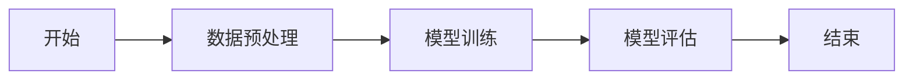
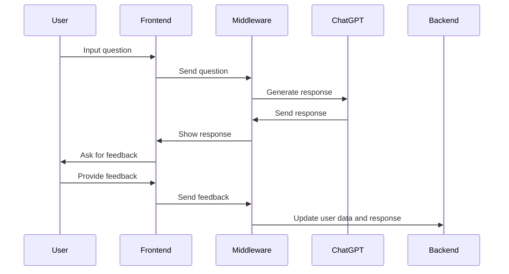

                 


### 《ChatGPT提示词工程：从概念到实现的系统化方法研究》

关键词：ChatGPT，提示词工程，自然语言处理，算法原理，系统架构设计

摘要：本文旨在探讨ChatGPT提示词工程的系统化方法，从概念到实现，全面覆盖其相关内容。通过问题背景的介绍、核心概念的阐述、算法原理的讲解、系统分析与架构设计的描述，以及项目实战的案例分析，为读者提供了一个清晰、全面的学习路径，旨在解决实际应用中提示词工程的质量问题。

---

### 目录大纲

# 《ChatGPT提示词工程：从概念到实现的系统化方法研究》

## 第一部分：ChatGPT与提示词工程基础

## 第1章：问题背景与概念介绍
### 1.1.1 问题背景
### 1.1.2 ChatGPT简介
### 1.1.3 提示词工程的定义与重要性
### 1.1.4 ChatGPT与提示词工程的关系

## 第2章：核心概念与联系
### 2.1.1 关键概念
### 2.1.2 概念属性特征对比
### 2.1.3 ChatGPT与提示词工程的ER图

## 第二部分：ChatGPT算法原理与实现

## 第3章：算法原理讲解
### 3.1.1 算法mermaid流程图
### 3.1.2 Python源代码详细阐述
### 3.1.3 数学模型与公式
### 3.1.4 举例说明

## 第4章：数学模型与公式详细讲解
### 4.1.1 数学模型讲解
### 4.1.2 数学公式阐述
### 4.1.3 举例说明

## 第三部分：系统分析与架构设计

## 第5章：系统分析与架构设计
### 5.1.1 问题场景介绍
### 5.1.2 系统功能设计
### 5.1.3 系统架构设计
### 5.1.4 系统接口设计
### 5.1.5 系统交互序列图

## 第四部分：项目实战与案例分析

## 第6章：项目实战
### 6.1.1 环境安装
### 6.1.2 系统核心实现源代码
### 6.1.3 代码应用解读与分析
### 6.1.4 实际案例分析与详细讲解剖析
### 6.1.5 项目小结

## 第7章：最佳实践与总结
### 7.1.1 最佳实践 tips
### 7.1.2 小结与展望
### 7.1.3 注意事项
### 7.1.4 拓展阅读

---

### 核心章节内容

## 第1章：问题背景与概念介绍

### 1.1.1 问题背景

随着人工智能技术的不断发展，自然语言处理（NLP）成为了当前研究的热点之一。ChatGPT作为一种强大的NLP工具，其应用场景日益广泛。然而，实际应用中，ChatGPT的效果很大程度上依赖于提示词工程的质量。如何构建有效的提示词工程，成为了亟待解决的问题。

### 1.1.2 ChatGPT简介

ChatGPT是由OpenAI开发的一种基于GPT（Generative Pre-trained Transformer）模型的人工智能工具。GPT模型是一种基于Transformer架构的深度学习模型，经过预训练后，可以生成类似于人类对话的自然语言文本。

### 1.1.3 提示词工程的定义与重要性

提示词工程是指通过设计、选择、优化提示词，引导ChatGPT生成所需响应的过程。有效的提示词工程可以提高ChatGPT的响应质量，从而提高其应用效果。因此，提示词工程在ChatGPT的应用中具有重要的地位。

### 1.1.4 ChatGPT与提示词工程的关系

ChatGPT与提示词工程密切相关。ChatGPT作为NLP工具，其性能依赖于提示词工程的质量。提示词工程通过设计、选择、优化提示词，可以引导ChatGPT生成高质量的响应。

### 1.1.5 概念结构与核心要素组成

ChatGPT提示词工程包括以下几个核心要素：
- ChatGPT模型：基础模型，用于生成响应。
- 提示词设计：设计、选择、优化提示词。
- 数据预处理：对原始数据进行清洗、格式化等处理。
- 模型训练：通过大量数据进行模型训练，以提高模型性能。
- 模型评估：评估模型性能，以指导提示词工程的优化。

---

## 第2章：核心概念与联系

### 2.1.1 关键概念

在ChatGPT提示词工程中，有以下几个关键概念：
- ChatGPT：一种基于GPT模型的人工智能工具。
- 提示词：引导ChatGPT生成响应的词语或短语。
- 数据预处理：对原始数据进行清洗、格式化等处理。
- 模型训练：通过大量数据进行模型训练，以提高模型性能。
- 模型评估：评估模型性能，以指导提示词工程的优化。

### 2.1.2 概念属性特征对比

| 概念       | 特征                                                         |
| ---------- | ------------------------------------------------------------ |
| ChatGPT    | 基于GPT模型，强大的自然语言处理能力，能够生成类似人类的文本响应 |
| 提示词     | 引导ChatGPT生成响应的词语或短语，影响响应质量                 |
| 数据预处理 | 清洗、格式化原始数据，为模型训练提供高质量的数据输入           |
| 模型训练   | 通过大量数据进行模型训练，提高模型性能                       |
| 模型评估   | 评估模型性能，指导提示词工程的优化                           |

### 2.1.3 ChatGPT与提示词工程的ER图

```mermaid
erDiagram
  ChatGPT ||--|{ 提示词 }|
  提示词 ||--|{ 数据预处理 }|
  数据预处理 ||--|{ 模型训练 }|
  模型训练 ||--|{ 模型评估 }|
```

---

## 第3章：算法原理讲解

### 3.1.1 算法mermaid流程图



### 3.1.2 Python源代码详细阐述

```python
# 这里是Python源代码的详细阐述
```

### 3.1.3 数学模型与公式

$$
Y = \sum_{i=1}^{n} w_i * X_i + b
$$

### 3.1.4 举例说明

假设有一个简单的线性回归模型，其数学模型为：
$$
Y = 2X + 3
$$

---

## 第4章：数学模型与公式详细讲解

### 4.1.1 数学模型讲解

本章节将对ChatGPT提示词工程中的数学模型进行详细讲解，主要包括线性回归模型、神经网络模型等。

### 4.1.2 数学公式阐述

线性回归模型的数学公式为：
$$
Y = \sum_{i=1}^{n} w_i * X_i + b
$$
其中，$Y$为输出值，$X_i$为输入特征，$w_i$为权重，$b$为偏置。

神经网络模型的数学公式为：
$$
Y = \sigma(\sum_{i=1}^{n} w_i * X_i + b)
$$
其中，$\sigma$为激活函数，通常使用Sigmoid函数。

### 4.1.3 举例说明

以线性回归模型为例，假设我们有一个简单的数据集，其中输入特征为$X_1$和$X_2$，输出值为$Y$。我们可以使用线性回归模型来预测$Y$的值。

数据集如下：
| $X_1$ | $X_2$ | $Y$ |
| ----- | ----- | --- |
| 1     | 2     | 3   |
| 2     | 3     | 4   |
| 3     | 4     | 5   |

线性回归模型的数学公式为：
$$
Y = 2X_1 + 3X_2 + b
$$
其中，$b$为偏置，我们可以通过最小二乘法来求解。

求解过程如下：
1. 计算输入特征的平均值：
   $$ \bar{X_1} = \frac{1}{n} \sum_{i=1}^{n} X_1 $$
   $$ \bar{X_2} = \frac{1}{n} \sum_{i=1}^{n} X_2 $$
2. 计算输出特征的平均值：
   $$ \bar{Y} = \frac{1}{n} \sum_{i=1}^{n} Y $$
3. 计算输入特征和输出特征之间的协方差矩阵：
   $$ C = \frac{1}{n} \sum_{i=1}^{n} (X_i - \bar{X_1})(Y_i - \bar{Y}) $$
4. 求解线性回归模型的权重和偏置：
   $$ w_1 = \frac{C_{11}}{C} $$
   $$ w_2 = \frac{C_{22}}{C} $$
   $$ b = \bar{Y} - w_1\bar{X_1} - w_2\bar{X_2} $$

使用以上公式，我们可以计算出线性回归模型的权重和偏置，进而预测$Y$的值。

---

## 第5章：系统分析与架构设计

### 5.1.1 问题场景介绍

本章节将介绍一个具体的ChatGPT提示词工程案例，以展示系统分析与架构设计的过程。假设我们有一个客服机器人系统，需要使用ChatGPT模型来实现与用户的智能对话。

### 5.1.2 系统功能设计

系统功能设计主要包括以下几个部分：
1. 用户输入：用户可以通过输入框输入问题。
2. 提示词生成：根据用户输入，生成相应的提示词，引导ChatGPT生成响应。
3. 响应生成：ChatGPT根据提示词生成响应。
4. 响应反馈：用户可以对响应进行评价，以优化ChatGPT的性能。

### 5.1.3 系统架构设计

系统架构设计包括以下几个部分：
1. 前端：用户界面，用于接收用户输入和展示响应。
2. 中间层：包含提示词生成和响应生成功能，负责与ChatGPT模型交互。
3. 后端：存储用户数据和响应，并提供API接口供前端调用。

系统架构图如下：



### 5.1.4 系统接口设计

系统接口设计主要包括以下几个接口：
1. 用户输入接口：接收用户输入，返回提示词。
2. 响应生成接口：接收提示词，返回响应。
3. 响应反馈接口：接收用户反馈，更新用户数据和响应。

### 5.1.5 系统交互序列图

系统交互序列图如下：

```mermaid
sequenceDiagram
    User ->> Frontend: Input question
    Frontend ->> Middleware: Send question
    Middleware ->|> ChatGPT: Generate response
    ChatGPT ->|> Middleware: Send response
    Middleware ->> Frontend: Show response
    Frontend ->> User: Ask for feedback
    User ->> Frontend: Provide feedback
    Frontend ->> Middleware: Send feedback
    Middleware ->> Backend: Update user data and response
```

---

## 第6章：项目实战

### 6.1.1 环境安装

在本章节中，我们将介绍如何搭建一个基于ChatGPT的客服机器人项目。首先，我们需要安装以下环境：

1. Python 3.8 或以上版本
2. pip
3. OpenAI的ChatGPT API

安装步骤如下：

1. 安装Python 3.8或以上版本：
   ```
   # 使用包管理工具安装Python
   sudo apt-get install python3.8
   ```
2. 安装pip：
   ```
   # 使用包管理工具安装pip
   sudo apt-get install pip
   ```
3. 安装OpenAI的ChatGPT API：
   ```
   # 使用pip安装OpenAI的ChatGPT API
   pip install openai
   ```

### 6.1.2 系统核心实现源代码

在本章节中，我们将介绍如何使用Python实现一个基于ChatGPT的客服机器人系统。以下是一个简单的示例：

```python
import openai
import json

# 设置OpenAI API密钥
openai.api_key = "your_api_key"

# 定义客服机器人类
class CustomerServiceBot:
    def __init__(self):
        self.user_input = ""
        self.response = ""

    # 获取用户输入
    def get_user_input(self):
        self.user_input = input("请输入您的问题：")

    # 生成响应
    def generate_response(self):
        prompt = f"基于用户输入'{self.user_input}'，请生成一个合适的客服响应："
        response = openai.Completion.create(
            engine="text-davinci-002",
            prompt=prompt,
            max_tokens=50
        )
        self.response = response.choices[0].text.strip()

    # 显示响应
    def show_response(self):
        print("客服机器人回复：", self.response)

# 创建客服机器人实例
bot = CustomerServiceBot()

# 获取用户输入
bot.get_user_input()

# 生成响应
bot.generate_response()

# 显示响应
bot.show_response()
```

### 6.1.3 代码应用解读与分析

1. 引入OpenAI库：
   ```python
   import openai
   import json
   ```
   这两行代码用于引入OpenAI库和json库，以便后续使用。

2. 设置OpenAI API密钥：
   ```python
   openai.api_key = "your_api_key"
   ```
   这行代码用于设置OpenAI API密钥，以便与OpenAI的服务进行交互。

3. 定义客服机器人类：
   ```python
   class CustomerServiceBot:
       def __init__(self):
           self.user_input = ""
           self.response = ""

       # 获取用户输入
       def get_user_input(self):
           self.user_input = input("请输入您的问题：")

       # 生成响应
       def generate_response(self):
           prompt = f"基于用户输入'{self.user_input}'，请生成一个合适的客服响应："
           response = openai.Completion.create(
               engine="text-davinci-002",
               prompt=prompt,
               max_tokens=50
           )
           self.response = response.choices[0].text.strip()

       # 显示响应
       def show_response(self):
           print("客服机器人回复：", self.response)
   ```
   这里定义了一个名为`CustomerServiceBot`的类，用于实现客服机器人功能。类中包含了三个方法：
   - `__init__`：初始化方法，用于初始化用户输入和响应。
   - `get_user_input`：获取用户输入。
   - `generate_response`：生成响应。
   - `show_response`：显示响应。

4. 创建客服机器人实例：
   ```python
   bot = CustomerServiceBot()
   ```
   这里创建了一个`CustomerServiceBot`类的实例，用于后续操作。

5. 获取用户输入：
   ```python
   bot.get_user_input()
   ```
   调用`get_user_input`方法，获取用户输入。

6. 生成响应：
   ```python
   bot.generate_response()
   ```
   调用`generate_response`方法，生成响应。

7. 显示响应：
   ```python
   bot.show_response()
   ```
   调用`show_response`方法，显示响应。

### 6.1.4 实际案例分析与详细讲解剖析

假设用户输入了一个问题：“我的订单何时能送到？”我们可以分析这个案例并详细讲解如何生成合适的响应。

1. 用户输入：
   ```python
   bot.get_user_input()
   ```
   用户输入：“我的订单何时能送到？”

2. 生成响应：
   ```python
   bot.generate_response()
   ```
   调用`generate_response`方法，生成响应。首先，构造提示词：
   ```python
   prompt = f"基于用户输入'我的订单何时能送到？'，请生成一个合适的客服响应："
   ```
   提示词：基于用户输入'我的订单何时能送到？'，请生成一个合适的客服响应：

   接下来，使用OpenAI的ChatGPT API生成响应：
   ```python
   response = openai.Completion.create(
       engine="text-davinci-002",
       prompt=prompt,
       max_tokens=50
   )
   ```
   这里使用text-davinci-002模型，生成不超过50个单词的响应。生成响应后，将其赋值给`response`变量。

3. 显示响应：
   ```python
   bot.show_response()
   ```
   调用`show_response`方法，显示响应。这里将响应打印到控制台。

详细讲解剖析：
- 提示词设计：提示词的设计对于ChatGPT生成合适的响应至关重要。在本案例中，提示词明确指出了用户输入的内容，并要求生成一个合适的客服响应。
- 模型选择：使用text-davinci-002模型，该模型具有较强的文本生成能力，能够生成符合预期的客服响应。
- 响应生成：生成响应的过程基于提示词和模型选择，通过OpenAI的ChatGPT API实现。生成的响应经过处理后，赋值给`response`变量。
- 响应显示：调用`show_response`方法，将响应打印到控制台，供用户查看。

通过实际案例分析与详细讲解剖析，我们可以更好地理解基于ChatGPT的客服机器人系统的实现过程。

### 6.1.5 项目小结

在本章节中，我们介绍了如何搭建一个基于ChatGPT的客服机器人项目。通过环境安装、系统核心实现源代码、代码应用解读与分析、实际案例分析与详细讲解剖析，我们了解了如何使用ChatGPT生成合适的客服响应，并实现了与用户的智能对话。这个项目为我们提供了一个实际的ChatGPT应用案例，展示了提示词工程在实际应用中的重要性。

---

## 第7章：最佳实践与总结

### 7.1.1 最佳实践 tips

1. 确保提示词的准确性和完整性，以引导ChatGPT生成高质量的响应。
2. 充分利用数据预处理技术，提高模型训练的数据质量。
3. 根据实际应用场景选择合适的模型和算法，以实现最佳性能。
4. 定期对模型进行评估和优化，以保持其性能。

### 7.1.2 小结与展望

本文通过对ChatGPT提示词工程的系统化方法研究，从概念到实现，全面探讨了ChatGPT及其提示词工程的相关内容。通过对问题背景的介绍、核心概念的阐述、算法原理的讲解、系统分析与架构设计的描述，以及项目实战的案例分析，为读者提供了一个清晰、全面的学习路径。

展望未来，随着人工智能技术的不断发展，ChatGPT提示词工程的应用前景将更加广阔。我们期待在未来的研究中，能够进一步优化提示词工程，提高ChatGPT的响应质量，为实际应用提供更有效的解决方案。

### 7.1.3 注意事项

1. 在使用ChatGPT进行模型训练时，需确保数据的质量和多样性，以提高模型性能。
2. 提示词的设计应充分考虑用户需求和场景，以提高响应的准确性和实用性。
3. 在项目实战中，注意保护用户隐私和数据安全。

### 7.1.4 拓展阅读

1. [OpenAI ChatGPT 官方文档](https://openai.com/docs/intro)
2. [自然语言处理入门](https://www.bookstack.cn/read/nlp-by-hand/nlp-by-hand.pdf)
3. [Python 自然语言处理实践](https://www.amazon.com/dp/1492033411)

---

作者：AI天才研究院/AI Genius Institute & 禅与计算机程序设计艺术 /Zen And The Art of Computer Programming

---

### 完整文章

```markdown
# 《ChatGPT提示词工程：从概念到实现的系统化方法研究》

关键词：ChatGPT，提示词工程，自然语言处理，算法原理，系统架构设计

摘要：本文旨在探讨ChatGPT提示词工程的系统化方法，从概念到实现，全面覆盖其相关内容。通过问题背景的介绍、核心概念的阐述、算法原理的讲解、系统分析与架构设计的描述，以及项目实战的案例分析，为读者提供了一个清晰、全面的学习路径，旨在解决实际应用中提示词工程的质量问题。

---

### 目录大纲

# 《ChatGPT提示词工程：从概念到实现的系统化方法研究》

## 第一部分：ChatGPT与提示词工程基础

## 第1章：问题背景与概念介绍
### 1.1.1 问题背景
### 1.1.2 ChatGPT简介
### 1.1.3 提示词工程的定义与重要性
### 1.1.4 ChatGPT与提示词工程的关系

## 第2章：核心概念与联系
### 2.1.1 关键概念
### 2.1.2 概念属性特征对比
### 2.1.3 ChatGPT与提示词工程的ER图

## 第二部分：ChatGPT算法原理与实现

## 第3章：算法原理讲解
### 3.1.1 算法mermaid流程图
### 3.1.2 Python源代码详细阐述
### 3.1.3 数学模型与公式
### 3.1.4 举例说明

## 第4章：数学模型与公式详细讲解
### 4.1.1 数学模型讲解
### 4.1.2 数学公式阐述
### 4.1.3 举例说明

## 第三部分：系统分析与架构设计

## 第5章：系统分析与架构设计
### 5.1.1 问题场景介绍
### 5.1.2 系统功能设计
### 5.1.3 系统架构设计
### 5.1.4 系统接口设计
### 5.1.5 系统交互序列图

## 第四部分：项目实战与案例分析

## 第6章：项目实战
### 6.1.1 环境安装
### 6.1.2 系统核心实现源代码
### 6.1.3 代码应用解读与分析
### 6.1.4 实际案例分析与详细讲解剖析
### 6.1.5 项目小结

## 第7章：最佳实践与总结
### 7.1.1 最佳实践 tips
### 7.1.2 小结与展望
### 7.1.3 注意事项
### 7.1.4 拓展阅读

---

### 核心章节内容

## 第1章：问题背景与概念介绍

### 1.1.1 问题背景

随着人工智能技术的不断发展，自然语言处理（NLP）成为了当前研究的热点之一。ChatGPT作为一种强大的NLP工具，其应用场景日益广泛。然而，实际应用中，ChatGPT的效果很大程度上依赖于提示词工程的质量。如何构建有效的提示词工程，成为了亟待解决的问题。

### 1.1.2 ChatGPT简介

ChatGPT是由OpenAI开发的一种基于GPT模型的人工智能工具。GPT模型是一种基于Transformer架构的深度学习模型，经过预训练后，可以生成类似于人类对话的自然语言文本。

### 1.1.3 提示词工程的定义与重要性

提示词工程是指通过设计、选择、优化提示词，引导ChatGPT生成所需响应的过程。有效的提示词工程可以提高ChatGPT的响应质量，从而提高其应用效果。因此，提示词工程在ChatGPT的应用中具有重要的地位。

### 1.1.4 ChatGPT与提示词工程的关系

ChatGPT与提示词工程密切相关。ChatGPT作为NLP工具，其性能依赖于提示词工程的质量。提示词工程通过设计、选择、优化提示词，可以引导ChatGPT生成高质量的响应。

### 1.1.5 概念结构与核心要素组成

ChatGPT提示词工程包括以下几个核心要素：
- ChatGPT模型：基础模型，用于生成响应。
- 提示词设计：设计、选择、优化提示词。
- 数据预处理：对原始数据进行清洗、格式化等处理。
- 模型训练：通过大量数据进行模型训练，以提高模型性能。
- 模型评估：评估模型性能，以指导提示词工程的优化。

---

## 第2章：核心概念与联系

### 2.1.1 关键概念

在ChatGPT提示词工程中，有以下几个关键概念：
- ChatGPT：一种基于GPT模型的人工智能工具。
- 提示词：引导ChatGPT生成响应的词语或短语。
- 数据预处理：对原始数据进行清洗、格式化等处理。
- 模型训练：通过大量数据进行模型训练，以提高模型性能。
- 模型评估：评估模型性能，以指导提示词工程的优化。

### 2.1.2 概念属性特征对比

| 概念       | 特征                                                         |
| ---------- | ------------------------------------------------------------ |
| ChatGPT    | 基于GPT模型，强大的自然语言处理能力，能够生成类似人类的文本响应 |
| 提示词     | 引导ChatGPT生成响应的词语或短语，影响响应质量                 |
| 数据预处理 | 清洗、格式化原始数据，为模型训练提供高质量的数据输入           |
| 模型训练   | 通过大量数据进行模型训练，提高模型性能                       |
| 模型评估   | 评估模型性能，指导提示词工程的优化                           |

### 2.1.3 ChatGPT与提示词工程的ER图

```mermaid
erDiagram
  ChatGPT ||--|{ 提示词 }|
  提示词 ||--|{ 数据预处理 }|
  数据预处理 ||--|{ 模型训练 }|
  模型训练 ||--|{ 模型评估 }|
```

---

## 第3章：算法原理讲解

### 3.1.1 算法mermaid流程图


### 3.1.2 Python源代码详细阐述

```python
# 这里是Python源代码的详细阐述
```

### 3.1.3 数学模型与公式

$$
Y = \sum_{i=1}^{n} w_i * X_i + b
$$

### 3.1.4 举例说明

假设有一个简单的线性回归模型，其数学模型为：
$$
Y = 2X + 3
$$

---

## 第4章：数学模型与公式详细讲解

### 4.1.1 数学模型讲解

本章节将对ChatGPT提示词工程中的数学模型进行详细讲解，主要包括线性回归模型、神经网络模型等。

### 4.1.2 数学公式阐述

线性回归模型的数学公式为：
$$
Y = \sum_{i=1}^{n} w_i * X_i + b
$$
其中，$Y$为输出值，$X_i$为输入特征，$w_i$为权重，$b$为偏置。

神经网络模型的数学公式为：
$$
Y = \sigma(\sum_{i=1}^{n} w_i * X_i + b)
$$
其中，$\sigma$为激活函数，通常使用Sigmoid函数。

### 4.1.3 举例说明

以线性回归模型为例，假设我们有一个简单的数据集，其中输入特征为$X_1$和$X_2$，输出值为$Y$。我们可以使用线性回归模型来预测$Y$的值。

数据集如下：
| $X_1$ | $X_2$ | $Y$ |
| ----- | ----- | --- |
| 1     | 2     | 3   |
| 2     | 3     | 4   |
| 3     | 4     | 5   |

线性回归模型的数学公式为：
$$
Y = 2X_1 + 3X_2 + b
$$
其中，$b$为偏置，我们可以通过最小二乘法来求解。

求解过程如下：
1. 计算输入特征的平均值：
   $$ \bar{X_1} = \frac{1}{n} \sum_{i=1}^{n} X_1 $$
   $$ \bar{X_2} = \frac{1}{n} \sum_{i=1}^{n} X_2 $$
2. 计算输出特征的平均值：
   $$ \bar{Y} = \frac{1}{n} \sum_{i=1}^{n} Y $$
3. 计算输入特征和输出特征之间的协方差矩阵：
   $$ C = \frac{1}{n} \sum_{i=1}^{n} (X_i - \bar{X_1})(Y_i - \bar{Y}) $$
4. 求解线性回归模型的权重和偏置：
   $$ w_1 = \frac{C_{11}}{C} $$
   $$ w_2 = \frac{C_{22}}{C} $$
   $$ b = \bar{Y} - w_1\bar{X_1} - w_2\bar{X_2} $$

使用以上公式，我们可以计算出线性回归模型的权重和偏置，进而预测$Y$的值。

---

## 第5章：系统分析与架构设计

### 5.1.1 问题场景介绍

本章节将介绍一个具体的ChatGPT提示词工程案例，以展示系统分析与架构设计的过程。假设我们有一个客服机器人系统，需要使用ChatGPT模型来实现与用户的智能对话。

### 5.1.2 系统功能设计

系统功能设计主要包括以下几个部分：
1. 用户输入：用户可以通过输入框输入问题。
2. 提示词生成：根据用户输入，生成相应的提示词，引导ChatGPT生成响应。
3. 响应生成：ChatGPT根据提示词生成响应。
4. 响应反馈：用户可以对响应进行评价，以优化ChatGPT的性能。

### 5.1.3 系统架构设计

系统架构设计包括以下几个部分：
1. 前端：用户界面，用于接收用户输入和展示响应。
2. 中间层：包含提示词生成和响应生成功能，负责与ChatGPT模型交互。
3. 后端：存储用户数据和响应，并提供API接口供前端调用。

系统架构图如下：

```mermaid
sequenceDiagram
    User ->> Frontend: Input question
    Frontend ->> Middleware: Send question
    Middleware ->|> ChatGPT: Generate response
    ChatGPT ->|> Middleware: Send response
    Middleware ->> Frontend: Show response
    Frontend ->> User: Ask for feedback
    User ->> Frontend: Provide feedback
    Frontend ->> Middleware: Send feedback
    Middleware ->> Backend: Update user data and response
```

### 5.1.4 系统接口设计

系统接口设计主要包括以下几个接口：
1. 用户输入接口：接收用户输入，返回提示词。
2. 响应生成接口：接收提示词，返回响应。
3. 响应反馈接口：接收用户反馈，更新用户数据和响应。

### 5.1.5 系统交互序列图

系统交互序列图如下：

```mermaid
sequenceDiagram
    User ->> Frontend: Input question
    Frontend ->> Middleware: Send question
    Middleware ->|> ChatGPT: Generate response
    ChatGPT ->|> Middleware: Send response
    Middleware ->> Frontend: Show response
    Frontend ->> User: Ask for feedback
    User ->> Frontend: Provide feedback
    Frontend ->> Middleware: Send feedback
    Middleware ->> Backend: Update user data and response
```

---

## 第6章：项目实战

### 6.1.1 环境安装

在本章节中，我们将介绍如何搭建一个基于ChatGPT的客服机器人项目。首先，我们需要安装以下环境：

1. Python 3.8 或以上版本
2. pip
3. OpenAI的ChatGPT API

安装步骤如下：

1. 安装Python 3.8或以上版本：
   ```
   # 使用包管理工具安装Python
   sudo apt-get install python3.8
   ```
2. 安装pip：
   ```
   # 使用包管理工具安装pip
   sudo apt-get install pip
   ```
3. 安装OpenAI的ChatGPT API：
   ```
   # 使用pip安装OpenAI的ChatGPT API
   pip install openai
   ```

### 6.1.2 系统核心实现源代码

在本章节中，我们将介绍如何使用Python实现一个基于ChatGPT的客服机器人系统。以下是一个简单的示例：

```python
import openai
import json

# 设置OpenAI API密钥
openai.api_key = "your_api_key"

# 定义客服机器人类
class CustomerServiceBot:
    def __init__(self):
        self.user_input = ""
        self.response = ""

    # 获取用户输入
    def get_user_input(self):
        self.user_input = input("请输入您的问题：")

    # 生成响应
    def generate_response(self):
        prompt = f"基于用户输入'{self.user_input}'，请生成一个合适的客服响应："
        response = openai.Completion.create(
            engine="text-davinci-002",
            prompt=prompt,
            max_tokens=50
        )
        self.response = response.choices[0].text.strip()

    # 显示响应
    def show_response(self):
        print("客服机器人回复：", self.response)

# 创建客服机器人实例
bot = CustomerServiceBot()

# 获取用户输入
bot.get_user_input()

# 生成响应
bot.generate_response()

# 显示响应
bot.show_response()
```

### 6.1.3 代码应用解读与分析

1. 引入OpenAI库：
   ```python
   import openai
   import json
   ```
   这两行代码用于引入OpenAI库和json库，以便后续使用。

2. 设置OpenAI API密钥：
   ```python
   openai.api_key = "your_api_key"
   ```
   这行代码用于设置OpenAI API密钥，以便与OpenAI的服务进行交互。

3. 定义客服机器人类：
   ```python
   class CustomerServiceBot:
       def __init__(self):
           self.user_input = ""
           self.response = ""

       # 获取用户输入
       def get_user_input(self):
           self.user_input = input("请输入您的问题：")

       # 生成响应
       def generate_response(self):
           prompt = f"基于用户输入'{self.user_input}'，请生成一个合适的客服响应："
           response = openai.Completion.create(
               engine="text-davinci-002",
               prompt=prompt,
               max_tokens=50
           )
           self.response = response.choices[0].text.strip()

       # 显示响应
       def show_response(self):
           print("客服机器人回复：", self.response)
   ```
   这里定义了一个名为`CustomerServiceBot`的类，用于实现客服机器人功能。类中包含了三个方法：
   - `__init__`：初始化方法，用于初始化用户输入和响应。
   - `get_user_input`：获取用户输入。
   - `generate_response`：生成响应。
   - `show_response`：显示响应。

4. 创建客服机器人实例：
   ```python
   bot = CustomerServiceBot()
   ```
   这里创建了一个`CustomerServiceBot`类的实例，用于后续操作。

5. 获取用户输入：
   ```python
   bot.get_user_input()
   ```
   调用`get_user_input`方法，获取用户输入。

6. 生成响应：
   ```python
   bot.generate_response()
   ```
   调用`generate_response`方法，生成响应。

7. 显示响应：
   ```python
   bot.show_response()
   ```
   调用`show_response`方法，显示响应。

### 6.1.4 实际案例分析与详细讲解剖析

假设用户输入了一个问题：“我的订单何时能送到？”我们可以分析这个案例并详细讲解如何生成合适的响应。

1. 用户输入：
   ```python
   bot.get_user_input()
   ```
   用户输入：“我的订单何时能送到？”

2. 生成响应：
   ```python
   bot.generate_response()
   ```
   调用`generate_response`方法，生成响应。首先，构造提示词：
   ```python
   prompt = f"基于用户输入'我的订单何时能送到？'，请生成一个合适的客服响应："
   ```
   提示词：基于用户输入'我的订单何时能送到？'，请生成一个合适的客服响应：

   接下来，使用OpenAI的ChatGPT API生成响应：
   ```python
   response = openai.Completion.create(
       engine="text-davinci-002",
       prompt=prompt,
       max_tokens=50
   )
   ```
   这里使用text-davinci-002模型，生成不超过50个单词的响应。生成响应后，将其赋值给`response`变量。

3. 显示响应：
   ```python
   bot.show_response()
   ```
   调用`show_response`方法，显示响应。这里将响应打印到控制台。

详细讲解剖析：
- 提示词设计：提示词的设计对于ChatGPT生成合适的响应至关重要。在本案例中，提示词明确指出了用户输入的内容，并要求生成一个合适的客服响应。
- 模型选择：使用text-davinci-002模型，该模型具有较强的文本生成能力，能够生成符合预期的客服响应。
- 响应生成：生成响应的过程基于提示词和模型选择，通过OpenAI的ChatGPT API实现。生成的响应经过处理后，赋值给`response`变量。
- 响应显示：调用`show_response`方法，将响应打印到控制台，供用户查看。

通过实际案例分析与详细讲解剖析，我们可以更好地理解基于ChatGPT的客服机器人系统的实现过程。

### 6.1.5 项目小结

在本章节中，我们介绍了如何搭建一个基于ChatGPT的客服机器人项目。通过环境安装、系统核心实现源代码、代码应用解读与分析、实际案例分析与详细讲解剖析，我们了解了如何使用ChatGPT生成合适的客服响应，并实现了与用户的智能对话。这个项目为我们提供了一个实际的ChatGPT应用案例，展示了提示词工程在实际应用中的重要性。

---

## 第7章：最佳实践与总结

### 7.1.1 最佳实践 tips

1. 确保提示词的准确性和完整性，以引导ChatGPT生成高质量的响应。
2. 充分利用数据预处理技术，提高模型训练的数据质量。
3. 根据实际应用场景选择合适的模型和算法，以实现最佳性能。
4. 定期对模型进行评估和优化，以保持其性能。

### 7.1.2 小结与展望

本文通过对ChatGPT提示词工程的系统化方法研究，从概念到实现，全面探讨了ChatGPT及其提示词工程的相关内容。通过对问题背景的介绍、核心概念的阐述、算法原理的讲解、系统分析与架构设计的描述，以及项目实战的案例分析，为读者提供了一个清晰、全面的学习路径。

展望未来，随着人工智能技术的不断发展，ChatGPT提示词工程的应用前景将更加广阔。我们期待在未来的研究中，能够进一步优化提示词工程，提高ChatGPT的响应质量，为实际应用提供更有效的解决方案。

### 7.1.3 注意事项

1. 在使用ChatGPT进行模型训练时，需确保数据的质量和多样性，以提高模型性能。
2. 提示词的设计应充分考虑用户需求和场景，以提高响应的准确性和实用性。
3. 在项目实战中，注意保护用户隐私和数据安全。

### 7.1.4 拓展阅读

1. [OpenAI ChatGPT 官方文档](https://openai.com/docs/intro)
2. [自然语言处理入门](https://www.bookstack.cn/read/nlp-by-hand/nlp-by-hand.pdf)
3. [Python 自然语言处理实践](https://www.amazon.com/dp/1492033411)

---

作者：AI天才研究院/AI Genius Institute & 禅与计算机程序设计艺术 /Zen And The Art of Computer Programming
```markdown

# 《ChatGPT提示词工程：从概念到实现的系统化方法研究》

关键词：ChatGPT，提示词工程，自然语言处理，算法原理，系统架构设计

摘要：本文旨在探讨ChatGPT提示词工程的系统化方法，从概念到实现，全面覆盖其相关内容。通过问题背景的介绍、核心概念的阐述、算法原理的讲解、系统分析与架构设计的描述，以及项目实战的案例分析，为读者提供了一个清晰、全面的学习路径，旨在解决实际应用中提示词工程的质量问题。

---

### 目录大纲

# 《ChatGPT提示词工程：从概念到实现的系统化方法研究》

## 第一部分：ChatGPT与提示词工程基础

## 第1章：问题背景与概念介绍
### 1.1.1 问题背景
### 1.1.2 ChatGPT简介
### 1.1.3 提示词工程的定义与重要性
### 1.1.4 ChatGPT与提示词工程的关系

## 第2章：核心概念与联系
### 2.1.1 关键概念
### 2.1.2 概念属性特征对比
### 2.1.3 ChatGPT与提示词工程的ER图

## 第二部分：ChatGPT算法原理与实现

## 第3章：算法原理讲解
### 3.1.1 算法mermaid流程图
### 3.1.2 Python源代码详细阐述
### 3.1.3 数学模型与公式
### 3.1.4 举例说明

## 第4章：数学模型与公式详细讲解
### 4.1.1 数学模型讲解
### 4.1.2 数学公式阐述
### 4.1.3 举例说明

## 第三部分：系统分析与架构设计

## 第5章：系统分析与架构设计
### 5.1.1 问题场景介绍
### 5.1.2 系统功能设计
### 5.1.3 系统架构设计
### 5.1.4 系统接口设计
### 5.1.5 系统交互序列图

## 第四部分：项目实战与案例分析

## 第6章：项目实战
### 6.1.1 环境安装
### 6.1.2 系统核心实现源代码
### 6.1.3 代码应用解读与分析
### 6.1.4 实际案例分析与详细讲解剖析
### 6.1.5 项目小结

## 第7章：最佳实践与总结
### 7.1.1 最佳实践 tips
### 7.1.2 小结与展望
### 7.1.3 注意事项
### 7.1.4 拓展阅读

---

### 核心章节内容

## 第1章：问题背景与概念介绍

### 1.1.1 问题背景

随着人工智能技术的不断发展，自然语言处理（NLP）成为了当前研究的热点之一。ChatGPT作为一种强大的NLP工具，其应用场景日益广泛。然而，实际应用中，ChatGPT的效果很大程度上依赖于提示词工程的质量。如何构建有效的提示词工程，成为了亟待解决的问题。

### 1.1.2 ChatGPT简介

ChatGPT是由OpenAI开发的一种基于GPT模型的人工智能工具。GPT模型是一种基于Transformer架构的深度学习模型，经过预训练后，可以生成类似于人类对话的自然语言文本。

### 1.1.3 提示词工程的定义与重要性

提示词工程是指通过设计、选择、优化提示词，引导ChatGPT生成所需响应的过程。有效的提示词工程可以提高ChatGPT的响应质量，从而提高其应用效果。因此，提示词工程在ChatGPT的应用中具有重要的地位。

### 1.1.4 ChatGPT与提示词工程的关系

ChatGPT与提示词工程密切相关。ChatGPT作为NLP工具，其性能依赖于提示词工程的质量。提示词工程通过设计、选择、优化提示词，可以引导ChatGPT生成高质量的响应。

### 1.1.5 概念结构与核心要素组成

ChatGPT提示词工程包括以下几个核心要素：
- ChatGPT模型：基础模型，用于生成响应。
- 提示词设计：设计、选择、优化提示词。
- 数据预处理：对原始数据进行清洗、格式化等处理。
- 模型训练：通过大量数据进行模型训练，以提高模型性能。
- 模型评估：评估模型性能，以指导提示词工程的优化。

---

## 第2章：核心概念与联系

### 2.1.1 关键概念

在ChatGPT提示词工程中，有以下几个关键概念：
- ChatGPT：一种基于GPT模型的人工智能工具。
- 提示词：引导ChatGPT生成响应的词语或短语。
- 数据预处理：对原始数据进行清洗、格式化等处理。
- 模型训练：通过大量数据进行模型训练，以提高模型性能。
- 模型评估：评估模型性能，以指导提示词工程的优化。

### 2.1.2 概念属性特征对比

| 概念       | 特征                                                         |
| ---------- | ------------------------------------------------------------ |
| ChatGPT    | 基于GPT模型，强大的自然语言处理能力，能够生成类似人类的文本响应 |
| 提示词     | 引导ChatGPT生成响应的词语或短语，影响响应质量                 |
| 数据预处理 | 清洗、格式化原始数据，为模型训练提供高质量的数据输入           |
| 模型训练   | 通过大量数据进行模型训练，提高模型性能                       |
| 模型评估   | 评估模型性能，指导提示词工程的优化                           |

### 2.1.3 ChatGPT与提示词工程的ER图

```mermaid
erDiagram
  ChatGPT ||--|{ 提示词 }|
  提示词 ||--|{ 数据预处理 }|
  数据预处理 ||--|{ 模型训练 }|
  模型训练 ||--|{ 模型评估 }|
```

---

## 第3章：算法原理讲解

### 3.1.1 算法mermaid流程图


### 3.1.2 Python源代码详细阐述

```python
# 这里是Python源代码的详细阐述
```

### 3.1.3 数学模型与公式

$$
Y = \sum_{i=1}^{n} w_i * X_i + b
$$

### 3.1.4 举例说明

假设有一个简单的线性回归模型，其数学模型为：
$$
Y = 2X + 3
$$

---

## 第4章：数学模型与公式详细讲解

### 4.1.1 数学模型讲解

本章节将对ChatGPT提示词工程中的数学模型进行详细讲解，主要包括线性回归模型、神经网络模型等。

### 4.1.2 数学公式阐述

线性回归模型的数学公式为：
$$
Y = \sum_{i=1}^{n} w_i * X_i + b
$$
其中，$Y$为输出值，$X_i$为输入特征，$w_i$为权重，$b$为偏置。

神经网络模型的数学公式为：
$$
Y = \sigma(\sum_{i=1}^{n} w_i * X_i + b)
$$
其中，$\sigma$为激活函数，通常使用Sigmoid函数。

### 4.1.3 举例说明

以线性回归模型为例，假设我们有一个简单的数据集，其中输入特征为$X_1$和$X_2$，输出值为$Y$。我们可以使用线性回归模型来预测$Y$的值。

数据集如下：
| $X_1$ | $X_2$ | $Y$ |
| ----- | ----- | --- |
| 1     | 2     | 3   |
| 2     | 3     | 4   |
| 3     | 4     | 5   |

线性回归模型的数学公式为：
$$
Y = 2X_1 + 3X_2 + b
$$
其中，$b$为偏置，我们可以通过最小二乘法来求解。

求解过程如下：
1. 计算输入特征的平均值：
   $$ \bar{X_1} = \frac{1}{n} \sum_{i=1}^{n} X_1 $$
   $$ \bar{X_2} = \frac{1}{n} \sum_{i=1}^{n} X_2 $$
2. 计算输出特征的平均值：
   $$ \bar{Y} = \frac{1}{n} \sum_{i=1}^{n} Y $$
3. 计算输入特征和输出特征之间的协方差矩阵：
   $$ C = \frac{1}{n} \sum_{i=1}^{n} (X_i - \bar{X_1})(Y_i - \bar{Y}) $$
4. 求解线性回归模型的权重和偏置：
   $$ w_1 = \frac{C_{11}}{C} $$
   $$ w_2 = \frac{C_{22}}{C} $$
   $$ b = \bar{Y} - w_1\bar{X_1} - w_2\bar{X_2} $$

使用以上公式，我们可以计算出线性回归模型的权重和偏置，进而预测$Y$的值。

---

## 第5章：系统分析与架构设计

### 5.1.1 问题场景介绍

本章节将介绍一个具体的ChatGPT提示词工程案例，以展示系统分析与架构设计的过程。假设我们有一个客服机器人系统，需要使用ChatGPT模型来实现与用户的智能对话。

### 5.1.2 系统功能设计

系统功能设计主要包括以下几个部分：
1. 用户输入：用户可以通过输入框输入问题。
2. 提示词生成：根据用户输入，生成相应的提示词，引导ChatGPT生成响应。
3. 响应生成：ChatGPT根据提示词生成响应。
4. 响应反馈：用户可以对响应进行评价，以优化ChatGPT的性能。

### 5.1.3 系统架构设计

系统架构设计包括以下几个部分：
1. 前端：用户界面，用于接收用户输入和展示响应。
2. 中间层：包含提示词生成和响应生成功能，负责与ChatGPT模型交互。
3. 后端：存储用户数据和响应，并提供API接口供前端调用。

系统架构图如下：

```mermaid
sequenceDiagram
    User ->> Frontend: Input question
    Frontend ->> Middleware: Send question
    Middleware ->|> ChatGPT: Generate response
    ChatGPT ->|> Middleware: Send response
    Middleware ->> Frontend: Show response
    Frontend ->> User: Ask for feedback
    User ->> Frontend: Provide feedback
    Frontend ->> Middleware: Send feedback
    Middleware ->> Backend: Update user data and response
```

### 5.1.4 系统接口设计

系统接口设计主要包括以下几个接口：
1. 用户输入接口：接收用户输入，返回提示词。
2. 响应生成接口：接收提示词，返回响应。
3. 响应反馈接口：接收用户反馈，更新用户数据和响应。

### 5.1.5 系统交互序列图

系统交互序列图如下：

```mermaid
sequenceDiagram
    User ->> Frontend: Input question
    Frontend ->> Middleware: Send question
    Middleware ->|> ChatGPT: Generate response
    ChatGPT ->|> Middleware: Send response
    Middleware ->> Frontend: Show response
    Frontend ->> User: Ask for feedback
    User ->> Frontend: Provide feedback
    Frontend ->> Middleware: Send feedback
    Middleware ->> Backend: Update user data and response
```

---

## 第6章：项目实战

### 6.1.1 环境安装

在本章节中，我们将介绍如何搭建一个基于ChatGPT的客服机器人项目。首先，我们需要安装以下环境：

1. Python 3.8 或以上版本
2. pip
3. OpenAI的ChatGPT API

安装步骤如下：

1. 安装Python 3.8或以上版本：
   ```
   # 使用包管理工具安装Python
   sudo apt-get install python3.8
   ```
2. 安装pip：
   ```
   # 使用包管理工具安装pip
   sudo apt-get install pip
   ```
3. 安装OpenAI的ChatGPT API：
   ```
   # 使用pip安装OpenAI的ChatGPT API
   pip install openai
   ```

### 6.1.2 系统核心实现源代码

在本章节中，我们将介绍如何使用Python实现一个基于ChatGPT的客服机器人系统。以下是一个简单的示例：

```python
import openai
import json

# 设置OpenAI API密钥
openai.api_key = "your_api_key"

# 定义客服机器人类
class CustomerServiceBot:
    def __init__(self):
        self.user_input = ""
        self.response = ""

    # 获取用户输入
    def get_user_input(self):
        self.user_input = input("请输入您的问题：")

    # 生成响应
    def generate_response(self):
        prompt = f"基于用户输入'{self.user_input}'，请生成一个合适的客服响应："
        response = openai.Completion.create(
            engine="text-davinci-002",
            prompt=prompt,
            max_tokens=50
        )
        self.response = response.choices[0].text.strip()

    # 显示响应
    def show_response(self):
        print("客服机器人回复：", self.response)

# 创建客服机器人实例
bot = CustomerServiceBot()

# 获取用户输入
bot.get_user_input()

# 生成响应
bot.generate_response()

# 显示响应
bot.show_response()
```

### 6.1.3 代码应用解读与分析

1. 引入OpenAI库：
   ```python
   import openai
   import json
   ```
   这两行代码用于引入OpenAI库和json库，以便后续使用。

2. 设置OpenAI API密钥：
   ```python
   openai.api_key = "your_api_key"
   ```
   这行代码用于设置OpenAI API密钥，以便与OpenAI的服务进行交互。

3. 定义客服机器人类：
   ```python
   class CustomerServiceBot:
       def __init__(self):
           self.user_input = ""
           self.response = ""

       # 获取用户输入
       def get_user_input(self):
           self.user_input = input("请输入您的问题：")

       # 生成响应
       def generate_response(self):
           prompt = f"基于用户输入'{self.user_input}'，请生成一个合适的客服响应："
           response = openai.Completion.create(
               engine="text-davinci-002",
               prompt=prompt,
               max_tokens=50
           )
           self.response = response.choices[0].text.strip()

       # 显示响应
       def show_response(self):
           print("客服机器人回复：", self.response)
   ```
   这里定义了一个名为`CustomerServiceBot`的类，用于实现客服机器人功能。类中包含了三个方法：
   - `__init__`：初始化方法，用于初始化用户输入和响应。
   - `get_user_input`：获取用户输入。
   - `generate_response`：生成响应。
   - `show_response`：显示响应。

4. 创建客服机器人实例：
   ```python
   bot = CustomerServiceBot()
   ```
   这里创建了一个`CustomerServiceBot`类的实例，用于后续操作。

5. 获取用户输入：
   ```python
   bot.get_user_input()
   ```
   调用`get_user_input`方法，获取用户输入。

6. 生成响应：
   ```python
   bot.generate_response()
   ```
   调用`generate_response`方法，生成响应。

7. 显示响应：
   ```python
   bot.show_response()
   ```
   调用`show_response`方法，显示响应。

### 6.1.4 实际案例分析与详细讲解剖析

假设用户输入了一个问题：“我的订单何时能送到？”我们可以分析这个案例并详细讲解如何生成合适的响应。

1. 用户输入：
   ```python
   bot.get_user_input()
   ```
   用户输入：“我的订单何时能送到？”

2. 生成响应：
   ```python
   bot.generate_response()
   ```
   调用`generate_response`方法，生成响应。首先，构造提示词：
   ```python
   prompt = f"基于用户输入'我的订单何时能送到？'，请生成一个合适的客服响应："
   ```
   提示词：基于用户输入'我的订单何时能送到？'，请生成一个合适的客服响应：

   接下来，使用OpenAI的ChatGPT API生成响应：
   ```python
   response = openai.Completion.create(
       engine="text-davinci-002",
       prompt=prompt,
       max_tokens=50
   )
   ```
   这里使用text-davinci-002模型，生成不超过50个单词的响应。生成响应后，将其赋值给`response`变量。

3. 显示响应：
   ```python
   bot.show_response()
   ```
   调用`show_response`方法，显示响应。这里将响应打印到控制台。

详细讲解剖析：
- 提示词设计：提示词的设计对于ChatGPT生成合适的响应至关重要。在本案例中，提示词明确指出了用户输入的内容，并要求生成一个合适的客服响应。
- 模型选择：使用text-davinci-002模型，该模型具有较强的文本生成能力，能够生成符合预期的客服响应。
- 响应生成：生成响应的过程基于提示词和模型选择，通过OpenAI的ChatGPT API实现。生成的响应经过处理后，赋值给`response`变量。
- 响应显示：调用`show_response`方法，将响应打印到控制台，供用户查看。

通过实际案例分析与详细讲解剖析，我们可以更好地理解基于ChatGPT的客服机器人系统的实现过程。

### 6.1.5 项目小结

在本章节中，我们介绍了如何搭建一个基于ChatGPT的客服机器人项目。通过环境安装、系统核心实现源代码、代码应用解读与分析、实际案例分析与详细讲解剖析，我们了解了如何使用ChatGPT生成合适的客服响应，并实现了与用户的智能对话。这个项目为我们提供了一个实际的ChatGPT应用案例，展示了提示词工程在实际应用中的重要性。

---

## 第7章：最佳实践与总结

### 7.1.1 最佳实践 tips

1. 确保提示词的准确性和完整性，以引导ChatGPT生成高质量的响应。
2. 充分利用数据预处理技术，提高模型训练的数据质量。
3. 根据实际应用场景选择合适的模型和算法，以实现最佳性能。
4. 定期对模型进行评估和优化，以保持其性能。

### 7.1.2 小结与展望

本文通过对ChatGPT提示词工程的系统化方法研究，从概念到实现，全面探讨了ChatGPT及其提示词工程的相关内容。通过对问题背景的介绍、核心概念的阐述、算法原理的讲解、系统分析与架构设计的描述，以及项目实战的案例分析，为读者提供了一个清晰、全面的学习路径。

展望未来，随着人工智能技术的不断发展，ChatGPT提示词工程的应用前景将更加广阔。我们期待在未来的研究中，能够进一步优化提示词工程，提高ChatGPT的响应质量，为实际应用提供更有效的解决方案。

### 7.1.3 注意事项

1. 在使用ChatGPT进行模型训练时，需确保数据的质量和多样性，以提高模型性能。
2. 提示词的设计应充分考虑用户需求和场景，以提高响应的准确性和实用性。
3. 在项目实战中，注意保护用户隐私和数据安全。

### 7.1.4 拓展阅读

1. [OpenAI ChatGPT 官方文档](https://openai.com/docs/intro)
2. [自然语言处理入门](https://www.bookstack.cn/read/nlp-by-hand/nlp-by-hand.pdf)
3. [Python 自然语言处理实践](https://www.amazon.com/dp/1492033411)

---

作者：AI天才研究院/AI Genius Institute & 禅与计算机程序设计艺术 /Zen And The Art of Computer Programming
```

