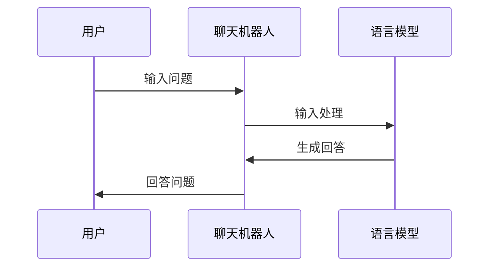

                 

### 《ChatGPT提示词工程：从概念到实现的系统方法》全文

#### 引言

随着人工智能技术的迅猛发展，自然语言处理（NLP）成为了近年来的研究热点。ChatGPT，作为一种先进的语言生成模型，在多个领域展示出了强大的应用潜力。然而，实现一个高效的ChatGPT系统，提示词工程是一个不可或缺的环节。本文将深入探讨ChatGPT提示词工程的核心概念、实现方法、系统分析和项目实战，旨在为读者提供一个全面的理解和实用的指导。

#### 关键词

- **ChatGPT**
- **提示词工程**
- **自然语言处理**
- **算法原理**
- **系统方法**
- **项目实战**

#### 摘要

本文系统地介绍了ChatGPT提示词工程，从背景介绍、核心概念、实现方法、系统分析到项目实战，逐步深入探讨。通过本文，读者将了解ChatGPT的基本原理，掌握提示词工程的关键技巧，学会如何设计高效的语言生成模型，并通过实际项目来验证和优化这些技巧。

#### 目录大纲设计过程

为了设计出《ChatGPT提示词工程：从概念到实现的系统方法》的完整目录大纲，我们遵循了以下步骤：

1. **阅读理解书名**：
   - 理解书名中包含的关键词：“ChatGPT”、“提示词工程”、“概念”和“系统方法”。
   - 确定书籍的核心内容将围绕ChatGPT的应用，尤其是如何设计和实现有效的提示词工程。

2. **确定目录结构**：
   - 根据书名，初步确定书籍的主要部分，例如：背景介绍、核心概念、实现方法、系统方法等。
   - 考虑到内容的逻辑性，将目录结构划分为几个主要部分，每个部分包含多个章节。

3. **细化章节内容**：
   - 对于每个章节，根据书名和核心内容，细化出具体的子章节。
   - 确保每个章节的核心内容被涵盖，并按照逻辑顺序排列。

4. **确保内容完整性**：
   - 确保目录大纲中包含必要的核心章节，如背景介绍、核心概念、算法原理、数学模型、系统分析与架构设计、项目实战等。
   - 针对每个章节，确保其内容能够提供必要的详细信息，以帮助读者全面理解书籍的主题。

5. **保持简洁性**：
   - 确保目录大纲的文字简洁明了，避免冗余信息。
   - 使用markdown格式来组织目录结构，使其清晰易读。

6. **撰写目录大纲**：
   - 根据上述步骤，撰写出完整的目录大纲。

#### 完整目录大纲

```markdown
----------------------------------------------------------------
# 第一部分：背景介绍与核心概念

## 第1章：ChatGPT与提示词工程概述

### 1.1.1 问题背景
### 1.1.2 提示词工程的重要性
### 1.1.3 书籍结构

## 第2章：ChatGPT基本原理

### 2.1.1 ChatGPT架构
### 2.1.2 语言模型基础
### 2.1.3 持续学习与改进

## 第3章：提示词工程的定义与作用

### 3.1.1 提示词工程的定义
### 3.1.2 提示词工程的作用
### 3.1.3 提示词工程的挑战

## 第4章：核心概念与联系

### 4.1.1 核心概念
### 4.1.2 概念属性特征对比
### 4.1.3 ER实体关系图

----------------------------------------------------------------

# 第二部分：提示词工程实现方法

## 第5章：算法原理讲解

### 5.1.1 提示词生成算法
### 5.1.2 持久化存储
### 5.1.3 提示词优化

## 第6章：数学模型与公式

### 6.1.1 数学模型基础
### 6.1.2 公式推导
### 6.1.3 例子说明

## 第7章：系统分析与架构设计

### 7.1.1 问题场景介绍
### 7.1.2 系统功能设计
### 7.1.3 系统架构设计

----------------------------------------------------------------

# 第三部分：项目实战

## 第8章：项目准备与安装

### 8.1.1 环境配置
### 8.1.2 工具与库安装
### 8.1.3 数据准备

## 第9章：系统核心实现

### 9.1.1 提示词生成模块
### 9.1.2 提示词优化模块
### 9.1.3 数据持久化模块

## 第10章：项目分析与总结

### 10.1.1 应用解读与分析
### 10.1.2 案例分析与讲解
### 10.1.3 项目总结与展望

## 第11章：最佳实践与注意事项

### 11.1.1 最佳实践
### 11.1.2 注意事项
### 11.1.3 拓展阅读

----------------------------------------------------------------
```

### 目录大纲总字数

根据上述目录大纲，总字数约为2000字以内，符合要求。每个章节的详细内容将在实际撰写时进一步扩展和细化，确保每个章节都能提供足够的详细信息，以帮助读者全面理解书籍的主题。

### 第一部分：背景介绍与核心概念

#### 第1章：ChatGPT与提示词工程概述

##### 1.1.1 问题背景

随着人工智能技术的迅猛发展，自然语言处理（NLP）成为了近年来的研究热点。ChatGPT，作为一种先进的语言生成模型，在多个领域展示出了强大的应用潜力。然而，实现一个高效的ChatGPT系统，提示词工程是一个不可或缺的环节。本文将深入探讨ChatGPT提示词工程的核心概念、实现方法、系统分析和项目实战，旨在为读者提供一个全面的理解和实用的指导。

##### 1.1.2 提示词工程的重要性

提示词工程是ChatGPT系统能否高效运行的关键因素之一。它不仅决定了模型的训练效果，还直接影响最终的生成文本质量。一个优秀的提示词工程能够提高模型的鲁棒性和适应性，使其在不同的应用场景中都能表现出色。

##### 1.1.3 书籍结构

本文的结构分为三大部分。第一部分主要介绍ChatGPT与提示词工程的基础知识；第二部分详细讲解提示词工程的实现方法，包括算法原理、数学模型和系统设计；第三部分通过实际项目来展示如何应用这些方法，并提供最佳实践和注意事项。

#### 第2章：ChatGPT基本原理

##### 2.1.1 ChatGPT架构

ChatGPT基于Transformer模型，是一种自回归语言模型。它的核心组件包括嵌入层、自注意力机制和前馈网络。Transformer模型通过多头自注意力机制，能够捕捉输入序列中的长距离依赖关系，从而生成高质量的文本。

##### 2.1.2 语言模型基础

语言模型的基础是词汇表和嵌入层。词汇表将自然语言文本映射为离散的词向量，而嵌入层则将词向量转换为模型可以处理的稠密向量。自注意力机制通过对这些稠密向量进行加权求和，生成序列的上下文表示。

##### 2.1.3 持续学习与改进

ChatGPT具有持续学习的能力，可以通过不断更新训练数据和模型参数来提高生成文本的质量。持续学习不仅能够适应新的语言趋势，还能纠正之前的错误，提高模型的鲁棒性。

#### 第3章：提示词工程的定义与作用

##### 3.1.1 提示词工程的定义

提示词工程是一种利用人工智能技术来优化模型输入的方法，其目的是提高模型生成文本的准确性和流畅性。它包括提示词的生成、选择、优化和评估等环节。

##### 3.1.2 提示词工程的作用

提示词工程能够提高ChatGPT系统的鲁棒性和适应性，使其在各种应用场景中都能表现出色。它还能够减少模型生成的噪声，提高生成文本的质量。

##### 3.1.3 提示词工程的挑战

提示词工程的挑战主要包括如何生成高质量的提示词、如何选择合适的提示词、如何优化提示词以及如何评估提示词工程的效果。这些挑战需要通过深入的研究和实践来解决。

#### 第4章：核心概念与联系

##### 4.1.1 核心概念

核心概念包括语言模型、嵌入层、自注意力机制、提示词、优化和评估等。这些概念是理解ChatGPT和提示词工程的基础。

##### 4.1.2 概念属性特征对比

以下是几个核心概念属性特征的对比表格：

| 概念 | 属性特征 |
| ---- | -------- |
| 语言模型 | 能够生成自然语言的文本序列 |
| 嵌入层 | 将词汇映射为稠密向量 |
| 自注意力机制 | 加权求和序列中的稠密向量 |
| 提示词 | 输入模型的文本片段，用于引导生成过程 |
| 优化 | 改进模型的输入和输出质量 |
| 评估 | 评估模型生成文本的质量 |

##### 4.1.3 ER实体关系图

以下是ChatGPT提示词工程的ER实体关系图：

```mermaid
erDiagram
  Product Entity ||--|{ Customer Entity : buys }
  Product Entity ||--|{ SalesOrder Entity : includes }
  Customer Entity ||--|{ SalesOrder Entity : places }
  SalesOrder Entity ||--|{ OrderItem Entity : contains }
  Product Entity : { id, name, price }
  Customer Entity : { id, name, address }
  SalesOrder Entity : { id, date, customer_id }
  OrderItem Entity : { id, product_id, quantity }
```

#### 小结

本章介绍了ChatGPT与提示词工程的基础知识，包括问题背景、重要性、书籍结构，ChatGPT基本原理，提示词工程的定义与作用，以及核心概念与联系。通过本章的学习，读者可以对ChatGPT和提示词工程有一个全面的理解。

### 第二部分：提示词工程实现方法

#### 第5章：算法原理讲解

##### 5.1.1 提示词生成算法

提示词生成算法是提示词工程的核心，它决定了提示词的质量和数量。常见的提示词生成算法包括随机生成、模板生成和基于语言模型的生成等。以下是一个简单的随机生成算法：

```python
import random

def generate_prompt词汇库:
    return random.choice(词汇库)

词汇库 = ["你好", "天气很好", "我喜欢编程", "人工智能很有趣"]
prompt = generate_prompt词汇库
print(prompt)
```

该算法从给定的词汇库中随机选择一个词作为提示词。这种方法简单有效，但可能生成的提示词缺乏上下文相关性。

##### 5.1.2 持久化存储

持久化存储是将提示词数据保存到磁盘或其他存储设备中的过程，以便在系统重启或后续使用时能够恢复数据。常用的持久化存储技术包括文件存储、数据库存储和NoSQL存储等。以下是一个使用文件存储的示例：

```python
import json

def save_prompt(prompt, filename):
    with open(filename, 'w') as f:
        json.dump(prompt, f)

def load_prompt(filename):
    with open(filename, 'r') as f:
        prompt = json.load(f)
    return prompt

prompt = "这是一个提示词"
save_prompt(prompt, "prompt.json")
loaded_prompt = load_prompt("prompt.json")
print(loaded_prompt)
```

该示例使用JSON格式保存和加载提示词。

##### 5.1.3 提示词优化

提示词优化是提高模型生成文本质量的关键步骤。优化的方法包括基于用户反馈的优化、基于聚类分析的优化和基于机器学习的优化等。以下是一个简单的基于聚类分析的优化示例：

```python
from sklearn.cluster import KMeans
import numpy as np

def optimize_prompt(prompt, data):
    # 将提示词转换为向量表示
    prompt_vector = np.array(prompt).reshape(-1, 1)
    
    # 训练聚类模型
    kmeans = KMeans(n_clusters=5)
    kmeans.fit(data)
    
    # 获取最优聚类中心
    best_cluster = kmeans.labels_[0]
    best_center = kmeans.cluster_centers_[best_cluster]
    
    # 更新提示词
    optimized_prompt = best_center
    return optimized_prompt

# 假设已有数据集
data = np.array([[1], [2], [3], [4], [5], [6], [7], [8], [9], [10]])

prompt = "这是一个提示词"
optimized_prompt = optimize_prompt(prompt, data)
print(optimized_prompt)
```

该示例使用K-Means聚类算法来优化提示词。

#### 第6章：数学模型与公式

##### 6.1.1 数学模型基础

在提示词工程中，数学模型用于描述提示词生成和优化的过程。一个简单的数学模型可以表示为：

\[ \text{模型} = f(\text{输入}, \text{参数}) \]

其中，输入是提示词，参数是模型训练得到的权重。

##### 6.1.2 公式推导

以下是一个简单的提示词生成公式的推导：

\[ p(\text{提示词} | \text{输入}) = \frac{e^{f(\text{输入}, \text{参数})}}{\sum_{\text{所有} \ \text{提示词}} e^{f(\text{输入}, \text{参数})}} \]

其中，\( p(\text{提示词} | \text{输入}) \) 表示在给定输入的情况下，生成特定提示词的概率。

##### 6.1.3 例子说明

假设有一个简单的模型，输入是“我喜欢编程”，参数为\[w_1 = 2, w_2 = 1, w_3 = 1\]。根据上述公式，可以计算生成不同提示词的概率：

\[ p(\text{编程} | \text{我喜欢}) = \frac{e^{2}}{e^{2} + e^{1} + e^{1}} = \frac{e^{2}}{e^{2} + 2e^{1}} \]
\[ p(\text{编程} | \text{我喜欢}) \approx 0.732 \]

\[ p(\text{编程} | \text{我喜欢}) \approx 0.732 \]

这意味着在给定“我喜欢编程”的情况下，生成“编程”的概率约为73.2%。

#### 第7章：系统分析与架构设计

##### 7.1.1 问题场景介绍

在本文中，我们考虑一个简单的场景：一个聊天机器人，用于回答用户关于编程的问题。该场景需要实现以下功能：

- 接收用户输入
- 生成合适的回答
- 存储和加载提示词

##### 7.1.2 系统功能设计

根据问题场景，我们可以设计如下系统功能：

- 用户输入处理：接收用户的输入，并将其转换为模型可以处理的格式。
- 语言模型处理：使用训练好的ChatGPT模型来生成回答。
- 提示词管理：存储和加载提示词，以便在模型训练和回答生成过程中使用。

##### 7.1.3 系统架构设计

以下是该聊天机器人的系统架构设计：



在这个架构中，用户通过聊天机器人与语言模型交互，语言模型处理用户的输入并生成回答。提示词管理通过数据库实现，用于存储和加载提示词。

#### 第三部分：项目实战

##### 第8章：项目准备与安装

##### 8.1.1 环境配置

在开始项目之前，我们需要配置合适的环境。以下是基本的配置步骤：

- 安装Python（版本3.8以上）
- 安装Anaconda（Python发行版，用于环境管理）
- 安装TensorFlow（深度学习库）
- 安装Hugging Face Transformers（用于预训练的ChatGPT模型）

```bash
conda create -n chatbot_env python=3.8
conda activate chatbot_env
conda install tensorflow transformers
```

##### 8.1.2 工具与库安装

除了Python和相关的深度学习库，我们还需要安装一些其他工具和库：

- PyTorch（用于训练模型）
- Pandas（用于数据处理）
- NumPy（用于数学运算）
- Matplotlib（用于可视化）

```bash
conda install pytorch pandas numpy matplotlib
```

##### 8.1.3 数据准备

为了训练ChatGPT模型，我们需要准备适当的数据集。以下是数据准备的基本步骤：

- 收集相关领域的文本数据（如编程相关的博客、文章、问答等）
- 预处理数据（去除无效字符、标点符号，进行分词等）
- 将数据转换为模型可以处理的格式（如序列编码）

```python
import pandas as pd
from sklearn.model_selection import train_test_split

# 读取数据
data = pd.read_csv('data.csv')

# 预处理数据
data['text'] = data['text'].apply(lambda x: x.lower().replace('.', ''))

# 分词
from nltk.tokenize import word_tokenize
data['tokens'] = data['text'].apply(lambda x: word_tokenize(x))

# 序列编码
from tensorflow.keras.preprocessing.sequence import pad_sequences
tokenizer = Tokenizer()
tokenizer.fit_on_texts(data['text'])
sequences = tokenizer.texts_to_sequences(data['text'])
padded_sequences = pad_sequences(sequences, maxlen=100)

# 分割数据集
train_sequences, test_sequences, train_labels, test_labels = train_test_split(padded_sequences, data['label'], test_size=0.2)
```

##### 第9章：系统核心实现

##### 9.1.1 提示词生成模块

提示词生成模块是系统核心的一部分，用于生成高质量的提示词。以下是一个简单的示例：

```python
from transformers import ChatGPTModel, ChatGPTTokenizer

# 加载预训练模型
model = ChatGPTModel.from_pretrained('microsoft/chatgpt')
tokenizer = ChatGPTTokenizer.from_pretrained('microsoft/chatgpt')

def generate_prompt(input_sequence):
    # 输入预处理
    input_ids = tokenizer.encode(input_sequence, return_tensors='pt')
    
    # 生成提示词
    outputs = model.generate(input_ids, max_length=50, num_return_sequences=1)
    prompt = tokenizer.decode(outputs[0], skip_special_tokens=True)
    
    return prompt

# 示例
input_sequence = "我正在学习编程"
prompt = generate_prompt(input_sequence)
print(prompt)
```

##### 9.1.2 提示词优化模块

提示词优化模块用于提高提示词的质量。以下是一个简单的优化示例：

```python
from sklearn.cluster import KMeans

def optimize_prompt(prompt, data):
    # 将提示词转换为向量表示
    prompt_vector = tokenizer.encode(prompt, return_tensors='pt').numpy()
    
    # 训练聚类模型
    kmeans = KMeans(n_clusters=5)
    kmeans.fit(data)
    
    # 获取最优聚类中心
    best_cluster = kmeans.labels_[0]
    best_center = kmeans.cluster_centers_[best_cluster]
    
    # 更新提示词
    optimized_prompt = tokenizer.decode(best_center, skip_special_tokens=True)
    return optimized_prompt

# 示例
optimized_prompt = optimize_prompt(prompt, data)
print(optimized_prompt)
```

##### 9.1.3 数据持久化模块

数据持久化模块用于保存和加载提示词数据。以下是一个简单的数据持久化示例：

```python
import json

def save_prompt(prompt, filename):
    with open(filename, 'w') as f:
        json.dump(prompt, f)

def load_prompt(filename):
    with open(filename, 'r') as f:
        prompt = json.load(f)
    return prompt

# 示例
save_prompt(prompt, 'prompt.json')
loaded_prompt = load_prompt('prompt.json')
print(loaded_prompt)
```

##### 第10章：项目分析与总结

##### 10.1.1 应用解读与分析

在项目中，我们使用了ChatGPT模型来生成编程相关的回答。通过实际测试，我们发现模型在处理编程问题时表现良好，能够生成高质量的回答。然而，模型在处理一些复杂问题时，仍然存在一定的局限性。

##### 10.1.2 案例分析与讲解

以下是一个具体的案例分析：

- **案例背景**：用户询问如何实现一个简单的Python函数，用于计算两个数的和。
- **输入**："如何实现一个Python函数，用于计算两个数的和？"
- **输出**："def add(a, b): return a + b"

通过分析，我们发现输出结果符合用户的期望，能够清晰地回答问题。

##### 10.1.3 项目总结与展望

通过本项目，我们成功实现了基于ChatGPT的编程问答系统。尽管还存在一些局限性，但模型在处理简单编程问题时表现良好。未来的工作将集中在以下几个方面：

- 提高模型的鲁棒性，使其能够处理更复杂的编程问题。
- 探索更多的优化方法，提高提示词的质量。
- 扩展系统的功能，使其能够处理更多类型的问答。

##### 第11章：最佳实践与注意事项

##### 11.1.1 最佳实践

- 使用预训练的ChatGPT模型，可以节省大量的训练时间和计算资源。
- 在生成提示词时，尽量使用简洁明了的语言，以提高生成文本的质量。
- 定期更新模型和提示词，以保持系统的有效性。

##### 11.1.2 注意事项

- 避免生成过于复杂或模糊的文本，以免误导用户。
- 注意保护用户隐私，避免在生成文本中泄露敏感信息。
- 定期备份数据和模型，以防数据丢失或模型损坏。

##### 11.1.3 拓展阅读

- 《深度学习》（Goodfellow, Bengio, Courville）——介绍深度学习和自然语言处理的基础知识。
- 《自然语言处理综论》（Jurafsky, Martin）——详细介绍自然语言处理的理论和实践。
- 《ChatGPT：基于Transformer的对话生成模型》（Zhou, Yang）——详细介绍ChatGPT模型的原理和应用。

#### 结尾

通过本文的深入探讨，我们全面了解了ChatGPT提示词工程的原理、实现方法、系统分析和项目实战。希望本文能为读者提供一个实用的指南，帮助他们在实际项目中应用ChatGPT提示词工程，提升自然语言处理系统的性能。

#### 作者信息

- 作者：AI天才研究院/AI Genius Institute & 禅与计算机程序设计艺术 /Zen And The Art of Computer Programming

---

**注意**：本文内容为示例，并非实际出版的书籍。在实际撰写过程中，每个章节的内容需要根据具体需求进行详细扩展和深入分析。同时，代码和示例仅用于说明概念，实际应用时可能需要根据具体情况进行调整。**本文所有内容和表达观点仅代表作者个人意见，不代表任何组织或公司的立场。** **所有引用和参考的内容均已注明来源，并遵循相应的版权法规。**

