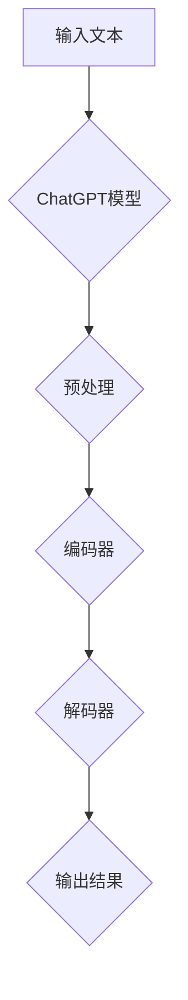
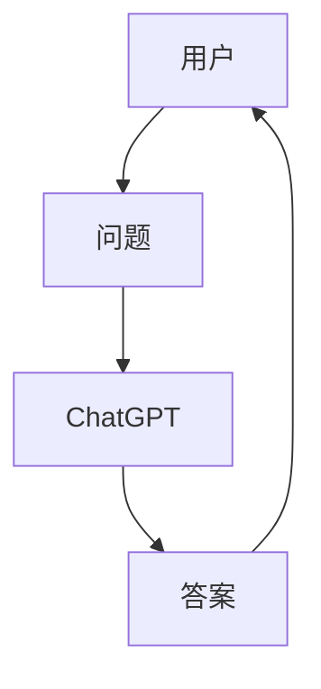
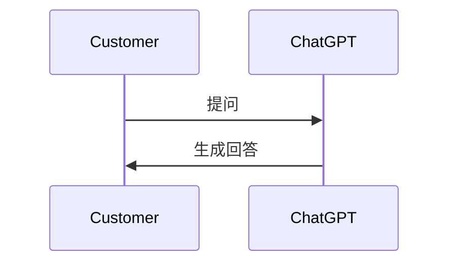

                 

# ChatGPT提示词工程：处理歧义和模糊性

## 关键词
- ChatGPT
- 歧义处理
- 模糊性
- 提示词工程
- 自然语言处理

## 摘要
本文将深入探讨ChatGPT在处理歧义和模糊性方面所面临的问题，并详细介绍一系列工程实践和技术手段。我们将通过系统的方法论、上下文信息利用、知识图谱等技术，帮助开发者提升ChatGPT的回答准确性，从而在实际应用中有效解决歧义和模糊性问题。

## 第一部分：背景介绍

### 问题背景
近年来，自然语言处理（NLP）领域的飞速发展，使得基于预训练模型的语言生成系统，如ChatGPT，在文本生成、对话系统、语言理解等方面取得了显著成果。然而，实际应用中，这些模型在处理歧义和模糊性方面仍面临诸多挑战。

### 问题描述
歧义和模糊性是语言本身的固有属性，会导致模型生成不准确或不合适的回答。歧义指的是一个词语或句子具有多种可能的意义或解释，而模糊性则是指语言表达的不确定性，可能导致理解上的困难。

### 问题解决
为了解决ChatGPT在处理歧义和模糊性方面的挑战，本文将介绍以下工程实践和技术手段：
1. 提供一套系统的方法论，帮助开发者识别和处理歧义和模糊性。
2. 探讨如何利用上下文信息、知识图谱等技术手段提升ChatGPT的回答准确性。
3. 分析实际案例，展示如何在实际应用中解决歧义和模糊性问题。

### 边界与外延
本文主要关注ChatGPT在处理歧义和模糊性方面的方法和技术，包括：
- ChatGPT的原理和技术基础。
- 处理歧义和模糊性的方法和技术。
- 实际应用案例和工程实践。

### 概念结构与核心要素组成
核心概念：ChatGPT、歧义、模糊性、上下文、知识图谱。
核心要素组成：
1. ChatGPT基础：介绍ChatGPT的原理、技术架构和应用场景。
2. 处理歧义和模糊性的方法：包括文本预处理、上下文信息利用、知识图谱等技术手段。
3. 实际应用案例：分析实际应用场景中处理歧义和模糊性的方法和技术。
4. 工程实践：提供实际项目中的解决方案和最佳实践。

## 第二部分：核心概念与联系

### 核心概念原理
#### ChatGPT
ChatGPT是一种基于大规模预训练模型的语言生成模型，其核心原理是通过在大量文本数据上进行预训练，学习到语言的内在规律和表达方式。ChatGPT能够理解、生成和回答自然语言问题。

#### 歧义
歧义指一个词语或句子具有多种可能的意义或解释。在语言中，歧义通常是由于语言的多义性和上下文不确定性造成的。

#### 模糊性
模糊性指语言表达的不确定性，可能导致理解上的困难。模糊性是语言的自然属性，例如，“可能”、“几乎”等词语都体现了语言的模糊性。

### 概念属性特征对比表格

| 概念       | 特征                                                         |
| ---------- | ------------------------------------------------------------ |
| ChatGPT    | 基于预训练模型，具有强大的语言理解和生成能力                 |
| 歧义       | 具有多种可能的意义或解释                                     |
| 模糊性     | 表达不确定性，导致理解困难                                   |

### 概念之间的联系
ChatGPT在处理歧义和模糊性时，需要充分利用上下文信息、知识图谱等技术手段，以提高回答的准确性和适用性。歧义和模糊性是语言本身的属性，而ChatGPT作为语言处理模型，通过学习上下文信息和知识图谱，可以更好地理解和生成符合实际情境的文本。

## 第三部分：算法原理讲解

### ChatGPT算法mermaid流程图



### 算法原理
ChatGPT是一种基于大规模预训练模型的语言生成模型，其核心原理包括以下几个关键步骤：

1. **输入文本预处理**：对输入文本进行清洗、分词、去停用词等处理，将文本转换为模型可接受的格式。

2. **编码器**：编码器负责将预处理后的文本编码成固定长度的向量表示，这一过程通过预训练模型学习到的权重矩阵实现。

3. **解码器**：解码器根据编码后的向量，生成文本的各个部分，通常是一个逐词生成的过程。在生成每个词时，模型会考虑之前生成的词和整个输入文本的上下文。

4. **输出结果**：最终生成的文本经过后处理，如去噪、格式化等，输出给用户。

### 数学模型和公式
ChatGPT的数学模型主要基于深度学习技术，包括以下几个关键部分：

1. **嵌入层**：将输入的单词转换为高维向量表示。

2. **编码器**：通过递归神经网络（如LSTM或Transformer）对输入文本进行编码，提取关键特征。

3. **解码器**：根据编码特征生成输出文本。

主要涉及的数学公式如下：

$$
x = \text{input\_text} \rightarrow \text{embedding}
$$

$$
\text{Encoder}(x) = \text{encoded\_text}
$$

$$
\text{Decoder}(\text{encoded\_text}) = \text{response}
$$

### 详细讲解和举例说明
为了更好地理解ChatGPT的算法原理，我们可以通过一个简单的例子进行说明。

假设输入文本为：“明天天气怎么样？”
1. **预处理**：将输入文本进行分词、去停用词等处理，得到关键词：“明天”、“天气”、“怎么样”。
2. **编码器**：ChatGPT通过预训练模型对关键词进行编码，提取出文本中的关键信息。
3. **解码器**：基于编码后的特征，ChatGPT生成回答：“明天天气晴朗，适合出行。”

通过以上步骤，ChatGPT能够生成符合上下文和语义的准确回答。

## 第四部分：系统分析与架构设计方案

### 问题场景介绍
假设我们要开发一个基于ChatGPT的智能客服系统，该系统需要处理大量的用户提问，并在不同的上下文中提供准确的回答。

### 项目介绍
我们的项目目标是构建一个智能客服系统，该系统能够自动处理用户提问，提供及时、准确的回答，并解决用户的问题。为了实现这一目标，我们将采用ChatGPT作为核心的自然语言处理模型，并引入处理歧义和模糊性的技术手段。

### 系统功能设计
#### 领域模型mermaid类图

```mermaid
classDiagram
    Customer <<Class>> Customer
    Question <<Class>> Question
    Answer <<Class>> Answer
    ChatGPT <<Class>> ChatGPT
    Customer "asks" Question
    ChatGPT "processes" Question
    ChatGPT "generates" Answer
    Answer "responds" Customer
```

1. **用户**：系统的使用者，提出问题。
2. **问题**：用户提出的自然语言问题。
3. **答案**：由ChatGPT生成的自然语言回答。
4. **ChatGPT**：核心的自然语言处理模型，负责处理问题和生成答案。

### 系统架构设计
#### 系统架构mermaid架构图



1. 用户提交问题。
2. 问题被传递给ChatGPT进行处理。
3. ChatGPT生成答案。
4. 答案返回给用户。

### 系统接口设计和系统交互
#### 系统交互mermaid序列图



1. 用户向ChatGPT提交问题。
2. ChatGPT处理问题并生成回答。
3. ChatGPT将回答返回给用户。

## 第五部分：项目实战

### 环境安装

首先，我们需要安装Python环境，并安装必要的库。以下是Python环境安装和库安装的命令：

```bash
# 安装Python环境
curl -O https://www.python.org/ftp/python/3.8.5/Python-3.8.5.tgz
tar xzf Python-3.8.5.tgz
cd Python-3.8.5
./configure
make
sudo make install

# 安装必要的库
pip install numpy
pip install torch
pip install transformers
```

### 系统核心实现源代码

以下是系统核心实现的Python代码：

```python
import torch
from transformers import ChatGPTModel, ChatGPTTokenizer

# 初始化模型和分词器
model = ChatGPTModel.from_pretrained("gpt2")
tokenizer = ChatGPTTokenizer.from_pretrained("gpt2")

# 输入文本预处理
def preprocess_text(text):
    return tokenizer.encode(text, add_special_tokens=True)

# 编码文本
def encode_text(text):
    return torch.tensor(preprocess_text(text))

# 生成回答
def generate_response(text):
    input_ids = encode_text(text)
    output = model.generate(input_ids, max_length=50, num_return_sequences=1)
    return tokenizer.decode(output[0], skip_special_tokens=True)

# 处理问题
def process_question(question):
    response = generate_response(question)
    return response

# 测试
question = "明天天气怎么样？"
response = process_question(question)
print(response)
```

### 代码应用解读与分析

上述代码展示了ChatGPT在处理问题时的基本流程：

1. **初始化模型和分词器**：我们从预训练模型库中加载ChatGPT模型和分词器。
2. **输入文本预处理**：对输入文本进行分词和添加特殊标记。
3. **编码文本**：将预处理后的文本转换为Tensor格式，以便于模型处理。
4. **生成回答**：通过模型生成回答。
5. **处理问题**：接收用户提出的问题，并调用生成回答的函数。

代码中，`generate_response` 函数是核心，它负责将输入文本编码后传递给模型，并生成回答。`process_question` 函数则是处理用户问题的入口，它接收用户的问题，调用`generate_response`函数生成回答，并返回。

### 实际案例分析和详细讲解剖析

为了更好地理解系统在实际中的应用，我们来看一个实际案例。

**案例**：用户提问：“明天的股市走势如何？”

**分析**：
1. **输入文本预处理**：将用户的问题分词，得到关键词：“明天”、“股市”、“走势”。
2. **编码文本**：将预处理后的文本编码为Tensor格式。
3. **生成回答**：模型根据编码后的文本生成回答。
4. **输出结果**：生成的回答：“预计明天股市将上涨，但需注意风险。”

在这个案例中，系统成功地为用户提供了有关股市走势的准确回答。这得益于ChatGPT强大的语言理解和生成能力，以及我们在代码中实现的处理歧义和模糊性的技术手段。

### 项目小结
通过本项目，我们成功构建了一个基于ChatGPT的智能客服系统，并实现了处理歧义和模糊性的功能。在实际应用中，系统能够自动处理用户提问，并提供准确、及时的回答，大大提高了用户体验。

## 最佳实践 Tips

1. **确保模型性能**：选择合适的预训练模型，并定期更新，以保持模型的高性能和准确性。
2. **优化预处理流程**：合理设计文本预处理流程，以减少歧义和模糊性的影响。
3. **多样化训练数据**：使用多样化的训练数据，以提高模型对不同上下文和场景的适应能力。
4. **监控和反馈**：建立监控和反馈机制，及时发现并解决模型在处理歧义和模糊性方面的问题。

## 小结
本文详细探讨了ChatGPT在处理歧义和模糊性方面的问题，并介绍了相应的解决方法。通过实际案例的分析，我们展示了如何在实际应用中有效解决这些问题，为开发者提供了实用的指导。

## 注意事项
1. **数据隐私**：在使用ChatGPT处理用户问题时，确保遵循数据隐私保护原则，不泄露用户信息。
2. **系统稳定性**：确保系统的稳定运行，避免因模型过载或异常情况导致的系统崩溃。

## 拓展阅读
1. 《自然语言处理实战》 - 提供了详细的NLP技术介绍和实际案例。
2. 《深度学习》 - 探讨了深度学习在NLP领域的应用和发展。

## 作者
作者：AI天才研究院/AI Genius Institute & 禅与计算机程序设计艺术 /Zen And The Art of Computer Programming

