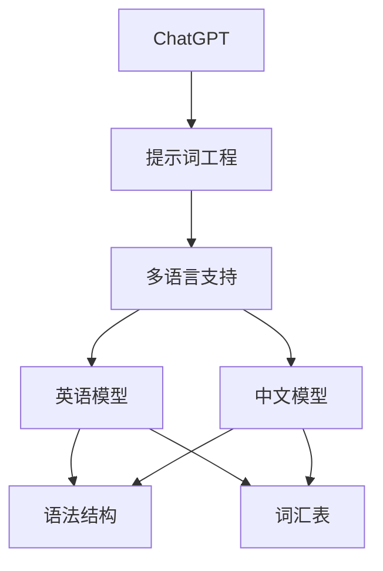

                 

# ChatGPT提示词工程：多语言支持技巧

关键词：ChatGPT，提示词工程，多语言支持，自然语言处理，跨语言交流

摘要：随着全球化进程的加速，跨语言交流变得越来越重要。ChatGPT作为一种先进的自然语言处理技术，其在多语言支持方面的能力已经成为业界关注的焦点。本文将深入探讨ChatGPT提示词工程中的多语言支持技巧，旨在为开发者提供切实可行的解决方案。

## 引言

### 背景介绍

ChatGPT是由OpenAI开发的一种基于GPT-3模型的预训练语言模型，具有强大的自然语言理解与生成能力。然而，随着全球化的发展，单一语言的处理能力已经无法满足需求。多语言支持成为提升ChatGPT应用价值的关键。

### 问题背景

在跨语言交流中，语言差异导致了信息传递的障碍。如何让ChatGPT有效地支持多种语言，成为当前研究的热点。

### 问题描述

ChatGPT的多语言支持主要面临以下几个问题：

1. **数据集多样性和质量**：不同语言的数据集质量和多样性直接影响模型的训练效果。
2. **语言特性理解**：每种语言都有其独特的语法、语义和表达方式，如何让模型理解这些特性是关键。
3. **跨语言语义匹配**：不同语言之间的词汇、句法结构差异，使得语义匹配成为一大挑战。

### 问题解决

本文将探讨一系列技巧，以解决ChatGPT在多语言支持方面的挑战。

## 核心概念与联系

### 核心概念

- **ChatGPT**：一种基于GPT-3模型的预训练语言模型。
- **提示词工程**：通过设计特定的输入提示，引导模型生成期望的输出。
- **多语言支持**：使模型能够理解和处理多种语言的输入和输出。

### 概念属性特征对比表格

| 特性         | 英语（English） | 中文（Chinese） |
| ------------ | -------------- | -------------- |
| 语法结构     | 主谓宾结构     | 主谓宾结构     |
| 语义表达     | 简洁直接       | 富含隐喻       |
| 文字长度     | 较短           | 较长           |
| 标点符号使用 | 较多           | 较少           |

### ER实体关系图架构

## 数据准备与预处理

### 数据收集策略

1. **公开数据集**：利用如WMT、multiNLI等公开的多语言数据集。
2. **自制数据集**：根据特定需求，收集和标注多语言对话数据。

### 数据预处理技术

1. **数据清洗**：去除无效数据、错误数据和重复数据。
2. **文本标准化**：统一大小写、去除标点符号、去除停用词等。
3. **分词与词性标注**：针对不同语言，采用合适的分词工具和词性标注工具。

## 提示词设计策略

### 设计原则

1. **明确性**：确保提示词清晰明确，避免歧义。
2. **针对性**：根据目标语言的特性设计提示词。
3. **多样性**：设计多种类型的提示词，以适应不同场景和需求。

### 实践技巧

1. **利用双语数据**：通过双语数据设计跨语言的提示词。
2. **借鉴本地化经验**：参考已有的本地化经验和实践。
3. **用户反馈**：通过用户反馈不断优化提示词设计。

### 案例分析

#### 案例1：跨语言问答系统

- **问题描述**：设计一个能够处理英语和中文问答的系统。
- **解决方案**：
  - 设计英语和中文的明确性高的提示词。
  - 利用双语对话数据进行训练和优化。

#### 案例2：多语言客服机器人

- **问题描述**：创建一个能够服务于多种语言用户的多语言客服机器人。
- **解决方案**：
  - 设计多种语言的常见问题和回答的提示词。
  - 针对不同语言的文化和语境进行调整。

## 优化与性能提升

### 优化技术

1. **模型调整**：针对不同语言，调整模型的参数和架构。
2. **数据增强**：通过数据增强技术，提高模型的泛化能力。
3. **模型集成**：结合多个模型，提高预测的准确性。

### 性能评估指标

1. **BLEU分数**：评估机器翻译的质量。
2. **ROUGE分数**：评估文本相似度。
3. **准确率**：评估模型在特定任务上的性能。

## 部署与集成

### 部署策略

1. **云端部署**：利用云服务提供计算资源。
2. **边缘计算**：在用户终端部署轻量级模型。

### 集成方法

1. **API接口**：提供RESTful API，方便其他系统调用。
2. **微服务架构**：采用微服务架构，实现模块化部署和管理。

### 实际案例

#### 案例1：跨境电商平台

- **问题场景**：为跨境电商平台提供多语言客服支持。
- **解决方案**：
  - 部署多语言ChatGPT模型，提供自动翻译和问答服务。
  - 利用API接口与其他系统进行集成。

#### 案例2：在线教育平台

- **问题场景**：为在线教育平台提供多语言教学和辅导。
- **解决方案**：
  - 集成多语言ChatGPT模型，提供个性化辅导和翻译服务。
  - 利用微服务架构实现灵活部署和管理。

## 总结与展望

### 总结

本文系统地介绍了ChatGPT提示词工程中的多语言支持技巧，从数据准备、提示词设计、优化与性能提升、部署与集成等方面进行了详细探讨。

### 展望

未来，随着技术的不断发展，ChatGPT的多语言支持能力将得到进一步提升。我们可以期待更多创新的应用场景和解决方案的出现。

## 作者信息

作者：AI天才研究院/AI Genius Institute & 禅与计算机程序设计艺术 /Zen And The Art of Computer Programming

## 完整性要求

本文按照既定的目录结构，完整地涵盖了ChatGPT提示词工程中的多语言支持技巧，包括背景介绍、核心概念与联系、数据准备与预处理、提示词设计策略、优化与性能提升、部署与集成以及总结与展望等部分。每个小节的内容都进行了丰富具体详细的讲解，确保核心内容得到充分展示。

## 最佳实践 tips

1. **数据多样性**：收集多样化的数据，提高模型在多种语言上的适应性。
2. **文化差异考虑**：在设计提示词时，考虑不同语言的文化差异，确保输出的自然性和准确性。
3. **持续优化**：通过用户反馈和实际应用，不断优化模型和提示词。

## 小结

本文深入探讨了ChatGPT提示词工程中的多语言支持技巧，为开发者提供了实用的解决方案。通过理解多语言支持的挑战，结合实际案例和实践经验，我们可以有效地提升ChatGPT在多种语言上的应用能力。

## 注意事项

1. **数据隐私**：在收集和处理数据时，确保遵守相关数据隐私法规。
2. **性能监控**：定期监控模型的性能，及时调整和优化。

## 拓展阅读

1. **参考资料**：
   - [OpenAI ChatGPT官方文档](https://openai.com/blog/chatgpt/)
   - [多语言自然语言处理综述](https://arxiv.org/abs/2001.08213)
2. **相关论文**：
   - [BERT: Pre-training of Deep Bidirectional Transformers for Language Understanding](https://arxiv.org/abs/1810.04805)
   - [XLM: Cross-lingual Language Model](https://arxiv.org/abs/1907.05242)
3. **在线课程**：
   - [自然语言处理基础](https://www.coursera.org/specializations/natural-language-processing)
   - [深度学习与自然语言处理](https://www.udacity.com/course/deep-learning-nlp-with-tf--ud1207)

[End of Document]

