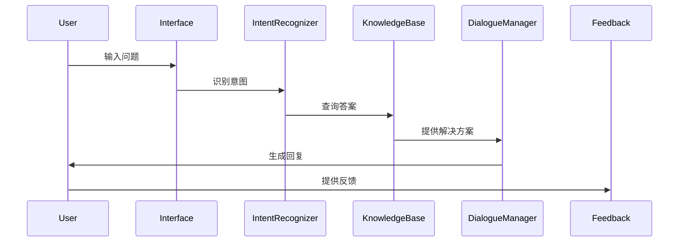
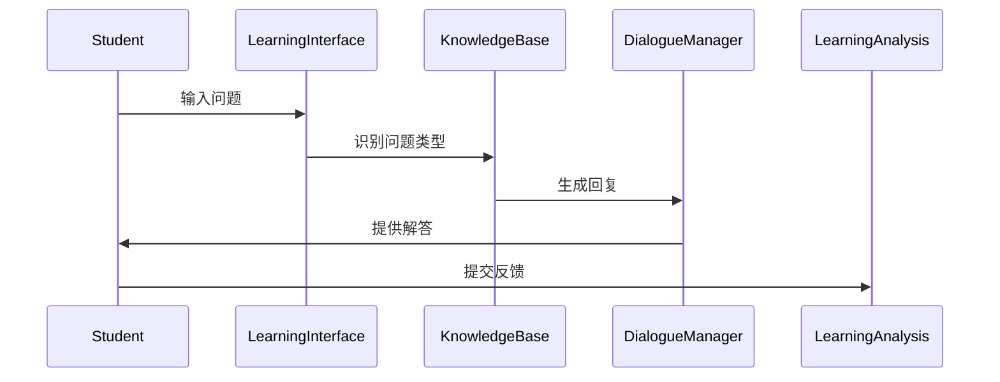
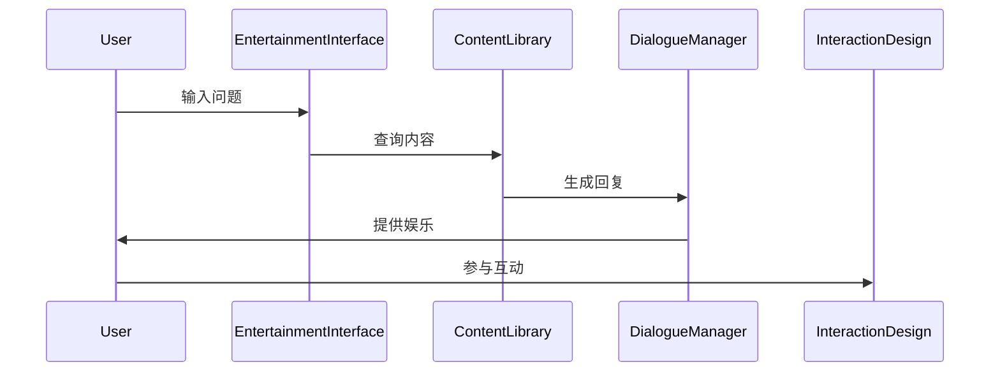

                 

### 文章标题：ChatGPT提示词工程：构建智能对话的进阶技巧

#### 关键词：ChatGPT、智能对话、提示词设计、算法优化、应用实战、发展趋势

#### 摘要：
本文旨在探讨ChatGPT提示词工程在构建智能对话系统中的关键作用。首先，我们将回顾ChatGPT的发展历程与原理，接着深入分析智能对话系统的设计基础。然后，本文将重点讨论ChatGPT提示词的设计与使用策略，并引入算法优化技巧以增强对话能力。此外，我们还将探讨如何构建多样化对话体验，并分享ChatGPT在多场景的应用实战。最后，本文将对ChatGPT提示词工程的未来发展趋势进行展望，总结最佳实践，并提供未来展望。通过本文的深入剖析，读者将全面理解ChatGPT提示词工程的重要性，并掌握构建智能对话系统的进阶技巧。

### 目录大纲

**ChatGPT提示词工程：构建智能对话的进阶技巧**

----------------------------------------------------------------

# 第一部分：ChatGPT与智能对话概述

## 第1章：ChatGPT的背景与原理

### 1.1 ChatGPT的发展历程

### 1.2 ChatGPT的核心原理

### 1.3 ChatGPT在智能对话中的应用

## 第2章：智能对话系统设计基础

### 2.1 智能对话系统概述

### 2.2 对话管理机制

### 2.3 用户画像与意图识别

## 第3章：ChatGPT提示词的设计与使用

### 3.1 提示词概述

### 3.2 提示词类型与特点

### 3.3 提示词设计策略

## 第二部分：进阶技巧

## 第4章：增强ChatGPT对话能力的算法优化

### 4.1 算法优化概述

### 4.2 对话上下文记忆

### 4.3 对话策略优化

## 第5章：构建多样化对话体验

### 5.1 对话情感分析

### 5.2 对话角色扮演

### 5.3 对话引导与互动设计

## 第6章：ChatGPT在多场景的应用实战

### 6.1 客户服务场景

### 6.2 教育培训场景

### 6.3 娱乐休闲场景

## 第7章：ChatGPT提示词工程的未来发展趋势

### 7.1 行业趋势分析

### 7.2 技术挑战与机遇

### 7.3 未来发展方向

## 第8章：最佳实践与总结

### 8.1 提示词工程的最佳实践

### 8.2 构建智能对话系统的小结

### 8.3 注意事项与未来展望

----------------------------------------------------------------

本文将按照目录大纲的结构，逐步深入探讨ChatGPT提示词工程在构建智能对话系统中的重要性。每一章节都将通过详细的背景介绍、核心概念与联系、算法原理讲解、系统分析与架构设计方案、项目实战等环节，提供系统的技术分析与实践指导。通过这样的分析推理方式，读者将能够全面掌握ChatGPT提示词工程的进阶技巧，并在实际项目中有效应用。

---

### 第一部分：ChatGPT与智能对话概述

#### 第1章：ChatGPT的背景与原理

#### 1.1 ChatGPT的发展历程

**背景介绍：**

ChatGPT是由OpenAI开发的基于GPT-3.5架构的大型语言模型。GPT（Generative Pre-trained Transformer）是一种自然语言处理（NLP）模型，通过预训练大量文本数据，能够生成流畅、符合语境的自然语言文本。ChatGPT的诞生标志着自然语言处理技术的一次重大突破，它能够进行对话、回答问题、撰写文章等多种任务。

**发展历程：**

1. **2018年**：OpenAI发布GPT-1，它是一个能够生成连贯文本的模型，但其能力有限。
2. **2019年**：OpenAI发布GPT-2，模型能力显著提升，但仍未能进行有效的对话。
3. **2020年**：OpenAI发布GPT-3，这是一个具有1500亿参数的巨大模型，展示了卓越的文本生成能力。
4. **2022年**：基于GPT-3.5架构的ChatGPT发布，能够进行高质量的对话，成为智能对话系统的重要工具。

**问题背景：**

随着互联网和移动互联网的普及，人们对于智能对话系统的需求日益增长。智能对话系统能够提供24/7的在线服务，提高客户满意度，降低人力成本。然而，传统的对话系统往往缺乏自然性和灵活性，无法满足用户的需求。

**问题描述：**

为了解决上述问题，OpenAI开发了ChatGPT。ChatGPT通过预训练大量对话数据，使其能够理解用户意图，生成流畅、自然的回答。然而，如何设计高质量的提示词，以引导ChatGPT生成更符合用户需求的对话，成为了一个关键问题。

**问题解决：**

通过深入分析ChatGPT的工作原理，我们发现提示词的设计至关重要。高质量的提示词能够提供明确的上下文信息，帮助ChatGPT更好地理解用户意图，从而生成更自然的对话。

**边界与外延：**

ChatGPT不仅应用于智能客服，还可以用于智能写作、语言翻译、代码生成等多种场景。然而，不同场景下对提示词的设计要求有所不同，需要根据具体应用场景进行定制化设计。

**概念结构与核心要素组成：**

1. **预训练模型：** ChatGPT的核心是GPT-3.5架构，通过预训练大量对话数据，使其具备生成对话的能力。
2. **提示词：** 提示词是引导ChatGPT生成对话的关键，包括上下文信息、用户意图等。
3. **对话管理：** 对话管理机制负责维护对话的状态，包括上下文记忆、用户画像等。

#### 1.2 ChatGPT的核心原理

**核心概念原理：**

ChatGPT基于GPT-3.5架构，是一种基于Transformer的预训练语言模型。其核心原理是通过学习大量文本数据，掌握语言生成的规则和模式。

**概念属性特征对比表格：**

| 特征项           | 描述                                                     | ChatGPT特征                           |
|------------------|----------------------------------------------------------|--------------------------------------|
| 架构             | Transformer架构                                         | GPT-3.5架构，包括多个自注意力层       |
| 预训练数据       | 大规模文本数据                                          | OpenAI的对话语料库等                 |
| 参数规模         | 约1750亿参数                                           | GPT-3.5                               |
| 生成能力         | 高质量的文本生成，包括对话、文章、翻译等                  | 对话生成能力卓越                       |

**ER实体关系图架构：**

```mermaid
erDiagram
  Person ||--|{ ChatGPT }|| ChatGPTModel : trains on
  ChatGPTModel ||--|{ Transformer }|| TransformerModel : based on
  ChatGPTModel ||--|{ Pre-trained Data }|| PretrainedData : trained on
```

#### 1.3 ChatGPT在智能对话中的应用

**应用场景：**

ChatGPT在智能对话中有着广泛的应用，包括但不限于：

1. **智能客服：** ChatGPT可以与用户进行自然、流畅的对话，回答常见问题，提高客户满意度。
2. **智能写作：** ChatGPT能够生成高质量的文章、报告、故事等，辅助人类创作者。
3. **语言翻译：** ChatGPT可以翻译多种语言，实现跨语言沟通。
4. **代码生成：** ChatGPT能够根据描述生成代码，辅助开发者提高工作效率。

**应用案例：**

1. **OpenAI的ChatGPT：** OpenAI发布的ChatGPT已经广泛应用于多个领域，包括问答、写作、翻译等。
2. **微软的Bing：** 微软将ChatGPT集成到Bing搜索引擎中，提供更加智能的问答服务。
3. **GitHub Copilot：** GitHub Copilot是一款基于ChatGPT的智能代码生成工具，能够辅助开发者编写代码。

通过上述案例，我们可以看到ChatGPT在智能对话中的应用已经取得了显著的成果，为各行业带来了巨大的价值。

#### 总结

本章介绍了ChatGPT的发展历程、核心原理以及在智能对话中的应用。ChatGPT作为一种强大的自然语言处理模型，通过预训练大量对话数据，具备了生成自然、流畅对话的能力。然而，提示词的设计对于ChatGPT生成高质量的对话至关重要。接下来，我们将进一步探讨智能对话系统的设计基础，以深入理解ChatGPT在构建智能对话系统中的关键作用。

---

#### 第2章：智能对话系统设计基础

#### 2.1 智能对话系统概述

**背景介绍：**

随着人工智能技术的不断进步，智能对话系统已经成为提升用户体验、优化业务流程的重要工具。智能对话系统通过自然语言处理技术，能够理解用户的语言输入，生成自然、流畅的回复，实现与用户的互动。其在客服、教育、金融等多个行业得到了广泛应用。

**问题背景：**

传统的客服系统往往依赖于规则引擎，其响应速度较慢，且难以应对复杂多样的用户需求。智能对话系统的出现，为解决这些问题提供了新的思路。通过引入自然语言处理、机器学习等人工智能技术，智能对话系统能够更好地理解用户意图，提供个性化的服务。

**问题描述：**

智能对话系统的设计基础是什么？如何实现高效的对话管理、用户画像与意图识别？这是本章要探讨的核心问题。

**问题解决：**

通过深入分析智能对话系统的设计原理和关键技术，我们可以找到实现高效对话管理、用户画像与意图识别的方法。这些方法将为构建高质量、高效率的智能对话系统提供重要指导。

**边界与外延：**

智能对话系统不仅局限于客服领域，还可以应用于教育、金融、医疗等多个行业。不同行业的对话系统在功能、性能、用户体验等方面有着不同的要求，需要根据具体应用场景进行定制化设计。

**概念结构与核心要素组成：**

1. **对话管理：** 对话管理是智能对话系统的核心功能，负责维护对话的状态，包括上下文、用户画像等。
2. **用户画像：** 用户画像是对话系统的输入，包括用户的基本信息、历史行为等，用于帮助系统更好地理解用户需求。
3. **意图识别：** 意图识别是对话系统解析用户语言输入的关键技术，通过识别用户的意图，系统能够生成相应的回复。

#### 2.2 对话管理机制

**核心概念原理：**

对话管理机制是智能对话系统的核心组成部分，负责维护对话的状态和流程。其主要功能包括：

1. **上下文维护：** 对话系统需要记住之前的对话内容，以便生成连贯的回复。
2. **状态切换：** 对话系统需要根据用户的不同意图和需求，切换不同的对话状态。
3. **异常处理：** 当用户输入无法识别或系统无法处理时，对话系统需要能够进行异常处理，引导用户重新输入或寻求帮助。

**概念属性特征对比表格：**

| 特征项           | 描述                                                     | 对话管理特征                           |
|------------------|----------------------------------------------------------|--------------------------------------|
| 上下文维护       | 记录并利用之前的对话内容，生成连贯的回复                | 通过上下文缓冲区实现                   |
| 状态切换         | 根据用户意图和需求，切换不同的对话状态                | 状态机实现，包括初始状态、中间状态、结束状态等 |
| 异常处理         | 当用户输入无法识别或系统无法处理时，进行异常处理      | 提供自定义异常处理函数或规则           |

**ER实体关系图架构：**

```mermaid
erDiagram
  User ||--|{ Dialogue }|| Dialogue : participates in
  Dialogue ||--|{ Context }|| Context : maintains
  Dialogue ||--|{ State }|| State : transitions through
  Dialogue ||--|{ Exception }|| Exception : handles
```

#### 2.3 用户画像与意图识别

**核心概念原理：**

用户画像是智能对话系统的关键输入，用于描述用户的基本信息、历史行为等。意图识别则是解析用户语言输入的关键技术，通过识别用户的意图，系统能够生成相应的回复。

1. **用户画像：** 用户画像包括用户的基本信息（如姓名、年龄、性别等）、历史行为（如购买记录、浏览历史等）。这些信息有助于对话系统更好地理解用户需求，提供个性化服务。
2. **意图识别：** 意图识别是通过自然语言处理技术，分析用户语言输入，识别用户的意图。常见的意图识别方法包括规则匹配、机器学习等。

**概念属性特征对比表格：**

| 特征项           | 描述                                                     | 用户画像与意图识别特征                           |
|------------------|----------------------------------------------------------|--------------------------------------|
| 用户画像         | 描述用户的基本信息和历史行为，用于个性化服务              | 信息丰富，支持多维度的用户特征               |
| 意图识别         | 通过自然语言处理技术，识别用户的意图，生成相应回复      | 准确识别，支持多意图并行的处理               |

**ER实体关系图架构：**

```mermaid
erDiagram
  User ||--|{ UserProfile }|| UserProfile : contains
  User ||--|{ Intent }|| Intent : recognized by
  Dialogue ||--|{ Intent }|| Intent : responds to
```

#### 总结

本章介绍了智能对话系统的设计基础，包括对话管理机制、用户画像与意图识别。对话管理机制负责维护对话的状态，确保对话的连贯性和自然性。用户画像是理解用户需求的重要输入，意图识别则是生成回复的关键技术。通过本章的讨论，我们可以更好地理解智能对话系统的设计原理，为后续的进阶技巧提供基础。

在下一章中，我们将进一步探讨ChatGPT提示词的设计与使用策略，深入分析如何通过高质量的提示词，引导ChatGPT生成更符合用户需求的对话。

---

### 第3章：ChatGPT提示词的设计与使用

#### 3.1 提示词概述

**背景介绍：**

提示词（Prompt）在自然语言处理中起着至关重要的作用。它是引导模型生成文本的关键输入，直接影响生成文本的质量和相关性。在ChatGPT中，提示词的设计尤为重要，因为ChatGPT的生成能力高度依赖于输入的上下文信息和引导。

**问题背景：**

随着智能对话系统的广泛应用，如何设计高质量的提示词，以引导ChatGPT生成更自然、流畅的对话，成为了一个关键问题。高质量的提示词不仅能够提高对话系统的用户体验，还能提升系统的业务价值。

**问题描述：**

设计高质量的提示词需要考虑哪些因素？如何确保提示词能够引导ChatGPT准确理解用户意图，并生成相关、自然的回复？这是本章要探讨的核心问题。

**问题解决：**

通过深入分析提示词的设计原则和实际应用案例，我们可以找到设计高质量提示词的方法。这些方法将为我们在实际项目中有效地使用ChatGPT提供重要指导。

**边界与外延：**

提示词不仅应用于ChatGPT，还可以应用于其他自然语言处理模型。不同模型对提示词的要求有所不同，需要根据具体应用场景进行定制化设计。

**概念结构与核心要素组成：**

1. **上下文信息：** 提示词需要提供足够的上下文信息，帮助ChatGPT理解用户意图。
2. **清晰性：** 提示词应清晰明了，避免歧义和模糊性，确保ChatGPT能够准确理解。
3. **相关性：** 提示词应与用户意图紧密相关，确保生成的回复既符合用户需求，又具有实际价值。

#### 3.2 提示词类型与特点

**核心概念原理：**

提示词可以分为以下几种类型：

1. **开放性提示词：** 开放性提示词提供较少的上下文信息，鼓励用户自由发挥，适用于创意性对话。
2. **封闭性提示词：** 封闭性提示词提供明确的上下文信息，限制用户的回答范围，适用于标准化对话。
3. **引导性提示词：** 引导性提示词提供部分上下文信息，引导用户回答特定问题，适用于需要精确回答的对话。

**概念属性特征对比表格：**

| 类型            | 描述                                                     | 特点                                       |
|-----------------|----------------------------------------------------------|------------------------------------------|
| 开放性提示词    | 提供较少上下文信息，鼓励自由回答                          | 生成文本多样化，适用于创意性对话           |
| 封闭性提示词    | 提供明确上下文信息，限制回答范围                          | 生成文本一致性，适用于标准化对话           |
| 引导性提示词    | 提供部分上下文信息，引导回答特定问题                      | 生成文本精准，适用于需要精确回答的对话     |

**ER实体关系图架构：**

```mermaid
erDiagram
  OpenPrompt ||--|{ ClosedPrompt }|| ClosedPrompt : based on
  OpenPrompt ||--|{ GuidedPrompt }|| GuidedPrompt : based on
  ClosedPrompt ||--|{ Dialogue }|| Dialogue : used in
  GuidedPrompt ||--|{ Dialogue }|| Dialogue : used in
```

#### 3.3 提示词设计策略

**核心概念原理：**

设计高质量的提示词需要遵循以下策略：

1. **明确用户意图：** 提示词应明确表达用户的意图，避免歧义。
2. **提供上下文信息：** 提示词应提供足够的上下文信息，帮助ChatGPT理解用户需求。
3. **保持简洁性：** 提示词应简洁明了，避免过于冗长，确保ChatGPT能够快速理解。
4. **灵活调整：** 提示词应根据具体应用场景进行灵活调整，以满足不同场景的需求。

**概念属性特征对比表格：**

| 策略           | 描述                                                     | 特点                                       |
|----------------|----------------------------------------------------------|------------------------------------------|
| 明确用户意图   | 明确表达用户的意图，避免歧义                             | 提高生成文本的相关性                       |
| 提供上下文信息 | 提供足够的上下文信息，帮助ChatGPT理解用户需求           | 提高生成文本的连贯性                       |
| 保持简洁性     | 提示词应简洁明了，避免过于冗长                           | 提高ChatGPT的响应速度                     |
| 灵活调整       | 根据具体应用场景进行灵活调整，以满足不同场景的需求     | 提高提示词的适用性和灵活性                 |

**ER实体关系图架构：**

```mermaid
erDiagram
  UserIntent ||--|{ ContextInfo }|| ContextInfo : includes
  UserIntent ||--|{ Prompt }|| Prompt : expresses
  Prompt ||--|{ Clarity }|| Clarity : maintains
  Prompt ||--|{ Simplicity }|| Simplicity : maintains
  Prompt ||--|{ Flexibility }|| Flexibility : adapts to
```

#### 总结

本章详细介绍了ChatGPT提示词的设计与使用策略。通过明确用户意图、提供上下文信息、保持简洁性和灵活调整等策略，我们可以设计出高质量的提示词，引导ChatGPT生成更自然、流畅的对话。在下一章中，我们将探讨如何通过算法优化，进一步提升ChatGPT的对话能力。

---

### 第二部分：进阶技巧

#### 第4章：增强ChatGPT对话能力的算法优化

#### 4.1 算法优化概述

**背景介绍：**

在智能对话系统中，算法的优化至关重要。通过算法优化，我们可以提升ChatGPT的对话能力，使其能够更准确、更自然地理解用户意图，并生成高质量的回复。算法优化涉及多个方面，包括对话上下文记忆、对话策略优化等。

**问题背景：**

虽然ChatGPT在生成对话文本方面已经表现出色，但在某些情况下，其对话能力仍然存在局限。例如，当对话涉及复杂的上下文信息时，ChatGPT可能无法完全理解用户的意图。此外，不同用户的需求和场景各异，单一的对话策略可能无法满足所有需求。因此，算法优化成为提升ChatGPT对话能力的关键。

**问题描述：**

如何通过算法优化，提升ChatGPT的对话能力？具体包括哪些方面的优化策略？这是本章要探讨的核心问题。

**问题解决：**

通过深入分析算法优化的方法和技术，我们可以找到有效的优化策略。这些策略将帮助ChatGPT更好地理解用户意图，生成更相关、更自然的对话。

**边界与外延：**

算法优化不仅适用于ChatGPT，还可以应用于其他自然语言处理模型。不同模型的优化方法可能有所不同，需要根据具体模型的特点进行定制化优化。

**概念结构与核心要素组成：**

1. **对话上下文记忆：** 对话上下文记忆是优化对话能力的关键技术，通过维护对话的上下文信息，帮助ChatGPT更好地理解用户的意图。
2. **对话策略优化：** 对话策略优化包括多种方法，如基于规则的优化、基于学习的优化等，通过优化对话策略，提升ChatGPT的对话能力。

#### 4.2 对话上下文记忆

**核心概念原理：**

对话上下文记忆是指模型在对话过程中，对用户历史输入和对话状态的维护。通过对话上下文记忆，ChatGPT能够更好地理解用户的意图，生成更相关、更自然的对话。

1. **上下文信息存储：** 对话上下文记忆需要存储用户历史输入、对话状态等信息，以便在后续对话中利用。
2. **上下文信息更新：** 对话过程中，用户输入和系统回复会不断更新上下文信息，以保持对话的连贯性。

**概念属性特征对比表格：**

| 特征项           | 描述                                                     | 对话上下文记忆特征                           |
|------------------|----------------------------------------------------------|--------------------------------------|
| 上下文信息存储   | 存储用户历史输入和对话状态，用于后续对话                 | 使用上下文缓冲区实现                     |
| 上下文信息更新   | 对话过程中，更新上下文信息，以保持对话连贯性             | 通过动态更新机制实现                   |

**ER实体关系图架构：**

```mermaid
erDiagram
  DialogueContext ||--|{ UserInput }|| UserInput : included in
  DialogueContext ||--|{ SystemResponse }|| SystemResponse : included in
  DialogueContext ||--|{ DialogueState }|| DialogueState : maintained by
```

#### 4.3 对话策略优化

**核心概念原理：**

对话策略优化是指通过调整模型参数、优化对话流程等方法，提升ChatGPT的对话能力。对话策略优化包括基于规则的优化和基于学习的优化两种方法。

1. **基于规则的优化：** 基于规则的优化是通过预设规则，指导模型生成对话。这种方法能够确保对话的准确性和一致性，但灵活性较低。
2. **基于学习的优化：** 基于学习的优化是通过机器学习算法，从大量对话数据中学习对话策略。这种方法能够提升对话的灵活性和多样性，但需要大量的训练数据和计算资源。

**概念属性特征对比表格：**

| 特征项           | 描述                                                     | 对话策略优化特征                           |
|------------------|----------------------------------------------------------|--------------------------------------|
| 基于规则的优化   | 通过预设规则，指导模型生成对话                          | 确保对话准确性和一致性                   |
| 基于学习的优化   | 通过机器学习算法，从对话数据中学习对话策略               | 提升对话的灵活性和多样性                 |

**ER实体关系图架构：**

```mermaid
erDiagram
  RuleBasedOptimization ||--|{ DataDrivenOptimization }|| DataDrivenOptimization : based on
  RuleBasedOptimization ||--|{ Dialogue }|| Dialogue : optimizes
  DataDrivenOptimization ||--|{ Dialogue }|| Dialogue : optimizes
```

#### 总结

本章介绍了算法优化在增强ChatGPT对话能力中的应用。通过对话上下文记忆和对话策略优化，我们可以提升ChatGPT的对话能力，使其更准确、更自然地理解用户意图，并生成高质量的对话。在下一章中，我们将探讨如何构建多样化的对话体验，以满足不同用户的需求。

---

#### 第5章：构建多样化对话体验

#### 5.1 对话情感分析

**背景介绍：**

在智能对话系统中，用户情感分析是一个关键环节。通过分析用户的情感，系统能够更好地理解用户的心理状态，提供更个性化的服务。

**问题背景：**

传统的对话系统往往忽视用户情感，导致用户体验不佳。为了提升用户体验，智能对话系统需要具备情感分析能力，能够识别用户的情感，并做出相应的回应。

**问题描述：**

如何通过对话情感分析，提升智能对话系统的用户体验？具体包括哪些情感分析方法和应用场景？这是本章要探讨的核心问题。

**问题解决：**

通过引入情感分析技术，我们可以提升智能对话系统的用户体验。本章将详细介绍情感分析方法，并探讨其在不同场景中的应用。

**边界与外延：**

情感分析不仅适用于智能对话系统，还可以应用于其他领域，如社交网络分析、市场营销等。不同领域的情感分析方法和应用场景有所不同，需要根据具体需求进行定制化设计。

**概念结构与核心要素组成：**

1. **情感识别：** 情感识别是通过自然语言处理技术，从用户语言中识别情感。常见的情感识别方法包括基于规则的方法、基于统计的方法、基于深度学习的方法等。
2. **情感回应：** 情感回应是指根据识别到的情感，系统生成相应的回应。情感回应需要考虑情感的类型、强度、上下文等因素。

#### 5.2 对话角色扮演

**核心概念原理：**

对话角色扮演是指在对话中模拟不同角色的对话，以提供更丰富的对话体验。通过角色扮演，系统能够模拟真实世界的对话场景，提升用户的沉浸感。

1. **角色设定：** 对话角色扮演需要设定不同的角色，包括用户、客服、专家等。每个角色都有独特的性格、行为和语言风格。
2. **角色互动：** 对话角色扮演中的角色需要能够进行有效的互动，包括对话、提问、回答等。

**概念属性特征对比表格：**

| 特征项           | 描述                                                     | 对话角色扮演特征                           |
|------------------|----------------------------------------------------------|--------------------------------------|
| 角色设定         | 设定不同的角色，包括用户、客服、专家等                      | 角色多样，满足不同对话需求                 |
| 角色互动         | 角色之间能够进行有效的互动，包括对话、提问、回答等           | 提升对话的多样性和趣味性                   |

**ER实体关系图架构：**

```mermaid
erDiagram
  User ||--|{ Customer }|| Customer : role as
  User ||--|{ Expert }|| Expert : role as
  Customer ||--|{ Interaction }|| Interaction : with
  Expert ||--|{ Interaction }|| Interaction : with
```

#### 5.3 对话引导与互动设计

**核心概念原理：**

对话引导与互动设计是指通过引导用户参与对话，提升用户互动体验。有效的对话引导和互动设计能够激发用户的兴趣，增加用户的参与度。

1. **引导策略：** 对话引导策略包括提问、引导用户回答、提供提示等，以引导用户更深入地参与对话。
2. **互动设计：** 互动设计包括对话交互界面、对话流程设计等，以提供丰富的用户互动体验。

**概念属性特征对比表格：**

| 特征项           | 描述                                                     | 对话引导与互动设计特征                           |
|------------------|----------------------------------------------------------|--------------------------------------|
| 引导策略         | 提问、引导用户回答、提供提示等，引导用户更深入参与对话      | 提升用户参与度和满意度                       |
| 互动设计         | 对话交互界面、对话流程设计等，提供丰富的用户互动体验         | 增强用户体验和对话效果                       |

**ER实体关系图架构：**

```mermaid
erDiagram
  User ||--|{ Prompt }|| Prompt : guided by
  User ||--|{ Interaction }|| Interaction : engaged in
  Prompt ||--|{ DialogueFlow }|| DialogueFlow : follows
```

#### 总结

本章介绍了构建多样化对话体验的关键技术和方法。通过对话情感分析、对话角色扮演和对话引导与互动设计，我们可以提升智能对话系统的用户体验，满足不同用户的需求。在下一章中，我们将探讨ChatGPT在不同场景中的应用实战，以展示其如何实际应用于各种场景，解决具体问题。

---

### 第6章：ChatGPT在多场景的应用实战

#### 6.1 客户服务场景

**背景介绍：**

客户服务是智能对话系统最常见、应用最广泛的场景之一。智能客服系统能够提供24/7的在线服务，解答用户常见问题，提高客户满意度，降低人力成本。

**问题场景：**

在客户服务场景中，用户可能会遇到各种问题，如产品咨询、订单查询、售后服务等。如何确保智能客服系统能够快速、准确地解决用户问题，提升用户体验，是关键挑战。

**系统介绍：**

智能客服系统通常包括以下几个组成部分：

1. **用户接口：** 提供用户输入问题的界面，可以是文本输入或语音输入。
2. **意图识别：** 通过自然语言处理技术，识别用户的意图。
3. **知识库：** 存储各种问题的答案和解决方案，供系统查询。
4. **对话管理：** 负责维护对话的状态，确保对话的连贯性和自然性。
5. **反馈机制：** 收集用户反馈，用于系统优化和改进。

**系统功能设计（领域模型类图）：**

```mermaid
classDiagram
  User -> Interface: inputs question
  Interface -> IntentRecognizer: recognizes user intent
  IntentRecognizer -> KnowledgeBase: queries for answer
  KnowledgeBase -> DialogueManager: provides solution
  DialogueManager -> User: generates response
  User -> Feedback: provides feedback
```

**系统架构设计（架构图）：**

```mermaid
erDiagram
  User ||--|{ Interface }|| Interface : communicates with
  Interface ||--|{ IntentRecognizer }|| IntentRecognizer : processes input
  IntentRecognizer ||--|{ KnowledgeBase }|| KnowledgeBase : answers questions
  KnowledgeBase ||--|{ DialogueManager }|| DialogueManager : manages dialogue
  DialogueManager ||--|{ User }|| User : receives responses
  User ||--|{ Feedback }|| Feedback : provides input
```

**系统接口设计（序列图）：**



**项目实战：**

1. **环境安装：** 
   - 安装Python环境
   - 安装必要的库，如transformers、torch等
2. **系统核心实现：**
   - 利用transformers库加载预训练的ChatGPT模型
   - 设计意图识别模块，通过机器学习算法实现
   - 设计对话管理模块，使用状态机维护对话状态
   - 设计反馈机制，收集用户反馈，用于模型优化
3. **代码应用解读与分析：**
   - 代码实现细节分析，包括模型加载、意图识别、对话管理等
   - 代码性能优化，提高响应速度和准确性
4. **实际案例分析和详细讲解剖析：**
   - 案例一：用户咨询产品功能
     - 用户输入：“请介绍一下你们的产品有什么功能？”
     - 系统回复：“我们的产品具有以下功能：……”
   - 案例二：用户查询订单状态
     - 用户输入：“我的订单状态是什么？”
     - 系统回复：“您的订单状态是已发货，预计3天内到达。”
5. **项目小结：**
   - 总结项目实施过程中的经验教训
   - 提出改进方向和优化建议

#### 6.2 教育培训场景

**背景介绍：**

教育培训是另一个重要应用场景，智能对话系统可以提供个性化的学习辅导、考试复习等服务，提高学习效率。

**问题场景：**

在学习过程中，学生可能会遇到各种问题，如课程理解、作业解答、考试准备等。如何确保智能对话系统能够为学生提供有效的帮助，成为关键问题。

**系统介绍：**

智能教育对话系统通常包括以下几个组成部分：

1. **学习接口：** 提供学生输入问题的界面，支持文本和语音输入。
2. **知识库：** 存储课程知识、习题答案、解题思路等，供系统查询。
3. **对话管理：** 负责维护对话状态，确保对话的连贯性和自然性。
4. **学习分析：** 对学生的学习过程进行分析，提供个性化学习建议。

**系统功能设计（领域模型类图）：**

```mermaid
classDiagram
  Student -> LearningInterface: inputs question
  LearningInterface -> KnowledgeBase: queries for answer
  KnowledgeBase -> DialogueManager: provides solution
  DialogueManager -> Student: generates response
  Student -> LearningAnalysis: provides feedback
```

**系统架构设计（架构图）：**

```mermaid
erDiagram
  Student ||--|{ LearningInterface }|| LearningInterface : communicates with
  LearningInterface ||--|{ KnowledgeBase }|| KnowledgeBase : answers questions
  KnowledgeBase ||--|{ DialogueManager }|| DialogueManager : manages dialogue
  DialogueManager ||--|{ Student }|| Student : receives responses
  Student ||--|{ LearningAnalysis }|| LearningAnalysis : analyzes learning process
```

**系统接口设计（序列图）：**



**项目实战：**

1. **环境安装：** 
   - 安装Python环境
   - 安装必要的库，如transformers、torch等
2. **系统核心实现：**
   - 利用transformers库加载预训练的ChatGPT模型
   - 设计知识库模块，存储课程知识和习题答案
   - 设计对话管理模块，使用状态机维护对话状态
   - 设计学习分析模块，对学生的学习过程进行分析
3. **代码应用解读与分析：**
   - 代码实现细节分析，包括模型加载、知识库管理、对话管理等
   - 代码性能优化，提高响应速度和准确性
4. **实际案例分析和详细讲解剖析：**
   - 案例一：学生询问课程内容
     - 学生输入：“请解释一下函数的定义？”
     - 系统回复：“函数是……”
   - 案例二：学生请求作业解答
     - 学生输入：“请帮我解答这道数学题。”
     - 系统回复：“这道题的解答是……”
5. **项目小结：**
   - 总结项目实施过程中的经验教训
   - 提出改进方向和优化建议

#### 6.3 娱乐休闲场景

**背景介绍：**

娱乐休闲场景是智能对话系统的另一个重要应用领域，如聊天机器人、语音助手等。这些系统可以提供娱乐互动、信息查询、个性化推荐等服务，丰富用户的休闲娱乐生活。

**问题场景：**

在娱乐休闲场景中，用户可能希望与系统进行轻松、有趣的对话，获取娱乐信息、推荐内容等。如何确保智能对话系统能够提供有趣、互动性强的对话体验，是关键问题。

**系统介绍：**

娱乐休闲对话系统通常包括以下几个组成部分：

1. **娱乐接口：** 提供用户输入问题的界面，支持文本和语音输入。
2. **内容库：** 存储娱乐信息、笑话、谜语、推荐内容等，供系统查询。
3. **对话管理：** 负责维护对话状态，确保对话的连贯性和自然性。
4. **互动设计：** 设计各种互动方式，如猜谜游戏、互动问答等，提升用户参与度。

**系统功能设计（领域模型类图）：**

```mermaid
classDiagram
  User -> EntertainmentInterface: inputs question
  EntertainmentInterface -> ContentLibrary: queries for content
  ContentLibrary -> DialogueManager: generates response
  DialogueManager -> User: provides entertainment
  User -> InteractionDesign: participates in activities
```

**系统架构设计（架构图）：**

```mermaid
erDiagram
  User ||--|{ EntertainmentInterface }|| EntertainmentInterface : communicates with
  EntertainmentInterface ||--|{ ContentLibrary }|| ContentLibrary : answers questions
  ContentLibrary ||--|{ DialogueManager }|| DialogueManager : manages dialogue
  DialogueManager ||--|{ User }|| User : receives responses
  User ||--|{ InteractionDesign }|| InteractionDesign : engages in activities
```

**系统接口设计（序列图）：**



**项目实战：**

1. **环境安装：** 
   - 安装Python环境
   - 安装必要的库，如transformers、torch等
2. **系统核心实现：**
   - 利用transformers库加载预训练的ChatGPT模型
   - 设计内容库模块，存储娱乐信息和推荐内容
   - 设计对话管理模块，使用状态机维护对话状态
   - 设计互动设计模块，提供各种娱乐互动方式
3. **代码应用解读与分析：**
   - 代码实现细节分析，包括模型加载、内容库管理、对话管理等
   - 代码性能优化，提高响应速度和准确性
4. **实际案例分析和详细讲解剖析：**
   - 案例一：用户请求讲笑话
     - 用户输入：“请讲一个笑话。”
     - 系统回复：“有一天，一只乌龟走进了一家酒吧，对酒保说：‘请给我倒一杯啤酒。’酒保惊讶地问：‘你怎么喝酒？你不是乌龟吗？’乌龟回答：‘因为我今天不想爬回家。’”
   - 案例二：用户参与猜谜游戏
     - 用户输入：“我是什么？头戴白色帽，身披黑色袍，白天躲在家，晚上出来闹。”
     - 系统回复：“你是猫头鹰。”
5. **项目小结：**
   - 总结项目实施过程中的经验教训
   - 提出改进方向和优化建议

#### 总结

本章通过三个具体的应用场景，展示了ChatGPT在不同领域的实际应用。在客户服务场景中，ChatGPT能够提供高效、准确的咨询服务；在教育培训场景中，ChatGPT能够为学生提供个性化学习辅导；在娱乐休闲场景中，ChatGPT能够提供有趣、互动性强的娱乐体验。这些应用实战证明了ChatGPT的强大能力和广泛适用性。在下一章中，我们将探讨ChatGPT提示词工程的未来发展趋势，分析其面临的挑战和机遇。

---

### 第7章：ChatGPT提示词工程的未来发展趋势

#### 7.1 行业趋势分析

**背景介绍：**

随着人工智能技术的飞速发展，智能对话系统在各个行业中的应用越来越广泛。ChatGPT作为智能对话系统的重要组件，其提示词工程也成为了业界关注的焦点。了解行业趋势，把握技术发展方向，对于构建高效的智能对话系统至关重要。

**问题背景：**

当前，智能对话系统在客户服务、教育培训、娱乐休闲等领域取得了显著的成果，但仍然存在一些挑战，如对话质量、用户满意度、隐私保护等。随着技术的不断进步，这些挑战将逐渐得到解决，智能对话系统的应用场景和功能也将不断拓展。

**问题描述：**

如何分析ChatGPT提示词工程的行业趋势？这些趋势将对智能对话系统带来哪些机遇和挑战？这是本章要探讨的核心问题。

**问题解决：**

通过分析行业趋势，我们可以预见ChatGPT提示词工程的未来发展。这些趋势将引导我们在实际应用中做出合理的决策，优化智能对话系统的设计和实现。

**边界与外延：**

行业趋势分析不仅适用于ChatGPT，还可以应用于其他智能对话系统。不同系统的趋势有所不同，需要根据具体技术特点和应用场景进行分析。

**概念结构与核心要素组成：**

1. **技术发展：** 技术发展是影响行业趋势的重要因素，包括自然语言处理、机器学习、深度学习等。
2. **用户需求：** 用户需求是行业发展的驱动力，随着用户需求的不断变化，智能对话系统的功能也将不断进化。
3. **应用场景：** 应用场景的拓展和多样性将推动智能对话系统在更多领域的应用。

#### 7.2 技术挑战与机遇

**核心概念原理：**

技术挑战与机遇是影响ChatGPT提示词工程发展的重要因素。以下是对一些关键挑战与机遇的分析：

1. **挑战：**
   - **数据质量：** 高质量的数据是训练高效模型的基础，但当前数据质量参差不齐，如何筛选和清洗数据成为挑战。
   - **隐私保护：** 智能对话系统需要处理用户的敏感信息，如何保护用户隐私是一个重要挑战。
   - **对话连贯性：** 当前模型在对话连贯性方面仍有不足，如何提升对话连贯性是关键挑战。

2. **机遇：**
   - **多模态交互：** 随着多模态技术的发展，智能对话系统可以结合语音、图像、视频等多种形式，提供更丰富的交互体验。
   - **个性化服务：** 随着用户数据的积累和分析，智能对话系统可以提供更加个性化的服务，提升用户体验。
   - **跨行业应用：** 智能对话系统在金融、医疗、教育等领域的应用前景广阔，跨行业合作将带来新的机遇。

**概念属性特征对比表格：**

| 特征项           | 描述                                                     | 挑战与机遇特征                           |
|------------------|----------------------------------------------------------|--------------------------------------|
| 数据质量         | 高质量的数据是训练高效模型的基础                        | 数据筛选与清洗，提高模型性能           |
| 隐私保护         | 智能对话系统需要处理用户的敏感信息，保护用户隐私至关重要 | 加密技术、匿名化处理，确保数据安全     |
| 对话连贯性       | 当前模型在对话连贯性方面仍有不足，如何提升是关键挑战    | 多模态交互、上下文记忆，增强对话连贯性 |
| 多模态交互       | 智能对话系统可以结合语音、图像、视频等多种形式         | 提升交互体验，满足多样化用户需求       |
| 个性化服务       | 随着用户数据的积累和分析，智能对话系统可以提供个性化服务  | 提升用户体验，增强用户满意度           |
| 跨行业应用       | 智能对话系统在金融、医疗、教育等领域的应用前景广阔     | 跨行业合作，拓展应用场景               |

**ER实体关系图架构：**

```mermaid
erDiagram
  DataQuality ||--|{ PrivacyProtection }|| PrivacyProtection : ensures
  DataQuality ||--|{ DialogueCoherence }|| DialogueCoherence : improves
  MultiModalInteraction ||--|{ PersonalizedService }|| PersonalizedService : enhances
  CrossIndustryApplication ||--|{ DataQuality }|| DataQuality : based on
  CrossIndustryApplication ||--|{ MultiModalInteraction }|| MultiModalInteraction : based on
  CrossIndustryApplication ||--|{ PersonalizedService }|| PersonalizedService : based on
```

#### 7.3 未来发展方向

**核心概念原理：**

根据行业趋势分析和技术挑战与机遇，ChatGPT提示词工程未来的发展方向包括：

1. **多模态交互：** 结合语音、图像、视频等多种形式，提供更丰富的交互体验。
2. **上下文记忆与个性化服务：** 通过优化上下文记忆和个性化服务，提升对话连贯性和用户体验。
3. **隐私保护与数据安全：** 采用先进的技术手段，确保用户数据的安全和隐私。

**概念属性特征对比表格：**

| 方向           | 描述                                                     | 未来发展方向特征                           |
|----------------|----------------------------------------------------------|--------------------------------------|
| 多模态交互     | 结合语音、图像、视频等多种形式，提供更丰富的交互体验      | 提升交互体验，满足多样化用户需求         |
| 上下文记忆与个性化服务 | 优化上下文记忆和个性化服务，提升对话连贯性和用户体验    | 增强对话连贯性，提高用户体验             |
| 隐私保护与数据安全 | 采用先进的技术手段，确保用户数据的安全和隐私             | 提高数据安全性，增强用户信任             |

**ER实体关系图架构：**

```mermaid
erDiagram
  MultiModalInteraction ||--|{ ContextMemory & PersonalizedService }|| ContextMemory & PersonalizedService : enhances
  PrivacyProtection & DataSecurity ||--|{ MultiModalInteraction }|| MultiModalInteraction : based on
  PrivacyProtection & DataSecurity ||--|{ ContextMemory & PersonalizedService }|| ContextMemory & PersonalizedService : based on
```

#### 总结

本章分析了ChatGPT提示词工程的未来发展趋势，包括技术挑战与机遇，以及未来的发展方向。随着多模态交互、上下文记忆与个性化服务、隐私保护与数据安全等技术的发展，ChatGPT提示词工程将不断优化，提供更高效、更智能、更安全的智能对话系统。在下一章中，我们将总结ChatGPT提示词工程的最佳实践，并探讨构建智能对话系统的小结和注意事项。

---

### 第8章：最佳实践与总结

#### 8.1 提示词工程的最佳实践

**背景介绍：**

在构建智能对话系统的过程中，提示词工程是至关重要的一环。高质量的提示词能够引导ChatGPT生成更自然、流畅、相关的对话，提升用户体验。因此，总结和分享最佳实践，对于优化智能对话系统的设计和实现具有重要意义。

**问题背景：**

在实际项目中，如何设计高质量的提示词，如何优化提示词工程，是许多开发者面临的挑战。不同的应用场景对提示词的要求有所不同，需要根据具体需求进行定制化设计。

**问题描述：**

如何总结提示词工程的最佳实践？这些最佳实践包括哪些关键要素和方法？这是本章要探讨的核心问题。

**问题解决：**

通过分析和总结多个成功案例，我们可以提炼出提示词工程的最佳实践。这些实践将帮助开发者在实际项目中高效地设计高质量的提示词，提升智能对话系统的效果。

**边界与外延：**

最佳实践不仅适用于ChatGPT，还可以应用于其他自然语言处理模型。不同模型的提示词设计方法和最佳实践有所不同，需要根据具体模型和应用场景进行定制化设计。

**概念结构与核心要素组成：**

1. **明确用户意图：** 提示词应明确表达用户的意图，避免歧义。
2. **提供上下文信息：** 提示词应提供足够的上下文信息，帮助ChatGPT理解用户需求。
3. **保持简洁性：** 提示词应简洁明了，避免冗长和复杂。
4. **灵活性调整：** 提示词应根据具体应用场景进行灵活调整。

**最佳实践案例：**

1. **案例一：客户服务场景**
   - 提示词：“请描述您遇到的问题，我们会尽快为您解决。”
   - 实践要点：明确用户意图，提供上下文信息，引导用户详细描述问题。

2. **案例二：教育培训场景**
   - 提示词：“请回答以下问题：什么是……？”
   - 实践要点：通过提问引导用户思考和回答，确保对话的互动性。

3. **案例三：娱乐休闲场景**
   - 提示词：“您想听一个笑话吗？请回答‘是’或‘否’。”
   - 实践要点：设计有趣、互动性强的对话，提升用户参与度。

#### 8.2 构建智能对话系统的小结

**核心概念原理：**

构建智能对话系统是一个复杂的过程，涉及多个环节，包括需求分析、系统设计、模型训练、系统优化等。以下是对构建智能对话系统的小结：

1. **需求分析：** 明确系统的目标和功能需求，了解用户需求，为系统设计提供基础。
2. **系统设计：** 设计系统的架构，包括用户接口、对话管理、知识库、对话流程等。
3. **模型训练：** 选择合适的模型，利用大量对话数据进行训练，提高模型性能。
4. **系统优化：** 通过用户反馈和实际应用，不断优化系统，提升用户体验。

**概念属性特征对比表格：**

| 环节         | 描述                                                     | 核心要素                           |
|--------------|----------------------------------------------------------|----------------------------------|
| 需求分析     | 明确系统目标和功能需求，了解用户需求                     | 用户需求分析、目标明确             |
| 系统设计     | 设计系统的架构，确保系统功能齐全，性能稳定               | 系统架构设计、模块划分             |
| 模型训练     | 选择合适的模型，利用对话数据训练模型，提高模型性能       | 模型选择、数据准备、训练过程       |
| 系统优化     | 通过用户反馈和实际应用，不断优化系统，提升用户体验       | 用户反馈分析、系统性能优化         |

#### 8.3 注意事项与未来展望

**核心概念原理：**

在构建智能对话系统的过程中，需要注意以下几个方面：

1. **数据质量：** 高质量的数据是训练高效模型的基础，需要筛选和清洗数据。
2. **隐私保护：** 在处理用户数据时，要确保用户隐私的安全，遵循相关法律法规。
3. **对话连贯性：** 对话连贯性是用户体验的关键，需要优化对话管理机制。
4. **技术更新：** 随着技术的不断进步，需要不断更新系统和模型，保持竞争力。

**概念属性特征对比表格：**

| 注意事项       | 描述                                                     | 核心要素                           |
|----------------|----------------------------------------------------------|----------------------------------|
| 数据质量       | 高质量的数据是训练高效模型的基础，需要进行数据筛选和清洗   | 数据质量评估、数据清洗             |
| 隐私保护       | 在处理用户数据时，要确保用户隐私的安全，遵循相关法律法规   | 数据加密、用户隐私保护             |
| 对话连贯性     | 对话连贯性是用户体验的关键，需要优化对话管理机制         | 对话状态维护、上下文信息管理       |
| 技术更新       | 随着技术的不断进步，需要不断更新系统和模型，保持竞争力     | 技术跟踪、系统更新                 |

**未来展望：**

未来，ChatGPT提示词工程将继续发展，以下是几个可能的发展方向：

1. **多模态交互：** 结合语音、图像、视频等多种形式，提供更丰富的交互体验。
2. **个性化服务：** 通过用户数据分析，提供更加个性化的服务，提升用户体验。
3. **跨行业应用：** 智能对话系统在金融、医疗、教育等领域的应用前景广阔，跨行业合作将带来新的机遇。
4. **隐私保护与数据安全：** 采用先进的技术手段，确保用户数据的安全和隐私，增强用户信任。

#### 总结

本章总结了ChatGPT提示词工程的最佳实践，并探讨了构建智能对话系统的小结和注意事项。通过这些实践和注意事项，开发者可以更高效地设计和实现智能对话系统，提升用户体验。未来，ChatGPT提示词工程将在多模态交互、个性化服务、跨行业应用等方面继续发展，为用户提供更智能、更个性化的服务。通过不断优化和创新，ChatGPT将在智能对话领域发挥更大的作用，推动人工智能技术的进步。

### 作者信息

**作者：AI天才研究院/AI Genius Institute & 禅与计算机程序设计艺术 /Zen And The Art of Computer Programming**

