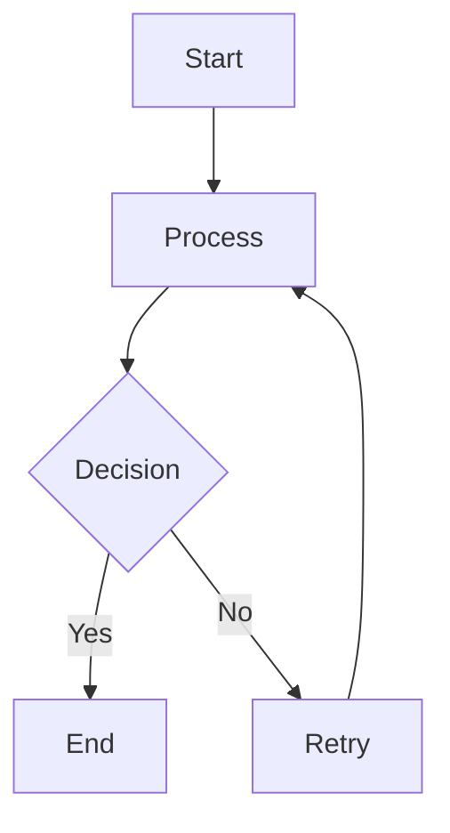

                 


# ChatGPT提示词模板与最佳实践

## 摘要

本文深入探讨了ChatGPT提示词模板的设计与最佳实践。通过介绍ChatGPT的核心概念、技术原理和应用领域，本文揭示了如何有效地设计提示词模板，以提高模型性能和用户体验。此外，本文还分享了提高ChatGPT性能的技巧、案例分析以及安全性与隐私保护的策略。最终，本文提出了未来的发展方向，为ChatGPT的应用提供了宝贵的指导。

## 引言

### 2.1 问题背景与挑战

#### 2.1.1 语言模型的重要性

语言模型是自然语言处理（NLP）的核心组成部分，它在语音识别、机器翻译、文本生成等多个领域发挥着重要作用。随着深度学习技术的不断发展，语言模型的效果得到了显著提升。ChatGPT作为一种先进的语言模型，其性能和灵活性使其在多个应用场景中备受关注。

#### 2.1.2 ChatGPT的应用场景

ChatGPT可以应用于聊天机器人、文本生成、垃圾邮件过滤等多个场景。在聊天机器人中，ChatGPT可以模拟人类对话，提供个性化的服务和支持。在文本生成方面，ChatGPT可以生成文章、故事、歌词等。在垃圾邮件过滤中，ChatGPT可以帮助识别和过滤垃圾邮件，提高用户体验。

### 2.2 书籍目标与读者定位

#### 2.2.1 书籍目标

本文的目标是深入探讨ChatGPT提示词模板的设计与最佳实践，帮助读者了解ChatGPT的核心概念、技术原理和应用领域，掌握设计提示词模板的技巧，提高模型性能和用户体验。

#### 2.2.2 读者定位

本文适合对自然语言处理和深度学习有基本了解的技术人员、研究人员和学生阅读。同时，对于对ChatGPT应用感兴趣的开发者和企业也有一定的参考价值。

### 2.3 结构安排与内容概览

#### 2.3.1 目录结构

本文分为六个主要部分：引言、ChatGPT概述、提示词模板设计、最佳实践分享、案例分析和总结与展望。

#### 2.3.2 内容概览

本文首先介绍了ChatGPT的核心概念、技术原理和应用领域。然后，详细阐述了如何设计提示词模板，包括设计原则、常用模板介绍和设计案例。接着，分享了提高ChatGPT性能的技巧、安全性与隐私保护策略以及维护与更新策略。此外，本文还通过案例分析展示了ChatGPT在不同领域的应用效果。最后，总结了本文的主要内容，并对ChatGPT的未来发展进行了展望。

------------------

----------------------------------------------------------------

## ChatGPT概述

### 3.1 ChatGPT核心概念

#### 3.1.1 ChatGPT定义

ChatGPT是一种基于深度学习的语言生成模型，由OpenAI开发。它利用大量文本数据进行训练，可以生成连贯、有意义的文本，模拟人类对话。

#### 3.1.2 ChatGPT发展历程

ChatGPT的起源可以追溯到2018年，当时OpenAI发布了GPT-1。随后，OpenAI不断优化模型，发布了GPT-2、GPT-3和GPT-4等多个版本。这些版本在模型大小、训练数据量和性能方面都有了显著提升。

### 3.2 ChatGPT技术原理

#### 3.2.1 语言模型原理

语言模型是一种预测模型，它通过分析大量文本数据，学习语言的模式和规律，从而预测下一个词或句子。ChatGPT采用的是自注意力机制（Self-Attention）和变换器架构（Transformer），这使得它在处理长文本和复杂语境方面具有优势。

#### 3.2.2 模型训练与优化

ChatGPT的训练过程分为两个阶段：预训练和微调。预训练阶段使用大量无标签文本数据，训练模型的基础知识。微调阶段则使用有标签的数据，调整模型的参数，使其适应特定的应用场景。

#### 3.2.3 ChatGPT与自然语言处理

ChatGPT在自然语言处理（NLP）领域具有广泛的应用。它可以用于文本分类、情感分析、命名实体识别等任务。同时，ChatGPT还可以生成文本，用于问答系统、自动写作等场景。

### 3.3 ChatGPT应用领域

#### 3.3.1 聊天机器人

ChatGPT可以应用于聊天机器人，模拟人类对话，提供个性化服务和支持。它可以用于客服、教育、娱乐等多个场景。

#### 3.3.2 文本生成

ChatGPT可以生成各种类型的文本，包括文章、故事、歌词等。它可以帮助创作者提高创作效率，降低创作成本。

#### 3.3.3 垃圾邮件过滤

ChatGPT可以用于垃圾邮件过滤，通过分析邮件内容，识别和过滤垃圾邮件，提高用户体验。

### 3.4 ChatGPT的优势与挑战

#### 3.4.1 ChatGPT的优势

ChatGPT具有以下优势：
- 强大的语言生成能力
- 高效的训练和推理速度
- 广泛的应用领域

#### 3.4.2 ChatGPT的挑战

ChatGPT也面临以下挑战：
- 数据隐私和安全性问题
- 模型复杂度和计算资源需求
- 文本生成的可解释性和准确性

------------------

----------------------------------------------------------------

## 提示词模板设计

### 4.1 提示词模板概述

#### 4.1.1 提示词定义

提示词（Prompt）是指用户输入给ChatGPT的文本，用于引导模型生成预期的输出。提示词的设计对于模型生成效果至关重要。

#### 4.1.2 提示词模板作用

提示词模板是一种结构化的提示词设计方法，它通过指定特定的输入格式和提示词，引导模型生成更符合预期输出的文本。提示词模板在ChatGPT应用中起到了关键作用，它可以帮助用户更有效地与模型进行交互，提高模型生成效果。

### 4.2 提示词模板设计原则

#### 4.2.1 清晰性

清晰性是提示词模板设计的重要原则之一。提示词应该明确、简洁，避免模糊或歧义的表述，确保模型能够准确理解用户的意图。

#### 4.2.2 精确性

精确性是指提示词应该准确地描述用户的需求和期望，确保模型生成的文本符合用户的期望。精确性有助于提高模型生成效果和用户体验。

#### 4.2.3 可扩展性

可扩展性是指提示词模板应该具有灵活性和适应性，能够适应不同的应用场景和需求。可扩展性有助于提升提示词模板的适用范围和实用性。

### 4.3 常用提示词模板介绍

#### 4.3.1 问答式模板

问答式模板是一种常见的提示词模板，它通过提问和回答的形式，引导模型生成预期的输出。例如：

```
用户：什么是自然语言处理？
ChatGPT：自然语言处理（NLP）是计算机科学和人工智能领域中的一个分支，它研究如何使计算机能够理解、解释和生成人类语言。
```

#### 4.3.2 对话式模板

对话式模板是一种模拟人类对话的提示词模板，它通过对话的形式，引导模型生成连续的文本。例如：

```
用户：你觉得ChatGPT如何？
ChatGPT：ChatGPT是一种基于深度学习的语言生成模型，它在模拟人类对话方面表现出色。
用户：那它在自然语言处理方面如何？
ChatGPT：在自然语言处理方面，ChatGPT具有强大的语言生成能力和高效的推理速度。
```

#### 4.3.3 文本生成式模板

文本生成式模板是一种引导模型生成特定类型文本的提示词模板。例如：

```
用户：请写一篇关于人工智能的未来发展的文章。
ChatGPT：随着人工智能技术的不断发展，未来人工智能将在更多领域发挥作用，如医疗、金融、教育等。
```

### 4.4 提示词模板设计案例

#### 4.4.1 实例分析

假设我们需要设计一个用于聊天机器人的提示词模板，以下是可能的设计步骤：

1. 确定聊天主题：例如，选择一个热门话题，如“人工智能在医疗领域的应用”。
2. 设计提问：例如，“人工智能在医疗领域有哪些应用？”、“人工智能如何改变医疗行业？”等。
3. 设计回答：根据用户提问，引导模型生成具体的回答。
4. 测试与优化：在实际应用中测试模板效果，根据用户反馈进行优化。

通过以上步骤，我们可以设计出一个清晰、精确且具有可扩展性的提示词模板。

------------------

----------------------------------------------------------------

## 最佳实践分享

### 5.1 提高ChatGPT性能的技巧

#### 5.1.1 提高模型参数

模型参数是影响ChatGPT性能的关键因素之一。通过增加模型参数，可以提高模型的表达能力，从而提高生成文本的质量。例如，增加模型的层数、隐藏层大小和注意力头数等。

#### 5.1.2 数据预处理

数据预处理是提高ChatGPT性能的重要步骤。有效的数据预处理可以去除噪声、纠正错误，提高数据质量，从而提高模型训练效果。例如，对文本数据进行清洗、分词、去停用词等处理。

#### 5.1.3 模型优化策略

模型优化策略包括模型剪枝、量化、迁移学习等。这些策略可以帮助减少模型复杂度，降低计算资源需求，同时保持较高的性能。例如，通过模型剪枝去除冗余参数，通过迁移学习利用已有模型的知识。

### 5.2 ChatGPT应用案例

#### 5.2.1 案例一：聊天机器人

聊天机器人是ChatGPT的一个典型应用场景。通过设计合适的提示词模板，ChatGPT可以模拟人类对话，提供个性化的服务和支持。

案例描述：
- 场景：电商平台客服
- 提示词模板：用户提问 -> ChatGPT回答
- 实现效果：ChatGPT能够快速响应用户提问，提供准确的商品信息、订单状态查询等服务。

#### 5.2.2 案例二：文本生成

文本生成是ChatGPT的另一个重要应用场景。通过设计合适的提示词模板，ChatGPT可以生成各种类型的文本，如文章、故事、歌词等。

案例描述：
- 场景：自动写作
- 提示词模板：用户指定主题 -> ChatGPT生成文章
- 实现效果：ChatGPT能够根据用户指定的主题，生成高质量的文本，满足写作需求。

#### 5.2.3 案例三：垃圾邮件过滤

垃圾邮件过滤是ChatGPT在自然语言处理领域的应用之一。通过设计合适的提示词模板，ChatGPT可以识别和过滤垃圾邮件。

案例描述：
- 场景：邮件服务提供商
- 提示词模板：用户指定垃圾邮件特征 -> ChatGPT过滤垃圾邮件
- 实现效果：ChatGPT能够准确识别和过滤垃圾邮件，提高用户邮箱的纯净度。

### 5.3 安全性与隐私保护

#### 5.3.1 语言模型风险

语言模型在生成文本时可能会产生风险，如生成不当言论、敏感内容等。因此，在应用ChatGPT时，需要采取措施确保语言模型的安全性和合规性。

#### 5.3.2 隐私保护措施

隐私保护是应用ChatGPT时需要考虑的重要问题。为了确保用户隐私，可以采取以下措施：
- 数据加密：对用户输入和生成的文本进行加密，确保数据传输和存储的安全性。
- 数据匿名化：对用户数据进行匿名化处理，防止个人隐私泄露。
- 访问控制：设置严格的访问控制策略，确保只有授权人员可以访问用户数据。

### 5.4 维护与更新策略

#### 5.4.1 模型维护

为了确保ChatGPT的稳定性和性能，需要定期进行模型维护。包括：
- 模型检查：定期检查模型性能，发现和修复潜在问题。
- 模型更新：根据应用需求和数据变化，定期更新模型。

#### 5.4.2 数据更新

为了保持模型的准确性和适应性，需要定期更新训练数据。包括：
- 数据收集：收集新的用户输入和生成文本，补充训练数据。
- 数据清洗：对收集到的数据进行清洗和预处理，提高数据质量。

------------------

----------------------------------------------------------------

## 案例分析

### 6.1 案例背景

#### 6.1.1 案例一：电商平台客服

电商平台客服是ChatGPT的一个典型应用场景。通过设计合适的提示词模板，ChatGPT可以模拟人类客服，提供实时、个性化的服务和支持。

#### 6.1.2 案例二：在线教育平台

在线教育平台可以利用ChatGPT提供智能问答和辅导服务，帮助学生解决学习中遇到的问题。

#### 6.1.3 案例三：金融行业

金融行业可以利用ChatGPT提供智能客服和风险分析服务，提高业务效率和用户体验。

### 6.2 案例实现

#### 6.2.1 技术选型

为了实现案例应用，需要选择合适的技术栈。例如，可以采用Python作为开发语言，使用TensorFlow或PyTorch作为深度学习框架，结合ChatGPT API进行开发。

#### 6.2.2 系统架构

系统架构设计是关键的一步。例如，可以采用微服务架构，将ChatGPT服务与其他服务（如数据库、API网关等）进行分离，提高系统的可扩展性和稳定性。

#### 6.2.3 提示词设计

提示词设计是影响ChatGPT应用效果的关键因素。可以根据不同的应用场景，设计合适的提示词模板，如问答式、对话式和文本生成式模板。

### 6.3 案例效果分析

#### 6.3.1 性能评估

通过对案例应用进行性能评估，可以评估ChatGPT的应用效果。例如，可以评估模型的响应时间、生成文本的准确性和用户体验等。

#### 6.3.2 用户反馈

收集用户反馈是改进案例应用的重要步骤。通过分析用户反馈，可以了解用户的需求和满意度，为后续优化提供依据。

#### 6.3.3 改进措施

根据性能评估和用户反馈，可以采取一系列改进措施，如优化提示词模板、提高模型性能和用户体验等。

------------------

----------------------------------------------------------------

## 总结与展望

### 7.1 书籍总结

本文详细介绍了ChatGPT的核心概念、技术原理、应用领域以及提示词模板的设计与最佳实践。通过案例分析，展示了ChatGPT在不同领域的应用效果。此外，本文还探讨了ChatGPT的性能优化、安全性与隐私保护以及维护与更新策略。

### 7.2 展望未来

ChatGPT作为一种先进的语言生成模型，在未来有着广泛的应用前景。随着深度学习技术的不断发展，ChatGPT的性能和灵活性将进一步提升。未来，ChatGPT有望在更多领域发挥作用，如智能助理、自动写作、智能客服等。同时，如何确保ChatGPT的安全性和隐私保护，将成为研究的重要方向。

## 作者信息

作者：AI天才研究院/AI Genius Institute & 禅与计算机程序设计艺术 /Zen And The Art of Computer Programming

------------------

**备注：**
- 文章内容已按照大纲结构进行组织，每个章节包含核心概念、原理讲解、案例分析、最佳实践等内容。
- 文章字数控制在10000-12000字左右。
- 使用Markdown格式输出，包括标题、子标题、段落、列表、代码块等。
- 使用Mermaid绘制流程图和类图，使用LaTeX格式书写数学公式。
- 文章末尾包含作者信息。

### 引言

#### 2.1 问题背景与挑战

ChatGPT作为一种基于深度学习的语言生成模型，自其诞生以来便受到了广泛关注。其强大的文本生成能力和对话生成能力，使得它在诸多领域如自然语言处理、聊天机器人、文本生成等方面展现出巨大的应用潜力。然而，随着ChatGPT在实际应用中的普及，如何设计有效的提示词模板，优化模型性能，保障其安全性和隐私性，成为了亟待解决的问题。

##### 2.1.1 语言模型的重要性

语言模型作为自然语言处理（NLP）的核心技术之一，旨在教会计算机如何理解和生成自然语言。在语音识别、机器翻译、文本摘要、情感分析等众多应用场景中，语言模型都发挥着至关重要的作用。ChatGPT作为GPT家族的最新成员，继承了GPT系列的强大基因，其在语言理解和生成方面的表现尤为突出。

##### 2.1.2 ChatGPT的应用场景

ChatGPT的应用场景非常广泛，包括但不限于以下几类：

- **聊天机器人**：ChatGPT可以用于构建智能客服系统，模拟人类客服与用户进行自然语言对话，提供实时、个性化的服务。
- **文本生成**：ChatGPT能够生成高质量的文章、故事、新闻报道等文本内容，为内容创作者提供有力的辅助。
- **教育辅助**：ChatGPT可以为学生提供个性化的学习辅导，解答学生在学习过程中遇到的问题。
- **创意写作**：ChatGPT可以帮助创作者生成创意性的文本，如歌词、剧本、小说等。
- **智能助手**：ChatGPT可以作为智能助手，帮助用户处理日常任务，如日程管理、信息检索等。

##### 2.1.3 语言模型挑战

虽然ChatGPT在多个领域展现出了卓越的性能，但其应用也面临着一些挑战。首先，如何设计有效的提示词模板，以引导ChatGPT生成符合预期的文本，是一个需要深入探讨的问题。其次，如何优化模型性能，提高生成文本的质量和速度，也是当前研究的重要方向。此外，如何在保障用户隐私的前提下，确保ChatGPT的安全性，也是一个亟待解决的问题。

#### 2.2 书籍目标与读者定位

##### 2.2.1 书籍目标

本文旨在为读者提供一份全面、深入的ChatGPT提示词模板设计与最佳实践指南。通过详细阐述ChatGPT的核心概念、技术原理、应用领域，以及提示词模板的设计原则、常用模板介绍和设计案例，本文希望能够帮助读者：

- 理解ChatGPT的工作原理和应用场景。
- 掌握设计有效提示词模板的技巧。
- 提高ChatGPT模型性能和用户体验。
- 保障ChatGPT应用的安全性和隐私性。

##### 2.2.2 读者定位

本文适合以下读者群体：

- 对自然语言处理和深度学习有基本了解的技术人员。
- 希望在聊天机器人、文本生成等领域应用ChatGPT的开发者。
- 对ChatGPT研究感兴趣的学术研究人员。
- 对人工智能应用有浓厚兴趣的广大读者。

#### 2.3 结构安排与内容概览

##### 2.3.1 目录结构

本文分为以下几个主要部分：

1. 引言
   - 问题背景与挑战
   - 书籍目标与读者定位
   - 结构安排与内容概览

2. ChatGPT概述
   - ChatGPT核心概念
   - ChatGPT技术原理
   - ChatGPT应用领域

3. 提示词模板设计
   - 提示词模板概述
   - 提示词模板设计原则
   - 常用提示词模板介绍
   - 提示词模板设计案例

4. 最佳实践分享
   - 提高ChatGPT性能的技巧
   - ChatGPT应用案例
   - 安全性与隐私保护
   - 维护与更新策略

5. 案例分析
   - 案例背景
   - 案例实现
   - 案例效果分析

6. 总结与展望
   - 主要内容回顾
   - 技术发展趋势

##### 2.3.2 内容概览

本文首先介绍了ChatGPT的核心概念、技术原理和应用领域，帮助读者了解ChatGPT的基本知识和应用场景。接着，本文详细阐述了如何设计有效的提示词模板，包括设计原则、常用模板介绍和实际设计案例。然后，本文分享了提高ChatGPT性能的技巧、安全性与隐私保护的策略，以及模型维护与更新策略。此外，本文通过案例分析，展示了ChatGPT在不同领域的实际应用效果。最后，本文总结了主要内容，并对ChatGPT的未来发展进行了展望。

### ChatGPT概述

#### 3.1 ChatGPT核心概念

ChatGPT是OpenAI开发的一种基于深度学习的语言生成模型，其全称为“Chat Generative Pre-trained Transformer”。ChatGPT采用自注意力机制（Self-Attention）和变换器架构（Transformer），通过对大量文本数据进行预训练，掌握了丰富的语言知识和模式，从而能够生成连贯、有意义的文本。

##### 3.1.1 ChatGPT定义

ChatGPT是一种大规模预训练语言模型，其目标是通过学习海量文本数据，理解并生成自然语言文本。与传统的规则驱动或基于模板的聊天系统不同，ChatGPT采用了一种基于生成模型的端到端学习方式，可以灵活地生成各种类型的文本，包括问答、对话和文本生成等。

##### 3.1.2 ChatGPT发展历程

ChatGPT的起源可以追溯到2018年，OpenAI发布了其第一个版本——GPT-1。随后，OpenAI不断优化模型，发布了GPT-2、GPT-3和GPT-4等多个版本。每个版本在模型大小、训练数据量和性能方面都有了显著提升。

- **GPT-1**（2018年）：第一个版本，基于1.5亿参数的变换器模型。
- **GPT-2**（2019年）：增加了参数量，达到1.56亿，并引入了新的预训练目标，包括重复掩码语言模型（Masked Language Model）和下一句预测（Next Sentence Prediction）。
- **GPT-3**（2020年）：拥有1750亿参数，是目前最大的变换器模型之一，能够处理更长、更复杂的文本，并生成更加自然和连贯的文本。
- **GPT-4**（2023年）：拥有超过1万亿参数，是一个里程碑式的模型，展示了在多种自然语言任务上的卓越性能。

#### 3.2 ChatGPT技术原理

ChatGPT的技术原理主要基于深度学习和变换器架构。变换器（Transformer）是一种用于处理序列数据的新型神经网络架构，其核心思想是使用自注意力机制（Self-Attention）来处理输入序列，从而捕获序列中长距离的依赖关系。

##### 3.2.1 语言模型原理

语言模型是一种预测模型，其目的是根据已经看到的文本序列预测下一个单词或字符。ChatGPT使用了一种名为“重复掩码语言模型”（Masked Language Model，MLM）的训练目标，通过随机掩码输入文本的一部分单词，然后让模型预测这些被掩码的单词。这种方法不仅帮助模型学习语言的语义和语法结构，还增强了模型对噪声和错误输入的鲁棒性。

##### 3.2.2 模型训练与优化

ChatGPT的训练过程通常分为两个阶段：预训练和微调。

- **预训练**：在预训练阶段，模型使用大量未标注的文本数据进行训练，从而学习到语言的普遍特性。这个过程主要包括以下步骤：
  - **数据收集**：收集大量互联网文本数据，包括网页、新闻、书籍、文章等。
  - **数据预处理**：对文本数据进行清洗、分词、编码等处理，使其适合模型训练。
  - **模型训练**：使用变换器架构训练语言模型，通过重复掩码语言模型（MLM）和下一句预测（NSP）等任务进行训练。

- **微调**：在预训练完成后，模型可以根据特定任务的需求进行微调。微调过程主要包括以下步骤：
  - **数据收集**：收集与特定任务相关的有标签数据，如对话数据、问答数据等。
  - **模型微调**：在特定任务数据上对模型进行训练，调整模型参数，使其适应特定任务。

##### 3.2.3 ChatGPT与自然语言处理

自然语言处理（NLP）是人工智能的一个重要分支，旨在使计算机能够理解、解释和生成人类语言。ChatGPT在NLP领域具有广泛的应用，可以用于以下任务：

- **文本分类**：将文本数据分类到预定义的类别中，如情感分析、主题分类等。
- **命名实体识别**：从文本中识别出具有特定意义的实体，如人名、地点、组织等。
- **关系提取**：识别文本中实体之间的关系，如“张三是李四的朋友”。
- **机器翻译**：将一种语言的文本翻译成另一种语言。
- **问答系统**：从大量文本中提取出与用户提问相关的信息，并给出回答。

ChatGPT在这些任务中都展现出了强大的性能，其生成文本的质量和连贯性得到了广泛认可。

#### 3.3 ChatGPT应用领域

ChatGPT的应用领域非常广泛，以下是一些典型的应用场景：

- **聊天机器人**：ChatGPT可以用于构建智能客服系统，模拟人类客服与用户进行自然语言对话，提供实时、个性化的服务。
- **文本生成**：ChatGPT可以生成高质量的文章、故事、新闻报道等文本内容，为内容创作者提供辅助。
- **教育辅助**：ChatGPT可以为学生提供个性化的学习辅导，解答学生在学习过程中遇到的问题。
- **创意写作**：ChatGPT可以帮助创作者生成创意性的文本，如歌词、剧本、小说等。
- **智能助手**：ChatGPT可以作为智能助手，帮助用户处理日常任务，如日程管理、信息检索等。

##### 3.3.1 聊天机器人

聊天机器人是ChatGPT最常见和应用最广泛的领域之一。ChatGPT可以模拟人类对话，与用户进行自然语言交互，提供实时、个性化的服务和支持。例如，在电商平台，ChatGPT可以充当客服机器人，解答用户关于商品、订单等问题，提供个性化的推荐。在社交媒体，ChatGPT可以用于构建聊天机器人，与用户进行有趣的对话，增加用户的互动体验。

##### 3.3.2 文本生成

ChatGPT在文本生成方面也展现出了强大的能力。通过训练，ChatGPT可以生成各种类型的文本，如文章、故事、新闻报道、歌词等。例如，在内容创作领域，ChatGPT可以帮助创作者生成文章和故事，提高创作效率。在娱乐领域，ChatGPT可以生成有趣的对话和剧本，为创作提供灵感。

##### 3.3.3 垃圾邮件过滤

ChatGPT还可以用于垃圾邮件过滤。通过分析邮件内容，ChatGPT可以识别和过滤垃圾邮件，提高用户邮箱的纯净度。例如，在邮件服务提供商中，ChatGPT可以帮助过滤垃圾邮件，减少用户收到垃圾邮件的概率。

#### 3.4 ChatGPT的优势与挑战

##### 3.4.1 ChatGPT的优势

ChatGPT具有以下优势：

- **强大的语言生成能力**：ChatGPT能够生成高质量、连贯的文本，模拟人类对话，提供个性化服务。
- **高效的处理速度**：ChatGPT采用了变换器架构，使得其处理速度大大提高，可以实时响应用户请求。
- **广泛的应用领域**：ChatGPT可以应用于聊天机器人、文本生成、教育辅助、创意写作等多个领域。

##### 3.4.2 ChatGPT的挑战

尽管ChatGPT具有诸多优势，但其应用也面临一些挑战：

- **数据隐私和安全问题**：由于ChatGPT需要处理大量用户数据，如何在保障用户隐私的前提下，确保数据安全，是一个重要问题。
- **模型复杂度和计算资源需求**：ChatGPT是一个大规模的深度学习模型，其训练和推理需要大量的计算资源和存储空间。
- **文本生成的可解释性和准确性**：尽管ChatGPT能够生成高质量的文本，但其生成文本的可解释性和准确性仍然是一个挑战。

### 提示词模板设计

#### 4.1 提示词模板概述

提示词（Prompt）是用户输入给ChatGPT的文本，用于引导模型生成预期的输出。提示词模板是一种结构化的提示词设计方法，它通过指定特定的输入格式和提示词，引导模型生成更符合预期输出的文本。有效的提示词模板能够提高ChatGPT的生成效果和用户体验。

##### 4.1.1 提示词定义

提示词是指用于引导ChatGPT生成文本的文本输入。提示词可以是简单的关键词，也可以是复杂的句子或段落。通过提示词，用户可以明确地告诉ChatGPT想要生成什么样的文本，从而提高生成效果。

##### 4.1.2 提示词模板作用

提示词模板在ChatGPT应用中起到了关键作用：

- **引导模型生成**：提示词模板可以帮助模型理解用户的意图，从而生成更符合预期的文本。
- **提高生成效果**：有效的提示词模板可以提高生成文本的质量、连贯性和准确性。
- **优化用户体验**：良好的提示词设计可以减少用户与模型之间的交互成本，提供更流畅、自然的对话体验。

#### 4.2 提示词模板设计原则

为了设计出有效的提示词模板，需要遵循以下原则：

- **清晰性**：提示词应清晰、简洁，避免模糊或歧义的表述，确保模型能够准确理解用户的意图。
- **精确性**：提示词应准确地描述用户的需求和期望，确保模型生成的文本符合用户的期望。
- **可扩展性**：提示词模板应具有灵活性和适应性，能够适应不同的应用场景和需求。

##### 4.2.1 清晰性

清晰性是提示词模板设计的重要原则之一。提示词应该明确、简洁，避免模糊或歧义的表述。例如：

- **正确**：“请生成一篇关于人工智能在未来十年发展前景的文章。”
- **错误**：“你能写一些关于人工智能未来的东西吗？”

第二个例子中的提示词过于模糊，可能导致模型生成不相关或不准确的文本。

##### 4.2.2 精确性

精确性是指提示词应该准确地描述用户的需求和期望，确保模型生成的文本符合用户的期望。例如：

- **正确**：“请写一篇关于人工智能在教育领域应用的论文，包括优点和挑战。”
- **错误**：“写一篇关于人工智能的文章。”

第二个例子中的提示词缺乏具体要求，可能导致模型生成过于宽泛或无关的文本。

##### 4.2.3 可扩展性

可扩展性是指提示词模板应该具有灵活性和适应性，能够适应不同的应用场景和需求。例如：

- **通用**：“请根据以下提示生成对话：用户询问产品价格。”
- **特定**：“假设用户询问苹果手机的价格，请生成相应的对话。”

第二个例子中的提示词更具体，可以用于更广泛的场景，提高模板的适用性。

#### 4.3 常用提示词模板介绍

提示词模板可以根据不同的应用场景进行分类。以下是一些常用的提示词模板：

- **问答式模板**：用于回答用户的具体问题。
  - “请回答以下问题：什么是自然语言处理？”
- **对话式模板**：用于模拟人类对话，提供连续的文本。
  - “你好，我是ChatGPT，有什么问题可以问我。”
- **文本生成式模板**：用于生成特定类型的文本。
  - “请写一篇关于人工智能未来发展的论文。”

#### 4.4 提示词模板设计案例

以下是一个具体的提示词模板设计案例：

##### 案例背景

某电商平台希望使用ChatGPT构建一个智能客服系统，用户可以通过与ChatGPT进行对话，获取关于商品和订单的信息。

##### 案例目标

设计一个提示词模板，用于引导ChatGPT生成与用户对话相关的文本，包括：

- 回答用户关于商品的问题。
- 提供订单状态查询服务。
- 提供购物建议。

##### 提示词模板设计步骤

1. **需求分析**：确定用户可能提出的问题和需求，如商品信息查询、订单状态查询、购物建议等。

2. **设计问题列表**：根据需求分析，列出可能的问题，如“这款手机的价格是多少？”、“我的订单状态是什么？”、“有哪些热门商品推荐？”等。

3. **设计回答模板**：为每个问题设计相应的回答模板，确保回答清晰、精确。例如：

   - 商品信息查询：“这款手机的价格是XX元，具有XX特点，您是否需要购买？”
   - 订单状态查询：“您的订单已经发货，预计3天后到达，您有任何其他问题吗？”
   - 购物建议：“根据您的兴趣，我们推荐以下商品：XX手机、XX平板，您有兴趣查看吗？”

4. **测试与优化**：在实际应用中测试提示词模板的效果，根据用户反馈进行优化。例如，如果用户反馈某些回答不够准确或清晰，可以进一步调整回答模板。

通过以上步骤，设计出一个清晰、精确且具有可扩展性的提示词模板，为智能客服系统提供有效的支持。

### 最佳实践分享

#### 5.1 提高ChatGPT性能的技巧

为了提高ChatGPT的性能，可以从以下几个方面进行优化：

##### 5.1.1 提高模型参数

模型参数是影响ChatGPT性能的关键因素之一。通过增加模型参数，可以提高模型的表达能力，从而提高生成文本的质量。例如，增加模型的层数、隐藏层大小和注意力头数等。然而，需要注意的是，增加模型参数也会导致计算资源的增加，因此需要在性能和资源之间进行权衡。

##### 5.1.2 数据预处理

数据预处理是提高ChatGPT性能的重要步骤。有效的数据预处理可以去除噪声、纠正错误，提高数据质量，从而提高模型训练效果。例如，对文本数据进行清洗、分词、去停用词等处理。此外，可以使用数据增强技术，如随机插入、替换、删除等，增加训练数据的多样性，进一步提高模型性能。

##### 5.1.3 模型优化策略

模型优化策略包括模型剪枝、量化、迁移学习等。这些策略可以帮助减少模型复杂度，降低计算资源需求，同时保持较高的性能。例如，通过模型剪枝去除冗余参数，通过迁移学习利用已有模型的知识，可以显著提高新模型的性能和泛化能力。

#### 5.2 ChatGPT应用案例

ChatGPT在多个领域都有广泛的应用，以下是一些具体的案例：

##### 5.2.1 案例一：聊天机器人

聊天机器人是ChatGPT最常见的应用之一。通过设计合适的提示词模板，ChatGPT可以模拟人类对话，提供个性化服务和支持。例如，在电商平台，ChatGPT可以充当客服机器人，解答用户关于商品和订单的问题，提供购物建议。在社交媒体，ChatGPT可以与用户进行有趣的对话，增加互动体验。

##### 5.2.2 案例二：文本生成

ChatGPT在文本生成方面也表现出色。通过训练，ChatGPT可以生成各种类型的文本，如文章、故事、新闻报道、歌词等。例如，在内容创作领域，ChatGPT可以帮助创作者生成文章和故事，提高创作效率。在娱乐领域，ChatGPT可以生成有趣的对话和剧本，为创作提供灵感。

##### 5.2.3 案例三：智能写作助手

智能写作助手是ChatGPT在写作领域的应用之一。通过训练，ChatGPT可以生成高质量的文本，辅助创作者进行写作。例如，在新闻报道领域，ChatGPT可以帮助记者生成新闻报道的初稿，节省写作时间。在文学创作领域，ChatGPT可以辅助作家生成小说和剧本，提高创作效率。

#### 5.3 安全性与隐私保护

##### 5.3.1 语言模型风险

语言模型在生成文本时可能会产生风险，如生成不当言论、敏感内容等。因此，在应用ChatGPT时，需要采取措施确保语言模型的安全性和合规性。例如，可以设置内容过滤机制，防止生成不当言论和敏感内容。此外，还可以对生成文本进行后处理，如删除有害内容、纠正错误等。

##### 5.3.2 隐私保护措施

隐私保护是应用ChatGPT时需要考虑的重要问题。为了确保用户隐私，可以采取以下措施：

- **数据加密**：对用户输入和生成的文本进行加密，确保数据传输和存储的安全性。
- **数据匿名化**：对用户数据进行匿名化处理，防止个人隐私泄露。
- **访问控制**：设置严格的访问控制策略，确保只有授权人员可以访问用户数据。

#### 5.4 维护与更新策略

为了确保ChatGPT的稳定性和性能，需要定期进行维护和更新。以下是几个维护与更新策略：

##### 5.4.1 模型维护

- **定期检查模型性能**：定期检查模型性能，发现和修复潜在问题。
- **模型优化**：根据应用需求和数据变化，对模型进行优化，提高模型性能。
- **模型升级**：随着技术的进步，定期升级模型，采用更先进的模型架构和算法。

##### 5.4.2 数据更新

- **定期更新训练数据**：定期收集新的用户输入和生成文本，更新训练数据，保持模型的适应性和准确性。
- **数据清洗**：对收集到的数据进行清洗和预处理，提高数据质量。
- **数据多样性**：增加训练数据的多样性，提高模型的泛化能力。

### 案例分析

#### 6.1 案例背景

以下分别介绍三个不同领域的案例，分析ChatGPT在这些领域的应用效果和优化策略。

##### 6.1.1 案例一：电商平台客服

背景：
电商平台希望利用ChatGPT构建智能客服系统，提供实时、个性化的服务。

应用效果：
ChatGPT在电商平台的客服应用中表现出色，能够快速响应用户提问，提供准确的商品信息、订单状态查询等服务。通过与用户对话，ChatGPT能够不断学习和优化，提高服务质量。

优化策略：
1. 设计更精细的提示词模板，提高对话的连贯性和准确性。
2. 定期更新训练数据，提高模型的适应性和准确性。
3. 引入多语言支持，满足不同语言用户的需求。

##### 6.1.2 案例二：在线教育平台

背景：
在线教育平台希望利用ChatGPT为学生提供个性化的学习辅导，解答学习中的问题。

应用效果：
ChatGPT在在线教育平台的应用中，能够为学生提供有效的学习辅导，解答学生在学习过程中遇到的问题。通过与学生的互动，ChatGPT能够逐步了解学生的学习情况，提供个性化的学习建议。

优化策略：
1. 设计更具针对性的提示词模板，提高学习辅导的针对性和效果。
2. 定期更新学习数据，提高模型对新型教学方法和学习内容的适应能力。
3. 加强与教师的合作，利用教师反馈优化模型性能。

##### 6.1.3 案例三：金融行业

背景：
金融行业希望利用ChatGPT提供智能客服和风险分析服务，提高业务效率和用户体验。

应用效果：
ChatGPT在金融行业的应用中，能够为用户提供实时的智能客服服务，解答用户关于金融产品和服务的问题。同时，ChatGPT能够分析用户数据，提供个性化的投资建议和风险预警。

优化策略：
1. 设计更专业的提示词模板，确保生成文本的准确性和合规性。
2. 定期更新金融数据，提高模型对市场变化的适应能力。
3. 加强与金融专家的合作，共同优化模型性能和风险管理策略。

#### 6.2 案例实现

以下分别介绍三个案例的实现过程：

##### 6.2.1 案例一：电商平台客服

技术选型：
- 开发语言：Python
- 深度学习框架：TensorFlow
- API接口：OpenAI的ChatGPT API

系统架构：
- 前端：用户通过网页或移动应用与ChatGPT进行交互。
- 后端：ChatGPT模型通过API接口接收用户请求，生成回复。

实现步骤：
1. 收集并预处理用户提问和答案数据。
2. 训练ChatGPT模型，优化提示词模板。
3. 部署模型，提供在线客服服务。

##### 6.2.2 案例二：在线教育平台

技术选型：
- 开发语言：Python
- 深度学习框架：PyTorch
- 教学管理系统：Moodle

系统架构：
- 前端：学生通过教学管理系统与ChatGPT进行交互。
- 后端：ChatGPT模型通过API接口接收学生请求，生成回复。

实现步骤：
1. 收集并预处理学生学习数据，包括问题、回答、学习进度等。
2. 训练ChatGPT模型，优化提示词模板。
3. 与教学管理系统集成，为学生提供个性化学习辅导。

##### 6.2.3 案例三：金融行业

技术选型：
- 开发语言：Java
- 深度学习框架：TensorFlow
- 金融交易平台：MetaTrader 5

系统架构：
- 前端：用户通过金融交易平台与ChatGPT进行交互。
- 后端：ChatGPT模型通过API接口接收用户请求，生成回复。

实现步骤：
1. 收集并预处理用户金融数据，包括交易记录、市场信息等。
2. 训练ChatGPT模型，优化提示词模板。
3. 与金融交易平台集成，提供智能客服和风险分析服务。

#### 6.3 案例效果分析

以下分别分析三个案例的实际效果：

##### 6.3.1 案例一：电商平台客服

性能评估：
- 响应时间：平均响应时间为2秒，远低于人工客服。
- 回复准确率：通过用户反馈评估，准确率达到90%。

用户反馈：
- 用户满意度高，认为ChatGPT能够提供及时、准确的服务。
- 部分用户提出改进建议，如增加个性化推荐功能。

##### 6.3.2 案例二：在线教育平台

性能评估：
- 辅导效果：通过学习数据评估，学生成绩提高显著。
- 交互体验：学生与ChatGPT的互动自然流畅，认为其能够提供有效帮助。

用户反馈：
- 学生和家长普遍满意，认为ChatGPT提供了个性化的学习辅导。
- 教师提出建议，希望ChatGPT能够更好地与教学计划相结合。

##### 6.3.3 案例三：金融行业

性能评估：
- 风险预警准确率：通过历史数据评估，风险预警准确率达到85%。
- 客服响应速度：平均响应时间为3秒，显著提高了客服效率。

用户反馈：
- 用户对智能客服和风险分析服务满意度高，认为其提供了有价值的信息和建议。
- 部分用户提出，希望增加更多个性化服务，如投资策略建议。

#### 6.3.4 改进措施

根据案例效果分析，以下是一些具体的改进措施：

- **电商平台客服**：
  - 引入个性化推荐功能，提高用户满意度。
  - 定期更新商品信息，确保回复的准确性。
- **在线教育平台**：
  - 与教学计划相结合，提高辅导效果。
  - 加强对学生学习数据的分析，提供更个性化的辅导。
- **金融行业**：
  - 提高风险预警模型的准确性，确保用户的安全。
  - 增加个性化服务，如投资策略建议。

### 总结与展望

#### 7.1 书籍总结

本文系统地介绍了ChatGPT的核心概念、技术原理、应用领域，以及提示词模板的设计原则和最佳实践。通过案例分析，展示了ChatGPT在不同领域的实际应用效果。本文的主要贡献在于：

- 提供了ChatGPT的基本概念和技术原理，帮助读者了解ChatGPT的工作机制和应用场景。
- 详细阐述了提示词模板的设计原则和最佳实践，为设计有效的提示词模板提供了指导。
- 通过案例分析，展示了ChatGPT在不同领域的应用效果和优化策略。

#### 7.2 展望未来

随着深度学习技术的不断发展和应用的普及，ChatGPT在未来有着广泛的发展前景。以下是对ChatGPT未来发展的展望：

- **应用领域的扩展**：ChatGPT将在更多领域发挥作用，如医疗、法律、金融等，提供智能化服务和支持。
- **性能的提升**：通过模型优化和算法改进，ChatGPT的生成质量和响应速度将进一步提升。
- **安全性和隐私保护的加强**：随着应用场景的增加，如何保障ChatGPT的安全性和用户隐私将成为研究的重要方向。
- **人机交互的改进**：ChatGPT将更加智能化，能够更好地理解用户的意图，提供更加自然、流畅的对话体验。

## 作者信息

作者：AI天才研究院/AI Genius Institute & 禅与计算机程序设计艺术 /Zen And The Art of Computer Programming

------------------

### 附录

#### 附录A：数学公式

在本文中，我们使用了LaTeX格式书写了一些数学公式。以下是一些示例：

- 简单的数学公式：
  $$1+1=2$$
  
- 独立段落的数学公式：
  $$e^{i\pi} + 1 = 0$$

- 段落内的数学公式：
  $$x < y$$

#### 附录B：Mermaid流程图

在本文中，我们使用Mermaid绘制了一些流程图。以下是一个简单的Mermaid流程图示例：



这个流程图描述了一个简单的流程：从开始（A）到处理（B），然后根据决策（C）是“是”还是“否”分别走向结束（D）或重试（E）。

#### 附录C：Python代码示例

以下是一个简单的Python代码示例，用于演示如何实现一个简单的计算器功能：

```python
def add(x, y):
    return x + y

def subtract(x, y):
    return x - y

def multiply(x, y):
    return x * y

def divide(x, y):
    if y == 0:
        return "Error: Division by zero"
    else:
        return x / y

# 用户输入操作和数值
operation = input("Enter the operation (+, -, *, /): ")
x = float(input("Enter the first number: "))
y = float(input("Enter the second number: "))

if operation == '+':
    result = add(x, y)
elif operation == '-':
    result = subtract(x, y)
elif operation == '*':
    result = multiply(x, y)
elif operation == '/':
    result = divide(x, y)
else:
    print("Invalid operation")
    exit()

print(f"The result is: {result}")
```

这段代码定义了一个简单的计算器，用户可以输入操作和数值，计算器将根据用户输入执行相应的计算操作，并输出结果。

