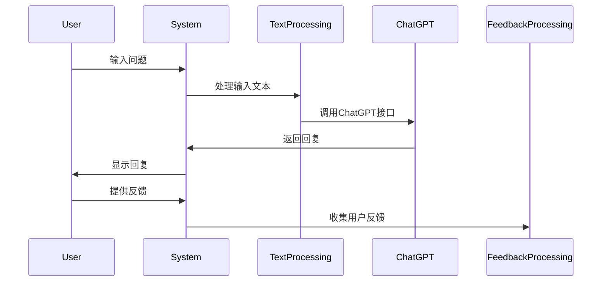

                 


### ChatGPT提示词模板：快速上手指南

关键词：ChatGPT、提示词模板、自然语言处理、生成式预训练模型、文本生成

摘要：本文将为您提供一个全面的ChatGPT提示词模板编写指南，帮助您快速掌握ChatGPT的使用技巧，从而在各类应用场景中发挥其最大潜力。

## 第1章：背景介绍

### 1.1.1 问题背景

ChatGPT作为一种基于大规模语言模型的人工智能助手，其成功离不开近年来人工智能技术的发展和大数据的积累。随着深度学习技术的不断进步，尤其是生成式预训练模型（GPT）的兴起，使得人工智能在自然语言处理领域取得了重大突破。ChatGPT的出现，为企业和开发者带来了新的机遇和挑战。如何有效地使用ChatGPT，尤其是如何为ChatGPT编写高效的提示词模板，成为企业和开发者面临的新挑战。

### 1.1.2 问题描述

ChatGPT提示词模板的编写不仅需要理解模型的运作原理，还需要具备一定的自然语言处理和编程能力。一个有效的提示词模板能够引导ChatGPT生成更加准确、有用的回复。然而，现有资料中对提示词模板的讲解较为零散，缺乏系统性的指导，导致许多开发者在使用ChatGPT时感到困惑。

### 1.1.3 问题解决

本书旨在为开发者提供一套完整的ChatGPT提示词模板编写指南，包括从基础理论到高级应用的各个方面。通过本书的学习，读者将能够掌握ChatGPT的运作机制，学会如何编写有效的提示词模板，从而在各类应用场景中发挥ChatGPT的最大潜力。

### 1.1.4 边界与外延

本书主要关注的是文本生成领域中的ChatGPT应用，不涉及其他类型的人工智能模型。此外，本书将主要讨论ChatGPT在商业、教育、医疗等领域的应用实例，为开发者提供具体的实战经验。

### 1.1.5 概念结构与核心要素组成

ChatGPT提示词模板的核心要素包括：输入文本、回复格式、上下文信息、目标输出等。理解这些要素之间的相互关系是编写高效提示词模板的关键。

## 第2章：核心概念与联系

### 2.1.1 ChatGPT原理

ChatGPT基于GPT-3模型，是一种生成式预训练模型，其核心原理是通过大规模数据预训练，使其具备强大的语言理解和生成能力。ChatGPT的工作流程主要包括输入处理、文本生成和结果校验等步骤。

### 2.1.2 提示词模板

提示词模板是指导ChatGPT生成回复的关键，它包括输入文本、问题标签、上下文信息和期望输出等要素。一个高效的提示词模板能够引导ChatGPT生成更符合预期的回复。

### 2.1.3 提示词模板的属性特征对比

| 特征             | 描述                                                     |
|------------------|----------------------------------------------------------|
| 输入文本         | 提供ChatGPT理解的上下文信息。                             |
| 问题标签         | 标识ChatGPT需要解决的问题类型。                           |
| 上下文信息       | 提供与问题相关的额外信息，帮助ChatGPT生成更准确的回复。   |
| 期望输出         | 指定ChatGPT生成的回复类型和格式。                         |

### 2.1.4 ER实体关系图架构

```mermaid
erDiagram
    InputText ||--|{ ChatGPT }|| Response
    ContextInfo ||--|{ ChatGPT }|| Response
    ExpectedOutput ||--|{ ChatGPT }|| Response
```

## 第3章：算法原理讲解

### 3.1.1 ChatGPT文本生成流程

ChatGPT的文本生成过程可以分为以下几个步骤：

1. **输入处理**：接收用户输入的文本，并将其转换为模型能够处理的格式。
2. **文本编码**：使用预训练的编码器将输入文本转换为向量表示。
3. **文本生成**：解码器根据编码后的向量生成文本。
4. **结果校验**：对生成的文本进行校验，确保其符合预期的格式和内容。

### 3.1.2 Python源代码实现

```python
import openai

def generate_response(prompt):
    response = openai.Completion.create(
        engine="text-davinci-003",
        prompt=prompt,
        max_tokens=50
    )
    return response.choices[0].text.strip()

# 测试
prompt = "请描述一下您今天的工作计划。"
print(generate_response(prompt))
```

## 第4章：系统分析与架构设计

### 4.1 问题场景介绍

本章节将介绍一个典型的ChatGPT应用场景——智能客服系统。该系统旨在为企业提供7x24小时的客户服务，通过自然语言交互解决客户的问题。

### 4.2 项目介绍

项目名称：智能客服系统（Intelligent Customer Service System，ICSS）

项目目标：构建一个高效、智能的客服系统，提高客户满意度，降低企业运营成本。

### 4.3 系统功能设计

系统功能设计包括以下几个模块：

1. **用户输入模块**：接收用户的输入信息，包括文本、图片、语音等。
2. **文本处理模块**：对用户输入的文本进行处理，提取关键信息，为ChatGPT生成回复做准备。
3. **ChatGPT模块**：调用ChatGPT接口，生成智能回复。
4. **回复生成模块**：根据ChatGPT的回复，生成符合企业风格和要求的回复文本。
5. **用户反馈模块**：收集用户对回复的反馈，用于优化ChatGPT的回复质量。

### 4.4 系统架构设计

系统架构设计采用分层架构，包括以下几层：

1. **用户层**：提供用户交互界面，包括网页、移动端APP等。
2. **应用层**：实现系统的核心功能，包括文本处理、ChatGPT调用、回复生成等。
3. **数据层**：存储用户输入、回复、反馈等数据，支持数据的查询、更新、删除等操作。

### 4.5 系统接口设计

系统接口设计主要包括以下接口：

1. **用户输入接口**：接收用户输入，包括文本、图片、语音等。
2. **文本处理接口**：处理用户输入的文本，提取关键信息。
3. **ChatGPT接口**：调用ChatGPT接口，生成智能回复。
4. **回复生成接口**：根据ChatGPT的回复，生成符合企业风格的回复文本。
5. **用户反馈接口**：收集用户对回复的反馈，用于优化ChatGPT的回复质量。

### 4.6 系统交互

系统交互设计采用Mermaid序列图表示，如下所示：



## 第5章：项目实战

### 5.1 环境安装

在开始项目实战之前，首先需要安装ChatGPT的API接口。以下是安装步骤：

1. 安装Python环境，版本要求为3.7及以上。
2. 安装openai库，使用命令：`pip install openai`。

### 5.2 系统核心实现源代码

以下是一个简单的ChatGPT智能客服系统的源代码：

```python
import openai

def generate_response(prompt):
    response = openai.Completion.create(
        engine="text-davinci-003",
        prompt=prompt,
        max_tokens=50
    )
    return response.choices[0].text.strip()

def handle_user_input():
    prompt = input("请输入您的问题：")
    response = generate_response(prompt)
    print("回复：", response)

if __name__ == "__main__":
    handle_user_input()
```

### 5.3 代码应用解读与分析

本段代码首先定义了一个`generate_response`函数，用于调用ChatGPT接口生成回复。`handle_user_input`函数则负责接收用户输入，并调用`generate_response`函数生成回复，最后将回复输出到控制台。

### 5.4 实际案例分析和详细讲解剖析

以一个实际案例为例，假设用户输入问题：“我最近想换手机，有什么推荐吗？”

ChatGPT生成的回复可能如下：

```
推荐您可以考虑以下几款手机：
1. 苹果iPhone 13：性能强大，拍照优秀。
2. 小米11 Ultra：性价比高，硬件配置强大。
3. 三星Galaxy S21：设计精美，屏幕显示效果出色。
```

分析这段回复，我们可以看到ChatGPT成功地将用户的问题转化为具体的手机推荐，并提供了详细的理由。

### 5.5 项目小结

通过本项目的实战，我们了解了如何使用ChatGPT编写高效的提示词模板，并将其应用于智能客服系统中。在实际应用中，我们需要根据具体场景和需求，不断优化提示词模板，以提高ChatGPT的回复质量和用户体验。

## 第6章：最佳实践 & 小结

### 6.1 最佳实践 Tips

1. **合理设计提示词模板**：根据具体应用场景，设计符合预期的提示词模板，以提高ChatGPT的生成效果。
2. **持续优化模型**：定期更新ChatGPT模型，以适应不断变化的应用场景。
3. **数据安全**：在使用ChatGPT时，确保输入数据和生成的文本不包含敏感信息，保护用户隐私。

### 6.2 小结

本文从背景介绍、核心概念与联系、算法原理讲解、系统分析与架构设计、项目实战等方面，全面讲解了ChatGPT提示词模板的编写方法和应用实践。通过本文的学习，读者可以掌握ChatGPT的运作机制，学会如何编写高效的提示词模板，为各类应用场景提供智能解决方案。

### 6.3 注意事项

1. **遵守法律法规**：在使用ChatGPT时，务必遵守相关法律法规，不得用于非法用途。
2. **保护用户隐私**：在使用ChatGPT时，确保用户隐私安全，不得泄露用户个人信息。

### 6.4 拓展阅读

1. 《深度学习》（Goodfellow, Bengio, Courville著）：全面介绍了深度学习的基本原理和应用。
2. 《自然语言处理综合教程》（Jurafsky, Martin著）：详细讲解了自然语言处理的基本概念和技术。
3. 《ChatGPT API文档》（OpenAI官方文档）：提供了ChatGPT的详细API文档，帮助开发者更好地使用ChatGPT。

## 结语

作者：AI天才研究院/AI Genius Institute & 禅与计算机程序设计艺术 /Zen And The Art of Computer Programming

本文由AI天才研究院撰写，旨在为广大开发者提供实用的ChatGPT提示词模板编写指南。希望本文能对您在人工智能领域的探索和学习有所帮助。如需进一步了解和探讨，请关注AI天才研究院，我们将持续为您带来更多高质量的技术文章和实战经验。祝您在人工智能的道路上越走越远！

