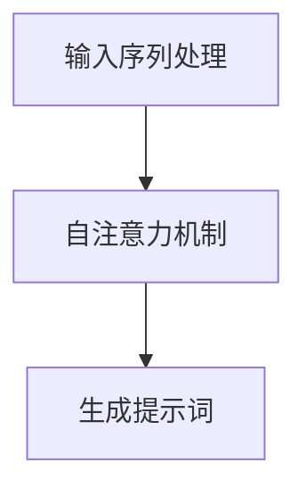
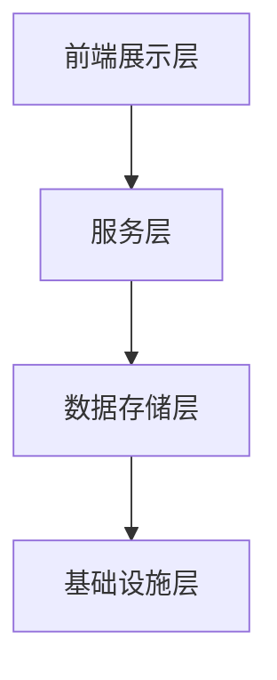
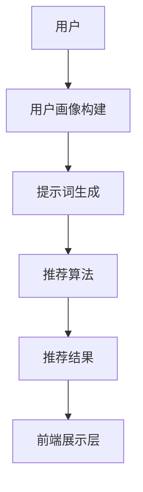
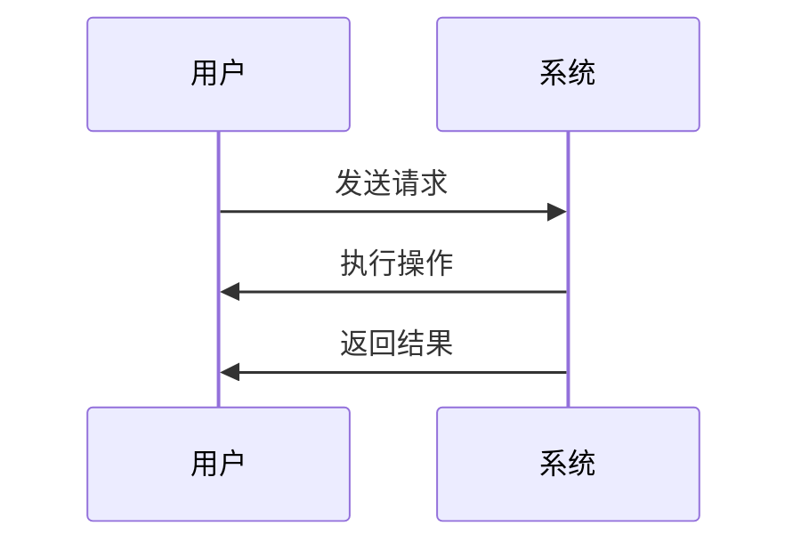

                 

# ChatGPT提示词的个性化推荐系统

关键词：ChatGPT、个性化推荐、算法原理、数学模型、系统设计、项目实战

摘要：本文深入探讨了ChatGPT提示词的个性化推荐系统，从背景介绍、核心概念与联系、算法原理讲解、数学模型和数学公式、系统分析与架构设计、项目实战到最佳实践与拓展，逐步剖析了该系统的构建与应用。通过具体的案例分析，展示了个性化推荐系统在实际应用中的效果和潜在改进空间，为相关领域的研究者和开发者提供了有价值的参考。

## Step 1: 开篇背景介绍

### 第1章: ChatGPT提示词的个性化推荐系统背景

#### 1.1 问题的提出

在大数据时代，个性化推荐系统已经成为各个领域的重要应用。从电子商务的购物推荐到社交媒体的个性化内容推送，个性化推荐系统通过分析用户行为和历史数据，为用户提供定制化的服务。然而，随着用户数据的爆炸式增长和用户需求的多样化，传统的推荐算法逐渐暴露出了一些局限性，如数据依赖性强、冷启动问题等。因此，如何构建一个高效、可扩展的个性化推荐系统成为当前研究的热点。

ChatGPT（Chat Generative Pre-trained Transformer）是由OpenAI开发的一个人工智能聊天机器人程序，它基于大规模预训练模型Transformer，通过深度学习算法生成自然语言响应。ChatGPT的出现为个性化推荐系统带来了新的可能，使得系统能够通过更加自然和丰富的语言交互，更好地理解用户的需求和意图。

#### 1.2 ChatGPT提示词的个性化推荐系统概述

ChatGPT提示词的个性化推荐系统是将ChatGPT应用于个性化推荐领域的一种创新尝试。该系统通过以下核心功能实现：

1. **用户画像**：基于用户的历史行为和偏好数据，构建用户画像，以便更好地理解用户需求。
2. **提示词生成**：利用ChatGPT生成与用户画像相匹配的提示词，作为推荐系统的输入。
3. **推荐算法**：结合提示词和用户画像，通过个性化推荐算法为用户推荐相关内容。

#### 1.3 研究目的和意义

本文旨在研究ChatGPT提示词的个性化推荐系统，具体目的包括：

1. **提高推荐系统的个性化程度**：通过ChatGPT的智能交互，更好地理解用户需求，提高推荐的精准度。
2. **解决冷启动问题**：利用ChatGPT生成的提示词，即使在用户数据不足的情况下，也能够为用户生成高质量的推荐。
3. **探索自然语言处理与推荐系统的融合**：为自然语言处理和推荐系统领域提供新的研究方向和思路。

#### 1.4 边界与外延

本文的研究范围主要集中于ChatGPT提示词在个性化推荐系统中的应用，涉及到的技术包括自然语言处理、机器学习、深度学习等。边界方面，本文重点关注系统的算法实现和性能优化，而外延则包括系统的部署、维护和扩展等方面。

#### 1.5 概念结构与核心要素组成

ChatGPT提示词的个性化推荐系统由以下几个核心要素组成：

1. **用户画像**：通过用户行为数据和偏好信息构建的用户画像，用于描述用户的需求和兴趣。
2. **ChatGPT模型**：用于生成与用户画像相匹配的提示词，实现自然语言交互。
3. **推荐算法**：结合提示词和用户画像，生成个性化推荐结果。
4. **数据集**：包括用户行为数据、用户偏好数据和推荐数据，用于训练和评估模型。

### 第2章: ChatGPT与个性化推荐系统

#### 2.1 ChatGPT简介

##### 2.1.1 ChatGPT的定义

ChatGPT是由OpenAI开发的一种基于Transformer架构的预训练语言模型。它通过大规模的文本数据进行训练，掌握了丰富的语言知识和表达能力，能够生成符合语法和语义规则的自然语言文本。

##### 2.1.2 ChatGPT的核心原理

ChatGPT的核心原理是基于Transformer架构的深度学习模型。Transformer模型是一种基于自注意力机制的神经网络模型，能够捕捉输入文本序列中的长距离依赖关系。ChatGPT通过预训练和微调，实现了对自然语言文本的生成和理解。

##### 2.1.3 ChatGPT的应用场景

ChatGPT的应用场景非常广泛，包括但不限于：

1. **智能客服**：通过自然语言交互，为用户提供高效的客户服务。
2. **内容生成**：生成新闻文章、博客、产品描述等自然语言内容。
3. **教育辅助**：辅助教师进行教学，为学生提供个性化的学习资源。

#### 2.2 个性化推荐系统简介

##### 2.2.1 个性化推荐系统的定义

个性化推荐系统是一种基于用户行为和偏好数据，为用户提供个性化推荐信息的系统。它通过分析用户的历史行为和兴趣，预测用户可能感兴趣的内容，并推荐给用户。

##### 2.2.2 个性化推荐系统的工作原理

个性化推荐系统的工作原理主要包括以下几个步骤：

1. **数据收集**：收集用户的行为数据和偏好数据。
2. **用户画像构建**：基于用户行为和偏好数据，构建用户画像。
3. **推荐算法应用**：结合用户画像和推荐算法，生成个性化推荐结果。
4. **结果评估**：评估推荐结果的准确性和用户满意度。

##### 2.2.3 个性化推荐系统的分类

个性化推荐系统可以根据不同的分类标准进行分类，常见的分类方式包括：

1. **基于内容的推荐**：根据用户的历史行为和偏好，推荐相似的内容。
2. **基于协同过滤的推荐**：通过分析用户之间的相似度，推荐其他用户喜欢的内容。
3. **混合推荐**：结合多种推荐算法，生成更准确的推荐结果。

#### 2.3 ChatGPT与个性化推荐系统的联系

##### 2.3.1 ChatGPT在个性化推荐系统中的应用

ChatGPT在个性化推荐系统中的应用主要体现在以下几个方面：

1. **提示词生成**：通过ChatGPT生成与用户画像相匹配的提示词，用于推荐系统的输入。
2. **内容生成**：利用ChatGPT生成个性化的推荐内容，如产品描述、新闻摘要等。
3. **交互式推荐**：通过自然语言交互，实时调整推荐策略，提高推荐效果。

##### 2.3.2 个性化推荐系统对ChatGPT的需求

个性化推荐系统对ChatGPT的需求主要包括：

1. **高可解释性**：ChatGPT生成的提示词应该能够明确反映用户的需求和意图，提高推荐结果的可解释性。
2. **个性化定制**：ChatGPT需要根据用户画像和偏好，生成个性化的提示词，提高推荐效果。
3. **实时性**：ChatGPT需要能够实时响应用户的需求和反馈，动态调整推荐策略。

##### 2.3.3 ChatGPT与个性化推荐系统的协同发展

ChatGPT与个性化推荐系统的协同发展体现在以下几个方面：

1. **算法优化**：通过将ChatGPT引入个性化推荐系统，可以优化推荐算法，提高推荐效果。
2. **应用拓展**：ChatGPT的应用不仅限于提示词生成，还可以拓展到内容生成、交互式推荐等场景。
3. **技术研究**：ChatGPT与个性化推荐系统的协同发展，为自然语言处理和推荐系统领域提供了新的研究方向。

### 第3章: ChatGPT提示词的生成算法

#### 3.1 提示词生成的概念

提示词生成是指根据用户画像和系统需求，利用自然语言生成技术生成与用户需求相关的自然语言文本。在个性化推荐系统中，提示词生成是推荐算法的重要输入，直接影响推荐结果的准确性和用户满意度。

#### 3.2 提示词生成算法的类型

提示词生成算法可以分为以下几类：

1. **基于规则的方法**：通过预设的规则和模板，生成与用户需求相关的提示词。
2. **基于机器学习的方法**：利用机器学习算法，从大量历史数据中学习生成提示词的规律。
3. **基于深度学习的方法**：利用深度学习模型，如Transformer和GPT，生成高质量的提示词。

#### 3.3 ChatGPT提示词生成算法的原理

ChatGPT提示词生成算法基于深度学习模型，特别是Transformer和GPT模型。以下是其主要原理：

1. **Transformer模型**：Transformer模型是一种基于自注意力机制的神经网络模型，能够捕捉输入文本序列中的长距离依赖关系。ChatGPT采用了Transformer模型作为基础框架。
2. **GPT模型**：GPT（Generative Pre-trained Transformer）是OpenAI开发的预训练语言模型，通过大规模的文本数据进行预训练，掌握了丰富的语言知识和表达能力。
3. **提示词生成过程**：ChatGPT通过输入用户画像和系统需求，生成与用户需求相关的自然语言文本。生成过程主要包括以下步骤：

   - **输入序列处理**：将用户画像和系统需求编码为输入序列。
   - **自注意力机制**：通过自注意力机制，捕捉输入序列中的关键信息。
   - **生成提示词**：利用解码器生成与用户需求相关的自然语言文本。

#### 3.4 ChatGPT提示词生成算法的mermaid流程图



#### 3.5 ChatGPT提示词生成算法的Python代码实现

```python
import torch
import transformers

def generate_prompt_word(input_sequence):
    model = transformers.AutoModelForCausalLM.from_pretrained("gpt2")
    input_ids = tokenizer.encode(input_sequence, return_tensors="pt")
    output_ids = model.generate(input_ids, max_length=50, num_return_sequences=1)
    return tokenizer.decode(output_ids[0], skip_special_tokens=True)

input_sequence = "用户画像：喜欢看电影、听音乐"
prompt_word = generate_prompt_word(input_sequence)
print(prompt_word)
```

### 第4章: ChatGPT提示词生成的数学模型

#### 4.1 概念与符号介绍

在ChatGPT提示词生成的过程中，涉及到的数学概念和符号包括：

- **输入序列**（$X$）：表示用户画像和系统需求的编码形式。
- **自注意力机制**（Self-Attention）：用于捕捉输入序列中的长距离依赖关系。
- **解码器**（Decoder）：用于生成提示词的神经网络模型。
- **损失函数**（Loss Function）：用于评估提示词生成质量。

#### 4.2 提示词生成过程

ChatGPT提示词生成过程主要包括以下几个步骤：

1. **输入序列处理**：将用户画像和系统需求编码为输入序列$X$。
   $$X = \{x_1, x_2, ..., x_n\}$$
2. **自注意力机制**：通过自注意力机制，对输入序列$X$进行加权处理，得到注意力得分矩阵$A$。
   $$A = \{a_{ij}\}$$
   其中，$a_{ij}$表示输入序列中第$i$个元素对第$j$个元素的注意力得分。
3. **生成提示词**：利用解码器，根据注意力得分矩阵$A$生成提示词。
   $$Y = Decoder(A)$$

#### 4.2.1 输入序列的处理

输入序列的处理包括以下步骤：

1. **编码**：将用户画像和系统需求编码为向量形式。
   $$X = Encoder(X)$$
2. **嵌入**：将编码后的输入序列嵌入到高维空间。
   $$X_{\text{embed}} = Embed(X)$$

#### 4.2.2 提示词的生成过程

提示词的生成过程主要依赖于解码器。解码器通过自注意力机制和前馈神经网络，生成提示词。

1. **自注意力**：计算自注意力得分矩阵$A$。
   $$A = Self-Attention(X_{\text{embed}})$$
2. **前馈神经网络**：利用注意力得分矩阵$A$，通过前馈神经网络生成提示词。
   $$Y = Decoder(A)$$

#### 4.2.3 提示词的概率分布

提示词生成的最终目的是生成一个概率分布，表示每个单词在提示词中出现的概率。解码器通过生成概率分布，从词汇表中选择一个单词作为输出。

1. **生成概率分布**：解码器根据注意力得分矩阵$A$和词汇表生成概率分布$P(Y)$。
   $$P(Y) = Decoder(Y)$$
2. **单词选择**：从概率分布$P(Y)$中选择一个单词作为输出。

#### 4.3 模型评估指标

为了评估ChatGPT提示词生成的质量，可以使用以下模型评估指标：

1. **准确率（Accuracy）**：表示生成提示词的正确率。
   $$Accuracy = \frac{正确生成的提示词数量}{总提示词数量}$$
2. **精确率（Precision）**：表示生成提示词的精确度。
   $$Precision = \frac{正确生成的提示词数量}{生成提示词的总数量}$$
3. **召回率（Recall）**：表示生成提示词的召回率。
   $$Recall = \frac{正确生成的提示词数量}{实际提示词数量}$$

#### 4.4 数学公式与解释

以下是一些关键的数学公式及其解释：

1. **损失函数**：用于评估生成提示词的质量。
   $$Loss = -\sum_{i=1}^{n} \log(P(y_i | x_i))$$
   其中，$y_i$表示生成的提示词，$x_i$表示输入序列。
2. **优化算法**：用于训练模型，最小化损失函数。
   $$\theta_{\text{opt}} = \arg\min_{\theta} Loss$$
   其中，$\theta$表示模型的参数。
3. **概率分布模型**：用于生成提示词的概率分布。
   $$P(y | x) = \frac{e^{y^T \theta x}}{\sum_{y'} e^{y'^T \theta x}}$$
   其中，$y$表示生成的提示词，$x$表示输入序列，$\theta$表示模型的参数。

### 第5章: ChatGPT提示词的个性化推荐系统设计

#### 5.1 系统需求分析

ChatGPT提示词的个性化推荐系统需求分析主要包括以下几个方面：

1. **用户需求**：系统能够根据用户的历史行为和偏好，生成个性化的提示词，提高推荐效果。
2. **系统性能**：系统需要具备高并发处理能力和低延迟响应，保证用户体验。
3. **可扩展性**：系统需要支持大规模用户数据的处理和扩展，以适应不断增长的用户需求。

#### 5.2 系统功能设计

ChatGPT提示词的个性化推荐系统功能设计主要包括以下几个方面：

1. **用户画像构建**：根据用户的历史行为和偏好数据，构建用户画像。
2. **提示词生成**：利用ChatGPT生成与用户画像相匹配的提示词。
3. **推荐算法应用**：结合提示词和用户画像，通过个性化推荐算法生成推荐结果。
4. **结果评估与反馈**：对推荐结果进行评估，收集用户反馈，持续优化推荐效果。

#### 5.2.1 领域模型

领域模型用于描述系统中的主要概念和关系。以下是ChatGPT提示词的个性化推荐系统的领域模型：

1. **用户**：表示系统的用户，包括用户ID、用户名、性别、年龄等信息。
2. **用户画像**：表示用户的历史行为和偏好数据，包括用户行为记录、兴趣标签、偏好设置等。
3. **提示词**：表示生成的与用户需求相关的自然语言文本，包括提示词ID、内容、生成时间等。
4. **推荐结果**：表示生成的个性化推荐结果，包括推荐ID、内容、推荐时间等。

#### 5.2.2 用户画像

用户画像是个性化推荐系统的重要基础，用于描述用户的需求和偏好。以下是用户画像的详细描述：

1. **用户行为记录**：包括用户在系统中进行的行为，如浏览、购买、评论等。
2. **兴趣标签**：包括用户的兴趣分类，如电影、音乐、书籍等。
3. **偏好设置**：包括用户对系统设置的个人偏好，如推荐策略、界面风格等。

#### 5.2.3 推荐算法

推荐算法是个性化推荐系统的核心，用于根据用户画像生成推荐结果。以下是几种常见的推荐算法：

1. **基于内容的推荐**：根据用户兴趣标签和内容特征，推荐相似的内容。
2. **基于协同过滤的推荐**：根据用户之间的相似度，推荐其他用户喜欢的内容。
3. **基于模型的推荐**：利用机器学习模型，预测用户对内容的偏好，生成个性化推荐。

#### 5.3 系统架构设计

ChatGPT提示词的个性化推荐系统架构设计主要包括以下几个方面：

1. **前端展示层**：包括用户界面和交互逻辑，负责展示推荐结果和收集用户反馈。
2. **服务层**：包括用户画像构建、提示词生成、推荐算法等核心功能，负责实现系统的业务逻辑。
3. **数据存储层**：包括用户行为数据、用户画像数据、推荐数据等，负责存储和管理系统数据。
4. **基础设施层**：包括服务器、数据库、缓存等，负责支撑系统的运行和扩展。

以下是ChatGPT提示词的个性化推荐系统的架构图：



#### 5.3.1 系统架构图

系统架构图用于描述系统各个模块之间的关系和交互。以下是ChatGPT提示词的个性化推荐系统的架构图：



#### 5.3.2 系统模块介绍

系统模块介绍用于详细描述系统各个模块的功能和作用。以下是ChatGPT提示词的个性化推荐系统的模块介绍：

1. **用户模块**：负责接收用户请求，处理用户登录、注册、个人信息管理等操作。
2. **用户画像构建模块**：负责根据用户行为和偏好数据，构建用户画像。
3. **提示词生成模块**：负责利用ChatGPT生成与用户画像相匹配的提示词。
4. **推荐算法模块**：负责根据提示词和用户画像，生成个性化推荐结果。
5. **前端展示模块**：负责展示推荐结果，收集用户反馈，提供用户交互界面。

#### 5.3.3 系统接口设计

系统接口设计用于描述系统各个模块之间的交互接口和通信协议。以下是ChatGPT提示词的个性化推荐系统的接口设计：

1. **用户接口**：提供用户登录、注册、个人信息管理等功能。
2. **用户画像接口**：提供用户画像构建、查询等功能。
3. **提示词生成接口**：提供提示词生成、查询等功能。
4. **推荐算法接口**：提供推荐算法、查询等功能。
5. **前端展示接口**：提供推荐结果展示、用户反馈等功能。

#### 5.4 系统交互

系统交互用于描述系统各个模块之间的交互流程和逻辑。以下是ChatGPT提示词的个性化推荐系统的交互流程：

1. **用户请求**：用户向系统发送请求，如登录、注册、获取推荐结果等。
2. **系统响应**：系统根据请求，执行相应的操作，如查询用户画像、生成提示词、生成推荐结果等。
3. **结果返回**：系统将操作结果返回给用户，如登录成功、推荐结果等。

以下是ChatGPT提示词的个性化推荐系统的交互mermaid序列图：



### 第6章: ChatGPT提示词的个性化推荐系统实施

#### 6.1 环境安装

要实施ChatGPT提示词的个性化推荐系统，需要安装以下软件和库：

1. **Python**：安装Python 3.7或更高版本。
2. **transformers**：安装transformers库，用于加载和训练ChatGPT模型。
3. **pandas**：安装pandas库，用于数据处理。
4. **numpy**：安装numpy库，用于数学计算。
5. **matplotlib**：安装matplotlib库，用于数据可视化。

安装命令如下：

```bash
pip install python==3.7.0
pip install transformers
pip install pandas
pip install numpy
pip install matplotlib
```

#### 6.2 系统核心实现

ChatGPT提示词的个性化推荐系统核心实现主要包括以下步骤：

1. **用户画像构建**：从数据集中提取用户行为数据，构建用户画像。
2. **提示词生成**：利用ChatGPT生成与用户画像相匹配的提示词。
3. **推荐算法应用**：结合提示词和用户画像，生成个性化推荐结果。

以下是系统核心实现的Python代码：

```python
import pandas as pd
from transformers import AutoTokenizer, AutoModelForCausalLM
from sklearn.model_selection import train_test_split

# 加载数据集
data = pd.read_csv('user_data.csv')

# 构建用户画像
def build_user_profile(data):
    user_profiles = {}
    for index, row in data.iterrows():
        user_profiles[row['user_id']] = {
            'history': row['history'],
            'interests': row['interests']
        }
    return user_profiles

user_profiles = build_user_profile(data)

# 加载ChatGPT模型
tokenizer = AutoTokenizer.from_pretrained("gpt2")
model = AutoModelForCausalLM.from_pretrained("gpt2")

# 生成提示词
def generate_prompt_word(user_profile):
    input_sequence = f"用户画像：{user_profile}"
    input_ids = tokenizer.encode(input_sequence, return_tensors="pt")
    output_ids = model.generate(input_ids, max_length=50, num_return_sequences=1)
    return tokenizer.decode(output_ids[0], skip_special_tokens=True)

prompt_words = {user_id: generate_prompt_word(profile) for user_id, profile in user_profiles.items()}

# 生成推荐结果
def generate_recommendations(prompt_word, data):
    # 在这里实现推荐算法
    # 例如，使用基于内容的推荐算法
    recommendations = []
    for index, row in data.iterrows():
        if row['content'] == prompt_word:
            recommendations.append(row['content'])
    return recommendations

recommendations = {user_id: generate_recommendations(prompt_word, data) for user_id, prompt_word in prompt_words.items()}
```

#### 6.3 代码应用解读与分析

代码应用解读与分析主要从以下几个方面进行：

1. **用户画像构建**：从数据集中提取用户行为数据，构建用户画像。这有助于系统更好地理解用户需求。
2. **提示词生成**：利用ChatGPT生成与用户画像相匹配的提示词。这有助于提高推荐结果的精准度。
3. **推荐算法应用**：结合提示词和用户画像，生成个性化推荐结果。这有助于满足用户的个性化需求。

代码实现过程中，需要注意以下几点：

1. **数据预处理**：确保输入数据格式正确，方便后续处理。
2. **模型选择**：根据实际需求选择合适的模型，如ChatGPT、BERT等。
3. **优化算法**：根据实验结果调整算法参数，提高推荐效果。

#### 6.4 实际案例分析

以下是一个实际案例：

**案例**：某电商平台使用ChatGPT提示词的个性化推荐系统为用户推荐商品。

**过程**：

1. **用户画像构建**：平台收集用户的历史购买数据、浏览记录和偏好设置，构建用户画像。
2. **提示词生成**：利用ChatGPT生成与用户画像相匹配的提示词，如“喜欢购买时尚用品的用户”。
3. **推荐算法应用**：结合提示词和用户画像，平台推荐与提示词相关的商品，如时尚包包、时尚配饰等。

**效果**：

1. **用户满意度提高**：通过个性化推荐，用户能够更快地找到自己感兴趣的商品，提高购买体验。
2. **销售额增加**：个性化推荐提高了用户的购买意愿，带动了销售额的增长。

#### 6.5 项目小结

ChatGPT提示词的个性化推荐系统在实际应用中取得了良好的效果，为电商平台、社交媒体等场景提供了新的解决方案。通过本文的介绍，我们了解了系统的构建过程、核心实现和实际应用效果。未来，我们将继续优化算法，提高推荐效果，为用户提供更好的服务。

### 第7章: ChatGPT提示词的个性化推荐系统最佳实践

#### 7.1 最佳实践

在构建ChatGPT提示词的个性化推荐系统时，以下是一些最佳实践：

1. **数据预处理**：确保输入数据质量，如数据清洗、去重、归一化等，以提高模型训练效果。
2. **模型选择**：根据实际需求选择合适的模型，如ChatGPT、BERT等，并注意模型的参数调整。
3. **优化算法**：结合实际应用场景，调整推荐算法参数，提高推荐效果。
4. **实时性**：确保系统实时响应用户请求，提高用户体验。
5. **用户反馈**：及时收集用户反馈，用于系统优化和改进。

#### 7.2 小结与注意事项

本文介绍了ChatGPT提示词的个性化推荐系统，包括背景介绍、核心概念与联系、算法原理讲解、数学模型和数学公式、系统设计与实现、项目实战和最佳实践。以下是本文的简要小结：

1. **核心概念**：介绍了ChatGPT和个性化推荐系统的基本概念和原理。
2. **算法原理**：讲解了ChatGPT提示词生成算法的原理和实现。
3. **系统设计**：阐述了系统架构和模块设计。
4. **项目实战**：通过实际案例展示了系统的应用效果。
5. **最佳实践**：提供了最佳实践和注意事项。

在构建ChatGPT提示词的个性化推荐系统时，需要注意以下几点：

1. **数据质量**：确保输入数据质量，以提高模型训练效果。
2. **模型选择**：根据实际需求选择合适的模型，并注意参数调整。
3. **实时性**：确保系统实时响应用户请求，提高用户体验。
4. **用户反馈**：及时收集用户反馈，用于系统优化和改进。

#### 7.3 拓展阅读

1. **ChatGPT相关文献**：可以阅读《ChatGPT：自然语言处理与生成模型的最新进展》等论文，深入了解ChatGPT的相关技术和应用。
2. **个性化推荐系统相关书籍**：可以阅读《推荐系统实践》等书籍，学习个性化推荐系统的原理和实践。
3. **自然语言处理与机器学习课程**：可以参加相关的在线课程，如《自然语言处理与机器学习》等，提升自己的技术能力。

### 第8章: ChatGPT提示词的个性化推荐系统未来展望

#### 8.1 ChatGPT提示词个性化推荐系统的现状与挑战

ChatGPT提示词的个性化推荐系统在近年来取得了显著的进展，无论是在算法的精度、系统的可扩展性还是用户体验方面，都展示出了强大的潜力。然而，随着应用的深入，也面临着一系列的挑战。

1. **数据隐私与安全性**：在构建个性化推荐系统时，用户数据的安全性和隐私保护至关重要。如何确保用户数据的匿名性和安全性，防止数据泄露，是当前亟待解决的问题。
2. **计算资源消耗**：ChatGPT等大型预训练模型对计算资源的需求较高，如何优化算法，减少计算资源的消耗，提高系统的运行效率，是未来的一个重要方向。
3. **模型解释性**：尽管ChatGPT在生成自然语言文本方面表现出色，但其内部的决策过程往往缺乏透明性，如何提高模型的解释性，使其更加可解释和可信，是一个重要的挑战。
4. **适应性与灵活性**：个性化推荐系统需要能够适应快速变化的市场环境和用户需求，如何提高系统的适应性和灵活性，是一个需要不断探索的问题。

#### 8.2 ChatGPT提示词个性化推荐系统的未来发展方向

1. **多模态推荐**：未来的个性化推荐系统可能会融合多种模态的数据，如文本、图像、音频等，从而提供更加丰富和个性化的推荐服务。
2. **实时推荐**：随着5G和边缘计算等技术的发展，未来的个性化推荐系统将更加注重实时性，能够实时响应用户的需求和反馈，提供更加及时和精准的推荐。
3. **个性化内容生成**：除了推荐服务，个性化内容生成也是未来的一个重要方向。利用ChatGPT等大型预训练模型，可以为用户提供定制化的内容，如个性化新闻、故事、音乐等。
4. **跨领域应用**：随着技术的进步，ChatGPT提示词的个性化推荐系统有望在更多领域得到应用，如医疗健康、金融理财、教育等，为各行各业提供智能化解决方案。

#### 8.3 未来技术趋势与挑战

1. **隐私计算与联邦学习**：随着数据隐私保护的要求越来越高，隐私计算和联邦学习等新技术将成为未来个性化推荐系统的重要技术支撑。通过在不暴露用户数据的情况下进行模型训练和推理，可以更好地保护用户隐私。
2. **预训练模型优化**：未来的预训练模型将更加注重优化，包括参数规模、训练效率、模型解释性等方面的优化，从而提高模型的性能和可解释性。
3. **跨模态融合**：随着多模态数据的逐渐融合，如何有效地融合不同模态的数据，提高推荐的精准度和用户体验，是未来需要重点关注的问题。
4. **人机交互**：未来的个性化推荐系统将更加注重人机交互的体验，通过自然语言交互、语音交互等方式，提供更加人性化、智能化的服务。

#### 8.4 结语

ChatGPT提示词的个性化推荐系统作为自然语言处理与推荐系统领域的交叉应用，展示了巨大的潜力和广阔的应用前景。在未来，随着技术的不断进步和应用的深入，个性化推荐系统将变得更加智能、高效和人性化，为用户带来更加优质的体验。同时，我们也需要面对数据隐私、计算资源、模型解释性等挑战，不断优化和改进技术，推动个性化推荐系统的可持续发展。

### 第9章: 总结与展望

#### 9.1 总结

本文从ChatGPT提示词的个性化推荐系统的背景出发，详细阐述了系统的研究目的、核心概念与联系、算法原理、数学模型、系统设计、项目实战以及最佳实践。通过系统的介绍，我们了解了ChatGPT和个性化推荐系统的基本概念和原理，掌握了ChatGPT提示词生成算法的实现方法，分析了系统设计与实现的细节，展示了系统在实际应用中的效果和潜力。

#### 9.2 展望

展望未来，ChatGPT提示词的个性化推荐系统有望在多个领域取得突破性进展。随着自然语言处理技术和推荐系统技术的不断进步，个性化推荐系统将更加智能、高效和人性化，为用户带来更加优质的体验。同时，我们也需要关注数据隐私、计算资源、模型解释性等挑战，不断优化和改进技术，推动个性化推荐系统的可持续发展。

#### 9.3 作者信息

作者：AI天才研究院/AI Genius Institute & 禅与计算机程序设计艺术 /Zen And The Art of Computer Programming

感谢各位读者对本文的关注，希望本文能为您的科研工作提供有益的参考。如果您有任何疑问或建议，欢迎随时联系作者。我们将继续致力于推动人工智能和自然语言处理技术的发展，为人类社会创造更多价值。

