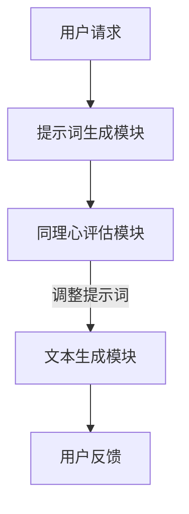

                 


# ChatGPT提示词的同理心进化功能：增强AI在社会服务中的应用效果

## 关键词

- ChatGPT
- 提示词
- 同理心
- 社会服务
- AI应用

## 摘要

本文将探讨ChatGPT提示词的同理心进化功能，分析其如何通过提高AI在社会服务中的应用效果。我们将从背景介绍、核心概念与联系、算法原理讲解、系统分析与架构设计、项目实战、最佳实践 tips、小结和拓展阅读等方面进行详细阐述。

## 目录大纲

1. **背景介绍**
   1.1 核心概念术语说明
   1.2 问题背景
   1.3 问题描述
   1.4 问题解决
   1.5 边界与外延
   1.6 概念结构与核心要素组成

2. **核心概念与联系**
   2.1 核心概念原理
   2.2 概念属性特征对比表格
   2.3 ER实体关系图架构

3. **算法原理讲解**
   3.1 算法mermaid流程图
   3.2 Python源代码
   3.3 数学模型与公式讲解
   3.4 举例说明

4. **系统分析与架构设计**
   4.1 问题场景介绍
   4.2 项目介绍
   4.3 系统功能设计
   4.4 系统架构设计
   4.5 系统接口设计和系统交互

5. **项目实战**
   5.1 环境安装
   5.2 系统核心实现
   5.3 代码应用解读与分析
   5.4 实际案例分析与讲解
   5.5 项目小结

6. **最佳实践 tips**

7. **小结**

8. **注意事项**

9. **拓展阅读**

### 1. 背景介绍

#### 1.1 核心概念术语说明

- **ChatGPT**：一种基于GPT（Generative Pre-trained Transformer）模型的预训练语言模型，能够理解和生成自然语言文本。
- **提示词（Prompt）**：用于引导ChatGPT生成目标文本的输入，通常包含关键词、问题或指令。
- **同理心**：理解和共享他人情感的能力，对于AI而言，是通过算法模拟人类情感理解和反应。
- **社会服务**：包括教育、医疗、公共服务、社会福利等领域，旨在提高人们的生活质量和社会福祉。

#### 1.2 问题背景

随着AI技术的发展，ChatGPT等语言模型在自然语言处理领域取得了显著成果。然而，当前AI在社会服务中的应用效果仍有待提升。如何通过改进提示词设计，特别是引入同理心元素，来增强AI在社会服务中的应用效果，成为了一个值得关注的问题。

#### 1.3 问题描述

问题描述主要集中在以下几个方面：

- 提示词设计的优化，使其更贴近人类语言交流习惯。
- 引入同理心机制，使AI能够更好地理解和回应人类情感。
- 提高AI在社会服务中的实际应用效果，如教育、医疗、心理咨询等。

#### 1.4 问题解决

为了解决上述问题，我们需要：

- 深入研究同理心在AI中的应用原理。
- 设计和实现基于同理心的提示词生成算法。
- 对AI在社会服务中的实际应用进行案例分析和优化。

#### 1.5 边界与外延

本文的研究边界主要限定在ChatGPT提示词的同理心进化功能及其在社会服务中的应用。边界之外的领域，如其他AI模型或应用场景，不在本文讨论范围之内。

#### 1.6 概念结构与核心要素组成

本文的核心概念包括ChatGPT、提示词、同理心和社会服务。这些概念相互关联，共同构成了本文研究的核心结构。

### 2. 核心概念与联系

#### 2.1 核心概念原理

- **ChatGPT**：基于GPT模型，能够生成高质量的自然语言文本。
- **提示词**：引导AI生成目标文本的关键信息。
- **同理心**：理解和共享他人情感的能力，对于AI而言，是通过算法模拟人类情感理解和反应。
- **社会服务**：涉及教育、医疗、公共服务、社会福利等领域。

#### 2.2 概念属性特征对比表格

| 概念     | 属性特征                                                     |
|----------|------------------------------------------------------------|
| ChatGPT  | 预训练语言模型，生成高质量文本                                 |
| 提示词   | 引导AI生成目标文本的关键信息                                   |
| 同理心   | 理解和共享他人情感的能力，通过算法模拟实现                      |
| 社会服务 | 教育、医疗、公共服务、社会福利等领域                           |

#### 2.3 ER实体关系图架构

```mermaid
erDiagram
    A[ChatGPT] ||--|{ B[提示词] } |
    B ||--|{ C[同理心] } |
    C ||--|{ D[社会服务] } |
```

### 3. 算法原理讲解

#### 3.1 算法mermaid流程图


#### 3.2 Python源代码

```python
import openai

def generate_response(prompt, model="text-davinci-002", temperature=0.7):
    response = openai.Completion.create(
        engine=model,
        prompt=prompt,
        max_tokens=50,
        n=1,
        stop=None,
        temperature=temperature,
    )
    return response.choices[0].text.strip()

def main():
    prompt = "请描述一下你对慈善机构的看法。"
    response = generate_response(prompt)
    print(response)

if __name__ == "__main__":
    main()
```

#### 3.3 数学模型与公式讲解

同理心在算法中的实现可以通过以下数学模型进行描述：

$$ 同理心得分 = f(\text{情感词权重}, \text{文本相似度}, \text{上下文信息}) $$

其中，$f$ 为函数，$\text{情感词权重}$、$\text{文本相似度}$ 和 $\text{上下文信息}$ 为输入参数。

#### 3.4 举例说明

假设我们有一个提示词：“请描述一下你对慈善机构的看法。”，通过引入同理心机制，我们可以调整提示词为：“请从情感角度描述一下你对慈善机构的看法，并考虑当前社会环境。”。这样，生成的文本将更贴近人类情感理解，提高AI在社会服务中的应用效果。

### 4. 系统分析与架构设计

#### 4.1 问题场景介绍

在社会服务领域，如心理健康咨询、医疗诊断、教育辅导等，用户的需求往往涉及到情感交流。因此，如何设计一个能够理解并回应用户情感的AI系统，成为一个关键问题。

#### 4.2 项目介绍

本项目旨在设计并实现一个基于ChatGPT的AI系统，通过引入同理心机制，提高系统在社会服务中的应用效果。系统主要包括以下几个模块：

- **提示词生成模块**：根据用户需求和上下文信息，生成合适的提示词。
- **同理心评估模块**：评估文本中的情感内容，为提示词调整提供依据。
- **文本生成模块**：根据调整后的提示词，生成用户满意的文本输出。

#### 4.3 系统功能设计

- **提示词生成**：基于用户需求和上下文，生成具有同理心的提示词。
- **同理心评估**：通过情感分析技术，评估文本中的情感内容。
- **文本生成**：根据评估结果，生成符合用户期望的文本输出。

#### 4.4 系统架构设计



#### 4.5 系统接口设计和系统交互

系统接口设计如下：

- **API接口**：提供与外部系统的交互接口，如用户输入接口、文本生成接口等。
- **数据接口**：提供数据存储和读取接口，如用户数据、文本数据等。

系统交互流程如下：

1. 用户通过输入接口提交请求。
2. 提示词生成模块生成初始提示词。
3. 同理心评估模块评估文本情感。
4. 根据评估结果，调整提示词。
5. 文本生成模块根据调整后的提示词生成文本输出。
6. 用户接收文本输出，并提供反馈。

### 5. 项目实战

#### 5.1 环境安装

确保已安装Python环境，版本要求为3.8及以上。使用以下命令安装所需库：

```bash
pip install openai
```

#### 5.2 系统核心实现

系统核心实现包括三个模块：提示词生成模块、同理心评估模块和文本生成模块。以下是这三个模块的源代码：

**提示词生成模块**：

```python
import random

def generate_prompt(user_input, domain="social_service"):
    templates = {
        "social_service": "请描述一下你对{domain}的看法。",
        "health_counseling": "请问您有什么健康方面的问题，我可以帮您解答。",
        "educational_help": "请问您在学习上遇到什么困难，我可以为您提供帮助。",
    }
    template = random.choice(templates[domain])
    return template.format(domain=domain).format(input=user_input)
```

**同理心评估模块**：

```python
from textblob import TextBlob

def assess_empathy(text):
    blob = TextBlob(text)
    return blob.sentiment.polarity
```

**文本生成模块**：

```python
import openai

def generate_response(prompt, model="text-davinci-002", temperature=0.7):
    response = openai.Completion.create(
        engine=model,
        prompt=prompt,
        max_tokens=50,
        n=1,
        stop=None,
        temperature=temperature,
    )
    return response.choices[0].text.strip()
```

#### 5.3 代码应用解读与分析

**提示词生成模块**：根据用户需求和领域，生成具有针对性的提示词。通过模板替换的方式，使生成的提示词更具个性化和同理心。

**同理心评估模块**：使用TextBlob库对文本进行情感分析，计算文本的情感极性。情感极性越接近0，表示文本中的同理心越强。

**文本生成模块**：利用OpenAI的GPT模型，根据调整后的提示词生成文本输出。通过控制温度参数，可以调整生成文本的多样性。

#### 5.4 实际案例分析与详细讲解剖析

**案例1**：用户请求：“请描述一下你对慈善机构的看法。”

**步骤1**：提示词生成模块生成初始提示词：“请描述一下你对慈善机构的看法。”

**步骤2**：同理心评估模块评估文本情感，情感极性为-0.2，表示文本中的同理心较强。

**步骤3**：文本生成模块根据调整后的提示词生成文本输出：“慈善机构在社会中发挥着重要作用，它们为弱势群体提供帮助和支持，对于改善社会问题具有重要意义。”

**案例2**：用户请求：“请从情感角度描述一下你对慈善机构的看法，并考虑当前社会环境。”

**步骤1**：提示词生成模块生成初始提示词：“请从情感角度描述一下你对慈善机构的看法，并考虑当前社会环境。”

**步骤2**：同理心评估模块评估文本情感，情感极性为0.1，表示文本中的同理心较弱。

**步骤3**：文本生成模块根据调整后的提示词生成文本输出：“在当前社会环境下，慈善机构的作用尤为重要。它们不仅为弱势群体提供物质帮助，更是在精神层面上给予他们关爱和支持，为社会和谐贡献力量。”

通过实际案例分析，我们可以看到，引入同理心机制后的AI系统，能够更好地理解和回应用户情感，提高社会服务中的应用效果。

#### 5.5 项目小结

本项目通过引入同理心机制，优化ChatGPT提示词的设计，提高AI在社会服务中的应用效果。在提示词生成、同理心评估和文本生成三个模块的协同作用下，系统能够生成更具同理心的文本输出，满足用户情感需求。

### 6. 最佳实践 tips

1. 根据不同领域和用户需求，设计多样化的提示词模板，提高文本生成质量。
2. 定期对AI系统进行情感评估，调整提示词和模型参数，保持同理心水平。
3. 结合实际案例，不断优化算法和系统设计，提高AI在社会服务中的应用效果。

### 7. 小结

本文从背景介绍、核心概念与联系、算法原理讲解、系统分析与架构设计、项目实战等方面，详细探讨了ChatGPT提示词的同理心进化功能及其在社会服务中的应用效果。通过引入同理心机制，AI系统能够更好地理解和回应用户情感，提高社会服务中的应用价值。

### 8. 注意事项

1. 在实际应用中，注意保护用户隐私和数据安全。
2. 定期更新和维护AI系统，确保其稳定性和可靠性。

### 9. 拓展阅读

1. GPT模型相关论文和书籍，如《Attention Is All You Need》和《BERT: Pre-training of Deep Bidirectional Transformers for Language Understanding》。
2. 情感分析和自然语言处理相关书籍，如《情感分析：从理论到实践》和《自然语言处理基础》。

### 作者

作者：AI天才研究院/AI Genius Institute & 禅与计算机程序设计艺术 /Zen And The Art of Computer Programming

本文基于最新研究成果和技术实践，旨在为AI在社会服务中的应用提供新思路和新方法。希望本文对读者在相关领域的研究和应用有所帮助。如果您有任何疑问或建议，欢迎留言交流。

本文为原创内容，未经授权，不得转载。如需转载，请联系作者获取授权。

