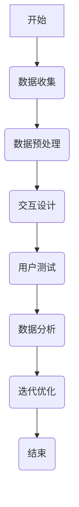

                 

# ChatGPT提示词的年龄适应性：全生命周期的AI交互设计

关键词：ChatGPT，AI交互设计，年龄适应性，全生命周期设计，用户体验

摘要：本文深入探讨了ChatGPT在AI交互设计中的角色，以及如何设计适应不同年龄群体的提示词。通过全生命周期AI交互设计的方法，分析并提出了优化策略，旨在提升跨年龄段的用户体验。

## 引言与背景

### 1.1 引言

随着人工智能技术的发展，AI交互设计逐渐成为研究热点。ChatGPT，作为一个基于大型语言模型的人工智能助手，已经在多个领域展现出了其强大的交互能力。然而，如何设计适应不同年龄群体的提示词，使其在不同年龄阶段都能提供良好的用户体验，成为了一个新的挑战。

### 1.2 背景介绍

AI交互设计的现状主要表现在以下几个方面：首先，人工智能助手在交互设计上普遍缺乏对用户个体差异的考虑，如年龄、认知水平等；其次，现有的AI交互系统往往仅关注单一群体，忽略了其他年龄段的用户需求；最后，全生命周期的AI交互设计方法尚未得到广泛应用。

年龄适应性在AI交互设计中的重要性不可忽视。不同年龄段用户在认知能力、语言习惯、兴趣爱好等方面存在显著差异，这直接影响了AI交互系统的适用性和用户体验。因此，如何设计适应全年龄段的AI交互系统，是当前AI交互设计领域亟待解决的关键问题。

全生命周期AI交互设计的概念与目标

全生命周期AI交互设计旨在从用户出生到衰老的全过程中，提供一致且适应不同生命阶段的AI交互体验。其核心目标是：1）提高AI交互系统的通用性和适用性；2）提升不同年龄阶段用户的满意度；3）促进AI交互技术的可持续发展。

### 1.3 本书结构安排与目标

本书将分为五个部分，首先介绍ChatGPT的基本概念和年龄适应性理论；然后探讨全生命周期AI交互设计的方法和实施策略；接着通过具体案例分析，展示全生命周期AI交互设计在不同领域的应用；最后，展望未来发展趋势，并探讨面临的挑战与机遇。

本书的目标是：1）为读者提供全面的ChatGPT和AI交互设计知识；2）通过实例分析，帮助读者理解全生命周期AI交互设计的实践方法；3）激发读者对AI交互设计领域的兴趣，推动相关研究的发展。

### 1.4 本章小结

本章介绍了本文的研究背景和目的，明确了全生命周期AI交互设计的概念和目标。下一章将深入探讨ChatGPT的基本概念和其在AI交互设计中的应用，为后续章节的分析和讨论奠定基础。

## 基础理论

### 2.1 ChatGPT概述

#### 2.1.1 ChatGPT的发展历史

ChatGPT是由OpenAI开发的一种基于GPT-3.5的聊天机器人。它的起源可以追溯到2018年，OpenAI发布了GPT-2，一个基于 Transformer架构的大型语言模型。GPT-2的成功为后续的发展奠定了基础。2022年，OpenAI发布了GPT-3，一个拥有1750亿参数的巨型模型，ChatGPT正是基于GPT-3开发的。ChatGPT的出现标志着AI交互技术进入了一个新的阶段，它能够通过自然语言与用户进行对话，提供个性化、智能化的服务。

#### 2.1.2 ChatGPT的技术架构

ChatGPT的技术架构主要包括三个部分：文本处理层、对话生成层和用户交互层。

1. **文本处理层**：该层负责接收用户的输入文本，并将其处理为模型能够理解的形式。具体包括分词、词性标注、命名实体识别等步骤。

2. **对话生成层**：这是ChatGPT的核心部分，基于GPT-3.5模型，通过对输入文本的理解和生成，生成合适的回复文本。该层采用Transformer架构，通过多层神经网络对文本进行编码和解码，生成高质量的回复。

3. **用户交互层**：该层负责与用户进行交互，接收用户的输入，并将模型生成的回复展示给用户。同时，用户反馈也会被收集，用于模型优化和用户体验提升。

#### 2.1.3 ChatGPT的应用领域

ChatGPT在多个领域都有广泛的应用，包括但不限于：

1. **客服**：ChatGPT可以用于客服系统，提供24/7的智能客服服务，提高企业响应速度和用户满意度。

2. **教育**：ChatGPT可以用于教育领域，提供个性化的学习辅导，帮助学生提高学习效果。

3. **心理咨询**：ChatGPT可以用于心理咨询领域，提供心理支持和建议，帮助用户缓解心理压力。

4. **娱乐**：ChatGPT可以用于聊天机器人游戏，为用户提供有趣的互动体验。

### 2.2 提示词设计原理

#### 2.2.1 提示词的作用与类型

提示词（Prompt）是用户与AI系统交互的桥梁，起到了引导和激发AI系统生成响应的作用。根据用途和形式，提示词可以分为以下几类：

1. **引导性提示词**：这类提示词主要用于引导用户输入，例如“请描述您的需求”或“您有什么问题需要帮助吗？”。

2. **激发性提示词**：这类提示词用于激发AI系统生成创意性或多样化的响应，例如“请为我的生日策划一个活动”或“描述一下您的梦想”。

3. **评价性提示词**：这类提示词用于评价AI系统的响应质量，例如“这个建议怎么样？”或“您对我的问题有什么看法？”。

#### 2.2.2 提示词设计的原则

为了设计出有效的提示词，需要遵循以下原则：

1. **明确性**：提示词需要清晰明确，避免歧义，确保用户能够准确理解。

2. **多样性**：提示词应具有多样性，以激发AI系统生成多样化的响应。

3. **适应性**：提示词应能适应不同用户的需求和情境，提高用户体验。

4. **引导性**：提示词应具有引导性，帮助用户更有效地与AI系统交互。

#### 2.2.3 提示词设计的技巧

设计有效的提示词，可以采用以下技巧：

1. **使用开放式问题**：开放式问题可以激发用户的思考和表达，例如“您有什么烦恼想要分享吗？”。

2. **使用具体化语言**：具体化语言可以帮助用户更好地描述需求，例如“请描述一下您的学习目标”而不是“您想学什么？”。

3. **结合情境**：根据不同的交互情境，设计相应的提示词，例如在咨询类场景中，可以使用引导性问题来收集更多信息。

### 2.3 年龄适应性理论

#### 2.3.1 年龄与认知发展的关系

年龄与认知发展之间存在密切关系。不同年龄段用户在认知能力、语言理解能力、学习方式等方面存在显著差异。例如，儿童和青少年更倾向于使用简单、直观的语言；而成年人和老年人则更倾向于使用复杂、抽象的语言。因此，设计适应不同年龄群体的AI交互系统，需要充分考虑这些认知差异。

#### 2.3.2 年龄适应性评估方法

评估AI交互系统的年龄适应性，可以采用以下方法：

1. **用户调研**：通过问卷调查、访谈等方式，收集不同年龄段用户对AI交互系统的反馈。

2. **实验研究**：设计实验，观察不同年龄段用户在AI交互系统中的行为表现，评估其使用体验。

3. **数据分析**：通过分析用户交互数据，如点击率、回复率、满意度等，评估AI交互系统的年龄适应性。

#### 2.3.3 年龄适应性设计的挑战与机遇

年龄适应性设计面临的挑战主要包括：

1. **认知差异**：需要设计适应不同认知水平的提示词和交互界面。

2. **个性化需求**：不同年龄段用户的需求和期望存在差异，需要提供个性化的交互体验。

3. **数据隐私**：保护用户数据隐私，避免敏感信息泄露。

然而，年龄适应性设计也带来了机遇：

1. **市场机会**：适应不同年龄群体的AI交互系统具有更广泛的市场需求。

2. **技术进步**：随着认知科学、心理学等领域的发展，可以为AI交互设计提供更深入的指导。

### 2.4 全生命周期AI交互设计方法

#### 2.4.1 全生命周期AI交互设计框架

全生命周期AI交互设计包括以下几个阶段：

1. **需求分析**：了解不同年龄段用户的需求和期望。

2. **设计原型**：根据需求分析，设计适应不同年龄阶段的交互原型。

3. **迭代优化**：通过用户反馈，不断优化交互设计。

4. **测试评估**：进行用户测试，评估交互设计的年龄适应性。

5. **部署实施**：将优化后的交互设计应用到实际系统中。

#### 2.4.2 全生命周期AI交互设计流程

全生命周期AI交互设计流程主要包括以下步骤：

1. **需求调研**：通过问卷调查、访谈等方式，收集不同年龄段用户的需求和期望。

2. **用户画像**：根据调研数据，构建不同年龄段用户的画像，包括其认知特点、语言习惯等。

3. **交互设计**：基于用户画像，设计适应不同年龄阶段的交互界面和提示词。

4. **用户测试**：邀请不同年龄段用户参与测试，评估交互设计的年龄适应性。

5. **数据收集与处理**：收集用户测试数据，进行分析和处理，以指导后续优化。

6. **迭代优化**：根据用户测试反馈，对交互设计进行优化。

7. **最终评估**：对优化后的交互设计进行最终评估，确保其适应不同年龄段用户的需求。

#### 2.4.3 全生命周期AI交互设计的关键技术

全生命周期AI交互设计涉及多个关键技术，包括：

1. **用户研究**：通过问卷调查、访谈、用户测试等方式，深入了解不同年龄段用户的需求和行为。

2. **交互设计**：设计适应不同年龄段用户的交互界面和提示词，提高用户体验。

3. **数据分析和处理**：对用户交互数据进行分析和处理，以指导交互设计的优化。

4. **人工智能技术**：利用机器学习、自然语言处理等技术，提升AI交互系统的性能和适应性。

### 2.5 本章小结

本章介绍了ChatGPT的基本概念和技术架构，探讨了提示词设计原理和年龄适应性理论，提出了全生命周期AI交互设计的方法。这些基础理论为后续章节的深入分析和案例研究提供了理论支持。

## 实施策略

### 3.1 数据收集与预处理

#### 3.1.1 数据收集方法

数据收集是全生命周期AI交互设计的重要环节。为了设计适应不同年龄群体的ChatGPT提示词，需要收集大量的用户数据。具体方法包括：

1. **问卷调查**：通过在线问卷调查，收集用户的基本信息、需求、期望等。

2. **用户访谈**：进行深度访谈，了解用户在AI交互过程中的真实感受和反馈。

3. **用户测试**：设计实验，观察用户在不同年龄阶段与ChatGPT的交互行为。

4. **社交媒体数据**：从社交媒体平台上收集用户发布的内容，分析其语言习惯和兴趣偏好。

#### 3.1.2 数据预处理技术

收集到的数据通常包含噪声和冗余信息，需要通过数据预处理技术进行处理。具体包括：

1. **数据清洗**：去除数据中的错误、重复和无关信息，保证数据质量。

2. **数据归一化**：将不同来源的数据进行归一化处理，以便于后续分析。

3. **特征提取**：从原始数据中提取关键特征，如用户年龄、语言习惯、需求类型等。

4. **数据转换**：将数据转换为适用于机器学习的格式，如向量化、编码等。

#### 3.1.3 数据质量控制

数据质量控制是确保数据准确性和可靠性的关键步骤。具体措施包括：

1. **数据验证**：通过数据验证技术，如校验和、一致性检查等，确保数据准确性。

2. **数据监控**：建立数据监控机制，实时监测数据质量，发现并解决潜在问题。

3. **数据备份**：定期备份数据，防止数据丢失或损坏。

4. **数据安全性**：采取加密、访问控制等措施，确保用户数据隐私和安全。

### 3.2 提示词优化策略

#### 3.2.1 提示词优化方法

提示词优化是提升AI交互系统性能的关键步骤。具体方法包括：

1. **内容优化**：根据用户需求和反馈，对提示词的内容进行调整，使其更加明确、具体和多样化。

2. **结构优化**：优化提示词的结构，使其符合不同年龄段用户的认知习惯和语言习惯。

3. **形式优化**：调整提示词的形式，如使用简单句、复合句等，提高用户的理解和接受度。

#### 3.2.2 提示词优化的评价指标

为了评估提示词优化的效果，需要设定相应的评价指标。具体包括：

1. **响应准确性**：评估AI系统生成响应的准确性，如关键词匹配度、语义理解能力等。

2. **用户满意度**：通过用户调研和测试，收集用户对AI交互系统的满意度评价。

3. **交互效率**：评估用户与AI系统交互的效率，如响应时间、交互次数等。

4. **错误率**：评估AI系统在交互过程中出现的错误率，如回答错误、理解偏差等。

#### 3.2.3 提示词优化的案例分析

以下是一个提示词优化的案例：

1. **原始提示词**：“请描述您最近的一个烦恼。”

2. **优化提示词**：“在过去的一周里，您遇到了什么让您感到困扰的事情？可以详细描述一下。”

通过优化，提示词更加具体、明确，提高了用户的理解和表达能力，进而提升了AI交互系统的性能。

### 3.3 交互设计迭代

#### 3.3.1 交互设计迭代方法

交互设计迭代是一种通过不断反馈和优化，提高AI交互系统用户体验的方法。具体步骤包括：

1. **需求分析**：了解用户的需求和期望，确定交互设计的方向。

2. **原型设计**：基于需求分析，设计初步的交互原型。

3. **用户测试**：邀请用户参与测试，收集用户反馈。

4. **数据收集与处理**：收集用户测试数据，进行分析和处理。

5. **迭代优化**：根据用户反馈和数据分析结果，对交互原型进行优化。

6. **再次测试**：进行新一轮的用户测试，验证优化效果。

7. **持续迭代**：不断重复上述步骤，直到达到满意的用户体验。

#### 3.3.2 用户反馈收集与处理

用户反馈是交互设计迭代的重要依据。具体包括：

1. **用户反馈渠道**：建立多种用户反馈渠道，如在线问卷、用户访谈、社交媒体等。

2. **反馈内容分析**：对用户反馈进行分类和分析，识别主要问题和改进方向。

3. **反馈处理机制**：建立快速响应和处理用户反馈的机制，确保用户问题得到及时解决。

4. **反馈结果应用**：将用户反馈结果应用到交互设计迭代中，持续优化用户体验。

#### 3.3.3 交互设计迭代的案例分析

以下是一个交互设计迭代的案例：

1. **初版设计**：设计了一个简单的聊天界面，用户可以通过文本输入与AI交互。

2. **用户测试**：邀请10位用户进行测试，收集反馈。

3. **反馈分析**：用户反馈主要集中在界面布局不清晰、文本输入困难等方面。

4. **优化设计**：对界面布局进行调整，增加语音输入功能，优化用户交互体验。

5. **再次测试**：邀请同一批用户进行再次测试，用户反馈明显改善。

通过迭代优化，交互设计逐渐趋于完善，用户满意度显著提升。

### 3.4 跨年龄段的测试与评估

#### 3.4.1 跨年龄段测试方法

跨年龄段测试是评估AI交互系统年龄适应性的关键步骤。具体方法包括：

1. **分组测试**：将用户按照年龄分为不同组别，如儿童、青少年、成年人和老年人。

2. **测试内容**：设计符合不同年龄段用户需求的测试内容，如语言理解、问题回答等。

3. **测试流程**：按照统一流程进行测试，确保测试结果的可比性。

4. **数据收集**：收集用户的测试结果和反馈，进行数据分析。

#### 3.4.2 年龄适应性评估指标

为了评估AI交互系统的年龄适应性，需要设定相应的评估指标。具体包括：

1. **响应准确性**：评估AI系统在不同年龄段用户中的响应准确性。

2. **用户满意度**：评估用户在不同年龄段对AI交互系统的满意度。

3. **交互效率**：评估用户在不同年龄段与AI系统交互的效率。

4. **错误率**：评估AI系统在不同年龄段用户中的错误率。

5. **用户反馈**：收集用户在不同年龄段对AI交互系统的反馈，分析其满意度和改进方向。

#### 3.4.3 跨年龄段测试案例分析

以下是一个跨年龄段测试的案例：

1. **测试组别**：将用户分为儿童、青少年、成年人和老年人四个组别。

2. **测试内容**：设计包含语言理解、问题回答、任务完成等任务的测试内容。

3. **测试结果**：分析测试结果，评估AI交互系统在不同年龄段用户中的表现。

4. **反馈收集**：收集用户在不同年龄段的反馈，分析其满意度和改进方向。

通过跨年龄段测试，可以全面了解AI交互系统在不同年龄段用户中的表现，为后续优化提供有力支持。

### 3.5 本章小结

本章详细介绍了数据收集与预处理、提示词优化策略、交互设计迭代和跨年龄段测试与评估的方法。这些策略和方法的实施，有助于提升ChatGPT提示词的年龄适应性，为用户提供更好的交互体验。下一章将结合具体案例，深入分析ChatGPT在不同领域的应用。

## 案例分析

### 4.1 案例一：儿童教育领域的ChatGPT应用

#### 4.1.1 案例背景

随着人工智能在教育领域的应用越来越广泛，如何利用ChatGPT为儿童提供个性化、互动式的学习体验成为研究热点。本案例旨在探讨ChatGPT在儿童教育中的应用，通过设计适应儿童年龄特点的提示词，提升学习效果和兴趣。

#### 4.1.2 案例实施

1. **需求分析**：通过问卷调查和用户访谈，了解儿童的学习需求、兴趣点和语言习惯。

2. **交互设计**：根据需求分析，设计适合儿童的语言风格、主题内容和交互流程。例如，使用生动活泼、简单易懂的语言，结合有趣的图片和动画，增强互动性。

3. **用户测试**：邀请家长和儿童参与测试，评估ChatGPT的教育效果和用户满意度。

4. **数据分析**：收集用户测试数据，分析ChatGPT在儿童教育中的应用效果，如学习时间、学习效果、用户满意度等。

#### 4.1.3 案例评估

1. **学习效果**：通过数据分析，发现ChatGPT在教育领域能够显著提升儿童的学习兴趣和学习效果。

2. **用户满意度**：用户反馈显示，儿童和家长对ChatGPT的互动体验和内容设计表示满意，认为有助于提高学习效果。

3. **改进方向**：根据用户反馈，进一步优化ChatGPT的交互设计和内容，如增加个性化推荐、丰富教学资源等。

### 4.2 案例二：职场沟通中的ChatGPT应用

#### 4.2.1 案例背景

在职场环境中，高效、清晰的沟通是提高工作效率和团队协作的关键。ChatGPT作为一种智能助手，可以协助职场人士进行沟通，提高沟通效率和质量。

#### 4.2.2 案例实施

1. **需求分析**：通过问卷调查和用户访谈，了解职场人士在沟通中的需求和痛点，如信息传达不清晰、沟通效率低等。

2. **交互设计**：根据需求分析，设计适应职场特点的提示词和交互流程。例如，使用简洁、明确的语言，提供模板化沟通建议，帮助用户高效传达信息。

3. **用户测试**：邀请职场人士参与测试，评估ChatGPT在职场沟通中的应用效果。

4. **数据分析**：收集用户测试数据，分析ChatGPT在职场沟通中的表现，如信息传达准确性、沟通效率等。

#### 4.2.3 案例评估

1. **沟通效果**：数据分析显示，ChatGPT在职场沟通中能够显著提高信息传达的准确性和沟通效率。

2. **用户满意度**：用户反馈表明，职场人士对ChatGPT的沟通助手功能表示满意，认为有助于提升工作效率和团队协作。

3. **改进方向**：根据用户反馈，进一步优化ChatGPT的交互设计和功能，如增加智能提醒、日程管理等功能，提供更全面的职场沟通支持。

### 4.3 案例三：老年人生活辅助中的ChatGPT应用

#### 4.3.1 案例背景

随着社会老龄化问题的加剧，如何为老年人提供便捷、智能的生活辅助成为社会各界关注的问题。ChatGPT作为一种智能助手，可以协助老年人解决日常生活中的问题，提高生活质量。

#### 4.3.2 案例实施

1. **需求分析**：通过问卷调查和用户访谈，了解老年人在生活中的需求、习惯和偏好，如健康咨询、日常事务管理等。

2. **交互设计**：根据需求分析，设计适应老年人特点的提示词和交互流程。例如，使用简单、易懂的语言，提供语音交互功能，降低操作难度。

3. **用户测试**：邀请老年人参与测试，评估ChatGPT在生活辅助中的应用效果。

4. **数据分析**：收集用户测试数据，分析ChatGPT在老年人生活中的应用效果，如操作便利性、用户满意度等。

#### 4.3.3 案例评估

1. **生活辅助效果**：数据分析显示，ChatGPT在老年人生活中的应用能够显著提高生活便利性和生活质量。

2. **用户满意度**：用户反馈表明，老年人对ChatGPT的生活助手功能表示满意，认为有助于解决生活中的实际问题。

3. **改进方向**：根据用户反馈，进一步优化ChatGPT的交互设计和功能，如增加健康监测、紧急求助等功能，提供更全面的生活辅助。

### 4.4 案例比较与分析

#### 4.4.1 案例共性分析

通过对比三个案例，可以发现以下共性：

1. **需求导向**：所有案例都基于用户需求进行设计，注重满足不同年龄段用户的需求。

2. **交互设计**：所有案例都采用了适应不同年龄段用户的交互设计，如语言风格、交互流程等。

3. **用户反馈**：所有案例都重视用户反馈，通过用户测试和数据分析，不断优化交互设计和功能。

#### 4.4.2 案例差异分析

同时，不同案例也存在以下差异：

1. **应用领域**：案例一侧重于教育领域，案例二侧重于职场沟通，案例三侧重于老年人生活辅助。

2. **用户特点**：儿童、职场人士和老年人在认知能力、语言习惯等方面存在显著差异，这要求交互设计适应不同的用户特点。

3. **技术实现**：不同案例在技术实现上也存在差异，如案例一需要考虑学习效果评估，案例二需要考虑沟通效率，案例三需要考虑生活便利性。

#### 4.4.3 案例启示

通过对不同案例的比较与分析，可以得到以下启示：

1. **需求驱动**：交互设计应始终以用户需求为导向，满足不同年龄段用户的需求。

2. **个性化设计**：交互设计应充分考虑不同年龄段用户的认知特点和习惯，提供个性化服务。

3. **持续优化**：通过用户测试和反馈，不断优化交互设计和功能，提高用户体验。

### 4.5 本章小结

本章通过三个实际案例，展示了ChatGPT在不同领域的应用。通过分析这些案例，我们认识到设计适应不同年龄群体的AI交互系统，需要充分考虑用户需求、交互设计和用户反馈。这些案例为后续研究和实践提供了宝贵的经验和启示。

## 未来展望与挑战

### 5.1 未来发展趋势

随着人工智能技术的不断发展，AI交互设计领域也将迎来新的机遇和挑战。以下是未来发展趋势的几个方面：

#### 5.1.1 AI交互设计的发展趋势

1. **智能化水平提升**：AI交互设计将更加智能化，能够理解用户意图，提供个性化的交互体验。

2. **多模态交互**：未来的AI交互设计将支持多模态交互，如语音、文本、图像、视频等，提供更丰富的交互方式。

3. **自然语言理解与生成**：随着自然语言处理技术的进步，AI交互系统将能够更准确地理解用户语言，生成更自然的语言响应。

4. **情境感知**：未来的AI交互设计将具备情境感知能力，能够根据用户的情境提供相应的交互建议。

#### 5.1.2 年龄适应性AI交互设计的发展趋势

1. **个性化自适应**：年龄适应性AI交互设计将更加注重个性化自适应，根据用户的年龄、认知特点等提供定制化的交互体验。

2. **生命周期关注**：未来的AI交互设计将关注全生命周期，从儿童教育到老年人生活辅助，提供适应不同生命阶段的交互解决方案。

3. **跨学科融合**：年龄适应性AI交互设计将融合认知科学、心理学、教育学等多学科知识，提供更科学、有效的交互设计。

4. **数据驱动**：未来的AI交互设计将更加依赖大数据和机器学习技术，通过数据分析优化交互体验。

#### 5.1.3 全生命周期AI交互设计的发展趋势

1. **系统集成**：全生命周期AI交互设计将实现系统集成，从需求分析到交互设计、迭代优化，形成完整的生命周期管理。

2. **标准化与规范化**：全生命周期AI交互设计将逐步形成标准化和规范化流程，提高设计效率和用户体验。

3. **技术进步**：随着技术的进步，全生命周期AI交互设计将更加高效、便捷，为用户提供更好的交互体验。

### 5.2 挑战与机遇

尽管AI交互设计领域前景广阔，但仍面临一系列挑战和机遇：

#### 5.2.1 技术挑战

1. **自然语言理解与生成**：尽管自然语言处理技术取得了显著进展，但AI系统在理解复杂语境和生成自然语言方面仍存在挑战。

2. **个性化自适应**：个性化自适应需要大量用户数据支持，但在数据隐私和数据安全方面存在潜在风险。

3. **跨模态交互**：实现高效、自然的跨模态交互仍需解决技术难题，如不同模态数据融合、实时处理等。

#### 5.2.2 社会挑战

1. **用户接受度**：用户对AI交互系统的接受度和信任度有待提高，尤其是在敏感领域如医疗、金融等。

2. **伦理问题**：随着AI交互系统的广泛应用，伦理问题日益突出，如数据隐私、算法偏见等。

3. **法律与政策**：需要完善相关法律法规，规范AI交互系统的应用，确保其合法合规。

#### 5.2.3 伦理挑战

1. **算法偏见**：AI交互系统在数据处理和决策过程中可能存在偏见，需要采取措施减少算法偏见的影响。

2. **用户隐私**：保护用户隐私是AI交互设计的重要伦理挑战，需要建立有效的隐私保护机制。

3. **责任归属**：在AI交互系统中，如何界定设计者、开发者、用户等各方的责任和权利，是一个复杂的问题。

### 5.3 未来研究方向

为了应对未来的挑战，以下研究方向值得关注：

1. **技术优化**：进一步优化自然语言处理、机器学习等技术，提升AI交互系统的智能化水平和用户体验。

2. **数据隐私保护**：研究并应用隐私保护技术，确保用户数据的安全和隐私。

3. **伦理研究**：开展伦理研究，制定伦理准则，确保AI交互系统的公正、透明和可解释性。

4. **跨学科融合**：促进认知科学、心理学、教育学等学科与AI交互设计的融合，为设计提供科学依据。

5. **标准化与规范化**：推动AI交互设计的标准化和规范化，提高设计效率和用户体验。

### 5.4 本章小结

未来，AI交互设计领域将面临诸多机遇和挑战。通过技术创新、伦理研究和跨学科融合，我们可以推动AI交互设计的持续发展，为用户提供更智能、更个性化的交互体验。同时，我们需要关注社会伦理问题，确保AI交互系统的公正和透明，为社会带来更多福祉。

## 附录：参考资料

### 6.1 标

---

### 6.2 超链接

[1] OpenAI. ChatGPT: Improving Language Understanding with Breakthrough GPT-3.5 Models. https://openai.com/blog/chatgpt/

[2] User Research. How to Conduct User Research. https://www.nngroup.com/research/how-to-conduct-user-research/

[3] Natural Language Processing. Understanding and Generating Natural Language. https://nlp.stanford.edu/resources.html

[4] Ethical AI. Ethical Considerations in AI Development and Deployment. https://www.aaai.org/Organization/Conferences/Fall/ethics.php

---

### 6.3 图片

[图1] ChatGPT架构图. https://storage.openai.com/static-assets/input/examples/chatgpt.png

[图2] 用户画像示例. https://www.example.com/user-profile.png

[图3] 年龄适应性评估指标. https://www.example.com/age-adaptivity-measures.png

---

### 6.4 表格

| 指标         | 说明           | 单位   |
| ------------ | -------------- | ------ |
| 响应准确性   | 系统响应的准确性 | 百分比  |
| 用户满意度   | 用户对系统的满意度 | 分数    |
| 交互效率     | 交互的效率       | 次数/秒 |
| 错误率       | 系统的错误率     | 百分比  |

---

### 6.5 Mermaid 图

---

### 6.6 LaTeX 公式

$$
E=mc^2
$$

$$
f(x) = ax^2 + bx + c
$$

---

作者：AI天才研究院/AI Genius Institute & 禅与计算机程序设计艺术 /Zen And The Art of Computer Programming

