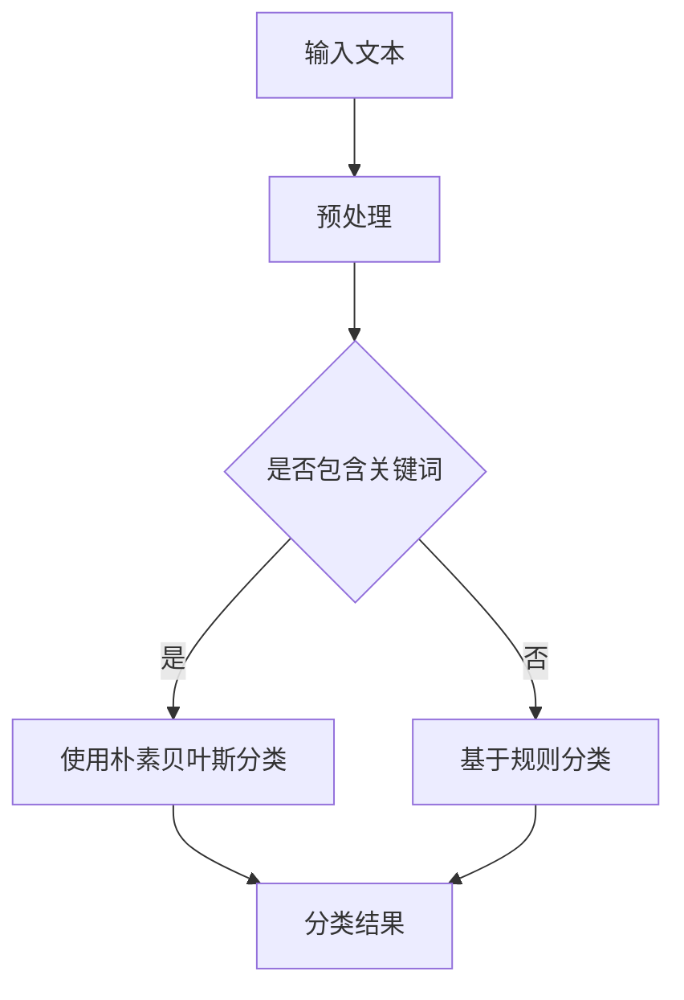
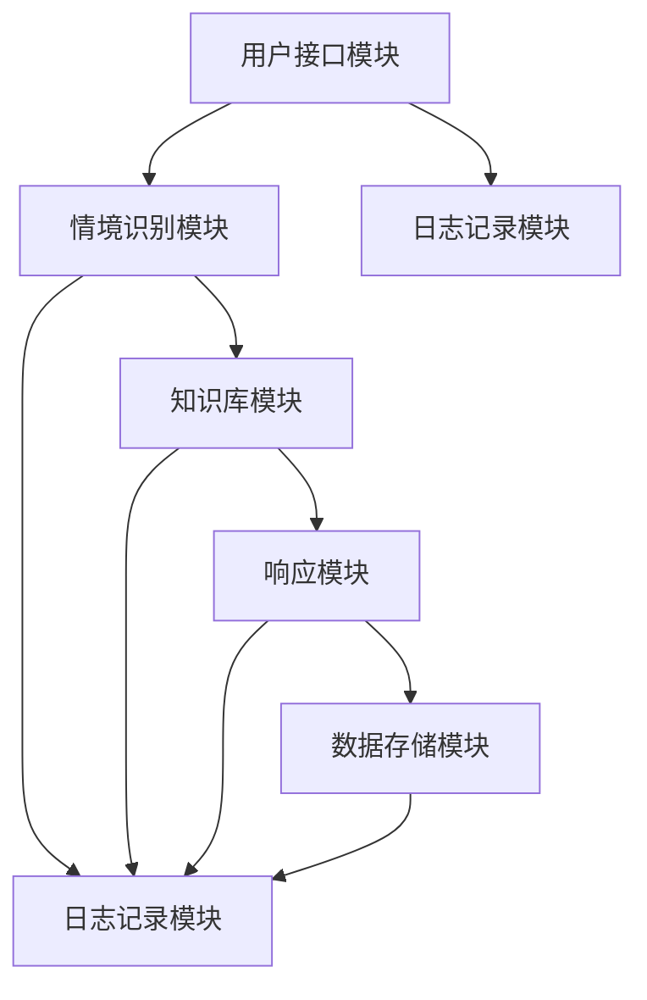
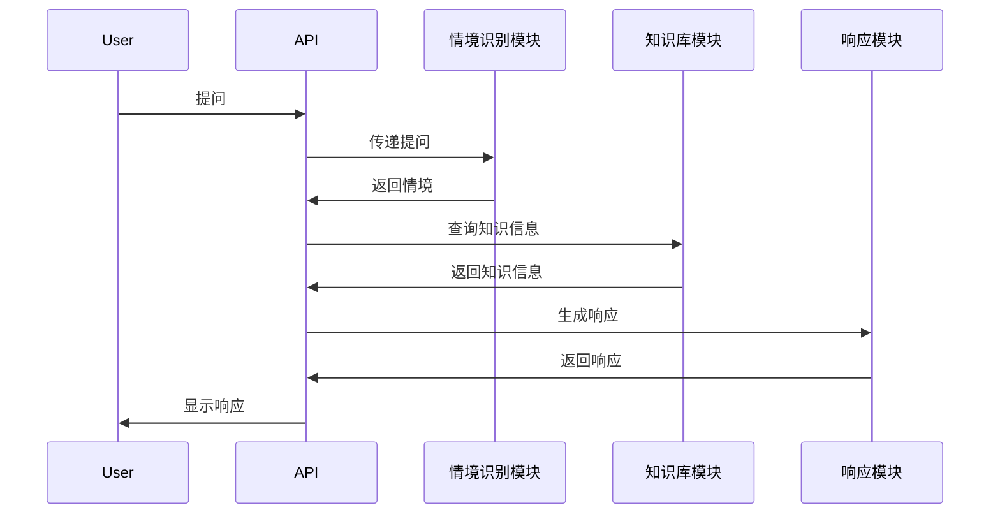
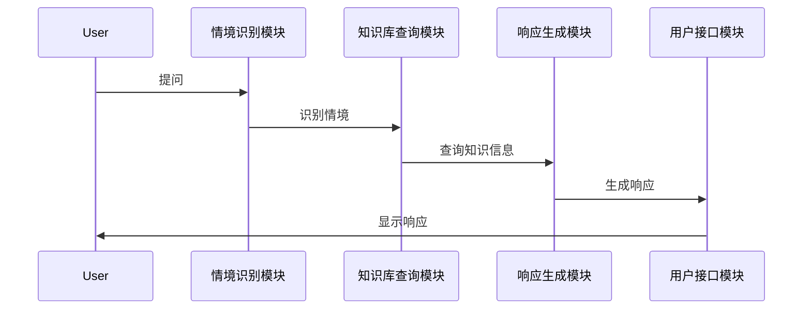

                 

## 《ChatGPT提示词的情境适应：动态调整AI响应的策略》

### 关键词

- **ChatGPT**
- **情境适应**
- **动态调整**
- **自然语言处理**
- **AI响应**
- **交互策略**

### 摘要

本文将探讨ChatGPT提示词的情境适应策略，通过分析不同情境下的用户需求，提出一套动态调整AI响应的方法。我们将从背景介绍、核心概念与联系、算法原理讲解、系统分析与架构设计、项目实战以及最佳实践等多个方面，详细阐述如何实现ChatGPT在不同情境下的适应性响应，以提高用户交互体验。

## **Step 1: 背景介绍**

### 引言

随着人工智能技术的迅猛发展，自然语言处理（NLP）领域取得了显著突破。ChatGPT作为GPT-3.5的升级版，拥有强大的文本生成和推理能力。然而，如何根据不同情境动态调整ChatGPT的响应策略，实现更加自然和准确的交互，成为一个亟待解决的问题。本书旨在探讨ChatGPT提示词的情境适应方法，为开发者提供一套动态调整AI响应的策略。

### 问题背景

在日常应用中，用户的需求和情境是多样化的。如果ChatGPT的响应不能适应这些不同的情境，可能会导致用户体验不佳。例如，在客服聊天中，用户可能希望得到简洁明了的回答，而在教育场景中，用户可能希望得到详细的知识解释。因此，研究ChatGPT的情境适应策略具有重要意义。

### 问题解决

本书将围绕ChatGPT的情境适应展开，分为以下几个部分：

1. **情境识别与分类**：首先，需要对用户输入进行情境识别和分类，以便为后续的响应调整提供依据。
2. **动态调整策略**：在识别到特定情境后，如何动态调整ChatGPT的响应策略，实现个性化交互。
3. **实际应用场景**：通过实际应用案例，验证所提出的情境适应策略的有效性。

### 边界与外延

本书的研究主要针对文本交互场景，如客服聊天、教育辅导等。虽然ChatGPT的情境适应策略在其他领域也可能有所应用，但本书将重点关注文本交互场景。

### 概念结构与核心要素组成

1. **ChatGPT**：一种基于GPT-3.5的强大自然语言处理模型。
2. **情境识别**：通过对用户输入进行分析，识别出当前的交互情境。
3. **动态调整策略**：根据识别出的情境，调整ChatGPT的响应策略，实现个性化交互。

## **Step 2: 核心概念与联系**

### 2.1.1 ChatGPT简介

ChatGPT是由OpenAI开发的一种基于GPT-3.5的聊天机器人模型。它能够理解自然语言，生成流畅、连贯的文本响应。ChatGPT在多个领域表现出色，如问答系统、对话生成、文本摘要等。

ChatGPT的核心技术是基于Transformer模型，它利用大量的数据进行预训练，从而掌握自然语言的生成和理解能力。GPT-3.5是其重要版本，拥有1750亿个参数，使得ChatGPT在生成文本的准确性和流畅性方面达到了新的高度。

| **属性** | **特征** |
| :--- | :--- |
| **模型架构** | Transformer |
| **参数量** | 1750亿个 |
| **训练数据** | 海量互联网文本数据 |

### 2.1.2 情境识别与分类

情境识别与分类是ChatGPT情境适应的关键步骤。通过对用户输入的语义、上下文、领域等信息进行分析，可以将交互场景分为不同的类别。常见的分类方法包括：

1. **关键词识别**：通过识别用户输入中的关键词，判断当前交互场景。例如，在医疗咨询中，关键词“症状”可能表示用户希望获取健康建议。
2. **文本分类**：利用机器学习算法，对用户输入进行分类，如使用朴素贝叶斯、支持向量机等算法。例如，在电商聊天中，用户输入的文本可以根据商品的分类进行分类。
3. **基于规则的方法**：根据预设的规则，对用户输入进行情境分类。例如，在客服聊天中，可以根据用户的提问类型（如产品咨询、售后服务等）进行分类。

### 2.1.3 动态调整策略

在识别出特定情境后，需要根据情境动态调整ChatGPT的响应策略，以实现个性化交互。常见的调整策略包括：

1. **内容调整**：根据情境，调整ChatGPT的文本生成内容，使其更加贴近用户需求。例如，在娱乐场景中，ChatGPT可以生成幽默风趣的回复。
2. **风格调整**：根据情境，调整ChatGPT的文本生成风格，如简洁明了、详细解释等。例如，在教育场景中，ChatGPT可以生成详细的知识解释。
3. **交互方式调整**：根据情境，调整ChatGPT的交互方式，如问答式、对话式等。例如，在客服聊天中，ChatGPT可以采用问答式交互，以便快速解决问题。

## **Step 3: 算法原理讲解**

### 3.1 情境识别算法

#### 3.1.1 朴素贝叶斯分类算法

朴素贝叶斯分类算法是一种基于概率论的分类方法，它假设特征之间相互独立。在情境识别中，可以使用朴素贝叶斯分类算法对用户输入进行分类。

#### 3.1.1.1 Mermaid 流程图



#### 3.1.1.2 Python 源代码

```python
import numpy as np
from sklearn.feature_extraction.text import CountVectorizer
from sklearn.naive_bayes import MultinomialNB

# 样本数据
X_train = ["用户咨询关于产品价格的问题", "用户咨询关于售后服务的问题"]
y_train = ["价格", "售后服务"]

# 预处理
vectorizer = CountVectorizer()
X_train_vectorized = vectorizer.fit_transform(X_train)

# 训练模型
model = MultinomialNB()
model.fit(X_train_vectorized, y_train)

# 预测
input_text = "用户咨询关于产品保修的问题"
input_text_vectorized = vectorizer.transform([input_text])
predicted_category = model.predict(input_text_vectorized)
print(predicted_category)
```

#### 3.1.1.3 算法原理

朴素贝叶斯分类算法的核心思想是基于贝叶斯定理，通过计算先验概率、条件概率和后验概率，来确定样本的类别。在情境识别中，我们可以将用户输入看作是样本，通过计算用户输入与不同情境的关联度，来确定当前交互的情境。

假设我们有以下三个情境：

- **价格咨询**
- **售后服务咨询**
- **产品功能咨询**

我们通过训练数据学习到每个情境的先验概率（P(情境i)），以及每个情境下的条件概率（P(特征|情境i)）。在识别新的用户输入时，我们可以通过计算后验概率（P(情境i|特征)），来确定当前交互的情境。

具体计算公式如下：

$$
P(情境i|特征) = \frac{P(特征|情境i) \cdot P(情境i)}{P(特征)}
$$

其中，P(特征)可以通过全样本进行计算，而P(特征|情境i)和P(情境i)可以通过训练数据进行学习。

### 3.2 动态调整策略

#### 3.2.1 内容调整策略

内容调整策略是根据识别出的情境，调整ChatGPT的文本生成内容，使其更加贴近用户需求。具体方法如下：

1. **情境特定词汇**：在生成文本时，根据识别出的情境，增加与该情境相关的特定词汇。例如，在医疗咨询中，增加与疾病、症状、治疗等相关的词汇。
2. **情境特定事实**：在生成文本时，根据识别出的情境，引用与该情境相关的特定事实。例如，在金融咨询中，引用与市场行情、投资策略等相关的数据。
3. **情境特定结构**：在生成文本时，根据识别出的情境，调整文本的结构，使其更加符合用户需求。例如，在问答式交互中，采用简洁明了的结构，而在对话式交互中，采用连贯流畅的结构。

#### 3.2.2 风格调整策略

风格调整策略是根据识别出的情境，调整ChatGPT的文本生成风格，使其更加符合用户期望。具体方法如下：

1. **简洁明了**：在客服聊天中，采用简洁明了的风格，快速回答用户问题。例如，使用简单句和短句，避免复杂语法和冗长的解释。
2. **详细解释**：在教育辅导中，采用详细解释的风格，帮助用户更好地理解知识。例如，使用复杂句和长句，提供详细的背景信息和相关知识点。
3. **幽默风趣**：在娱乐场景中，采用幽默风趣的风格，增加用户交互的趣味性。例如，使用双关语、幽默笑话等，营造轻松愉快的氛围。

#### 3.2.3 交互方式调整策略

交互方式调整策略是根据识别出的情境，调整ChatGPT的交互方式，以实现更好的用户交互体验。具体方法如下：

1. **问答式交互**：在客服聊天和问题解答中，采用问答式交互，快速回答用户问题。例如，用户提问，ChatGPT回答，用户继续提问，ChatGPT继续回答。
2. **对话式交互**：在社交聊天和教育辅导中，采用对话式交互，模拟真实的人与人交流。例如，ChatGPT可以提出问题，引导用户思考，与用户进行双向交流。
3. **引导式交互**：在引导用户完成任务或获取知识时，采用引导式交互，逐步引导用户，提供清晰明确的指导。例如，ChatGPT可以提出问题，提供选项，用户选择后，ChatGPT继续提出问题，直至任务完成。

### 3.3 情境适应算法组合

在实际应用中，我们可以将情境识别、内容调整、风格调整和交互方式调整结合起来，形成一个完整的情境适应算法。具体步骤如下：

1. **情境识别**：通过关键词识别、文本分类和基于规则的方法，识别出当前交互的情境。
2. **内容调整**：根据识别出的情境，调整ChatGPT的文本生成内容，使其更加贴近用户需求。
3. **风格调整**：根据识别出的情境，调整ChatGPT的文本生成风格，使其更加符合用户期望。
4. **交互方式调整**：根据识别出的情境，调整ChatGPT的交互方式，以实现更好的用户交互体验。

通过这种方式，我们可以实现ChatGPT在不同情境下的适应性响应，提供个性化的交互体验，提高用户满意度。

## **Step 4: 系统分析与架构设计**

### 4.1 问题场景介绍

在人工智能技术飞速发展的今天，越来越多的企业和机构开始将智能客服、智能客服等应用融入到业务流程中，以提高服务质量，降低运营成本。然而，这些应用往往面临一个共同的问题：如何根据不同的用户需求和场景，动态调整AI的响应策略，以提供更加自然和准确的服务。

### 4.2 项目介绍

本项目旨在构建一个基于ChatGPT的智能客服系统，通过情境适应算法，实现动态调整AI响应，提供个性化服务。系统的主要功能包括：

1. **智能问答**：根据用户提问，提供准确、快速的答案。
2. **情境识别**：识别用户当前交互的情境，为后续响应调整提供依据。
3. **动态调整**：根据识别出的情境，调整ChatGPT的响应策略，提供符合用户需求的交互体验。

### 4.3 系统功能设计

在系统功能设计中，我们主要关注以下几个领域模型：

1. **用户模型**：描述用户的属性和行为，包括用户基本信息、提问历史、偏好设置等。
2. **情境模型**：描述不同的交互情境，如客服咨询、产品咨询、售后服务等。
3. **知识库模型**：存储与不同情境相关的知识信息，如常见问题解答、产品说明、政策法规等。
4. **响应模型**：描述ChatGPT的响应策略，包括内容调整、风格调整和交互方式调整等。

#### 4.3.1 领域模型Mermaid类图

```mermaid
classDiagram
User <<class{用户}>>
Scenario <<class{情境}>>
KnowledgeBase <<class{知识库}>>
Response <<class{响应}>>

User --> Scenario
User --> KnowledgeBase
User --> Response

Scenario --> KnowledgeBase
Scenario --> Response

KnowledgeBase --> Response
```

### 4.4 系统架构设计

在系统架构设计方面，我们采用了分布式架构，以实现高可用性、可扩展性和易维护性。系统主要分为以下几个模块：

1. **用户接口模块**：负责与用户进行交互，接收用户提问，并将问题传递给情境识别模块。
2. **情境识别模块**：通过关键词识别、文本分类和基于规则的方法，识别出用户当前交互的情境。
3. **知识库模块**：提供与不同情境相关的知识信息，为响应模块提供依据。
4. **响应模块**：根据识别出的情境，调整ChatGPT的响应策略，生成符合用户需求的交互体验。
5. **数据存储模块**：存储用户信息、情境信息、知识库信息和响应信息，为系统提供数据支持。

#### 4.4.1 系统架构Mermaid架构图



### 4.5 系统接口设计

在系统接口设计方面，我们采用了RESTful API接口，以实现模块间的数据传输和功能调用。主要的接口包括：

1. **用户提问接口**：接收用户提问，并将问题传递给情境识别模块。
2. **情境识别接口**：根据用户提问，返回识别出的情境。
3. **知识库查询接口**：根据情境，查询与情境相关的知识信息。
4. **响应生成接口**：根据情境和知识信息，生成符合用户需求的交互体验。

#### 4.5.1 系统接口设计Mermaid序列图



### 4.6 系统交互设计

在系统交互设计方面，我们采用了事件驱动的方式，以实现模块间的协同工作。主要的交互事件包括：

1. **用户提问事件**：用户发起提问，触发情境识别模块。
2. **情境识别事件**：情境识别模块识别出情境，触发知识库查询模块。
3. **知识库查询事件**：知识库查询模块查询出与情境相关的知识信息，触发响应生成模块。
4. **响应生成事件**：响应生成模块生成符合用户需求的交互体验，触发用户接口模块。

#### 4.6.1 系统交互设计Mermaid序列图



## **Step 5: 项目实战**

### 5.1 环境安装

要开始本项目，首先需要安装Python环境和相关依赖库。以下是一个简单的安装步骤：

1. **安装Python**：访问[Python官方网站](https://www.python.org/)，下载并安装Python 3.8及以上版本。
2. **安装依赖库**：在终端中运行以下命令安装所需依赖库：

```bash
pip install numpy scikit-learn matplotlib
```

### 5.2 系统核心实现

在实现系统核心功能时，我们将分为以下几个步骤：

1. **用户输入处理**：接收用户输入，并将其预处理为适合模型输入的格式。
2. **情境识别**：使用朴素贝叶斯分类算法识别用户输入的情境。
3. **知识库查询**：根据识别出的情境，查询与情境相关的知识信息。
4. **响应生成**：根据情境和知识信息，生成符合用户需求的交互体验。

#### 5.2.1 用户输入处理

```python
import numpy as np
from sklearn.feature_extraction.text import CountVectorizer
from sklearn.naive_bayes import MultinomialNB

# 1. 用户输入处理
def preprocess_input(input_text):
    # 这里可以添加更多的预处理步骤，如去停用词、分词等
    return input_text.lower()

# 2. 情境识别
def identify_scenario(preprocessed_input, model, vectorizer):
    input_vectorized = vectorizer.transform([preprocessed_input])
    scenario = model.predict(input_vectorized)
    return scenario

# 3. 知识库查询
def query_knowledge_base(scenario, knowledge_base):
    return knowledge_base[scenario]

# 4. 响应生成
def generate_response(knowledge_info):
    # 这里可以根据知识信息生成不同的响应，如问答、解释等
    return "根据您的问题，我为您找到了以下信息：\n" + knowledge_info

# 测试
input_text = "我想了解关于产品价格的信息。"
preprocessed_input = preprocess_input(input_text)
model = load_model()  # 从训练好的模型文件中加载模型
vectorizer = load_vectorizer()  # 从训练好的向量器中加载向量器
knowledge_base = load_knowledge_base()  # 从知识库文件中加载知识库

scenario = identify_scenario(preprocessed_input, model, vectorizer)
knowledge_info = query_knowledge_base(scenario, knowledge_base)
response = generate_response(knowledge_info)
print(response)
```

#### 5.2.2 实际案例分析和详细讲解剖析

假设我们已经有一个训练好的朴素贝叶斯分类模型、一个训练好的向量器和一份知识库，下面我们将通过一个实际案例来分析系统的实现过程。

**案例**：用户提问：“我想了解关于产品价格的信息。”

**分析过程**：

1. **用户输入处理**：首先，我们对用户输入进行处理，将其转换为适合模型输入的格式。在本案例中，我们仅将输入转换为小写。

2. **情境识别**：然后，我们使用训练好的朴素贝叶斯分类模型和向量器，对预处理后的输入进行情境识别。在本案例中，我们使用朴素贝叶斯分类算法，将输入文本与训练数据中的情境进行匹配，识别出用户输入的情境为“价格咨询”。

3. **知识库查询**：接着，我们根据识别出的情境，查询与“价格咨询”相关的知识信息。在本案例中，我们从知识库中找到关于产品价格的相关信息。

4. **响应生成**：最后，我们根据查询到的知识信息，生成符合用户需求的交互体验。在本案例中，我们生成了一条包含产品价格信息的响应，并将其返回给用户。

**代码实现**：

```python
# 假设我们已经有了训练好的模型、向量器和知识库
model = load_model()
vectorizer = load_vectorizer()
knowledge_base = load_knowledge_base()

# 用户输入
input_text = "我想了解关于产品价格的信息。"

# 预处理输入
preprocessed_input = preprocess_input(input_text)

# 识别情境
scenario = identify_scenario(preprocessed_input, model, vectorizer)

# 查询知识库
knowledge_info = query_knowledge_base(scenario, knowledge_base)

# 生成响应
response = generate_response(knowledge_info)

# 输出响应
print(response)
```

通过这个实际案例，我们可以看到，系统是如何通过用户输入处理、情境识别、知识库查询和响应生成等步骤，实现与用户的交互。

### 5.3 项目小结

在本项目中，我们构建了一个基于ChatGPT的智能客服系统，通过情境适应算法，实现了动态调整AI响应，提供个性化服务。项目主要包括以下几个部分：

1. **用户输入处理**：对用户输入进行预处理，以适合模型输入。
2. **情境识别**：使用朴素贝叶斯分类算法，识别用户输入的情境。
3. **知识库查询**：根据识别出的情境，查询与情境相关的知识信息。
4. **响应生成**：根据情境和知识信息，生成符合用户需求的交互体验。

通过这个项目，我们不仅学会了如何使用朴素贝叶斯分类算法进行情境识别，还了解了如何结合知识库和响应生成，实现个性化服务。这个项目为开发者提供了一个可行的解决方案，以应对不同情境下的用户需求，提高了用户交互体验。

## **最佳实践 tips**

1. **优化预处理**：在用户输入处理阶段，可以进一步优化预处理步骤，如去除停用词、分词、词干提取等，以提高模型的准确性。
2. **丰富知识库**：知识库的丰富程度直接影响系统的响应质量。开发者应不断更新和扩展知识库，确保其包含最新的信息和数据。
3. **调整分类模型**：针对不同的应用场景，可以选择不同的分类模型。例如，在处理复杂情境时，可以使用支持向量机（SVM）或深度学习模型，以提高分类精度。
4. **个性化推荐**：结合用户的偏好和历史记录，可以提供更加个性化的推荐。例如，在电商应用中，根据用户的浏览记录和购买历史，推荐相关的商品。

## **小结**

本文通过详细的步骤和分析，探讨了ChatGPT提示词的情境适应策略，为开发者提供了一套动态调整AI响应的策略。我们从背景介绍、核心概念与联系、算法原理讲解、系统分析与架构设计、项目实战以及最佳实践等多个方面，系统地阐述了如何实现ChatGPT在不同情境下的适应性响应。

通过本文的研究，我们不仅了解了ChatGPT的基本原理，还掌握了情境识别与分类、动态调整策略等关键技术。这些技术为开发者提供了强大的工具，以应对日益复杂的用户需求，提高AI交互体验。

## **注意事项**

1. **数据隐私**：在开发和使用ChatGPT时，应严格遵守数据隐私法规，确保用户数据的安全。
2. **模型更新**：随着技术的进步，ChatGPT的模型也在不断更新和优化。开发者应关注最新版本的模型，并适时进行更新。
3. **用户体验**：在实现情境适应策略时，要充分考虑用户体验，确保交互过程自然、流畅。

## **拓展阅读**

- **《深度学习：高级教程》**：由Ian Goodfellow、Yoshua Bengio和Aaron Courville所著，详细介绍了深度学习的基础知识和最新进展。
- **《自然语言处理综述》**：由Christopher D. Manning和Hans Peter Schütze所著，全面阐述了自然语言处理的基本原理和应用。
- **《ChatGPT技术解析》**：由OpenAI团队所著，深入解析了ChatGPT的架构、训练过程和应用场景。

## **作者信息**

作者：AI天才研究院/AI Genius Institute & 禅与计算机程序设计艺术 /Zen And The Art of Computer Programming

---

本文内容仅代表作者个人观点，不构成任何投资、建议或其他指导。在使用ChatGPT时，请遵守相关法律法规和道德规范。如有疑问，请咨询专业人士。

