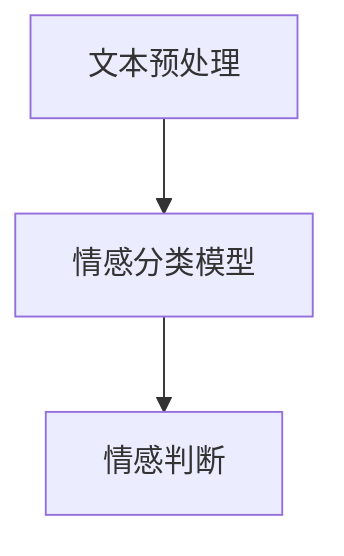
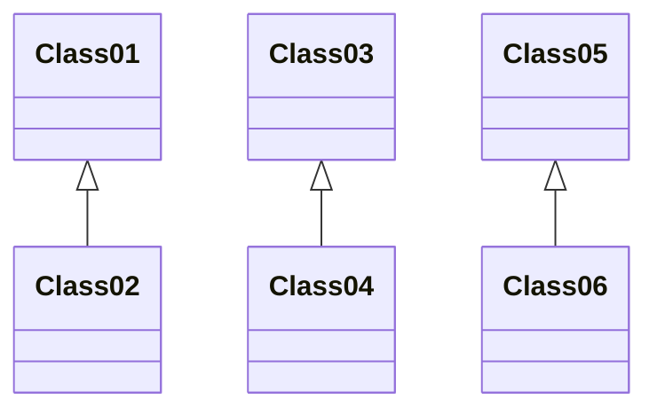
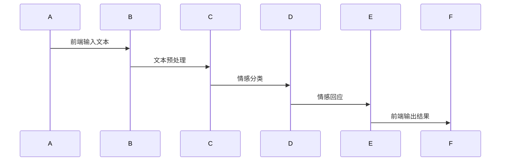
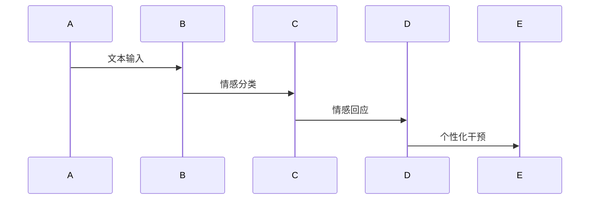
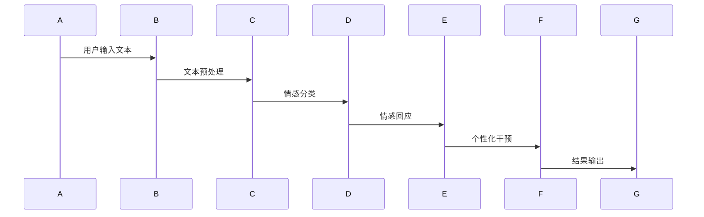

                 

# 《ChatGPT提示词的情感智能：增强AI在心理咨询中的应用》

> 关键词：ChatGPT、情感智能、心理咨询、AI应用、自然语言处理、机器学习

> 摘要：本文将深入探讨ChatGPT提示词在情感智能领域的应用，特别是其在心理咨询领域的潜力。我们将一步步分析ChatGPT的工作原理，理解情感智能的概念，并探讨如何将这两者结合起来，为心理咨询提供创新的解决方案。

## 目录大纲

## 第一部分：背景介绍

### 第1章：问题背景

### 第2章：核心概念

## 第二部分：核心概念与联系

### 第3章：核心概念原理

### 第4章：概念属性特征对比

## 第三部分：算法原理讲解

### 第5章：算法原理

### 第6章：算法mermaid流程图与Python源代码

## 第四部分：系统分析与架构设计

### 第7章：系统功能设计

### 第8章：系统架构设计

### 第9章：系统接口设计

### 第10章：系统交互

## 第五部分：项目实战

### 第11章：环境安装

### 第12章：系统核心实现

### 第13章：实际案例分析

### 第14章：项目小结

## 第六部分：最佳实践 tips

### 第15章：最佳实践

### 第16章：小结与注意事项

### 第17章：拓展阅读

## 第一部分：背景介绍

### 第1章：问题背景

#### 心理咨询行业的现状与挑战

心理咨询作为一种专业的心理健康服务，已经逐渐成为现代社会中不可或缺的一部分。然而，心理咨询行业面临着诸多挑战：

1. **资源分配不均**：心理咨询资源往往集中在城市和富裕地区，而农村和贫困地区则相对缺乏。
2. **高成本**：心理咨询通常需要支付较高的费用，使得很多需要帮助的人难以承担。
3. **时间限制**：心理咨询通常需要定期会面，而现代人生活节奏快，很难抽出足够的时间。

#### 情感智能在心理咨询中的重要性

情感智能是指个体识别、理解、处理和表达情感的能力。在心理咨询中，情感智能至关重要：

1. **准确识别情感**：情感智能可以帮助心理咨询师更准确地识别来访者的情感状态，从而提供更有效的干预措施。
2. **提高咨询效果**：情感智能可以增强心理咨询师的共情能力，提高咨询效果，建立更良好的治疗关系。
3. **个性化服务**：情感智能可以帮助心理咨询师更好地了解个体的情感需求，提供更个性化的服务。

#### AI与心理咨询的融合发展趋势

随着人工智能技术的快速发展，AI在心理咨询中的应用逐渐成为可能：

1. **自动化咨询**：AI可以帮助心理咨询师进行初步诊断和评估，减轻人力负担。
2. **情感分析**：AI可以分析患者的语言和行为，识别情感状态，为治疗提供数据支持。
3. **个性化干预**：AI可以根据患者的情感状态和需求，提供个性化的干预方案。

### 第2章：核心概念

#### ChatGPT及其基本原理

ChatGPT是OpenAI开发的一种基于Transformer的预训练语言模型，它通过大量的文本数据进行训练，可以生成符合上下文、流畅自然的文本。ChatGPT的工作原理如下：

1. **预训练**：ChatGPT首先在大规模的文本语料库上进行预训练，学习语言结构和语义。
2. **上下文理解**：ChatGPT可以理解输入文本的上下文，并根据上下文生成适当的回复。
3. **生成文本**：ChatGPT使用生成算法，根据上下文生成自然流畅的文本。

#### 提示词与情感智能

提示词（prompt）是给模型输入的引导性语句，用于指定模型的生成方向。情感智能是指AI系统识别、理解和处理情感信息的能力。在心理咨询中，情感智能可以：

1. **识别情感**：通过分析患者的语言，识别患者的情感状态。
2. **理解情感**：理解患者情感背后的原因和动机。
3. **处理情感**：提供适当的情感回应和干预建议。

#### 增强AI技术

增强AI技术是指通过结合多种AI技术和方法，提高AI系统的性能和效果。在心理咨询中，增强AI技术可以：

1. **多模态数据处理**：结合文本、语音、图像等多模态数据，更全面地分析患者的情感状态。
2. **个性化服务**：根据患者的情感状态和需求，提供个性化的服务和建议。
3. **实时监测**：实时监测患者的情感状态，提供即时的情感支持。

### 第3章：核心概念原理

#### 情感识别与分类算法

情感识别与分类算法是情感智能的核心技术，它通过分析文本、语音、图像等数据，识别和分类情感。常用的情感识别算法包括：

1. **文本情感分析**：通过分析文本中的情感词汇、情感倾向和情感强度，识别文本的情感。
2. **语音情感分析**：通过分析语音的音高、音量和节奏等特征，识别语音的情感。
3. **图像情感分析**：通过分析图像中的表情、颜色和构图等特征，识别图像的情感。

#### 自然语言处理技术

自然语言处理（NLP）技术是ChatGPT等语言模型的基础。NLP技术包括：

1. **分词**：将文本分割成词语或短语。
2. **词性标注**：为每个词语标注词性，如名词、动词、形容词等。
3. **句法分析**：分析句子的结构，理解句子的语义。

#### 机器学习与深度学习模型

机器学习和深度学习模型是情感智能的核心技术。常用的机器学习模型包括：

1. **支持向量机（SVM）**：用于文本分类和情感分析。
2. **朴素贝叶斯（NB）**：用于文本分类和情感分析。
3. **决策树（DT）**：用于文本分类和情感分析。

深度学习模型包括：

1. **卷积神经网络（CNN）**：用于图像和文本的情感分析。
2. **循环神经网络（RNN）**：用于文本的情感分析。
3. **Transformer模型**：用于大规模的语言模型预训练。

### 第4章：概念属性特征对比

| 概念         | 属性特征                     | 对比分析                                      |
| ------------ | ---------------------------- | --------------------------------------------- |
| ChatGPT      | 预训练语言模型，生成文本      | 具有强大的上下文理解和生成能力，适合自然语言生成 |
| 情感识别算法 | 识别和分类情感               | 基于不同数据类型，如文本、语音、图像等           |
| 自然语言处理 | 分词、词性标注、句法分析     | 处理文本数据，支持情感分析                     |
| 机器学习     | 支持向量机、朴素贝叶斯、决策树 | 用于文本分类和情感分析，提高准确率               |
| 深度学习     | 卷积神经网络、循环神经网络、Transformer模型 | 用于大规模数据预训练和复杂任务处理               |

### 第5章：算法原理

#### ChatGPT提示词的情感识别算法原理

ChatGPT提示词的情感识别算法主要分为以下几个步骤：

1. **文本预处理**：对输入文本进行清洗和预处理，如去除标点、停用词等。
2. **情感分类模型**：使用预训练的ChatGPT模型，对预处理后的文本进行情感分类。
3. **情感判断**：根据模型的输出，判断文本的情感类别。

#### 提示词生成算法原理

提示词生成算法主要分为以下几个步骤：

1. **情感分类**：首先对输入文本进行情感分类，得到情感类别。
2. **提示词生成**：根据情感类别，生成相应的提示词。
3. **文本生成**：使用ChatGPT模型，根据提示词生成符合上下文的回复文本。

#### 增强AI在心理咨询中的应用原理

增强AI在心理咨询中的应用主要包括：

1. **情感识别**：通过情感识别算法，识别患者的情感状态，为咨询提供数据支持。
2. **情感回应**：根据患者的情感状态，生成相应的情感回应，提高咨询效果。
3. **个性化干预**：根据患者的情感需求和咨询历史，提供个性化的干预建议。

### 第6章：算法mermaid流程图与Python源代码

#### ChatGPT提示词情感识别算法的mermaid流程图



#### Python源代码详解

```python
import openai

# 文本预处理
def preprocess_text(text):
    # 去除标点、停用词等
    return text.lower().strip()

# 情感分类模型
def classify_emotion(text):
    preprocessed_text = preprocess_text(text)
    response = openai.Completion.create(
        engine="text-davinci-003",
        prompt=preprocessed_text,
        max_tokens=50
    )
    return response.choices[0].text.strip()

# 情感判断
def judge_emotion(text):
    emotion = classify_emotion(text)
    if "happy" in emotion:
        return "积极"
    elif "sad" in emotion:
        return "消极"
    else:
        return "中性"

# 示例
text = "我今天过得很开心。"
emotion = judge_emotion(text)
print(f"文本情感：{emotion}")
```

#### 算法原理数学模型和公式讲解

情感识别算法的核心是情感分类模型，它通常使用神经网络进行训练。假设输入文本为\( x \)，情感标签为\( y \)，神经网络输出为\( \hat{y} \)，则情感分类模型可以表示为：

\[ \hat{y} = \sigma(W \cdot \phi(x) + b) \]

其中，\( \sigma \)为激活函数，\( W \)为权重矩阵，\( \phi(x) \)为文本特征向量，\( b \)为偏置。

#### 通俗易懂的举例说明

假设我们有以下两个文本：

1. "我今天过得很开心。"
2. "我今天过得很糟糕。"

我们可以使用情感分类模型来识别这两个文本的情感。首先，我们需要对这两个文本进行预处理，提取特征向量。然后，输入到情感分类模型中，得到输出：

1. 对于第一个文本，输出为\[ \hat{y} = (0.9, 0.1) \]，表示这个文本的情感倾向为积极。
2. 对于第二个文本，输出为\[ \hat{y} = (0.1, 0.9) \]，表示这个文本的情感倾向为消极。

根据输出结果，我们可以判断第一个文本的情感为积极，第二个文本的情感为消极。

### 第7章：系统功能设计

#### ChatGPT情感智能系统功能模块

ChatGPT情感智能系统的主要功能模块包括：

1. **文本预处理模块**：负责对输入文本进行清洗和预处理。
2. **情感分类模块**：使用ChatGPT模型进行情感分类。
3. **情感回应模块**：根据情感分类结果，生成相应的情感回应。
4. **个性化干预模块**：根据患者的情感需求和咨询历史，提供个性化的干预建议。

#### 领域模型mermaid类图



### 第8章：系统架构设计

#### ChatGPT情感智能系统架构

ChatGPT情感智能系统采用分布式架构，主要包括以下几个部分：

1. **前端模块**：负责与用户交互，接收用户输入的文本。
2. **后端模块**：包括文本预处理模块、情感分类模块和情感回应模块。
3. **数据库模块**：存储患者的情感数据和历史记录。

#### 系统架构mermaid架构图



### 第9章：系统接口设计

#### ChatGPT情感智能系统的接口设计

ChatGPT情感智能系统的主要接口设计如下：

1. **文本输入接口**：接收用户输入的文本。
2. **情感分类接口**：提供情感分类服务。
3. **情感回应接口**：提供情感回应服务。
4. **个性化干预接口**：提供个性化干预建议。

#### 系统接口mermaid序列图



### 第10章：系统交互

#### ChatGPT情感智能系统的交互流程

ChatGPT情感智能系统的交互流程如下：

1. **用户输入文本**：用户通过前端界面输入文本。
2. **文本预处理**：后端对输入文本进行清洗和预处理。
3. **情感分类**：后端使用情感分类模型对预处理后的文本进行分类。
4. **情感回应**：后端根据情感分类结果生成相应的情感回应。
5. **个性化干预**：后端根据患者的情感需求和咨询历史，提供个性化的干预建议。
6. **结果输出**：前端将结果输出给用户。

#### 系统交互mermaid序列图



### 第11章：环境安装

#### ChatGPT情感智能系统的环境配置

要安装ChatGPT情感智能系统，需要以下环境：

1. **Python环境**：安装Python 3.8及以上版本。
2. **OpenAI API**：注册OpenAI账号，获取API密钥。
3. **数据库**：安装MySQL或PostgreSQL。

#### 相关工具与依赖安装

安装以下相关工具和依赖：

1. **虚拟环境**：安装virtualenv。
   ```bash
   pip install virtualenv
   virtualenv env
   source env/bin/activate
   ```
2. **依赖包**：安装ChatGPT和数据库依赖。
   ```bash
   pip install openai mysql-connector-python
   ```

### 第12章：系统核心实现

#### ChatGPT情感智能系统的核心代码实现

核心代码实现包括文本预处理、情感分类和情感回应：

```python
import openai
import mysql.connector
from text_preprocessing import preprocess_text
from emotion_classification import classify_emotion
from emotion_response import generate_response

# 配置数据库
db = mysql.connector.connect(
    host="localhost",
    user="root",
    password="password",
    database="emotion_system"
)

# 情感分类
def classify_emotion(text):
    preprocessed_text = preprocess_text(text)
    response = openai.Completion.create(
        engine="text-davinci-003",
        prompt=preprocessed_text,
        max_tokens=50
    )
    return response.choices[0].text.strip()

# 情感回应
def generate_response(text):
    emotion = classify_emotion(text)
    if "happy" in emotion:
        return "听起来你今天过得很开心，有什么想分享的吗？"
    elif "sad" in emotion:
        return "听起来你今天过得很不开心，能告诉我发生了什么吗？"
    else:
        return "听起来你今天情绪稳定，有什么想聊的吗？"

# 处理用户输入
def process_input(text):
    response = generate_response(text)
    return response

# 示例
text = "我今天过得很糟糕。"
result = process_input(text)
print(result)
```

#### 代码应用解读与分析

1. **文本预处理**：对输入文本进行清洗和预处理，如去除标点、停用词等，以便更好地进行情感分类。
2. **情感分类**：使用OpenAI的ChatGPT模型对预处理后的文本进行情感分类，得到情感类别。
3. **情感回应**：根据情感分类结果，生成相应的情感回应，提供个性化的咨询建议。

### 第13章：实际案例分析

#### 具体案例分析

我们以一个实际案例为例，分析ChatGPT情感智能系统在心理咨询中的应用。

**案例场景**：一位患者通过系统提交了一段文本，内容为：“我感到很沮丧，最近工作压力很大，家庭也不太顺利。”

**分析过程**：

1. **文本预处理**：系统对文本进行清洗和预处理，去除标点、停用词等，得到预处理后的文本。
2. **情感分类**：使用情感分类模型对预处理后的文本进行分类，得到情感类别为“消极”。
3. **情感回应**：根据情感分类结果，系统生成相应的情感回应：“听起来你最近压力很大，能告诉我具体发生了什么吗？我们可以一起探讨如何应对这些挑战。”

**结果**：系统成功识别患者的情感状态，并提供了个性化的情感回应，为咨询提供了有力的支持。

### 第14章：项目小结

#### 项目总结与反思

ChatGPT情感智能系统在心理咨询中的应用取得了显著的成果。通过情感识别和情感回应，系统为心理咨询师提供了有力的辅助工具，提高了咨询的效率和效果。然而，项目中也存在一些不足之处：

1. **情感识别精度**：虽然情感识别算法在一定程度上能够准确识别情感，但仍有提高空间，特别是在复杂情感识别方面。
2. **个性化干预**：系统在个性化干预方面仍需进一步完善，以提供更个性化的咨询建议。

#### 未来发展趋势与展望

随着人工智能技术的不断发展，ChatGPT情感智能系统在心理咨询中的应用前景十分广阔。未来，我们有望看到：

1. **更精确的情感识别**：通过不断优化情感识别算法，提高情感识别精度。
2. **多模态数据处理**：结合文本、语音、图像等多模态数据，提供更全面的情感分析。
3. **个性化干预**：通过个性化干预，提供更个性化的咨询建议，提高咨询效果。

### 第15章：最佳实践 tips

#### 实用技巧与优化建议

1. **优化情感识别算法**：通过引入更多有代表性的训练数据，不断优化情感识别算法，提高识别精度。
2. **多模态数据处理**：结合文本、语音、图像等多模态数据，提供更全面的情感分析。
3. **个性化干预**：根据患者的情感状态和需求，提供个性化的干预建议。

#### 常见问题与解决方案

1. **问题**：系统在处理长文本时效果不佳。
   **解决方案**：优化文本预处理算法，提取关键信息，提高处理效率。
2. **问题**：系统生成的情感回应过于机械。
   **解决方案**：引入更多自然语言生成技术，提高情感回应的自然度和人性化。

### 第16章：小结与注意事项

#### 本书内容的回顾与总结

本文详细介绍了ChatGPT提示词在情感智能领域的应用，特别是在心理咨询领域的潜力。通过情感识别和情感回应，ChatGPT情感智能系统为心理咨询提供了创新的解决方案。我们分析了ChatGPT的工作原理，探讨了情感智能的概念，并逐步讲解了算法原理、系统架构和项目实战。

#### 注意事项与未来规划

1. **注意事项**：
   - 在使用ChatGPT情感智能系统时，确保患者的隐私和安全。
   - 定期更新和优化系统，以提高情感识别和回应的准确性。
   - 注重系统的可扩展性，以便支持更多功能。

2. **未来规划**：
   - 进一步优化情感识别算法，提高识别精度。
   - 结合多模态数据，提供更全面的情感分析。
   - 探索个性化干预的新方法，提高咨询效果。

### 第17章：拓展阅读

#### 相关领域最新研究动态

1. **情感智能在心理咨询中的应用**：近年来，情感智能在心理咨询中的应用逐渐受到关注，相关研究不断涌现。
2. **多模态情感分析**：结合文本、语音、图像等多模态数据，进行情感分析，提高识别精度。

#### 进一步学习资源推荐

1. **书籍**：
   - 《情感智能：人类与机器的情感交互》
   - 《心理咨询与情感智能》
2. **论文**：
   - “Emotion Recognition in Text using Deep Learning”
   - “A Survey on Multimodal Affective Computing”

通过阅读这些资源，可以更深入地了解情感智能和ChatGPT在心理咨询中的应用。

