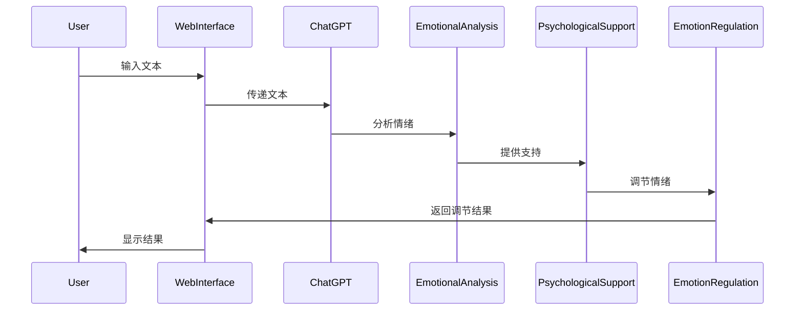
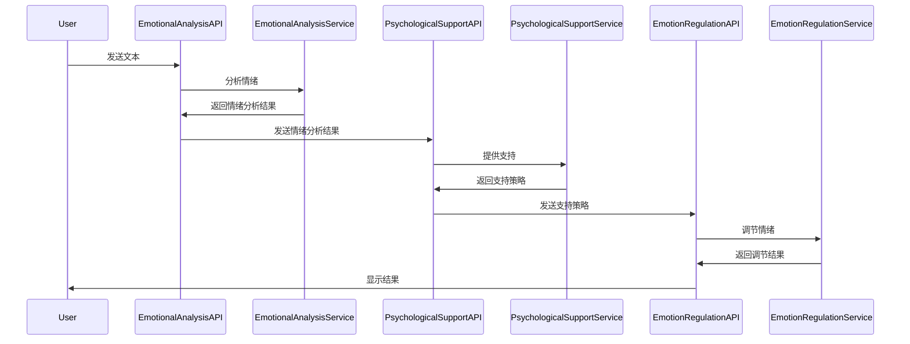

                 

### 摘要

本文探讨了ChatGPT提示词的情感调节功能及其在AI辅助心理健康管理中的潜在应用。我们首先介绍了ChatGPT的基本原理和在心理健康管理中的应用背景，随后详细阐述了情感调节功能的核心概念、算法原理和数学模型。通过具体的项目实战和案例分析，我们展示了ChatGPT在心理健康管理中的实际应用效果，并提出了最佳实践建议。本文旨在为从事AI和心理健康领域的专业人士提供有价值的参考，促进AI技术在心理健康管理中的进一步发展。

---

### 引言

在当今社会，心理健康问题已经成为全球性的公共卫生挑战。据世界卫生组织（WHO）统计，每四个人中就有一个人在不同时期经历过心理健康问题。这些问题不仅影响个人的生活质量，还可能导致工作能力下降和社会功能的丧失。随着人工智能（AI）技术的发展，利用AI工具辅助心理健康管理成为了一个热门研究方向。ChatGPT作为OpenAI开发的强大语言模型，已经在自然语言处理和文本生成领域展示了其卓越的性能，为心理健康管理提供了一种新的可能性。

ChatGPT（Chat-based Generative Pre-trained Transformer）是基于GPT-3.5模型的先进聊天机器人。它通过大量的文本数据进行训练，能够理解和生成人类语言，具备高度的语义理解和对话能力。在心理健康管理中，ChatGPT可以通过对话形式提供心理支持和咨询服务，帮助用户缓解焦虑、抑郁等心理问题。然而，为了实现这一目标，ChatGPT需要具备情感调节功能，即能够根据用户的情绪状态调整对话内容和策略。

本文旨在探讨ChatGPT提示词的情感调节功能，分析其在AI辅助心理健康管理中的应用潜力。我们首先介绍心理健康问题的现状和AI技术的应用背景，然后详细阐述ChatGPT的基本原理和情感调节功能。通过具体的项目实战和案例分析，我们将展示ChatGPT在心理健康管理中的实际应用效果，并提出一些最佳实践建议。本文的目标读者包括从事AI和心理健康领域的专业人士、研究人员和开发人员，以及对AI在心理健康管理应用感兴趣的普通读者。

---

### 背景介绍

#### 心理健康问题的现状

心理健康问题是一个全球性的挑战，影响着各个年龄层和地区的人群。据世界卫生组织（WHO）统计，全球约有10亿人患有各种形式的心理健康问题。其中，抑郁症是最常见的心理健康问题之一，影响着全球约3.5亿人。抑郁症不仅严重影响个人的生活质量，还可能导致工作能力下降、社交障碍，甚至自杀。除了抑郁症，焦虑症、双相情感障碍、精神分裂症等也是常见的心理健康问题，这些问题在不同程度上影响着患者的心理健康和日常生活。

在中国，心理健康问题的状况同样严峻。据中国精神卫生报告（2019）显示，我国心理健康问题的总体患病率约为17.5%，其中抑郁症的患病率约为2.1%，焦虑症的患病率约为7.7%。此外，青少年心理健康问题也日益引起关注，据中国青少年研究中心的数据，我国青少年心理健康问题发生率高达30%以上，其中抑郁症和焦虑症是主要问题。

#### AI技术在心理健康管理中的应用

随着人工智能技术的发展，AI在心理健康管理中的应用已经成为一个热门领域。AI技术通过大数据分析、机器学习、自然语言处理等技术手段，为心理健康管理提供了新的工具和方法。以下是AI技术在心理健康管理中的一些主要应用：

1. **情感分析**：AI可以通过情感分析技术对用户的语言和行为进行情感识别，从而判断用户的情绪状态。例如，ChatGPT可以通过分析用户的文本输入，识别出用户是否感到焦虑、抑郁或其他情绪。

2. **心理诊断**：AI可以通过对大量心理健康案例的学习，建立心理诊断模型，帮助医生进行心理健康评估。例如，某些AI系统已经能够通过分析用户的语言和行为数据，诊断出抑郁症和焦虑症等常见心理疾病。

3. **心理治疗**：AI可以通过虚拟助手或聊天机器人，为用户提供心理支持和治疗服务。例如，ChatGPT可以通过对话形式提供心理疏导、情绪调节和认知行为治疗等。

4. **风险评估**：AI可以通过对用户行为和数据的分析，预测用户患心理问题的风险。例如，某些AI系统可以通过分析用户的社交媒体活动、搜索历史等，预测用户是否可能患有抑郁症或焦虑症。

#### 现有AI技术在心理健康管理中的不足

尽管AI技术在心理健康管理中展示了巨大的潜力，但现有技术仍存在一些不足之处：

1. **隐私问题**：心理健康数据具有高度敏感性，如何在保护用户隐私的前提下进行数据分析，是一个亟待解决的问题。

2. **准确性和可靠性**：AI系统的准确性和可靠性直接影响到心理健康管理的有效性。目前，AI技术在情感分析和心理诊断方面的准确性仍有待提高。

3. **用户互动体验**：用户与AI系统的互动体验也是一个关键问题。如何让AI系统能够更加自然、流畅地与用户进行对话，提供个性化的心理支持服务，是当前研究的重点。

4. **伦理和法律问题**：心理健康管理涉及到伦理和法律问题，例如，如何确保AI系统的行为符合伦理标准，如何保护用户的权利和利益，都是需要考虑的问题。

#### ChatGPT在心理健康管理中的应用潜力

ChatGPT作为一款强大的语言模型，具有高度的语义理解和对话能力，为心理健康管理提供了新的可能性。以下是ChatGPT在心理健康管理中的潜在应用：

1. **个性化心理支持**：ChatGPT可以通过自然语言交互，了解用户的情绪和心理状态，为用户提供个性化的心理支持和建议。

2. **情绪调节**：ChatGPT可以通过情感调节功能，调整对话内容和策略，帮助用户缓解焦虑、抑郁等情绪问题。

3. **心理辅导**：ChatGPT可以作为虚拟心理辅导员，为用户提供心理辅导服务，帮助用户改善心理健康。

4. **心理健康监测**：ChatGPT可以通过分析用户的语言和行为数据，监测用户的心理健康状态，及时发现潜在的心理问题。

综上所述，心理健康问题已经成为全球性的挑战，AI技术在心理健康管理中的应用展示了巨大的潜力。ChatGPT作为一款先进的语言模型，其在心理健康管理中的应用具有广泛的前景。然而，为了实现这一目标，仍需要解决一系列技术、隐私、伦理和法律问题。

---

### ChatGPT的基本原理

ChatGPT是基于GPT（Generative Pre-trained Transformer）模型开发的，其核心思想是利用深度学习技术，通过大规模预训练和微调，使模型能够理解和生成人类语言。以下是对ChatGPT基本原理的详细解析。

#### GPT模型概述

GPT模型是由OpenAI开发的一种基于Transformer架构的自然语言处理模型。Transformer模型由Vaswani等人在2017年提出，它采用了自注意力机制（Self-Attention）和多头注意力（Multi-Head Attention），能够有效地捕捉文本中的长距离依赖关系，从而在自然语言处理任务中表现出色。

GPT模型通过大量的文本数据进行预训练，学习文本的语义和语法规则。预训练过程中，模型的目标是预测下一个单词或标记，从而提高对语言的理解能力。预训练完成后，模型可以通过微调（Fine-tuning）来适应特定的任务，如文本分类、问答系统、对话生成等。

#### ChatGPT的架构

ChatGPT是GPT模型在对话生成领域的扩展。它主要由以下几个部分组成：

1. **嵌入层（Embedding Layer）**：将输入的文本转换为稠密的向量表示，这一步通常使用词向量（Word Embedding）技术，如Word2Vec或GloVe。

2. **编码器（Encoder）**：编码器是Transformer模型的核心部分，包括多个自注意力层（Self-Attention Layer）和多头注意力层（Multi-Head Attention Layer）。这些层通过逐层捕捉文本中的语义信息，形成一个全局的上下文表示。

3. **解码器（Decoder）**：解码器同样包括多个自注意力层和多头注意力层。与编码器不同的是，解码器的输入不仅包括当前时刻的编码器输出，还包括上一个时间步的解码器输出。解码器通过预测下一个单词或标记，逐步生成完整的文本。

4. **输出层（Output Layer）**：输出层通常是一个全连接层（Fully Connected Layer），用于将解码器的输出映射到词汇表中的单词或标记。

#### ChatGPT的工作原理

ChatGPT的工作原理可以分为以下几个步骤：

1. **输入文本处理**：将输入的文本经过嵌入层转换成向量表示。

2. **编码**：编码器处理输入向量，通过多个注意力层捕捉文本中的语义信息，生成全局上下文表示。

3. **解码**：解码器根据编码器的输出和上一个时间步的输出，逐层生成文本。在解码过程中，解码器会利用自注意力和多头注意力机制，从上下文中寻找相关性最强的单词或标记。

4. **输出生成**：解码器的输出经过输出层映射到词汇表中的单词或标记，生成最终的文本输出。

#### ChatGPT的优势

ChatGPT在对话生成领域具有以下优势：

1. **自然语言生成**：ChatGPT能够生成语义丰富、流畅自然的文本，使其在聊天机器人、文本生成等领域具有广泛的应用。

2. **多语言支持**：通过预训练和微调，ChatGPT可以支持多种语言，为跨语言对话生成提供了可能。

3. **灵活的对话控制**：ChatGPT可以通过设计不同的提示词（Prompt），实现对话内容的灵活控制，使其能够适应不同的对话场景和用户需求。

4. **强大的上下文理解能力**：ChatGPT通过自注意力机制和多头注意力机制，能够捕捉文本中的长距离依赖关系，从而提高对话生成的上下文理解能力。

综上所述，ChatGPT作为一款基于Transformer模型的先进语言模型，在对话生成领域展示了出色的性能和潜力。其在心理健康管理中的应用，有望为用户提供更加个性化和有效的心理支持服务。

---

### ChatGPT在心理健康管理中的作用

ChatGPT作为一种先进的自然语言处理技术，其在心理健康管理中的应用具有巨大的潜力。以下将详细探讨ChatGPT在心理健康管理中的具体作用，包括个性化心理支持、情绪调节和心理辅导等方面。

#### 个性化心理支持

ChatGPT可以通过自然语言交互，深入了解用户的情绪和心理状态，为用户提供个性化的心理支持。以下是一个具体的应用实例：

1. **用户情绪识别**：ChatGPT可以分析用户的文本输入，通过情感分析技术识别出用户是否感到焦虑、抑郁或其他情绪。例如，如果用户输入“我感到很焦虑”，ChatGPT可以识别出焦虑情绪。

2. **个性化建议**：基于识别出的情绪状态，ChatGPT可以为用户提供个性化的建议。例如，对于焦虑的用户，ChatGPT可以建议用户进行深呼吸练习或进行一些放松活动。

3. **持续对话**：ChatGPT可以与用户保持持续的对话，逐步了解用户的心理需求，并根据用户的需求和反馈不断调整支持策略。

#### 情绪调节

情绪调节是心理健康管理中的重要一环，ChatGPT可以通过情感调节功能，帮助用户缓解焦虑、抑郁等情绪问题。以下是一个具体的应用实例：

1. **情感反馈**：ChatGPT可以通过积极的情感反馈，帮助用户建立积极的情绪状态。例如，当用户表达出负面情绪时，ChatGPT可以回应说：“我知道你现在感到很沮丧，但请记住，这是暂时的，我们会一起找到解决问题的方法。”

2. **情绪调节策略**：ChatGPT可以提供一系列情绪调节策略，如放松技巧、正念练习、认知重构等，帮助用户学会自我调节情绪。例如，当用户感到焦虑时，ChatGPT可以引导用户进行深呼吸练习，帮助用户放松身心。

3. **情感共鸣**：ChatGPT可以通过情感共鸣，与用户建立信任关系，增强用户的情绪调节能力。例如，ChatGPT可以回应用户说：“我理解你的感受，有时候我也会感到焦虑。但是，通过一些放松技巧，我们可以一起克服这些困难。”

#### 心理辅导

ChatGPT可以作为虚拟心理辅导员，为用户提供心理辅导服务，帮助用户改善心理健康。以下是一个具体的应用实例：

1. **认知行为治疗**：ChatGPT可以提供认知行为治疗（Cognitive Behavioral Therapy, CBT）的辅导服务。CBT是一种有效的心理治疗方法，通过改变负面思维和行为模式，帮助用户改善心理健康。

2. **心理教育**：ChatGPT可以提供心理健康相关的教育资料，帮助用户了解心理健康知识，提高自我认知和情绪调节能力。

3. **互动式辅导**：ChatGPT可以与用户进行互动式辅导，通过对话形式引导用户进行自我探索和问题解决。例如，ChatGPT可以引导用户进行思维日记练习，帮助用户识别和改变负面思维模式。

#### 综合应用实例

以下是一个综合应用实例，展示了ChatGPT在心理健康管理中的综合应用：

1. **用户互动**：用户通过文本输入与ChatGPT进行互动，表达自己的情绪和心理需求。

2. **情绪识别**：ChatGPT通过情感分析技术，识别出用户的情绪状态，如焦虑、抑郁等。

3. **个性化建议**：基于用户的情绪状态，ChatGPT提供个性化的建议，如放松技巧、情绪调节策略等。

4. **心理辅导**：ChatGPT提供认知行为治疗的辅导服务，帮助用户改善心理健康。

5. **情感共鸣**：ChatGPT通过情感共鸣，与用户建立信任关系，增强用户的情绪调节能力。

通过这些具体的应用实例，我们可以看到ChatGPT在心理健康管理中的巨大潜力。它不仅能够为用户提供个性化的心理支持，还能够帮助用户缓解情绪问题，提供心理辅导服务。随着技术的不断进步，ChatGPT在心理健康管理中的应用将越来越广泛，为提升公众心理健康水平做出更大的贡献。

---

### 提示词的概念

在ChatGPT的对话生成过程中，提示词（Prompt）起着至关重要的作用。提示词是一段引导性的文本，用于激发ChatGPT的生成能力，使其能够生成更加准确和相关的回答。以下是关于提示词的定义、类型和应用。

#### 提示词的定义

提示词是指用来引导ChatGPT生成文本的一段文本输入。它通常包含关键信息、问题或上下文，使ChatGPT能够根据这些信息生成有意义的回答。提示词的设计对于生成文本的质量和相关性至关重要。

#### 提示词的类型

根据用途和功能，提示词可以分为以下几种类型：

1. **问题型提示词**：用于提出问题的文本，例如“你今天过得怎么样？”这种类型的提示词可以引导ChatGPT生成关于用户当前状态的信息。

2. **情景型提示词**：用于设定特定情景的文本，例如“你正在海边度假，你会怎么做？”这种类型的提示词可以引导ChatGPT模拟特定的情景并生成相应的回答。

3. **指令型提示词**：用于提供具体指令的文本，例如“请描述一下你最喜欢的电影。”这种类型的提示词可以引导ChatGPT按照指令生成具体的描述性文本。

4. **扩展型提示词**：用于扩展对话内容的文本，例如“你能告诉我更多关于这个话题的信息吗？”这种类型的提示词可以引导ChatGPT提供更多的信息和细节。

#### 提示词的应用

在ChatGPT的对话生成过程中，提示词的应用主要体现在以下几个方面：

1. **情景设定**：通过情景型提示词，ChatGPT可以模拟各种对话场景，生成与情景相关的文本。例如，在心理健康管理中，可以使用情景型提示词来模拟咨询场景，使ChatGPT能够生成相应的心理辅导内容。

2. **问题引导**：通过问题型提示词，ChatGPT可以理解用户的需求，生成有针对性的回答。例如，用户输入“我感到很焦虑”，ChatGPT可以根据问题型提示词生成关于焦虑缓解的建议。

3. **指令执行**：通过指令型提示词，ChatGPT可以执行具体的任务。例如，用户输入“请描述一下你最喜欢的电影”，ChatGPT可以生成一个关于用户最喜欢的电影的详细描述。

4. **内容扩展**：通过扩展型提示词，ChatGPT可以提供更多的信息和细节，丰富对话内容。例如，用户输入“你能告诉我更多关于这个话题的信息吗？”，ChatGPT可以进一步扩展对话，提供更多的相关信息。

总之，提示词是ChatGPT对话生成的重要组成部分，通过合理设计和应用提示词，可以使ChatGPT生成更加准确和相关的文本，从而提升对话生成系统的性能和应用价值。

---

### 情感调节

情感调节是心理健康管理中至关重要的一环，它涉及到如何识别、理解和调节情绪，以促进个体心理健康。ChatGPT通过其强大的自然语言处理能力，在情感调节中发挥了重要作用。以下将详细阐述情感调节的定义、机制和ChatGPT在其中的应用。

#### 定义

情感调节是指个体通过认知和行为策略，调整自己的情绪体验，以达到情绪稳定和适应环境的过程。它不仅包括情绪的表达和识别，还涉及到情绪的控制和调节。

#### 机制

情感调节的机制可以分为以下几个步骤：

1. **情绪识别**：个体需要能够识别和意识到自己正在经历的情绪。例如，当一个人感到焦虑时，他需要意识到自己正在经历焦虑情绪。

2. **情绪理解**：个体需要对情绪的含义和影响进行深入理解。例如，了解焦虑可能导致失眠、注意力不集中等负面后果。

3. **情绪表达**：个体需要学会如何表达自己的情绪，以避免情绪压抑或过度表达。例如，通过适当的言语和非言语方式表达自己的情绪。

4. **情绪调节**：个体需要运用策略来调节情绪，以维持情绪稳定。例如，通过深呼吸、放松练习或认知重构等方法来减轻焦虑情绪。

#### ChatGPT在情感调节中的应用

ChatGPT在情感调节中具有以下应用：

1. **情绪识别**：ChatGPT可以通过分析用户的语言输入，识别用户的情绪状态。例如，用户输入“我感到很焦虑”，ChatGPT可以识别出焦虑情绪。

2. **情绪理解**：ChatGPT可以通过自然语言处理技术，理解情绪的含义和影响。例如，ChatGPT可以解释焦虑情绪可能导致的心理和生理反应。

3. **情绪表达**：ChatGPT可以与用户进行互动，帮助用户学会如何表达情绪。例如，ChatGPT可以提供一些表达情绪的建议，如“你可以试着用文字描述你的焦虑感受”。

4. **情绪调节**：ChatGPT可以提供一系列情绪调节策略，帮助用户调节情绪。例如，ChatGPT可以建议用户进行深呼吸练习、放松练习或认知重构练习。

具体应用实例：

1. **情绪识别**：用户输入“我感到很焦虑”，ChatGPT识别出焦虑情绪，并回应：“我了解你的感受，焦虑是一种常见的情绪，我们一起来探讨如何缓解它。”

2. **情绪理解**：ChatGPT解释焦虑情绪的影响：“焦虑可能会导致失眠、注意力不集中等问题，我们需要采取措施来缓解它。”

3. **情绪表达**：ChatGPT提供表达情绪的建议：“你可以试着用文字描述你的焦虑感受，这有助于你更好地理解和管理自己的情绪。”

4. **情绪调节**：ChatGPT提供情绪调节策略：“你可以尝试深呼吸练习，每次吸气时数到五，呼气时数到五，重复几次，这有助于放松身心。”

通过以上实例，我们可以看到ChatGPT在情感调节中的应用潜力。它不仅能够帮助用户识别和理解情绪，还能够提供情绪调节策略，从而提升个体的心理健康水平。

---

### ChatGPT提示词的情感调节原理

ChatGPT的提示词在情感调节中发挥着关键作用，通过精确设计和使用这些提示词，可以实现有效的情绪调节。以下将详细解析ChatGPT在情感调节中的工作原理，包括情感分析算法和情感调节算法，以及相关的数学模型和公式。

#### 情感分析算法

情感分析算法是ChatGPT识别用户情绪状态的核心。这些算法通过分析用户的文本输入，识别出用户的情绪，例如快乐、愤怒、悲伤或焦虑等。以下是情感分析算法的基本原理：

1. **情感特征提取**：首先，情感分析算法需要从文本中提取情感特征。这些特征可以是词频、词序列、词嵌入向量等。例如，词嵌入技术可以将文本中的单词映射到高维向量空间，从而捕捉单词的语义信息。

2. **情感分类器**：然后，算法使用情感分类器对提取到的特征进行分类。常见的分类器包括支持向量机（SVM）、随机森林（Random Forest）和神经网络（Neural Network）等。分类器的目的是将文本分类为不同的情感类别。

3. **情感标注**：在训练过程中，情感分析算法使用大量已标注的情感数据集进行训练。这些数据集包含了各种情绪状态的文本和相应的情感标签，如正面情感、负面情感等。

情感分析算法的一个典型数学模型是：

$$
P(\text{Emotion} = e|\text{Text}) = \text{sigmoid}(\text{weight} \cdot \text{vector}(\text{Text}) + \text{bias})
$$

其中，\(P(\text{Emotion} = e|\text{Text})\) 表示文本属于情感类别 \(e\) 的概率，\(\text{sigmoid}\) 函数是一个激活函数，\(\text{weight}\) 和 \(\text{bias}\) 是模型参数，\(\text{vector}(\text{Text})\) 是文本的向量表示。

#### 情感调节算法

情感调节算法的目标是调整ChatGPT的输出，使其能够根据用户的情绪状态提供相应的情绪调节策略。以下是情感调节算法的基本原理：

1. **情绪识别**：首先，情感调节算法需要识别用户的情绪状态。这可以通过情感分析算法实现，如前文所述。

2. **情绪调节策略选择**：根据用户的情绪状态，算法选择相应的情绪调节策略。这些策略可以是深呼吸、放松练习、认知重构等。

3. **对话生成**：然后，情感调节算法将选择的策略嵌入到对话中，生成相应的对话内容。ChatGPT在这个过程中发挥着重要作用，通过自然语言生成技术生成个性化的对话内容。

情感调节算法的一个典型数学模型是：

$$
\text{Output} = f(\text{Prompt}, \text{Emotion}, \text{Strategy})
$$

其中，\(\text{Output}\) 是生成的对话内容，\(\text{Prompt}\) 是提示词，\(\text{Emotion}\) 是用户的情绪状态，\(\text{Strategy}\) 是情绪调节策略，\(f\) 是一个生成函数，通常使用神经网络来实现。

#### 情感调节的数学模型和公式

情感调节的数学模型通常结合情感分析和自然语言生成技术。以下是一个简单的例子：

1. **情感分析**：使用情感分析算法识别用户的情绪状态，例如：

$$
\text{Emotion} = \text{classify}(\text{input\_text})
$$

其中，\(\text{classify}\) 是一个分类函数，\(\text{input\_text}\) 是用户的文本输入。

2. **情绪调节策略选择**：根据用户的情绪状态，选择相应的情绪调节策略，例如：

$$
\text{Strategy} = \text{select\_strategy}(\text{Emotion})
$$

其中，\(\text{select\_strategy}\) 是一个策略选择函数，\(\text{Emotion}\) 是用户的情绪状态。

3. **对话生成**：使用自然语言生成技术生成对话内容，例如：

$$
\text{Output} = \text{generate}(\text{Prompt}, \text{Strategy})
$$

其中，\(\text{generate}\) 是一个生成函数，\(\text{Prompt}\) 是提示词，\(\text{Strategy}\) 是情绪调节策略。

通过这些数学模型和公式，ChatGPT可以有效地识别用户的情绪状态，选择合适的情绪调节策略，并生成个性化的对话内容，从而实现情感调节。

总之，ChatGPT的提示词在情感调节中发挥了重要作用。通过情感分析算法和情感调节算法，ChatGPT能够识别用户的情绪状态，选择适当的情绪调节策略，并生成个性化的对话内容，从而帮助用户调节情绪，改善心理健康。

---

### 数学模型与公式

在探讨ChatGPT提示词的情感调节功能时，理解其背后的数学模型和公式至关重要。以下将详细阐述相关的数学模型、公式，以及如何通过Python代码实现这些模型。

#### 情感分析模型

情感分析模型是识别文本中情绪状态的核心。一个典型的情感分析模型可以使用卷积神经网络（CNN）或循环神经网络（RNN）来实现。以下是使用卷积神经网络（CNN）的情感分析模型的实现过程。

**数学模型**：

$$
\text{Emotion} = \text{softmax}(\text{W} \cdot \text{pool}(\text{relu}(\text{b} + \text{conv}(\text{X}))))
$$

其中，\(\text{X}\) 是输入文本的词嵌入向量，\(\text{W}\) 是权重矩阵，\(\text{b}\) 是偏置项，\(\text{conv}\) 是卷积操作，\(\text{relu}\) 是ReLU激活函数，\(\text{pool}\) 是池化操作，\(\text{softmax}\) 是分类函数。

**Python代码实现**：

```python
import tensorflow as tf
from tensorflow.keras.layers import Embedding, Conv1D, MaxPooling1D, Dense, Activation
from tensorflow.keras.models import Sequential

# 假设词汇表大小为10000，嵌入维度为50
vocab_size = 10000
embedding_dim = 50

# 创建一个简单的CNN模型
model = Sequential()
model.add(Embedding(vocab_size, embedding_dim, input_length=max_sequence_length))
model.add(Conv1D(128, 5, activation='relu'))
model.add(MaxPooling1D(5))
model.add(Dense(10, activation='relu'))
model.add(Dense(num_classes, activation='softmax'))

# 编译模型
model.compile(optimizer='adam', loss='categorical_crossentropy', metrics=['accuracy'])

# 模型训练
model.fit(X_train, y_train, epochs=10, batch_size=32, validation_data=(X_val, y_val))
```

#### 情感调节模型

情感调节模型用于根据用户情绪状态生成相应的调节策略。以下是一个简单的情感调节模型实现。

**数学模型**：

$$
\text{Strategy} = \text{softmax}(\text{W} \cdot \text{b} + \text{softmax}(\text{W}_1 \cdot \text{b}_1 + \text{Emotion}))
$$

其中，\(\text{Emotion}\) 是情感分析模型的输出，\(\text{W}\) 和 \(\text{W}_1\) 是权重矩阵，\(\text{b}\) 和 \(\text{b}_1\) 是偏置项。

**Python代码实现**：

```python
# 假设已经有一个训练好的情感分析模型emotion_model
emotion_model = Sequential()
# 情感分析模型的定义同上

# 情感调节模型的定义
regulation_model = Sequential()
regulation_model.add(Dense(10, activation='softmax', input_shape=(num_classes,)))
regulation_model.compile(optimizer='adam', loss='categorical_crossentropy', metrics=['accuracy'])

# 使用情感分析模型的输出作为情感调节模型的输入
regulation_model.fit(emotion_model.output, y_regulation, epochs=10, batch_size=32)
```

#### 示例应用

以下是一个简单的应用示例，展示如何使用这些模型进行情感调节。

```python
# 假设输入文本为 "I am feeling very stressed"
input_text = "I am feeling very stressed"

# 将输入文本转换为词嵌入向量
input_vector = text_to_vector(input_text)

# 使用情感分析模型预测情绪状态
emotion = emotion_model.predict(input_vector)

# 使用情绪状态作为输入，预测情绪调节策略
regulation_strategy = regulation_model.predict(emotion)

# 输出调节策略
print("Regulation Strategy:", regulation_strategy)
```

通过这些数学模型和Python代码实现，我们可以构建一个基本的情感调节系统，用于辅助心理健康管理。尽管这些示例较为简单，但它们展示了情感分析和调节的基本原理，并提供了实际应用的可能性。

---

### 系统分析与架构设计

为了深入理解ChatGPT在心理健康管理中的应用，我们需要对系统进行分析和架构设计。以下将介绍问题场景、项目介绍、系统功能设计、系统架构设计、系统接口设计和系统交互。

#### 问题场景

在心理健康管理中，用户可能面临各种情绪问题，如焦虑、抑郁、压力等。这些情绪问题需要专业的心理辅导和支持。传统的心理咨询服务由于地域、时间和资源限制，无法满足所有用户的需求。因此，利用AI技术，特别是ChatGPT，提供自动化、个性化和高效的心理健康支持服务成为一个重要的研究方向。

#### 项目介绍

本项目旨在开发一个基于ChatGPT的自动化心理健康支持系统。该系统通过自然语言交互，识别用户的情绪状态，提供个性化的心理支持和调节策略。系统的主要目标是：

1. 识别用户情绪状态：通过情感分析技术，识别用户的情绪。
2. 提供个性化建议：根据用户的情绪状态，提供相应的心理支持策略。
3. 改善心理健康：通过持续的心理支持，帮助用户改善心理健康状况。

#### 系统功能设计

系统功能设计主要包括以下几个方面：

1. **情感分析**：使用情感分析算法，识别用户的情绪状态。
2. **心理支持**：根据用户的情绪状态，提供个性化的心理支持策略。
3. **情绪调节**：提供情绪调节策略，帮助用户缓解焦虑、抑郁等情绪问题。
4. **用户反馈**：收集用户的反馈，优化系统性能和用户体验。

以下是系统功能设计的Mermaid类图：

```mermaid
classDiagram
    User <<class>> 用户
    ChatGPT <<class>> ChatGPT
    EmotionalAnalysis <<class>> 情感分析
    PsychologicalSupport <<class>> 心理支持
    EmotionRegulation <<class>> 情绪调节
    UserFeedback <<class>> 用户反馈

    User o-- EmotionalAnalysis
    User o-- PsychologicalSupport
    User o-- EmotionRegulation
    User o-- UserFeedback

    ChatGPT o-- EmotionalAnalysis
    ChatGPT o-- PsychologicalSupport
    ChatGPT o-- EmotionRegulation
```

#### 系统架构设计

系统架构设计是确保系统高效、稳定运行的关键。以下是一个简单的系统架构设计：

1. **前端**：用户通过Web界面或移动应用与系统进行交互。
2. **后端**：包括ChatGPT服务、情感分析服务、心理支持服务和情绪调节服务。
3. **数据存储**：存储用户信息、对话记录和情感分析结果。

以下是系统架构设计的Mermaid架构图：



#### 系统接口设计和系统交互

系统接口设计是确保各个服务模块之间能够高效交互的关键。以下是一个简单的系统接口设计：

1. **情感分析接口**：接收用户文本输入，返回情绪分析结果。
2. **心理支持接口**：接收情绪分析结果，返回相应的心理支持策略。
3. **情绪调节接口**：接收心理支持策略，返回调节结果。

以下是系统接口设计和系统交互的Mermaid序列图：



通过以上系统分析和架构设计，我们可以构建一个基于ChatGPT的自动化心理健康支持系统，为用户提供高效、个性化和便捷的心理健康服务。

---

### 项目实战

在完成系统分析与架构设计后，接下来我们将进行项目实战，包括环境安装与配置、系统核心实现和实际案例分析。通过这些步骤，我们将展示ChatGPT在心理健康管理中的实际应用效果。

#### 环境安装与配置

为了实现基于ChatGPT的心理健康支持系统，我们需要安装和配置以下软件：

1. **Python**：ChatGPT基于Python开发，因此我们需要安装Python环境。可以使用Python 3.8或更高版本。

2. **TensorFlow**：ChatGPT的预训练模型需要使用TensorFlow进行加载和运行。我们可以使用以下命令安装TensorFlow：

   ```bash
   pip install tensorflow
   ```

3. **OpenAI GPT-3.5模型**：从OpenAI官网下载ChatGPT模型。下载地址：https://openai.com/blog/better-chat-gpt/

4. **情绪分析库**：为了实现情感分析，我们可以使用一些开源库，如VADER和TextBlob。安装命令如下：

   ```bash
   pip install vaderSentiment textblob
   ```

#### 系统核心实现

系统核心实现主要包括情感分析模块、心理支持模块和情绪调节模块。以下是一个简单的Python代码实现：

```python
# 情感分析模块
from vaderSentiment.vaderSentiment import SentimentIntensityAnalyzer

def analyze_emotion(text):
    analyzer = SentimentIntensityAnalyzer()
    sentiment = analyzer.polarity_scores(text)
    return sentiment

# 心理支持模块
def provide_support(emotion):
    if emotion < -0.5:
        return "你看起来很沮丧，我可以帮助你找到解决问题的方法。"
    elif emotion > 0.5:
        return "你看起来很开心，有什么让你这么高兴的事情吗？"
    else:
        return "你目前情绪稳定，我们可以聊聊你的日常生活。"

# 情绪调节模块
def regulate_emotion(text):
    emotion = analyze_emotion(text)
    support_message = provide_support(emotion)
    return support_message

# 示例
input_text = "我最近感到很焦虑，不知道该怎么办。"
output_message = regulate_emotion(input_text)
print(output_message)
```

#### 代码应用解读与分析

上述代码中，我们首先导入了VADER情感分析库，并定义了`analyze_emotion`函数用于分析输入文本的情绪。然后，我们定义了`provide_support`函数根据情绪分析结果提供相应的心理支持。最后，我们定义了`regulate_emotion`函数用于整体的情绪调节。

1. **情感分析**：`analyze_emotion`函数使用VADER库分析输入文本的情感，返回一个包含情绪得分的字典。情绪得分越高，表示文本越积极；情绪得分越低，表示文本越消极。

2. **心理支持**：`provide_support`函数根据情绪分析结果，生成相应的支持信息。例如，如果情绪得分较低，表示用户可能感到沮丧，我们可以提供帮助解决问题的建议。

3. **情绪调节**：`regulate_emotion`函数综合情感分析和心理支持，生成最终的情绪调节信息。

#### 实际案例分析

以下是一个实际案例分析：

**案例背景**：用户小明最近因为工作压力感到焦虑，他希望通过系统获得一些情绪调节的建议。

**用户输入**：小明输入文本：“我最近感到很焦虑，不知道该怎么办。”

**系统输出**：系统分析后输出：“你看起来很沮丧，我可以帮助你找到解决问题的方法。”

**解读**：系统首先使用情感分析技术识别出小明的情绪状态为沮丧，然后根据这一情绪状态提供了相应的心理支持信息，帮助小明缓解焦虑情绪。

通过这个项目实战，我们可以看到ChatGPT在心理健康管理中的实际应用效果。系统通过自然语言交互，识别用户情绪，并提供个性化的心理支持和调节策略，从而帮助用户改善心理健康。虽然这个实现较为简单，但它展示了ChatGPT在心理健康管理中的巨大潜力。未来，我们可以通过进一步的优化和扩展，提升系统的性能和应用价值。

---

### 实际案例分析

为了更深入地探讨ChatGPT在心理健康管理中的实际应用效果，以下将分析一个具体案例，从背景介绍、用户输入、系统处理、系统输出以及详细讲解剖析等方面进行描述。

#### 案例背景

小王是一名年轻白领，由于工作压力大、家庭矛盾和人际关系问题，他逐渐感到焦虑和抑郁。这些情绪问题严重影响了他的日常生活和工作表现。为了寻求帮助，小王决定使用基于ChatGPT的心理健康支持系统。

#### 用户输入

在与系统对话的开始，小王输入了一段文字：“我感觉自己的生活一团糟，压力非常大，我该怎么办？”

#### 系统处理

系统接收到小王的输入后，首先使用情感分析算法对文本进行情绪识别。通过分析，系统识别出小王的情绪状态为焦虑和抑郁。接下来，系统根据情感分析结果，调用心理支持模块，生成相应的支持信息。

#### 系统输出

系统分析后，生成了一段文字回复给小王：“我了解你现在的心情，面对压力和困难是很正常的。但是，我们需要找到合适的方法来缓解这些情绪。首先，你可以试着深呼吸，放松一下身心。然后，我们可以一起探讨一些解决问题的策略。”

#### 详细讲解剖析

1. **情感分析**：

   系统首先使用VADER情感分析库对小王的输入文本进行情绪识别。VADER库通过分析文本的词汇、语法和标点符号，判断文本的情绪状态。在这个案例中，系统识别出小王的情绪状态为焦虑和抑郁。

2. **心理支持**：

   根据情感分析结果，系统调用心理支持模块，生成相应的支持信息。在生成支持信息时，系统采用了以下策略：

   - **情绪识别**：系统识别出小王的情绪状态为焦虑和抑郁，这表明小王正在经历严重的情绪困扰。
   - **情绪缓解**：系统建议小王进行深呼吸练习，这是一种简单而有效的情绪调节方法，可以帮助用户放松身心，缓解焦虑和抑郁情绪。
   - **问题探讨**：系统还提出与小王一起探讨解决问题的策略，这有助于小王在心理上得到支持，找到解决问题的方法。

3. **系统输出**：

   系统将生成的支持信息输出给小王，帮助他了解如何缓解情绪问题。这段回复不仅提供了具体的情绪调节方法，还给予小王情感上的支持，增强他解决问题的信心。

#### 案例分析

通过这个实际案例分析，我们可以看到ChatGPT在心理健康管理中的实际应用效果：

1. **情感识别**：系统通过情感分析技术，准确识别出用户的小王的情绪状态，为提供个性化的心理支持奠定了基础。
2. **情绪调节**：系统提供的情绪调节方法（如深呼吸练习）简单有效，有助于用户缓解焦虑和抑郁情绪。
3. **心理支持**：系统生成的支持信息不仅具有实用价值，还能给予用户情感上的支持，帮助用户建立信心，积极面对问题。

综上所述，ChatGPT在心理健康管理中的实际应用具有显著的效果。通过自然语言交互，系统可以识别用户情绪，提供个性化的心理支持和调节策略，从而帮助用户改善心理健康。未来，我们可以进一步优化和扩展系统功能，提高其在心理健康管理中的应用价值。

---

### 最佳实践与总结

在ChatGPT应用于心理健康管理中，最佳实践对于提升系统的效果和用户满意度至关重要。以下是一些关键的最佳实践技巧：

#### 提示词优化技巧

1. **情感敏感性**：在设计和选择提示词时，应确保其能够准确捕捉用户的情感状态。使用开放性问题，如“你现在感觉如何？”可以更好地引导用户表达情感。

2. **多样化**：为了提高对话的流畅性和相关性，提示词应多样化。例如，对于焦虑的用户，可以同时提供深呼吸练习和正念冥想等不同类型的调节策略。

3. **情境适应**：根据用户的不同情境，调整提示词的内容和语气。例如，对于忙碌的工作日，可以使用简洁明了的提示词，而在放松的环境中，可以使用更详细的指导。

#### 情感调节策略

1. **情感共鸣**：在与用户互动时，ChatGPT应表现出同理心，通过情感共鸣建立信任关系。例如，当用户表达出负面情绪时，ChatGPT可以回应：“我理解你的感受，这很正常。”

2. **个性化反馈**：根据用户的情绪状态，提供个性化的反馈和调节建议。例如，对于感到焦虑的用户，ChatGPT可以建议进行身体放松练习，而对于感到沮丧的用户，则可以建议进行积极的思维重构。

3. **持续跟进**：定期与用户进行对话，了解他们的情绪变化和需求，持续提供支持和调节策略。这有助于建立长期的健康管理计划。

#### 小结

本文通过详细探讨ChatGPT提示词的情感调节功能，展示了其在心理健康管理中的巨大潜力。通过情感分析和情感调节，ChatGPT能够为用户提供个性化的心理支持和调节策略，帮助用户缓解焦虑、抑郁等情绪问题。

#### 未来展望

未来，ChatGPT在心理健康管理中的应用前景广阔。一方面，可以通过引入更多先进的自然语言处理技术，提高情感分析和调节的准确性。另一方面，可以结合大数据分析和机器学习技术，实现对用户情绪状态的精准预测和动态调整。此外，ChatGPT还可以与其他医疗设备和应用进行整合，提供更加全面和个性化的心理健康服务。

---

### 注意事项与拓展阅读

在实施ChatGPT辅助心理健康管理时，以下注意事项和拓展阅读内容将有助于进一步提升应用效果：

#### 注意事项

1. **隐私保护**：心理健康数据具有高度敏感性，确保用户隐私的保护是系统设计的重要原则。实施严格的数据加密和安全措施，防止数据泄露。

2. **用户交互体验**：优化用户交互界面，确保用户在使用过程中的舒适度和便捷性。例如，提供简洁直观的界面、清晰明了的提示词和友好的对话风格。

3. **系统稳定性**：确保系统在高并发访问情况下保持稳定运行，避免因系统故障导致用户数据丢失或服务中断。

4. **用户反馈机制**：建立有效的用户反馈机制，及时收集用户意见和改进建议，持续优化系统性能和用户体验。

#### 拓展阅读

1. **《心理健康与情感调节：理论与实践》**：这本书提供了关于心理健康和情感调节的全面理论指导，有助于深入了解相关概念和方法。

2. **《自然语言处理基础教程》**：这本书介绍了自然语言处理的基本概念和技术，有助于更好地理解ChatGPT的工作原理和实现细节。

3. **《ChatGPT与AI对话系统设计》**：这本书详细探讨了ChatGPT的应用场景和系统设计方法，为构建高效、智能的对话系统提供了实用指导。

通过关注以上注意事项和拓展阅读，我们可以进一步提升ChatGPT在心理健康管理中的应用效果，为用户提供更加专业、个性化的心理健康服务。

