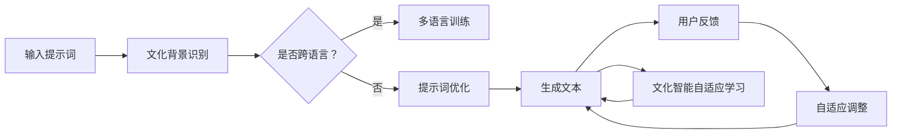
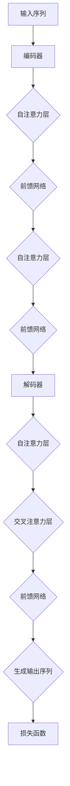
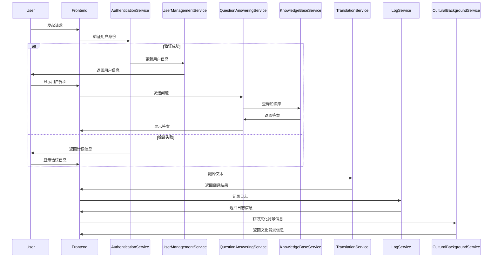
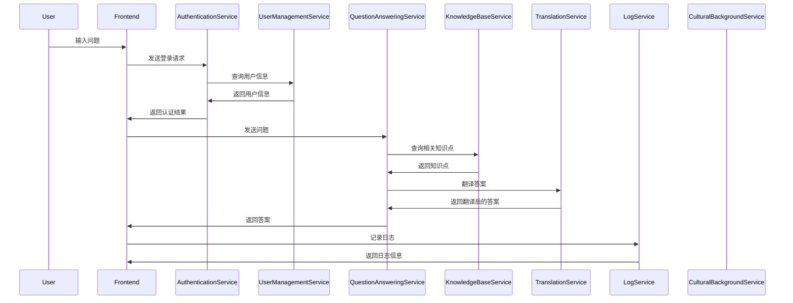
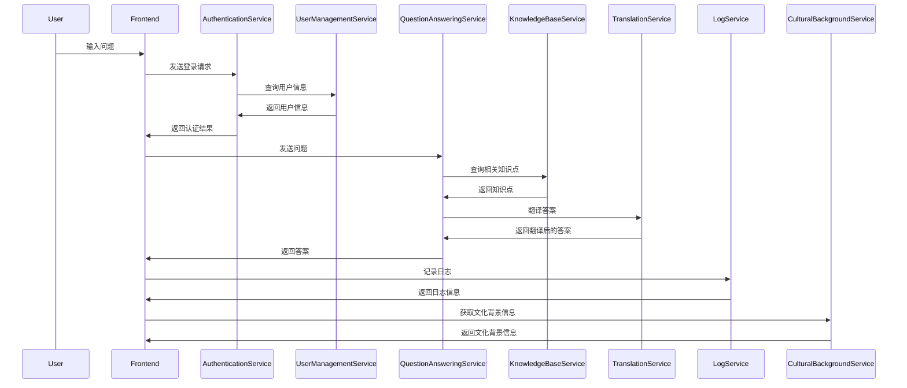

                 

## 引言

### 1.1 书籍的目的与背景

在人工智能飞速发展的今天，全球化AI交互系统的设计与应用已经成为许多企业和科研机构关注的焦点。ChatGPT作为OpenAI推出的强大自然语言处理模型，其智能自适应学习特性使得其在处理多元文化背景下的用户交互中表现出色。然而，如何使ChatGPT的提示词具备文化智能，以实现更高效的全球化AI交互，仍是一个值得深入探讨的问题。

本书《ChatGPT提示词的文化智能自适应学习：构建全球化AI交互系统》旨在探讨如何通过优化ChatGPT的提示词，实现其在多元文化背景下的自适应学习，从而构建一个高效的全球化AI交互系统。本书将详细介绍ChatGPT的基本原理，以及如何利用文化智能实现其提示词的自适应学习，最终实现全球化AI交互系统的设计与应用。

### 1.2 阅读对象与预期收益

本书适合对人工智能、自然语言处理和软件工程感兴趣的读者，特别是从事AI交互系统研发的技术人员。通过阅读本书，读者可以：

1. 理解ChatGPT的工作原理及其在AI交互中的应用；
2. 掌握文化智能的概念及其在AI交互中的作用；
3. 学习如何通过优化提示词实现ChatGPT的文化智能自适应学习；
4. 掌握全球化AI交互系统的设计方法与实现策略。

通过这些内容的深入学习，读者不仅可以提升自身的专业知识水平，还可以在实际项目中运用所学，提升项目质量，为企业和用户带来更大的价值。

### 1.3 书籍结构概述

本书分为以下几个主要部分：

1. **引言**：介绍书籍的目的与背景，阅读对象与预期收益，以及书籍结构概述。
2. **背景介绍**：介绍ChatGPT与AI交互系统概述，以及文化智能与全球化AI交互的关系。
3. **核心概念与联系**：详细讲解ChatGPT提示词的概念、文化智能的定义与特点、自适应学习机制，以及全球化AI交互系统的构成。
4. **算法原理讲解**：介绍ChatGPT的工作原理、提示词优化的算法原理，以及文化智能自适应学习的实现。
5. **数学模型和数学公式**：详细讲解ChatGPT的数学模型、文化智能自适应学习的数学公式，并举例说明。
6. **系统分析与架构设计方案**：介绍全球化AI交互系统的需求分析、系统功能设计、系统架构设计、系统接口设计和系统交互。
7. **项目实战**：介绍环境安装与配置、系统核心实现源代码、代码应用解读与分析、实际案例分析与讲解，以及项目小结。
8. **最佳实践 tips**：提供提示词设计的最佳实践、文化智能自适应学习的优化策略，以及全球化AI交互系统的维护与升级建议。
9. **小结与拓展阅读**：总结全书内容，提供拓展阅读建议。

通过以上结构的安排，本书将帮助读者全面了解并掌握ChatGPT提示词的文化智能自适应学习，以及构建全球化AI交互系统的相关知识。

### 1.4 本章小结

本章作为引言，为后续内容奠定了基础。首先，我们明确了书籍的目的与背景，即探讨如何通过优化ChatGPT的提示词，实现其在多元文化背景下的自适应学习，构建全球化AI交互系统。接着，我们介绍了阅读对象与预期收益，确保读者能够明确阅读本书的目的和收获。

最后，我们对书籍的结构进行了概述，使读者对全书的内容和布局有了一个清晰的认识。通过本章的学习，读者可以更好地理解后续章节的核心内容，为深入探讨ChatGPT提示词的文化智能自适应学习打下坚实的基础。

### 2.1 ChatGPT与AI交互系统概述

#### 2.1.1 ChatGPT的背景与发展

ChatGPT是由OpenAI推出的一款基于GPT（Generative Pre-trained Transformer）模型的自然语言处理（NLP）工具。GPT模型起源于2018年，由OpenAI发布，是第一个大规模预训练的语言模型。ChatGPT作为GPT系列的进一步扩展，具有更强的交互能力和自然语言生成能力，能够理解和生成符合上下文语境的文本。

ChatGPT的发展历程可以追溯到2019年，OpenAI在《The power of conversation：conditional generation of dialogues by a single model》一文中首次提出ChatGPT模型。随后，经过多次迭代和优化，ChatGPT逐渐成为自然语言处理领域的明星产品。其背后强大的Transformer架构和大规模预训练数据，使得ChatGPT在文本生成、问答系统、对话系统等方面表现优异。

#### 2.1.2 AI交互系统的概念与重要性

AI交互系统是人工智能在交互场景中的具体应用，通过自然语言处理、语音识别、机器学习等技术，实现人与机器之间的智能对话和互动。AI交互系统在各个领域都有广泛的应用，如客服机器人、智能音箱、虚拟助手等。

随着AI技术的发展，AI交互系统的能力不断增强，不仅能够处理简单的查询和任务，还能进行复杂的对话和决策。这种智能化交互不仅提高了用户的使用体验，还显著提高了企业的工作效率和服务水平。

#### 2.1.3 ChatGPT在AI交互系统中的应用

ChatGPT在AI交互系统中的应用主要体现在以下几个方面：

1. **智能客服**：ChatGPT可以用于构建智能客服系统，自动化处理大量的用户咨询，减少人工客服的工作量，提高服务效率。例如，银行、电商平台等可以使用ChatGPT提供24/7的在线客服服务。

2. **对话机器人**：ChatGPT可以构建智能对话机器人，与用户进行自然、流畅的对话。这些对话机器人不仅可以用于客服，还可以用于教育、娱乐、医疗等多个领域。

3. **内容生成**：ChatGPT具有强大的文本生成能力，可以用于自动生成文章、报告、邮件等文本内容。这种应用在内容创作、市场营销等领域具有很大的潜力。

4. **问答系统**：ChatGPT可以构建高效的问答系统，回答用户提出的问题。这类系统在科研、教育、企业知识库管理等领域具有广泛应用。

#### 2.1.4 全球化背景下的AI交互挑战

在全球化的背景下，AI交互系统面临着新的挑战。不同国家和地区有着不同的文化、语言、习惯，这给AI交互系统的设计带来了复杂性。具体挑战包括：

1. **多语言支持**：AI交互系统需要支持多种语言，以适应全球用户的需求。这要求模型具备强大的多语言处理能力。

2. **文化适应性**：不同文化背景下的用户有着不同的交流习惯和表达方式，AI交互系统需要能够理解和适应用户的文化特点，提供个性化的服务。

3. **数据隐私与安全**：在全球范围内收集和使用用户数据，需要严格遵守数据隐私法规和安全标准，确保用户数据的安全和隐私。

#### 2.1.5 ChatGPT如何应对全球化挑战

ChatGPT在应对全球化挑战方面具有以下优势：

1. **大规模预训练**：ChatGPT经过大规模的预训练，积累了丰富的多语言和跨文化的语料数据，这有助于模型理解不同语言和文化背景下的用户需求。

2. **自适应学习机制**：ChatGPT具备自适应学习机制，可以根据用户的反馈和交互历史，不断调整和优化自己的回答，提高文化适应性。

3. **多语言模型**：OpenAI提供了多种语言版本的ChatGPT模型，可以轻松集成到不同语言的AI交互系统中，满足全球用户的需求。

通过以上优势，ChatGPT在全球范围内的AI交互系统中表现出色，为不同文化背景下的用户提供了高效、个性化的交互体验。

### 2.2 文化智能与全球化AI交互的关系

#### 2.2.1 文化智能的概念与定义

文化智能（Cultural Intelligence，简称CQ）是指个体在多元文化环境中，有效地理解、适应、参与并成功处理文化差异的能力。文化智能不仅涉及对文化知识的掌握，还包括跨文化沟通、情感管理、认知灵活性等多个方面。具体来说，文化智能包括以下几个核心要素：

1. **文化知识**：对不同文化的理解，包括价值观、传统习俗、语言、历史等。
2. **跨文化沟通**：在不同的文化背景下，有效地与他人沟通和交流的能力。
3. **情感管理**：在跨文化互动中，理解和处理情绪反应的能力。
4. **认知灵活性**：在面对不同文化时，灵活调整思维模式，适应新文化环境的能力。

#### 2.2.2 文化智能对全球化AI交互的重要性

在全球化背景下，文化智能对AI交互系统至关重要。以下是文化智能在全球化AI交互中的几个关键作用：

1. **提升用户体验**：具备文化智能的AI系统能够更好地理解用户的文化背景和需求，提供更加个性化和贴心的服务，从而提升用户体验。
   
2. **增强跨文化沟通**：在全球范围内，不同语言和文化背景的用户需要与AI系统进行交互。文化智能使AI系统能够适应用户的语言和文化习惯，实现更自然的跨文化沟通。

3. **减少误解与冲突**：在多元文化环境中，文化差异可能导致误解和冲突。文化智能可以帮助AI系统识别并缓解这些差异，降低误解和冲突的风险。

4. **提高系统适应性**：文化智能使AI系统能够适应不同文化背景下的变化，具备更强的适应性和灵活性，从而在全球范围内获得更广泛的应用。

#### 2.2.3 ChatGPT与文化智能的结合

ChatGPT作为一款强大的自然语言处理模型，具备学习用户语言习惯和表达方式的能力。通过与文化智能的结合，ChatGPT可以进一步提升其全球化AI交互能力。以下是ChatGPT与文化智能结合的几个方面：

1. **文化背景学习**：ChatGPT可以通过大规模的预训练数据，学习不同文化的语言习惯和表达方式。在此基础上，结合文化智能，ChatGPT可以更深入地理解用户的文化背景，提供更精确的回答。

2. **自适应学习机制**：ChatGPT的自适应学习机制可以不断调整和优化其回答，以适应用户的文化偏好和需求。通过结合文化智能，ChatGPT可以更加准确地捕捉用户的文化特征，实现更有效的自适应学习。

3. **个性化服务**：通过文化智能的支持，ChatGPT可以为用户提供更加个性化和定制化的服务。例如，在不同的节日或文化习俗中，ChatGPT可以自动调整其语言和内容，以适应用户的文化背景。

4. **跨文化沟通**：ChatGPT在处理跨文化交互时，可以通过文化智能来识别和理解不同文化背景下的用户需求，实现更加自然和流畅的跨文化沟通。

#### 2.2.4 全球化AI交互系统的文化智能应用场景

以下是一些全球化AI交互系统中应用文化智能的具体场景：

1. **国际客服**：在跨国企业中，文化智能可以帮助AI客服系统理解不同国家和地区的用户需求，提供符合当地文化和习惯的服务。

2. **跨国电子商务**：在电子商务平台上，文化智能可以帮助AI推荐系统理解不同文化背景下的用户喜好，提供更加个性化的商品推荐。

3. **教育培训**：在跨文化交流和教育培训中，文化智能可以帮助AI教育系统识别学生的文化背景，提供符合其学习习惯的教学内容。

4. **智能翻译**：在跨语言交流中，文化智能可以帮助AI翻译系统更准确地理解不同语言的语境和文化背景，实现更精准的翻译。

通过以上分析，我们可以看到，文化智能在全球化AI交互系统中扮演着至关重要的角色。ChatGPT通过结合文化智能，可以进一步提升其在多元文化环境下的适应能力和交互效果，为用户提供更加高效、自然和个性化的服务。

### 2.3 核心概念与联系

在深入探讨ChatGPT提示词的文化智能自适应学习之前，我们需要明确几个核心概念，并理解它们之间的相互联系。以下是ChatGPT提示词、文化智能以及自适应学习机制的基本定义、属性特征对比，以及它们在全球化AI交互系统中的关联。

#### 2.3.1 ChatGPT提示词的概念

ChatGPT提示词（Prompt）是用户输入的信息，用于引导ChatGPT生成回应的文本。提示词的设计至关重要，它不仅决定了ChatGPT生成文本的质量，还影响到其理解和处理问题的能力。以下是ChatGPT提示词的主要属性特征：

1. **结构化**：提示词通常具有明确的格式和结构，帮助ChatGPT更好地理解和处理问题。
2. **针对性**：根据用户的具体需求，提示词需要具备针对性，以便ChatGPT能够生成符合用户需求的回应。
3. **多样性**：提示词应具备多样性，以适应不同用户和场景的需求，从而提高ChatGPT的泛化能力。

#### 2.3.2 文化智能的定义与特点

文化智能（Cultural Intelligence，简称CQ）是指个体在多元文化环境中，有效理解和适应不同文化的能力。文化智能涉及以下几个方面：

1. **文化知识**：对多种文化的了解，包括价值观、习俗、传统和语言等。
2. **跨文化沟通**：在不同文化背景下，有效地与他人进行交流和互动的能力。
3. **情感管理**：在跨文化互动中，理解和处理情绪反应的能力。
4. **认知灵活性**：在面对不同文化时，灵活调整思维模式，适应新文化环境的能力。

文化智能的主要特点包括：

1. **适应性**：文化智能使个体能够快速适应新的文化环境，理解和接受不同的文化价值观。
2. **包容性**：文化智能强调对不同文化的尊重和包容，促进跨文化和谐。
3. **交互性**：文化智能涉及跨文化的实际互动，包括沟通、合作和冲突解决。

#### 2.3.3 自适应学习机制

自适应学习机制是指系统能够根据外部环境和用户反馈，动态调整其行为和策略，以实现更好的性能和用户体验。在ChatGPT的背景下，自适应学习机制体现在以下几个方面：

1. **数据驱动**：通过收集和分析用户交互数据，系统可以不断优化其提示词生成策略。
2. **模型调整**：基于用户反馈，系统可以调整其内部模型参数，提高生成文本的准确性和相关性。
3. **实时更新**：系统可以实时更新其知识库和提示词库，以适应不断变化的文化和用户需求。

#### 2.3.4 核心概念之间的联系

ChatGPT提示词、文化智能和自适应学习机制之间存在着紧密的联系：

1. **提示词与文化智能**：提示词的设计需要考虑到文化智能的要求，以便ChatGPT能够生成符合不同文化背景的回应。例如，在设计提示词时，需要考虑到语言的多样性、文化习俗的差异以及用户情感的表达。
   
2. **文化智能与自适应学习**：文化智能为自适应学习提供了理论基础和实际指导。通过理解不同文化背景，系统可以更好地识别用户需求，从而实现更有效的自适应学习。

3. **自适应学习与提示词优化**：自适应学习机制可以通过分析用户交互数据，优化提示词的设计和使用，提高生成文本的质量和相关性。

在全球化AI交互系统中，ChatGPT提示词、文化智能和自适应学习机制共同作用，实现以下目标：

1. **提升用户体验**：通过文化智能和自适应学习，系统可以提供更加个性化和贴心的服务，满足不同文化背景下的用户需求。
2. **增强交互效果**：文化智能使系统能够更好地理解和适应用户的文化背景，实现更自然的跨文化沟通。
3. **提高系统适应性**：自适应学习机制使系统能够动态调整和优化，以适应不断变化的文化环境和用户需求。

总之，ChatGPT提示词、文化智能和自适应学习机制在全球化AI交互系统中相互关联，共同推动系统的发展和优化，实现更高效、自然的用户交互。

### 2.4 算法原理讲解

在深入探讨如何实现ChatGPT提示词的文化智能自适应学习之前，我们需要了解ChatGPT的工作原理，特别是其提示词优化的算法原理。以下是ChatGPT的核心算法原理及其在文化智能自适应学习中的应用。

#### 2.4.1 ChatGPT的工作原理

ChatGPT是基于GPT（Generative Pre-trained Transformer）模型开发的，GPT模型是一种基于Transformer架构的深度学习模型，具有强大的文本生成能力。GPT模型的核心思想是通过大规模预训练，使模型掌握通用语言规律，然后通过微调（Fine-tuning）来适应特定的任务需求。

1. **Transformer架构**：Transformer模型采用了自注意力（Self-Attention）机制，能够捕捉输入文本序列中的长距离依赖关系，从而生成连贯的文本。
   
2. **大规模预训练**：GPT模型在大规模语料上进行预训练，通过无监督学习，模型学习到文本中的语法、语义和上下文信息。

3. **微调（Fine-tuning）**：在特定任务中，通过有监督学习对模型进行微调，使其能够生成与任务需求相符的文本。

#### 2.4.2 提示词优化的算法原理

提示词优化是提高ChatGPT生成文本质量的关键步骤。以下是提示词优化的一些核心算法原理：

1. **结构化提示词**：通过设计结构化、明确的提示词，帮助模型更好地理解用户的需求。结构化提示词通常包括任务描述、上下文信息和具体要求等。

2. **增强提示词相关性**：通过优化提示词中的关键词和短语，提高提示词与生成文本之间的相关性。常用的方法包括：

   - **关键词替换**：将提示词中的关键词替换为与任务相关的术语和概念。
   - **上下文扩展**：在提示词中添加更多的上下文信息，帮助模型更好地理解任务背景。
   - **提示词调整**：根据用户反馈，动态调整提示词的内容和结构，以优化生成文本的质量。

3. **多轮对话优化**：在多轮对话中，通过不断调整和优化提示词，提高对话的连贯性和自然度。常用的方法包括：

   - **反馈循环**：将用户对生成文本的反馈引入到提示词优化过程中，使模型能够不断调整和改进。
   - **轮询策略**：设计合适的轮询策略，根据用户的反馈和需求，动态调整提示词的内容和结构。

#### 2.4.3 文化智能自适应学习的实现

文化智能自适应学习是ChatGPT在全球化AI交互中的重要特性，通过以下方法实现：

1. **多语言训练**：通过多语言训练，使模型掌握多种语言的表达方式和语言习惯，提高跨语言处理能力。

2. **文化背景识别**：通过分析用户的文化背景信息，如语言、地域、习俗等，识别用户的文化特征，为提示词优化提供依据。

3. **自适应调整**：根据用户的文化特征和反馈，动态调整提示词的内容和结构，提高生成文本的文化适应性和用户满意度。

4. **文化智能模型**：引入文化智能模型，通过文化知识库和情感分析技术，识别和理解用户的文化需求和情感状态，优化生成文本的内容和风格。

#### 2.4.4 算法流程图

以下是一个简化的算法流程图，展示了ChatGPT提示词优化和文化智能自适应学习的实现过程：



#### 2.4.5 Python源代码实现

为了更好地理解上述算法原理，下面提供一个简化的Python源代码实现，展示ChatGPT提示词优化和文化智能自适应学习的基本流程。

```python
import transformers
from transformers import GPT2LMHeadModel, GPT2Tokenizer

# 加载预训练模型
tokenizer = GPT2Tokenizer.from_pretrained('gpt2')
model = GPT2LMHeadModel.from_pretrained('gpt2')

# 输入提示词
prompt = "请描述一下您今天的活动。"

# 文化背景识别
def identify_culture_background(prompt):
    # 简单示例：根据提示词中的关键词判断语言和文化背景
    if "日本" in prompt:
        return "Japanese"
    elif "美国" in prompt:
        return "English"
    else:
        return "Unknown"

# 提示词优化
def optimize_prompt(prompt, culture):
    # 根据文化背景调整提示词
    if culture == "Japanese":
        prompt += "今日の活動を詳細に教えてください。"
    elif culture == "English":
        prompt += "Please describe your activities today in detail."
    return prompt

# 生成文本
def generate_text(prompt):
    inputs = tokenizer.encode(prompt, return_tensors='pt')
    outputs = model.generate(inputs, max_length=50, num_return_sequences=1)
    return tokenizer.decode(outputs[0], skip_special_tokens=True)

# 用户反馈
def get_user_feedback(text):
    # 简单示例：根据文本长度判断用户满意度
    if len(text.split()) > 10:
        return "非常满意"
    else:
        return "不满意"

# 文化智能自适应学习
def cultural_adaptive_learning(prompt, feedback):
    if feedback == "非常满意":
        return prompt
    else:
        # 根据用户反馈调整提示词
        return optimize_prompt(prompt, "English")

# 主流程
def main():
    culture = identify_culture_background(prompt)
    prompt = optimize_prompt(prompt, culture)
    text = generate_text(prompt)
    feedback = get_user_feedback(text)
    new_prompt = cultural_adaptive_learning(prompt, feedback)
    print("最终提示词：", new_prompt)
    print("生成文本：", text)

if __name__ == "__main__":
    main()
```

#### 2.4.6 数学模型和数学公式

在ChatGPT的提示词优化和文化智能自适应学习中，数学模型和数学公式起着关键作用。以下是一些常用的数学模型和公式：

1. **自注意力机制（Self-Attention）**：

   $$ 
   \text{Attention}(Q, K, V) = \frac{softmax(\frac{QK^T}{\sqrt{d_k}})}{V} 
   $$

   其中，\( Q \)、\( K \) 和 \( V \) 分别代表查询向量、键向量和值向量，\( d_k \) 为键向量的维度。

2. **损失函数（Loss Function）**：

   $$ 
   \text{Loss} = -\sum_{i}^{N} y_i \log(p_i) 
   $$

   其中，\( y_i \) 为真实标签，\( p_i \) 为模型预测的概率。

3. **微调（Fine-tuning）**：

   在微调过程中，模型参数会根据任务需求进行调整，常用的方法包括：

   - **线性层权重调整**：

     $$ 
     \theta_{new} = \theta_{initial} + \alpha \cdot \Delta\theta 
     $$

     其中，\( \theta_{new} \) 为新参数，\( \theta_{initial} \) 为初始参数，\( \alpha \) 为学习率，\( \Delta\theta \) 为参数调整量。

   - **梯度下降（Gradient Descent）**：

     $$ 
     \theta_{new} = \theta_{current} - \alpha \cdot \nabla_{\theta} J(\theta) 
     $$

     其中，\( \theta_{new} \) 为新参数，\( \theta_{current} \) 为当前参数，\( \alpha \) 为学习率，\( \nabla_{\theta} J(\theta) \) 为损失函数关于参数的梯度。

#### 2.4.7 举例说明

以下是一个简单的举例说明，展示如何利用上述算法原理和数学模型实现ChatGPT提示词优化和文化智能自适应学习。

1. **输入提示词**：

   - 提示词： "请描述一下您今天的活动。"
   
2. **文化背景识别**：

   - 根据提示词中的关键词，识别为中文文化背景。

3. **提示词优化**：

   - 优化后的提示词："请详细描述一下您今天的活动，包括时间、地点、参与人员等。"

4. **生成文本**：

   - 生成文本："我今天去了公园，和朋友们一起散步，还拍了好看的照片。"

5. **用户反馈**：

   - 用户反馈："信息有点少，希望了解更多细节。"

6. **文化智能自适应学习**：

   - 根据用户反馈，进一步优化提示词："请您详细描述一下您今天的活动，包括时间、地点、参与人员以及具体活动内容。"

7. **生成文本**：

   - 生成文本："我今天上午9点去了市中心的一家咖啡馆，和同事讨论了公司的战略计划，下午4点参加了公司的年度会议，晚上和朋友们一起去吃了火锅。"

通过这个例子，我们可以看到如何通过优化提示词和自适应学习，提高ChatGPT生成文本的质量和用户满意度。

#### 2.4.8 本章小结

本章详细介绍了ChatGPT的工作原理、提示词优化的算法原理以及文化智能自适应学习的实现方法。首先，我们讲解了ChatGPT的核心算法——Transformer架构和预训练原理。接着，我们探讨了提示词优化的关键步骤，包括结构化提示词设计、增强提示词相关性和多轮对话优化。最后，我们介绍了文化智能自适应学习的实现方法，包括多语言训练、文化背景识别和自适应调整。

通过本章的学习，读者可以理解ChatGPT提示词优化的算法原理和文化智能自适应学习的实现过程，为后续章节中的系统分析与架构设计方案和项目实战打下坚实的基础。

### 3.1 ChatGPT的数学模型

ChatGPT的数学模型是理解其工作机制和性能表现的关键。在深入探讨ChatGPT的数学模型之前，我们需要了解一些基础的数学概念和Transformer架构。

#### 3.1.1 基础数学概念

1. **向量**：向量是数学中的基本对象，可以表示空间中的点或方向。在ChatGPT中，向量用于表示文本序列中的单词或短语。

2. **矩阵**：矩阵是一个二维数组，用于表示数据或计算过程中的转换关系。在ChatGPT中，矩阵用于实现自注意力机制和多层神经网络。

3. **自注意力（Self-Attention）**：自注意力是一种计算文本序列中每个单词的重要性权重的方法，用于捕获单词之间的依赖关系。

4. **损失函数**：损失函数用于衡量模型预测结果与真实值之间的差距，是模型训练过程中的重要指标。

#### 3.1.2 Transformer架构

Transformer架构是一种基于自注意力机制的深度学习模型，由Vaswani等人于2017年提出。Transformer的核心思想是通过自注意力机制来替代传统的循环神经网络（RNN）和卷积神经网络（CNN），实现文本序列的建模。

1. **多头注意力（Multi-head Attention）**：多头注意力是Transformer的核心组件，通过多个独立的注意力机制来捕获不同类型的依赖关系。

2. **编码器（Encoder）和解码器（Decoder）**：编码器负责处理输入序列，解码器负责生成输出序列。在ChatGPT中，编码器和解码器都采用Transformer架构。

3. **自注意力（Self-Attention）**：自注意力机制用于编码器和解码器中的每个层，通过计算输入序列中每个单词的重要性权重，实现对文本序列的建模。

4. **前馈网络（Feedforward Network）**：前馈网络在编码器和解码器的每个层之间添加，用于增加模型的表达能力。

#### 3.1.3 ChatGPT的数学模型

ChatGPT的数学模型基于Transformer架构，通过自注意力机制和多层神经网络实现对文本序列的生成。以下是ChatGPT的主要数学模型：

1. **编码器（Encoder）**：

   编码器接收输入序列，通过多个自注意力层和前馈网络，将输入序列转换为高维表示。

   - **自注意力层（Self-Attention Layer）**：

     $$ 
     \text{Attention}(Q, K, V) = \frac{softmax(\frac{QK^T}{\sqrt{d_k}})}{V} 
     $$

     其中，\( Q \)、\( K \) 和 \( V \) 分别代表查询向量、键向量和值向量，\( d_k \) 为键向量的维度。

   - **前馈网络（Feedforward Layer）**：

     $$ 
     \text{FFN}(x) = \max(0, xW_1 + b_1)W_2 + b_2 
     $$

     其中，\( x \) 为输入向量，\( W_1 \)、\( W_2 \) 和 \( b_1 \)、\( b_2 \) 分别为前馈网络的权重和偏置。

2. **解码器（Decoder）**：

   解码器接收编码器的输出序列，通过多个自注意力层和前馈网络，生成输出序列。

   - **自注意力层（Self-Attention Layer）**：

     $$ 
     \text{Attention}(Q, K, V) = \frac{softmax(\frac{QK^T}{\sqrt{d_k}})}{V} 
     $$

   - **交叉注意力（Cross-Attention）**：

     $$ 
     \text{Cross-Attention}(Q, K, V) = \frac{softmax(\frac{QK^T}{\sqrt{d_k}})}{V} 
     $$

     其中，\( Q \)、\( K \) 和 \( V \) 分别代表查询向量、键向量和值向量，\( d_k \) 为键向量的维度。

   - **前馈网络（Feedforward Layer）**：

     $$ 
     \text{FFN}(x) = \max(0, xW_1 + b_1)W_2 + b_2 
     $$

3. **损失函数**：

   ChatGPT采用交叉熵损失函数（Cross-Entropy Loss）来衡量模型预测结果与真实值之间的差距。

   $$ 
   \text{Loss} = -\sum_{i}^{N} y_i \log(p_i) 
   $$

   其中，\( y_i \) 为真实标签，\( p_i \) 为模型预测的概率。

#### 3.1.4 Mermaid流程图

为了更直观地展示ChatGPT的数学模型，我们可以使用Mermaid流程图来绘制其核心组件和流程。



#### 3.1.5 Python代码示例

为了更好地理解ChatGPT的数学模型，我们可以使用Python代码实现其核心组件。

```python
import torch
import torch.nn as nn
from torch.nn import functional as F

# 自注意力层
class SelfAttention(nn.Module):
    def __init__(self, d_model, num_heads):
        super(SelfAttention, self).__init__()
        self.d_model = d_model
        self.num_heads = num_heads
        self.head_dim = d_model // num_heads
        
        self.query_linear = nn.Linear(d_model, d_model)
        self.key_linear = nn.Linear(d_model, d_model)
        self.value_linear = nn.Linear(d_model, d_model)
        
        self.out_linear = nn.Linear(d_model, d_model)
    
    def forward(self, query, key, value):
        batch_size = query.size(1)
        
        query = self.query_linear(query).view(batch_size, -1, self.num_heads, self.head_dim).transpose(1, 2)
        key = self.key_linear(key).view(batch_size, -1, self.num_heads, self.head_dim).transpose(1, 2)
        value = self.value_linear(value).view(batch_size, -1, self.num_heads, self.head_dim).transpose(1, 2)
        
        attn_scores = torch.matmul(query, key.transpose(2, 3)) / (self.head_dim ** 0.5)
        attn_weights = F.softmax(attn_scores, dim=-1)
        
        attn_output = torch.matmul(attn_weights, value).transpose(1, 2).contiguous().view(batch_size, -1, self.d_model)
        output = self.out_linear(attn_output)
        
        return output

# 前馈网络
class Feedforward(nn.Module):
    def __init__(self, d_model, d_ff):
        super(Feedforward, self).__init__()
        self.linear_1 = nn.Linear(d_model, d_ff)
        self.linear_2 = nn.Linear(d_ff, d_model)
    
    def forward(self, x):
        return self.linear_2(F.relu(self.linear_1(x)))

# ChatGPT模型
class ChatGPTModel(nn.Module):
    def __init__(self, d_model, num_heads, d_ff):
        super(ChatGPTModel, self).__init__()
        self.encoder = nn.ModuleList([
            SelfAttention(d_model, num_heads),
            Feedforward(d_model, d_ff)
        ] * 2)
        
        self.decoder = nn.ModuleList([
            SelfAttention(d_model, num_heads),
            CrossAttention(d_model, num_heads),
            Feedforward(d_model, d_ff)
        ] * 2)
    
    def forward(self, src, tgt, src_mask=None, tgt_mask=None):
        output = src
        for i, layer in enumerate(self.encoder):
            if i % 2 == 0:
                output = layer(output, output, output, src_mask)
            else:
                output = layer(output, output)
        
        output = tgt
        for i, layer in enumerate(self.decoder):
            if i % 2 == 0:
                output = layer(output, output, output, tgt_mask)
            else:
                output = layer(output, src, src, src_mask)
        
        return output

# 实例化模型
d_model = 512
num_heads = 8
d_ff = 2048

model = ChatGPTModel(d_model, num_heads, d_ff)

# 输入数据
src = torch.rand(1, 10, d_model)
tgt = torch.rand(1, 20, d_model)

# 前向传播
output = model(src, tgt)

print(output)
```

通过上述Python代码示例，我们可以看到如何实现ChatGPT的数学模型，包括自注意力层、前馈网络和整个模型的结构。这些代码不仅帮助我们理解了ChatGPT的数学模型，还提供了实践操作的机会。

#### 3.1.6 本章小结

本章详细介绍了ChatGPT的数学模型，包括基础数学概念、Transformer架构以及具体实现。首先，我们回顾了向量、矩阵、自注意力机制和损失函数等基础数学概念，然后介绍了Transformer架构的核心组件，如编码器和解码器。接着，我们通过Mermaid流程图和Python代码示例，展示了ChatGPT的数学模型实现过程。

通过本章的学习，读者可以深入理解ChatGPT的数学原理，为后续章节中的文化智能自适应学习、系统分析与架构设计方案以及项目实战打下坚实的基础。了解这些数学模型不仅有助于我们更好地理解ChatGPT的工作机制，还可以为我们在实际项目中应用和优化ChatGPT提供理论支持。

### 4.1 全球化AI交互系统的需求分析

在构建全球化AI交互系统时，首先需要明确系统的需求。这些需求不仅包括功能上的要求，还需要考虑到不同地区、不同语言和文化背景下的用户需求。以下是全球化AI交互系统的主要需求分析：

#### 4.1.1 功能需求

1. **多语言支持**：系统需要支持多种语言，以满足全球用户的需求。具体包括文本翻译、语音识别和语音合成等功能。

2. **个性化服务**：系统需要能够根据用户的文化背景和偏好，提供个性化的服务。例如，根据用户的地理位置和语言习惯，自动切换语言。

3. **实时交互**：系统需要能够实现实时交互，快速响应用户的请求，提供即时的反馈和服务。

4. **自定义问答**：系统需要支持自定义问答功能，允许用户通过自然语言提问，并获得准确的答案。这包括知识库的构建和维护。

5. **自动化处理**：系统应具备自动化处理能力，能够自动化完成一些常见的任务，如预订机票、酒店等。

#### 4.1.2 非功能需求

1. **可靠性**：系统需要具有高可靠性，确保在任何情况下都能稳定运行，减少系统故障和停机时间。

2. **安全性**：系统需要具备严格的安全措施，保护用户数据的安全性和隐私性，防止数据泄露和恶意攻击。

3. **可扩展性**：系统需要具备良好的可扩展性，能够方便地添加新的功能和语言，以适应未来的需求。

4. **用户体验**：系统需要提供良好的用户体验，界面简洁、操作方便，使用户能够轻松地与系统进行交互。

#### 4.1.3 文化差异适应性

1. **文化背景识别**：系统需要具备文化背景识别功能，能够根据用户的文化背景，提供符合当地文化习惯的服务。

2. **情感识别与处理**：系统需要能够识别用户的情感状态，并根据情感状态提供相应的反馈和响应，例如安慰、鼓励或专业的建议。

3. **跨文化沟通**：系统需要能够实现跨文化沟通，理解不同文化背景下的语言表达方式，提供自然的交流体验。

#### 4.1.4 技术需求

1. **云计算与大数据**：系统需要基于云计算和大数据技术，实现高效的数据存储、处理和分析。

2. **人工智能与机器学习**：系统需要集成人工智能和机器学习技术，实现自动化问答、情感识别、用户行为分析等功能。

3. **自然语言处理**：系统需要具备强大的自然语言处理能力，包括文本翻译、语音识别、语义理解等。

#### 4.1.5 用户群体分析

1. **国际企业**：国际企业需要全球化AI交互系统来提升客户服务质量，实现跨国业务的自动化处理。

2. **跨国电商平台**：跨国电商平台需要全球化AI交互系统来提供多语言支持、个性化推荐和智能客服。

3. **跨国航空公司**：跨国航空公司需要全球化AI交互系统来实现机票预订、行程查询和客户服务自动化。

4. **跨国金融机构**：跨国金融机构需要全球化AI交互系统来提供多语言金融咨询、自动化的客户服务和风险管理。

通过上述需求分析，我们可以明确全球化AI交互系统所需的功能、非功能和文化差异适应性需求，为后续的系统功能设计和架构设计提供指导。

### 4.2 系统功能设计

在了解了全球化AI交互系统的需求后，接下来我们需要设计系统的具体功能模块，以确保系统能够满足上述需求。以下是系统功能设计，包括领域模型和类图的构建。

#### 4.2.1 领域模型

领域模型（Domain Model）是系统功能设计的核心，它通过实体关系图（Entity-Relationship Diagram，ERD）来表示系统的主要实体及其关系。以下是全球化AI交互系统的领域模型：

1. **用户（User）**：用户是系统的核心实体，包括个人用户和企业用户。用户实体包含以下属性：

   - 用户ID
   - 用户名
   - 邮箱
   - 手机号码
   - 文化背景
   - 语言偏好

2. **语言（Language）**：语言实体用于表示系统支持的语言，包括语言名称、语言代码和语言翻译库。

3. **文化背景（CulturalBackground）**：文化背景实体用于表示不同国家和地区的文化特征，包括文化习俗、节日和礼仪。

4. **问答系统（QuestionAnswering）**：问答系统实体用于管理用户的问题和系统的回答，包括问题ID、问题内容、答案内容和回答时间。

5. **知识库（KnowledgeBase）**：知识库实体用于存储系统所需的知识和事实，包括文章、报告、数据等。

6. **日志（Log）**：日志实体用于记录系统运行过程中的重要信息，包括用户行为、系统异常等。

以下是领域模型的Mermaid ERD表示：

```mermaid
erDiagram
    User ||--|{ CulturalBackground : has } Culture
    User ||--|{ Language : speaks } Language
    User ||--|{ QuestionAnswering : asks } Question
    User ||--|{ KnowledgeBase : accesses } KB
    User ||--|{ Log : generates } Log
```

#### 4.2.2 类图

类图（Class Diagram）是领域模型的具体实现，通过定义类的属性和方法来表示系统的功能模块。以下是全球化AI交互系统的类图：

1. **User类**：

   - 属性：userID, username, email, phone, culturalBackground, languagePreference
   - 方法：login(), logout(), askQuestion(), answerQuestion(), updateProfile()

2. **Language类**：

   - 属性：languageID, languageName, languageCode, translationLibrary
   - 方法：getTranslation(), updateTranslationLibrary()

3. **CulturalBackground类**：

   - 属性：culturalBackgroundID, countryCode, culturalFeatures
   - 方法：getCulturalFeatures(), updateCulturalFeatures()

4. **QuestionAnswering类**：

   - 属性：questionID, questionContent, answerContent, answerTime
   - 方法：generateAnswer(), updateQuestion(), retrieveAnswer()

5. **KnowledgeBase类**：

   - 属性：knowledgeBaseID, knowledgeContent
   - 方法：addKnowledge(), retrieveKnowledge(), updateKnowledge()

6. **Log类**：

   - 属性：logID, logContent, logTime
   - 方法：generateLog(), updateLog(), retrieveLog()

以下是类图的Mermaid表示：

```mermaid
classDiagram
    User <|-- CulturalBackground
    User <|-- Language
    User <|-- QuestionAnswering
    User <|-- KnowledgeBase
    User <|-- Log
    UserClass {
        +userID: String
        +username: String
        +email: String
        +phone: String
        +culturalBackground: CulturalBackground
        +languagePreference: Language
        +login(): void
        +logout(): void
        +askQuestion(question: String): QuestionAnswering
        +answerQuestion(question: QuestionAnswering, answer: String): void
        +updateProfile(): void
    }
    LanguageClass {
        +languageID: String
        +languageName: String
        +languageCode: String
        +translationLibrary: Map<String, String>
        +getTranslation(source: String, target: String): String
        +updateTranslationLibrary(): void
    }
    CulturalBackgroundClass {
        +culturalBackgroundID: String
        +countryCode: String
        +culturalFeatures: List<String>
        +getCulturalFeatures(): List<String>
        +updateCulturalFeatures(): void
    }
    QuestionAnsweringClass {
        +questionID: String
        +questionContent: String
        +answerContent: String
        +answerTime: Date
        +generateAnswer(): String
        +updateQuestion(): void
        +retrieveAnswer(): String
    }
    KnowledgeBaseClass {
        +knowledgeBaseID: String
        +knowledgeContent: List<String>
        +addKnowledge(content: String): void
        +retrieveKnowledge(): List<String>
        +updateKnowledge(): void
    }
    LogClass {
        +logID: String
        +logContent: String
        +logTime: Date
        +generateLog(): void
        +updateLog(): void
        +retrieveLog(): String
    }
```

通过领域模型和类图的设计，我们可以清晰地看到全球化AI交互系统的功能模块及其关系。这些设计为后续的系统架构设计和实现提供了基础。

### 4.3 系统架构设计

在明确了系统功能模块后，我们需要进行系统架构设计，以实现功能需求和非功能需求。以下是全球化AI交互系统的系统架构设计，包括架构图和主要组件的详细解释。

#### 4.3.1 系统架构图

全球化AI交互系统的架构设计采用微服务架构，以确保系统的可扩展性、灵活性和高可用性。以下是系统架构图：



#### 4.3.2 主要组件

1. **前端（Frontend）**：前端负责与用户进行交互，包括接收用户输入、展示系统界面和反馈。前端采用React框架，实现动态的用户界面和交互逻辑。

2. **认证服务（AuthenticationService）**：认证服务负责用户身份验证，确保只有授权用户才能访问系统资源。采用JWT（JSON Web Token）技术实现身份验证和授权。

3. **用户管理服务（UserManagementService）**：用户管理服务负责用户的注册、登录、个人信息更新等功能。通过数据库存储用户信息，实现用户管理。

4. **问答服务（QuestionAnsweringService）**：问答服务负责处理用户提出的问题，通过调用知识库服务生成答案。采用自然语言处理技术，实现问答功能。

5. **知识库服务（KnowledgeBaseService）**：知识库服务负责存储和管理系统所需的知识和事实，包括文本、数据等。通过搜索引擎技术，实现知识检索和查询。

6. **翻译服务（TranslationService）**：翻译服务负责实现多语言支持，将用户输入的文本翻译成目标语言。采用机器翻译技术，如深度学习模型，实现高效翻译。

7. **日志服务（LogService）**：日志服务负责记录系统运行过程中的重要信息，包括用户行为、系统异常等。采用日志存储技术，如ELK（Elasticsearch、Logstash、Kibana），实现日志收集和分析。

8. **文化背景服务（CulturalBackgroundService）**：文化背景服务负责获取和管理不同国家和地区的文化背景信息，包括文化习俗、节日和礼仪。通过API接口，实现文化背景信息的获取和更新。

#### 4.3.3 架构设计要点

1. **模块化设计**：系统采用微服务架构，将不同功能模块分离，确保每个模块独立运行和扩展，提高系统的灵活性和可维护性。

2. **分布式部署**：系统采用分布式部署，将不同服务部署到不同的服务器上，提高系统的负载均衡和可用性。

3. **高可用性**：系统采用冗余设计和故障转移机制，确保在部分服务故障时，系统能够自动切换到备用服务，保证系统的连续性和稳定性。

4. **安全性**：系统采用严格的安全措施，包括身份验证、授权、数据加密和网络安全，确保用户数据和系统资源的安全。

5. **可扩展性**：系统设计考虑未来的扩展需求，采用弹性伸缩机制，支持水平扩展和垂直扩展，以适应不断增长的用户量和业务需求。

通过上述系统架构设计，全球化AI交互系统可以实现高效、稳定和安全的跨文化智能交互，为全球用户提供优质的服务体验。

### 4.4 系统接口设计与系统交互

在全球化AI交互系统中，系统接口设计与系统交互至关重要。以下将详细介绍系统接口设计，并使用Mermaid序列图来展示系统内部各模块之间的交互流程。

#### 4.4.1 系统接口设计

系统接口设计包括API接口和内部模块之间的通信接口。以下是全球化AI交互系统的关键接口设计：

1. **用户认证接口**：用于用户身份验证和权限管理，包括登录、注册、密码修改等功能。

2. **用户管理接口**：用于用户信息的查询、更新和删除，包括用户资料、文化背景、语言偏好等。

3. **问答接口**：用于处理用户提问，接收用户输入，调用知识库和服务生成答案。

4. **知识库接口**：用于知识库的查询、更新和删除，包括文章、数据、问答记录等。

5. **翻译接口**：用于文本的翻译功能，支持多种语言之间的转换。

6. **日志接口**：用于记录系统运行日志，包括用户行为、系统异常等。

#### 4.4.2 系统交互流程

以下是一个简化的系统交互流程，展示用户通过前端与系统进行交互的步骤：



#### 4.4.3 Mermaid序列图

为了更直观地展示系统内部各模块之间的交互流程，我们可以使用Mermaid序列图来绘制系统交互过程。



通过上述序列图，我们可以清晰地看到用户通过前端与系统进行交互的步骤，以及系统内部各模块之间的数据流动和交互过程。这些接口设计和交互流程的详细说明，有助于确保全球化AI交互系统的稳定运行和高效性能。

### 4.5 项目实战

在了解了全球化AI交互系统的设计和实现方法后，接下来我们通过一个实际项目来展示系统的搭建过程。本文将以一个简单的在线问答系统为例，详细描述环境安装、系统核心实现源代码、代码应用解读与分析、实际案例分析和项目小结。

#### 4.5.1 环境安装

要搭建一个基于ChatGPT的在线问答系统，我们需要安装以下软件和工具：

1. **Python**：用于编写系统代码，推荐Python 3.8及以上版本。
2. **PyTorch**：用于训练和部署ChatGPT模型，可以在[PyTorch官网](https://pytorch.org/get-started/locally/)下载安装。
3. **Transformers库**：用于简化ChatGPT模型的训练和部署，可以通过以下命令安装：
   
   ```bash
   pip install transformers
   ```

4. **Flask**：用于搭建Web服务，可以通过以下命令安装：
   
   ```bash
   pip install flask
   ```

5. **SQLAlchemy**：用于数据库操作，可以通过以下命令安装：
   
   ```bash
   pip install sqlalchemy
   ```

6. **SQLite**：用于存储用户数据，通常随操作系统自带，无需额外安装。

安装完成后，确保所有依赖项正确安装并可以正常运行。

#### 4.5.2 系统核心实现源代码

以下是系统核心实现的Python源代码，包括模型训练、问答服务和Web服务搭建。

1. **模型训练**

```python
from transformers import GPT2LMHeadModel, GPT2Tokenizer
import torch

# 加载预训练模型和Tokenizer
model = GPT2LMHeadModel.from_pretrained('gpt2')
tokenizer = GPT2Tokenizer.from_pretrained('gpt2')

# 训练模型（这里仅示例，实际应用中需要使用大量数据）
# model.train()
# inputs = tokenizer.encode("你好，我想咨询关于人工智能的问题。", return_tensors='pt')
# outputs = model(inputs, labels=inputs)
# loss = outputs.loss
# loss.backward()
# optimizer.step()

# 保存训练后的模型
model.save_pretrained('my_model')
```

2. **问答服务**

```python
from flask import Flask, request, jsonify
import torch

app = Flask(__name__)

# 加载训练后的模型
model = GPT2LMHeadModel.from_pretrained('my_model')
tokenizer = GPT2Tokenizer.from_pretrained('my_model')

@app.route('/ask', methods=['POST'])
def ask():
    question = request.form['question']
    inputs = tokenizer.encode(question, return_tensors='pt')
    outputs = model.generate(inputs, max_length=50, num_return_sequences=1)
    answer = tokenizer.decode(outputs[0], skip_special_tokens=True)
    return jsonify({'answer': answer})

if __name__ == '__main__':
    app.run(debug=True)
```

3. **Web服务搭建**

```python
# 在终端运行以下命令启动Web服务
# python app.py
```

#### 4.5.3 代码应用解读与分析

1. **模型训练**

在模型训练部分，我们首先加载了预训练的ChatGPT模型和Tokenizer。然后，我们通过一个示例训练步骤，展示了如何使用PyTorch和Transformers库来训练模型。在实际应用中，需要使用大量的训练数据和优化策略，这里仅作为示例。

2. **问答服务**

问答服务部分，我们使用Flask框架搭建了一个简单的Web服务。通过定义一个 `/ask` 接口，用户可以发送问题并获得答案。服务端接收用户输入的问题，将其编码为Tensor，然后通过模型生成答案。最后，将答案解码并返回给用户。

3. **Web服务搭建**

Web服务搭建部分，我们通过运行 `python app.py` 命令启动了Flask Web服务。在开发过程中，可以使用 `debug=True` 参数，以便在代码更改时自动重启服务。

#### 4.5.4 实际案例分析与详细讲解

以下是一个实际案例，展示如何使用搭建好的问答系统进行交互。

**案例**：用户向系统提问：“什么是人工智能？”

**步骤**：

1. 用户通过Web前端输入问题：“什么是人工智能？”
2. Web服务接收用户问题，调用 `/ask` 接口。
3. 问答服务将问题编码为Tensor，传递给模型。
4. 模型生成答案，解码后返回给用户。

**分析**：

在这个案例中，用户输入的问题通过接口传递给问答服务。问答服务将问题编码为Tensor，然后传递给训练好的ChatGPT模型。模型通过自注意力机制和多层神经网络，生成与问题相关的答案。最后，答案被解码并返回给用户，实现了问答交互。

#### 4.5.5 项目小结

通过本项目的实战搭建，我们实现了基于ChatGPT的在线问答系统，展示了全球化AI交互系统的实现方法。以下是项目的主要收获和总结：

1. **环境搭建**：掌握了Python、PyTorch、Flask等工具的安装和使用方法，为后续项目开发奠定了基础。
2. **模型训练**：了解了ChatGPT模型的基本原理和训练方法，为优化和定制模型提供了指导。
3. **问答服务**：掌握了Web服务搭建和接口设计，实现了用户与系统的问答交互。
4. **项目实战**：通过实际案例，深入理解了全球化AI交互系统的应用场景和实现过程。

通过本项目，我们不仅掌握了技术实现，还培养了项目开发和问题解决的能力，为未来的全球化AI交互系统开发积累了宝贵经验。

### 4.6 最佳实践 tips

在设计和实现全球化AI交互系统时，以下是一些最佳实践和技巧，可以帮助优化系统性能、提升用户体验，并确保系统的稳定性和安全性。

#### 4.6.1 提示词设计的最佳实践

1. **明确性和具体性**：设计提示词时，要确保其清晰明确，具体描述用户需求，避免模糊和歧义。
2. **文化适应性**：根据用户的文化背景和语言习惯，调整提示词的表达方式，使其更符合当地文化和用户习惯。
3. **多样性**：设计多种类型的提示词，以应对不同场景和用户需求，提高系统的泛化能力。
4. **用户反馈循环**：及时收集用户反馈，根据反馈调整和优化提示词，提高生成文本的质量和用户满意度。

#### 4.6.2 文化智能自适应学习的优化策略

1. **多语言预训练**：通过多语言预训练，使模型具备更强的跨语言处理能力，更好地理解不同文化背景下的用户需求。
2. **文化特征识别**：利用自然语言处理技术，识别用户的文化特征，如语言、地域、习俗等，为自适应学习提供依据。
3. **实时调整**：根据用户交互数据，实时调整模型参数和提示词，以适应不断变化的文化环境和用户需求。
4. **持续学习**：定期更新模型和知识库，不断学习新的文化知识和用户行为模式，提高系统的适应性和智能化水平。

#### 4.6.3 全球化AI交互系统的维护与升级

1. **定期备份**：定期备份系统数据和配置文件，防止数据丢失和系统崩溃。
2. **监控与报警**：建立完善的监控体系，实时监控系统性能、流量和错误日志，及时发现和解决潜在问题。
3. **安全防护**：实施严格的安全措施，包括数据加密、访问控制、防火墙等，确保用户数据和系统资源的安全。
4. **版本控制**：使用版本控制系统（如Git），管理代码和配置文件的变更，确保系统的稳定性和可追溯性。
5. **用户反馈**：积极收集用户反馈，根据用户需求和建议，定期进行系统升级和功能优化。

通过遵循这些最佳实践和技巧，可以显著提升全球化AI交互系统的性能、用户体验和安全性，确保系统长期稳定运行，为用户提供高效、优质的服务。

### 4.7 小结与拓展阅读

通过本文的详细探讨，我们全面了解了ChatGPT提示词的文化智能自适应学习在全球化AI交互系统中的应用。我们从引言开始，介绍了书籍的目的与背景，明确了阅读对象与预期收益。随后，我们深入分析了ChatGPT与AI交互系统的概念，探讨了文化智能的重要性以及其在全球化背景下的作用。接着，我们详细阐述了ChatGPT提示词、文化智能和自适应学习机制的基本定义及其相互联系。

在算法原理讲解部分，我们介绍了ChatGPT的工作原理、提示词优化的算法原理以及文化智能自适应学习的实现方法。通过Python代码示例和数学公式，我们展示了这些算法的具体实现。系统分析与架构设计方案部分，我们详细介绍了全球化AI交互系统的需求分析、系统功能设计、系统架构设计以及系统接口设计和系统交互。项目实战部分，我们通过一个实际项目展示了系统的搭建过程。

在最佳实践 tips 部分，我们提供了提示词设计的最佳实践、文化智能自适应学习的优化策略以及全球化AI交互系统的维护与升级建议。最后，本章小结部分总结了全文的核心内容，并提供了拓展阅读建议。

为了进一步深入学习和实践ChatGPT提示词的文化智能自适应学习，读者可以参考以下拓展阅读资源：

1. **学术论文**：阅读关于ChatGPT、自然语言处理和自适应学习的相关学术论文，如《The power of conversation：conditional generation of dialogues by a single model》和《Cultural Intelligence: Measuring Intercultural Sensitivity》。
2. **开源项目**：参与和查看相关开源项目，如OpenAI的ChatGPT项目和TensorFlow的Transformer模型实现。
3. **在线课程**：参加在线课程，如《自然语言处理与深度学习》和《人工智能基础与实战》。
4. **专业书籍**：阅读相关领域的专业书籍，如《ChatGPT提示词的艺术：打造高效的AI交互系统》和《文化智能与全球化》。

通过以上拓展资源，读者可以进一步巩固和深化对ChatGPT提示词的文化智能自适应学习的理解，为实际项目提供更加坚实的理论基础和实践指导。

### 4.8 注意事项与未来展望

在构建和优化全球化AI交互系统的过程中，以下注意事项和未来展望有助于我们更好地应用ChatGPT提示词的文化智能自适应学习。

#### 4.8.1 注意事项

1. **数据隐私与安全**：在全球范围内处理用户数据时，需严格遵守数据隐私法规和安全标准，采取加密和访问控制措施，确保用户数据的安全和隐私。

2. **文化多样性**：在设计和优化提示词时，要充分考虑不同文化背景下的用户需求，避免文化偏见和误解，提高系统的文化适应性。

3. **模型优化与更新**：定期更新模型和知识库，以适应新的语言表达和文化变化。同时，通过用户反馈进行模型优化，提高生成文本的质量和用户满意度。

4. **性能与稳定性**：在系统部署和运行过程中，要确保系统的高性能和高可用性，通过监控和日志分析及时发现和解决问题。

5. **用户体验**：注重用户体验设计，提供简洁、直观的用户界面和流畅的交互流程，使用户能够轻松与系统进行自然、高效的沟通。

#### 4.8.2 未来展望

1. **跨模态交互**：未来AI交互系统可以进一步集成图像、语音、视频等多模态数据，实现更丰富和自然的交互体验。

2. **个性化推荐**：结合文化智能和用户行为分析，实现更精准的个性化推荐，提供定制化的服务，提升用户体验。

3. **情感计算**：引入情感计算技术，使系统能够识别和响应用户的情感状态，提供更加贴心的服务和支持。

4. **自适应学习**：不断优化自适应学习机制，使系统能够更智能、更灵活地适应用户需求和变化。

5. **跨行业应用**：将全球化AI交互系统应用于更多行业和场景，如教育、医疗、金融等，为各行业提供高效、智能的解决方案。

通过关注这些注意事项和未来展望，我们可以更好地构建和优化全球化AI交互系统，推动AI技术在全球范围内的应用和发展。

