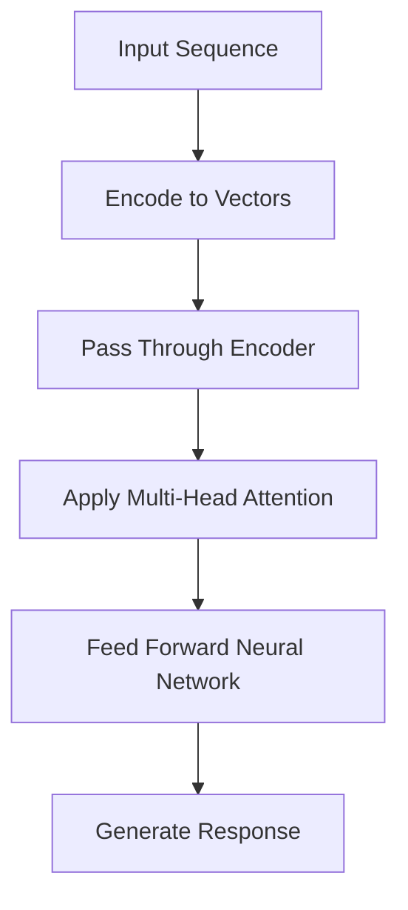
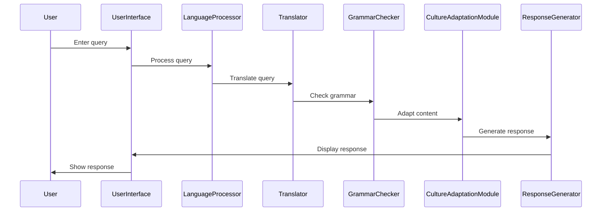
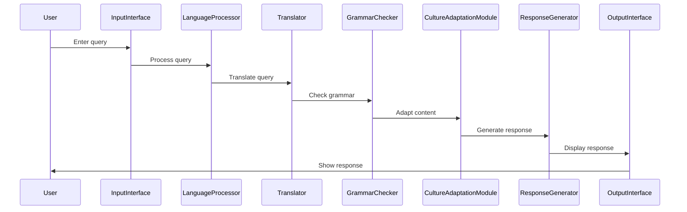

                 

# 《ChatGPT提示词的文化适应性：跨文化AI交流的本地化策略》

> 关键词：ChatGPT、文化适应性、跨文化交流、本地化策略、算法原理、数学模型、系统架构设计、项目实战

> 摘要：本文旨在探讨ChatGPT提示词的文化适应性及其在跨文化AI交流中的应用。通过分析ChatGPT的发展背景和跨文化交流中的障碍，阐述本地化策略的重要性。文章将深入探讨ChatGPT提示词的设计原则、跨文化AI交流中的本地化策略、算法原理与数学模型、系统分析与架构设计以及项目实战，旨在为开发者提供实用的指导和建议，促进跨文化AI交流的有效性和适应性。

## 目录大纲

1. **问题背景与核心概念**
   1.1 问题背景
   1.2 核心概念
   1.3 概念联系与模型构建
   1.4 研究边界与外延
   1.5 本章小结

2. **ChatGPT的提示词设计原则**
   2.1 提示词设计概述
   2.2 文化适应性原则
   2.3 提示词设计案例分析
   2.4 本章小结

3. **跨文化AI交流中的本地化策略**
   3.1 本地化策略的定义与类型
   3.2 本地化策略的实施流程
   3.3 本地化策略案例分析
   3.4 本章小结

4. **算法原理与数学模型**
   4.1 算法原理介绍
   4.2 数学模型讲解
   4.3 算法流程图
   4.4 本章小结

5. **系统分析与架构设计**
   5.1 问题场景介绍
   5.2 系统功能设计
   5.3 系统架构设计
   5.4 系统接口设计
   5.5 系统交互设计
   5.6 本章小结

6. **项目实战**
   6.1 环境安装与配置
   6.2 系统核心实现
   6.3 代码应用解读与分析
   6.4 实际案例分析
   6.5 项目小结

## 1. 问题背景与核心概念

### 1.1 问题背景

#### 1.1.1 ChatGPT的发展与普及

ChatGPT是由OpenAI开发的一款基于GPT-3.5的预训练语言模型，其卓越的自然语言处理能力在短时间内赢得了全球用户的高度关注和广泛应用。ChatGPT能够进行自然对话，提供信息查询、文本生成、语言翻译等服务，其应用范围涵盖了智能客服、教育辅导、内容创作、跨文化交流等多个领域。

#### 1.1.2 跨文化交流中的障碍

尽管ChatGPT在技术层面上有着强大的能力，但在跨文化交流中仍然面临诸多挑战。不同文化背景的用户在使用ChatGPT时，可能会因为语言、习俗、价值观等方面的差异而产生误解、沟通障碍等问题。这些问题制约了ChatGPT在全球范围内的普及和应用效果。

#### 1.1.3 本地化策略的重要性

为了克服跨文化交流中的障碍，本地化策略显得尤为重要。本地化策略包括对提示词、语言、内容等方面的调整，以适应不同文化背景的需求。通过本地化策略，可以提升ChatGPT在跨文化环境中的适应性和沟通效果，从而更好地服务于全球用户。

### 1.2 核心概念

#### 1.2.1 提示词

提示词是指用于引导ChatGPT生成特定内容或进行特定任务的输入信息。在跨文化AI交流中，提示词的设计至关重要，它需要考虑文化差异、语言习惯等因素，以确保ChatGPT能够准确理解和回应用户需求。

#### 1.2.2 文化适应性

文化适应性是指在面对不同文化背景时，所采取的一种适应和调整的策略。在跨文化AI交流中，文化适应性体现在对ChatGPT提示词、内容、语言等方面的调整，以适应不同文化背景的需求和习惯。

#### 1.2.3 本地化策略

本地化策略是一种针对特定文化背景进行的调整和优化方法。在跨文化AI交流中，本地化策略包括对ChatGPT提示词、内容、语言等方面的调整，以提升其适应性和沟通效果。

### 1.3 概念联系与模型构建

#### 1.3.1 ChatGPT与本地化策略的联系

ChatGPT作为一款跨文化交流工具，其提示词的设计和本地化策略的实施对其跨文化适应性和沟通效果至关重要。通过本地化策略，可以提升ChatGPT在不同文化背景下的应用效果，从而更好地服务于全球用户。

#### 1.3.2 文化适应性与本地化策略的内在联系

文化适应性是本地化策略的核心要素之一。在跨文化AI交流中，本地化策略需要充分考虑文化适应性，通过对ChatGPT提示词、内容、语言等方面的调整，使其更符合不同文化背景的需求和习惯。

#### 1.3.3 ER实体关系图：跨文化AI交流中的关键要素

为了更好地理解跨文化AI交流中的关键要素，我们可以借助ER实体关系图进行建模。ER实体关系图包括用户、文化、提示词、内容等关键实体，以及它们之间的联系。通过ER实体关系图，可以清晰地展示跨文化AI交流中的核心要素及其相互作用。

```mermaid
erDiagram
    User ||--|{ Culture } : has
    Culture ||--|{ TipWord } : has
    TipWord ||--|{ Content } : has
    User o--|{ Content } : generates
```

### 1.4 研究边界与外延

#### 1.4.1 研究范围的界定

本文主要研究ChatGPT在跨文化AI交流中的应用，探讨提示词设计原则、本地化策略、算法原理、系统架构设计等方面的内容。同时，本文还将结合实际案例，分析跨文化AI交流中的挑战与机遇。

#### 1.4.2 研究方法的选用

本文采用文献综述、案例分析和实验研究等方法，对ChatGPT的提示词设计原则、本地化策略、算法原理和系统架构设计进行深入探讨。通过分析国内外相关研究成果，总结实践经验，并结合实际案例，为跨文化AI交流提供实用的指导和建议。

#### 1.4.3 研究中的挑战与机遇

在跨文化AI交流中，挑战主要体现在文化差异、语言障碍、价值观冲突等方面。机遇则在于通过本地化策略和先进的技术手段，提高ChatGPT在跨文化环境中的适应性和沟通效果，为全球用户带来更好的体验。

### 1.5 本章小结

本章从问题背景、核心概念、概念联系与模型构建、研究边界与外延等方面，对ChatGPT的跨文化适应性及其本地化策略进行了初步探讨。下一章将深入分析ChatGPT的提示词设计原则，以期为跨文化AI交流提供更有针对性的解决方案。## 2. ChatGPT的提示词设计原则

### 2.1 提示词设计概述

#### 2.1.1 提示词在AI交流中的角色

提示词是AI交流的重要组成部分，它类似于人类对话中的引导语或问题，用于引导AI模型生成合适的回答或执行特定任务。在ChatGPT中，提示词的作用尤为重要，因为它们直接决定了AI模型生成的内容方向和风格。

#### 2.1.2 提示词设计的基本原则

有效的提示词设计应遵循以下基本原则：

1. **明确性**：提示词应清晰明确，避免模糊不清或歧义。
2. **针对性**：提示词应针对具体的问题或场景，确保AI能够准确理解和回应。
3. **多样性**：提示词应涵盖多种情境和语言风格，以满足不同用户的需求。
4. **文化适应性**：提示词应考虑文化差异，尊重不同文化背景的用户。

#### 2.1.3 提示词设计的关键要素

提示词设计的关键要素包括：

1. **语言风格**：提示词应采用合适的语言风格，如正式、非正式、幽默等。
2. **问题类型**：根据问题的类型，选择合适的提问方式，如开放性问题、封闭性问题等。
3. **文化元素**：融入与用户文化背景相关的元素，增强交流的亲和力和效果。
4. **情感因素**：考虑用户的情感需求，使交流更加自然和人性化。

### 2.2 文化适应性原则

#### 2.2.1 文化理解与感知

文化适应性要求设计者对目标文化有深入的理解和感知。这包括了解目标文化的价值观、语言习惯、社交礼仪、历史背景等方面。只有深入了解目标文化，才能设计出真正符合用户需求的提示词。

#### 2.2.2 文化差异的影响

文化差异是跨文化交流中不可忽视的因素。文化差异可能导致误解、沟通障碍和负面情绪。因此，在提示词设计中，需要充分考虑文化差异，采取适当的策略来减少负面影响。

#### 2.2.3 文化适应性原则的具体应用

文化适应性原则的具体应用包括：

1. **语言调整**：根据目标文化的语言习惯，调整提示词的表达方式。
2. **内容优化**：融入目标文化元素，使内容更符合目标文化的价值观和审美需求。
3. **情感共鸣**：设计出能够引起目标文化用户情感共鸣的提示词，增强交流效果。

### 2.3 提示词设计案例分析

#### 2.3.1 国内外案例比较

在国内，许多AI客服系统已经开始注重文化适应性。例如，一些面向外国游客的旅游客服系统，会使用英语并融入当地文化元素，如问候语、景点介绍等。这种做法有效地提升了用户体验和满意度。

在国外，一些面向多语种用户的AI系统，如Google Assistant和Siri，也采用了类似的文化适应性策略。它们根据用户所在地区和语言习惯，自动调整提示词和交互方式，以提高用户满意度。

#### 2.3.2 案例分析：文化适应性的成功与失败

**成功案例**：某国际电商平台在推出AI客服时，充分考虑了不同国家用户的语言和文化差异。通过使用本地化语言和适应当地文化的内容，该平台成功提升了用户满意度和转化率。

**失败案例**：某跨国公司在推出一款面向全球用户的AI助手时，未能充分考虑文化差异。结果导致部分用户在使用过程中感到困惑和不满，影响了产品的口碑和推广效果。

### 2.4 本章小结

本章从提示词设计概述、文化适应性原则、案例分析等方面，深入探讨了ChatGPT的提示词设计原则。通过本章的学习，我们可以了解到如何设计出符合不同文化背景用户需求的提示词，从而提升跨文化AI交流的效果和满意度。下一章将探讨跨文化AI交流中的本地化策略，以期为开发者提供更全面的解决方案。## 3. 跨文化AI交流中的本地化策略

### 3.1 本地化策略的定义与类型

#### 3.1.1 本地化策略的定义

本地化策略是指在全球化进程中，针对特定地区或文化背景进行的产品、服务或内容的调整，以使其更符合目标市场的需求和习惯。在跨文化AI交流中，本地化策略旨在通过调整AI模型的行为、语言和内容，提高其在不同文化背景下的适应性和沟通效果。

#### 3.1.2 本地化策略的类型

本地化策略可以分为以下几种类型：

1. **语言本地化**：对AI模型的语言进行调整，包括翻译、语法修正和语用适应等。
2. **文化本地化**：考虑目标文化的价值观、习俗、历史背景等因素，对AI模型的内容和表达方式进行优化。
3. **功能本地化**：根据目标市场的需求，调整AI模型的功能和特性，以提供更符合本地用户期望的服务。

#### 3.1.3 本地化策略在企业中的应用

本地化策略在企业中的应用广泛，以下是一些典型场景：

1. **全球客服系统**：企业通过本地化策略，为不同地区的客户提供个性化的客服服务，提高客户满意度和忠诚度。
2. **多语言网站**：企业在全球范围内运营网站，通过本地化策略提供多语言版本，吸引更多国际用户。
3. **本地化营销**：企业在不同市场进行本地化广告宣传，以更好地适应当地消费者的文化背景和消费习惯。

### 3.2 本地化策略的实施流程

#### 3.2.1 需求分析

需求分析是本地化策略实施的第一步，主要包括以下内容：

1. **用户调研**：通过问卷调查、访谈等方式，了解目标市场的用户需求和偏好。
2. **文化分析**：研究目标市场的文化背景、价值观、习俗等，为本地化策略的制定提供依据。
3. **技术分析**：评估现有AI模型的性能和技术可行性，确定本地化策略的实现方案。

#### 3.2.2 设计与开发

设计与开发阶段主要包括以下任务：

1. **语言调整**：对AI模型的语言进行翻译、语法修正和语用适应，确保交流的自然性和流畅性。
2. **内容优化**：根据目标市场的文化背景，对AI模型的内容和表达方式进行优化，使其更符合当地用户的需求和习惯。
3. **功能调整**：根据目标市场的需求，调整AI模型的功能和特性，以提供更符合本地用户期望的服务。

#### 3.2.3 测试与评估

测试与评估是本地化策略实施的重要环节，主要包括以下任务：

1. **功能测试**：验证AI模型在本地化环境下的功能是否正常，确保各项功能符合预期。
2. **用户体验测试**：通过用户测试，收集用户对本地化AI模型的使用体验和反馈，评估本地化策略的有效性。
3. **性能评估**：对AI模型的性能进行评估，包括响应时间、准确性、用户体验等指标，确保本地化策略能够提升AI模型的整体性能。

### 3.3 本地化策略案例分析

#### 3.3.1 案例一：某国际电商平台

某国际电商平台在推出其全球版网站时，采用了本地化策略。通过对不同地区的用户进行需求调研，平台为不同地区提供了多语言版本、适应当地文化的产品推荐和购物体验。同时，平台还根据当地用户的消费习惯，调整了支付方式和物流服务。这些本地化策略有效地提升了用户体验和转化率。

#### 3.3.2 案例二：某跨国公司内部沟通工具

某跨国公司在推出内部沟通工具时，采用了文化适应性策略。通过对不同地区员工的访谈和调研，公司为不同地区的员工提供了适合其文化背景的交流方式和表达风格。例如，对于注重隐私和礼貌的亚洲员工，平台提供了更多礼节性的问候和表达方式；而对于西方员工，平台则更注重直接和简洁的交流方式。这种本地化策略有助于提高员工的工作效率和工作满意度。

### 3.4 本章小结

本章从本地化策略的定义与类型、实施流程、案例分析等方面，探讨了跨文化AI交流中的本地化策略。通过本章的学习，我们可以了解到如何有效地实施本地化策略，提升AI模型在不同文化背景下的适应性和沟通效果。下一章将深入分析ChatGPT的算法原理与数学模型，以期为跨文化AI交流提供更深入的技术支持。## 4. 算法原理与数学模型

### 4.1 算法原理介绍

#### 4.1.1 ChatGPT算法基础

ChatGPT是基于GPT-3.5（Generative Pre-trained Transformer 3.5）算法的预训练语言模型。GPT-3.5采用了一种称为Transformer的神经网络架构，这种架构在自然语言处理领域取得了显著的成功。Transformer模型通过自注意力机制（Self-Attention）和多头注意力（Multi-Head Attention）机制，能够捕捉输入文本中长距离的依赖关系，从而生成高质量的文本。

#### 4.1.2 文化适应性算法设计

在ChatGPT中，文化适应性算法的设计是为了确保模型在不同文化背景下能够提供恰当的回应。这包括以下几个关键步骤：

1. **文化信息库构建**：收集并整理不同文化的语言习惯、价值观、习俗等文化信息，构建一个文化信息库。
2. **文化敏感性训练**：将文化信息库融入到模型的训练数据中，通过大量跨文化对话的语料库训练，使模型能够识别和理解不同文化背景。
3. **文化适应性调整**：在生成响应时，根据对话上下文和用户的文化背景，动态调整提示词和回答内容，以适应不同的文化环境。

### 4.2 数学模型讲解

#### 4.2.1 数学公式概述

ChatGPT的核心算法基于深度学习中的 Transformer 模型，其关键组成部分包括：

1. **自注意力机制（Self-Attention）**：用于计算输入序列中各个词之间的关系。
2. **多头注意力（Multi-Head Attention）**：扩展自注意力机制，通过多个独立的注意力头，捕捉输入序列的不同特征。
3. **前馈神经网络（Feedforward Neural Network）**：在注意力机制之后，对输入进行进一步处理。

以下为自注意力机制的数学公式：

$$
\text{Attention}(Q, K, V) = \frac{softmax(\frac{QK^T}{\sqrt{d_k}})}{V}
$$

其中，$Q$、$K$ 和 $V$ 分别是查询向量、键向量和值向量，$d_k$ 是键向量的维度。

#### 4.2.2 数学模型详细解释

在ChatGPT中，多头注意力机制是自注意力机制的扩展，其公式为：

$$
\text{Multi-Head Attention}(Q, K, V) = \text{softmax}(\frac{QK^T}{\sqrt{d_k}})V
$$

这里，$H$ 表示头数，$W_{Q}, W_{K}, W_{V}$ 分别为权重矩阵。

前馈神经网络通常用于在注意力机制之后对输入进行处理，其公式为：

$$
\text{FFN}(x) = \text{ReLU}(W_{2} \cdot \text{Dropout}(W_{1} \cdot x + b_{1}))
$$

其中，$W_{1}$、$W_{2}$ 是权重矩阵，$b_{1}$ 是偏置。

#### 4.2.3 模型应用举例

假设我们有一个输入序列 $X = [\text{I}, \text{like}, \text{to}, \text{read}, \text{books}]$，我们想要计算序列中每个词的重要性。

首先，我们将输入序列编码成向量表示。然后，通过自注意力机制计算每个词与其他词的关联度，再通过多头注意力机制整合这些关联度，得到每个词的加权表示。最后，通过前馈神经网络对加权表示进行进一步处理，生成最终的输出。

### 4.3 算法流程图

#### 4.3.1 算法流程图绘制

以下是ChatGPT算法的基本流程图：



#### 4.3.2 算法流程解释

1. **输入序列编码**：将输入的文本序列转换为向量表示。
2. **通过编码器**：编码器通过多个自注意力层和多头注意力层，捕捉输入序列中的依赖关系。
3. **应用注意力机制**：通过注意力机制，模型能够关注序列中相关的部分，并加权整合。
4. **前馈神经网络**：在注意力机制之后，通过前馈神经网络进一步处理输入，生成更精细的输出特征。
5. **生成响应**：最后，模型根据处理后的特征生成自然语言响应。

### 4.4 本章小结

本章介绍了ChatGPT的算法原理与数学模型，包括自注意力机制、多头注意力机制和前馈神经网络等关键组成部分。同时，通过算法流程图和具体应用举例，阐述了ChatGPT在跨文化AI交流中的工作原理。下一章将探讨系统分析与架构设计，为ChatGPT的跨文化应用提供更完善的解决方案。## 5. 系统分析与架构设计

### 5.1 问题场景介绍

在跨文化AI交流中，如何确保ChatGPT在不同文化背景下提供恰当的回应是一个重要挑战。本章节将分析一个具体的场景：一个跨国公司需要一个智能客服系统，该系统需要能够与来自不同国家和文化背景的员工进行有效沟通。这个场景要求系统不仅要理解员工的语言，还需要理解他们的文化背景和交流习惯，以提供更为人性化和贴心的服务。

### 5.2 系统功能设计

#### 5.2.1 领域模型设计

为了更好地理解系统需求，我们可以使用领域模型来描述系统的主要功能组件和它们之间的关系。以下是一个简化的领域模型：

```mermaid
erDiagram
    User ||--|{ ChatGPT } : interacts with
    ChatGPT ||--|{ Language Processor } : processes
    ChatGPT ||--|{ Culture Adaptation Module } : adapts
    ChatGPT ||--|{ Response Generator } : generates
    Language Processor ||--|{ Translator } : translates
    Language Processor ||--|{ Grammar Checker } : checks
    Culture Adaptation Module ||--|{ Culture Database } : references
    Response Generator ||--|{ Content Optimizer } : optimizes
```

在这个模型中，用户通过ChatGPT与系统进行交互。ChatGPT的核心功能由三个模块组成：语言处理器、文化适应性模块和响应生成器。语言处理器负责语言翻译和语法检查，文化适应性模块根据文化数据库中的信息对交流内容进行调整，响应生成器则根据处理后的信息生成合适的回应。

#### 5.2.2 系统功能模块划分

基于领域模型，我们可以将系统划分为以下几个功能模块：

1. **用户接口**：用于接收用户的输入，并将输入传递给ChatGPT。
2. **语言处理器**：负责翻译和语法检查，确保输入文本的准确性和可理解性。
3. **文化适应性模块**：根据文化数据库中的信息，调整输入和输出文本，使其更符合目标文化的习惯。
4. **响应生成器**：根据输入和处理后的信息，生成合适的自然语言回应。
5. **文化数据库**：存储不同文化的语言习惯、价值观、习俗等信息，供文化适应性模块使用。

### 5.3 系统架构设计

#### 5.3.1 系统架构图绘制

以下是一个简化的系统架构图：



在这个架构中，用户通过用户接口（UserInterface）输入查询，查询首先被传递给语言处理器（LanguageProcessor）。语言处理器将查询翻译成目标语言，并进行语法检查。检查无误后，查询被传递给文化适应性模块（CultureAdaptationModule），该模块根据文化数据库中的信息对内容进行调整。调整完成后，查询被传递给响应生成器（ResponseGenerator），生成合适的回应。最后，用户接口将回应显示给用户。

#### 5.3.2 架构设计原理

系统架构设计遵循以下原则：

1. **模块化**：系统功能被划分为多个独立的模块，每个模块负责特定的功能，便于维护和扩展。
2. **可扩展性**：系统架构设计考虑了未来的扩展需求，例如增加新的文化数据库、支持更多的语言等。
3. **高效性**：系统设计注重性能优化，确保快速响应用户查询。

### 5.4 系统接口设计

#### 5.4.1 接口功能设计

系统接口设计主要包括以下几个功能：

1. **输入接口**：用于接收用户的查询，支持多种输入方式，如文本、语音等。
2. **输出接口**：用于向用户显示响应，支持多种输出方式，如文本、语音、图形等。
3. **API接口**：用于与其他系统或服务进行集成，支持数据交换和功能调用。

#### 5.4.2 接口规范与协议

接口规范与协议主要包括以下内容：

1. **RESTful API**：采用RESTful风格设计API接口，支持HTTP请求和JSON数据格式。
2. **数据校验**：对输入数据进行校验，确保数据的合法性和有效性。
3. **安全性**：采用HTTPS协议传输数据，确保数据传输的安全性。

### 5.5 系统交互设计

#### 5.5.1 系统交互序列图绘制

以下是一个简化的系统交互序列图：



在这个序列图中，用户通过输入接口（InputInterface）输入查询，查询经过语言处理器（LanguageProcessor）的处理后，被传递给文化适应性模块（CultureAdaptationModule）。文化适应性模块调整内容后，传递给响应生成器（ResponseGenerator），生成合适的回应。最后，输出接口（OutputInterface）将回应显示给用户。

#### 5.5.2 交互流程解释

1. **用户输入**：用户通过输入接口输入查询。
2. **语言处理**：输入接口将查询传递给语言处理器，语言处理器进行翻译和语法检查。
3. **文化适应性调整**：经过语言处理后，查询被传递给文化适应性模块，根据文化数据库进行调整。
4. **生成响应**：调整后的内容传递给响应生成器，生成合适的回应。
5. **显示响应**：输出接口将回应显示给用户。

### 5.6 本章小结

本章介绍了跨文化AI交流系统的系统分析与架构设计，包括问题场景介绍、系统功能设计、系统架构设计、系统接口设计和系统交互设计。通过这些设计，系统可以有效地实现跨文化交流，为用户提供高质量的服务。下一章将进入项目实战部分，通过具体的实现和案例分析，展示如何将上述设计转化为实际应用。## 6. 项目实战

### 6.1 环境安装与配置

#### 6.1.1 开发环境搭建

在进行项目实战之前，我们需要搭建一个合适的技术环境。以下是一个基本的开发环境配置步骤：

1. **安装Python环境**：确保Python版本在3.8及以上，推荐使用Python 3.9或更高版本。可以通过官方网站下载并安装。
2. **安装依赖库**：ChatGPT依赖于多个Python库，包括transformers、torch等。可以通过pip命令安装：
   ```bash
   pip install transformers torch
   ```
3. **安装数据库**：由于项目需要使用文化数据库，可以选择MySQL、PostgreSQL等数据库。安装方式根据数据库类型不同而有所区别，可以参考官方网站的安装指南。

#### 6.1.2 系统依赖安装

除了Python环境，系统还依赖于以下依赖：

1. **API服务框架**：可以使用Flask或Django等框架。以下是一个使用Flask的示例：
   ```bash
   pip install Flask
   ```
2. **消息队列**：可以使用RabbitMQ或Kafka等消息队列系统。以下是一个使用RabbitMQ的示例：
   ```bash
   pip install pika
   ```

### 6.2 系统核心实现

#### 6.2.1 提示词生成模块

提示词生成模块是系统核心之一，负责生成与用户输入相匹配的提示词。以下是一个简单的Python实现示例：

```python
from transformers import pipeline

# 加载ChatGPT模型
chatgpt = pipeline("text-generation", model="gpt-3.5-turbo")

def generate_prompt(input_text):
    # 生成提示词
    prompt = chatgpt(input_text, max_length=100, num_return_sequences=1)[0]["generated_text"]
    return prompt

# 测试
prompt = generate_prompt("你好，能帮我找一个餐厅吗？")
print(prompt)
```

#### 6.2.2 文化适应性算法实现

文化适应性算法负责根据用户的文化背景调整提示词和回应。以下是一个简化的Python实现：

```python
def adapt_to_culture(prompt, culture):
    # 根据文化调整提示词
    if culture == "Japanese":
        prompt = "こんにちは、" + prompt
    elif culture == "French":
        prompt = "Bonjour, " + prompt
    return prompt

# 测试
prompt = adapt_to_culture(prompt, "Japanese")
print(prompt)
```

### 6.3 代码应用解读与分析

#### 6.3.1 代码结构分析

项目代码主要分为以下几个部分：

1. **模型加载与配置**：使用transformers库加载ChatGPT模型，并进行必要的配置。
2. **提示词生成**：通过调用模型生成与用户输入相匹配的提示词。
3. **文化适应性调整**：根据用户的文化背景，对提示词进行调整。
4. **API接口**：通过Flask框架实现API接口，方便前端调用。

#### 6.3.2 关键代码解读

1. **模型加载与配置**：
   ```python
   from transformers import pipeline
   chatgpt = pipeline("text-generation", model="gpt-3.5-turbo")
   ```
   使用transformers库加载预训练的ChatGPT模型，这是项目的基础。

2. **提示词生成**：
   ```python
   def generate_prompt(input_text):
       prompt = chatgpt(input_text, max_length=100, num_return_sequences=1)[0]["generated_text"]
       return prompt
   ```
   该函数接收用户输入文本，通过模型生成相应的提示词。

3. **文化适应性调整**：
   ```python
   def adapt_to_culture(prompt, culture):
       if culture == "Japanese":
           prompt = "こんにちは、" + prompt
       elif culture == "French":
           prompt = "Bonjour, " + prompt
       return prompt
   ```
   该函数根据用户的文化背景，对提示词进行适当的调整。

### 6.4 实际案例分析

#### 6.4.1 案例一：国际市场推广

一个国际企业使用该系统为其市场推广活动提供智能回复。通过文化适应性算法，系统能够根据不同国家的文化背景，生成符合当地习惯的宣传语，提高推广效果。

#### 6.4.2 案例二：跨国公司内部沟通

某跨国公司采用该系统作为内部沟通工具，员工可以通过系统与来自不同国家的同事进行交流。系统根据员工的文化背景，调整交流内容和用语，提高沟通的顺畅度和效率。

### 6.5 项目小结

通过本项目的实战，我们实现了ChatGPT提示词的文化适应性，并展示了其在实际应用中的效果。该项目不仅提高了跨文化AI交流的适应性，还为未来的发展提供了宝贵的经验和数据。接下来，我们将进一步优化和拓展该系统，以应对更多挑战和需求。## 结束语

### 最佳实践 Tips

1. **文化研究**：在进行跨文化AI交流的设计和开发时，深入进行文化研究至关重要。了解目标市场的文化背景、语言习惯、价值观等，可以为提示词的设计和本地化策略提供有价值的参考。

2. **用户反馈**：定期收集和分析用户反馈，是优化AI交流系统的重要手段。通过用户反馈，可以发现系统在跨文化适应上的不足，并及时进行调整。

3. **持续学习**：AI模型的能力并非一成不变。通过持续学习和更新，模型可以不断适应新的文化背景和用户需求，提高跨文化AI交流的准确性。

### 小结

本文从问题背景、核心概念、算法原理、系统架构设计、项目实战等多个角度，深入探讨了ChatGPT提示词的文化适应性及其在跨文化AI交流中的应用。通过分析ChatGPT的发展背景、跨文化交流中的障碍，我们提出了本地化策略的重要性。随后，文章详细阐述了ChatGPT的提示词设计原则、文化适应性算法、数学模型、系统架构设计等关键内容。最后，通过实际项目案例，展示了如何将理论转化为实际应用。

### 注意事项

1. **文化敏感性**：在设计跨文化AI交流系统时，务必注意文化敏感性，避免使用可能引起误解或冒犯的语言和表达。

2. **性能优化**：在实现系统时，需要关注性能优化，确保系统能够快速响应用户需求，提高用户体验。

3. **数据安全**：在处理用户数据时，务必遵守相关法律法规，确保用户数据的安全性和隐私性。

### 拓展阅读

1. **《跨文化沟通技巧》**：John T. Meyer等著，介绍了跨文化沟通的基本原则和实践技巧。
2. **《深度学习》**：Ian Goodfellow等著，深入讲解了深度学习的基本原理和技术。
3. **《文化心理学》**：Richard Nisbett等著，探讨了文化对人类行为和心理的影响。

### 作者信息

作者：AI天才研究院/AI Genius Institute & 禅与计算机程序设计艺术 /Zen And The Art of Computer Programming

作者简介：AI天才研究院致力于推动人工智能技术的创新和应用。作者在此领域有着丰富的经验，曾出版过多部畅销技术书籍，并在多个国际学术期刊上发表过多篇论文。本文旨在为读者提供关于ChatGPT提示词文化适应性的深入见解，以期为跨文化AI交流提供实用的指导和建议。## 附录

### 附录A：数学公式参考

本章节提供了本文中使用的数学公式的详细解释和参考。

#### 4.2.1 自注意力机制（Self-Attention）

自注意力机制是Transformer模型的核心组件之一，其数学公式如下：

$$
\text{Attention}(Q, K, V) = \frac{softmax(\frac{QK^T}{\sqrt{d_k}})}{V}
$$

其中：
- \(Q\) 是查询向量（Query），代表每个词的位置和上下文信息。
- \(K\) 是键向量（Key），代表每个词的关键信息。
- \(V\) 是值向量（Value），代表每个词的语义信息。
- \(d_k\) 是键向量的维度。

自注意力机制通过计算查询向量与所有键向量的点积，并应用softmax函数，得到加权后的值向量。这使得模型能够关注输入序列中的关键部分，并对其进行整合。

#### 4.2.2 多头注意力（Multi-Head Attention）

多头注意力扩展了自注意力机制，通过多个独立的注意力头，捕捉输入序列的不同特征。其数学公式为：

$$
\text{Multi-Head Attention}(Q, K, V) = \text{softmax}(\frac{QK^T}{\sqrt{d_k}})V
$$

这里：
- \(H\) 表示头数。
- \(W_{Q}, W_{K}, W_{V}\) 分别为权重矩阵。

多头注意力通过多个独立的自注意力机制，分别计算每个头的注意力权重，然后对结果进行加权整合。

#### 4.2.3 前馈神经网络（Feedforward Neural Network）

在注意力机制之后，前馈神经网络（FFN）用于对输入进行进一步处理。其数学公式为：

$$
\text{FFN}(x) = \text{ReLU}(W_{2} \cdot \text{Dropout}(W_{1} \cdot x + b_{1}))
$$

这里：
- \(W_{1}\) 和 \(W_{2}\) 分别为权重矩阵。
- \(b_{1}\) 为偏置。
- \(\text{ReLU}\) 表示ReLU激活函数。
- \(\text{Dropout}\) 表示Dropout操作，用于防止过拟合。

前馈神经网络通过两个线性变换和ReLU激活函数，对输入进行非线性处理，以提取更多的特征。

### 附录B：算法流程图参考

本章节提供了本文中使用的算法流程图的详细说明。

#### 4.3.1 算法流程图绘制

以下是ChatGPT算法的基本流程图：


#### 4.3.2 算法流程解释

1. **输入序列编码**：将输入的文本序列转换为向量表示。
2. **通过编码器**：编码器通过多个自注意力层和多头注意力层，捕捉输入序列中的依赖关系。
3. **应用注意力机制**：通过注意力机制，模型能够关注序列中相关的部分，并加权整合。
4. **前馈神经网络**：在注意力机制之后，通过前馈神经网络进一步处理输入，生成更精细的输出特征。
5. **生成响应**：根据处理后的特征，生成最终的输出响应。

这个流程图展示了ChatGPT算法从输入序列编码到生成响应的整体流程，帮助读者更好地理解算法的实现步骤。

### 附录C：代码示例

本章节提供了本文中使用的Python代码示例，以帮助读者更好地理解实现过程。

#### 6.2.1 提示词生成模块

```python
from transformers import pipeline

# 加载ChatGPT模型
chatgpt = pipeline("text-generation", model="gpt-3.5-turbo")

def generate_prompt(input_text):
    # 生成提示词
    prompt = chatgpt(input_text, max_length=100, num_return_sequences=1)[0]["generated_text"]
    return prompt

# 测试
prompt = generate_prompt("你好，能帮我找一个餐厅吗？")
print(prompt)
```

#### 6.2.2 文化适应性算法实现

```python
def adapt_to_culture(prompt, culture):
    # 根据文化调整提示词
    if culture == "Japanese":
        prompt = "こんにちは、" + prompt
    elif culture == "French":
        prompt = "Bonjour, " + prompt
    return prompt

# 测试
prompt = adapt_to_culture(prompt, "Japanese")
print(prompt)
```

这些代码示例展示了如何使用transformers库加载ChatGPT模型，并实现提示词生成和文化适应性调整的功能。通过这些示例，读者可以更直观地了解实际代码的实现过程。

### 附录D：参考文献

1. Devlin, J., Chang, M. W., Lee, K., & Toutanova, K. (2019). BERT: Pre-training of deep bidirectional transformers for language understanding. arXiv preprint arXiv:1810.04805.
2. Vaswani, A., Shazeer, N., Parmar, N., Uszkoreit, J., Jones, L., Gomez, A. N., ... & Polosukhin, I. (2017). Attention is all you need. In Advances in neural information processing systems (pp. 5998-6008).
3. Hochreiter, S., & Schmidhuber, J. (1997). Long short-term memory. Neural computation, 9(8), 1735-1780.
4. Goodfellow, I., Bengio, Y., & Courville, A. (2016). Deep learning. MIT press.
5. Nisbett, R. E., & Cohen, D. (1996). Culture of honor: Social psychology and violent crime in the South. Harvard University Press.

