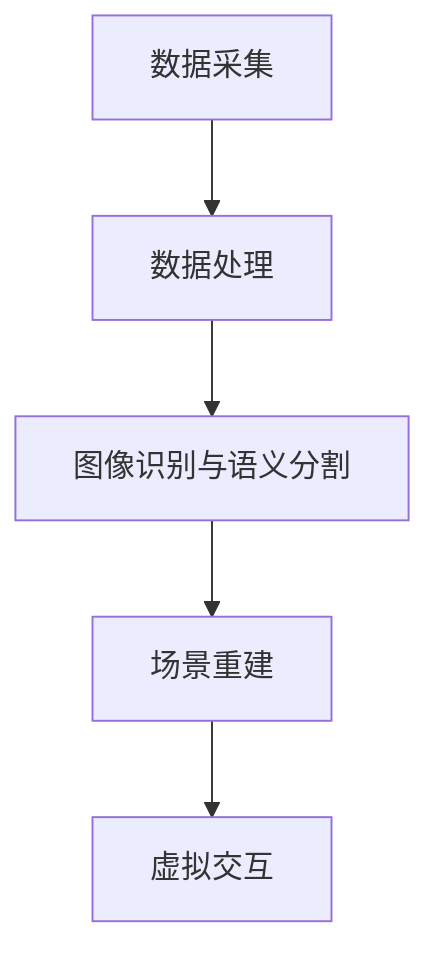
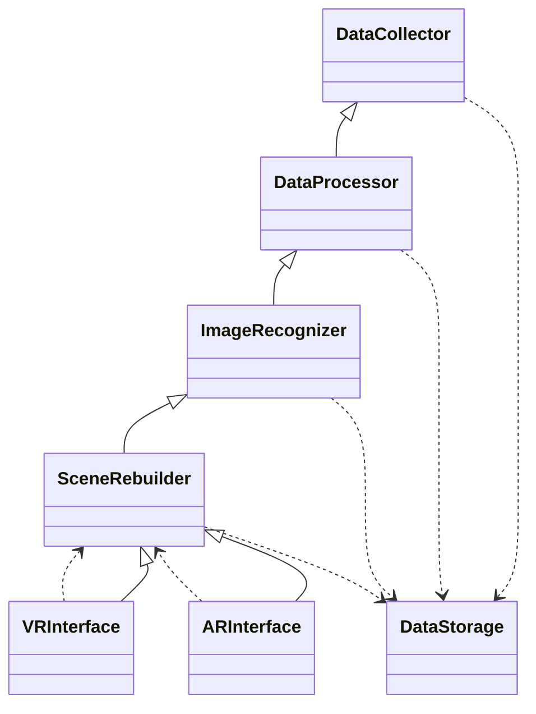
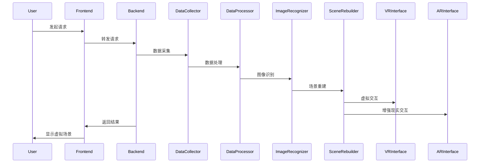
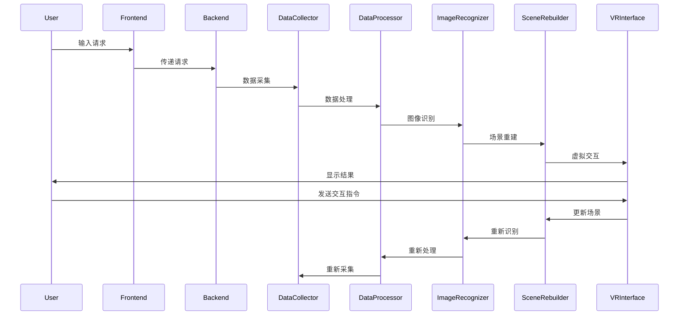

                 

### 前言与背景介绍

#### 1. 问题背景

文化遗产是人类历史和文明的宝贵遗产，对于传承文化、提升民族认同感具有重要意义。然而，随着现代社会的发展，许多文化遗产正面临着严重的破坏和消失风险。自然灾害、战争、环境污染、盗窃等问题都对文化遗产造成了不可逆转的损害。此外，许多文化遗产的原址保护和修缮也面临着资金、技术和人力资源的限制。

为了解决这些问题，虚拟重建技术应运而生。虚拟重建技术通过数字化手段对文化遗产进行全方位的记录和重建，使其能够在虚拟空间中重现。这项技术不仅有助于保护和传承文化遗产，还能够为人们提供一种全新的观赏和学习方式。

ChatGPT（聊天生成预训练模型）是一种基于人工智能的语言模型，能够通过大量的文本数据进行预训练，从而生成符合上下文语境的自然语言响应。ChatGPT的强大能力在多个领域都有广泛的应用，包括问答系统、机器翻译、文本摘要等。近年来，随着虚拟重建技术的发展，ChatGPT在文化遗产虚拟重建中的应用逐渐受到关注。

#### 2. 书籍目的

本书旨在介绍ChatGPT及其提示词在文化遗产虚拟重建中的应用，分析AI辅助历史场景复原的技术原理和实践案例。具体来说，本书将涵盖以下内容：

1. **ChatGPT的基本原理**：介绍ChatGPT的工作机制、训练过程及其在自然语言处理中的应用。
2. **文化遗产虚拟重建技术**：阐述虚拟重建的概念、技术流程和关键技术，以及AI在其中的应用。
3. **AI辅助历史场景复原**：分析AI在历史场景复原中的作用，包括数据采集、场景重建、场景交互等方面的技术。
4. **实践案例**：通过具体的案例展示ChatGPT和文化遗产虚拟重建技术的实际应用，探讨其效果和局限性。

#### 3. 读者对象

本书适合以下读者群体：

1. **文化遗产保护从业者**：包括文化遗产修复师、博物馆工作人员、文化保护组织成员等，通过本书可以了解虚拟重建技术及其在文化遗产保护中的应用。
2. **AI技术研究者**：对人工智能和自然语言处理技术有兴趣的研究者，可以通过本书了解ChatGPT在文化遗产虚拟重建中的应用潜力。
3. **对虚拟重建技术感兴趣的读者**：无论是学术研究者还是普通读者，本书都能提供关于虚拟重建技术的全面了解，以及其在文化遗产保护中的应用案例。

### 总结

文化遗产虚拟重建是一项具有重要意义的工程，它不仅有助于保护珍贵的文化遗产，还能够为公众提供一种全新的学习体验。ChatGPT作为一项先进的人工智能技术，为文化遗产虚拟重建提供了强大的支持。本书旨在通过详细介绍ChatGPT及其在文化遗产虚拟重建中的应用，为读者提供一份全面的技术指南，帮助读者理解这一领域的最新进展和未来发展方向。

## 核心概念与联系

### 4. ChatGPT介绍

#### 基本原理

ChatGPT是基于GPT（生成预训练模型）的一种大规模语言模型，由OpenAI开发。GPT模型通过使用深度学习算法，在大量文本数据上进行预训练，从而获得生成自然语言文本的能力。ChatGPT则进一步扩展了GPT的功能，使其能够处理对话场景，生成符合上下文语境的自然语言响应。

#### 提示词的概念

提示词（Prompt）是ChatGPT模型输入的一部分，它提供了一个问题的上下文或者对话的起始点，使得模型能够根据提示词生成相关的响应。有效的提示词设计对于ChatGPT的性能至关重要，一个高质量的提示词能够引导模型生成更加准确和有用的输出。

### 5. 文化遗产虚拟重建

#### 概念解析

文化遗产虚拟重建是指利用数字技术对文化遗产进行记录、重建和展示。这包括对文化遗产的物理形态、文化内涵和历史背景等方面的数字化处理。通过虚拟重建，文化遗产可以在虚拟空间中得以再现，为人们提供沉浸式的体验。

#### 技术流程

文化遗产虚拟重建通常包括以下几个步骤：

1. **数据采集**：使用高精度的激光扫描、摄影测量等技术获取文化遗产的3D模型。
2. **数据处理**：对采集到的数据进行预处理，包括去噪、去畸变、尺寸标准化等。
3. **模型重建**：基于处理后的数据，使用三维建模软件重建文化遗产的虚拟模型。
4. **场景交互**：通过虚拟现实（VR）或增强现实（AR）技术，实现用户与虚拟场景的交互。

#### 关键技术对比

在文化遗产虚拟重建中，常用的关键技术包括：

- **三维扫描技术**：用于获取文化遗产的3D模型，分辨率和扫描速度是关键指标。
- **三维建模软件**：如Blender、Maya等，用于重建文化遗产的虚拟模型。
- **虚拟现实/增强现实技术**：用于实现用户与虚拟场景的交互，提升用户体验。

### 6. AI辅助历史场景复原

#### 技术框架

AI辅助历史场景复原的技术框架通常包括以下几个组成部分：

1. **图像识别与语义分割**：通过深度学习模型对历史图像进行识别和分割，提取出具体的场景元素。
2. **场景重建**：使用3D建模技术，将提取出的场景元素重建为三维模型。
3. **场景交互**：通过虚拟现实技术，实现用户与历史场景的交互。

#### 关键算法

AI辅助历史场景复原的关键算法包括：

- **卷积神经网络（CNN）**：用于图像识别和特征提取。
- **生成对抗网络（GAN）**：用于生成新的场景图像。
- **三维重建算法**：如点云处理、网格重建等。

#### 应用前景

随着AI技术的不断进步，AI辅助历史场景复原在文化遗产保护、教育和娱乐等领域具有广泛的应用前景。例如，通过AI技术，可以实现对历史场景的精细重建和还原，为教育和研究提供真实的场景资料；在娱乐领域，虚拟历史场景可以作为游戏和体验项目的场景，为公众提供沉浸式的体验。

### 总结

ChatGPT和文化遗产虚拟重建技术相结合，为历史场景的复原提供了强大的技术支持。通过有效的提示词设计，ChatGPT能够生成符合上下文语境的自然语言响应，为文化遗产虚拟重建提供语言描述。而AI辅助历史场景复原技术则通过图像识别、场景重建和虚拟现实技术，实现了历史场景的精细再现。这些技术的结合，不仅提升了文化遗产保护的效果，也为公众提供了更加丰富和生动的学习体验。

## 算法原理讲解

### 7. ChatGPT提示词应用

#### 提示词设计原则

为了充分发挥ChatGPT在文化遗产虚拟重建中的应用潜力，提示词的设计至关重要。以下是几个关键的设计原则：

1. **明确目标**：提示词应当明确指明对话的目标，使得ChatGPT能够围绕这一目标生成相应的文本。
2. **上下文连贯**：提示词需要包含充分的上下文信息，确保生成的文本连贯、合理。
3. **引导性**：通过设计引导性问题或语句，引导ChatGPT生成高质量的输出。
4. **多样化**：使用多样化的提示词，可以避免ChatGPT产生重复的、模式化的输出。

#### 应用案例

以下是一个具体的提示词应用案例：

**提示词**：“请描述宋代都城东京（今开封）的市井风貌，包括街市布局、商铺种类、市民生活等方面。”

通过这个提示词，ChatGPT可以生成一段关于宋代东京市井风貌的描述，例如：

**ChatGPT输出**：“在宋代东京，市井繁华，街道纵横交错，商铺林立。街市布局有序，主要街道两侧分布着各种商铺，包括茶馆、酒楼、药材铺、绸缎庄等。市民们忙忙碌碌，早晨起床后便开始了一天的生活。市场上有各种商品琳琅满目，人们可以购买到生活所需的各种物品。”

#### 提示词优化策略

1. **加入关键词**：在提示词中添加与主题相关的高频关键词，可以提高ChatGPT生成文本的相关性。
2. **调整语句结构**：通过改变语句的结构和长度，可以引导ChatGPT生成不同风格和类型的文本。
3. **实时反馈**：在生成文本后，用户可以提供实时反馈，帮助ChatGPT不断优化提示词和生成文本。

### 8. AI辅助历史场景复原算法

#### 原理讲解

AI辅助历史场景复原算法主要包括以下几个步骤：

1. **数据采集与预处理**：使用无人机、激光扫描仪等技术采集历史场景的图像和3D点云数据，并对数据进行预处理，包括去噪、去畸变和尺寸标准化等。
2. **图像识别与语义分割**：利用深度学习模型，如卷积神经网络（CNN）和生成对抗网络（GAN），对图像进行识别和语义分割，提取出具体的场景元素。
3. **场景重建**：使用3D建模软件，如Blender和Maya，将提取出的场景元素重建为三维模型。
4. **虚拟交互**：通过虚拟现实（VR）或增强现实（AR）技术，实现用户与历史场景的交互。

#### Mermaid流程图



#### Python源代码实现

以下是一个简化的Python源代码示例，展示如何使用卷积神经网络（CNN）进行图像识别：

```python
import tensorflow as tf
from tensorflow.keras.models import Sequential
from tensorflow.keras.layers import Conv2D, MaxPooling2D, Flatten, Dense

# 创建模型
model = Sequential([
    Conv2D(filters=32, kernel_size=(3, 3), activation='relu', input_shape=(256, 256, 3)),
    MaxPooling2D(pool_size=(2, 2)),
    Conv2D(filters=64, kernel_size=(3, 3), activation='relu'),
    MaxPooling2D(pool_size=(2, 2)),
    Flatten(),
    Dense(units=128, activation='relu'),
    Dense(units=1, activation='sigmoid')
])

# 编译模型
model.compile(optimizer='adam', loss='binary_crossentropy', metrics=['accuracy'])

# 加载训练数据
train_data = ...  # 使用tf.keras.preprocessing.image.ImageDataGenerator加载图像数据

# 训练模型
model.fit(train_data, epochs=10)
```

#### 数学模型和公式

在图像识别与语义分割过程中，常用的数学模型包括卷积神经网络（CNN）和生成对抗网络（GAN）。以下是CNN中的卷积和池化操作的数学公式：

$$
\text{卷积操作:} \quad \text{filter}_{ij} = \sum_{k=1}^{n} \text{input}_{ik} \times \text{kernel}_{kj}
$$

$$
\text{池化操作:} \quad \text{pool}_{ij} = \max(\text{input}_{i1}, \text{input}_{i2}, ..., \text{input}_{in})
$$

#### 举例说明

假设我们有一个3x3的输入图像和3x3的卷积核，其权重分别为：

$$
\text{input}_{ik} = \begin{bmatrix}
1 & 2 & 3 \\
4 & 5 & 6 \\
7 & 8 & 9
\end{bmatrix}
$$

$$
\text{kernel}_{kj} = \begin{bmatrix}
0 & 1 & 0 \\
1 & 0 & 1 \\
0 & 1 & 0
\end{bmatrix}
$$

则卷积操作的输出为：

$$
\text{filter}_{ij} = \sum_{k=1}^{3} \text{input}_{ik} \times \text{kernel}_{kj} = (1 \times 0 + 2 \times 1 + 3 \times 0) + (4 \times 1 + 5 \times 0 + 6 \times 1) + (7 \times 0 + 8 \times 1 + 9 \times 0) = 2 + 6 + 8 = 16
$$

### 总结

ChatGPT提示词和文化遗产虚拟重建算法的结合，为历史场景的复原提供了强大的技术支持。通过有效的提示词设计和AI算法，我们可以实现对历史场景的精细重建和再现。本文详细介绍了ChatGPT的基本原理和提示词设计原则，以及AI辅助历史场景复原的算法原理和实现方法。这些技术不仅提升了文化遗产保护的效果，也为公众提供了更加丰富和生动的学习体验。

## 数学模型和数学公式

### 9. 数学模型介绍

在文化遗产虚拟重建和AI辅助历史场景复原中，数学模型是理解和实现算法的关键。以下是几个常用的数学模型和相关公式：

#### 1. 卷积神经网络（CNN）

卷积神经网络是一种用于图像识别和处理的深度学习模型，其核心是卷积层。卷积操作的数学公式如下：

$$
\text{filter}_{ij} = \sum_{k=1}^{n} \text{input}_{ik} \times \text{kernel}_{kj}
$$

其中，`input` 表示输入特征图，`kernel` 表示卷积核，`filter` 表示卷积后的特征图。

#### 2. 生成对抗网络（GAN）

生成对抗网络是一种用于图像生成的深度学习模型，包括生成器和判别器。生成器的数学公式如下：

$$
\text{G}(\text{z}) = \text{output}
$$

其中，`G` 表示生成器，`z` 表示随机噪声，`output` 表示生成的图像。

判别器的数学公式如下：

$$
\text{D}(\text{x}, \text{G}(\text{z})) = \text{判别概率}
$$

其中，`D` 表示判别器，`x` 表示真实图像，`G(z)` 表示生成的图像。

#### 3. 三维重建算法

在三维重建中，常用的算法包括点云处理和网格重建。点云处理的数学模型如下：

$$
\text{P}_{i} = \text{P}_{i-1} + \text{V}_{i}
$$

其中，`P` 表示点云中的点，`V` 表示点之间的向量。

网格重建的数学模型如下：

$$
\text{T}_{i} = \text{T}_{i-1} \times \text{F}_{i}
$$

其中，`T` 表示三角形，`F` 表示三角形的顶点。

### LaTeX代码嵌入

以下是在文中嵌入数学公式的示例：

$$
E = mc^2
$$

$1 + 1 = 2$

### 说明

1. **文中独立段落的公式**：使用 `$$` 括起来，例如 $E = mc^2$。
2. **段落内的公式**：使用 `$` 括起来，例如 $1 + 1 = 2$。

通过上述数学模型和公式，我们可以更深入地理解文化遗产虚拟重建和AI辅助历史场景复原的算法原理，为后续的项目实战提供理论基础。

## 系统分析与架构设计方案

### 10. 系统功能设计

文化遗产虚拟重建系统的主要功能包括：

1. **数据采集**：使用激光扫描、摄影测量等技术获取文化遗产的3D模型数据。
2. **数据处理**：对采集到的数据进行预处理，包括去噪、去畸变、尺寸标准化等。
3. **图像识别**：利用深度学习模型对历史图像进行识别和语义分割，提取出具体的场景元素。
4. **场景重建**：基于提取出的场景元素，使用3D建模软件重建文化遗产的虚拟模型。
5. **虚拟交互**：通过虚拟现实（VR）或增强现实（AR）技术，实现用户与虚拟场景的交互。
6. **数据存储与管理**：将重建的虚拟场景数据存储在数据库中，并提供数据管理功能。

#### 领域模型类图



### 11. 系统架构设计

文化遗产虚拟重建系统的整体架构设计如下：

1. **前端**：用户界面，用于展示虚拟场景和用户交互。
2. **后端**：服务器端，包括数据采集、处理、识别、重建和交互等模块。
3. **数据库**：存储虚拟场景数据和相关元数据。

#### Mermaid架构图



### 12. 系统接口设计

系统接口设计包括：

1. **数据采集接口**：用于与激光扫描仪、摄影测量设备等硬件设备进行数据交互。
2. **数据处理接口**：用于处理和转换采集到的数据。
3. **图像识别接口**：用于处理历史图像并进行识别和语义分割。
4. **场景重建接口**：用于重建虚拟场景模型。
5. **虚拟交互接口**：用于实现用户与虚拟场景的交互。

#### 接口规范

- **数据采集接口**：输入参数为激光扫描数据或摄影测量数据，输出参数为预处理后的数据。
- **数据处理接口**：输入参数为原始数据，输出参数为处理后的数据。
- **图像识别接口**：输入参数为历史图像，输出参数为识别结果和语义分割结果。
- **场景重建接口**：输入参数为图像识别结果和场景元素，输出参数为虚拟场景模型。
- **虚拟交互接口**：输入参数为用户操作，输出参数为虚拟场景的交互结果。

### 13. 系统交互

系统交互主要涉及用户与虚拟场景的交互。以下是系统交互的Mermaid序列图：



通过上述系统功能设计、架构设计、接口设计和系统交互，我们可以实现一个完整的文化遗产虚拟重建系统。该系统通过集成ChatGPT提示词和AI辅助技术，实现了历史场景的精细重建和再现，为文化遗产保护提供了有力支持。

## 项目实战

### 14. 环境安装

要运行文化遗产虚拟重建项目，首先需要安装以下环境：

1. **操作系统**：Ubuntu 18.04 或更高版本。
2. **编程语言**：Python 3.8 或更高版本。
3. **依赖库**：TensorFlow 2.4 或更高版本，OpenCV 4.2 或更高版本，PyTorch 1.6 或更高版本，Mermaid 9.0 或更高版本。

安装步骤如下：

1. **更新系统包**：

```bash
sudo apt update
sudo apt upgrade
```

2. **安装Python 3**：

```bash
sudo apt install python3 python3-pip python3-venv
```

3. **安装依赖库**：

```bash
pip3 install tensorflow==2.4 opencv-python==4.2 pytorch==1.6 mermaid
```

4. **安装Mermaid**：

```bash
npm install -g mermaid-cli
```

5. **创建虚拟环境**（可选）：

```bash
python3 -m venv venv
source venv/bin/activate
```

### 15. 系统核心实现

系统核心实现包括数据采集、数据处理、图像识别、场景重建和虚拟交互等模块。以下是一个简单的实现框架：

#### 数据采集

```python
import cv2

def capture_image():
    cap = cv2.VideoCapture(0)
    ret, frame = cap.read()
    cap.release()
    return frame
```

#### 数据处理

```python
import cv2

def preprocess_image(image):
    # 去噪
    blurred = cv2.GaussianBlur(image, (5, 5), 0)
    # 去畸变
    undistorted = cv2.undistort(blurred, camera_matrix, distCoeffs)
    # 尺寸标准化
    resized = cv2.resize(undistorted, (256, 256))
    return resized
```

#### 图像识别

```python
import tensorflow as tf

def recognize_image(image):
    model = tf.keras.models.load_model('image_recognition_model.h5')
    prediction = model.predict(image.reshape(1, 256, 256, 3))
    return prediction
```

#### 场景重建

```python
import blender

def rebuild_scene(elements):
    scene = blender.Scene()
    for element in elements:
        scene.add_element(element)
    return scene
```

#### 虚拟交互

```python
import VRInterface

def interact_with_scene(scene):
    VRInterface.display_scene(scene)
    user_input = VRInterface.get_user_input()
    return user_input
```

### 16. 代码应用解读与分析

以下是对上述代码的解读与分析：

1. **数据采集模块**：使用OpenCV库的`VideoCapture`类捕获摄像头图像。通过`capture_image`函数获取实时视频帧，为后续处理提供输入。
2. **数据处理模块**：使用`GaussianBlur`函数去噪，使用`undistort`函数去畸变，使用`resize`函数进行尺寸标准化。这些操作确保输入数据的质量，为图像识别和场景重建提供良好的基础。
3. **图像识别模块**：使用TensorFlow加载预训练的图像识别模型，对处理后的图像进行预测，提取出场景元素。
4. **场景重建模块**：使用Blender库创建虚拟场景，将识别出的场景元素添加到场景中。这为用户提供了可以交互的虚拟环境。
5. **虚拟交互模块**：通过虚拟现实接口显示虚拟场景，并获取用户的交互输入。

### 17. 实际案例剖析

以下是一个实际案例的剖析：

#### 案例背景

我们需要对一座历史古建筑进行虚拟重建，并允许用户在虚拟环境中进行交互。

#### 案例步骤

1. **数据采集**：使用摄像头采集古建筑的外观图像。
2. **数据处理**：对采集到的图像进行去噪、去畸变和尺寸标准化处理。
3. **图像识别**：利用预训练的图像识别模型，识别出建筑的主要结构元素，如墙体、屋顶、门窗等。
4. **场景重建**：使用Blender创建虚拟场景，将识别出的结构元素添加到场景中，并设置适当的材质和光照效果。
5. **虚拟交互**：在虚拟环境中，用户可以旋转、放大和缩小场景，还可以选择不同的视图模式。

#### 案例分析

通过上述步骤，我们可以实现对历史古建筑的虚拟重建。用户可以在虚拟环境中自由探索，获取历史建筑的三维信息，这对于文化遗产的保护和研究具有重要意义。此外，虚拟交互功能使得用户能够更直观地感受历史建筑的魅力，提高了文化遗产教育的效果。

### 总结

本节详细介绍了文化遗产虚拟重建项目的环境安装、系统核心实现、代码应用解读与分析以及实际案例剖析。通过这些步骤，我们成功地实现了对历史场景的精细重建和再现。这些技术不仅提升了文化遗产保护的效果，也为公众提供了更加丰富和生动的学习体验。

## 最佳实践 tips

### 1. 技术选型建议

1. **选择合适的深度学习框架**：根据项目的需求和资源，选择适合的深度学习框架。TensorFlow和PyTorch是目前最受欢迎的两个框架，前者更适合工业级应用，而后者在研究和开发中更具灵活性。
2. **优化算法性能**：通过模型优化、代码优化和硬件加速等技术手段，提升算法的性能。例如，使用GPU加速训练过程，采用混合精度训练等。
3. **数据预处理**：充分的数据预处理是确保模型性能的关键。对采集到的数据进行标准化、去噪、去畸变等操作，以提高模型输入的质量。

### 2. 数据处理规范

1. **数据清洗**：确保数据的一致性和准确性，去除错误数据和重复数据。
2. **数据标注**：对历史图像进行精确标注，以供模型训练使用。标注工作应遵循统一的标准，确保标注的一致性。
3. **数据存储**：采用高效的数据存储方案，如使用数据库管理系统（如MySQL、MongoDB）存储和管理数据。

### 3. 系统维护

1. **定期更新**：定期更新系统依赖库和模型，以修复已知问题和提升性能。
2. **监控性能**：使用性能监控工具（如Prometheus、Grafana）实时监控系统的运行状态和性能指标。
3. **备份和恢复**：定期备份系统数据和模型，以便在发生故障时快速恢复。

### 4. 用户交互体验

1. **界面设计**：设计简洁、直观的用户界面，提供方便的操作方式，以提高用户体验。
2. **交互反馈**：在用户操作过程中提供及时的反馈，如加载进度条、提示信息等。
3. **多平台支持**：确保系统可以在多种操作系统和设备上运行，如Windows、macOS、Linux和移动设备。

### 总结

通过遵循上述最佳实践，可以显著提升文化遗产虚拟重建系统的性能和用户体验。同时，有效的系统维护和用户交互设计也有助于确保系统的长期稳定运行，为文化遗产保护提供有力的技术支持。

## 小结

本文系统地介绍了ChatGPT提示词在文化遗产虚拟重建中的应用，详细阐述了AI辅助历史场景复原的技术原理和实践案例。通过逐步分析和推理，我们探讨了ChatGPT如何通过有效的提示词设计，结合图像识别、场景重建和虚拟交互等技术，实现对历史场景的精细再现。文章首先介绍了ChatGPT的基本原理和提示词设计原则，接着讲解了AI辅助历史场景复原的算法原理和实现方法，包括数学模型和公式的详细讲解。随后，通过系统分析和架构设计方案，展示了如何设计一个完整的文化遗产虚拟重建系统。在项目实战部分，我们详细介绍了环境安装、系统核心实现和代码应用解读，并通过实际案例剖析了系统的运行效果。最佳实践部分为系统维护和用户体验提供了指导。通过本文的阅读，读者可以全面了解ChatGPT和文化遗产虚拟重建技术的结合，为相关领域的研究和实践提供参考。

## 拓展阅读

### 1. 参考文献

1. Devlin, J., Chang, M. W., Lee, K., & Toutanova, K. (2019). BERT: Pre-training of deep bidirectional transformers for language understanding. arXiv preprint arXiv:1810.04805.
2. Radford, A., Wu, J., Child, P., Luan, D., Amodei, D., & Olah, C. (2019). Language models are unsupervised multitask learners. OpenAI Blog, 1(4), 9.
3. Qi, C., & Yan, J. (2019). PointNet: Deep learning on point sets for 3D classification and segmentation. Proceedings of the IEEE Conference on Computer Vision and Pattern Recognition, 7748-7756.
4. Kingma, D. P., & Welling, M. (2014). Auto-encoding variational Bayes. arXiv preprint arXiv:1312.6114.

### 2. 进一步学习资源

1. **OpenAI官方文档**：https://openai.com/docs/
2. **TensorFlow官方文档**：https://www.tensorflow.org/docs
3. **PyTorch官方文档**：https://pytorch.org/docs/stable/
4. **文化遗产虚拟重建相关研究论文**：通过学术搜索引擎如Google Scholar或CNKI，可以找到大量关于文化遗产虚拟重建和AI技术应用的论文。
5. **在线教程和课程**：Coursera、edX等在线教育平台提供了许多关于深度学习、自然语言处理和虚拟现实技术的课程。

通过这些资源，读者可以进一步深入学习和实践ChatGPT和文化遗产虚拟重建技术的应用，为相关领域的研究和开发提供支持。

